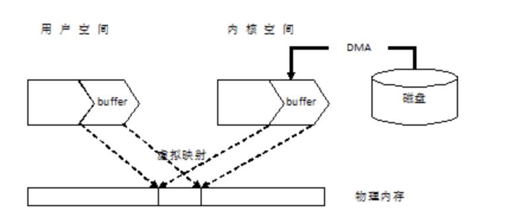

[TOC]

# Java IO 基础

流是一组有顺序的，有起点和终点的字节集合，是对数据传输的总称或抽象。即数据在两设备间的传输称为流，**流的本质是数据传输**，根据数据传输特性将流抽象为各种类，方便更直观的进行数据操作。

<small>参考： https://www.cnblogs.com/QQ846300233/p/6046388.html</small>

* 字节流 InputStream/OutStream

字节流能处理所有类型的数据（如图片、avi等），而字符流只能处理字符类型的数据。

* 字符流 Reader/Writer

# How Java I/O Works Internally at Lower Level?

## 缓冲区

计算机访问外部设备或文件，要比直接访问内存慢的多。如果我们每次调用`read()`方法或者`writer()`方法访问外部的设备或文件，CPU就要花上最多的时间是在等外部设备响应，而不是数据处理。为此，我们开辟一个内存缓冲区的内存区域，程序每次调用read()方法或writer()方法都是读写在这个缓冲区中。当这个缓冲区被装满后，系统才将这个缓冲区的内容一次集中写到外部设备或读取进来给CPU。使用缓冲区可以有效的提高CPU的使用率，能提高整个计算机系统的效率。在字符流操作中，所有的字符都是在内存中形成的，在字符流输出前都将保存在内存中的缓冲区内。

## 缓冲流

在读写数据时，让数据在缓冲区能减少系统实际对原始数据来源的存取次数，因为一次能做多个数据单位的操作，相较而言，对于从文件读取数据或将数据写入文件，比起缓冲区的读写要慢多了。所以使用有缓冲区的流，一般都会比没有缓冲区的流效率更高，拥有缓冲区的流别称为缓冲流，包括BufferedInputStream、BufferedOutputStream类和BufferedReader、BufferedWriter类。缓冲流把数据从原始流成块读入或把数据积累到一个大数据块后再成批写出，通过减少通过资源的读写次数来加快程序的执行

## 用户空间,内核空间，磁盘

在磁盘空间和用户空间中加一个内核空间的缓存区的原因有两个：

1. 一个是用户空间的程序不能直接去磁盘空间中读取数据，必须由经由内核空间通过DMA来获取;
2. 另一个原因是一般用户空间的内存分页与磁盘空间不会对齐，因此需要由内核空间在中间做一层处理。

目前的操作系统，用户空间和内核空间的区分一般采用虚拟内存来实现，因此用户空间和内存空间都是在虚拟内存中。使用虚拟内存无非是因为其两大优势：一是它可以使多个虚拟内存地址指向同一个物理内存;二是虚拟内存的空间可以大于物理内存的空间。

<small>参考： https://blog.csdn.net/u012129558/article/details/82878994</small>

* 当用户空间所需要的数据在内核空间中已经存在，那么内核无需再次向磁盘控制硬件发起`系统调用`，直接**对内核缓冲区进行复制**，这些数据成为高速缓存，当然内核也可以预读取用户空间需要的数据。

* 用户空间通常是常规进程所在区域，即非特权区域，不能直接访问磁盘硬件设备；

* 使用虚拟内存**省去了用户空间和内存空间的数据往来拷贝**，但缓冲区的大小必须是磁盘数据块的倍数，用户空间和内核空间也必须使用相同的页对其方式。

## 文件IO

文件系统是安排、解释磁盘数据的一种独特方式，文件系统定义了文件名、路径、文件、文件属性等一系列抽象概念。

当用户进程请求文件数据时，文件系统需要确定数据在磁盘什么位置，然后将相关磁盘分区读进内存。

### 内存映射文件

由一个文件到一块内存的映射；文件的数据就是这块区域内存中对应的数据，读写文件中的数据，直接对这块区域的地址操作，就可以，减少了内存复制的环节。

使用内存映射文件处理存储于磁盘上的文件时，将不必再对文件执行I/O操作，这意味着在对文件进行处理时将不必再为文件申请并分配缓存，所有的文件缓存操作均由系统直接管理，由于取消了将文件数据加载到内存、数据从内存到文件的回写以及释放内存块等步骤，使得内存映射文件在处理大数据量的文件时能起到相当重要的作用。
