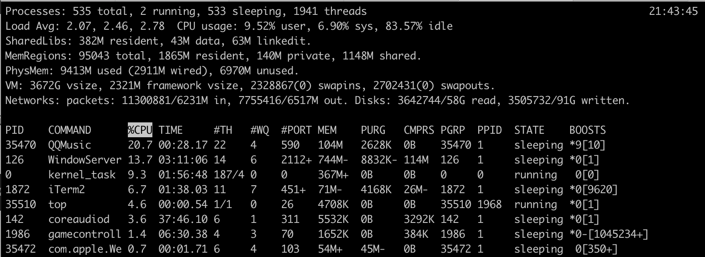

[TOC]

# CPU利用率&负载

## 负载的几个理解

**Load Average**是与机器内核数有关的。以一个单核的机器为例，load=0.5表示CPU还有一半的资源可以处理其他的线程请求，load=1表示CPU所有的资源都在处理请求，没有剩余的资源可以利用了，而load=2则表示CPU已经超负荷运作，另外还有一倍的线程正在等待处理。所以，对于单核机器来说，理想状态下，Load Average要小于1。同理，对于双核处理器来说，Load Average要小于2。即多核处理器中，Load Average不应该高于处理器核心的总数量。

**平均负载**是指上一分钟同时处于就绪状态的平均进程数。在CPU中可以理解为CPU可以并行处理的任务数量，就是CPU个数X核数。如果CPU Load等于CPU`个数`乘`核数`，那么就说CPU正好满负载，再多一点，可能就要出问题了，有些任务不能被及时分配处理器，那要保证性能的话，最好要小于CPU`个数*核数*0.7`。

Load Average是指CPU的Load。它所包含的信息是在一段时间内CPU正在处理及等待CPU处理的进程数之和的统计信息，也就是CPU使用队列的长度的统计信息。

## 对于cpu负载的理解的几个问题

1. 系统load高不一定是性能有问题,因为Load高也许是因为在进行cpu密集型的计算

2. 系统Load高不一定是cpu能力问题或数量不够, 因为Load高只是代表需要运行的队列累计过多了。但队列中的任务实际可能是耗cpu的，也可能是高I/O导致内存不足等其它问题。因为I/O负载较高的服务器更容易出现并发线程数升高，cpu上升等问题。

3. 系统长期Load高，解决办法不是一味地首先增加cpu(扩容操作)；因为Load只是表象，不是实质。增加CPU个别情况下会临时看到Load下降，但治标不治本，需要观察。

4. 在Load average高的情况下需要鉴别系统瓶颈到底是CPU不足，还是I/O不够快造成或是内存不足造成的。

## top命令

top命令如下：

`Load Avg: 2.91, 2.60, 2.75`,通常的理解：三个数分别代表不同时间段的系统平均负载（一分钟、五分钟、以及十五分钟），数字越小越好负载越低，数字越高说明服务器的负载越大，可能是服务器出现某些问题了；

* us（user cpu time）：用户态使用的cpu时间比。该值较高时，说明用户进程消耗的 CPU 时间比较多，比如，如果该值长期超过 50%，则需要对程序算法或代码等进行优化。
* sy（system cpu time）：系统态使用的cpu时间比。
* ni（user nice cpu time）：用做nice加权的进程分配的用户态cpu时间比
* id（idle cpu time）：空闲的cpu时间比。如果该值持续为0，同时sy是us的两倍，则通常说明系统则面临着 CPU 资源的短缺。
* wa（wait）：等待使用CPU的时间。
* hi（hardware irq）：硬中断消耗时间
* si（software irq）：软中断消耗时间
* st（steal time）：虚拟机偷取时间
