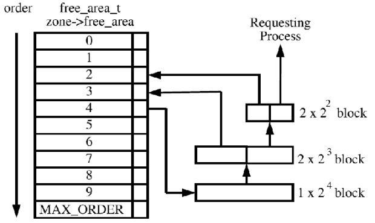

[TOC]

# 物理内存管理算法

## 内存碎片

按照碎片的位置和产生原因，内存碎片分为外部碎片和内部碎片，如下图


* 外部碎片是进程与进程间未分配的内存空间，外部碎片的出现和进程频繁的分配和释放内存有直接关系
* 内部碎片主要因为分配器粒度问题以及一些地址限制导致实际分配的内存大于所需内存，这样在进程内部就会出现内存空洞

### 外部内存碎片问题


## 伙伴(buddy)算法

### 解决外部碎片的思路

第一种思路：把已经存在的外部碎片通过新的技术把这些非连续的空闲内存映射到连续的线性空间，其实相当于没有去降低外部碎片的产生而是治理型方案，但是这种方案在真实需要连续物理内存时是无效的。

第二种思路：把这些小的空闲的不连续内存记录在案，如果有新的分配需求就从中搜索合适的将空闲内存分配出去，这样就避免了在新的区域进行分配内存，有种变废为宝的感觉，其实这样场景也很熟悉：当你想吃一包饼干时，你妈妈肯定会说先把之前剩下一半没吃完的吃掉，不要先开新的了。

### 伙伴系统的核心思想


上图中，首先我们假设我们一个内存块有1024K，当我们需要给A分配70K内存的时候

1. 我们发现1024K的一半大于70K，然后我们就把1024K的内存分成两半，一半512K。
2. 然后我们发现512K的一半仍然大于70K，于是我们再把512K的内存再分成两半，一半是128K。
3. 此时，我们发现128K的一半小于70K，于是我们就分配为A分配128K的内存。
后面的，B，C，D都这样，而释放内存时，则会把相邻的块一步一步地合并起来（即释放的时候，会检查旁边的伙伴是否也已经释放了，如果释放了就合并在一起，变成大的空闲内存）。

二叉树的感觉，其中伙伴的概念如下：

* 两个块大小相同；
* 两个块地址连续；
* 两个块必须是同一个大块中分离出来的；

### 具体实现

* mmzone.h

```cpp
#define MAX_ORDER 11

struct zone {
  ……
	struct free_area	free_area[MAX_ORDER];
	……
}

struct free_area {
	struct list_head	free_list[MIGRATE_TYPES];
	unsigned long		nr_free;//该组类别块空闲的个数
};
```

把所有的空闲页框分组为11个链表，每个链表分别包含数目1、2、4、8、16、32、64、128、256、512和1024个连续的页框。由此可见，伙伴算法支持的最大请求是对应4MB大小的连续物理RAM块(一页4K,1k页即4M)。



举例来说：要分配256个连续页框（1MB），会先到256个页框的链表中查找空闲块，若有直接返回，若没有，去512个页框的链表中进行查找，将512个页框分为两部分，一部分返回，一部分插入256大小的链表中，若512大小的链表中还没有，到1024大小的链表中查找，取出256大小的块，将剩下的512,256的块分别插入到各个链表中，内存释放的过程则是相反的。当然，如果一直查找到1024个页框的链表，发现链表是空，则直接放弃并返回错误。

从代码逻辑上可以这么理解：假如系统需要4=(2*2)个页面大小的内存块，该算法就到free_area[2]中查找，如果链表中有空闲块，就直接从中摘下并分配出去。如果没有，算法将顺着数组向上查找free_area[3],如果free_area[3]中有空闲块，则将其从链表中摘下，分成等大小的两部分，前四个页面作为一个块插入free_area[2]，后4个页面分配出去，free_area[3]中也没有，就再向上查找，如果free_area[4]中有，就将这16(2*2*2*2)个页面等分成两份，前一半挂如free_area[3]的链表头部，后一半的8个页等分成两等分，前一半挂free_area[2]的链表中，后一半分配出去。假如free_area[4]也没有，则重复上面的过程，知道到达free_area数组的最后，如果还没有则放弃分配。

### 优缺点

优点：解决外部碎片问题，尽量分配连续的页面，简单易行。
缺点：容易造成内存浪费，比如请求9K的内存，却要到16K的链表上找，尽管剩下的7K会下放到后面数组中，频繁的合并占用内存。

## slab算法

从伙伴系统的介绍可以知道其分配的最小单位是`4KB`的页框，这对于一些频繁申请的小到几十字节的内存来说还是十分浪费的，所以我们需要更细粒度的分配器，这就是slab分配器。

slab分配器并不是和伙伴系统分立的，而是建立在伙伴系统之上

mem_cache是一个cache_chain的链表，描述了一个高速缓存，每个高速缓存包含了一个slabs的列表，这通常是一段连续的内存块，存在3种slab：


* slabs_full：链表中slab已经完全分配出去
* slabs_partial：链表中的slab部分已经被分配出去了
* slabs_empty: 链表中的slab都是空闲的 也就是可以被回收

工作流程：

* 首先要查看inode_cachep的slabs_partial链表，如果slabs_partial非空，就从中选中一个slab，返回一个指向已分配但未使用的inode结构的指针。完事之后，如果这个slab满了，就把它从slabs_partial中删除，插入到slabs_full中去，结束；
* 如果slabs_partial为空，也就是没有半满的slab，就会到slabs_empty中寻找。如果slabs_empty非空，就选中一个slab，返回一个指向已分配但未使用的inode结构的指针，然后将这个slab从slabs_empty中删除，插入到slabs_partial（或者slab_full）中去，结束；
* 如果slabs_empty也为空，那么没办法，cache内存已经不足，只能新创建一个slab了。

形象类比：

```cpp
牛奶场商 ---> 伙伴系统
超市:存储着很多箱牛奶 ---> partial链表
牛奶箱 ---> slab 缓存池
牛奶 ---> 具体对象（拿一个牛奶就是分配一个内存）
```
