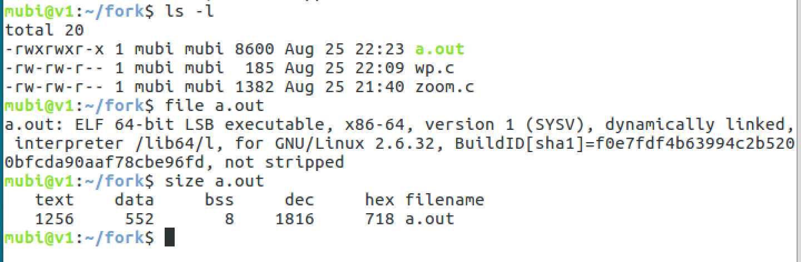
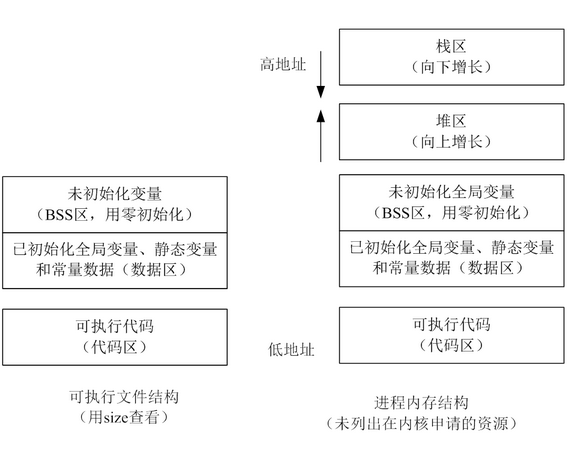
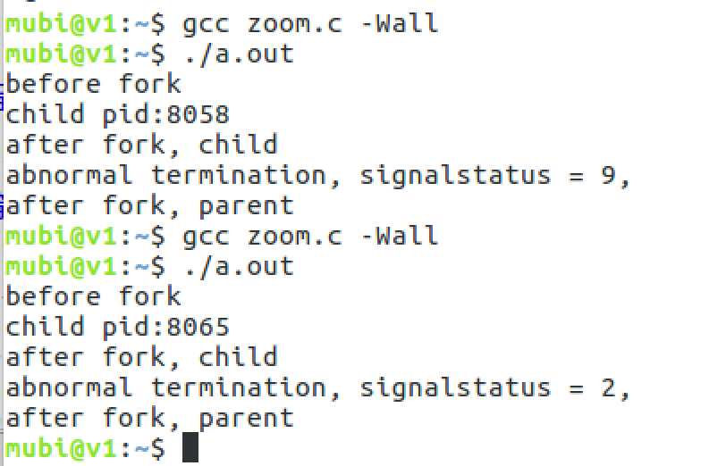
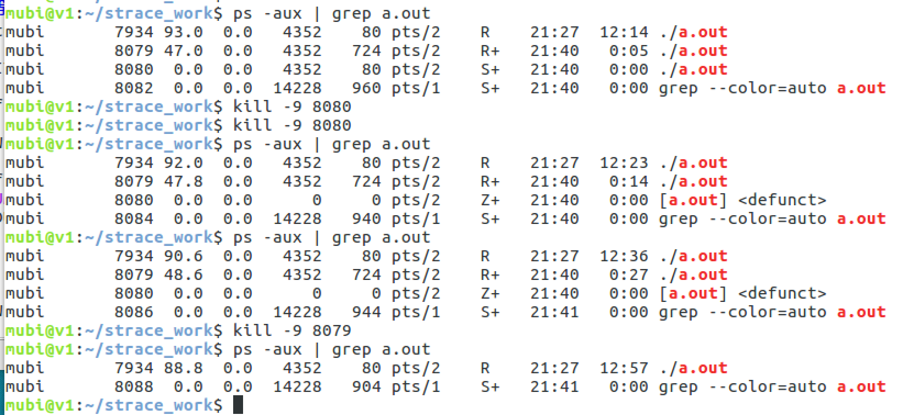
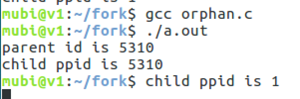
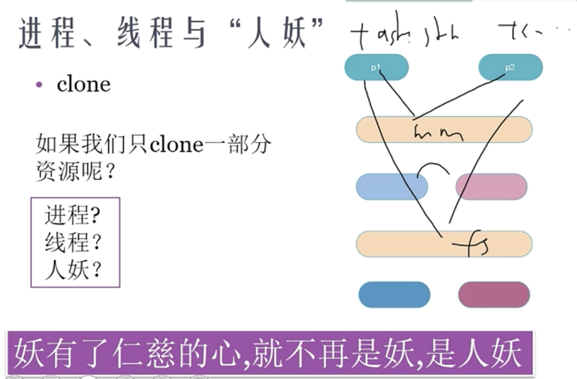
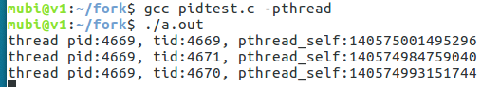
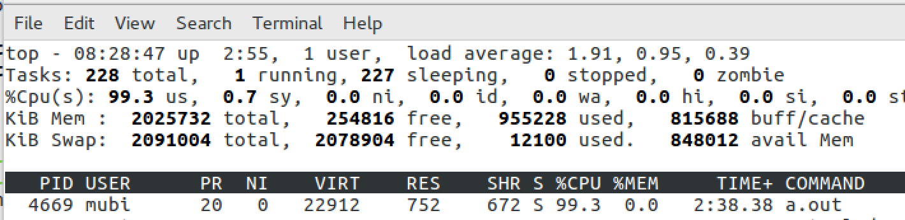
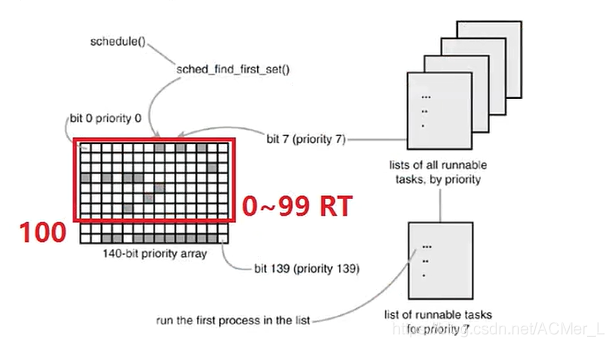

[TOC]

# 进程与线程

现代操作系统中，进程支持多线程

* 进程是<font color='red'>资源管理</font>的最小单元，作为资源分配的基本单位
* 线程是<font color='red'>程序执行</font>的最小单元，作为调度和分配的基本单位

一个进程的组成实体可以分为两大部分：<font color='red'>线程集</font>和<font color='red'>资源集</font>；进程中的线程是动态的对象：代表了进程指令的执行；进程中的资源，包括了地址空间，打开的文件，用户信息等，这些资源被进程中的资源所共享。

## 为什么要有线程？

* 有非常多原因，当中主要原因是进一步提高系统的并发性。

在很多应用中同一时候发生着多种活动，某些活动随着时间的推移会被堵塞。通过将这些应用程序分解成可并行执行的多个顺序程序，程序设计会变得更简单。

以下列出几个促使多线程产生的主要原因：

1. 线程是并行实体，共享同一个地址空间和全部数据的能力，这是多进程模型没有的
2. 线程比进程更轻量级，比进程更easy（更快）创建和撤销，在有大量线程须要修改和高速修改时，这一特性是十分重要的
3. 若多个线程都是CPU密集型的，多线程那么并不能获得性能上的增强；可是假设存在着大量的计算和大量的I/O处理，拥有多个线程同意这些活动彼此重叠进行从而会加快应用程序运行的速度
4. 多线程系统使得真正的并行有了实现的可能，提高了CPU利用率

--- 《现代操作系统 第4版》

## 进程间的通信的几种方式

* 管道（pipe）及命名管道（named pipe）：管道可用于具有亲缘关系的父子进程间的通信，有名管道除了具有管道所具有的功能外，它还允许无亲缘关系进程间的通信；
* 信号（signal）：信号是一种比较复杂的通信方式，用于通知接收进程某个事件已经发生；
* 消息队列：消息队列是消息的链接表，它克服了上两种通信方式中信号量有限的缺点，具有写权限得进程可以按照一定得规则向消息队列中添加新信息；对消息队列有读权限得进程则可以从消息队列中读取信息；
* 共享内存：可以说这是最有用的进程间通信方式。它使得多个进程可以访问同一块内存空间，不同进程可以及时看到对方进程中对共享内存中数据得更新。这种方式需要依靠某种同步操作，如互斥锁和信号量等；
* 信号量：主要作为进程之间及同一种进程的不同线程之间得同步和互斥手段；
套接字：这是一种更为一般得进程间通信机制，它可用于网络中不同机器之间的进程间通信，应用非常广泛。

## 操作系统中进程调度策略有哪几种？

* FCFS(先来先服务，队列实现，非抢占的)：先请求CPU的进程先分配到CPU
* SJF(最短作业优先调度算法)：平均等待时间最短，但难以知道下一个CPU区间长度
* 优先级调度算法(可以是抢占的，也可以是非抢占的)：优先级越高越先分配到CPU，相同优先级先到先服务，存在的主要问题是：低优先级进程无穷等待CPU，会导致无穷阻塞或饥饿；解决方案：老化
时间片轮转调度算法(可抢占的)：队列中没有进程被分配超过一个时间片的CPU时间，除非它是唯一可运行的进程。如果进程的CPU区间超过了一个时间片，那么该进程就被抢占并放回就绪队列。
* 多级队列调度算法：将就绪队列分成多个独立的队列，每个队列都有自己的调度算法，队列之间采用固定优先级抢占调度。其中，一个进程根据自身属性被永久地分配到一个队列中。
* 多级反馈队列调度算法：与多级队列调度算法相比，其允许进程在队列之间移动：若进程使用过多CPU时间，那么它会被转移到更低的优先级队列；在较低优先级队列等待时间过长的进程会被转移到更高优先级队列，以防止饥饿发生。

## 程序和进程

### 可执行文件(磁盘上的静态文件)



此可执行文件在存储时（没有调入到内容）分为：代码区（text）、数据区（data）和未初始化数据区（bss）3 个部分

* text

存放 CPU 执行的机器指令。通常代码区是可共享的（即另外的执行程序可以调用它），使其可共享的目的是对于频繁被执行的程序，只需要在内存中有一份代码即可。代码区通常是只读的，使其只读的原因是防止程序意外地修改了它的指令。另外，代码区还规划了局部变量的相关信息。

代码区的指令包括操作码和操作对象（或对象地址引用）。如果是立即数（即是具体的数值），将直接包含在代码中，如果是局部数据，将在运行时在栈区分配空间，然后再引用该数据的地址，如果是未初始化数据区和数据区，在代码中同样将引用该数据的地址。

* data

该区包含了在程序中明确被初始化的全局变量、已经初始化的静态变量（包括全局静态变量和局部静态变量）和常量数据（如字符串常量）

* bss

存入的是全局未初始化变量和未初始化静态变量。未初始化数据区的数据在程序开始执行之前被内核初始化为 0 或者空（NULL）

### 进程(在机器内存中动态执行的)



* 栈区（stack）: 由编译器自动分配释放，存放函数的参数值、返回值、局部变量等。在程序运行过程中实时加载和释放，因此，局部变量的生存周期为申请到释放该段栈空间。
* 堆区（heap）: 用于动态内存分配。堆在内存中位于BSS区和栈区之间。一般由程序员分配和释放，若程序员不释放，程序结束时有可能由OS回收。

分各个区域的考虑

* 代码段和数据段分开，运行时便于分开加载，更好的流水线操作。
* 代码时依次执行的，是由处理器 PC 指针依次读入，而且代码可以被多个程序共享，数据在整个运行过程中有可能多次被调用，如果将代码和数据混合在一起将造成空间的浪费。
* 临时数据以及需要再次使用的代码在运行时放入栈中，生命周期短，便于提高资源利用率。
* 堆区可以由程序员分配和释放，以便用户自由分配，提高程序的灵活性。

## Linux 进程

### 进程数量是有限制的，不能无限创建线程，如下ubuntu下查看`pid_max`

```java
mubi@v1:~$ cat /proc/sys/kernel/pid_max
131072
```

### 进程树（进程有父子关系）

```java
mubi@v1:~$ pstree
systemd─┬─ModemManager─┬─{gdbus}
        │              └─{gmain}
        ├─NetworkManager─┬─dnsmasq
        │                ├─{gdbus}
        │                └─{gmain}
        ├─accounts-daemon─┬─{gdbus}
        │                 └─{gmain}
        ├─acpid
        ├─agetty
        ├─2*[at-spi-bus-laun─┬─dbus-daemon]
        │                    ├─{dconf worker}]
        │                    ├─{gdbus}]
        │                    └─{gmain}]
        ├─2*[at-spi2-registr─┬─{gdbus}]
        │                    └─{gmain}]
        ├─avahi-daemon───avahi-daemon
        ├─bluetoothd
        ├─colord─┬─{gdbus}
        │        └─{gmain}
        ├─cron
        ├─cups-browsed─┬─{gdbus}
        │              └─{gmain}
        ├─cupsd
        ├─dbus-daemon
        ├─dconf-service─┬─{gdbus}
        │               └─{gmain}
        ├─evolution-addre─┬─evolution-addre─┬─{dconf worker}
        │                 │                 ├─{evolution-addre}
        │                 │                 ├─{gdbus}
        │                 │                 └─{gmain}
        │                 ├─{dconf worker}
        │                 ├─{evolution-addre}
        │                 ├─{gdbus}
        │                 └─{gmain}
        ├─evolution-calen─┬─evolution-calen─┬─{dconf worker}
        │                 │                 ├─2*[{evolution-calen}]
        │                 │                 ├─{gdbus}
        │                 │                 ├─{gmain}
        │                 │                 └─{pool}
        │                 ├─evolution-calen─┬─{dconf worker}
        │                 │                 ├─{evolution-calen}
        │                 │                 ├─{gdbus}
        │                 │                 └─{gmain}
        │                 ├─{dconf worker}
        │                 ├─{evolution-calen}
        │                 ├─{gdbus}
        │                 └─{gmain}
        ├─evolution-sourc─┬─{dconf worker}
        │                 ├─{gdbus}
        │                 └─{gmain}
        ├─fwupd─┬─3*[{GUsbEventThread}]
        │       ├─{fwupd}
        │       ├─{gdbus}
        │       └─{gmain}
        ├─gdm3─┬─gdm-session-wor─┬─gdm-x-session─┬─Xorg
        │      │                 │               ├─dbus-daemon
        │      │                 │               ├─gnome-session-b─┬─gnome-settings-─┬─{dconf worker}
        │      │                 │               │                 │                 ├─{gdbus}
        │      │                 │               │                 │                 ├─{gmain}
        │      │                 │               │                 │                 └─{pool}
        │      │                 │               │                 ├─gnome-shell─┬─ibus-daemon─┬─ibus-dconf─┬─{dconf worker}
        │      │                 │               │                 │             │             │            ├─{gdbus}
        │      │                 │               │                 │             │             │            └─{gmain}
        │      │                 │               │                 │             │             ├─ibus-engine-sim─┬─{gdbus}
        │      │                 │               │                 │             │             │                 └─{gmain}
        │      │                 │               │                 │             │             ├─{gdbus}
        │      │                 │               │                 │             │             └─{gmain}
        │      │                 │               │                 │             ├─{JS GC Helper}
        │      │                 │               │                 │             ├─{JS Sour~ Thread}
        │      │                 │               │                 │             ├─{dconf worker}
        │      │                 │               │                 │             ├─{gdbus}
        │      │                 │               │                 │             ├─{gmain}
        │      │                 │               │                 │             └─{threaded-ml}
        │      │                 │               │                 ├─{dconf worker}
        │      │                 │               │                 ├─{gdbus}
        │      │                 │               │                 └─{gmain}
        │      │                 │               ├─{gdbus}
        │      │                 │               └─{gmain}
        │      │                 ├─{gdbus}
        │      │                 └─{gmain}
        │      ├─gdm-session-wor─┬─gdm-x-session─┬─Xorg
        │      │                 │               ├─dbus-daemon
        │      │                 │               ├─gnome-session-b─┬─deja-dup-monito─┬─{dconf worker}
        │      │                 │               │                 │                 ├─{gdbus}
        │      │                 │               │                 │                 └─{gmain}
        │      │                 │               │                 ├─evolution-alarm─┬─{dconf worker}
        │      │                 │               │                 │                 ├─2*[{evolution-alarm}]
        │      │                 │               │                 │                 ├─{gdbus}
        │      │                 │               │                 │                 └─{gmain}
        │      │                 │               │                 ├─gnome-settings-─┬─{dconf worker}
        │      │                 │               │                 │                 ├─{gdbus}
        │      │                 │               │                 │                 ├─{gmain}
        │      │                 │               │                 │                 └─{pool}
        │      │                 │               │                 ├─gnome-shell─┬─{JS GC Helper}
        │      │                 │               │                 │             ├─{JS Sour~ Thread}
        │      │                 │               │                 │             ├─{dconf worker}
        │      │                 │               │                 │             ├─{gdbus}
        │      │                 │               │                 │             ├─{gmain}
        │      │                 │               │                 │             └─{threaded-ml}
        │      │                 │               │                 ├─gnome-software─┬─{dconf worker}
        │      │                 │               │                 │                ├─{gdbus}
        │      │                 │               │                 │                └─{gmain}
        │      │                 │               │                 ├─ssh-agent
        │      │                 │               │                 ├─tracker-extract─┬─{dconf worker}
        │      │                 │               │                 │                 ├─{gdbus}
        │      │                 │               │                 │                 ├─{gmain}
        │      │                 │               │                 │                 └─10*[{pool}]
        │      │                 │               │                 ├─tracker-miner-a─┬─{gdbus}
        │      │                 │               │                 │                 └─{gmain}
        │      │                 │               │                 ├─tracker-miner-f─┬─{dconf worker}
        │      │                 │               │                 │                 ├─{gdbus}
        │      │                 │               │                 │                 └─{gmain}
        │      │                 │               │                 ├─tracker-miner-u─┬─{gdbus}
        │      │                 │               │                 │                 └─{gmain}
        │      │                 │               │                 ├─update-notifier─┬─{dconf worker}
        │      │                 │               │                 │                 ├─{gdbus}
        │      │                 │               │                 │                 └─{gmain}
        │      │                 │               │                 ├─{dconf worker}
        │      │                 │               │                 ├─{gdbus}
        │      │                 │               │                 └─{gmain}
        │      │                 │               ├─{gdbus}
        │      │                 │               └─{gmain}
        │      │                 ├─{gdbus}
        │      │                 └─{gmain}
        │      ├─{gdbus}
        │      └─{gmain}
        ├─gnome-keyring-d─┬─{gdbus}
        │                 ├─{gmain}
        │                 └─{timer}
        ├─gnome-shell-cal─┬─{dconf worker}
        │                 ├─{gdbus}
        │                 ├─{gmain}
        │                 └─2*[{gnome-shell-cal}]
        ├─gnome-terminal-─┬─4*[bash]
        │                 ├─bash───strace───java───11*[{java}]
        │                 ├─bash───pstree
        │                 ├─{dconf worker}
        │                 ├─{gdbus}
        │                 └─{gmain}
        ├─goa-daemon─┬─{dconf worker}
        │            ├─{gdbus}
        │            ├─{gmain}
        │            └─{goa-daemon}
        ├─goa-identity-se─┬─{gdbus}
        │                 ├─{gmain}
        │                 └─{pool}
        ├─gsd-printer─┬─{gdbus}
        │             └─{gmain}
        ├─gvfs-afc-volume─┬─{gdbus}
        │                 ├─{gmain}
        │                 └─{gvfs-afc-volume}
        ├─gvfs-goa-volume─┬─{gdbus}
        │                 └─{gmain}
        ├─gvfs-gphoto2-vo─┬─{gdbus}
        │                 └─{gmain}
        ├─gvfs-mtp-volume─┬─{gdbus}
        │                 └─{gmain}
        ├─gvfs-udisks2-vo─┬─{gdbus}
        │                 └─{gmain}
        ├─gvfsd─┬─{gdbus}
        │       └─{gmain}
        ├─gvfsd-burn─┬─{gdbus}
        │            └─{gmain}
        ├─gvfsd-dnssd─┬─{gdbus}
        │             └─{gmain}
        ├─gvfsd-fuse─┬─{gdbus}
        │            ├─{gmain}
        │            ├─{gvfs-fuse-sub}
        │            └─2*[{gvfsd-fuse}]
        ├─gvfsd-metadata─┬─{gdbus}
        │                └─{gmain}
        ├─gvfsd-network─┬─{dconf worker}
        │               ├─{gdbus}
        │               └─{gmain}
        ├─gvfsd-trash─┬─{gdbus}
        │             └─{gmain}
        ├─ibus-daemon─┬─ibus-dconf─┬─{dconf worker}
        │             │            ├─{gdbus}
        │             │            └─{gmain}
        │             ├─ibus-engine-sim─┬─{gdbus}
        │             │                 └─{gmain}
        │             ├─ibus-ui-gtk3─┬─{dconf worker}
        │             │              ├─{gdbus}
        │             │              └─{gmain}
        │             ├─{gdbus}
        │             └─{gmain}
        ├─2*[ibus-x11─┬─{gdbus}]
        │             └─{gmain}]
        ├─mission-control─┬─{dconf worker}
        │                 ├─{gdbus}
        │                 └─{gmain}
        ├─mysqld───28*[{mysqld}]
        ├─polkitd─┬─{gdbus}
        │         └─{gmain}
        ├─2*[pulseaudio─┬─{alsa-sink-ES137}]
        │               └─{alsa-source-ES1}]
        ├─rsyslogd─┬─{in:imklog}
        │          ├─{in:imuxsock}
        │          └─{rs:main Q:Reg}
        ├─rtkit-daemon───2*[{rtkit-daemon}]
        ├─sshd
        ├─2*[systemd───(sd-pam)]
        ├─systemd-journal
        ├─systemd-logind
        ├─systemd-network
        ├─systemd-timesyn───{sd-resolve}
        ├─systemd-udevd
        ├─tracker-store─┬─{dconf worker}
        │               ├─{gdbus}
        │               ├─{gmain}
        │               └─4*[{pool}]
        ├─udisksd─┬─{cleanup}
        │         ├─{gdbus}
        │         ├─{gmain}
        │         └─{probing-thread}
        ├─upowerd─┬─{gdbus}
        │         └─{gmain}
        ├─vmtoolsd───{gmain}
        ├─vmtoolsd
        ├─vmware-vmblock-───2*[{vmware-vmblock-}]
        ├─whoopsie─┬─{gdbus}
        │          └─{gmain}
        └─wpa_supplicant
```

### 进程控制块（PCB)

`/usr/src`内核源码目录下找`sched.h`找到`task_struct`的定义


task_struct结构包含下列 信息：

* 进程标识符：用来描述本进程的唯一标识符，用来与其他进程进行区别
* 进程状态
* 进程调度：调度算法利用该信息来决定系统中的哪一个进程需要执行。
* 进程间通信：Linux系统支持信号，管道，信号量等内部进程通信机制。
* 地址空间：定义分配给该进程的虚拟空间
* 进程优先级：相比于其他进程的优先级
* 程序计数器：程序中即将被执行的下一条指令的地址
* 内存指针：包括程序代码和程序相关数据的指针，还有和其他进程共享数据块的指针
* 上下文数据：进程执行时处理器的寄存器中的数据
* I/O状态信息：I/O请求及分配给进程的I/O设备
* 文件系统：进程在运行时打开和关闭的文件，其中包括指向每个打开文件的文件描述符的指针。
* 时间和计时器：记录进程的创建时间和进程运行所占cpu的时间
* 链接信息：包括指向父进程，兄弟进程和子进程的指针。
* 处理器信息：进程运行时使用处理器的寄存器和堆栈等资源，进程挂起时，保存这些内容，恢复进程时，将其再装入处理器中。
* 其它


#### mm_struct


每个进程都有自己独立的mm_struct，使得每个进程都有一个抽象的平坦的独立的32或64位地址空间，各个进程都在各自的地址空间中相同的地址内存存放不同的数据而且互不干扰。

<font color='red'>如果进程之间共享相同的地址空间，则被称为线程, 或者说进程中的线程，共享了进程的mm_struct;linux中线程也被成为轻量级的进程，线程也是个task_struct结构，能够被CPU调度，线程是CPU调度的基本单位</font>

```cpp
struct mm_struct {
	struct vm_area_struct *mmap;		/* list of VMAs   指向虚拟区间（VMA）链表  */
	struct rb_root mm_rb;                   //指向red_black树
	u32 vmacache_seqnum;                   /* per-thread vmacache */
#ifdef CONFIG_MMU
	unsigned long (*get_unmapped_area) (struct file *filp,
				unsigned long addr, unsigned long len,
				unsigned long pgoff, unsigned long flags);
#endif
	unsigned long mmap_base;		/* base of mmap area */
	unsigned long mmap_legacy_base;         /* base of mmap area in bottom-up allocations */
	unsigned long task_size;		/* size of task vm space */
	unsigned long highest_vm_end;		/* highest vma end address */
	pgd_t * pgd;                            //  指向进程的页目录
	atomic_t mm_users;			/* How many users with user space? */
	atomic_t mm_count;			/* How many references to "struct mm_struct" (users count as 1) */
	atomic_long_t nr_ptes;			/* PTE page table pages */
#if CONFIG_PGTABLE_LEVELS > 2
	atomic_long_t nr_pmds;			/* PMD page table pages */
#endif
	int map_count;				/* number of VMAs */
 
	spinlock_t page_table_lock;		/* Protects page tables and some counters */
	struct rw_semaphore mmap_sem;
 
	struct list_head mmlist;		/* List of maybe swapped mm's.	These are globally strung
						 * together off init_mm.mmlist, and are protected
						 * by mmlist_lock
						 */
	unsigned long hiwater_rss;	/* High-watermark of RSS usage */
	unsigned long hiwater_vm;	/* High-water virtual memory usage */
 
	unsigned long total_vm;		/* Total pages mapped */
	unsigned long locked_vm;	/* Pages that have PG_mlocked set */
	unsigned long pinned_vm;	/* Refcount permanently increased */
	unsigned long data_vm;		/* VM_WRITE & ~VM_SHARED & ~VM_STACK */
	unsigned long exec_vm;		/* VM_EXEC & ~VM_WRITE & ~VM_STACK */
	unsigned long stack_vm;		/* VM_STACK */
	unsigned long def_flags;
	unsigned long start_code, end_code, start_data, end_data;
	unsigned long start_brk, brk, start_stack;
	unsigned long arg_start, arg_end, env_start, env_end;
 
	unsigned long saved_auxv[AT_VECTOR_SIZE]; /* for /proc/PID/auxv */
 
	/*
	 * Special counters, in some configurations protected by the
	 * page_table_lock, in other configurations by being atomic.
	 */
	struct mm_rss_stat rss_stat;
 
	struct linux_binfmt *binfmt;
 
	cpumask_var_t cpu_vm_mask_var;
 
	/* Architecture-specific MM context */
	mm_context_t context;
 
	unsigned long flags; /* Must use atomic bitops to access the bits */
 
	struct core_state *core_state; /* coredumping support */
#ifdef CONFIG_AIO
	spinlock_t			ioctx_lock;
	struct kioctx_table __rcu	*ioctx_table;
#endif
#ifdef CONFIG_MEMCG
	/*
	 * "owner" points to a task that is regarded as the canonical
	 * user/owner of this mm. All of the following must be true in
	 * order for it to be changed:
	 *
	 * current == mm->owner
	 * current->mm != mm
	 * new_owner->mm == mm
	 * new_owner->alloc_lock is held
	 */
	struct task_struct __rcu *owner;
#endif
	struct user_namespace *user_ns;
 
	/* store ref to file /proc/<pid>/exe symlink points to */
	struct file __rcu *exe_file;
#ifdef CONFIG_MMU_NOTIFIER
	struct mmu_notifier_mm *mmu_notifier_mm;
#endif
#if defined(CONFIG_TRANSPARENT_HUGEPAGE) && !USE_SPLIT_PMD_PTLOCKS
	pgtable_t pmd_huge_pte; /* protected by page_table_lock */
#endif
#ifdef CONFIG_CPUMASK_OFFSTACK
	struct cpumask cpumask_allocation;
#endif
#ifdef CONFIG_NUMA_BALANCING
	/*
	 * numa_next_scan is the next time that the PTEs will be marked
	 * pte_numa. NUMA hinting faults will gather statistics and migrate
	 * pages to new nodes if necessary.
	 */
	unsigned long numa_next_scan;
 
	/* Restart point for scanning and setting pte_numa */
	unsigned long numa_scan_offset;
 
	/* numa_scan_seq prevents two threads setting pte_numa */
	int numa_scan_seq;
#endif
#if defined(CONFIG_NUMA_BALANCING) || defined(CONFIG_COMPACTION)
	/*
	 * An operation with batched TLB flushing is going on. Anything that
	 * can move process memory needs to flush the TLB when moving a
	 * PROT_NONE or PROT_NUMA mapped page.
	 */
	bool tlb_flush_pending;
#endif
	struct uprobes_state uprobes_state;
#ifdef CONFIG_HUGETLB_PAGE
	atomic_long_t hugetlb_usage;
#endif
	struct work_struct async_put_work;
};
```

#### 进程状态

```java
/*
 * Task state bitmask. NOTE! These bits are also
 * encoded in fs/proc/array.c: get_task_state().
 *
 * We have two separate sets of flags: task->state
 * is about runnability, while task->exit_state are
 * about the task exiting. Confusing, but this way
 * modifying one set can't modify the other one by
 * mistake.
 */
#define TASK_RUNNING            0 // 进程要么正在执行，要么准备执行
#define TASK_INTERRUPTIBLE      1 // 可中断的睡眠，可以通过一个信号唤醒
#define TASK_UNINTERRUPTIBLE    2 // 不可中断睡眠，不可以通过信号进行唤醒
#define __TASK_STOPPED          4 // 进程停止执行
#define __TASK_TRACED           8 // 进程被追踪
/* in tsk->exit_state */
#define EXIT_DEAD               16 // 进程的最终状态，进程死亡
#define EXIT_ZOMBIE             32 // 僵尸状态的进程，表示进程被终止，但是父进程还没有获取它的终止信息，比如进程有没有执行完等信息
#define EXIT_TRACE              (EXIT_ZOMBIE | EXIT_DEAD)
/* in tsk->state again */
#define TASK_DEAD               64
#define TASK_WAKEKILL           128
#define TASK_WAKING             256
#define TASK_PARKED             512
#define TASK_NOLOAD             1024
#define TASK_STATE_MAX          2048
```


#### 进程父子关系

```java
/*
* pointers to (original) parent process, youngest child, younger sibling,
* older sibling, respectively.  (p->father can be replaced with
* p->real_parent->pid)
*/
struct task_struct __rcu *real_parent; /* real parent process */
struct task_struct __rcu *parent; /* recipient of SIGCHLD, wait4() reports */
/*
* children/sibling forms the list of my natural children
*/
struct list_head children;      /* list of my children */
struct list_head sibling;       /* linkage in my parent's children list */
struct task_struct *group_leader;       /* threadgroup leader */
```

#### 进程调度信息

```java
/*
 * Extended scheduling parameters data structure.
 *
 * This is needed because the original struct sched_param can not be
 * altered without introducing ABI issues with legacy applications
 * (e.g., in sched_getparam()).
 *
 * However, the possibility of specifying more than just a priority for
 * the tasks may be useful for a wide variety of application fields, e.g.,
 * multimedia, streaming, automation and control, and many others.
 *
 * This variant (sched_attr) is meant at describing a so-called
 * sporadic time-constrained task. In such model a task is specified by:
 *  - the activation period or minimum instance inter-arrival time;
 *  - the maximum (or average, depending on the actual scheduling
 *    discipline) computation time of all instances, a.k.a. runtime;
 *  - the deadline (relative to the actual activation time) of each
 *    instance.
 * Very briefly, a periodic (sporadic) task asks for the execution of
 * some specific computation --which is typically called an instance--
 * (at most) every period. Moreover, each instance typically lasts no more
 * than the runtime and must be completed by time instant t equal to
 * the instance activation time + the deadline.
 *
 * This is reflected by the actual fields of the sched_attr structure:
 *
 *  @size               size of the structure, for fwd/bwd compat.
 *
 *  @sched_policy       task's scheduling policy
 *  @sched_flags        for customizing the scheduler behaviour
 *  @sched_nice         task's nice value      (SCHED_NORMAL/BATCH)
 *  @sched_priority     task's static priority (SCHED_FIFO/RR)
 *  @sched_deadline     representative of the task's deadline
 *  @sched_runtime      representative of the task's runtime
 *  @sched_period       representative of the task's period
 *
 * Given this task model, there are a multiplicity of scheduling algorithms
 * and policies, that can be used to ensure all the tasks will make their
 * timing constraints.
 *
 * As of now, the SCHED_DEADLINE policy (sched_dl scheduling class) is the
 * only user of this new interface. More information about the algorithm
 * available in the scheduling class file or in Documentation/.
 */
struct sched_attr {
    u32 size;

    u32 sched_policy;
    u64 sched_flags;

    /* SCHED_NORMAL, SCHED_BATCH */
    s32 sched_nice;

    /* SCHED_FIFO, SCHED_RR */
    u32 sched_priority;

    /* SCHED_DEADLINE */
    u64 sched_runtime;
    u64 sched_deadline;
    u64 sched_period;
};
```

### 僵尸进程

#### fork()

linux下`man fork`查看fork()相关介绍

```java
NAME
       fork - create a child process

SYNOPSIS
       #include <unistd.h>

       pid_t fork(void);
DESCRIPTION
       fork()  creates a new process by duplicating the calling process.  The new process is referred to as the child process.  The
       calling process is referred to as the parent process.

       The child process and the parent process run in separate memory spaces.  At the time of fork() both memory spaces  have  the
       same  content.   Memory writes, file mappings (mmap(2)), and unmappings (munmap(2)) performed by one of the processes do not
       affect the other.

       The child process is an exact duplicate of the parent process except for the following points:

       *  The child has its own unique process ID, and this PID does not match the ID of any existing process group (setpgid(2)).

       *  The child's parent process ID is the same as the parent's process ID.

       *  The child does not inherit its parent's memory locks (mlock(2), mlockall(2)).

       *  Process resource utilizations (getrusage(2)) and CPU time counters (times(2)) are reset to zero in the child.

       *  The child's set of pending signals is initially empty (sigpending(2)).

       *  The child does not inherit semaphore adjustments from its parent (semop(2)).

       *  The child does not inherit process-associated record locks from its parent (fcntl(2)).   (On  the  other  hand,  it  does
          inherit fcntl(2) open file description locks and flock(2) locks from its parent.)

       *  The child does not inherit timers from its parent (setitimer(2), alarm(2), timer_create(2)).

       *  The  child does not inherit outstanding asynchronous I/O operations from its parent (aio_read(3), aio_write(3)), nor does
          it inherit any asynchronous I/O contexts from its parent (see io_setup(2)).

       The process attributes in the preceding list are all specified in POSIX.1.  The parent and child also differ with respect to
       the following Linux-specific process attributes:

       *  The  child  does not inherit directory change notifications (dnotify) from its parent (see the description of F_NOTIFY in
          fcntl(2)).

       *  The prctl(2) PR_SET_PDEATHSIG setting is reset so that the child does not receive a signal when its parent terminates.

       *  The default timer slack value is set to the parent's current timer slack value.  See the description of PR_SET_TIMERSLACK
          in prctl(2).

       *  Memory mappings that have been marked with the madvise(2) MADV_DONTFORK flag are not inherited across a fork().

       *  The termination signal of the child is always SIGCHLD (see clone(2)).

       *  The  port access permission bits set by ioperm(2) are not inherited by the child; the child must turn on any bits that it
          requires using ioperm(2).

RETURN VALUE
       On success, the PID of the child process is returned in the parent, and 0 is returned in  the  child.   On  failure,  -1  is returned in the parent, no child process is created, and errno is set appropriately.
```

#### 父进程获取僵尸进程的退出状态

```cpp
#include <stdio.h>
#include <stdlib.h>
#include <unistd.h>
#include <sys/types.h>
#include <sys/wait.h>

int main(void)
{
    pid_t pid;
    int status;

    printf("before fork\n");
    fflush(stdout);

    if ( (pid = fork()) < 0)
    {
         printf("fork error\n");
    }
    else if (pid == 0)
    {
         printf("after fork, child\n");
         pause();
         _exit(0);
         // 4种测试情况
         //exit(7); // -> normal termination, exitstatus = 7
         //abort(); // -> abnormal termination, signalstatus = 6 (SIGABRT)
         // int i = 1 / 0; // -> abnormal termination, signalstatus = 8 (SIGFPE)
         // char *p = NULL; *p = 'a'; // -> abnormal termination, signalstatus = 11 (SIGSEGV)父进程等待子进程结束
    }
    printf("child pid:%d\n", pid);
    // 父进程等待子进程
    wait(&status);

    if (WIFEXITED(status))
    {
        printf("normal termination, exitstatus = %d\n", WEXITSTATUS(status));
    }
    else if (WIFSIGNALED(status))
    {
        printf("abnormal termination, signalstatus = %d, %s\n", WTERMSIG(status), 
#ifdef WCOREDUMP
        WCOREDUMP(status)?"(core file generated)":""); 
#else
        "");
#endif
    }
    else if (WIFSTOPPED(status))
    {
        printf("child stopped, signal number = %d\n", WSTOPSIG(status));
    }

    printf("after fork, parent\n");

    return 0;
}
```



* 加入让父进程一直`while(1);`,然后`kill -9 子进程`

kill不了，子进程是个僵尸进程就一直再那里；当kill掉父进程后，子进程才消失



#### 进程：运行->停止->就绪 cpu占用限制模拟

* ctrl + z :  将任务暂停，进程挂起；fg命令重新启动前台被中断的任务,bg命令把被中断的任务放在后台执行

* ctrl + c : 是强制中断程序的执行

`while(1)`打印的c程序

```cpp
#include <stdio.h>

int main() {
  int j = 0;
  while(1) {
       printf("hello:%d\n",j++);
       printf("world:%d\n", j++);
       if(j == 10000){
         j = 0;
       }
  }
  return 0;
}
```

查看并ctrl+z,进程处于T状态 (TASK_STOPPED or TASK_TRACED)，暂停状态或跟踪状态


使用`cpulimit`命令限制cpu的使用并恢复


##### cpulimit 原理

cpulimit 命令的工作原理：为进程预设一个 cpu 占用率门限，并实时监控进程是否超出此门限，若超出则让该进程暂停运行一段时间。cpulimit 使用 SIGSTOP 和 SIGCONT 这两个信号来控制进程。它不会修改进程的 nice 值，而是通过监控进程的 cpu 占用率来做出动态调整

### 写时复制(copy-on-write,COW技术)

`fork()`之后，kernel把父进程中所有的内存页的权限都设为read-only，然后子进程的地址空间指向父进程。当父子进程都只读内存时，相安无事。当其中某个进程写内存时，CPU硬件检测到内存页是read-only的，于是触发页异常中断（page-fault），陷入kernel的一个中断例程。中断例程中，kernel就会把触发的异常的页复制一份，于是父子进程各自持有独立的一份。

即写操作时，才是真正的让子进程拥有自己独立的资源；否则它是与父进程共享`task_struct`结构内部的各种结构体的

#### Copy On Write技术好处是什么？

* COW技术可减少分配和复制大量资源时带来的瞬间延时。
* COW技术可减少不必要的资源分配。比如fork进程时，并不是所有的页面都需要复制，父进程的代码段和只读数据段都不被允许修改，所以无需复制。

#### Copy On Write技术缺点是什么？

* 如果在fork()之后，父子进程都还需要继续进行写操作，那么会产生大量的分页错误(页异常中断page-fault)，这样就得不偿失。

#### cow例子程序与解释

```cpp
#include <stdio.h>
#include <stdlib.h>
#include <unistd.h>
#include <sys/types.h>
#include <sys/wait.h>

int data = 10;

void childfun(){
    printf("child process:%d data=%d\n", getpid(), data);
    data = 20;
    printf("child process:%d data=%d\n", getpid(), data);
    _exit(0);
}

int main(void)
{
    pid_t pid;
    int status;
    fflush(stdout);

    if ( (pid = fork()) < 0) {
        printf("fork error\n");
    } else if (pid == 0) {
        childfun();
    } else {
        sleep(2);
        printf("main process:%d data=%d\n", getpid(), data);
    }
    return 0;
}
/* 输出
child process:4341 data=10
child process:4341 data=20
main process:4340 data=10
*/
```


1. fork之后，经过CPU的MMU处理，会将父子进程的页权限设置为`READ-ONLY`,且两个经常共享了虚拟地址和物理地址
2. 接着子进程修改变量，写不成功，CPU中断发生`page fault`, 然后会产生新的页，产生新的物理地址，子进程虚拟地址指向这个新的物理地址
3. 接着CPU再把两个页权限设置为可写的，此后这就是两个无关的进程了

##### 附：vfork

vfork创建的子进程，子进程会先运行并且，不会复制父进程的内存空间。父进程阻塞直到子进程发生`exit`或者`exec`两个系统调用，否则父进程就一直阻塞

### 孤儿进程

子进程死亡需要父进程来处理，那么意味着正常的进程应该是子进程先于父进程死亡。当父进程先于子进程死亡时，子进程死亡时没父进程处理，这个死亡的子进程就是孤儿进程。

孤儿进程将被init进程(进程号为1)所收养，并由init进程对它们完成状态收集工作。（init 或者 subreaper）



```cpp
#include<stdio.h>
#include<stdlib.h>
#include<unistd.h>
#include<string.h>
#include<assert.h>
#include<sys/types.h>

int main()
{
    pid_t pid=fork();

    if ( pid==0 ) {
		printf("child ppid is %d\n",getppid());
		sleep(10);     //为了让父进程先结束
		printf("child ppid is %d\n",getppid());
	} else {
		printf("parent id is %d\n",getpid());
		sleep(2);
	}

	exit(0);
}
```

## linux 线程

* 创建进程 = fork ——> do_fork(不使用共享属性)
* 创建线程 = pthread_create——>__clone ——> do_fork(共享地址空间（代码区、数据区）、页表、文件描述符、信号。。)

### ptherad_create -> clone

* clone

1. CLONE_VM
2. CLONE_FS
3. CLONE_FILES
4. CLONE_SIGHAND
5. CLONE_THREAD

<font color='red'>两个task_struct，完全共享资源，且能被调度，这就是线程（轻量级进程）</font>


### 人妖

进程要求资源完全不共享，线程要求资源完全共享；但是如果共享部分，那么是什么东西？



## PID 和 TGID(thread group id)

```cpp
USER VIEW
 <-- PID 43 --> <----------------- PID 42 ----------------->
                     +---------+
                     | process |
                    _| pid=42  |_
                  _/ | tgid=42 | \_ (new thread) _
       _ (fork) _/   +---------+                  \
      /                                        +---------+
+---------+                                    | process |
| process |                                    | pid=44  |
| pid=43  |                                    | tgid=42 |
| tgid=43 |                                    +---------+
+---------+
 <-- PID 43 --> <--------- PID 42 --------> <--- PID 44 --->
                     KERNEL VIEW
```

`getpid()` 返回 进程中各线程的pid都相同，但真正的pid是不同的

```cpp
#include <stdio.h>
#include <stdlib.h>
#include <unistd.h>
#include <sys/types.h>
#include <pthread.h>
#include <sys/wait.h>
#include <sys/syscall.h>

static pid_t gettid(void) {
  return syscall(__NR_gettid);
}

static void *thread_fun(void *param) {
  printf("thread pid:%d, tid:%d, pthread_self:%lu\n", getpid(), gettid(), pthread_self());
  while(1);
  return NULL;
}

int main(void)
{
    pthread_t tid1, tid2;
    int ret;
    printf("thread pid:%d, tid:%d, pthread_self:%lu\n", getpid(), gettid(), pthread_self());

    ret = pthread_create(&tid1, NULL, thread_fun, NULL);
    if (ret == -1) {
        perror("cannot create new thread");
        return -1;
    }

    ret = pthread_create(&tid2, NULL, thread_fun, NULL);
    if (ret == -1) {
        perror("cannot create new thread");
        return -1;
    }

    if (pthread_join(tid1, NULL) != 0) {
        perror("call pthread_join fail");
        return -1;
    }

    if (pthread_join(tid2, NULL) != 0) {
        perror("call pthread_join fail");
        return -1;
    }

    return 0;
}
```



* `top`命令是综合了进程(包括了所有线程)



* `top -H`用线程视角看：4670和4671两个pid线程


## 进程调度

### 吞吐 和 响应[矛盾]

1、缩小响应时间：最小化某个任务的响应时间，哪怕牺牲其它的任务为代价。
2、提高吞吐率：使整个系统的workload被最大化处理，全局视角。

二者是矛盾的：高响应可能将会降低吞吐率，而提高吞吐率响应时间又将变长。因为吞吐率提高表示着资源都花费在了做有用功上，而缩小响应时间所产生的CPU抢占势必将减少吞吐率（此处不仅仅是上下文切换的时间，还包括CPU的cache miss之后所发生=的一系列处理）。

### CPU消耗型（计算） 和 IO消耗型（IO）

* I/O消耗型的进程CPU利用率低，进程的运行效率主要受限于I/O速度。
* CPU消耗型的进程多数时间花在CPU上做运算。

### 早期优先级数组+bitmaps调度

早期的Linux2.6的调度器在Linux内核空间中把整个Linux的优先级划分为0-139，并且在内核空间中数值越小，优先级越高（但是在用户空间设置进程的优先级的时候时反着设置的，例如我们在用户空间设置进程的优先级为50，在Linux内核中会把99-40最终得到的59设置为该进程在内核空间中的优先级，所以在用户空间中设置的优先级数值越大优先级越高）。注意，100-139这个优先级的进程不会抢占CPU，只有走到0-99优先级的进程无进程可调度之后才会调度100-139优先级（也就是用户空间-20~19优先级）的进程。在每一次调度的时候内核从第0位开始查看哪一位上有进程可被调度，若检测到可被调度的进程则将其置为运行态。



内核空间`0 ～ 99`优先级的采用RT策略(数字越小，优先级越高)，包括如下：

* SCHED_FIFO：优先级高的先跑，低优先级再跑；同优先级，先进先出
* SCHED_RR：优先级高的先跑，低优先级再跑；同优先级，轮转

普通进程（`100 - 139`优先级的进程，nice值`-20 ～ 19`； 数字越小，优先级越低）

将在不同优先级直接进行轮转但是不会等到sleep或wait之后再释放CPU，而是CPU会一直在这些进程中轮转。此时优先级高的优势在于：

1. 可以得到更多的时间片
2. 当从睡眠中被唤醒时可以抢占优先级低的进程，然后再进行轮转

且普通进程的nice值（-20~19）是会被操作系统不停更改的：

1. 一个进程睡眠次数越多，nice值将越低，优先级越高。
2. 而睡眠次数少的进程nice值将变高，优先级降低。

这是为了使得I/O消耗型任务（即睡眠次数多的进程）能够优先获抢占到CPU，从而提高其响应速度

为了防止RT任务（0-99优先级）一直占用CPU而普通任务得不到执行的机会，Linux后期加入`/proc/sys/kernel/sched_rt_period_us`和/`proc/sys/kernel/sched_rt_runtime_us`，限制了在一个时间周期内RT进程所占用的时间比例, 让普通进程有机会去执行

### CFS（Completed Fair Scheduler）完全公平调度


最小的运行，不断的从左边滚到右边，所有`task_struct`都能被调度起来，因为调度起来值就变大，下次就绪最小值运行
