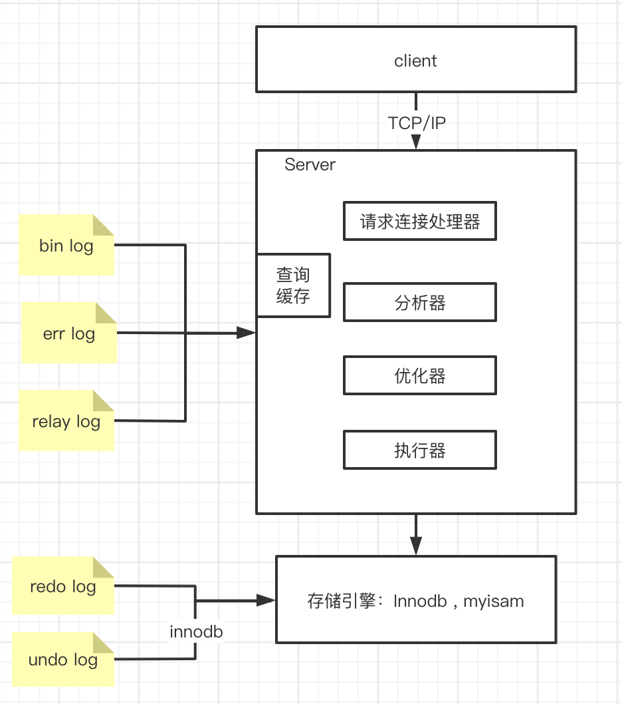
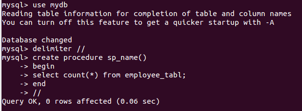
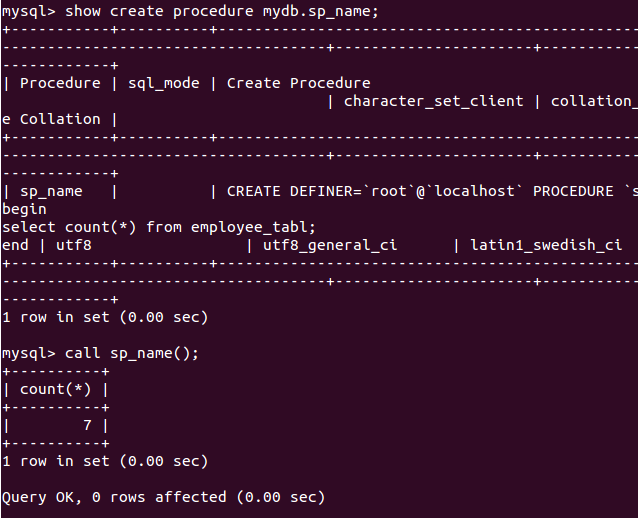
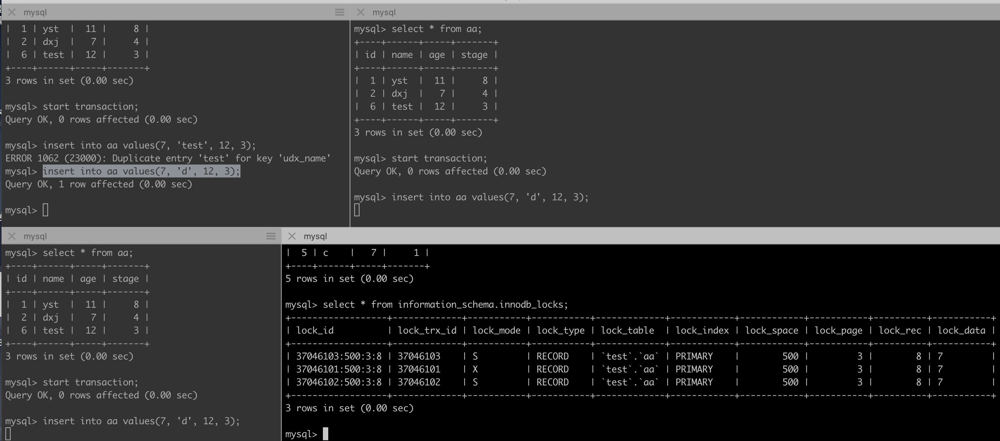
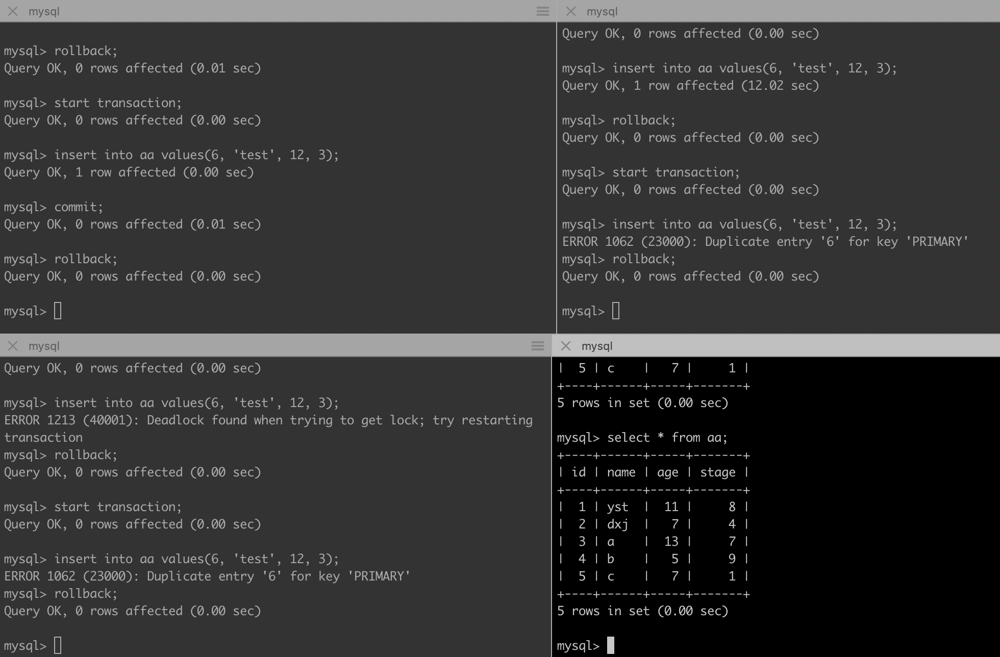
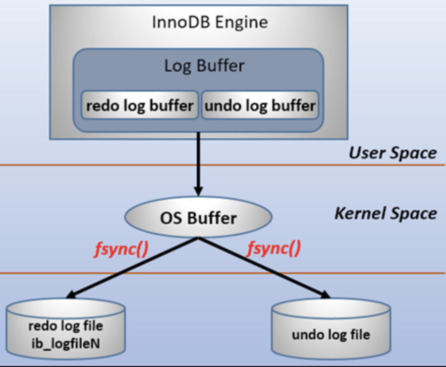

[TOC]

# MySQL

<a href='https://dev.mysql.com/doc/' target='_blank'>官方文档</a>

<a href='https://dev.mysql.com/doc/refman/5.6/en/' target='_blank'>mysql 5.6</a>

<a href='https://blog.csdn.net/qq_26437925/category_5779305.html' target='_blank'>我的博客专题</a>

## 数据库引擎有哪些？

* InnoDB
* Myisam
* Memory

说明：

* InnoDB,Myisam的默认索引是`B+Tree`，Memory的默认索引是`hash`
* InnoDB支持**事务**，支持**外键**，支持**行锁**，写入数据时操作快，MySQL5.6版本以上才支持**全文索引**
* Myisam不支持事务。不支持外键，支持表锁，支持全文索引，读取数据快
* Memory所有的数据都保留在内存中,不需要进行磁盘的IO所以读取的速度很快, 但是一旦关机,表的结构会保留但是数据就会丢失,表支持Hash索引，因此查找速度很快

## 数据库架构图(需手写)




## 数据库基础

### 存储过程

#### 创建和使用例子



* 使用



#### 存储过程的优点

1. 运行速度：对于很简单的sql，存储过程没有什么优势。对于复杂的业务逻辑，因为在存储过程创建的时候，数据库已经对其进行了一次解析和优化。存储过程一旦执行，在内存中就会保留一份这个存储过程，这样下次再执行同样的存储过程时，可以从内存中直接调用，所以执行速度会比普通sql快。  
2. 减少网络传输：存储过程直接就在数据库服务器上跑，所有的数据访问都在数据库服务器内部进行，不需要传输数据到其它服务器，所以会减少一定的网络传输。但是在存储过程中没有多次数据交互，那么实际上网络传输量和直接sql是一样的。而且我们的应用服务器通常与数据库是在同一内网，大数据的访问的瓶颈会是硬盘的速度，而不是网速。
3. 可维护性：存储过程有些时候比程序更容易维护，这是因为可以实时更新DB端的存储过程。有些bug，直接改存储过程里的业务逻辑，就搞定了。
4. 增强安全性：提高代码安全，防止 SQL注入。这一点sql语句也可以做到。
5. 可扩展性：应用程序和数据库操作分开，独立进行，而不是相互在一起。方便以后的扩展和DBA维护优化。

#### 存储过程的缺点

1. SQL本身是一种结构化查询语言，但不是面向对象的的，本质上还是过程化的语言，面对复杂的业务逻辑，过程化的处理会很吃力。同时SQL擅长的是数据查询而非业务逻辑的处理，如果如果把业务逻辑全放在存储过程里面，违背了这一原则。
2. 如果需要对输入存储过程的参数进行更改，或者要更改由其返回的数据，则您仍需要更新程序集中的代码以添加参数、更新调用，等等，这时候估计会比较繁琐了。
3. 开发调试复杂，由于IDE的问题，存储过程的开发调试要比一般程序困难。
4. 没办法应用缓存。虽然有全局临时表之类的方法可以做缓存，但同样加重了数据库的负担。如果缓存并发严重，经常要加锁，那效率实在堪忧。
5. 不支持群集，数据库服务器无法水平扩展，或者数据库的切割（水平或垂直切割）。数据库切割之后，存储过程并不清楚数据存储在哪个数据库中。

### 数据库范式

#### 第一范式

每个属性都不可再分


#### 第二范式


1. 每一名学生的学号、姓名、系名、系主任这些数据重复多次。每个系与对应的系主任的数据也重复多次——数据冗余过大

2. 假如学校新建了一个系，但是暂时还没有招收任何学生（比如3月份就新建了，但要等到8月份才招生），那么是无法将系名与系主任的数据单独地添加到数据表中去的 （注１）——插入异常

    * 注１：根据三种关系完整性约束中实体完整性的要求，关系中的码（注２）所包含的任意一个属性都不能为空，所有属性的组合也不能重复。为了满足此要求，图中的表，只能将学号与课名的组合作为码，否则就无法唯一地区分每一条记录

    * 码：关系中的某个属性或者某几个属性的组合，用于区分每个元组（可以把“元组”理解为一张表中的每条记录，也就是每一行）。

3. 假如将某个系中所有学生相关的记录都删除，那么所有系与系主任的数据也就随之消失了（一个系所有学生都没有了，并不表示这个系就没有了）。——删除异常

4. 假如李小明转系到法律系，那么为了保证数据库中数据的一致性，需要修改三条记录中系与系主任的数据。——修改异常

“若在一张表中，在属性（或属性组）X的值确定的情况下，必定能确定属性Y的值，那么就可以说Y函数依赖于X，写作`X → Y`”

**第二范式：在1NF的基础上，非码属性必须完全依赖于候选码（在1NF基础上消除非主属性对主码的部分函数依赖）**

* 选课（学号，课名，分数）
* 学生（学号，姓名，系名，系主任）

对于选课表，其码是（学号，课名），主属性是学号和课名，非主属性是分数，学号确定，并不能唯一确定分数，课名确定，也不能唯一确定分数，所以不存在非主属性分数对于码 （学号，课名）的部分函数依赖，所以此表符合2NF的要求。

对于学生表，其码是学号，主属性是学号，非主属性是姓名、系名和系主任，因为码只有一个属性，所以不可能存在非主属性对于码 的部分函数依赖，所以此表符合2NF的要求。

#### 第三范式

**在2NF基础上，任何非主属性不依赖于其它非主属性（在2NF基础上消除传递依赖）**

* 学生（学号，姓名，系名，系主任）

对于学生表，主码为学号，主属性为学号，非主属性为姓名、系名和系主任。因为 `学号 → 系名`，同时 `系名 → 系主任`，所以存在非主属性`系主任`对于码`学号`的**传递函数**依赖，所以学生表的设计，不符合3NF的要求。

---

* 选课（学号，课名，分数）
* 学生（学号，姓名，系名）
* 系（系名，系主任）


#### BCNF范式

巴斯-科德范式（BCNF）是第三范式（3NF）的一个子集，即满足巴斯-科德范式（BCNF）必须满足第三范式（3NF）。通常情况下，巴斯-科德范式被认为没有新的设计规范加入，只是对第二范式与第三范式中设计规范要求更强，因而被认为是修正第三范式，也就是说，它事实上是对第三范式的修正，使数据库冗余度更小。这也是BCNF不被称为第四范式的原因

## 数据表join操作

* INNER JOIN: 内连接是最常见的一种连接，只连接匹配的行

* LEFT JOIN: 返回左表的全部行和右表满足ON条件的行，如果左表的行在右表中没有匹配，那么这一行右表中对应数据用NULL代替

* RIGHT JOIN: 返回右表的全部行和左表满足ON条件的行，如果右表的行在左表中没有匹配，那么这一行左表中对应数据用NULL代替

* FULL OUTER JOIN: 会从左表 和右表 那里返回所有的行。如果其中一个表的数据行在另一个表中没有匹配的行，那么对面的数据用NULL代替

* CROSS JOIN: 把表A和表B的数据进行一个N*M的组合，即笛卡尔积

### 多表连接的三种方式详解 hash join、merge join、nested loop

#### nested loop（嵌套循环）

**驱动表**(也叫外表)和被驱动表(也叫**非驱动表**，还可以叫匹配表，亦可叫内表)，简单来说，驱动表就是主表，left join 中的左表就是驱动表，right join 中的右表是驱动表。一个是驱动表，那另一个就只能是非驱动表了

在 join 的过程中，其实就是从驱动表里面依次(注意理解这里面的依次)取出每一个值，然后去非驱动表里面进行匹配，那具体是怎么匹配的呢？这就是我们接下来讲的这三种连接方式：

1. (Simple Nested-Loop Join )暴力匹配的方式；如果 table A 有10行，table B 有10行，总共需要执行10 x 10 = 100次查询

2. (Index Nested-Loop Join)这个 Index 是要求非驱动表上要有索引，有了索引以后可以减少匹配次数，匹配次数减少了就可以提高查询的效率了,eg:左边就是普通列的存储方式，右边是树结构索引, 能减少查询次数

3. (Block Nested-Loop Join)

理想情况下，用索引匹配是最高效的一种方式，但是在现实工作中，并不是所有的列都是索引列，这个时候就需要用到 Block Nested-Loop Join 方法了，这种方法与第一种方法比较类似，唯一的区别就是:会把驱动表中 left join 涉及到的所有列(**不止是用来on的列，还有select部分的列**)先取出来放到一个**缓存区域**，然后再去和非驱动表进行匹配，这种方法和第一种方法相比所需要的匹配次数是一样的，差别就在于驱动表的列数不同，也就是数据量的多少不同。所以虽然匹配次数没有减少，但是总体的查询性能还是有提升的。

---

适用于小表与小表的连接

#### Hash Join

hash join仅仅在join的字段上`没有索引`时才起作用，在此之前，我们不建议在没有索引的字段上做join操作，因为通常中这种操作会执行得很慢，但是有了hash join，它`能够创建一个内存中的hash表`，代替之前的nested loop，使得没有索引的`等值join`性能提升很多。

1. 配置hash join功能是否开启：

    * optimizer_switch 中的 hash_join=on/off，默认为on
    * sql语句中指定HASH_JOIN或者NO_HASH_JOIN
限制：

2. hash join只能在没有索引的字段上有效
    * hash join只在等值join条件中有效
    * hash join不能用于left join和right join

适用于小表与大表的连接

#### merge join

merge join第一个步骤是确保两个关联表都是按照关联的字段进行排序。如果关联字段有可用的索引，并且排序一致，则可以直接进行merge join操作；

两个表都按照关联字段排序好之后，merge join操作从每个表取一条记录开始匹配，如果符合关联条件，则放入结果集中；否则，将关联字段值较小的记录抛弃，从这条记录对应的表中取下一条记录继续进行匹配，直到整个循环结束。

```java
 function sortMerge(relation left, relation right, attribute a)
     var relation output
     var list left_sorted := sort(left, a) // Relation left sorted on attribute a
     var list right_sorted := sort(right, a)
     var attribute left_key, right_key
     var set left_subset, right_subset // These sets discarded except where join predicate is satisfied
     advance(left_subset, left_sorted, left_key, a)
     advance(right_subset, right_sorted, right_key, a)
     while not empty(left_subset) and not empty(right_subset)
         if left_key = right_key // Join predicate satisfied
             add cartesian product of left_subset and right_subset to output
             advance(left_subset, left_sorted, left_key, a)
             advance(right_subset, right_sorted, right_key, a)
         else if left_key < right_key
            advance(left_subset, left_sorted, left_key, a)
         else // left_key > right_key
            advance(right_subset, right_sorted, right_key, a)
     return output

 // Remove tuples from sorted to subset until the sorted[1].a value changes
 function advance(subset out, sorted inout, key out, a in)
     key := sorted[1].a
     subset := emptySet
     while not empty(sorted) and sorted[1].a = key
         insert sorted[1] into subset
         remove sorted[1]
```

merge join操作本身是非常快的，但是merge join前进行的排序可能会相当耗时

它首先根据R和S的join key分别对两张表进行排序，然后同时遍历排序后的R和S

其I/O复杂度可以表示为O[p(R) + p(S) + p(R) · logp(R) + p(S) · logp(S)]

附：归并排序是稳定排序，最好，最坏，平均时间复杂度均为O(nlogn)。

## InnoDb

<a href='https://dev.mysql.com/doc/refman/5.6/en/innodb-storage-engine.html' target="_blank">Mysql innodb refman</a>

### 页（Page）是 Innodb 存储引擎用于管理数据的最小磁盘单位


1. File Header: 文件头部，页的一些通用信息（38字节）
2. page Header: 页面头部,数据页专有的一些信息（56字节）
3. infimum+supremum: 行记录最小值和最大值，两个虚拟的行记录（26字节）
4. user recorders: 实际存储的行记录内容（不确定）
5. free space: 页中尚未使用的空间（不确定）
6. Page Directory: 页中的某些记录的相对位置（不确定）
7. File Tailer: 校验页是否完整（8字节）

#### 记录在页中的存储

1.当一个记录需要插入页的时候，会从free space划分空间到user recorders
2.Free Space部分的空间全部被User Records部分替代掉之后，也就意味着这个页使用完了，如果还有新的记录插入的话，就需要去申请新的页了。

### innodb ibd文件

ibd文件是以`页`为单位进行管理的，页通常是以16k为单位，所以ibd文件通常是16k的整数倍

#### innodb 页类型

名称 | 十六进制 | 解释
:---:|:---:|:---:
FIL_PAGE_INDEX | 0x45BF | B+树叶节点
FIL_PAGE_UNDO_LOGO | 0x0002 | UNDO LOG页
FIL_PAGE_INODE | 0x0003 | 索引节点
FIL_PAGE_IBUF_FREE_LIST | 0x0004 | InsertBuffer空闲列表
FIL_PAGE_TYPE_ALLOCATED | 0x0000 | 该页的最新分配
FIL_PAGE_IBUF_BITMAP | 0x0005 | InsertBuffer位图
FIL_PAGE_TYPE_SYS | 0x0006 | 系统页
FIL_PAGE_TYPE_TRX_SYS | 0x0007 | 事务系统数据
FIL_PAGE_TYPE_FSP_HDR | 0x0008 | FILE SPACE HEADER
FIL_PAGE_TYPE_XDES | 0x0009 | 扩展描述页
FIL_PAGE_TYPE_BLOB | 0x000A | BLOB页

#### 实践分析`ibd`文件

```java
mubi@mubideMacBook-Pro bin $ mysql -uroot -p123456
mysql: [Warning] Using a password on the command line interface can be insecure.
Welcome to the MySQL monitor.  Commands end with ; or \g.
Your MySQL connection id is 109
Server version: 5.6.40 MySQL Community Server (GPL)

Copyright (c) 2000, 2015, Oracle and/or its affiliates. All rights reserved.

Oracle is a registered trademark of Oracle Corporation and/or its
affiliates. Other names may be trademarks of their respective
owners.

Type 'help;' or '\h' for help. Type '\c' to clear the current input statement.

mysql> use test;
Reading table information for completion of table and column names
You can turn off this feature to get a quicker startup with -A

Database changed
mysql> select * from tb_user;
+------------+--------+----------+-------+-------------+----------+
| id         | userID | password | name  | phone       | address  |
+------------+--------+----------+-------+-------------+----------+
|          1 | 00001  | 123456   | zhang | 15133339999 | Shanghai |
|          2 | 00002  | 123456   | wang  | 15133339999 | Beijing  |
|          4 | 0003   | NULL     | abc   | NULL        | NULL     |
|          6 | 0003   | NULL     | abc   | NULL        | NULL     |
|          7 | 0004   | 123456   | tom   | 110         | beijing  |
|         10 | 0004   | 123456   | tom   | 110         | beijing  |
| 2147483647 | 0004   | 123456   | tom   | 110         | beijing  |
+------------+--------+----------+-------+-------------+----------+
7 rows in set (0.00 sec)

mysql>
```

#### 查看数据表的行格式

```java
mysql> show table status like 'tb_user'\G;
*************************** 1. row ***************************
           Name: tb_user
         Engine: InnoDB
        Version: 10
     Row_format: Compact
           Rows: 6
 Avg_row_length: 2730
    Data_length: 16384
Max_data_length: 0
   Index_length: 16384
      Data_free: 0
 Auto_increment: 2147483647
    Create_time: 2020-03-21 16:10:06
    Update_time: NULL
     Check_time: NULL
      Collation: utf8_general_ci
       Checksum: NULL
 Create_options:
        Comment:
1 row in set (0.00 sec)

ERROR:
No query specified

mysql>
```

#### 查看ibd文件


使用`py_innodb_page_info`工具（`https://github.com/happieme/py_innodb_page_info`）


注意到文件大小`114688`字节（114688 = 16 * 1024 * 7）即有`7`个页（要分析哪个页直接定位到二进制文件到开始，然后分析即可）

#### 分析第4个页：`B-tree Node`类型

`page offset 00000003, page type <B-tree Node>, page level <0000>`

```java
>>> hex(3 * 16 * 1024)
'0xc000'
>>> hex(4 * 16 * 1024)
'0x10000'
>>>
```

##### 先分析File Header(38字节-描述页信息)


* 2D A1 2D 57 -> 数据页的checksum值
* 00 00 00 03 -> 页号（偏移量）,当前是第3页
* FF FF FF FF -> 目前只有一个数据页，无上一页
* FF FF FF FF -> 目前只有一个数据页，无下一页
* 00 00 00 04 6F 65 24 CF -> 该页最后被修改的LSN
* 45 BF -> 页的类型，0x45BF代表数据页，刚好这页是数据页
* 00 00 00 00 00 00 00 00 -> 独立表空间，该值为0
* 00 00 00 06 -> 表空间的SPACE ID

##### 再分析Page Header（56字节-记录页的状态信息）

参见：<a href="https://dev.mysql.com/doc/internals/en/innodb-page-header.html" target='_blank'>innodb-page-header</a>


标识 | 字节数 | 解释 | 本次值:说明
:---:|:---:|:---:|:---:|:---:
PAGE_N_DIR_SLOTS | 2 | number of directory slots in the Page Directory part; initial value = 2| 00 02,2个槽位
PAGE_HEAP_TOP | 2 | record pointer to first record in heap | 01 ED，堆第一个开始位置的偏移量，也即空闲偏移量
PAGE_N_HEAP | 2 | number of heap records; initial value = 2 | 80 0A
PAGE_FREE | 2 | record pointer to first free record | 01 1C
PAGE_GARBAGE | 2 | "number of bytes in deleted records" | 00 20，删除的记录字节
PAGE_LAST_INSERT | 2 | record pointer to the last inserted record | 01 C5，最后插入记录的位置偏移
PAGE_DIRECTION | 2 | either PAGE_LEFT, PAGE_RIGHT, or PAGE_NO_DIRECTION | 00 02，自增长的方式进行行记录的插入，方向向右
PAGE_N_DIRECTION | 2 | number of consecutive inserts in the same direction, for example, "last 5 were all to the left" | 00 02
PAGE_N_RECS | 2 | number of up[ser records | 00 07，共7条有效记录数
PAGE_MAX_TRX_ID | 8 | the highest ID of a transaction which might have changed a record on the page (only set for secondary indexes) | 00 00 00 00 00 00 00 00
PAGE_LEVEL | 2 | level within the index (0 for a leaf page) | 00 00
PAGE_INDEX_ID | 8 | identifier of the index the page belongs to | 00 00 00 00 00 00 00 16
PAGE_BTR | 10 | "file segment header for the leaf pages in a B-tree" (this is irrelevant here) | 00 00 00 06 00 00 00 02 00 F2
PAGE_LEVEL | 10 | "file segment header for the non-leaf pages in a B-tree" (this is irrelevant here) | 00 00 00 06 00 00 00 02 00 32

* `0xc000 + 01 ED` = `0xC1ED`地址后面的都是空闲的


* `0xc000 + 01 C5` = `0xC1C5`最后一条记录


##### 分析Infimum + Supremum Record (26字节-两个虚拟行记录)

infimum: n. 下确界;
supremum: n. 上确界;

Infimum和Suprenum Record用来限定记录的边界，Infimum是比页中任何主键值都要小的值，Suprenum 是指比任何可能大值还要大的值，这两个值在页创建时被建立，并且在任何情况下都不会被删除。Infimum和Suprenum与行记录组成单链表结构，查询记录时，从Infimum开始查找，如果找不到结果会直到查到最后的suprenum为止，然后通过Page Header中的FIL_PAGE_NEXT指针跳转到下一个page继续从Infimum开始逐个查找


```java
#Infimum伪行记录
01 00 02 00 20/*recorder header*/
69 6E 66 69 6D 75 6D 00/*只有一个列的伪行记录，记录内容就是Infimum（多了一个0x00字节）
*/
#Supremum伪行记录
08 00 0B 00 00/*recorder header*/
73 75 70 72 65 6D 75 6D/*只有一个列的伪行记录，记录内容就是Supremum*/
```

infimum行记录的recorder header部分，最后2个字节位`00 20`表示下一个记录的位置的偏移量

##### User Record(表中的数据记录)

用户所有插入的记录都存放在这里，默认情况下记录跟记录之间没有间隙，但是如果重用了已删除记录的空间，就会导致空间碎片。每个记录都有指向下一个记录的指针，但是没有指向上一个记录的指针。记录按照主键顺序排序。即，用户可以从数据页最小记录开始遍历，直到最大的记录，这包括了所有正常的记录和所有被delete-marked记录，但是不会访问到被删除的记录(PAGE_FREE)

###### COMPACT行记录格式


* 行格式的首部是一个非NULL变长字段长度列表，而且是按照列的顺序逆序放置的。当列的长度小于255字节，用1字节表示，若大于255个字节，用2个字节表示，变长字段的长度最大不可以超过2个字节（这也很好地解释了为什么MySQL中varchar的最大长度为65535，因为2个字节为16位，即`pow(2,16)-1=65536`）。第二个部分是NULL标志位，该位指示了该行数据中是否有NULL值，1个字节表示。该部分所占的字节应该为bytes。接下去的部分是为记录头信息（record header），固定占用5个字节（40位），每位的含义如下

* 预留位1	1（bit位）	没有使用
* 预留位2	1	没有使用
* delete_mask	1	标记该记录是否被删除
* min_rec_mask	1	标记该记录是否为B+树的非叶子节点中的最小记录
* n_owned	4	表示当前槽管理的记录数
* heap_no	13	表示当前记录在记录堆的位置信息
* record_type	3	表示当前记录的类型，0表示普通记录，1表示B+树非叶节点记录，2表示最小记录，3表示最大记录
* next_record	16	表示下一条记录的相对位置


```java
0000c070: 73 75 70 72 65 6D 75 6D 08 0B 05 06 05 00 00 00    supremum........
0000c080: 10 00 3F 80 00 00 01 00 00 00 00 27 06 86 00 00    ..?........'....
0000c090: 01 39 01 10 30 30 30 30 31 31 32 33 34 35 36 7A    .9..00001123456z
0000c0a0: 68 61 6E 67 31 35 31 33 33 33 33 39 39 39 39 53    hang15133339999S
0000c0b0: 68 61 6E 67 68 61 69 07 0B 04 06 05 00 00 00 18    hanghai.........

08 0B 05 06 05: 8(address字段) 11(phone字段) 5(name字段) 6(password字段) 5(userID字段)，一个逆序的方式表示可变长字段列表
00 : Null值列表
00 00 10 00 3F：记录头信息 5个字节，40bit
    0000 0000 0000 0000 00001 0000 0000 0000 0011 1111
80 00 00 01：自增主键（有符号的int类型），1
00 00 00 00 27 06：隐藏列DB_TRX_ID
86 00 00 01 39 01 10：隐藏列DB_ROLL_PTR
30 30 30 30 31 ： 00001
31 32 33 34 35 36 ： 123456
7A 68 61 6E 67 : zhang
31 35 31 33 33 33 33 39 39 39 39 : 15133339999
53 68 61 6E 67 68 61 69 : beijing
```

##### File Tailer(最后8字节)


`7E 75 29 30 6F 65 24 CF`

注意到File Header该页最后被修改的LSN：`00 00 00 04 6F 65 24 CF`，可以看到后4个字节和`File Tailer`的后4个字节相同

##### 附：二进制文件查看小工具

* 使用python可以方便的进行二进制相关的转换
    1. hex(16) # 10进制转16进制
    2. oct(8) # 10进制转8进制
    3. bin(8) # 10进制转2进制

```java
>>> hex(6 * 16 * 1024)
'0x18000'
>>> hex(3 * 16 * 1024)
'0xc000'
>>>
```

* vscode可以安装`hexdump for VSCode`插件

### 页分裂/页合并

<a href="https://www.percona.com/blog/2017/04/10/innodb-page-merging-and-page-splitting/" href='_blank'>innodb-page-merging-and-page-splitting</a>

InnoDB不是按行的来操作的，它可操作的最小粒度是页，页加载进内存后才会通过扫描页来获取行/记录。

#### innodb数据的存储(.frm & .ibd)

在 InnoDB 存储引擎中，所有的数据都被逻辑地存放在表空间中，表空间（tablespace）是存储引擎中最高的存储逻辑单位，在表空间的下面又包括段（segment）、区（extent）、页（page）, 页中存放实际的数据记录行


MySQL 使用 InnoDB 存储表时，会将表的定义和数据索引等信息分开存储，其中前者存储在`.frm`文件中，后者存储在`.ibd`文件中(ibd文件既存储了数据也存储了索引)


在创建表时，会在磁盘上的 datadir 文件夹中生成一个 `.frm` 的文件，这个文件中包含了表结构相关的信息

##### 页合并

删除记录时会设置record的flaged标记为删除，当一页中删除记录超过<font color='red'>MERGE_THRESHOLD（默认页体积的50%）</font>时，InnoDB会开始寻找最靠近的页（前或后）看看是否可以将两个页合并以优化空间使用。例如：合并操作使得页#5保留它之前的数据，并且容纳来自页#6的数据。页#6变成一个空页，可以接纳新数据。

##### 页分裂

页可能填充至100%，在页填满了之后，下一页会继续接管新的记录。但如果下一页页没有足够空间去容纳新（或更新）的记录，那么

1. 创建新页
2. 判断当前页（页#10）可以从哪里进行分裂（记录行层面）
3. 移动记录行
4. 重新定义页之间的关系

例如：页#10没有足够空间去容纳新记录，页#11也同样满了, #10要分列为两列, 且页的前后指针关系要发生改变

```java
#9 #10 #11 #12 #13 ...

#8 #10 #14 #11 #12 #13 ...
```

## 索引

### MySql默认索引（InnoDB）

```sql
mysql> show variables like '%storage_engine%';
ERROR 2006 (HY000): MySQL server has gone away
No connection. Trying to reconnect...
Connection id:    112
Current database: test

+----------------------------+--------+
| Variable_name              | Value  |
+----------------------------+--------+
| default_storage_engine     | InnoDB |
| default_tmp_storage_engine | InnoDB |
| storage_engine             | InnoDB |
+----------------------------+--------+
3 rows in set (0.06 sec)

mysql>
```

### 为什么要用`B+ Tree`而不是`B Tree`?

1行记录假如有1KB；如果`B Tree`（其非叶子节点是要存储数据的，显然存储有限）；B-Tree为了存储大量数据，不得不提高树的高度，这就会导致IO次数增多。所以有`B+ Tree`

### MySql中B+树索引可以分为聚集索引和非聚集索引

#### 聚集索引（clustered index）

索引中键值的逻辑顺序决定了表中相应行的物理顺序（索引中的数据物理存放地址和索引的顺序是一致的），可以这么理解：只要是索引是连续的，那么数据在存储介质上的存储位置也是连续的。

聚集索引就像我们根据拼音的顺序查字典一样，可以大大的提高效率。在经常搜索一定范围的值时，通过索引找到第一条数据，根据物理地址连续存储的特点，然后检索相邻的数据，直到到达条件截止项。

聚集索引：叶子节点包含了完整的数据记录

Cluster index is a type of index which sorts the data rows in the table on their key values. In the Database, there is only one clustered index per table.

A clustered index defines the order in which data is stored in the table which can be sorted in only one way. So, there can be an only a single clustered index for every table. In an RDBMS, usually, the primary key allows you to create a clustered index based on that specific column.

#### 非聚集索引

索引的逻辑顺序与磁盘上的物理存储顺序不同。非聚集索引的键值在逻辑上也是连续的，但是表中的数据在存储介质上的物理顺序是不一致的，即记录的逻辑顺序和实际存储的物理顺序没有任何联系。索引的记录节点有一个数据指针指向真正的数据存储位置。

A Non-clustered index stores the data at one location and indices at another location. The index contains pointers to the location of that data. A single table can have many non-clustered indexes as an index in the non-clustered index is stored in different places.

For example, a book can have more than one index, one at the beginning which displays the contents of a book unit wise while the second index shows the index of terms in alphabetical order.

A non-clustering index is defined in the non-ordering field of the table. This type of indexing method helps you to improve the performance of queries that use keys which are not assigned as a primary key. A non-clustered index allows you to add a unique key for a table.

#### 聚集/非聚集对比和注意点

<a href="https://dev.mysql.com/doc/refman/5.7/en/innodb-index-types.html" target='_blank'>innodb-index-types</a>

Mysql中管局聚集索引的说明
    * 如果一个主键被定义了，那么这个主键就是作为聚集索引
    * 如果没有主键被定义，那么该表的第一个唯一非空索引会被作为聚集索引
    * 如果没有主键也没有合适的唯一索引，那么innodb内部会生成一个隐藏的主键作为聚集索引，这个隐藏的主键是一个6个字节的列，该列的值会随着数据的插入进行自增

聚集索引的特点

1. 聚集索引表记录的排列顺序和索引的排列顺序保持一致，所以查询效率相当快。只要找到第一个索引记录的值，其余的连续性的记录也一定是连续存放的
2. 聚集索引的缺点就是修改起来比较慢，因为它需要保持表中记录和索引的顺序一致，在插入新记录的时候就会对数据也重新做一次排序。
3. InnoDB表数据本身就是一个按B+Tree组织的一个索引结构文件，叶节点包含了完整的数据记录（.ibd文件）;MyIsam数据和索引文件是分开的（.MYD文件，.MYI文件）

* myisam


* innodb


#### 为什么InnoDB要有主键？并且推荐使用整型自增主键？

为什么InnoDB要有主键？（InnoDB设计如此）

* 如果一个主键被定义了，那么这个主键就是作为聚集索引
* 如果没有主键被定义，那么该表的第一个唯一非空索引会被作为聚集索引
* 如果没有主键也没有合适的唯一索引，那么innodb内部会生成一个隐藏的主键作为聚集索引，这个隐藏的主键是一个6个字节的列，该列的值会随着数据的插入进行自增

推荐使用整型？

* B+Tree搜索比对，显然整型比字符串比较快（原因1），整型占用空间小（原因2）

推荐使用自增？

补充：hash索引，直接定位到记录的磁盘地址（等值查找）**区间查找**用hash行不同，所以hash索引用的少

自增是页不断的创建新增，后面加，调整小；如果非自增，涉及到页分裂/创建，B+Tree调整大

<a href='https://www.cs.usfca.edu/~galles/visualization/BPlusTree.html' href='_blank'>B+Tree 可视化操作</a>

### 索引类型

#### 联合索引


仍然是B+Tree, 索引中包含多个字段，按照联合索引的先后顺序

### 联合索引为什么是最左前缀匹配？

数据结构底层决定（严格的按照第一个，第二个，第三个字段一个一个匹配），不符合最左匹配则需要全局扫描了

#### MySql索引概述

<a href='https://dev.mysql.com/doc/refman/5.7/en/mysql-indexes.html' target='_blank'>https://dev.mysql.com/doc/refman/5.7/en/mysql-indexes.html</a>

Indexes are used to find rows with specific column values quickly. Without an index, MySQL must begin with the first row and then read through the entire table to find the relevant rows. The larger the table, the more this costs. If the table has an index for the columns in question, MySQL can quickly determine the position to seek to in the middle of the data file without having to look at all the data. This is much faster than reading every row sequentially.

Most MySQL indexes (PRIMARY KEY, UNIQUE, INDEX, and FULLTEXT) are stored in B-trees. Exceptions: Indexes on spatial data types use R-trees; MEMORY tables also support hash indexes; InnoDB uses inverted lists for FULLTEXT indexes.

MySQL uses indexes for these operations:

* To find the rows matching a WHERE clause quickly.

* To eliminate rows from consideration. If there is a choice between multiple indexes, MySQL normally uses the index that finds the smallest number of rows (**the most selective** index).

* If the table has a multiple-column index, any **leftmost prefix** of the index can be used by the optimizer to look up rows. For example, if you have a three-column index on (col1, col2, col3), you have indexed search capabilities on (col1), (col1, col2), and (col1, col2, col3). 

* To retrieve rows from other tables when performing joins. MySQL can use indexes on columns more efficiently if they are declared as the same type and size. In this context, VARCHAR and CHAR are considered the same if they are declared as the same size. For example, VARCHAR(10) and CHAR(10) are the same size, but VARCHAR(10) and CHAR(15) are not.

* To find the MIN() or MAX() value for a specific indexed column key_col. This is optimized by a preprocessor that checks whether you are using WHERE key_part_N = constant on all key parts that occur before key_col in the index. In this case, MySQL does a single key lookup for each MIN() or MAX() expression and replaces it with a constant. If all expressions are replaced with constants, the query returns at once.

* To sort or group a table if the sorting or grouping is done on a leftmost prefix of a usable index (for example, ORDER BY key_part1, key_part2). If all key parts are followed by DESC, the key is read in reverse order.

* In some cases, a query can be optimized to retrieve values without consulting the data rows. (An index that provides all the necessary results for a query is called a covering index.) If a query uses from a table only columns that are included in some index, the selected values can be retrieved from the index tree for greater speed

最后：Indexes are less important for queries on small tables, or big tables where report queries process most or all of the rows. When a query needs to access most of the rows, reading sequentially is faster than working through an index. Sequential reads minimize disk seeks, even if not all the rows are needed for the query.

## InnoDb锁

<a href='https://dev.mysql.com/doc/refman/5.7/en/innodb-locking.html' target='_blank'>innodb lock</a>

### Shared locks(读锁) 和 Exclusive locks(写锁)

InnoDB implements standard `row-level locking` where there are two types of locks, shared (S) locks and exclusive (X) locks.

* A shared (S) lock permits the transaction that holds the lock to read a row.
* An exclusive (X) lock permits the transaction that holds the lock to update or delete a row.

#### Exclusive locks

Exclusive locks protect updates to file resources, both recoverable and non-recoverable. They can be owned by only one transaction at a time. Any transaction that requires an exclusive lock must wait if another task currently owns an exclusive lock or a shared lock against the requested resource.

独占锁保护文件资源(包括可恢复和不可恢复的文件资源)的更新。它们一次只能由一个事务拥有。如果另一个任务当前拥有对所请求资源的独占锁或共享锁，则任何需要对该资源申请独占锁的事务都必须等待。

#### Shared locks

Shared locks support read integrity. They ensure that a record is not in the process of being updated during a read-only request. Shared locks can also be used to prevent updates of a record between the time that a record is read and the next syncpoint.

共享锁支持读完整性。它们确保在只读请求期间不会更新记录。共享锁还可用于防止在读取记录和下一个同步点之间进行更新操作。

A shared lock on a resource can be owned by several tasks at the same time. However, although several tasks can own shared locks, there are some circumstances in which tasks can be forced to wait for a lock:

资源上的共享锁可以同时由多个任务拥有。 但是，尽管有几个任务可以拥有共享锁，但在某些情况下可以强制任务等待锁：

* A request for a shared lock must wait if another task currently owns an exclusive lock on the resource.
* A request for an exclusive lock must wait if other tasks currently own shared locks on this resource.
* A new request for a shared lock must wait if another task is waiting for an exclusive lock on a resource that already has a shared lock.

即：

* 如果另一个任务当前拥有资源上的独占锁，则对共享锁的请求必须等待。
* 如果其他任务当前拥有此资源上的共享锁，则必须等待对独占锁的请求。
* 如果另一个任务正在等待已经具有共享锁的资源的独占锁，则对共享锁的新请求必须

### Intention Locks(意向锁)

InnoDB supports multiple granularity locking(多粒度锁) which permits coexistence of row locks and table locks.

Intention locks are table-level locks that indicate which type of lock (shared or exclusive) a transaction requires later for a row in a table. There are two types of intention locks:

* An intention shared lock (IS) indicates that a transaction intends to set a shared lock on individual rows in a table. 事务T尝试在表t的某些行记录上设置S锁

* An intention exclusive lock (IX) indicates that a transaction intends to set an exclusive lock on individual rows in a table. 事务T尝试在表t的某些行记录上设置X锁

锁使用规则：

- |X |IX| S| IS
:---:| :---:|:---:|:---:|:---:
X|Conflict |Conflict |Conflict |Conflict
IX |Conflict |Compatible |Conflict |Compatible
S |Conflict |Conflict |Compatible |Compatible
IS |Conflict |Compatible |Compatible |Compatible

### Record Locks

A record lock is a lock on an index record. For example, SELECT c1 FROM t WHERE c1 = 10 FOR UPDATE; prevents any other transaction from inserting, updating, or deleting rows where the value of t.c1 is 10.

Record locks always lock index records, even if a table is defined with no indexes. For such cases, InnoDB creates a hidden clustered index and uses this index for record locking.

单个索引行记录的锁。

### Gap Locks

A gap lock is a lock on a gap between index records, or a lock on the gap before the first or after the last index record. For example, SELECT c1 FROM t WHERE c1 BETWEEN 10 and 20 FOR UPDATE; prevents other transactions from inserting a value of 15 into column t.c1, whether or not there was already any such value in the column, because the gaps between all existing values in the range are locked.

A gap might span a single index value, multiple index values, or even be empty.

Gap locks are part of the tradeoff between performance and concurrency, and are used in some transaction isolation levels and not others.

间隙锁，锁定一个范围，但不包括记录本身。GAP锁的目的，是为了防止同一事务的两次当前读，出现幻读的情况。

### Next-Key Locks

A next-key lock is a combination of a record lock on the index record and a gap lock on the gap before the index record.

InnoDB performs row-level locking in such a way that when it searches or scans a table index, it sets shared or exclusive locks on the index records it encounters. Thus, the row-level locks are actually index-record locks. A next-key lock on an index record also affects the “gap” before that index record. That is, a next-key lock is an index-record lock plus a gap lock on the gap preceding the index record. If one session has a shared or exclusive lock on record R in an index, another session cannot insert a new index record in the gap immediately before R in the index order.

锁定一个范围，并且锁定记录本身。对于行的查询，都是采用该方法，主要目的是解决幻读的问题。

例如：

```java
root@localhost : test 10:56:15>select * from t;
+------+
| a    |
+------+
|    1 |
|    3 |
|    5 |
|    8 |
|   11 |
+------+
5 rows in set (0.00 sec)

root@localhost : test 10:56:29>select * from t where a = 8 for update;
+------+
| a    |
+------+
|    8 |
+------+
1 row in set (0.00 sec)
```

该SQL语句锁定的范围是`（5,8]`，下个下个键值范围是`（8,11]`，所以插入`5~11`之间的值的时候都会被锁定，要求等待。即：插入`5，6，7，8，9，10`会被锁住。插入非这个范围内的值都正常。

### Insert Intention Locks(插入意向锁)

An insert intention lock is a type of gap lock set by INSERT operations prior to row insertion. This lock signals the intent to insert in such a way that multiple transactions inserting into the same index gap need not wait for each other if they are not inserting at the same position within the gap. Suppose that there are index records with values of 4 and 7. Separate transactions that attempt to insert values of 5 and 6, respectively, each lock the gap between 4 and 7 with insert intention locks prior to obtaining the exclusive lock on the inserted row, but do not block each other because the rows are nonconflicting.

Insert Intention Locks意为插入意向锁，插入意向锁是Innodb gap锁的一种类型，这种锁表示要以这样一种方式插入:如果多个事务插入到相同的索引间隙中，如果它们不在间隙中的相同位置插入，则无需等待其他事务。比如说有索引记录4和7，有两个事务想要分别插入5，6，在获取插入行上的独占锁之前，每个锁都使用插入意图锁锁定4和7之间的间隙，但是不要互相阻塞，因为行是不冲突的，意向锁的涉及是为了插入的正确和高效。

### AUTO-INC Locks

### Predicate Locks for Spatial Indexes

### ERROR 1213 (40001): Deadlock found when trying to get lock; try restarting transaction

三个事务都插入相同数据，其中第一个事务进行了回滚，第三个事务报错


在第一个事务回滚之前，查看事务锁情况



* 事务1获得行记录上的排它锁（LOCK_X | LOCK_REC_NOT_GAP）
* 紧接着事务T2、T3也开始插入记录，请求排它插入意向锁(LOCK_X | LOCK_GAP | LOCK_INSERT_INTENTION)；但由于发生重复唯一键冲突，各自请求的排它记录锁(LOCK_X | LOCK_REC_NOT_GAP)转成共享记录锁(LOCK_S | LOCK_REC_NOT_GAP)。

T1回滚会释放其获取到到排它锁，T2,T3都要请求排它锁，但是由于X锁与S锁互斥，T2与T3都等待对方释放S锁，于是便产生了死锁

### ERROR 1062 (23000): Duplicate entry '6' for key 'PRIMARY'




## Innodb事务

<a href="https://blog.csdn.net/qq_26437925/article/details/50739813" target="_blank">数据库事务的4个特性理解</a>

### 原子性：undo log

undo log是为了实现事务的原子性，在Mysql数据库Innodb存储引擎中，还用undo log来实现多版本并发控制(MVCC)

在操作任何数据之前，首先将数据备份到一个地方（这个存储数据备份的地方称为undo log）；然后进行数据的修改。如果出现了错误或者用户执行了`rollback`,系统利用undo log的备份数据将数据恢复到事务开始之前的状态

undo log是逻辑日志，可以理解为：只要有insert操作，就可以记录一条删除记录；有delete操作，就记录一条新增记录，有update操作，记录update前的数据update操作;这样恢复操作去执行，就能回到事务之前的状态

### 持久性：redo log

和undo log相反，redo log记录的是新数据的备份，<font color='red'>当事务提交前，只要将redo log持久化即可，不需要将数据持久化</font>，当系统崩溃时，虽然数据没有持久化，但是redo log已经持久化，系统可以根据redo log的内容，将所有数据恢复到最新的状态

### undo / redo log文件操作

#### redo log持久化策略



mysql进程挂？机器挂？性能问题考虑？数据一致性考虑？

0. 只写redo log，每秒落地一次，性能最高，数据一致性最差，如果mysql奔溃可能丢失一秒的数据
1. 写redo log，buffer同时落地，性能最差，一致性最高
2. 写redo log，buffer同时写入到os buffer，性能好，安全性也高，只要os不宕机就能保证数据一致性

### 隔离性

<a href="https://blog.csdn.net/qq_26437925/article/details/80270741" target='_blank'>我的博文实践</a>

## 主从复制

### 为什么需要主从复制？

* 当主数据库出现问题时，可以用从数据库代替主数据库，可以避免数据的丢失（数据热备）
* 减轻主数据库的压力，降低单机的磁盘I/O访问率，提高单个机器的I/O性能
* 在业务复杂的系统中，有这么一个情景，有一句sql语句需要锁表，导致暂时不能使用读的服务，那么就很影响运行中的业务，使用主从复制，让主库负责写，从库负责读，这样，即使主库出现了锁表的情景，也能通过读从库也去保证业务的正常运作

### 主从复制的原理？

* 主服务器上面的任何修改都会通过自己的`I/O thread`(I/O 线程)保存在二进制日志`Binary log`里面
* 主服务器的binlog输出线程：每当有从库连接到主库的时候，主库都会创建一个线程然后发送binlog内容到从库；对于每一个即将发送给从库的sql事件，binlog输出线程会将其锁住。一旦该事件被线程读取完之后，该锁会被释放，即使在该事件完全发送到从库的时候，该锁也会被释放
* 从服务器上面也启动一个`I/O thread`，通过配置好的用户名和密码, 连接到主服务器上面请求读取二进制日志，然后把读取到的二进制日志写到本地的一个`Realy log`（中继日志）里面
* 从服务器上面同时开启一个`SQL thread`定时检查`Realy log`(这个文件也是二进制的)，如果发现有更新立即把更新的内容在本机的数据库上面执行一遍


基本步骤如下（注意整个mysql主从复制是<font color='red'>异步的</font>）
    * 步骤一：主库db的更新事件(update、insert、delete)被写到binlog
    * 步骤二：从库发起连接，连接到主库
    * 步骤三：此时主库创建一个binlog dump thread，把binlog的内容发送到从库
    * 步骤四：从库启动之后，创建一个I/O线程，读取主库传过来的binlog内容并写入到relay log
    * 步骤五：还会创建一个SQL线程，从relay log里面读取内容，从Exec_Master_Log_Pos位置开始执行读取到的更新事件，将更新内容写入到slave的db

### binlog文件

#### binlog文件概述

* 查看是否开启binlog

```sql
show variables like 'log_bin';
```

binlog是二进制日志文件，是由mysql server维护的,用于记录mysql的数据更新或者潜在更新(比如DELETE语句执行删除而实际并没有符合条件的数据)，在mysql主从复制中就是依靠的binlog；执行SELECT等不涉及数据更新的语句是不会记binlog的，而涉及到数据更新则会记录。要注意的是，对支持事务的引擎如innodb而言，必须要提交了事务才会记录binlog。

<a href='https://dev.mysql.com/doc/internals/en/binary-log-overview.html' target='_blank'>binary-log</a>

The binary log is a set of log files that contain information about data modifications made to a MySQL server instance. The log is enabled by starting the server with the --log-bin option.

#### binlog文件作用

The binary log has two important purposes:

* For replication, the binary log is used on master replication servers as a record of the statements to be sent to slave servers. Many details of binary log format and handling are specific to this purpose. The master server sends the events contained in its binary log to its slaves, which execute those events to make the same data changes that were made on the master. A slave stores events received from the master in its relay log until they can be executed. The relay log has the same format as the binary log.

* Certain data recovery operations require use of the binary log. After a backup file has been restored, the events in the binary log that were recorded after the backup was made are re-executed. These events bring databases up to date from the point of the backup.

主从复制 & 数据恢复

#### binlog文件记录类型

* Statement-based logging: Events contain SQL statements that produce data changes (inserts, updates, deletes)

* Row-based logging: Events describe changes to individual rows

* Mixed logging uses statement-based logging by default but switches to row-based logging automatically as necessary.

format | 定义 | 优点 | 缺点
-|-|-|-
statement | 记录修改的sql语句 | 日志文件小，节约IO，提高性能 | 准确性差，对一些系统函数不能准确复制或不能复制，如now()、uuid()、limit(由于mysql是自选索引，有可能master同salve选择的索引不同，导致更新的内容也不同)等;在某些情况下会导致master-slave中的数据不一致(如sleep()函数， last_insert_id()，以及user-defined functions(udf)等会出现问题)
row|记录的是每行实际数据的变更|准确性强，能准确复制数据的变更|日志文件大，较大的网络IO和磁盘IO
mixed|statement和row模式的混合|准确性强，文件大小适中|当binlog format 设置为mixed时，普通复制不会有问题，但是级联复制在特殊情况下会binlog丢失

* 查看 binlog 格式


业内目前推荐使用的是`row`模式，**准确性高**，虽然文件大，但是现在有SSD和万兆光纤网络，这些磁盘IO和网络IO都是可以接受的。

## 分库/分表

### 为什么会分表分库？

支撑高并发、大数据量

经验值：单表到`几百万`记录，存储`几百G`的时候，性能就会相对差一些了

### 分表 & 分库概念

分库分表就是为了解决由于数据量过大而导致数据库性能降低的问题，将原来独立的数据库拆分成若干数据库组成 ，将数据大表拆分成若干数据表组成，使得单一数据库、单一数据表的数据量变小，从而达到提升数据库性能的目的。

分库分表包括分库和分表两个部分，在生产中通常包括：垂直分库、水平分库、垂直分表、水平分表四种方式。

#### 垂直分表

用户在浏览商品列表时，只有对某商品感兴趣时才会查看该商品的详细描述。因此，商品信息中商品`描述字段`访问频次较低，且该字段存储占用空间较大，访问单个数据IO时间较长；商品信息中`商品名称`、`商品图片`、`商品价格`等其它字段数据访问频次较高。由于这两种数据的特性不一样，因此考虑将商品信息表拆分成：将访问频次低的商品描述信息单独存放在一张表中，访问频次较高的商品基本信息单独放在一张表中；即 商品表 可拆分成 商品信息表 和 商品描述表。

**垂直分表定义**：将一个表按照字段分成多表，每个表存储其中一部分字段。

* 为什么大字段IO效率低
    1. 第一是由于数据量本身大，需要更长的读取时间；
    2. 第二是跨页，页是数据库存储单位，很多查找及定位操作都是以页为单位，单页内的数据行越多数据库整体性能越好，而大字段占用空间大，单页内存储行数少，因此IO效率较低。
    3. 第三，数据库以行为单位将数据加载到内存中，这样表中字段长度较短且访问频率较高，内存能加载更多的数据，命中率更高，减少了磁盘IO，从而提升了数据库性能。

#### 垂直分库

通过垂直分表性能得到了一定程度的提升，但是还没有达到要求，并且磁盘空间也快不够了，因为数据还是始终限制在一台服务器，库内垂直分表只解决了单一表数据量过大的问题，但没有将表分布到不同的服务器上，因此每个表还是竞争同一个物理机的CPU、内存、网络IO、磁盘。可以业务划分：将商品业务，卖家业务，用户信息，存储到不同到数据服务器上

**垂直分库**：是指按照业务将表进行分类，分布到不同的数据库上面，每个库可以放在不同的服务器上，它的核心理念是专库专用。

* 解决业务层面的耦合，业务清晰
* 能对不同业务的数据进行分级管理、维护、监控、扩展等
* 高并发场景下，垂直分库一定程度的提升IO、数据库连接数、降低单机硬件资源的瓶颈
* 垂直分库通过将表按业务分类，然后分布在不同数据库，并且可以将这些数据库部署在不同服务器上，从而达到多个服务器共同分摊压力的效果，但是依然没有解决单表数据量过大的问题。

#### 水平分库

经过垂直分库后，数据库性能问题得到一定程度的解决，但是随着业务量的增长，PRODUCT_DB(商品库)单库存储数据已经超出预估。可以将商品的所属店铺ID为单数的和店铺ID为双数的商品信息分别放在两个数据库中

**水平分库**:是把同一个表的数据按一定规则拆到不同的数据库中，每个库可以放在不同的服务器上。

它带来的提升是：

* 解决了单库大数据，高并发的性能瓶颈
* 提高了系统的稳定性及可用性

例如：要操作某条商品数据，先分析这条数据所属的店铺ID。如果店铺ID为双数，将此操作映射至RRODUCT_DB1(商品库1)；如果店铺ID为单数，将操作映射至RRODUCT_DB2(商品库2)。此操作要访问数据库名称的表达式为RRODUCT_DB[店铺ID%2 + 1] 。

#### 水平分表

按照水平分库的思路把PRODUCT_DB_X(商品库)内的表也可以进行水平拆分，其目的也是为解决单表数据量大的问题，与水平分库的思路类似，不过这次操作的目标是表

**水平分表**：是在同一个数据库内，把同一个表的数据按一定规则拆到多个表中

### 分库分表带来的问题

1. 事务的一致性问题：分布式事务
2. 跨节点关联查询问题
3. 跨节点分页，排序问题
4. 主键重复问题：全局ID
5. 公共表，高频公共操作表

### 分库分表实践

<a href="https://tech.meituan.com/2016/11/18/dianping-order-db-sharding.html" target="_blank">大众点评订单系统分库分表实践</a>

<a href="https://github.com/doctording/sharding-sql" target='_blank'>shardingsphere 简单实践</a>
