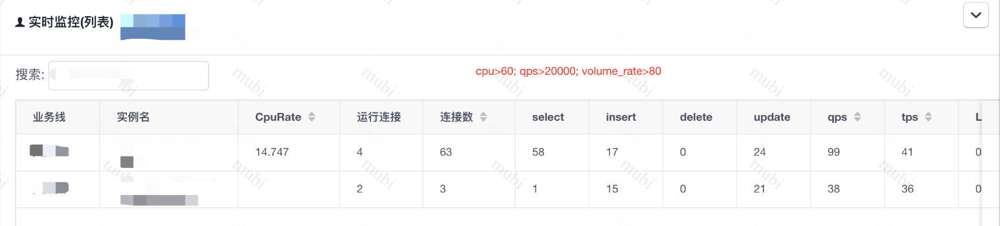
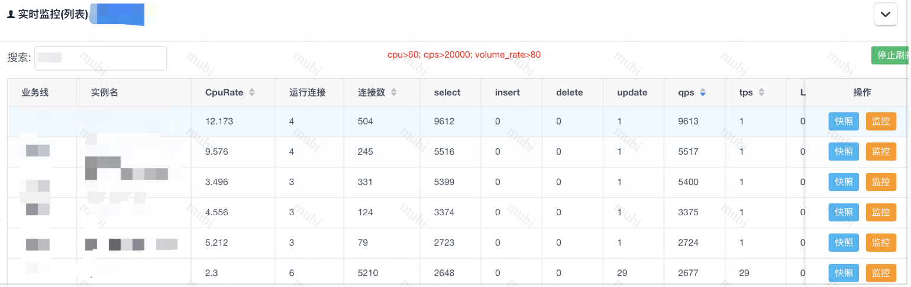

[TOC]

# MySQL

`cpu>60; qps>20000; volume_rate>80`

连接数：几百
qps: 个位数到上千
一般select多于insert，update

实例1

* cpu_use_rate: 20-30%
* slow_queries: 0-10次
* threads_connected: 60左右
* qps： 100-1200
* threads_running: 5左右

其它实例

#### 阿里云 rds mysql 性能测试

内存命中型: 指数据可以全部读取到缓存里进行查询。
磁盘IO型: 指只有部分数据可以放到缓存里，查询过程中需要读写磁盘更新缓存