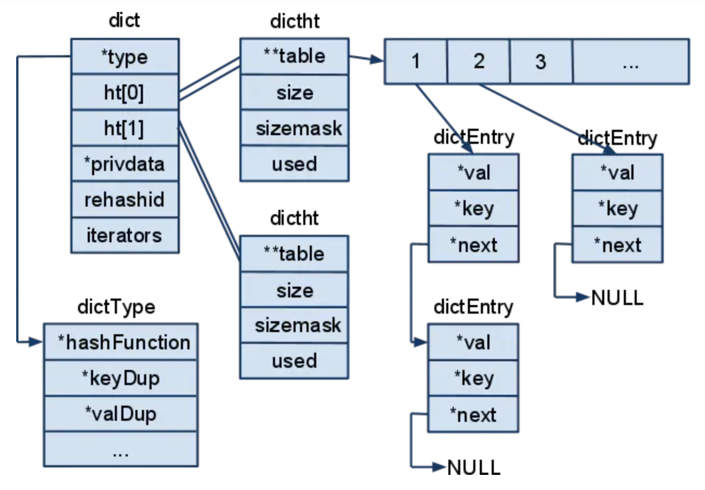

[TOC]

# Redis


## redis是什么？有什么用？

* 基于内存的
* 数据是K（String类型）,V（有5种基本数据结构：String,Hash,List,Set,ZSet，注意：memcache value就是string,没有数据类型）
* 单线程(工作线程是单线程的)
* 连接使用（linux中epoll）多路复用
* 主从，集群，持久化等
* 串行化/原子操作

## KV的数据类型说明(5种数据结构)

比如V即value数据类型是个数组，目前想取出下标是2的元素

1. 没有数据类型，那么客户端要取出全量存储的数据，然后在客户端完成计算（memcache）：
2. 有数据类型，在取数据的时候，服务端完成计算，返回最后结果给客户端（redis）：计算的需求在数据需求产生，IO减少了

### redis String底层结构

```cpp
struct sdshdr {
  // 用于记录buf数组中使用的字节的数目
  // 和SDS存储的字符串的长度相等  
	int len;
  // 用于记录buf数组中没有使用的字节的数目
	int free;
  // 字节数组，用于储存字符串
	char buf[];   //buf的大小等于len+free+1，其中多余的1个字节是用来存储’\0’的。
};
```

1. 常数复杂度获取字符串长度
2. 减少修改字符串时带来的内存重分配次数
    * 字符串长度增加操作时，进行空间预分配
        * 修改之后总长度len<1MB: 总空间为2*len+1;
        * 修改之后总长度len>=1MB: 总空间为len+1MB+1。
        * 换句话说，预分配的空间上限是1MB，尽量为len。
    * 字符串长度减少操作时，惰性空间释放
        * 当执行字符串长度缩短的操作的时候，SDS并不直接重新分配多出来的字节，而是修改len和free的值（len相应减小，free相应增大，buf的空间大小不变化），避免内存重分配；SDS也提供直接释放未使用空间的API，在需要的时候，也能真正的释放掉多余的空间。
3. 二进制安全

### redis hash底层结构

```cpp
//哈希表的table指向的数组存放这dictEntry类型的地址。定义在dict.h/dictEntryt中
typedef struct dictEntry {//字典的节点
    void *key;
    union {//使用的联合体
        void *val;
        uint64_t u64;//这两个参数很有用
        int64_t s64;
    } v;
    struct dictEntry *next;//指向下一个hash节点，用来解决hash键冲突（collision）
} dictEntry;

//dictType类型保存着 操作字典不同类型key和value的方法 的指针
typedef struct dictType {
    unsigned int (*hashFunction)(const void *key);      //计算hash值的函数
    void *(*keyDup)(void *privdata, const void *key);   //复制key的函数
    void *(*valDup)(void *privdata, const void *obj);   //复制value的函数
    int (*keyCompare)(void *privdata, const void *key1, const void *key2);  //比较key的函数
    void (*keyDestructor)(void *privdata, void *key);   //销毁key的析构函数
    void (*valDestructor)(void *privdata, void *obj);   //销毁val的析构函数
} dictType;

//redis中哈希表定义dict.h/dictht
typedef struct dictht { //哈希表
    dictEntry **table;      //存放一个数组的地址，数组存放着哈希表节点dictEntry的地址。
    unsigned long size;     //哈希表table的大小，初始化大小为4
    unsigned long sizemask; //用于将哈希值映射到table的位置索引。它的值总是等于(size-1)。
    unsigned long used;     //记录哈希表已有的节点（键值对）数量。
} dictht;

 //字典结构定义在dict.h/dict
typedef struct dict {
    dictType *type;     //指向dictType结构，dictType结构中包含自定义的函数，这些函数使得key和value能够存储任何类型的数据。
    void *privdata;     //私有数据，保存着dictType结构中函数的参数。
    dictht ht[2];       //两张哈希表。
    long rehashidx;     //rehash的标记，rehashidx==-1，表示没在进行rehash
    int iterators;      //正在迭代的迭代器数量
} dict;
```



dict 结构内部包含两个 hashtable（拉链法解决冲突），通常情况下只有一个 hashtable 是有值的；在 dict 扩容缩容时，需要分配新的 hashtable，然后进行渐进式搬迁，这时候两个 hashtable 存储的分别是旧的 hashtable 和新的 hashtable。待搬迁结束后，旧的 hashtable 被删除，新的 hashtable 取而代之

注意：当前没有子进程在执行aof文件重写或者生成RDB文件，则运行进行字典扩容；否则则禁止字典扩容

```cpp
void updateDictResizePolicy(void) {
    if (server.rdb_child_pid == -1 && server.aof_child_pid == -1)
        dictEnableResize();
    else
        dictDisableResize();
}

void dictEnableResize(void) {
    dict_can_resize = 1;
}

void dictDisableResize(void) {
    dict_can_resize = 0;
}
```

1. 负载因子: `load_factor = ht[0].used / ht[0].size`，当前已使用结点数量除上哈希表的大小
2. 扩容
	* 当哈希表的负载因子大于5时，为 ht[1] 分配空间，大小为第一个大于等于 ht[0].used * 2 的 2 的幂；
	* 将保存在 ht[0] 上的键值对 rehash 到 ht[1] 上，rehash 就是重新计算哈希值和索引，并且重新插入到 ht[1] 中，插入一个删除一个；
	* 当 ht[0] 包含的所有键值对全部 rehash 到 ht[1] 上后，释放 ht[0] 的控件， 将 ht[1] 设置为 ht[0]，并且在 ht[1] 上新创件一个空的哈希表，为下一次 rehash 做准备；
3. 缩容
	* 同样是为 ht[1] 分配空间，当哈希表的负载因子小于 0.1 时， 程序自动开始对哈希表执行收缩操作，同扩容操作步骤

渐进式 rehash，避免集中式 rehash 而带来的庞大计算量
* 为 ht[1] 分配空间，让字典同时持有 ht[0] 和 ht[1] 两个哈希表。
* 在字典中维持一个索引计数器变量 rehashidx，并将它的值设置为 0，表示 rehash 工作正式开始。
* 在 rehash 进行期间，每次对字典执行添加、删除、查找或者更新操作时，程序除了执行指定的操作以外，还会顺带将 ht[0] 哈希表在 rehashidx 索引上的所有键值对 rehash 到 ht[1]，当 rehash 工作完成之后，程序将 rehashidx 属性的值增一。
* 随着字典操作的不断执行，最终在某个时间点上，ht[0] 的所有键值对都会被 rehash 至 ht[1]，这时程序将 rehashidx 属性的值设为 -1，表示 rehash 操作已完成
* 同时：后台可以定时任务rehash调用链，同时可以通过server.hz控制rehash调用频率

#### 渐进式 rehash 优缺点

<font color='red'>渐进式rehash避免了redis阻塞，可以说非常完美，但是由于在rehash时，需要分配一个新的hash表，在rehash期间，同时有两个hash表在使用，会使得redis内存使用量瞬间突增，在Redis 满容状态下由于Rehash会导致大量Key驱逐</font>

### redis zset

Redis 有序集合和集合一样也是string类型元素的集合,且不允许重复的成员。不同的是每个元素都会关联一个double类型的分数。redis正是通过分数来为集合中的成员进行从小到大的排序。

有序集合的成员是唯一的,但分数(score)却可以重复。 集合中最大的成员数为`2^32 - 1`(4294967295, 每个集合可存储40多亿个成员)。

```java
redis 127.0.0.1:6379> ZADD runoobkey 1 redis
(integer) 1
redis 127.0.0.1:6379> ZADD runoobkey 2 mongodb
(integer) 1
redis 127.0.0.1:6379> ZADD runoobkey 3 mysql
(integer) 1
redis 127.0.0.1:6379> ZADD runoobkey 3 mysql
(integer) 0
redis 127.0.0.1:6379> ZADD runoobkey 4 mysql
(integer) 0
redis 127.0.0.1:6379> ZRANGE runoobkey 0 10 WITHSCORES

1) "redis"
2) "1"
3) "mongodb"
4) "2"
5) "mysql"
6) "4"
```

```java
127.0.0.1:6379> ZADD runoobkey 4 mysql2
(integer) 1
127.0.0.1:6379> ZRANGE runoobkey 0 10 WITHSCORES
1) "redis"
2) "1"
3) "mongodb"
4) "2"
5) "mysql"
6) "4"
7) "mysql2"
8) "4"
127.0.0.1:6379>
```

zset应用
* 延时队列
* 实现排行榜
* 限流

#### redis在保持两个table期间,怎么对外提供服务呢?

解决办法: 对于添加操作, 直接添加到ht[1]上, 因此这样才能保证ht[0]的数量只会减少不会增加, 才能保证rehash过程可以完结. 而删除、修改、查询等操作会在ht[0]上进行, 如果得不到结果, 会去ht[1]再执行一遍.

### redis数据结构扩展

#### GEO

* GEOADD locations 116.419217 39.921133 beijin
* GEOPOS locations beijin
* GEODIST locations tianjin beijin km 计算距离
* GEORADIUSBYMEMBER locations beijin 150 km  通过距离计算城市

注意：没有删除命令  它的本质是zset  （type locations）
所以可以使用zrem key member  删除元素
zrange key  0   -1  表示所有   返回指定集合中所有value

#### hyperLogLog

Redis 在 2.8.9 版本添加了 HyperLogLog 结构

Redis HyperLogLog 是用来做基数统计的算法，HyperLogLog 的优点是，在输入元素的数量或者体积非常非常大时，计算基数所需的空间总是固定 的、并且是很小的

在 Redis 里面，每个 HyperLogLog 键只需要花费 12 KB 内存，就可以计算接近 2^64 个不同元素的基 数。这和计算基数时，元素越多耗费内存就越多的集合形成鲜明对比。

注意：本质还是字符串，有容错率，官方数据是0.81%

#### bitmaps

```java
127.0.0.1:6379> get data
(nil)
127.0.0.1:6379> set data abc
OK
127.0.0.1:6379> get data
"abc"
127.0.0.1:6379> setbit data 6 1
(integer) 0
127.0.0.1:6379> setbit data 7 0
(integer) 1
127.0.0.1:6379> get data
"bbc"
127.0.0.1:6379> bitcount data
(integer) 10
```

Bitmap本质是string，是一串连续的2进制数字（0或1），每一位所在的位置为偏移(offset)。
string（Bitmap）最大长度是512 MB，每个字符8bit，所以它们可以表示`2 ^ 32=4,294,967,296`个不同的位。

##### bitmaps的朋友圈点赞设计（有局限性）

假设用户ID是数字 1-2000，当前用户ID是1000

* 初始的时候

`setbit 2000 1000 0` // 设置key有2000个bit，每个bit都是0

* 然后有一个id=99的朋友点赞了，那么

`setbit 1000 99 1`

* 如果取消点赞

`setbit 1000 99 0`

* 计算点赞人数

`bitcount 1000`

* 查看某个用户是否点赞

```java
127.0.0.1:6379> getbit 1000 99
(integer) 1
127.0.0.1:6379> getbit 1000 100
(integer) 0
127.0.0.1:6379>
```

## setnx命令

* SET if Not eXists：如果key不存在，则创建并赋值，设置成功,返回1；设置失败 返回0
* setnx 和 expire不是原子操作

```java
SET key value [EX seconds] [PX millisecounds] [NX|XX]
```

* EX seconds: 设置键的过期时间为second秒
* PX millisecounds: 设置键的过期时间为millisecounds 毫秒
* NX: 只在键不存在的时候，才对键进行设置操作
* XX: 只在键已经存在的时候，才对键进行设置操作

SET操作成功后，返回的是OK，失败返回NIL

## redis持久化

* 快照（snapshot）：这种持久化可能会丢失某些时刻的数据（redis默认开启）
* AOF（append of file）只追加日志文件：将所有redis的写命令记录到日志文件中

### 快照（snapshot）也称:RDB方式

redis默认开启的持久化方式，将某一时刻的`所有数据`保存到磁盘上，保存的文件为`.rdb`文件，也称为RDB方式

#### RDB 方式1：客户端命令(推荐bgsave)生成快照

方式一：客户端可以使用`bgsave`命令创建一个快照，redis主进程会**fork**出一个子进程[fork在linux下如果采用`copy-on-write(cow)`技术]，即刚开始fork出来的子进程与redis主进程是共享资源的，当主进程有写操作后，则会有page fault, 子进程就会拥有自己的进程资源空间，是固定的数据内容，子进程完成快照生成发送信号给主进程；期间主进程仍继续响应请求处理

#### RDB 方式2：redis.conf中配置save选项

方式二：使用`save`命令，redis主进程负责快照生成，期间不响应任何客户端请求，客户端都将被阻塞，直接快照生成完毕

* after 900 sec (15 min) if at least 1 key changed
* after 300 sec (5 min) if at least 10 keys changed
* after 60 sec if at least 10000 keys changed

```cpp
save 900 1
save 300 10
save 60 10000
```

任意一个save选项满足了，则会触发`bgsave`命令

#### shutdown（关闭redis服务器执行save）

内部执行的是redis `save`命令

### AOF(append of file)

可以将所有写命令记录到磁盘中，做到不丢失数据；redis.conf 中设置`appendonly yes`生成`appendonly.aof`文件

#### 大AOP文件问题？压缩AOF文件？

AOF的方式也同时带来了另一个问题。持久化文件会变的越来越大。为了压缩aof的持久化文件。redis提供了`bgrewriteaof`命令。将内存中的数据以命令的方式保存到临时文件中，同时会fork出一条新进程来将文件重写。

aof文件写入的时机问题（类比mysql redo log持久化策略）

#### AOF appendfysnc 三种选项

redis.conf中的appendfysnc是对redis性能有重要影响的参数之一。可取三种值：always、everysec【推荐】和no。
1. 设置为always时，会极大消弱Redis的性能，因为这种模式下每次write后都会调用fsync（Linux为调用`fdatasync`）
2. 如果设置为no，则write后不会有fsync调用，由操作系统自动调度刷磁盘，性能是最好的，但可能会丢失不定数量的数据
3. everysec为最多每秒调用一次fsync，这种模式性能并不是很糟糕，一般也不会产生毛刺，即使系统崩溃，那么最多丢失1秒的数据（适合比如热搜排行等业务允许丢失的场景）

#### AOF缺点

1. 对于同一份数据来说，AOF日志文件通常比RDB数据快照文件更大
2. AOF开启后，支持的写QPS会比RDB支持的写QPS低，因为AOF一般会配置成每秒fsync一次日志文件，当然，每秒一次fsync，性能也还是很高的

## redis事务（半支持事务）

### 什么是redis的事务？

redis事务就是一个命令执行的队列，将一系列预定义命令包装成一个整体，就是一个队列。当执行的时候，一次性按照添加顺序依次执行，中间不会被打断或者干扰。

一个队列中，一次性，顺序性，排它性的执行一系列命令

### redis事务基本操作(multi,exec,discard)

开启事务：`multi` 设置事务的开始位置，这个指令开启后，后面所有的指令都会加入事务中
执行事务：`exec` 设置事务的结束位置，同时执行事务，与multi成对出现，成对使用
取消事务：`discard` 终止当前事务，取消multi后，exec前的所有指令

注意：加入事务的命令并没有立马执行，而且加入队列中，exec命令后才执行

```java
127.0.0.1:6379> multi
OK
127.0.0.1:6379> set k1 v1
QUEUED
127.0.0.1:6379> set k2 v2
QUEUED
127.0.0.1:6379> set k3 v3
QUEUED
127.0.0.1:6379> exec
1) OK
2) OK
3) OK
127.0.0.1:6379>
```

```java
127.0.0.1:6379> multi
OK
127.0.0.1:6379> set k1 v11
QUEUED
127.0.0.1:6379> set k2 v22
QUEUED
127.0.0.1:6379> discard
OK
127.0.0.1:6379>
```

### 加入和执行事务有错误会怎么办？

* 加入事务语法报错，事务则取消
* 执行事务报错，则成功的返回成功，失败的返回失败，不影响报错后面的指令

注意：已经执行完毕的命令对应的数据不会自动回滚，需要程序员自己实现

---

语法错误，整个事务都回滚,如下

```java
127.0.0.1:6379> multi
OK
127.0.0.1:6379> set k1 v11
QUEUED
127.0.0.1:6379> set k2 v22
QUEUED
127.0.0.1:6379> set xxx
(error) ERR wrong number of arguments for 'set' command
127.0.0.1:6379> exec
(error) EXECABORT Transaction discarded because of previous errors.
127.0.0.1:6379> get k1
"v1"
127.0.0.1:6379> get k2
"v2"
127.0.0.1:6379>
```

---

如下执行，成功的成功，失败的失败(与命令的顺序无关，不会回滚操作，需要程序员自己实现)

```java
127.0.0.1:6379> multi
OK
127.0.0.1:6379> set k1 v11
QUEUED
127.0.0.1:6379> set k2 v22
QUEUED
127.0.0.1:6379> set k3 v3
QUEUED
127.0.0.1:6379> incr k3
QUEUED
127.0.0.1:6379> exec
1) OK
2) OK
3) OK
4) (error) ERR value is not an integer or out of range
127.0.0.1:6379>
```

### redis事务配合监控

* watch：在multi之前watch；对key进行监控，如果在exec执行前，监控的key发生了变化，则该事务会终止
* unwatch：取消对所有的key进行监控

## redis发布订阅

Redis 发布订阅 (pub/sub) 是一种消息通信模式：发送者 (pub) 发送消息，订阅者 (sub) 接收消息。Redis 客户端可以订阅任意数量的频道。

* PSUBSCRIBE pattern [pattern ...]

订阅一个或多个符合给定模式的频道。

* PUBSUB subcommand [argument [argument ...]]

查看订阅与发布系统状态。

* PUBLISH channel message

将信息发送到指定的频道。

* PUNSUBSCRIBE [pattern [pattern ...]]

退订所有给定模式的频道。

* SUBSCRIBE channel [channel ...]

订阅给定的一个或多个频道的信息。

* UNSUBSCRIBE [channel [channel ...]]

指退订给定的频道。

## 最大内存&内存回收淘汰策略

### 为什么最大内存限制？

Redis使用 maxmemory 参数限制最大可用内存，默认值为0，表示无限制。限制内存的目的主要有：

1. 用于缓存场景，当超出内存上限 maxmemory 时，使用 LRU 等删除策略释放空间。
2. 防止所用内存超过服务器物理内存。因为 Redis 默认情况下是会尽可能多使用服务器的内存，可能会出现服务器内存不足，导致 Redis 进程被杀死。

maxmemory 限制的是Redis实际使用的内存量，也就是 used_memory 统计项对应的内存。由于**内存碎片**率的存在，实际消耗的内存可能会比maxmemory 设置的更大，实际使用时要小心这部分内存溢出。

### redis内存回收策略

Redis 回收内存大致有两个机制：

1. 删除到达过期时间的键值对象；
2. 当内存达到 maxmemory 时触发内存移除控制策略，强制删除选择出来的键值对象。

### 过期删除策略

* 惰性删除: 放任键过期不管，但是每次从键空间中获取键时，都检查取得的键是否过期，如果过期的话，就删除该键；如果没有过期，就返回该键。即平时不处理，在使用的时候，先检查该key是否已过期，已过期则删除，否则不做处理；这样对CPU友好，但是浪费内存资源，并且如果一个key不再使用，那么它会一直存在于内存中，造成浪费

* 定时删除: 在设置键的过期时间的同时，创建一个定时器（timer），让定时器在键的过期时间来临时，立即执行对键的删除操作. 即从设置key的Expire开始，就启动一个定时器，到时间就删除该key；这样会对内存比较友好，但浪费CPU资源

* 定期删除: 每隔一段时间，程序就对redis所有数据库进行一次检查，删除里面的过期键。至于要删除多少过期键，以及要检查多少个数据库，则由算法决定。即设置一个定时任务，比如10分钟删除一次过期的key；间隔小则占用CPU,间隔大则浪费内存

#### redis使用：惰性删除+定期删除

1. redis在启动的时候读取配置文件hz的值，默认为10
2. 每秒执行hz次serverCron()-->databasesCron()--->actveEXpireCyle()
3. actveEXpireCyle()对每个expires[*]（redis 16个数据库都有expire区域）进行逐一检测，每次执行250ms/hz
4. 对某个expires[*]检测时，随机挑选N个key检查
	* 如果key超时，删除key
	* 如果一轮中删除的key的数量>N*25%，循环该过程
	* 如果一轮中删除的key的数量小于等于N*25%,检查下一个expires[  ]

current_db用于记录actveEXpireCyle()进入哪个expires[ * ] 执行，如果时间到了，那么下次根据current_db继续执行

```java
127.0.0.1:6379> info server
# Server
redis_version:5.0.8
redis_git_sha1:00000000
redis_git_dirty:0
redis_build_id:4788e3d8f8252754
redis_mode:standalone
os:Darwin 19.0.0 x86_64
arch_bits:64
multiplexing_api:kqueue
atomicvar_api:atomic-builtin
gcc_version:4.2.1
process_id:8146
run_id:cdce038cad6b330f5aa85be4328e002f6d5d15c1
tcp_port:6379
uptime_in_seconds:6925
uptime_in_days:0
hz:10
configured_hz:10
lru_clock:8066828
executable:/Users/mubi/redis-server
config_file:
127.0.0.1:6379>
```

### 如何获取及设置内存淘汰策略

1. 在配置文件redis.conf中，可以通过参数`maxmemory <bytes>`来设定最大内存
2. 当现有内存大于 maxmemory 时，便会触发redis主动淘汰内存方式，通过设置`maxmemory-policy`
    * volatile-lru: 利用LRU算法移除设置过期时间的key(LRU:最近使用 Least Recently Used)
    * allkeys-lru: 利用LRU算法移除任何key（和上一个相比，删除的key包括设置过期时间和不设置过期时间的），通常使用该方式
    * volatile-random: 移除设置过过期时间的随机key
    * allkeys-random: 无差别的随机移除
    * volatile-ttl: 移除即将过期的key(minor TTL)
    * noeviction: 默认策略，不会删除任何数据，拒绝所有写入操作并返回给客户端错误信息（error）OOM command not allowed when used memory，此时Redis只响应读操作。

获取当前内存淘汰策略：

```java
127.0.0.1:6379> config get maxmemory-policy
```

通过配置文件设置淘汰策略（修改redis.conf文件）：

maxmemory-policy allkeys-lru
通过命令修改淘汰策略：

```java
127.0.0.1:6379> config set maxmemory-policy allkeys-lru
```

#### redis LRU实现

Redis为了实现近似LRU算法，给每个key增加了一个额外增加了一个24bit的字段，用来存储该key最后一次被访问的时间。

Redis3.0对近似LRU算法进行了一些优化。新算法会维护一个候选池（大小为16），池中的数据根据访问时间进行排序，第一次随机选取的key都会放入池中；随后每次随机选取的key只有在访问时间小于池中最小的时间才会放入池中，直到候选池被放满。当放满后，如果有新的key需要放入，则将池中最后访问时间最大（最近被访问）的移除。当需要淘汰的时候，则直接从池中选取最近访问时间最小（最久没被访问）的key淘汰掉就行。

#### redis的unlink命令底层实现原理分析del和unlink区别

del/unlink, 差别是 unlink 速度会更快, 因为其使用了异步删除优化模式

* del为同步删除

```cpp
// db.c, del 命令处理
void delCommand(client *c) {
    // 同步删除
    delGenericCommand(c,0);
}
```

* unlink为异步方式删除

```cpp
// db.c, unlink 删除处理
void unlinkCommand(client *c) {
    // 与 del 一致，只是 lazy 标识不一样
    delGenericCommand(c,1);
}
```

```cpp
/* This command implements DEL and LAZYDEL. */
void delGenericCommand(client *c, int lazy) {
    int numdel = 0, j;

    for (j = 1; j < c->argc; j++) {
        // 自动过期数据清理
        expireIfNeeded(c->db,c->argv[j]);
        // 此处分同步删除和异步删除, 主要差别在于对于复杂数据类型的删除方面，如hash,list,set...
        // 针对 string 的删除是完全一样的
        int deleted  = lazy ? dbAsyncDelete(c->db,c->argv[j]) :
                              dbSyncDelete(c->db,c->argv[j]);
        // 写命令的传播问题
        if (deleted) {
            signalModifiedKey(c->db,c->argv[j]);
            notifyKeyspaceEvent(NOTIFY_GENERIC,
                "del",c->argv[j],c->db->id);
            server.dirty++;
            numdel++;
        }
    }
    // 响应删除数据量, 粒度到 key 级别
    addReplyLongLong(c,numdel);
}
```

* 同步删除 dbSyncDelete

```cpp
同步删除很简单，只要把对应的key删除，val删除就行了，如果有内层引用，则进行递归删除即可。

// db.c, 同步删除数据
/* Delete a key, value, and associated expiration entry if any, from the DB */
int dbSyncDelete(redisDb *db, robj *key) {
    /* Deleting an entry from the expires dict will not free the sds of
     * the key, because it is shared with the main dictionary. */
    // 首先从 expires 队列删除，然后再从 db->dict 中删除
    if (dictSize(db->expires) > 0) dictDelete(db->expires,key->ptr);
    if (dictDelete(db->dict,key->ptr) == DICT_OK) {
        if (server.cluster_enabled) slotToKeyDel(key);
        return 1;
    } else {
        return 0;
    }
}
// dict.c, 如上, 仅仅是 dictDelete() 就可以了，所以真正的删除动作是在 dict 中实现的。
int dictDelete(dict *ht, const void *key) {
    // nofree: 0, 即要求释放内存
    return dictGenericDelete(ht,key,0);
}
// dict.c, nofree: 0:要释放相应的val内存, 1:不释放相应val内存只删除key
/* Search and remove an element */
static int dictGenericDelete(dict *d, const void *key, int nofree)
{
    unsigned int h, idx;
    dictEntry *he, *prevHe;
    int table;

    if (d->ht[0].size == 0) return DICT_ERR; /* d->ht[0].table is NULL */
    if (dictIsRehashing(d)) _dictRehashStep(d);
    h = dictHashKey(d, key);
    // ht[0] 和 ht[1] 如有可能都进行扫描
    for (table = 0; table <= 1; table++) {
        idx = h & d->ht[table].sizemask;
        he = d->ht[table].table[idx];
        prevHe = NULL;
        while(he) {
            if (dictCompareKeys(d, key, he->key)) {
                /* Unlink the element from the list */
                if (prevHe)
                    prevHe->next = he->next;
                else
                    d->ht[table].table[idx] = he->next;
                // no nofree, 就是要 free 内存咯
                if (!nofree) {
                    // 看起来 key/value 需要单独释放内存哦
                    dictFreeKey(d, he);
                    dictFreeVal(d, he);
                }
                zfree(he);
                d->ht[table].used--;
                return DICT_OK;
            }
            prevHe = he;
            he = he->next;
        }
        // 如果没有进行 rehashing, 只需扫描0就行了
        if (!dictIsRehashing(d)) break;
    }
    return DICT_ERR; /* not found */
}
```

* 具体内存回收逻辑

```cpp
// dict.h, 释放key, value 的逻辑也是非常简单，用一个宏就定义好了
// 释放依赖于 keyDestructor, valDestructor
#define dictFreeKey(d, entry) \
    if ((d)->type->keyDestructor) \
        (d)->type->keyDestructor((d)->privdata, (entry)->key)
#define dictFreeVal(d, entry) \
    if ((d)->type->valDestructor) \
        (d)->type->valDestructor((d)->privdata, (entry)->v.val)
// 所以，我们有必要回去看看 key,value 的析构方法
// 而这，又依赖于具体的数据类型，也就是你在 setXXX 的时候用到的数据类型
// 我们看一下这个 keyDestructor,valDestructor 初始化的样子
// server.c  kv的析构函数定义
/* Db->dict, keys are sds strings, vals are Redis objects. */
dictType dbDictType = {
    dictSdsHash,                /* hash function */
    NULL,                       /* key dup */
    NULL,                       /* val dup */
    dictSdsKeyCompare,          /* key compare */
    dictSdsDestructor,          /* key destructor */
    dictObjectDestructor   /* val destructor */
};

// 1. 先看看 key destructor, key 的释放
// server.c, 直接调用 sds 提供的服务即可
void dictSdsDestructor(void *privdata, void *val)
{
    DICT_NOTUSED(privdata);
    // sds 直接释放key就行了
    sdsfree(val);
}
// sds.c, 真正释放 value 内存
/* Free an sds string. No operation is performed if 's' is NULL. */
void sdsfree(sds s) {
    if (s == NULL) return;
    // zfree, 确实很简单嘛, 因为 sds 是连续的内存空间，直接使用系统提供的方法即可删除
    s_free((char*)s-sdsHdrSize(s[-1]));
}

// 2. value destructor 对value的释放, 如果说 key 一定是string格式的话，value可主不一定了，因为 redis提供丰富的数据类型呢
// server.c
void dictObjectDestructor(void *privdata, void *val)
{
    DICT_NOTUSED(privdata);

    if (val == NULL) return; /* Lazy freeing will set value to NULL. */
    decrRefCount(val);
}
// 减少 value 的引用计数
void decrRefCount(robj *o) {
    if (o->refcount == 1) {
        switch(o->type) {
            // string 类型
            case OBJ_STRING: freeStringObject(o); break;
            // list 类型
            case OBJ_LIST: freeListObject(o); break;
            // set 类型
            case OBJ_SET: freeSetObject(o); break;
            // zset 类型
            case OBJ_ZSET: freeZsetObject(o); break;
            // hash 类型
            case OBJ_HASH: freeHashObject(o); break;
            default: serverPanic("Unknown object type"); break;
        }
        zfree(o);
    } else {
        if (o->refcount <= 0) serverPanic("decrRefCount against refcount <= 0");
        if (o->refcount != OBJ_SHARED_REFCOUNT) o->refcount--;
    }
}
```

可以看出，对key的释放自然是简单之极。而对 value 则谨慎许多，首先它表面上只对引用做减操作。只有发只剩下1个引用即只有当前引用的情况下，本次释放就是最后一次释放，所以才会回收内存。

## redis使用场景

* 分布式缓存
* 手机验证码功能（redis String类型设置超时时间）
* 具有时效性的一些功能，比如订单未支付关闭
* 分布式系统中的Session共享
* 利用zset(排序的，每个元素有个分数)实现类似排行榜功能
* 还是利用过期时间，存储认证之后的token信息，token也有时效性
* 分布式锁

### 分布式缓存

本地缓存：存在应用服务器内存中
分布式缓存：存在当前应用服务器之外的外部的内存存储中

#### 分布式缓存的更新模式

* LRU/LFU/FIFO
* 超时剔除
* 主动更新

#### 失效策略

#### 淘汰策略

#### 缓存击穿，雪崩等问题

1. 缓存空对象
2. 布隆过滤器

## redis架构

### Redis单机的问题？

* 单机故障
* 容量瓶颈
* qps瓶颈

### 普通的redis主从结构

普通的主从模式
1. 当主节点挂掉后，那么整个redis就不能提供服务了
2. 从节点仅仅用是同步主节点数据

在slave上写操作会报错(配置：`slave-read-only yes`)

```java
(error) READONLY You can't write against a read only slave.
```

当主服务器宕机后，需要手动把一台从服务器切换为主服务器，这就需要人工干预，费事费力，还会造成一段时间内服务不可用。

* slave宕机，只需重启slave机器，自动完成同步数据
* master宕机，先在命令行执行SLAVEOF NO ONE命令，断开主从关系并将slave变成master继续服务，然后将主库重新启动后，执行SLAVEOF命令，将其设置为从库

### 主从同步

redis 的主从数据是异步同步的，保证最终一致性，从节点会努力追赶主节点，最终从节点的状态会和主节点的状态将保持一致。如果网络断开了，主从节点的数据将会出现大量不一致，一旦网络恢复，从节点会采用多种策略努力追赶上落后的数据，继续尽力保持和主节点一致

#### Redis主从同步策略

主从刚刚连接的时候，进行全量同步；全同步结束后，进行增量同步。当然，如果有需要，slave 在任何时候都可以发起全量同步。redis 策略是，无论如何，首先会尝试进行增量同步，如不成功，要求从机进行全量同步。

#### 全量同步

Redis全量复制一般发生在Slave初始化阶段，这时Slave需要将Master上的所有数据都复制一份（快照和缓冲命令）

* 从服务器连接主服务器，发送SYNC命令
* 主服务器接收到SYNC命名后，开始执行BGSAVE命令生成RDB文件并使用缓冲区记录此后执行的所有写命令
* 主服务器BGSAVE执行完后，向所有从服务器发送快照文件，并在发送期间继续记录被执行的写命令
* 从服务器收到快照文件后丢弃所有旧数据，载入收到的快照
* 主服务器快照发送完毕后开始向从服务器发送缓冲区中的写命令
* 从服务器完成对快照的载入，开始接收命令请求，并执行来自主服务器缓冲区的写命令


#### 增量同步

Redis增量复制是指slave初始化后开始正常工作时主服务器发生的写操作同步到从服务器的过程。

增量复制的过程主要是主服务器每执行一个写命令就会向从服务器发送相同的写命令，从服务器接收并执行收到的写命令。

### 哨兵（sentinel）模式

* sentinel模式是建立在**主从模式**的基础上，如果只有一个Redis节点，sentinel就没有任何意义
* 当master挂了以后，sentinel会在slave中选择一个做为master，并修改它们的配置文件，其他slave的配置文件也会被修改，比如slaveof属性会指向新的master
* 当挂掉的master重新启动后，它将不再是master而是做为slave接收新的master的同步数据
* sentinel因为也是一个进程有挂掉的可能，所以sentinel也会启动多个形成一个sentinel集群
* 多sentinel配置的时候，sentinel之间也会自动监控
* 当主从模式配置密码时，sentinel也会同步将配置信息修改到配置文件中，不需要担心
* 一个sentinel或sentinel集群可以管理多个主从Redis，多个sentinel也可以监控同一个redis
* sentinel最好不要和Redis部署在同一台机器，不然Redis的服务器挂了以后，sentinel也挂了


当使用sentinel模式的时候，客户端就不要直接连接Redis，而是连接sentinel的ip和port，由sentinel来提供具体的可提供服务的Redis实现，这样当master节点挂掉以后，sentinel就会感知并将新的master节点提供给使用者

哨兵的两个作用:
* 通过发送命令，让Redis服务器返回监控其运行状态，包括主服务器和从服务器。
* 当哨兵监测到master宕机，会自动将slave切换成master，然后通过发布订阅模式通知其它的从服务器，修改配置文件，让它们切换主机。


哨兵执行的工作流程：
* 每个sentinel以每秒钟一次的频率向它所知的master，slave以及其他sentinel实例发送一个 PING 命令 
* 如果一个实例距离最后一次有效回复`PING`命令的时间超过`down-after-milliseconds`选项所指定的值，则这个实例会被sentinel标记为主观下线
* 如果一个master被标记为主观下线，则正在监视这个master的所有sentinel要以每秒一次的频率确认master的确进入了主观下线状态
* 当有足够数量的sentinel（大于等于配置文件指定的值）在指定的时间范围内确认master的确进入了主观下线状态，则master会被标记为客观下线
* 在一般情况下，每个sentinel会以每 10 秒一次的频率向它已知的所有master，slave发送 INFO 命令
* 当master被sentinel标记为客观下线时，sentinel向下线的master的所有slave发送 INFO 命令的频率会从 10 秒一次改为 1 秒一次
* 若没有足够数量的sentinel同意master已经下线，master的客观下线状态就会被移除；若master重新向sentinel的 PING 命令返回有效回复，master的主观下线状态就会被移除

### Redis集群

redis 3.0 之后支持redis集群，解决redis单点问题（<font color='red'>去中心化，每个节点都存储key并提供服务</font>）

* 主从架构
* 读写分离
* 可支持水平扩展的读高并发架构

* 所有的redis节点之间进行检测(PING-PONG)
* 某个节点fail是通过集群只能够半数以上检测失败才确定的
* 客户端与redis节点直连，没有proxy层，客户端只需要连接上某一个节点即可
* redis集群把所有的物理节点映射到[0-16383]slot上，集群维护`node<-->slot<-->value`（node是物理节点，每个节点都有一个范围的slot，CRC-16算法，Key会Crc操作到定位到某个物理节点上：`CRC16(key) mod 16384` 求出slot值，然后看在那个物理note上）

redis有了cluster功能后，Redis从一个单纯的NoSQL内存数据库变成了分布式NoSQL数据库，CAP模型也从CP变成了AP。也就是说，通过自动分片和冗余数据，Redis具有了真正的分布式能力，某个结点挂了的话，因为数据在其他结点上有备份，所以其他结点顶上来就可以继续提供服务，保证了Availability。然而，也正因为这一点，Redis无法保证曾经的强一致性了。这也是CAP理论要求的，三者只能取其二。


```python
>>> 16 * 1024
16384
>>> pow(2, 14)
16384
>>> bin(16383)
'0b11111111111111'
>>> hex(16383)
'0x3fff'
>>> int('0x3fff',16)
16383
>>>
```

例子：

```java
节点A覆盖0－5460;
节点B覆盖5461－10922;
节点C覆盖10923－16383.
```

新增一个节点D

```java
节点A覆盖1365-5460
节点B覆盖6827-10922
节点C覆盖12288-16383
节点D覆盖0-1364,5461-6826,10923-12287
```

* 同样删除一个节点也是类似，移动完成后就可以删除这个节点了；
* 当存取的Key的时候，Redis 会根据 crc16 算法得出一个结果，然后把结果对 16384 求余数，这样每个 key 都会对应一个编号在 0-16383 之间的哈希槽，通过这个值，去找到对应的插槽所对应的节点，然后直接自动跳转到这个对应的节点上进行存取操作。

#### gossip协议

gossip协议包含多种消息，包括ping，pong，meet，fail，等等。我们下面来说明一下各种消息的含义：

* meet：比如某个节点发送meet给新加入的节点（redis-trib.rb add-node，后面讲），让新节点加入集群中，然后新节点就会开始与其他节点进行通信；
* ping：每个节点都会频繁给其它节点发送ping，其中包含自己的状态还有自己维护的集群元数据，互相通过ping交换元数据。每个节点每秒都会频繁发送ping给其他的集群，频繁的互相之间交换数据，互相进行元数据的更新；
* pong：返回ping和meet，包含自己的状态和其他信息，也可以用于信息广播和更新；
* fail：某个节点判断另一个节点fail之后，就发送fail给其他节点，通知其他节点，指定的节点宕机了。

#### slot举例

现在我们是三个主节点分别是：A, B, C 三个节点，它们可以是一台机器上的三个端口，也可以是三台不同的服务器。那么，采用哈希槽 (hash slot)的方式来分配16384个slot，它们三个节点分别承担的slot 区间是：
* 节点A覆盖0－5460;
* 节点B覆盖5461－10922;
* 节点C覆盖10923－16383.

新增一个节点D，redis cluster的做法是从各个节点的前面各拿取一部分slot转移到D上，大致就会变成这样：
* 节点A覆盖1365-5460
* 节点B覆盖6827-10922
* 节点C覆盖12288-16383
* 节点D覆盖0-1364,5461-6826,10923-12287

## redis单线程模型

### redis架构 & IO多路复用

Redis基于Reactor模式开发了自己的网络事件处理器，被称为文件事件处理器，由套接字、I/O多路复用程序、文件事件分派器（dispatcher），事件处理器四部分组成


### 使用单线程的原因？

* Redis是基于内存的操作，CPU不是Redis的瓶颈，Redis的瓶颈最有可能是机器内存的大小或者网络带宽。既然单线程容易实现，而且CPU不会成为瓶颈，那就顺理成章地采用单线程的方案了。而性能上，普通笔记本能轻松处理每秒几十万的请求。【官方说明】

详细原因：
1. 不需要各种锁的性能消耗：redis支持多种数据结构，不需要加锁，不会出现因为加锁导致的性能开销、死锁等问题
2. CPU消耗少，单线程多进程集群方案：因为CPU不会成为瓶颈，单线程不会有上线文切换操作；但是如果CPU成为Redis瓶颈，可以考虑多起几个Redis进程，Redis是key-value数据库，不是关系数据库，数据之间没有约束。只要客户端分清哪些key放在哪个Redis进程上就可以了

### Redis并发竞争key的问题？

Redis是一种单线程机制的nosql数据库，基于key-value，数据可持久化落盘。由于单线程所以Redis本身并没有锁的概念，多个客户端连接并不存在竞争关系，但是利用jedis等客户端对Redis进行并发访问时会出现问题，比如：同时有多个子系统去set一个key，就出现并发竞争key的问题？

如何解决：
* 分布式锁
* 消息队列：在并发量过大的情况下,可以通过消息中间件进行处理,把并行读写进行串行化

## Redis的多线程?

Redis的多线程部分只是用来处理网络数据的读写和协议解析，执行命令仍然是单线程。

之所以这么设计是不想 Redis 因为多线程而变得复杂，需要去控制 key、lua、事务，LPUSH/LPOP 等等的并发问题。Redis 在最新的几个版本中加入了一些可以被其它线程异步处理的删除操作，也就是我们在上面提到的 UNLINK、FLUSHALL ASYNC 和 FLUSHDB ASYNC，我们为什么会需要这些删除操作，而它们为什么需要通过多线程的方式异步处理？Redis可以使用del命令删除一个元素，如果这个元素非常大，可能占据了几十兆或者是几百兆，那么在短时间内是不能完成的，这样一来就需要多线程的异步支持。
