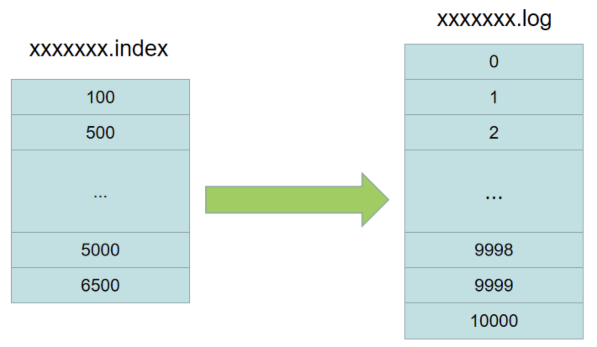
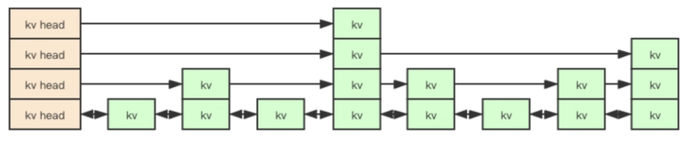

[TOC]

# 跳表

原文转自：<a href='https://www.cnblogs.com/aspirant/p/11475295.html'>聊聊Mysql索引和redis跳表 ---redis的有序集合zset数据结构底层采用了跳表原理 时间复杂度O(logn)(阿里)</a>

<font color='red'>给链表加多级索引,空间换时间</font>，时间复杂度从`O(N)`变成`O(logN)`


### 跳表索引是否很浪费空间？

空间复杂度是`O(N)`，不是很浪费，类似一个等比数列求和，极限就是`O(N)`

### 跳表索引动态更新 和 退化问题？

当我们不停的往跳表中插入数据时，如果我们不更新索引，就可能出现某 2 个索引结点之间数据非常多的情况。极端情况下，跳表会退化成单链表。


作为一种动态数据结构，我们需要某种手段来维护索引与原始链表大小之间的平滑，也就是说如果链表中结点多了，索引结点就相应地增加一些，避免复杂度退化，以及查找、插入、删除操作性能下降。

跳表是通过随机函数来维护前面提到的 平衡性。我们往跳表中插入数据的时候，可以选择同时将这个数据插入到第几级索引中，比如随机函数生成了值 K，那我们就将这个结点添加到第一级到第 K 级这 K 级索引中。


# zset

## redis有序集合的使用

Redis 有序集合和集合一样也是string类型元素的集合,且不允许重复的成员。不同的是每个元素都会关联一个double类型的分数。redis正是通过分数来为集合中的成员进行从小到大的排序。

有序集合的成员是唯一的,但分数(score)却可以重复。 集合中最大的成员数为`2^32 - 1`(4294967295, 每个集合可存储40多亿个成员)。

```java
redis 127.0.0.1:6379> ZADD runoobkey 1 redis
(integer) 1
redis 127.0.0.1:6379> ZADD runoobkey 2 mongodb
(integer) 1
redis 127.0.0.1:6379> ZADD runoobkey 3 mysql
(integer) 1
redis 127.0.0.1:6379> ZADD runoobkey 3 mysql
(integer) 0
redis 127.0.0.1:6379> ZADD runoobkey 4 mysql
(integer) 0
redis 127.0.0.1:6379> ZRANGE runoobkey 0 10 WITHSCORES

1) "redis"
2) "1"
3) "mongodb"
4) "2"
5) "mysql"
6) "4"
```

```java
127.0.0.1:6379> ZADD runoobkey 4 mysql2
(integer) 1
127.0.0.1:6379> ZRANGE runoobkey 0 10 WITHSCORES
1) "redis"
2) "1"
3) "mongodb"
4) "2"
5) "mysql"
6) "4"
7) "mysql2"
8) "4"
127.0.0.1:6379>
```

zset应用
* 延时队列
* 实现排行榜
* 限流

## 底层实现

### 类比kafka消息log存储

Kafka在进行持久化的时候，生成了两个文件，一个是xxxxxxx.log，一个是xxxxxxx.index，这其中log文件中以链表的形式保存着消息的详细信息，而index文件中，则是保存着这些消息的索引，或者说偏移量，但又不是每一条消息的索引都在index文件中存在，而是稀疏的，比如log文件中的消息的索引从0-10000，那么index文件中存储的索引可能是100， 500， 700， 1000， 5000， 6500，每一个索引中都保存着对应的log文件中的消息的具体位置



比如当要访问偏移量为899的这条消息时，先去index文件中查找，找到了700和1000这个区间，根据700这个索引中的信息，找到log文件中700这条消息的具体位置，然后顺序往下查找，直到找到索引为899的这条消息为止。从这个实现中我们可以看到，Kafka并没有进行log文件的整个遍历，而是通过index中的稀疏索引，找到消息在log中的大概位置，然后顺序遍历找到消息，这样就大大提高了查找的效率

### redis zset基于跳表实现



### 为什么Redis选择使用跳表而不是红黑树来实现有序集合？

首先分析下Redis的有序集合支持的操作：

1. 插入元素
2. 删除元素
3. 查找元素
4. 有序输出所有元素
5. 查找区间内所有元素

其中，前4项红黑树都可以完成，且时间复杂度与跳表一致。但是，最后一项，红黑树的效率就没有跳表高了。在跳表中，要查找区间的元素，我们只要定位到两个区间端点在最低层级的位置，然后按顺序遍历元素就可以了，非常高效。

而红黑树只能定位到端点后，再从首位置开始每次都要查找后继节点，相对来说是比较耗时的。此外，跳表实现简单且易读，红黑树实现起来相对困难，所以Redis选择使用跳表来实现有序集合。
