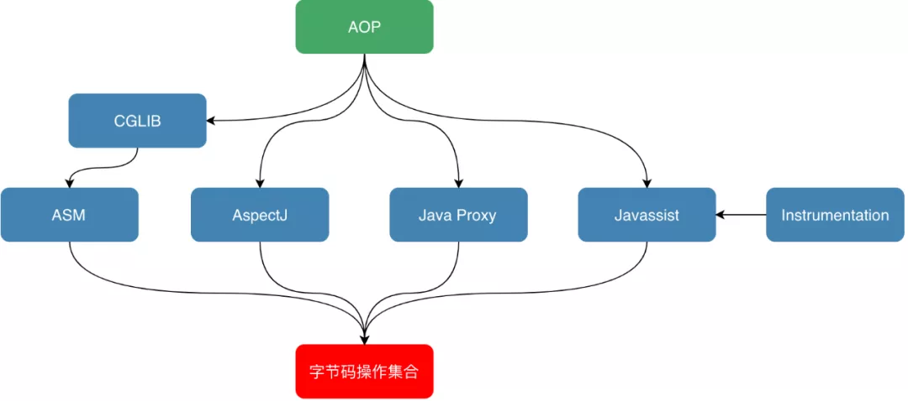

[TOC]

# 代理模式

## 为什么要用代理模式？

* 中介隔离作用

在某些情况下，一个客户类不想或者不能(比如找房子:某些时候找不到房东，而只能找到中介)直接引用一个委托对象，而代理类对象可以在客户类和委托对象之间起到中介的作用，其特征是代理类和委托类实现相同的接口。

* 开闭原则，增加功能

代理类除了是客户类和委托类的中介之外，我们还可以通过给代理类增加额外的功能来扩展委托类的功能，这样做我们只需要修改代理类而不需要再修改委托类，符合代码设计的开闭原则(`软件对象（类、模块、方法等）应该对于扩展是开放的，对修改是关闭的`)。代理类主要负责为委托类预处理消息、过滤消息、把消息转发给委托类，以及事后对返回结果的处理等。代理类本身并不真正实现服务，而是同过调用委托类的相关方法，来提供特定的服务。真正的业务功能还是由委托类来实现，但是可以在业务功能执行的前后加入一些公共的服务。例如我们想给项目加入缓存、日志这些功能，我们就可以使用代理类来完成，而没必要打开已经封装好的委托类。

## 静态代理

在程序运行前就已经存在代理类的字节码`.class`文件，代理类和委托类的关系在运行前就确定了

代理对象的一个接口只服务于一种类型的对象；且如果要代理的方法很多，势必要<font color='red'>为每一种方法都进行代理</font>，**不易扩展**

* 代理类

```java
package reflect;

/**
 * @Author mubi
 * @Date 2020/6/16 21:13
 */
public class PayStaticProxy implements PayService{
    private PayService payService;

    public PayStaticProxy(PayService payService) {
        this.payService = payService;
    }

    @Override
    public String payUse() {
        System.out.println("in PayStaticProxy");
        return payService.payUse();
    }

    public PayService getPayService() {
        return payService;
    }

    public void setPayService(PayService payService) {
        this.payService = payService;
    }
}
```

```java
/**
 * @Author mubi
 * @Date 2020/6/16 06:44
 */
public interface PayService {
    String payUse();
}
```

```java
package reflect;

/**
 * @Author mubi
 * @Date 2020/6/16 06:43
 */
public class WeixinPayServiceImpl implements PayService {

    @Override
    public String payUse() {
        System.out.println("in method payUse");
        return "WeixinPayServiceImpl";
    }
}
```

* 测试代码

```java
static void testStaticProxy() throws Exception{
    PayService payService = new WeixinPayServiceImpl();
    PayStaticProxy payStaticProxy = new PayStaticProxy(payService);
    /**
        * in method payUse
        * WeixinPayServiceImpl
        */
    System.out.println(payService.payUse());
    Class clazz = payStaticProxy.getClass();
    Field[] fields = clazz.getDeclaredFields();
    for(Field field: fields) {
        Class fieldClazz = field.getType();
        /**
            *  ---interface reflect.PayService
            */
        System.out.println("---" + fieldClazz);
    }
    PayService payService1 = payStaticProxy.getPayService();
    /**
        * true
        */
    System.out.println(payService1 instanceof WeixinPayServiceImpl);
    /**
        * false
        */
    System.out.println(payService1 instanceof AliPayServiceImpl);
}
```

## 动态代理

* 在程序运行期间由JVM根据反射等机制动态的生成，不存在代理类的字节码文件。代理类和委托类的关系是在程序运行时确定的

### 动态代理的几种实现方式?

动态代理；动态字节码生成代理；自定义类加载器；字节码转换等

```java
       编译                     ClassLoader加载                 实例

.java ------> .class(字节码)  -------------------> Class Obj ------------> Class Instance
```

动态代理技术
1. Java Proxy（接口&反射机制，<font color='red'>新增一个完整的class字节码</font>:继承Proxy,实现接口类）
2. CGLib（父类继承，<font color='red'>新增一个完整的class字节码</font>）
3. AspectJ（<font color='blue'>修改现有字节码</font>）
4. JavaAgent（<font color='blue'>修改现有字节码</font>）



#### JDK原生动态代理(反射机制)

其中：`InvocationHandler`接口是`Proxy`代理实例的调用处理程序实现的一个接口，每一个proxy代理实例都有一个关联的调用处理程序；在代理实例调用方法时，方法调用被编码分派到调用处理程序的`invoke`方法。

核心就是代理对象的生成，即`Proxy.newProxyInstance(classLoader, proxyInterface, handler)`

* Service

```java
package reflect;

/**
 * @Author mubi
 * @Date 2020/6/16 06:44
 */
public interface PayService {
    String payUse();
}
```

* Service的其中一个实现类

```java
package reflect;

/**
 * @Author mubi
 * @Date 2020/6/16 06:43
 */
public class AliPayServiceImpl implements PayService {

    @Override
    public String payUse() {
        return "AliPayServiceImpl";
    }
}
```

* 代理类(实现InvocationHandler接口)

```java
package reflect;

import java.lang.reflect.InvocationHandler;
import java.lang.reflect.Method;
import java.lang.reflect.Proxy;

/**
 * @Author mubi
 * @Date 2020/6/16 21:13
 */
public class PayProxy implements InvocationHandler {

    private PayService pay;
    private PayService proxy;

    public PayProxy(PayService pay) {
        this.pay = pay;
        // newProxyInstance方法的三个参数：
        // 1. 用哪个类加载器去加载代理对象
        // 2. 动态代理类需要实现的接口
        // 3. 动态代理方法在执行时，会调用this里面的invoke方法去执行
        this.proxy = (PayService)Proxy.newProxyInstance(
                PayService.class.getClassLoader(),
                new Class<?>[] { PayService.class },
                this);
    }

    // 返回原接口的代理对象，通过反射方式new出来的：Proxy.newProxyInstance
    public PayService getProxy() {
        return proxy;
    }

    // 实现方法的增强, 对PayService内部的所有方法都能应用该代理方法
    @Override
    public Object invoke(Object proxy, Method method, Object[] args) throws Throwable {
        String methodName = method.getName();
        System.out.println("before methodName:" + methodName);
        // 这里注意是pay，即实际的实现类
        Object rs = method.invoke(pay, args);
        System.out.println("after methodName:" + methodName);
        return rs;
    }
}
```

* 测试使用

```java
package reflect;

/**
 * @Author mubi
 * @Date 2020/6/16 06:44
 */
public class ClientTest {

    public static void main(String[] args) {
       PayService pay = new PayProxy(new AliPayServiceImpl()).getProxy();
       String payStr = pay.payUse();
       System.out.println(payStr);
    }
}
```

#### CGLIB(Code Generator Library)

CGLIB代理主要通过对字节码的操作，为对象引入间接级别，以控制对象的访问

* 代理类

```java
package reflect;

import net.sf.cglib.proxy.Enhancer;
import net.sf.cglib.proxy.MethodInterceptor;
import net.sf.cglib.proxy.MethodProxy;

import java.lang.reflect.Method;

/**
 * @Author mubi
 * @Date 2020/6/16 21:13
 */
public class PayProxy implements MethodInterceptor {

    public Object createProxyObj(Class<?> clazz) {
        Enhancer enhancer = new Enhancer();
        enhancer.setSuperclass(clazz);
        enhancer.setCallback(this);
        // 代理对象
        return enhancer.create();
    }

    @Override
    public Object intercept(Object o, Method method, Object[] objects, MethodProxy methodProxy) throws Throwable {
        System.out.println("before methodName:" + method.getName());
        Object rs = methodProxy.invokeSuper(o, objects);
        System.out.println("after methodName:" + method.getName());
        return rs;
    }
}
```

* 测试

```java
package reflect;

/**
 * @Author mubi
 * @Date 2020/6/16 06:44
 */
public class ClientTest {

    public static void main(String[] args) {
       PayService pay = (PayService) new PayProxy().createProxyObj(AliPayServiceImpl.class);
       String payStr = pay.payUse();
       System.out.println(payStr);
    }
}
```

* Enhancer既能够代理**普通的class**，也能够**代理接口**。Enhancer创建一个被代理对象的子类并且拦截所有的方法调用（包括从Object中继承的toString和hashCode方法），Enhancer不能够拦截final方法

##### cglib 底层原理

* 底层使用ASM(ASM是一个Java字节码操纵框架)，可以直接产生二进制class文件；动态字节码技术，不是反射(`method.invoke`)执行

* 代理本质：增强，拦截，前后加代码逻辑

eg: 实现`MethodInterceptor`的**intercept**方法，可以任意修改目标方法

### Jdk动态代理和Cglib动态代理的区别？

* Jdk动态代理只能对**实现了接口的类**生成代理，而不能针对类
* Cglib是针对类实现代理，主要是对指定的类生成一个子类，覆盖其中的方法

1. Jdk动态代理类实现了InvocationHandler接口，重写的invoke方法。
2. Jdk动态代理的基础是反射机制:method.invoke(对象，参数)，Proxy.newProxyInstance()
3. Cglib动态代理原理是对指定的目标生成一个子类，并覆盖其中方法实现增强；不能对final修饰的类进行代理，因为采用的是继承。

### 为什么Jdk动态代理必须基于接口？

原始对象 ---> 代理对象

* Jdk代理对象继承了`java.lang.reflect.Proxy`对象，由于Java只支持单一继承；那么代理对象要和原始对象关联起来并作出改变，那么原始对象必然要实现接口，这样代理对象能实现这些接口去对原始对象进行关联并作出改变
* Jdk代理对具体实现的方法内部并不关心：`InvocationHandler.invoke`方法去处理时，只要根据给的接口反射出需要的方法，参数等去执行就好了，是面向接口的
* 从代理模式的设计来说，充分利用了Java的多态特性，也符合基于接口编码的规范

附加：多态是同一个行为具有多个不同表现形式或形态的能力；多态就是同一个接口，使用不同的实例而执行不同操作。
    * 继承
    * 重写
    * 父类引用指向子类对象：`Parent p = new Child();`

---

* `Proxy#newProxyInstance`方法源码

```java
public static Object newProxyInstance(ClassLoader loader,Class<?>[] interfaces,
                                                               InvocationHandler h) throws IllegalArgumentException {
    .....
    Class<?> cl = getProxyClass0(loader, intfs);//获取或生成代理类
    ....
    final Constructor<?> cons = cl.getConstructor(constructorParams);//得到参数类型是InvocationHandler.class构造函数
    ....
    return cons.newInstance(new Object[]{h});//生成代理实例
    ....
}
```

* java.lang.reflect.Proxy.ProxyClassFactory#apply

```java
/*
* Generate the specified proxy class.
*/
byte[] proxyClassFile = ProxyGenerator.generateProxyClass(
    proxyName, interfaces, accessFlags);
try {
    return defineClass0(loader, proxyName,
                        proxyClassFile, 0, proxyClassFile.length);
} catch (ClassFormatError e) {
    /*
        * A ClassFormatError here means that (barring bugs in the
        * proxy class generation code) there was some other
        * invalid aspect of the arguments supplied to the proxy
        * class creation (such as virtual machine limitations
        * exceeded).
        */
    throw new IllegalArgumentException(e.toString());
}
```

```java
private byte[] generateClassFile() {
    //首先为代理类生成toString, hashCode, equals等代理方法
    addProxyMethod(hashCodeMethod, Object.class);
    addProxyMethod(equalsMethod, Object.class);
    addProxyMethod(toStringMethod, Object.class);
    //遍历每一个接口的每一个方法, 并且为其生成ProxyMethod对象
    for (int i = 0; i < interfaces.length; i++) {
        Method[] methods = interfaces[i].getMethods();
        for (int j = 0; j < methods.length; j++) {
             addProxyMethod(methods[j], interfaces[i]);
        }
     }
     ....//将类的属性写入bout流中
     return bout.toByteArray();
}
```

主要是分多步将被代理类的方法属性等写到字节流中（class文件中可以看到`extends Proxy`），然后生成代理类

#### 还原Jdk动态代理生成的代理类

```java
package reflect;

import java.lang.reflect.InvocationHandler;
import java.lang.reflect.Method;
import java.lang.reflect.Proxy;

/**
 * @Author mubi
 * @Date 2020/6/16 21:13
 */
public class PayJdkProxy implements InvocationHandler {

    private PayService pay;
    private PayService proxy;

    public PayJdkProxy(PayService pay) {
        this.pay = pay;
        // newProxyInstance方法的三个参数：
        // 1. 用哪个类加载器去加载代理对象
        // 2. 动态代理类需要实现的接口
        // 3. 动态代理方法在执行时，会调用this里面的invoke方法去执行
        this.proxy = (PayService)Proxy.newProxyInstance(
                PayService.class.getClassLoader(),
                new Class<?>[] { PayService.class },
                this);
    }

    public PayService getProxy() {
        return proxy;
    }

    // 实现方法的增强
    @Override
    public Object invoke(Object proxy, Method method, Object[] args) throws Throwable {
        String methodName = method.getName();
        System.out.println("before methodName:" + methodName);
        Object rs = method.invoke(pay, args);
        System.out.println("after methodName:" + methodName);
        return rs;
    }
}
```

```java
public static void main(String[] args) throws Exception{
    PayService payService = new PayJdkProxy(new AliPayServiceImpl())
            .getProxy();
    payService.payUse();

    Class<?>[] interfaces = new Class[]{PayService.class};
    byte[] bytes = ProxyGenerator.generateProxyClass("MyPayService",
            interfaces);
    File file = new File("Test.class");
    try{
        FileOutputStream fileOutputStream = new FileOutputStream(file);
        fileOutputStream.write(bytes);
        fileOutputStream.flush();
        fileOutputStream.close();
    }catch (Exception e){

    }
}
```

生成的class

```java
//
// Source code recreated from a .class file by IntelliJ IDEA
// (powered by Fernflower decompiler)
//

import java.lang.reflect.InvocationHandler;
import java.lang.reflect.Method;
import java.lang.reflect.Proxy;
import java.lang.reflect.UndeclaredThrowableException;
import reflect.PayService;

public final class MyPayService extends Proxy implements PayService {
    private static Method m1;
    private static Method m2;
    private static Method m3;
    private static Method m0;

    public MyPayService(InvocationHandler var1) throws  {
        super(var1);
    }

    public final boolean equals(Object var1) throws  {
        try {
            return (Boolean)super.h.invoke(this, m1, new Object[]{var1});
        } catch (RuntimeException | Error var3) {
            throw var3;
        } catch (Throwable var4) {
            throw new UndeclaredThrowableException(var4);
        }
    }

    public final String toString() throws  {
        try {
            return (String)super.h.invoke(this, m2, (Object[])null);
        } catch (RuntimeException | Error var2) {
            throw var2;
        } catch (Throwable var3) {
            throw new UndeclaredThrowableException(var3);
        }
    }

    public final String payUse() throws  {
        try {
            return (String)super.h.invoke(this, m3, (Object[])null);
        } catch (RuntimeException | Error var2) {
            throw var2;
        } catch (Throwable var3) {
            throw new UndeclaredThrowableException(var3);
        }
    }

    public final int hashCode() throws  {
        try {
            return (Integer)super.h.invoke(this, m0, (Object[])null);
        } catch (RuntimeException | Error var2) {
            throw var2;
        } catch (Throwable var3) {
            throw new UndeclaredThrowableException(var3);
        }
    }

    static {
        try {
            m1 = Class.forName("java.lang.Object").getMethod("equals", Class.forName("java.lang.Object"));
            m2 = Class.forName("java.lang.Object").getMethod("toString");
            m3 = Class.forName("reflect.PayService").getMethod("payUse");
            m0 = Class.forName("java.lang.Object").getMethod("hashCode");
        } catch (NoSuchMethodException var2) {
            throw new NoSuchMethodError(var2.getMessage());
        } catch (ClassNotFoundException var3) {
            throw new NoClassDefFoundError(var3.getMessage());
        }
    }
}
```
