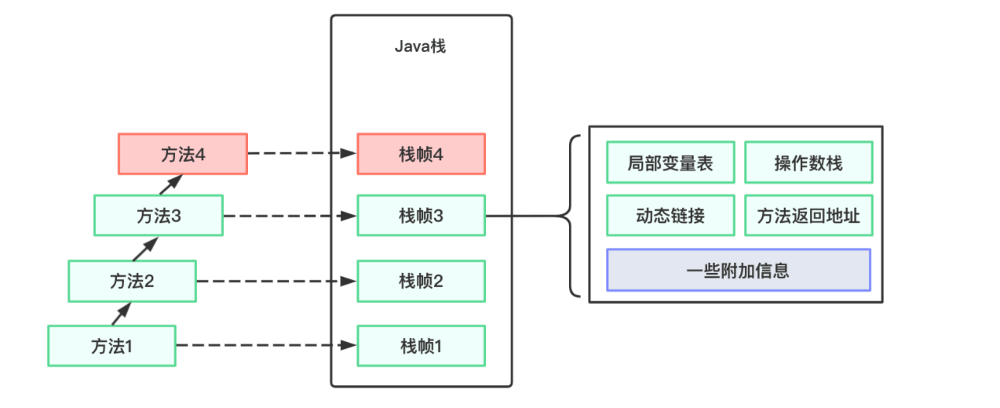
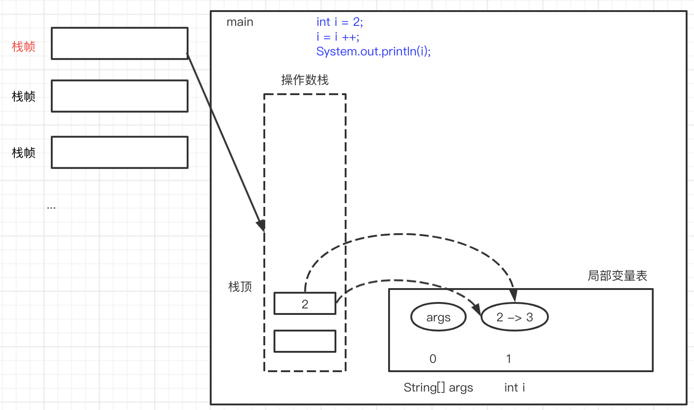

[TOC]

# ASM

ASM是一个通用的Java字节码操作和分析框架。 它可以用于修改现有类或直接以二进制形式动态生成类。 ASM提供了一些常见的字节码转换和分析算法，可以从中构建自定义复杂转换和代码分析工具。 ASM提供与其他Java字节码框架类似的功能，但专注于性能。 因为它的设计和实现尽可能小而且快，所以它非常适合在动态系统中使用（但当然也可以以静态方式使用，例如在编译器中）

## 回顾类加载相关流程

```js
加载（即加载class文件）
  =>连接( 验证 =》 准备 =》 解析)
     => 初始化
         => 使用
            => 卸载
```

* 加载操作：这是由类加载器（ClassLoader）执行的。通过一个类的`全限定名`来获取其定义的`二进制字节流`（Class字节码），将这个字节流所代表的静态存储结构转化为运行时(Runtime data area)区域的入口，根据字节码在Java`堆`中生成一个代表这个类的`java.lang.Class`对象。

## 回顾虚拟机栈（线程stack）

描述了Java方法执行的内存模型，创建栈帧，保存该本地方法的局部变量表、操作数栈、动态链接、出口信息。

1. Java虚拟机栈是线程私有的，它的生命周期与线程相同（随线程而生，随线程而灭）
2. 栈帧包括局部变量表、操作数栈、动态链接、方法返回地址和一些附加信息
3. 每一个方法被调用直至执行完毕的过程，就对应这一个栈帧在虚拟机栈中从入栈到出栈的过程



## iload, istore指令认识

`int a = 10; int b = 11; int c = a + b`


```java
0: bipush        10
2: istore_1
3: bipush        11
5: istore_2
6: iload_1
7: iload_2
8: iadd
9: istore_3
```

## i++面试题

```java
public class MyTest {

    public static void main(String[] args) {
        int i = 2;
        i = i ++;
        System.out.println(i); // 打印2,而不是3
    }
}
```

```java
public class Hello {
  public Hello();
    Code:
       0: aload_0
       1: invokespecial #1                  // Method java/lang/Object."<init>":()V
       4: return

  public static void main(java.lang.String[]);
    Code:
       0: iconst_2
       1: istore_1
       2: iload_1
       3: iinc          1, 1
       6: istore_1
       7: getstatic     #2                  // Field java/lang/System.out:Ljava/io/PrintStream;
      10: iload_1
      11: invokevirtual #3                  // Method java/io/PrintStream.println:(I)V
      14: return
}
```

需要理解：Class结构，JVM指令码，线程栈，局部变量表

* `iinc`指令不会改变操作数栈的，`istore`指令会把int变量(从操作栈或常量池中)加到局部变量表中
* `i++` 在指令层面是:先`iload`把数据从局部变量表中压入到操作数栈(不改变局部变量表)，再`iinc`指在局部变量表中进行加1操作



## ASM的使用

ASM框架中的核心类有以下几个：

1. ClassReader:该类用来解析编译过的class字节码文件。
2. ClassWriter:该类用来重新构建编译后的类，比如说修改类名、属性以及方法，甚至可以生成新的类的字节码文件。
3. ClassAdapter:该类也实现了ClassVisitor接口，它将对它的方法调用委托给另一个ClassVisitor对象。
