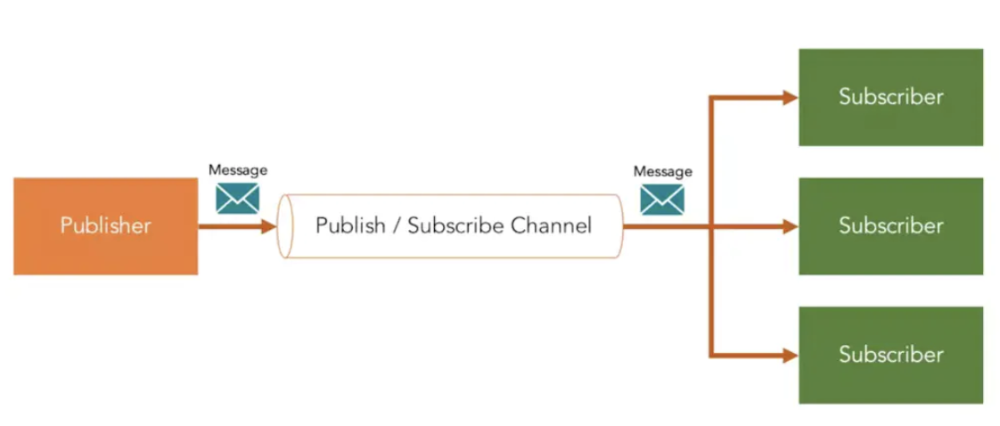

[TOC]

# 发布订阅



发布/订阅者模式最大的特点就是实现了松耦合，也就是说你可以让发布者发布消息、订阅者接受消息，而不是寻找一种方式把两个分离 的系统连接在一起。当然这种松耦合也是发布/订阅者模式最大的缺点，因为需要中间的代理，增加了系统的复杂度。而且发布者无法实时知道发布的消息是否被每个订阅者接收到了，增加了系统的不确定性。


参考文章：<a href='https://hackernoon.com/observer-vs-pub-sub-pattern-50d3b27f838c'>https://hackernoon.com/observer-vs-pub-sub-pattern-50d3b27f838c</a>, 理解发布订阅模式和观察者模式的区别

Let’s list out the differences as a quick Summary:

* In the Observer pattern, the O**bservers are aware of the Subject, also the Subject maintains a record of the Observers**. Whereas, in Publisher/Subscriber, publishers and subscribers don’t need to know each other. They simply communicate with the help of message queues or broker.

* In Publisher/Subscriber pattern, components are loosely coupled as opposed to Observer pattern.

* Observer pattern is mostly implemented in a synchronous way, i.e. the Subject calls the appropriate method of all its observers when some event occurs. The Publisher/Subscriber pattern is mostly implemented in an asynchronous way (using message queue).

* Observer pattern needs to be implemented in a single application address space. On the other hand, the Publisher/Subscriber pattern is more of a cross-application pattern.

发布订阅解偶，通常使用消息中间件，能实现跨平台、异步通信

---

例子代码：


* 发布者发布消息

```java
public interface Publisher {

    // 发布消息
    void publishMessage(String msg);

}
```

* 订阅者订阅并响应消息

```java
public interface Subscriber {

    // 进行订阅
    void subscribe();

    // 响应消息
    void onMessage(String message);
}
```

* 第三方中间件做消息中转并通知订阅者

```java
public class Broker {

    List<Subscriber> subscriberList = new ArrayList<>();

    List<Publisher> publishList = new ArrayList<>();

    List<String> messageList = new ArrayList<>();


    public void notifySubscribers(){
        while(!messageList.isEmpty()){
            String message = messageList.remove(0);
            for(Subscriber subscriber :subscriberList){
                subscriber.onMessage(message);
            }
        }
    }

    public void publishMessage(String message){
        messageList.add(message);
    }

    public void subscribt(Subscriber subscriber){
        subscriberList.add(subscriber);
    }

    public void publish(Publisher publisher){
        publishList.add(publisher);
    }

    public static void main(String[] args) {
        // 发布订阅中心, 消息中间件一样
        Broker broker = new Broker();

        // 发布者注册
        Publisher1 publisher = new Publisher1();
        publisher.setBroker(broker);

        // 订阅者注册
        Subscriber1 subscriber = new Subscriber1();
        subscriber.setBroker(broker);

        subscriber.subscribe();

        // 发布者发布消息
        publisher.publishMessage("hello");

        // 中间间会通知所有订阅者
        broker.notifySubscribers();
    }
}
```
