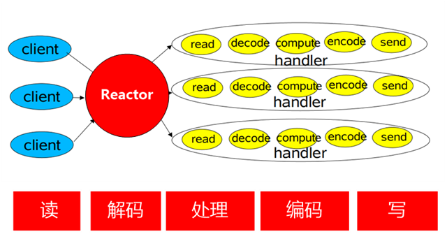

[TOC]

# 线程上下文设计模式

上下文是贯穿整个系统或阶段生命周期的对象，其中包含了系统全局的一些信息，比如登录后的用户信息、账号信息，以及在程序每一个阶段运行时的数据。设计时要考虑到全局唯一性，还要考虑有些成员只能被初始化一次，比如配置信息加载，以及在多线程环境下，上下文成员的线程安全性。

# Reactor 模式

* reactor: n. 核反应堆;

基于事件驱动，主程序将事件以及对应事件处理的方法在Reactor上进行注册, 如果相应的事件发生（比如轮询判断），Reactor将会主动调用事件注册的接口，即 回调函数.



最简单的Reactor模式：注册所有感兴趣的事件处理器，单线程轮询选择就绪事件，执行事件处理器。

```java
 interface ChannelHandler{
      void channelReadable(Channel channel);
      void channelWritable(Channel channel);
   }
   class Channel{
     Socket socket;
     Event event;//读，写或者连接
   }

   //IO线程主循环:
   class IoThread extends Thread{
   public void run(){
   Channel channel;
   while(channel=Selector.select()){//选择就绪的事件和对应的连接
      if(channel.event==accept){
         registerNewChannelHandler(channel);//如果是新连接，则注册一个新的读写处理器
      }
      if(channel.event==write){
         getChannelHandler(channel).channelWritable(channel);//如果可以写，则执行写事件
      }
      if(channel.event==read){
          getChannelHandler(channel).channelReadable(channel);//如果可以读，则执行读事件
      }
    }
   }
   Map<Channel，ChannelHandler> handlerMap;//所有channel的对应事件处理器
  }
```

* 单线程处理I/O的效率确实非常高，没有线程切换，只是拼命的读、写、选择事件。但现在的服务器，一般都是多核处理器，如果能够利用多核心进行I/O，无疑对效率会有更大的提高。

## 传统做法回顾

### 服务器一个while，单线程处理客户端所有的请求

```java
while(true){
    socket = accept();
    handle(socket)
}
```

### 多线程/线程池，每个请求分配一个线程处理

```java
while(true){
    socket = accept();
    new thread(socket);
}
```

线程同步的粒度太大了，限制了吞吐量。应该把一次连接的操作分为更细的粒度或者过程，这些更细的粒度是更小的线程。整个线程池的数目会翻倍，但是线程更简单，任务更加单一

### 事件驱动

事件驱动程序的基本结构是由一个事件收集器、一个事件发送器和一个事件处理器组成。

* 事件收集器专门负责收集所有事件
* 事件发送器负责将收集器收集到的事件分发到目标对象中
* 事件处理器做具体的事件响应工作

### Reactor

在Reactor中，这些被拆分的小线程或者子过程对应的是`handler`，每一种`handler`会出处理一种`event`。

这里会有一个全局的管理者`selector`，我们需要把`channel`注册感兴趣的事件，那么这个`selector`就会不断在`channel`上检测是否有该类型的事件发生，如果没有，那么主线程就会被阻塞，否则就会调用相应的事件处理函数即`handler`来处理。

# Future

"凭据"：如果有任务执行需要比较长的时间，通常需要等待任务执行结束或者出错才能返回结果，在此期间调用者只能陷入阻塞苦苦等待，对此，Future设计模式提供了一种凭据式解决方案。可以先提交任务，立即返回一个凭据，调用者可稍后凭借凭借查询执行结果。

## Callable 接口

类似`Runnable`接口(都是由另外的线程去执行)，但是Runnable就是线程执行，不能返回结果，也无法抛出一个`checked exception`,Callable则可以

```java
/**
 * A task that returns a result and may throw an exception.
 * Implementors define a single method with no arguments called
 * {@code call}.
 *
 * <p>The {@code Callable} interface is similar to {@link
 * java.lang.Runnable}, in that both are designed for classes whose
 * instances are potentially executed by another thread.  A
 * {@code Runnable}, however, does not return a result and cannot
 * throw a checked exception.
 *
 * <p>The {@link Executors} class contains utility methods to
 * convert from other common forms to {@code Callable} classes.
 *
 * @see Executor
 * @since 1.5
 * @author Doug Lea
 * @param <V> the result type of method {@code call}
 */
@FunctionalInterface
public interface Callable<V> {
    /**
     * Computes a result, or throws an exception if unable to do so.
     *
     * @return computed result
     * @throws Exception if unable to compute a result
     */
    V call() throws Exception;
}
```

## Future 接口

`Future`就是对于具体的`Runnable`或者`Callable`任务的执行结果能进行取消、查询是否完成、获取结果。

主要是将一些耗时的操作交给一个线程去执行，从而达到异步的目的；在提交线程在提交任务和获得任务结果的过程中可以进行其它任务操作，而不是傻傻的等待

```java
public interface Future<V> {

    /**
     * Attempts to cancel execution of this task.  This attempt will
     * fail if the task has already completed, has already been cancelled,
     * or could not be cancelled for some other reason. If successful,
     * and this task has not started when {@code cancel} is called,
     * this task should never run.  If the task has already started,
     * then the {@code mayInterruptIfRunning} parameter determines
     * whether the thread executing this task should be interrupted in
     * an attempt to stop the task.
     *
     * <p>After this method returns, subsequent calls to {@link #isDone} will
     * always return {@code true}.  Subsequent calls to {@link #isCancelled}
     * will always return {@code true} if this method returned {@code true}.
     *
     * @param mayInterruptIfRunning {@code true} if the thread executing this
     * task should be interrupted; otherwise, in-progress tasks are allowed
     * to complete
     * @return {@code false} if the task could not be cancelled,
     * typically because it has already completed normally;
     * {@code true} otherwise
     */
    boolean cancel(boolean mayInterruptIfRunning);

    /**
     * Returns {@code true} if this task was cancelled before it completed
     * normally.
     *
     * @return {@code true} if this task was cancelled before it completed
     */
    boolean isCancelled();

    /**
     * Returns {@code true} if this task completed.
     *
     * Completion may be due to normal termination, an exception, or
     * cancellation -- in all of these cases, this method will return
     * {@code true}.
     *
     * @return {@code true} if this task completed
     */
    boolean isDone();

    /**
     * Waits if necessary for the computation to complete, and then
     * retrieves its result.
     *
     * @return the computed result
     * @throws CancellationException if the computation was cancelled
     * @throws ExecutionException if the computation threw an
     * exception
     * @throws InterruptedException if the current thread was interrupted
     * while waiting
     */
    V get() throws InterruptedException, ExecutionException;

    /**
     * Waits if necessary for at most the given time for the computation
     * to complete, and then retrieves its result, if available.
     *
     * @param timeout the maximum time to wait
     * @param unit the time unit of the timeout argument
     * @return the computed result
     * @throws CancellationException if the computation was cancelled
     * @throws ExecutionException if the computation threw an
     * exception
     * @throws InterruptedException if the current thread was interrupted
     * while waiting
     * @throws TimeoutException if the wait timed out
     */
    V get(long timeout, TimeUnit unit)
        throws InterruptedException, ExecutionException, TimeoutException;
}
```

## RunnableFuture 接口

```java
/**
 * A {@link Future} that is {@link Runnable}. Successful execution of
 * the {@code run} method causes completion of the {@code Future}
 * and allows access to its results.
 * @see FutureTask
 * @see Executor
 * @since 1.6
 * @author Doug Lea
 * @param <V> The result type returned by this Future's {@code get} method
 */
public interface RunnableFuture<V> extends Runnable, Future<V> {
    /**
     * Sets this Future to the result of its computation
     * unless it has been cancelled.
     */
    void run();
}
```

## FutureTask 类

```java
/**
 * A cancellable asynchronous computation.  This class provides a base
 * implementation of {@link Future}, with methods to start and cancel
 * a computation, query to see if the computation is complete, and
 * retrieve the result of the computation.  The result can only be
 * retrieved when the computation has completed; the {@code get}
 * methods will block if the computation has not yet completed.  Once
 * the computation has completed, the computation cannot be restarted
 * or cancelled (unless the computation is invoked using
 * {@link #runAndReset}).
 *
 * <p>A {@code FutureTask} can be used to wrap a {@link Callable} or
 * {@link Runnable} object.  Because {@code FutureTask} implements
 * {@code Runnable}, a {@code FutureTask} can be submitted to an
 * {@link Executor} for execution.
 *
 * <p>In addition to serving as a standalone class, this class provides
 * {@code protected} functionality that may be useful when creating
 * customized task classes.
 *
 * @since 1.5
 * @author Doug Lea
 * @param <V> The result type returned by this FutureTask's {@code get} methods
 */
public class FutureTask<V> implements RunnableFuture<V> {
```

### get 方法获取返回结果

```java
/**
     * @throws CancellationException {@inheritDoc}
     */
    public V get() throws InterruptedException, ExecutionException {
        int s = state;
        if (s <= COMPLETING)
            s = awaitDone(false, 0L);
        return report(s);
    }
```

```java
/**
     * Awaits completion or aborts on interrupt or timeout.
     *
     * @param timed true if use timed waits
     * @param nanos time to wait, if timed
     * @return state upon completion
     */
    private int awaitDone(boolean timed, long nanos)
        throws InterruptedException {
        final long deadline = timed ? System.nanoTime() + nanos : 0L;
        WaitNode q = null;
        boolean queued = false;
        for (;;) {
            if (Thread.interrupted()) {
                removeWaiter(q);
                throw new InterruptedException();
            }

            int s = state;
            if (s > COMPLETING) {
                if (q != null)
                    q.thread = null;
                return s;
            }
            else if (s == COMPLETING) // cannot time out yet
                Thread.yield();
            else if (q == null)
                q = new WaitNode();
            else if (!queued)
                queued = UNSAFE.compareAndSwapObject(this, waitersOffset,
                                                     q.next = waiters, q);
            else if (timed) {
                nanos = deadline - System.nanoTime();
                if (nanos <= 0L) {
                    removeWaiter(q);
                    return state;
                }
                LockSupport.parkNanos(this, nanos);
            }
            else
                LockSupport.park(this);
        }
    }
```

### run 方法执行任务

```java
public void run() {
    //1.判断状态是否是NEW，不是NEW，说明任务已经被其他线程执行，甚至执行结束，或者被取消了，直接返回
    //2.调用CAS方法，判断RUNNER为null的话，就将当前线程保存到RUNNER中，设置RUNNER失败，就直接返回
    if (state != NEW ||
            !U.compareAndSwapObject(this, RUNNER, null, Thread.currentThread()))
        return;
    try {
        Callable<V> c = callable;
        if (c != null && state == NEW) {
            V result;
            boolean ran;
            try {
                //3.执行Callable任务，结果保存到result中
                result = c.call();
                ran = true;
            } catch (Throwable ex) {
                //3.1 如果执行任务过程中发生异常，将调用setException()设置异常
                result = null;
                ran = false;
                setException(ex);
            }
            //3.2 任务正常执行结束调用set(result)保存结果
            if (ran)
                set(result);
        }
    } finally {
        // runner must be non-null until state is settled to
        // prevent concurrent calls to run()
        //4. 任务执行结束，runner设置为null，表示当前没有线程在执行这个任务了
        runner = null;
        // state must be re-read after nulling runner to prevent
        // leaked interrupts
        //5. 读取状态，判断是否在执行的过程中，被中断了，如果被中断，处理中断
        int s = state;
        if (s >= INTERRUPTING)
            handlePossibleCancellationInterrupt(s);
    }
}
```

### FutureTask & Thread 简单使用

```java
import java.util.concurrent.Callable;
import java.util.concurrent.FutureTask;
import java.util.concurrent.TimeUnit;

public class Solution {

    public static void main(String[] args) throws Exception {

        Callable<Integer> callable = ()->{
            System.out.println("Thread [" + Thread.currentThread().getName() + "] is running");
            int result = 0;
            for(int i = 0; i < 100;++i) {
                result += i;
            }
            TimeUnit.SECONDS.sleep(5);
            return result;
        };

        // 2. 新建FutureTask,需要一个实现了Callable接口的类的实例作为构造函数参数
        FutureTask<Integer> futureTask = new FutureTask<>(callable);
        // 3. 新建Thread对象并启动
        Thread thread = new Thread(futureTask);
        thread.setName("Task thread");
        thread.start();

        try {
            Thread.sleep(1000);
        } catch (InterruptedException e) {
            e.printStackTrace();
        }

        System.out.println("Thread [" + Thread.currentThread().getName() + "] is running");

        // 4. 调用isDone()判断任务是否结束
        if(!futureTask.isDone()) {
            System.out.println("Task is not done");
            try {
                Thread.sleep(1000);
            } catch (InterruptedException e) {
                e.printStackTrace();
            }
        }
        int result = 0;
        try {
            System.out.println("get 1:" + System.currentTimeMillis());
            // 5. 调用get()方法获取任务结果,如果任务没有执行完成则阻塞等待
            result = futureTask.get();
            System.out.println("get 2:" + System.currentTimeMillis());
        } catch (Exception e) {
            e.printStackTrace();
        }

        System.out.println("result is " + result);
    }

}
```
