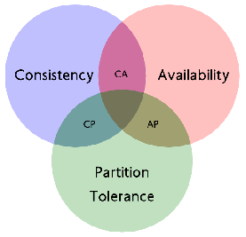
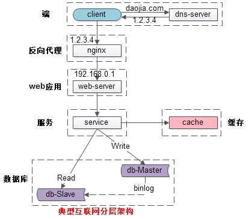
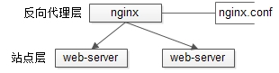

[TOC]

# 分布式

## 什么是分布式系统？

it is a set of cooperating computers that are communicating with each other over networked to ge some coherent task done.

## 从系统层面考虑，分布式应该考虑哪些维度？

## 从分布式系统部署角度考虑，分哪几层

## 分布式系统设计你会考虑哪些策略？

## 分布式一致性协议

### Zab协议(ZooKeeper Atomic Broadcast protocol)

### Raft

Raft将一致性的问题分解为了三个问题：
    * Leader Election：在Leader故障的时候，选出一个新的Leader。
    * Log Replication：Leader需要让日志完整地复制到集群内的所有服务器
    * Safety：如果某个服务器在特定的index提交了一个日志，那么不能有其它的服务器在相同的index提交日志，同一时刻只能保证有一个Leader。

处理流程
    * 发现主节点失踪一段时间后，向所有从节点向其他从节点发消息，让他们选自己为新的主节点；
    * 还没参加选举的节点如果收到其他节点的选举请求，就选举自己收到的第一个节点，后面谁再请求自己支持选举，就告诉他们我已经支持另一个节点了
    * 如果一个节点发现另一个节点得到的支持比自己多，也就开始无条件支持那个节点选举，同时让支持自己的节点也去支持它
    * 如果一轮没选出来得到大多数节点支持的主节点，就开始下一轮选举，直到一个节点得到了大部分节点支持，成为新的主节点；

### Gossip

### Lease

# CAP & Base理论

## CAP理论

* C: Consistency,一致性。在分布式系统中的所有数据备份，在同一时刻具有同样的值，所有节点在同一时刻读取的数据都是最新的数据副本。

* P: Partition tolerance,分区容错性。分布式系统中的某个节点或者网络分区出现了故障的时候，整个系统仍然能对外提供满足一致性和可用性的服务。也就是说部分故障不影响整体使用。

* A: Availability,可用性。好的响应性能，完全的可用性指的是在任何故障模型下，服务都会在有限的时间内处理完成并进行响应；从用户角度来看就是不会出现系统操作失败或者访问超时等问题。

CAP原理指的是，这三个要素最多只能同时实现两点，不可能三者兼顾。因此在进行分布式架构设计时，必须做出取舍。而对于分布式数据系统，分区容忍性是基本要求，否则就失去了价值。因此设计分布式数据系统，就是在一致性和可用性之间取一个平衡。对于大多数web应用，其实并不需要强一致性，因此牺牲一致性而换取高可用性，是目前多数分布式数据库产品的方向。当然，牺牲一致性，并不是完全不管数据的一致性，否则数据是混乱的，那么系统可用性再高分布式再好也没有了价值。牺牲一致性，只是不再要求关系型数据库中的强一致性，而是只要系统能达到最终一致性即可，考虑到客户体验，这个最终一致的时间窗口，要尽可能的对用户透明，也就是需要保障“用户感知到的一致性”。通常是通过数据的多份异步复制来实现系统的高可用和数据的最终一致性的，“用户感知到的一致性”的时间窗口则取决于数据复制到一致状态的时间。

1. CA: 优先保证一致性和可用性，放弃分区容错。 这也意味着放弃系统的扩展性，系统不再是分布式的，有违设计的初衷。
2. CP: 优先保证一致性和分区容错性，放弃可用性。在数据一致性要求比较高的场合(譬如:zookeeper,Hbase) 是比较常见的做法，一旦发生网络故障或者消息丢失，就会牺牲用户体验，等恢复之后用户才逐渐能访问。
3. AP: 优先保证可用性和分区容错性，放弃一致性。NoSQL中的Cassandra就是这种架构。跟CP一样，放弃一致性不是说一致性就不保证了，而是逐渐的变得一致。

### Base理论

Basically Available（基本可用）、Soft-state（ 软状态/柔性事务）、Eventual Consistency（最终一致性）

是基于CAP定理演化而来，是对CAP中一致性和可用性权衡的结果。核心思想：即使无法做到强一致性，但每个业务根据自身的特点，采用适当的方式来使系统达到最终一致性。

1. 基本可用：指分布式系统在出现故障的时候，允许损失部分可用性，保证核心可用。但不等价于不可用。比如：搜索引擎0.5秒返回查询结果，但由于故障，2秒响应查询结果；网页访问过大时，部分用户提供降级服务等。
2. 软状态：软状态是指允许系统存在中间状态，并且该中间状态不会影响系统整体可用性。即允许系统在不同节点间副本同步的时候存在延时。
3. 最终一致性：系统中的所有数据副本经过一定时间后，最终能够达到一致的状态，不需要实时保证系统数据的强一致性。最终一致性是弱一致性的一种特殊情况。BASE理论面向的是大型高可用可扩展的分布式系统，通过牺牲强一致性来获得可用性。（事务的ACID是传统数据库常用的概念设计，是追求强一致性模型）。

# SOA

Service-oriented architecture (SOA)：面向服务架构

# 微服务

## 单体应用

不管是什么样的架构模式都会有其优点所在，单体应用的优点如下所示：

1. 容易部署：这个不容置疑，整个项目就一个war包，部署特别方便。
2. 容易运行/测试：这个也上面也类似,我们在测试阶段只需要启动一个war包即可。
3. 没有分布式方面的问题

但是相比优点缺点反而更加明显，下面讲述一下单体应用的缺点。

### 单体应用的缺点

1. 复杂性高：随着业务的不断迭代，项目的代码量会急剧的增多，项目模块也会随着而增加，模块与模块之间的关系就会变成的很复杂，整个项目就会变成的非常复杂，在新增和修改代码的时候都会做很多的测试，很容易会由于一处的变动影响之前业务的功能。
2. 部署评率低：随便代码的增多，首先部署会越来越消耗时间，还有我们在修复一个很小很小的bug的时候整个项目都要重新部署，所以我们会集中一个时间点部署多个需求。
3. 可靠性差：这个很容易理解，假如某个影响出现了死循环，导致内存溢出，会影响整个项目挂掉。
4. 扩展性差：我们在新增业务的时候，代码层面会考虑在不影响现有的业务基础上编写代码，提高了代码的复杂性。

## 什么是微服务？

微服务的目的是**有效的拆分应用**，实现**敏捷开发**和**部署**

维基上对其定义为：一种软件开发技术- 面向服务的体系结构（SOA）架构样式的一种变体，将应用程序构造为一组松散耦合的服务。在微服务体系结构中，服务是细粒度的，协议是轻量级的。

微服务（或微服务架构）是一种云原生架构方法，其中单个应用程序由许多松散耦合且可独立部署的较小组件或服务组成。这些服务通常
1. 有自己的堆栈，包括数据库和数据模型；
2. 通过REST API，事件流和消息代理的组合相互通信；
3. 和它们是按业务能力组织的，分隔服务的线通常称为有界上下文。

### 微服务优点

1. 微服务是松藕合的，无论是在开发阶段或部署阶段都是独立的。
2. 能够快速响应, 局部修改容易, 一个服务出现问题不会影响整个应用。
3. 易于和第三方应用系统集成, 支持使用不同的语言开发, 允许你利用融合最新技术。
4. 每个微服务都很小，足够内聚，足够小，代码容易理解。团队能够更关注自己的工作成果, 聚焦指定的业务功能或业务需求。
5. 开发简单、开发效率提高，一个服务可能就是专一的只干一件事, 能够被小团队单独开发，这个小团队可以是 2 到 5 人的开发人员组成。
同样的

### 微服务缺点

1. 微服务架构带来过多的运维操作, 可能需要团队具备一定的 DevOps 技巧.
2. 分布式系统可能复杂难以管理。因为分布部署跟踪问题难。当服务数量增加，管理复杂性增加。

## 微服务如何应对高并发？

### 什么是高并发？

高并发（High Concurrency）是互联网分布式系统架构设计中必须考虑的因素之一，它通常是指，通过设计保证系统能够同时并行处理很多请求。

高并发相关常用的一些指标有响应时间（Response Time），吞吐量（Throughput），每秒查询率QPS（Query Per Second），并发用户数等。

* 响应时间：系统对请求做出响应的时间。例如系统处理一个HTTP请求需要200ms，这个200ms就是系统的响应时间。
* 吞吐量：单位时间内处理的请求数量。
* QPS：每秒响应请求数。在互联网领域，这个指标和吞吐量区分的没有这么明显。
* 并发用户数：同时承载正常使用系统功能的用户数量。例如一个即时通讯系统，同时在线量一定程度上代表了系统的并发用户数。

### 如何提升系统的并发能力？

互联网分布式架构设计，提高系统并发能力的方式，方法论上主要有两种：垂直扩展（Scale Up）与水平扩展（Scale Out）

#### 垂直扩展：提升单机处理能力,有瓶颈

* 增强单机硬件性能，例如：增加CPU核数如32核，升级更好的网卡如万兆，升级更好的硬盘如SSD，扩充硬盘容量如2T，扩充系统内存如128G；

* 提升单机架构性能，例如：使用Cache来减少IO次数，使用异步来增加单服务吞吐量，使用无锁数据结构来减少响应时间；

#### 水平扩展（必然选择）

只要增加服务器数量，就能线性扩充系统性能。水平扩展对系统架构设计是有要求的，如何在架构各层进行可水平扩展的设计？

### 常见的互联网应用架构

1. 客户端层：典型调用方是浏览器browser或者手机应用APP

2. 反向代理层：系统入口，反向代理

3. 站点应用层：实现核心应用逻辑，返回html或者json

4. 服务层：如果实现了服务化，就有这一层

5. 数据-缓存层：缓存加速访问存储

6. 数据-数据库层：数据库固化数据存储

#### 反向代理层的水平扩展

反向代理层的水平扩展，是通过“DNS轮询”实现的：dns-server对于一个域名配置了多个解析ip，每次DNS解析请求来访问dns-server，会轮询返回这些ip。

当nginx成为瓶颈的时候，只要增加服务器数量，新增nginx服务的部署，增加一个外网ip，就能扩展反向代理层的性能，做到理论上的无限高并发。

负载均衡

#### 站点层的水平扩展

站点层的水平扩展，是通过“nginx”实现的。通过修改nginx.conf，可以设置多个web后端。

当web后端成为瓶颈的时候，只要增加服务器数量，新增web服务的部署，在nginx配置中配置上新的web后端，就能扩展站点层的性能，做到理论上的无限高并发。

#### 服务层的水平扩展

服务层的水平扩展，是通过“服务连接池”实现的。

站点层通过RPC-client调用下游的服务层RPC-server时，RPC-client中的连接池会建立与下游服务多个连接，当服务成为瓶颈的时候，只要增加服务器数量，新增服务部署，在RPC-client处建立新的下游服务连接，就能扩展服务层性能，做到理论上的无限高并发。如果需要优雅的进行服务层自动扩容，这里可能需要配置中心里服务自动发现功能的支持。

#### 数据层的水平扩展

在数据量很大的情况下，数据层（缓存，数据库）涉及数据的水平扩展，将原本存储在一台服务器上的数据（缓存，数据库）水平拆分到不同服务器上去，以达到扩充系统性能的目的。

* 按照范围水平拆分, eg:user0库，存储uid范围1-1kw；user1库，存储uid范围1kw-2kw
* 按照哈希水平拆分, eg:user0库，存储偶数uid数据；user1库，存储奇数uid数据

通过水平拆分扩展数据库性能：
    * 每个服务器上存储的数据量是总量的1/n，所以单机的性能也会有提升；
    * 个服务器上的数据没有交集，那个服务器上数据的并集是数据的全集；
    * 数据水平拆分到了n个服务器上，理论上读性能扩充了n倍，写性能也扩充了n倍（其实远不止n倍，因为单机的数据量变为了原来的1/n）；

通过主从同步读写分离扩展数据库性能：
    * 每个服务器上存储的数据量是和总量相同；
    * n个服务器上的数据都一样，都是全集；
    * 理论上读性能扩充了n倍，写仍然是单点，写性能不变；
