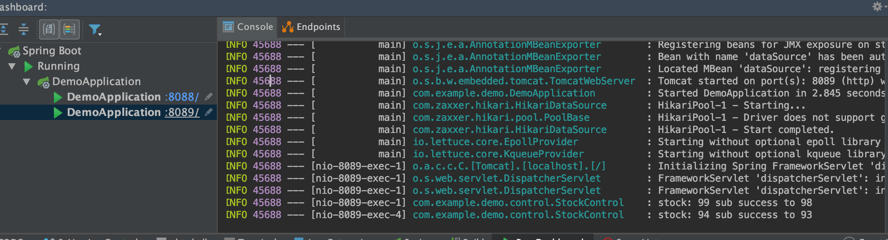
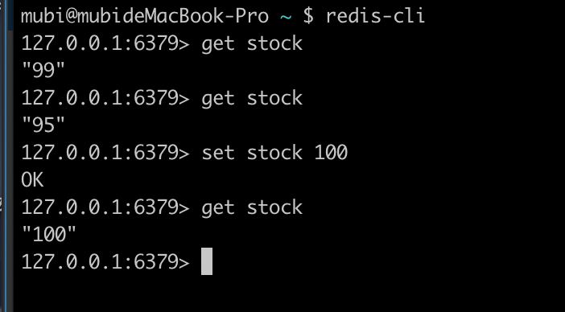
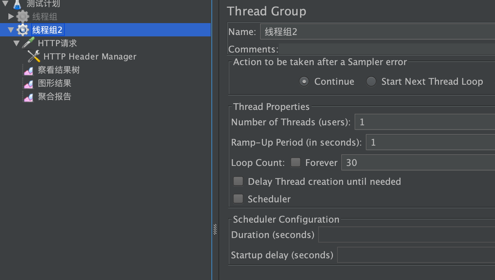
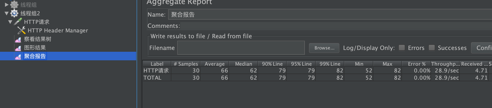
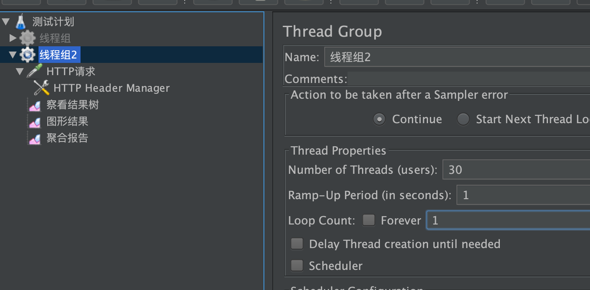
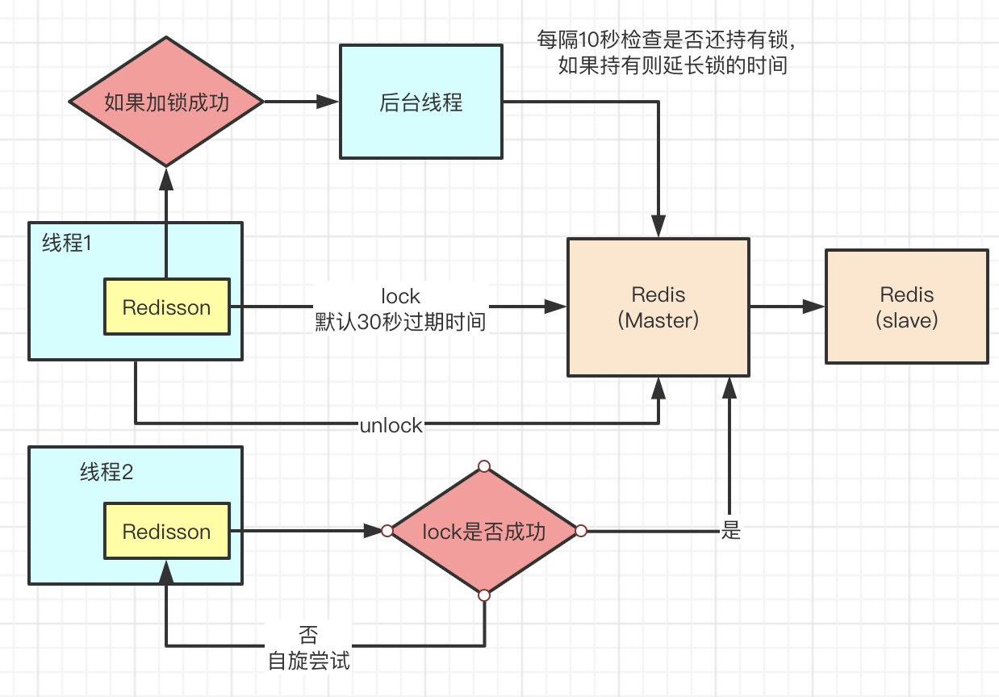
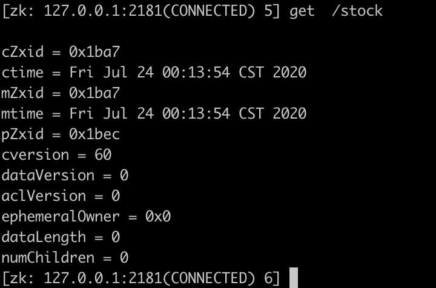

[TOC]

# 分布式锁

## 什么是分布式锁？

锁：共享资源；共享资源互斥的；多任务环境
分布式锁：如果多任务是多个JVM进程，需要一个外部锁，而不是JDK提供的锁

在分布式的部署环境下，通过锁机制来让多客户端互斥的对共享资源进行访问

* 排它性：在同一时间只会有一个客户端能获取到锁，其它客户端无法同时获取

* 避免死锁：这把锁在一段有限的时间之后，一定会被释放（正常释放或异常释放）

* 高可用：获取或释放锁的机制必须高可用且性能佳

## 分布式锁的实现方式

### 基于数据库(mysql)实现

新建一个锁表

```java
CREATE TABLE `methodLock` (
`id` int(11) NOT NULL AUTO_INCREMENT COMMENT '主键',  
`method_name` varchar(64) NOT NULL DEFAULT '' COMMENT '锁定的方法名',
`desc` varchar(1024) NOT NULL DEFAULT '备注信息',  
`update_time` timestamp NOT NULL DEFAULT CURRENT_TIMESTAMP ON UPDATE CURRENT_TIMESTAMP COMMENT '保存数据时间，自动生成',  
PRIMARY KEY (`id`),  
UNIQUE KEY `uidx_method_name` (`method_name `) USING BTREE ) ENGINE=InnoDB DEFAULT CHARSET=utf8 COMMENT='锁定中的方法';
```

1. insert, delete(method_name有唯一约束)

缺点：
    * 数据库单点会导致业务不可用
    * 锁没有失效时间：一旦解锁操作失败，就会导致锁记录一直在数据库中，其它线程无法再获得到锁。
    * 非重入锁：同一个线程在没有释放锁之前无法再次获得该锁。因为数据中数据已经存在记录了
    * 非公平锁

2. 通过数据库的`排他锁`来实现

在查询语句后面增加`for update`(表锁，行锁)，数据库会在查询过程中给数据库表增加`排它锁`。当某条记录被加上排他锁之后，其它线程无法再在该行记录上增加`排它锁`。可以认为获得排它锁的线程即可获得分布式锁，当获取到锁之后，可以执行方法的业务逻辑，执行完方法之后，再通过connection.commit()操作来释放锁

```java
public boolean lock(){
    connection.setAutoCommit(false)
    while (true) {
        try {
            result = select * from methodLock where method_name=xxx for update;
            if (result == null) {
                return true;
            } 
        } catch (Exception e) {
        }
        sleep(1000);
    }
    return false;
}

public void unlock(){
    connection.commit();
}
```

### 基于缓存(redis)

#### 多实例并发访问问题演示

##### 项目代码(使用redis)

见项目pr：<a href="https://github.com/doctording/springboot_gradle_demos/pull/2">https://github.com/doctording/springboot_gradle_demos/pull/2</a>

* Springboot项目启动两个实例(即有两个JVM进程)

```java
curl -X POST \
  http://localhost:8088/deduct_stock_sync \
  -H 'Content-Type: application/json'

curl -X POST \
  http://localhost:8089/deduct_stock_sync \
  -H 'Content-Type: application/json'
```



##### 配置nginx.conf

```java
http {
    include       mime.types;
    default_type  application/octet-stream;

    #log_format  main  '$remote_addr - $remote_user [$time_local] "$request" '
    #                  '$status $body_bytes_sent "$http_referer" '
    #                  '"$http_user_agent" "$http_x_forwarded_for"';

    #access_log  logs/access.log  main;

    sendfile        on;
    #tcp_nopush     on;

    #keepalive_timeout  0;
    keepalive_timeout  65;

    #gzip  on;
    upstream redislock{
		server localhost:8088 weight=1;
		server localhost:8089 weight=1;
	}

    server {
        listen       8080;
        server_name  localhost;

        #charset koi8-r;

        #access_log  logs/host.access.log  main;

        location / {
            root   html;
            index  index.html index.htm;
			proxy_pass  http://redislock;
        }
    }
}
```

* nginx启动和关闭命令

```java
mubi@mubideMacBook-Pro nginx $ sudo nginx
mubi@mubideMacBook-Pro nginx $ ps -ef | grep nginx
    0 47802     1   0  1:18下午 ??         0:00.00 nginx: master process nginx
   -2 47803 47802   0  1:18下午 ??         0:00.00 nginx: worker process
  501 47835 20264   0  1:18下午 ttys001    0:00.00 grep --color=always nginx
mubi@mubideMacBook-Pro nginx $
```

```java
sudo nginx -s stop
```

* 访问测试

```java
curl -X POST \
  http://localhost:8080/deduct_stock_sync \
  -H 'Content-Type: application/json'
```

##### jmeter压测复现问题

* redis 设置 stock 为 100



###### 并发是1，即不产生并发问题



redis get结果会是最终的`70`

###### 并发30测试,产生并发问题(虽然单实例是`synchronized`)






* 并发30访问测试结果：并不是最后的`70`


#### redis 分布式锁：setnx实现


* 30的并发失败率是60%，即只有12个成功的，最后redis的stock值是88符合预期

可以看到大部分没有抢到redis锁，而返回了系统繁忙错误


问题：

1. 超时时间是个问题：业务时常不确定
2. 其它线程可能删除别的线程的锁

* 改进1

```java
@PostMapping(value = "/deduct_stock_lock")
public String deductStockLock() throws Exception {
    // setnx，redis单线程
    String lockKey = "lockKey";
    String clientId = UUID.randomUUID().toString();
    // 如下两句要原子操作
//        Boolean setOk = stringRedisTemplate.opsForValue().setIfAbsent(lockKey, lockVal);
//        stringRedisTemplate.expire(lockKey, 10 , TimeUnit.SECONDS); // 设置过期时间
    Boolean setOk = stringRedisTemplate.opsForValue().setIfAbsent(lockKey, clientId, 10, TimeUnit.SECONDS);
    if (!setOk) {
        throw new Exception("业务繁忙，请稍后再试");
    }

    String retVal;
    try {
        // 只有一个线程能执行成功,可能有业务异常抛出来，可能宕机等等；但无论如何要释放锁
        retVal = stockReduce();
    } finally {
        // 可能失败
        if (clientId.equals(stringRedisTemplate.opsForValue().get(lockKey))) {
            stringRedisTemplate.delete(lockKey);
        }
    }
    return retVal;
}
```

* 超时不够，不断的定时设置，给锁续命

开启线程，每隔一段时间，判断锁还在不在，然后重新设置过期时间

#### Redisson

##### 代码&测试

```java
@Bean
public Redisson redisson(){
    Config config = new Config();
    config.useSingleServer().setAddress("redis://localhost:6379").setDatabase(0);
    return (Redisson)Redisson.create(config);
}
```

```java
@Autowired
private Redisson redisson;

@PostMapping(value = "/deduct_stock_redisson")
public String deductStockRedisson() throws Exception {
    String lockKey = "lockKey";
    RLock rLock = redisson.getLock(lockKey);
    String retVal;
    try {
        rLock.lock();
        // 只有一个线程能执行成功,可能有业务异常抛出来，可能宕机等等；但无论如何要释放锁
        retVal = stockReduce();
    } finally {
        rLock.unlock();
    }
    return retVal;
}
```


##### 底层原理



* setnx的设置key与过期时间用脚本实现原子操作
* key设置成功默认30s，则有后台线程每10秒(1/3的原始过期时间定时检查)检查判断，延长过期时间()
* 未获取到锁的线程会自旋，知道获取到锁的其它线程的释放

###### redis主从架构问题？

补充知识：redis单机qps支持：10w级别

redis主从架构是主同步到从，如果`主`设置key成功，但是同步到`从`还没结束，就挂了；这样`从`成为主，但是是没有key存在的，那么另一个线程又能够加锁成功。（<font color='red'>redis主从架构锁失效问题？</font>）

redis无法保证强一致性？zookeeper解决，但是zk性能不如redis

###### Redlock


* 加锁失败的回滚
* redis加锁多，性能受影响

###### 高并发分布式锁如何实现

* 分段锁思想

### 基于ZooKeeper实现

回顾zookeeper的一些相关知识: <font color='red'>文件系统+监听通知机制</font>

#### zookeeper节点类型

1. PERSISTENT-持久节点

除非手动删除，否则节点一直存在于 Zookeeper 上; 重启Zookeeper后也会恢复

2. EPHEMERAL-临时节点

临时节点的生命周期与客户端会话绑定，一旦客户端会话失效（客户端与zookeeper 连接断开不一定会话失效），那么这个客户端创建的所有临时节点都会被移除。

3. PERSISTENT_SEQUENTIAL-持久顺序节点

基本特性同持久节点，只是增加了顺序属性，节点名后边会追加一个由父节点维护的自增整型数字。

4. EPHEMERAL_SEQUENTIAL-临时顺序节点

基本特性同临时节点，增加了顺序属性，节点名后边会追加一个由父节点维护的自增整型数字。

#### zookeeper的watch机制

* 主动推送：watch被触发时，由zookeeper主动推送给客户端，而不需要客户端轮询
* 一次性：数据变化时，watch只会被触发一次；如果客户端想得到后续更新的通知，必须要在watch被触发后重新注册一个watch
* 可见性：如果一个客户端在读请求中附带 Watch，Watch 被触发的同时再次读取数据，客户端在得到 Watch消息之前肯定不可能看到更新后的数据。换句话说，更新通知先于更新结果
* 顺序性：如果多个更新触发了多个 Watch ，那 Watch 被触发的顺序与更新顺序一致

#### zookeeper lock

##### 普通临时节点（羊群效应）


比如1000个并发，只有1个客户端获取锁成功，其它999个客户端都处在监听并等待中；如果成功释放锁了，那么999个客户端都监听到，再次继续进行创建锁的流程。

所以每次锁有变化，几乎所有客户端节点都要监听并作出反应，这会给集群带来巨大压力，即为<font color='red'>羊群效应</font>

##### 顺序节点（公平，避免羊群效应）


1. 首先需要创建一个父节点，尽量是持久节点（PERSISTENT类型)

2. 每个要获得锁的线程都会在这个节点下创建个临时顺序节点，

3. 由于序号的递增性，可以规定排号最小的那个获得锁。

4. 所以，每个线程在尝试占用锁之前，首先判断自己是排号是不是当前最小，如果是，则获取锁。

利用顺序性：<font color='red'>每个线程都只监听前一个线程，事件通知也只通知后面都一个线程，而不是通知全部</font>

#### Curator InterProcessMutex

<a href="https://curator.apache.org/getting-started.html" target="_blank">curator官方文档</a>

##### code&测试

<a href="https://github.com/doctording/springboot_gradle_demos/pull/3/files" target="_blank">实践代码链接</a>

```java
@Component
public class CuratorConfiguration {

    @Bean(initMethod = "start")
    public CuratorFramework curatorFramework() {
        RetryPolicy retryPolicy = new ExponentialBackoffRetry(1000, 3);
        CuratorFramework client = CuratorFrameworkFactory.newClient(
                "127.0.0.1:2181", retryPolicy);
        return client;
    }

}
```

```java
 @Autowired
private CuratorFramework curatorFramework;

@PostMapping(value = "/deduct_stock_zk")
public String deductStockZk() throws Exception {
    String path = "/stock";
    InterProcessMutex interProcessMutex = new InterProcessMutex(curatorFramework, path);
    String retVal;
    try {
        interProcessMutex.acquire();
        retVal = stockReduce();
    } catch (Exception e) {
        throw new Exception("lock error");
    } finally {
        interProcessMutex.release();
    }
    return retVal;
}
```



* 压测结果


##### InterProcessMutex 内部原理

* 初始化

```java
/**
* @param client client
* @param path   the path to lock
* @param driver lock driver
*/
public InterProcessMutex(CuratorFramework client, String path, LockInternalsDriver driver)
{
    this(client, path, LOCK_NAME, 1, driver);
}
```

```java
 /**
    * Returns a facade of the current instance that tracks
    * watchers created and allows a one-shot removal of all watchers
    * via {@link WatcherRemoveCuratorFramework#removeWatchers()}
    *
    * @return facade
    */
public WatcherRemoveCuratorFramework newWatcherRemoveCuratorFramework();
```

* 加锁

```java
private boolean internalLock(long time, TimeUnit unit) throws Exception
{
    /*
        Note on concurrency: a given lockData instance
        can be only acted on by a single thread so locking isn't necessary
    */

    Thread currentThread = Thread.currentThread();

    // 获取当前线程锁数据，获取到的化，设置可重入
    LockData lockData = threadData.get(currentThread);
    if ( lockData != null )
    {
        // re-entering
        lockData.lockCount.incrementAndGet();
        return true;
    }
    // 尝试获取锁
    String lockPath = internals.attemptLock(time, unit, getLockNodeBytes());
    if ( lockPath != null )
    {
        // 获取到锁，锁数据加入`threadData`的map结构中
        LockData newLockData = new LockData(currentThread, lockPath);
        threadData.put(currentThread, newLockData);
        return true;
    }

    // 没有获取到锁
    return false;
}
```

```java
String attemptLock(long time, TimeUnit unit, byte[] lockNodeBytes) throws Exception
{
    final long      startMillis = System.currentTimeMillis();
    final Long      millisToWait = (unit != null) ? unit.toMillis(time) : null;
    final byte[]    localLockNodeBytes = (revocable.get() != null) ? new byte[0] : lockNodeBytes;
    int             retryCount = 0;

    String          ourPath = null;
    boolean         hasTheLock = false;
    boolean         isDone = false;
    while ( !isDone )
    {
        isDone = true;

        try
        {
            ourPath = driver.createsTheLock(client, path, localLockNodeBytes);
            hasTheLock = internalLockLoop(startMillis, millisToWait, ourPath);
        }
        catch ( KeeperException.NoNodeException e )
        {
            // gets thrown by StandardLockInternalsDriver when it can't find the lock node
            // this can happen when the session expires, etc. So, if the retry allows, just try it all again
            if ( client.getZookeeperClient().getRetryPolicy().allowRetry(retryCount++, System.currentTimeMillis() - startMillis, RetryLoop.getDefaultRetrySleeper()) )
            {
                isDone = false;
            }
            else
            {
                throw e;
            }
        }
    }

    if ( hasTheLock )
    {
        return ourPath;
    }

    return null;
}
```

创建锁是创建的`临时顺序`节点

```java
@Override
public String createsTheLock(CuratorFramework client, String path, byte[] lockNodeBytes) throws Exception
{
    String ourPath;
    if ( lockNodeBytes != null )
    {
        ourPath = client.create().creatingParentContainersIfNeeded().withProtection().withMode(CreateMode.EPHEMERAL_SEQUENTIAL).forPath(path, lockNodeBytes);
    }
    else
    {
        ourPath = client.create().creatingParentContainersIfNeeded().withProtection().withMode(CreateMode.EPHEMERAL_SEQUENTIAL).forPath(path);
    }
    return ourPath;
}
```

* watch

```java
private boolean internalLockLoop(long startMillis, Long millisToWait, String ourPath) throws Exception
{
    boolean     haveTheLock = false;
    boolean     doDelete = false;
    try
    {
        if ( revocable.get() != null )
        {
            client.getData().usingWatcher(revocableWatcher).forPath(ourPath);
        }

        while ( (client.getState() == CuratorFrameworkState.STARTED) && !haveTheLock )
        {
            // 获取lock下所有节点数据，并排序
            List<String>        children = getSortedChildren();
            String              sequenceNodeName = ourPath.substring(basePath.length() + 1); // +1 to include the slash
            // 判断获取到锁
            PredicateResults    predicateResults = driver.getsTheLock(client, children, sequenceNodeName, maxLeases);
            if ( predicateResults.getsTheLock() )
            {
                haveTheLock = true;
            }
            else
            {
                String  previousSequencePath = basePath + "/" + predicateResults.getPathToWatch();
                synchronized(this)
                {
                    try
                    {
                        // use getData() instead of exists() to avoid leaving unneeded watchers which is a type of resource leak
                        // 监听前一个节点，并等待
                        client.getData().usingWatcher(watcher).forPath(previousSequencePath);
                        if ( millisToWait != null )
                        {
                            millisToWait -= (System.currentTimeMillis() - startMillis);
                            startMillis = System.currentTimeMillis();
                            if ( millisToWait <= 0 )
                            {
                                doDelete = true;    // timed out - delete our node
                                break;
                            }

                            wait(millisToWait);
                        }
                        else
                        {
                            wait();
                        }
                    }
                    catch ( KeeperException.NoNodeException e )
                    {
                        // it has been deleted (i.e. lock released). Try to acquire again
                    }
                }
            }
        }
    }
    catch ( Exception e )
    {
        ThreadUtils.checkInterrupted(e);
        doDelete = true;
        throw e;
    }
    finally
    {
        if ( doDelete )
        {
            deleteOurPath(ourPath);
        }
    }
    return haveTheLock;
}
```

是不是加锁成功:是不是最小的那个节点

```java
@Override
public PredicateResults getsTheLock(CuratorFramework client, List<String> children, String sequenceNodeName, int maxLeases) throws Exception
{
    int             ourIndex = children.indexOf(sequenceNodeName);
    validateOurIndex(sequenceNodeName, ourIndex);

    boolean         getsTheLock = ourIndex < maxLeases;
    String          pathToWatch = getsTheLock ? null : children.get(ourIndex - maxLeases);

    return new PredicateResults(pathToWatch, getsTheLock);
}
```

* 释放锁

可重入判断；删除watchers，删除节点

```java
/**
    * Perform one release of the mutex if the calling thread is the same thread that acquired it. If the
    * thread had made multiple calls to acquire, the mutex will still be held when this method returns.
    *
    * @throws Exception ZK errors, interruptions, current thread does not own the lock
    */
@Override
public void release() throws Exception
{
    /*
        Note on concurrency: a given lockData instance
        can be only acted on by a single thread so locking isn't necessary
        */

    Thread currentThread = Thread.currentThread();
    LockData lockData = threadData.get(currentThread);
    if ( lockData == null )
    {
        throw new IllegalMonitorStateException("You do not own the lock: " + basePath);
    }

    int newLockCount = lockData.lockCount.decrementAndGet();
    if ( newLockCount > 0 )
    {
        return;
    }
    if ( newLockCount < 0 )
    {
        throw new IllegalMonitorStateException("Lock count has gone negative for lock: " + basePath);
    }
    try
    {
        internals.releaseLock(lockData.lockPath);
    }
    finally
    {
        threadData.remove(currentThread);
    }
}
```

```java
final void releaseLock(String lockPath) throws Exception
{
    client.removeWatchers();
    revocable.set(null);
    deleteOurPath(lockPath);
}
```
