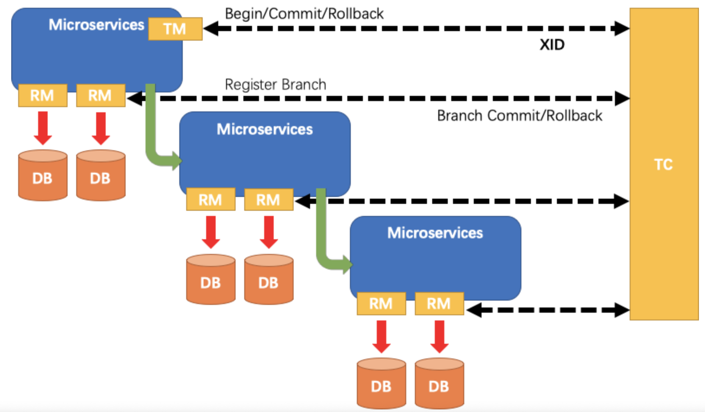

[TOC]

# 分布式事务

## 分布式事务问题？

如图：订单系统中的本地事务A，`远程`调用了库存系统中的本地事务B；如果事务A遇到了问题，事务A会回滚，但是事务B如果正常执行，不会回滚，这就产生了问题：

订单创建是失败的，订单确实没有生产，但是库存却减少了；这显然要出问题

显然我们想要实现的是：要么一起执行完，要么一起回滚掉，这样就不会产生问题。所以如何解决这个问题？

## 分布式事务的理论标准

### BASE理论

`ACID`只适合于本地事务，对于`分布式系统`来说，应该有全新的标准 ==> BASE

<a href="https://shardingsphere.apache.org/document/current/en/features/transaction/#base-transaction" target="_blank">BASE Transaction</a>

If we call transactions that satisfy ACID features as hard transactions, then transactions based on BASE features are called soft transactions. BASE is the abbreviation(n.略语;缩写词;缩写形式;) of basically available（基本可用）, soft state（持久化写入没必要一定要写入一致） and eventually consistent（最终一致） those there factors.

1. Basically available feature means not all the participants（n. 参与者; 参加者;）of distributed transactions have to be online at the same time.
2. Soft state feature permits some time delay in system renewal（n. 恢复; 更新; 重新开始; (对合同等的) 有效期延长，展期，续订; 改进; 复兴; 振兴;）, which may not be noticed by users.
3. Eventually consistent feature of systems is usually guaranteed by message availability.

* 补偿

compensation：n. 补偿(或赔偿)物; (尤指) 赔偿金，补偿金; 赔偿; 使坏的情况变好的事物; (对不利局面的) 补偿;

补偿就是指的一个事务中的某个一个操作片段，就是补偿，具体说来可以是一个远程的操作，也可以是一个本地的操作，可以是一个更新操作，也可以是一个取消操作。

eg: 比如我把500元从某个银行卡账户转入到微信钱包。那么对微信这边的转入接口进行的操作便是一个补偿操作。看到这里，你可能在想，原来是调用一个远程接口啊。没错，直接去调用现有的远程接口就是一种补偿操作。

### CAP理论

CAP理论指的是一个分布式系统最多只能同时满足一致性（Consistency）、可用性（Availability）和分区容错性（Partition tolerance）这三项中的两项。

## Two-phase Commit，2PC

两阶段提交协议（two phase commit protocol，2PC）可以保证数据的强一致性，许多分布式关系型数据管理系统采用此协议来完成分布式事务。它是协调所有分布式原子事务参与者，并决定提交或取消（回滚）的分布式算法。同时也是解决一致性问题的一致性算法。该算法能够解决很多的临时性系统故障（包括进程、网络节点、通信等故障），被广泛地使用。

### 系统组件

1. 协调者coordinator，通常一个系统中只有一个
2. 事务参与者 participants，cohorts或workers，一般包含多个

### 两阶段执行过程

1. 阶段1：请求阶段（commit-request phase，或称表决阶段，voting phase）
    * 在请求阶段，协调者将通知事务参与者准备提交或取消事务，然后进入表决过程。在表决过程中，参与者将告知协调者自己的决策：同意（事务参与者本地作业执行成功）或取消（本地作业执行故障）。
2. 阶段2：提交阶段（commit phase）
    * 在该阶段，协调者将基于第一个阶段的投票结果进行决策：提交或取消。当且仅当所有的参与者同意提交事务协调者才通知所有的参与者提交事务，否则协调者将通知所有的参与者取消事务。参与者在接收到协调者发来的消息后将执行响应的操作。

例子说明：A将成为该活动的协调者，B、C和D将成为该活动的参与者。

1. 阶段1
    * A发邮件给B、C和D，提出下周三去爬山，问是否同意。那么此时A需要等待B、C和D的邮件。
    * B、C和D分别查看自己的日程安排表。B、C发现自己在当日没有活动安排，则发邮件告诉A它们同意下周三去爬长城。由于某种原因， D白天没有查看邮件。那么此时A、B和C均需要等待。到晚上的时候，D发现了A的邮件，然后查看日程安排，发现周三当天已经有别的安排，那么D回复A说活动取消吧。
2. 阶段2
    * 此时A收到了所有活动参与者的邮件，并且A发现D下周三不能去爬山。那么A将发邮件通知B、C和D，下周三爬长城活动取消。
    * 此时B、C回复A“太可惜了”，D回复A“不好意思”。至此该事务终止。

### 缺点

1. 同步阻塞：最大的问题即同步阻塞，即：所有参与事务的逻辑均处于阻塞状态。
2. 单点：协调者存在单点问题，如果协调者出现故障，参与者将一直处于锁定状态。
3. 脑裂：在阶段2中，如果只有部分参与者接收并执行了Commit请求，会导致节点数据不一致。

## Three-Phase Commit，3PC

3PC，三阶段提交协议，是2PC的改进版本；协调者、参与者都引入了超时机制；三阶段 CanCommit、PreCommit（其中一个超时或者执行失败，则发起中断）和doCommit

### 三阶段执行过程

1. CanCommit阶段

3PC的CanCommit阶段其实和2PC的准备阶段很像。
协调者向参与者发送commit请求，参与者如果可以提交就返回Yes响应，否则返回No响应。

2. PreCommit阶段

Coordinator根据Cohort的反应情况来决定是否可以继续事务的PreCommit操作。

根据响应情况，有以下两种可能。

A.假如Coordinator从所有的Cohort获得的反馈都是Yes响应，那么就会进行事务的预执行：

发送预提交请求。Coordinator向Cohort发送PreCommit请求，并进入Prepared阶段。
事务预提交。Cohort接收到PreCommit请求后，会执行事务操作，并将undo和redo信息记录到事务日志中。
响应反馈。如果Cohort成功的执行了事务操作，则返回ACK响应，同时开始等待最终指令。

B.假如有任何一个Cohort向Coordinator发送了No响应，或者等待超时之后，Coordinator都没有接到Cohort的响应，那么就中断事务：

发送中断请求。Coordinator向所有Cohort发送abort请求。
中断事务。Cohort收到来自Coordinator的abort请求之后（或超时之后，仍未收到Cohort的请求），执行事务的中断。

3. DoCommit阶段

该阶段进行真正的事务提交，也可以分为以下两种情况:

执行提交

A.发送提交请求。Coordinator接收到Cohort发送的ACK响应，那么他将从预提交状态进入到提交状态。并向所有Cohort发送doCommit请求。
B.事务提交。Cohort接收到doCommit请求之后，执行正式的事务提交。并在完成事务提交之后释放所有事务资源。
C.响应反馈。事务提交完之后，向Coordinator发送ACK响应。
D.完成事务。Coordinator接收到所有Cohort的ACK响应之后，完成事务。

中断事务

Coordinator没有接收到Cohort发送的ACK响应（可能是接受者发送的不是ACK响应，也可能响应超时），那么就会执行中断事务。

## TTC(`Try-Confirm-Cancel`)

* DML <---> try : 预留业务资源
* Commit <---> confirm : 确认执行业务操作
* Rollback <---> cancel : 取消执行业务操作

例子说明: A,B,C三个账户事务(A：-30，B：-50，C：+80)

1. Try：尝试执行业务
    * 完成所有业务检查(一致性)：检查A、B、C的帐户状态是否正常，帐户A的余额是否不少于30元，帐户B的余额是否不少于50元。
    * 预留必须业务资源(准隔离性)：帐户A的冻结金额增加30元，帐户B的冻结金额增加50元，这样就保证不会出现其他并发进程扣减了这两个帐户的余额而导致在后续的真正转帐操作过程中，帐户A和B的可用余额不够的情况。
2. Confirm：确认执行业务
    * 真正执行业务：如果Try阶段帐户A、B、C状态正常，且帐户A、B余额够用，则执行帐户A给账户C转账30元、帐户B给账户C转账50元的转帐操作。
    * 不做任何业务检查：这时已经不需要做业务检查，Try阶段已经完成了业务检查。
    * 只使用Try阶段预留的业务资源：只需要使用Try阶段帐户A和帐户B冻结的金额即可。
3. Cancel：取消执行业务
    * 释放Try阶段预留的业务资源：如果Try阶段部分成功，比如帐户A的余额够用，且冻结相应金额成功，帐户B的余额不够而冻结失败，则需要对帐户A做Cancel操作，将帐户A被冻结的金额解冻掉。

## seata

<a href="https://github.com/seata/seata" target="_blank">github seata</a>

### how to define a Distributed Transaction?

We say, a Distributed Transaction is a **Global Transaction** which is made up with a batch of **Branch Transaction**, and normally Branch Transaction is just **Local Transaction**.

### 模拟分布式事务的解决

### There are 3 basic components in Seata

1. **Transaction Coordinator(TC)**: Maintain status of global and branch transactions, drive the global commit or rollback.
2. **Transaction Manager(TM)**: Define the scope of global transaction: begin a global transaction, commit or rollback a global transaction.
3. **Resource Manager(RM)**: Manage resources that branch transactions working on, talk to TC for registering branch transactions and reporting status of branch transactions, and drive the branch transaction commit or rollback.

A typical lifecycle of Seata managed distributed transaction:

1. TM asks TC to begin a new global transaction. TC generates an XID representing the global transaction.
2. XID is propagated through microservices' invoke chain.
3. RM register local transaction as a branch of the corresponding global transaction of XID to TC.
4. TM asks TC for committing or rollbacking the corresponding global transaction of XID.
5. TC drives all branch transactions under the corresponding global transaction of XID to finish branch committing or rollbacking.

