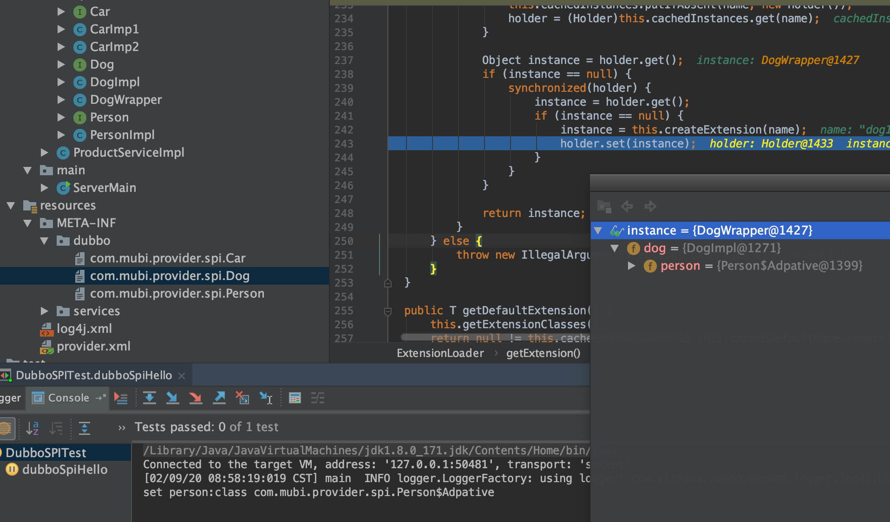
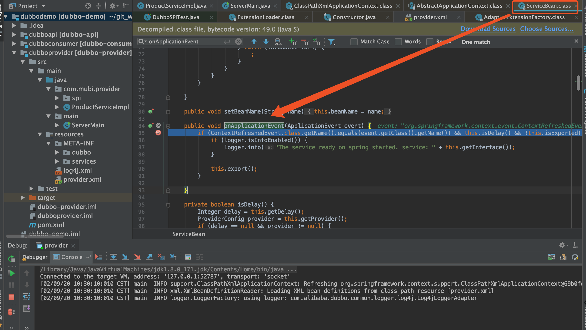
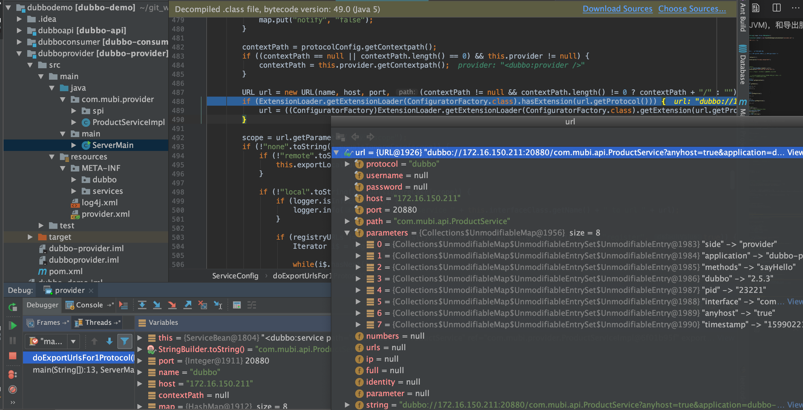
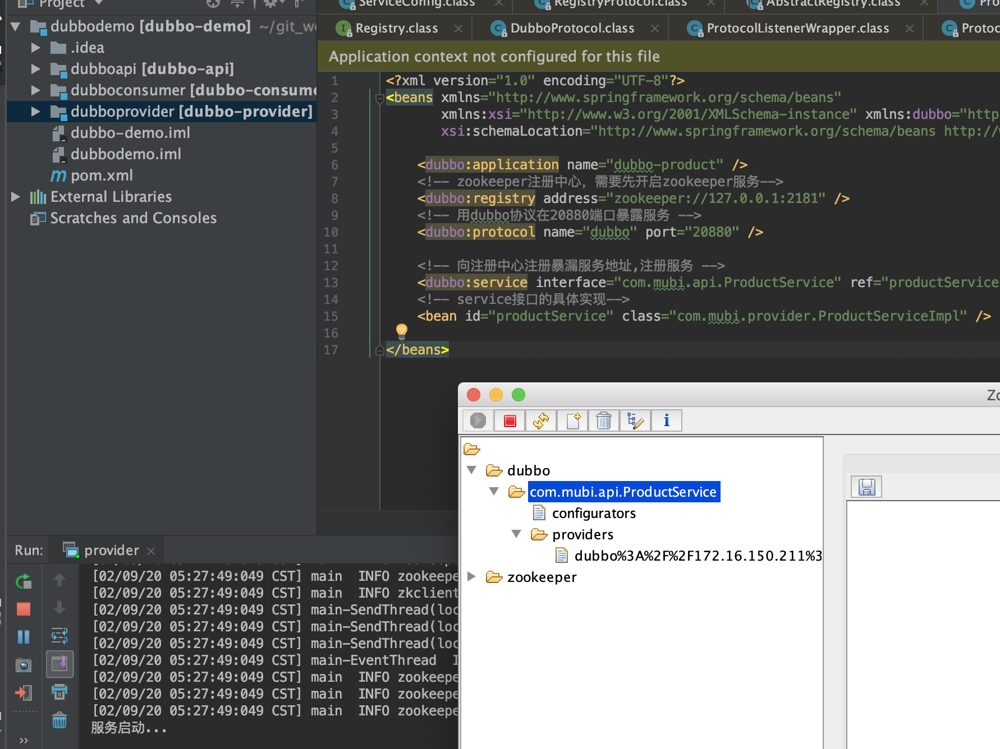
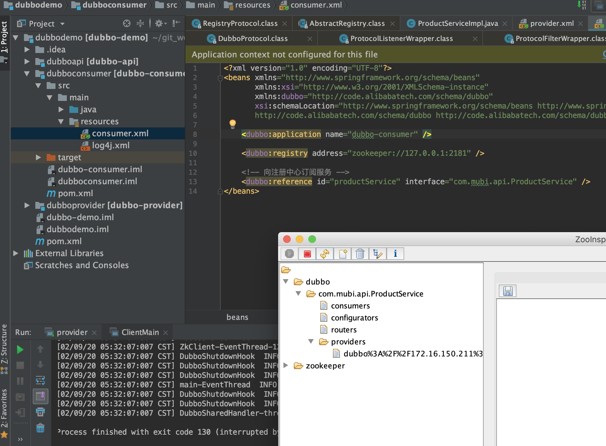

[TOC]

# dubbo

## SPI

<a href="https://dubbo.apache.org/zh-cn/docs/source_code_guide/dubbo-spi.html">dubbo spi文档</a>

SPI 全称为 Service Provider Interface，是一种服务发现机制。SPI 的本质是将接口实现类的全限定名配置在文件中，并由服务加载器读取配置文件，加载实现类。这样可以在运行时，动态为接口替换实现类。正因此特性，我们可以很容易的通过 SPI 机制为我们的程序提供拓展功能。SPI 机制在第三方框架中也有所应用，比如 Dubbo 就是通过 SPI 机制加载所有的组件。不过，Dubbo 并未使用 Java 原生的 SPI 机制，而是对其进行了增强，使其能够更好的满足需求。在 Dubbo 中，SPI 是一个非常重要的模块。基于 SPI，我们可以很容易的对 Dubbo 进行拓展。

Dubbo 并未使用 Java SPI，而是重新实现了一套功能更强的 SPI 机制。Dubbo SPI 的相关逻辑被封装在了`ExtensionLoader`类中，通过 ExtensionLoader，我们可以加载指定的实现类,使用如下

```java
public class DubboSPITest {

    @Test
    public void sayHello() throws Exception {
        ExtensionLoader<Robot> extensionLoader =
            ExtensionLoader.getExtensionLoader(Robot.class);
        Robot optimusPrime = extensionLoader.getExtension("optimusPrime");
        optimusPrime.sayHello();
        Robot bumblebee = extensionLoader.getExtension("bumblebee");
        bumblebee.sayHello();
    }
}
```

* META-INF/dubbo

```java
optimusPrime = org.apache.spi.OptimusPrime
bumblebee = org.apache.spi.Bumblebee
```

* 首先通过 ExtensionLoader 的 getExtensionLoader 方法获取一个 ExtensionLoader 实例（接口的ExtensionLoader对象）
* 然后再通过 ExtensionLoader 的 getExtension 方法获取拓展类对象（接口的某个具体实现类实例，主要通过<font color='red'>反射</font>实现）

```java
private T createExtension(String name) {
    // 从配置文件中加载所有的拓展类，可得到“配置项名称”到“配置类”的映射关系表
    Class<?> clazz = getExtensionClasses().get(name);
    if (clazz == null) {
        throw findException(name);
    }
    try {
        T instance = (T) EXTENSION_INSTANCES.get(clazz);
        if (instance == null) {
            // 通过反射创建实例
            EXTENSION_INSTANCES.putIfAbsent(clazz, clazz.newInstance());
            instance = (T) EXTENSION_INSTANCES.get(clazz);
        }
        // 向实例中注入依赖
        injectExtension(instance);
        Set<Class<?>> wrapperClasses = cachedWrapperClasses;
        if (wrapperClasses != null && !wrapperClasses.isEmpty()) {
            // 循环创建 Wrapper 实例
            for (Class<?> wrapperClass : wrapperClasses) {
                // 将当前 instance 作为参数传给 Wrapper 的构造方法，并通过反射创建 Wrapper 实例。
                // 然后向 Wrapper 实例中注入依赖，最后将 Wrapper 实例再次赋值给 instance 变量
                instance = injectExtension(
                    (T) wrapperClass.getConstructor(type).newInstance(instance));
            }
        }
        return instance;
    } catch (Throwable t) {
        throw new IllegalStateException("...");
    }
}
```

## dubbo增强的SPI

Dubbo 的扩展点加载是基于JDK 标准的 SPI 扩展点发现机制增强而来的，Dubbo 改进了 JDK 标准的 SPI 的以下问题：

* JDK 标准的 SPI 会一次性实例化扩展点所有实现，如果有扩展实现初始化很耗时，但如果没用上也加载，会很浪费资源。

* 如果扩展点加载失败，就失败了，给用户没有任何通知。比如：JDK 标准的ScriptEngine，如果Ruby ScriptEngine 因为所依赖的 jruby.jar 不存在，导致 Ruby ScriptEngine 类加载失败，这个失败原因被吃掉了，当用户执行 ruby 脚本时，会报空指针异常，而不是报Ruby ScriptEngine不存在。

* 增加了对扩展点 IoC 和 AOP 的支持，一个扩展点可以直接 setter 注入其它扩展点

### 源码流程

```java
public static <T> ExtensionLoader<T> getExtensionLoader(Class<T> type) {
    /*
    type 类型不能为null, 必须是接口，必须有@SPI注解
    先从ConcurrentMap<Class<?>, ExtensionLoader<?>> EXTENSION_LOADERS 取
        否则new ExtensionLoader,放到 EXTENSION_LOADERS 中，然后再获取到
    */
    if (type == null) {
        throw new IllegalArgumentException("Extension type == null");
    } else if (!type.isInterface()) {
        throw new IllegalArgumentException("Extension type(" + type + ") is not interface!");
    } else if (!withExtensionAnnotation(type)) {
        throw new IllegalArgumentException("Extension type(" + type + ") is not extension, because WITHOUT @" + SPI.class.getSimpleName() + " Annotation!");
    } else {
        ExtensionLoader<T> loader = (ExtensionLoader)EXTENSION_LOADERS.get(type);
        if (loader == null) {
            EXTENSION_LOADERS.putIfAbsent(type, new ExtensionLoader(type));
            loader = (ExtensionLoader)EXTENSION_LOADERS.get(type);
        }

        return loader;
    }
}
```

* ExtensionLoader一个构造方法

```java
private ExtensionLoader(Class<?> type) {
    this.type = type;
    this.objectFactory = type == ExtensionFactory.class ? null : (ExtensionFactory)getExtensionLoader(ExtensionFactory.class).getAdaptiveExtension();
}
```

* 先构造ExtensionFactory(扩展点工厂)，放到map结构中
* ExtensionFactory objectFactory: 依赖注入，对象工厂（eg:AdaptiveExtensionFactory）

`objectFactory`变量的类型为`AdaptiveExtensionFactory`，`AdaptiveExtensionFactory`内部维护了一个`ExtensionFactory`列表，用于存储其他类型的 ExtensionFactory。Dubbo 目前提供了两种 ExtensionFactory，分别是`SpiExtensionFactory`和`SpringExtensionFactory`。前者用于创建自适应的拓展，后者是用于从 Spring 的 IOC 容器中获取所需的拓展。

接着：`Dog dog1 = extensionLoader.getExtension("dog1");`

```java
name -> 配置文件 -> 实现类 -> 实例对象 -> 依赖注入(IOC) -> AOP -> 最后返回的完整对象
```

`ConcurrentMap<String, Holder<Object>> cachedInstances`  volatile + double check 执行`createExtension(name);`

实例对象通过`clazz.newInstance()`即**反射**实例化instance出来，然后会执行`injectExtension(instance)`

```java
private T injectExtension(T instance) {
    try {
        if (this.objectFactory != null) {
            Method[] arr$ = instance.getClass().getMethods();
            int len$ = arr$.length;

            for(int i$ = 0; i$ < len$; ++i$) {
                Method method = arr$[i$];
                if (method.getName().startsWith("set") && method.getParameterTypes().length == 1 && Modifier.isPublic(method.getModifiers())) {
                    Class pt = method.getParameterTypes()[0];

                    try {
                        String property = method.getName().length() > 3 ? method.getName().substring(3, 4).toLowerCase() + method.getName().substring(4) : "";
                        // 继续getExtension,然后set到instance中，完成依赖注入
                        Object object = this.objectFactory.getExtension(pt, property);
                        if (object != null) {
                            method.invoke(instance, object);
                        }
                    } catch (Exception var9) {
                        logger.error("fail to inject via method " + method.getName() + " of interface " + this.type.getName() + ": " + var9.getMessage(), var9);
                    }
                }
            }
        }
    } catch (Exception var10) {
        logger.error(var10.getMessage(), var10);
    }

    return instance;
}
```


依赖注入完成，接着是aop的实现，最终返回一个包装类的实例

```java
private T createExtension(String name) {
    Class<?> clazz = (Class)this.getExtensionClasses().get(name);
    if (clazz == null) {
        throw this.findException(name);
    } else {
        try {
            T instance = EXTENSION_INSTANCES.get(clazz);
            if (instance == null) {
                EXTENSION_INSTANCES.putIfAbsent(clazz, clazz.newInstance());
                instance = EXTENSION_INSTANCES.get(clazz);
            }

            this.injectExtension(instance);
            Set<Class<?>> wrapperClasses = this.cachedWrapperClasses;
            Class wrapperClass;
            if (wrapperClasses != null && wrapperClasses.size() > 0) {
                /*
                    循环创建 Wrapper 实例
                    将当前 instance 作为参数传给 Wrapper 的构造方法，并通过反射创建 Wrapper 实例。
                    然后向 Wrapper 实例中注入依赖，最后将 Wrapper 实例再次赋值给 instance 变量
                */
                for(Iterator i$ = wrapperClasses.iterator(); i$.hasNext(); instance = this.injectExtension(wrapperClass.getConstructor(this.type).newInstance(instance))) {
                    wrapperClass = (Class)i$.next();
                }
            }

            return instance;
        } catch (Throwable var7) {
            throw new IllegalStateException("Extension instance(name: " + name + ", class: " + this.type + ")  could not be instantiated: " + var7.getMessage(), var7);
        }
    }
}
```



## 服务导出

<a herf='https://dubbo.apache.org/zh-cn/docs/source_code_guide/export-service.html' target='_blank'>导出服务官方文档</a>

### 服务导出的触发时机

Dubbo是一个可以完全兼容Spring的服务治理框架，兼容性体现在何处？
* 一是Dubbo的配置可以做到对Spring配置无侵入；
* 二是Dubbo默认是随着Spring容器的启动而启动的，不需要人为的控制。

帮助Dubbo实现第二项的类有两个：`ReferenceBean`和`ServiceBean`，这两个类在Dubbo中担任了连接Spring的桥梁的作用。与本文相关的类是ServiceBean，此类实现了`ApplicationListener`接口，这样Spring框架在执行refresh方法完成容器初始化的时候，就会发布容器刷新事件，调用ServiceBean的重写方法`onApplicationEvent`，触发服务导出。



ApplicationEvent具体是：`org.springframework.context.event.ContextRefreshedEvent`，event对象中包括了`ClassPathXmlApplicationContext`

<font color='red'>判断是否有延迟导出 && 是否已导出 && 是不是已被取消导出，然后调用`export()`方法进行导出</font>

* 附：producer main方法

```java
public class ServerMain {

    public static void main(String[] args) throws IOException {

        ClassPathXmlApplicationContext context = new ClassPathXmlApplicationContext("provider.xml" );
        context.start();
        System.out.println("服务启动...");
        System.in.read();
        //context.close();
    }
}
```

### 导出流程

#### 第一部分是前置工作，主要用于检查参数，组装 URL

#### 第二部分是导出服务，包含导出服务到本地 (JVM)，和导出服务到远程两个过程

```java
protected synchronized void doExport() {
    if (unexported) {
        throw new IllegalStateException("Already unexported!");
    }
    if (exported) {
        return;
    }
    exported = true;
    // 检测 interfaceName 是否合法
    if (interfaceName == null || interfaceName.length() == 0) {
        throw new IllegalStateException("interface not allow null!");
    }
    // 检测 provider 是否为空，为空则新建一个，并通过系统变量为其初始化
    checkDefault();

    // 下面几个 if 语句用于检测 provider、application 等核心配置类对象是否为空，
    // 若为空，则尝试从其他配置类对象中获取相应的实例。
    if (provider != null) {
        if (application == null) {
            application = provider.getApplication();
        }
        if (module == null) {
            module = provider.getModule();
        }
        if (registries == null) {...}
        if (monitor == null) {...}
        if (protocols == null) {...}
    }
    if (module != null) {
        if (registries == null) {
            registries = module.getRegistries();
        }
        if (monitor == null) {...}
    }
    if (application != null) {
        if (registries == null) {
            registries = application.getRegistries();
        }
        if (monitor == null) {...}
    }

    // 检测 ref 是否为泛化服务类型
    if (ref instanceof GenericService) {
        // 设置 interfaceClass 为 GenericService.class
        interfaceClass = GenericService.class;
        if (StringUtils.isEmpty(generic)) {
            // 设置 generic = "true"
            generic = Boolean.TRUE.toString();
        }

    // ref 非 GenericService 类型
    } else {
        try {
            interfaceClass = Class.forName(interfaceName, true, Thread.currentThread()
                    .getContextClassLoader());
        } catch (ClassNotFoundException e) {
            throw new IllegalStateException(e.getMessage(), e);
        }
        // 对 interfaceClass，以及 <dubbo:method> 标签中的必要字段进行检查
        checkInterfaceAndMethods(interfaceClass, methods);
        // 对 ref 合法性进行检测
        checkRef();
        // 设置 generic = "false"
        generic = Boolean.FALSE.toString();
    }

    // local 和 stub 在功能应该是一致的，用于配置本地存根
    if (local != null) {
        if ("true".equals(local)) {
            local = interfaceName + "Local";
        }
        Class<?> localClass;
        try {
            // 获取本地存根类
            localClass = ClassHelper.forNameWithThreadContextClassLoader(local);
        } catch (ClassNotFoundException e) {
            throw new IllegalStateException(e.getMessage(), e);
        }
        // 检测本地存根类是否可赋值给接口类，若不可赋值则会抛出异常，提醒使用者本地存根类类型不合法
        if (!interfaceClass.isAssignableFrom(localClass)) {
            throw new IllegalStateException("The local implementation class " + localClass.getName() + " not implement interface " + interfaceName);
        }
    }

    if (stub != null) {
        // 此处的代码和上一个 if 分支的代码基本一致，这里省略
    }

    // 检测各种对象是否为空，为空则新建，或者抛出异常
    checkApplication();
    checkRegistry();
    checkProtocol();
    appendProperties(this);
    checkStubAndMock(interfaceClass);
    if (path == null || path.length() == 0) {
        path = interfaceName;
    }

    // 导出服务
    doExportUrls();

    // ProviderModel 表示服务提供者模型，此对象中存储了与服务提供者相关的信息。
    // 比如服务的配置信息，服务实例等。每个被导出的服务对应一个 ProviderModel。
    // ApplicationModel 持有所有的 ProviderModel。
    ProviderModel providerModel = new ProviderModel(getUniqueServiceName(), this, ref);
    ApplicationModel.initProviderModel(getUniqueServiceName(), providerModel);
}
```

* 检测 <dubbo:service> 标签的 interface 属性合法性，不合法则抛出异常
* 检测 ProviderConfig、ApplicationConfig 等核心配置类对象是否为空，若为空，则尝试从其他配置类对象中获取相应的实例。
* 检测并处理泛化服务和普通服务类
* 检测本地存根配置，并进行相应的处理
* 对 ApplicationConfig、RegistryConfig 等配置类进行检测，为空则尝试创建，若无法创建则抛出异常

##### doExportUrls(多协议多注册中心导出服务)

```java
private void doExportUrls() {
    // 加载注册中心链接
    List<URL> registryURLs = loadRegistries(true);
    // 遍历 protocols，并在每个协议下导出服务
    for (ProtocolConfig protocolConfig : protocols) {
        doExportUrlsFor1Protocol(protocolConfig, registryURLs);
    }
}
```

loadRegistries 方法主要包含如下的逻辑：
    * 检测是否存在注册中心配置类，不存在则抛出异常
    * 构建参数映射集合，也就是 map
    * 构建注册中心链接列表
    * 遍历链接列表，并根据条件决定是否将其添加到 registryList 中

```java
protected List<URL> loadRegistries(boolean provider) {
    // 检测是否存在注册中心配置类，不存在则抛出异常
    checkRegistry();
    List<URL> registryList = new ArrayList<URL>();
    if (registries != null && !registries.isEmpty()) {
        for (RegistryConfig config : registries) {
            String address = config.getAddress();
            if (address == null || address.length() == 0) {
                // 若 address 为空，则将其设为 0.0.0.0
                address = Constants.ANYHOST_VALUE;
            }

            // 从系统属性中加载注册中心地址
            String sysaddress = System.getProperty("dubbo.registry.address");
            if (sysaddress != null && sysaddress.length() > 0) {
                address = sysaddress;
            }
            // 检测 address 是否合法
            if (address.length() > 0 && !RegistryConfig.NO_AVAILABLE.equalsIgnoreCase(address)) {
                Map<String, String> map = new HashMap<String, String>();
                // 添加 ApplicationConfig 中的字段信息到 map 中
                appendParameters(map, application);
                // 添加 RegistryConfig 字段信息到 map 中
                appendParameters(map, config);

                // 添加 path、pid，protocol 等信息到 map 中
                map.put("path", RegistryService.class.getName());
                map.put("dubbo", Version.getProtocolVersion());
                map.put(Constants.TIMESTAMP_KEY, String.valueOf(System.currentTimeMillis()));
                if (ConfigUtils.getPid() > 0) {
                    map.put(Constants.PID_KEY, String.valueOf(ConfigUtils.getPid()));
                }
                if (!map.containsKey("protocol")) {
                    if (ExtensionLoader.getExtensionLoader(RegistryFactory.class).hasExtension("remote")) {
                        map.put("protocol", "remote");
                    } else {
                        map.put("protocol", "dubbo");
                    }
                }

                // 解析得到 URL 列表，address 可能包含多个注册中心 ip，
                // 因此解析得到的是一个 URL 列表
                List<URL> urls = UrlUtils.parseURLs(address, map);
                for (URL url : urls) {
                    url = url.addParameter(Constants.REGISTRY_KEY, url.getProtocol());
                    // 将 URL 协议头设置为 registry
                    url = url.setProtocol(Constants.REGISTRY_PROTOCOL);
                    // 通过判断条件，决定是否添加 url 到 registryList 中，条件如下：
                    // (服务提供者 && register = true 或 null) 
                    //    || (非服务提供者 && subscribe = true 或 null)
                    if ((provider && url.getParameter(Constants.REGISTER_KEY, true))
                            || (!provider && url.getParameter(Constants.SUBSCRIBE_KEY, true))) {
                        registryList.add(url);
                    }
                }
            }
        }
    }
    return registryList;
}
```


组装url：将一些信息，比如版本、时间戳、方法名以及各种配置对象的字段信息放入到 map 中，map 中的内容将作为 URL 的查询字符串。构建好 map 后，紧接着是获取上下文路径、主机名以及端口号等信息。最后将 map 和主机名等数据传给 URL 构造方法创建 URL 对象。需要注意的是，这里出现的 URL 并非 java.net.URL，而是`com.alibaba.dubbo.common.URL`



导出 Dubbo 服务，服务导出分为导出到本地 (JVM)，和导出到远程：<font color='red'>本地暴露是暴露在JVM中,不需要网络通信；远程暴露是将ip,端口等信息暴露给远程客户端,调用时需要网络通信</font>

```java
private void doExportUrlsFor1Protocol(ProtocolConfig protocolConfig, List<URL> registryURLs) {

    // 省略无关代码

    if (ExtensionLoader.getExtensionLoader(ConfiguratorFactory.class)
            .hasExtension(url.getProtocol())) {
        // 加载 ConfiguratorFactory，并生成 Configurator 实例，然后通过实例配置 url
        url = ExtensionLoader.getExtensionLoader(ConfiguratorFactory.class)
                .getExtension(url.getProtocol()).getConfigurator(url).configure(url);
    }

    String scope = url.getParameter(Constants.SCOPE_KEY);
    // 如果 scope = none，则什么都不做
    if (!Constants.SCOPE_NONE.toString().equalsIgnoreCase(scope)) {
        // scope != remote，导出到本地
        if (!Constants.SCOPE_REMOTE.toString().equalsIgnoreCase(scope)) {
            exportLocal(url);
        }

        // scope != local，导出到远程
        if (!Constants.SCOPE_LOCAL.toString().equalsIgnoreCase(scope)) {
            if (registryURLs != null && !registryURLs.isEmpty()) {
                for (URL registryURL : registryURLs) {
                    url = url.addParameterIfAbsent(Constants.DYNAMIC_KEY, registryURL.getParameter(Constants.DYNAMIC_KEY));
                    // 加载监视器链接
                    URL monitorUrl = loadMonitor(registryURL);
                    if (monitorUrl != null) {
                        // 将监视器链接作为参数添加到 url 中
                        url = url.addParameterAndEncoded(Constants.MONITOR_KEY, monitorUrl.toFullString());
                    }

                    String proxy = url.getParameter(Constants.PROXY_KEY);
                    if (StringUtils.isNotEmpty(proxy)) {
                        registryURL = registryURL.addParameter(Constants.PROXY_KEY, proxy);
                    }

                    // 为服务提供类(ref)生成 Invoker
                    Invoker<?> invoker = proxyFactory.getInvoker(ref, (Class) interfaceClass, registryURL.addParameterAndEncoded(Constants.EXPORT_KEY, url.toFullString()));
                    // DelegateProviderMetaDataInvoker 用于持有 Invoker 和 ServiceConfig
                    DelegateProviderMetaDataInvoker wrapperInvoker = new DelegateProviderMetaDataInvoker(invoker, this);

                    // 导出服务，并生成 Exporter
                    Exporter<?> exporter = protocol.export(wrapperInvoker);
                    exporters.add(exporter);
                }

            // 不存在注册中心，仅导出服务
            } else {
                Invoker<?> invoker = proxyFactory.getInvoker(ref, (Class) interfaceClass, url);
                DelegateProviderMetaDataInvoker wrapperInvoker = new DelegateProviderMetaDataInvoker(invoker, this);

                Exporter<?> exporter = protocol.export(wrapperInvoker);
                exporters.add(exporter);
            }
        }
    }
    this.urls.add(url);
}
```

* scope = none，不导出服务
* scope != remote，导出到本地
* scope != local，导出到远程

##### Invoker

Invoker 是实体域，它是 Dubbo 的核心模型，其它模型都向它靠扰，或转换成它，它代表一个可执行体，可向它发起 invoke 调用，它有可能是一个本地的实现，也可能是一个远程的实现，也可能一个集群实现。

Invoker 是由 ProxyFactory 创建而来，Dubbo 默认的 ProxyFactory 实现类是 JavassistProxyFactory。（Javassist是一个开源的分析、编辑和创建Java字节码的类库）

##### 导出到本地

```java
private void exportLocal(URL url) {
    // 如果 URL 的协议头等于 injvm，说明已经导出到本地了，无需再次导出
    if (!"injvm".equalsIgnoreCase(url.getProtocol())) {
        // 构造local URL， 并设置协议头为 injvm
        URL local = URL.valueOf(url.toFullString()).setProtocol("injvm").setHost("127.0.0.1").setPort(0);
        // 创建 Invoker，并导出服务，这里的 protocol 会在运行时调用 InjvmProtocol 的 export 方法，完成本地导出
        Exporter<?> exporter = protocol.export(proxyFactory.getInvoker(this.ref, this.interfaceClass, local));
        // exporter 加入到暴露集合中
        this.exporters.add(exporter);
        logger.info("Export dubbo service " + this.interfaceClass.getName() + " to local registry");
    }

}
```

##### 导出到远程

RegistryProtocol 的 export 方法

1. 调用 doLocalExport 导出服务
2. 向注册中心注册服务
3. 向注册中心进行订阅 override 数据
4. 创建并返回 DestroyableExporter

```java
public <T> Exporter<T> export(final Invoker<T> originInvoker) throws RpcException {
    // 导出服务
    final ExporterChangeableWrapper<T> exporter = doLocalExport(originInvoker);

    // 获取注册中心 URL，以 zookeeper 注册中心为例，得到的示例 URL 如下：
    // zookeeper://127.0.0.1:2181/com.alibaba.dubbo.registry.RegistryService?application=demo-provider&dubbo=2.0.2&export=dubbo%3A%2F%2F172.17.48.52%3A20880%2Fcom.alibaba.dubbo.demo.DemoService%3Fanyhost%3Dtrue%26application%3Ddemo-provider
    URL registryUrl = getRegistryUrl(originInvoker);

    // 根据 URL 加载 Registry 实现类，比如 ZookeeperRegistry
    final Registry registry = getRegistry(originInvoker);

    // 获取已注册的服务提供者 URL，比如：
    // dubbo://172.17.48.52:20880/com.alibaba.dubbo.demo.DemoService?anyhost=true&application=demo-provider&dubbo=2.0.2&generic=false&interface=com.alibaba.dubbo.demo.DemoService&methods=sayHello
    final URL registeredProviderUrl = getRegisteredProviderUrl(originInvoker);

    // 获取 register 参数
    boolean register = registeredProviderUrl.getParameter("register", true);

    // 向服务提供者与消费者注册表中注册服务提供者
    ProviderConsumerRegTable.registerProvider(originInvoker, registryUrl, registeredProviderUrl);

    // 根据 register 的值决定是否注册服务
    if (register) {
        // 向注册中心注册服务
        register(registryUrl, registeredProviderUrl);
        ProviderConsumerRegTable.getProviderWrapper(originInvoker).setReg(true);
    }

    // 获取订阅 URL，比如：
    // provider://172.17.48.52:20880/com.alibaba.dubbo.demo.DemoService?category=configurators&check=false&anyhost=true&application=demo-provider&dubbo=2.0.2&generic=false&interface=com.alibaba.dubbo.demo.DemoService&methods=sayHello
    final URL overrideSubscribeUrl = getSubscribedOverrideUrl(registeredProviderUrl);
    // 创建监听器
    final OverrideListener overrideSubscribeListener = new OverrideListener(overrideSubscribeUrl, originInvoker);
    overrideListeners.put(overrideSubscribeUrl, overrideSubscribeListener);
    // 向注册中心进行订阅 override 数据
    registry.subscribe(overrideSubscribeUrl, overrideSubscribeListener);
    // 创建并返回 DestroyableExporter
    return new DestroyableExporter<T>(exporter, originInvoker, overrideSubscribeUrl, registeredProviderUrl);
}
```

* doLocalExport 方法

```java
private <T> ExporterChangeableWrapper<T> doLocalExport(final Invoker<T> originInvoker) {
    String key = getCacheKey(originInvoker);
    // 访问缓存
    ExporterChangeableWrapper<T> exporter = (ExporterChangeableWrapper<T>) bounds.get(key);
    if (exporter == null) {
        synchronized (bounds) {
            exporter = (ExporterChangeableWrapper<T>) bounds.get(key);
            if (exporter == null) {
                // 创建 Invoker 为委托类对象
                final Invoker<?> invokerDelegete = new InvokerDelegete<T>(originInvoker, getProviderUrl(originInvoker));
                // 调用 protocol 的 export 方法导出服务
                exporter = new ExporterChangeableWrapper<T>((Exporter<T>) protocol.export(invokerDelegete), originInvoker);

                // 写缓存
                bounds.put(key, exporter);
            }
        }
    }
    return exporter;
}
```

* protocol.export，默认：DubboProtocol

```java
public <T> Exporter<T> export(Invoker<T> invoker) throws RpcException {
    URL url = invoker.getUrl();

    // 获取服务标识，理解成服务坐标也行。由服务组名，服务名，服务版本号以及端口组成。比如：
    // demoGroup/com.alibaba.dubbo.demo.DemoService:1.0.1:20880
    String key = serviceKey(url);
    // 创建 DubboExporter
    DubboExporter<T> exporter = new DubboExporter<T>(invoker, key, exporterMap);
    // 将 <key, exporter> 键值对放入缓存中
    exporterMap.put(key, exporter);

    // 本地存根相关代码
    Boolean isStubSupportEvent = url.getParameter(Constants.STUB_EVENT_KEY, Constants.DEFAULT_STUB_EVENT);
    Boolean isCallbackservice = url.getParameter(Constants.IS_CALLBACK_SERVICE, false);
    if (isStubSupportEvent && !isCallbackservice) {
        String stubServiceMethods = url.getParameter(Constants.STUB_EVENT_METHODS_KEY);
        if (stubServiceMethods == null || stubServiceMethods.length() == 0) {
            // 省略日志打印代码
        } else {
            stubServiceMethodsMap.put(url.getServiceKey(), stubServiceMethods);
        }
    }

    // 启动服务器
    openServer(url);
    // 优化序列化
    optimizeSerialization(url);
    return exporter;
}
```

* 根据URL开启服务

```java
private void openServer(URL url) {
    // 获取 host:port，并将其作为服务器实例的 key，用于标识当前的服务器实例
    String key = url.getAddress();
    boolean isServer = url.getParameter(Constants.IS_SERVER_KEY, true);
    if (isServer) {
        // 访问缓存
        ExchangeServer server = serverMap.get(key);
        if (server == null) {
            // 创建服务器实例
            serverMap.put(key, createServer(url));
        } else {
            // 服务器已创建，则根据 url 中的配置重置服务器
            server.reset(url);
        }
    }
}
```

* 创建服务器实例；同一台机器上（单网卡），同一个端口上仅允许启动一个服务器实例。若某个端口上已有服务器实例，此时则调用 reset 方法重置服务器的一些配置

1. 第一是检测是否存在 server 参数所代表的 Transporter 拓展，不存在则抛出异常。2. 第二是创建服务器实例。
3. 第三是检测是否支持 client 参数所表示的 Transporter 拓展，不存在也是抛出异常。

```java
private ExchangeServer createServer(URL url) {
    url = url.addParameterIfAbsent(Constants.CHANNEL_READONLYEVENT_SENT_KEY,
    // 添加心跳检测配置到 url 中
    url = url.addParameterIfAbsent(Constants.HEARTBEAT_KEY, String.valueOf(Constants.DEFAULT_HEARTBEAT));
	// 获取 server 参数，默认为 netty
    String str = url.getParameter(Constants.SERVER_KEY, Constants.DEFAULT_REMOTING_SERVER);

	// 通过 SPI 检测是否存在 server 参数所代表的 Transporter 拓展，不存在则抛出异常
    if (str != null && str.length() > 0 && !ExtensionLoader.getExtensionLoader(Transporter.class).hasExtension(str))
        throw new RpcException("Unsupported server type: " + str + ", url: " + url);

    // 添加编码解码器参数
    url = url.addParameter(Constants.CODEC_KEY, DubboCodec.NAME);
    ExchangeServer server;
    try {
        // 创建 ExchangeServer
        server = Exchangers.bind(url, requestHandler);
    } catch (RemotingException e) {
        throw new RpcException("Fail to start server...");
    }

	// 获取 client 参数，可指定 netty，mina
    str = url.getParameter(Constants.CLIENT_KEY);
    if (str != null && str.length() > 0) {
        // 获取所有的 Transporter 实现类名称集合，比如 supportedTypes = [netty, mina]
        Set<String> supportedTypes = ExtensionLoader.getExtensionLoader(Transporter.class).getSupportedExtensions();
        // 检测当前 Dubbo 所支持的 Transporter 实现类名称列表中，
        // 是否包含 client 所表示的 Transporter，若不包含，则抛出异常
        if (!supportedTypes.contains(str)) {
            throw new RpcException("Unsupported client type...");
        }
    }
    return server;
}
```

本地实践中会看到启动中的如下log,代表成功创建服务器实例

```java
[02/09/20 01:58:34:034 CST] main  INFO transport.AbstractServer:  [DUBBO] Start NettyServer bind /0.0.0.0:20880, export /172.16.150.211:20880, dubbo version: 2.5.3, current host: 127.0.0.1

```

#### 第三部分是向注册中心注册服务，用于服务发现


以 Zookeeper 为例，所谓的服务注册，本质上是将服务配置数据写入到 Zookeeper 的某个路径的节点下



* 开启一个消费


* 关闭消费



`class ZookeeperRegistry extends FailbackRegistry`:服务注册的接口为 register(URL)，这个方法定义在 FailbackRegistry 抽象类中；doRegister方法是一个模板方法，因此到 FailbackRegistry 子类 ZookeeperRegistry 中查看该方法

```java
protected void doRegister(URL url) {
    try {
        // 通过 Zookeeper 客户端创建节点，节点路径由 toUrlPath 方法生成，路径格式如下:
        //   /${group}/${serviceInterface}/providers/${url}
        // 比如
        //   /dubbo/org.apache.dubbo.DemoService/providers/dubbo%3A%2F%2F127.0.0.1......
        zkClient.create(toUrlPath(url), url.getParameter(Constants.DYNAMIC_KEY, true));
    } catch (Throwable e) {
        throw new RpcException("Failed to register...");
    }
}
```

## 负载均衡

<a href='https://dubbo.apache.org/zh-cn/docs/source_code_guide/loadbalance.html'>负载均衡</a>

### RandomLoadBalance

`RandomLoadBalance`是加权随机算法的具体实现，它的算法思想很简单。假设我们有一组服务器 servers = [A, B, C]，他们对应的权重为 weights = [5, 3, 2]，权重总和为10。现在把这些权重值平铺在一维坐标值上，[0, 5) 区间属于服务器 A，[5, 8) 区间属于服务器 B，[8, 10) 区间属于服务器 C。接下来通过随机数生成器生成一个范围在 [0, 10) 之间的随机数，然后计算这个随机数会落到哪个区间上。比如数字3会落到服务器 A 对应的区间上，此时返回服务器 A 即可。权重越大的机器，在坐标轴上对应的区间范围就越大，因此随机数生成器生成的数字就会有更大的概率落到此区间内。只要随机数生成器产生的随机数分布性很好，在经过多次选择后，每个服务器被选中的次数比例接近其权重比例。比如，经过一万次选择后，服务器 A 被选中的次数大约为5000次，服务器 B 被选中的次数约为3000次，服务器 C 被选中的次数约为2000次。

```java
public class RandomLoadBalance extends AbstractLoadBalance {

    public static final String NAME = "random";

    private final Random random = new Random();

    @Override
    protected <T> Invoker<T> doSelect(List<Invoker<T>> invokers, URL url, Invocation invocation) {
        int length = invokers.size();
        int totalWeight = 0;
        boolean sameWeight = true;
        // 下面这个循环有两个作用，第一是计算总权重 totalWeight，
        // 第二是检测每个服务提供者的权重是否相同
        for (int i = 0; i < length; i++) {
            int weight = getWeight(invokers.get(i), invocation);
            // 累加权重
            totalWeight += weight;
            // 检测当前服务提供者的权重与上一个服务提供者的权重是否相同，
            // 不相同的话，则将 sameWeight 置为 false。
            if (sameWeight && i > 0
                    && weight != getWeight(invokers.get(i - 1), invocation)) {
                sameWeight = false;
            }
        }

        // 下面的 if 分支主要用于获取随机数，并计算随机数落在哪个区间上
        if (totalWeight > 0 && !sameWeight) {
            // 随机获取一个 [0, totalWeight) 区间内的数字
            int offset = random.nextInt(totalWeight);
            // 循环让 offset 数减去服务提供者权重值，当 offset 小于0时，返回相应的 Invoker。
            // 举例说明一下，我们有 servers = [A, B, C]，weights = [5, 3, 2]，offset = 7。
            // 第一次循环，offset - 5 = 2 > 0，即 offset > 5，
            // 表明其不会落在服务器 A 对应的区间上。
            // 第二次循环，offset - 3 = -1 < 0，即 5 < offset < 8，
            // 表明其会落在服务器 B 对应的区间上
            for (int i = 0; i < length; i++) {
                // 让随机值 offset 减去权重值
                offset -= getWeight(invokers.get(i), invocation);
                if (offset < 0) {
                    // 返回相应的 Invoker
                    return invokers.get(i);
                }
            }
        }

        // 如果所有服务提供者权重值相同，此时直接随机返回一个即可
        return invokers.get(random.nextInt(length));
    }
}
```

### LeastActiveLoadBalance

`LeastActiveLoadBalance`翻译过来是最小活跃数负载均衡。活跃调用数越小，表明该服务提供者效率越高，单位时间内可处理更多的请求。此时应优先将请求分配给该服务提供者。在具体实现中，每个服务提供者对应一个活跃数 active。初始情况下，所有服务提供者活跃数均为0。每收到一个请求，活跃数加1，完成请求后则将活跃数减1。在服务运行一段时间后，性能好的服务提供者处理请求的速度更快，因此活跃数下降的也越快，此时这样的服务提供者能够优先获取到新的服务请求、这就是最小活跃数负载均衡算法的基本思想。

### ConsistentHashLoadBalance

一致性 hash 算法由麻省理工学院的 Karger 及其合作者于1997年提出的，算法提出之初是用于大规模缓存系统的负载均衡。

Hash环

### RoundRobinLoadBalance

所谓轮询是指将请求轮流分配给每台服务器。举个例子，我们有三台服务器 A、B、C。我们将第一个请求分配给服务器 A，第二个请求分配给服务器 B，第三个请求分配给服务器 C，第四个请求再次分配给服务器 A。这个过程就叫做轮询。轮询是一种无状态负载均衡算法，实现简单，适用于每台服务器性能相近的场景下。但现实情况下，我们并不能保证每台服务器性能均相近。如果我们将等量的请求分配给性能较差的服务器，这显然是不合理的。因此，这个时候我们需要对轮询过程进行加权，以调控每台服务器的负载。经过加权后，每台服务器能够得到的请求数比例，接近或等于他们的权重比。比如服务器 A、B、C 权重比为 5:2:1。那么在8次请求中，服务器 A 将收到其中的5次请求，服务器 B 会收到其中的2次请求，服务器 C 则收到其中的1次请求。

## 服务调用过程

### Dubbo协议数据包

Dubbo 数据包分为消息头和消息体，消息头用于存储一些元信息，比如魔数（Magic），数据包类型（Request/Response），消息体长度（Data Length）等。消息体中用于存储具体的调用信息，比如方法名称，参数列表等

偏移量(Bit)	| 字段|取值
-|-|-
0 ~ 7 | 魔数高位 | 0xda00
8 ~ 15 | 	魔数低位 | 	0xbb
16 | 	数据包类型 | 	0 - Response, 1 - Request
17 | 	调用方式 | 	仅在第16位被设为1的情况下有效，0 - 单向调用，1 - 双向调用
18 | 	事件标识 | 	0 - 当前数据包是请求或响应包，1 - 当前数据包是心跳包
19 ~ 23	 | 序列化器编号	 | 2 - Hessian2Serialization;3 - JavaSerialization;4 - CompactedJavaSerialization;6 - FastJsonSerialization;7 - NativeJavaSerialization;8 - KryoSerialization;9 - FstSerialization;
24 ~ 31	 | 状态	 | 20 - OK;30 -CLIENT_TIMEOUT;31 - SERVER_TIMEOUT;40 - BAD_REQUEST;50 - BAD_RESPONSE;......
32 ~ 95	 | 请求编号	 | 共8字节，运行时生成
96 ~ 127 | 	消息体长度	 | 运行时计算

### 执行流程

```java
proxy0#sayHello(String)
  —> InvokerInvocationHandler#invoke(Object, Method, Object[])
    —> MockClusterInvoker#invoke(Invocation)
      —> AbstractClusterInvoker#invoke(Invocation)
        —> FailoverClusterInvoker#doInvoke(Invocation, List<Invoker<T>>, LoadBalance)
          —> Filter#invoke(Invoker, Invocation)  // 包含多个 Filter 调用
            —> ListenerInvokerWrapper#invoke(Invocation)
              —> AbstractInvoker#invoke(Invocation)
                —> DubboInvoker#doInvoke(Invocation)
                  —> ReferenceCountExchangeClient#request(Object, int)
                    —> HeaderExchangeClient#request(Object, int)
                      —> HeaderExchangeChannel#request(Object, int)
                        —> AbstractPeer#send(Object)
                          —> AbstractClient#send(Object, boolean)
                            —> NettyChannel#send(Object, boolean)
                              —> NioClientSocketChannel#write(Object)
```

解码器将数据包解析成 Request 对象后，NettyHandler 的 messageReceived 方法紧接着会收到这个对象，并将这个对象继续向下传递

```java
NettyHandler#messageReceived(ChannelHandlerContext, MessageEvent)
  —> AbstractPeer#received(Channel, Object)
    —> MultiMessageHandler#received(Channel, Object)
      —> HeartbeatHandler#received(Channel, Object)
        —> AllChannelHandler#received(Channel, Object)
          —> ExecutorService#execute(Runnable)    // 由线程池执行后续的调用逻辑
```

Dubbo 将底层通信框架中接收请求的线程称为 IO 线程; Dispatcher 就是线程派发器; Dubbo 支持 5 种不同的线程派发策略

策略 | 用途
-|-
all | 所有消息都派发到线程池，包括请求，响应，连接事件，断开事件等
direct | 所有消息都不派发到线程池，全部在 IO 线程上直接执行
message | 只有请求和响应消息派发到线程池，其它消息均在 IO 线程上执行
execution | 只有请求消息派发到线程池，不含响应。其它消息均在 IO 线程上执行
connection | 在 IO 线程上，将连接断开事件放入队列，有序逐个执行，其它消息派发到线程池

服务具体执行

```java
ChannelEventRunnable#run()
  —> DecodeHandler#received(Channel, Object)
    —> HeaderExchangeHandler#received(Channel, Object)
      —> HeaderExchangeHandler#handleRequest(ExchangeChannel, Request)
        —> DubboProtocol.requestHandler#reply(ExchangeChannel, Object)
          —> Filter#invoke(Invoker, Invocation)
            —> AbstractProxyInvoker#invoke(Invocation)
              —> Wrapper0#invokeMethod(Object, String, Class[], Object[])
                —> DemoServiceImpl#sayHello(String)
```

服务提供方调用指定服务后，会将调用结果封装到 Response 对象中，并将该对象返回给服务消费方。服务提供方也是通过 NettyChannel 的 send 方法将 Response 对象返回

---

消费方在收到响应数据后，首先要做的事情是对响应数据进行解码，得到 Response 对象。然后再将该对象传递给下一个入站处理器，这个入站处理器就是 NettyHandler。接下来 NettyHandler 会将这个对象继续向下传递，最后 AllChannelHandler 的 received 方法会收到这个对象，并将这个对象派发到线程池中。这个过程和服务提供方接收请求的过程是一样的
