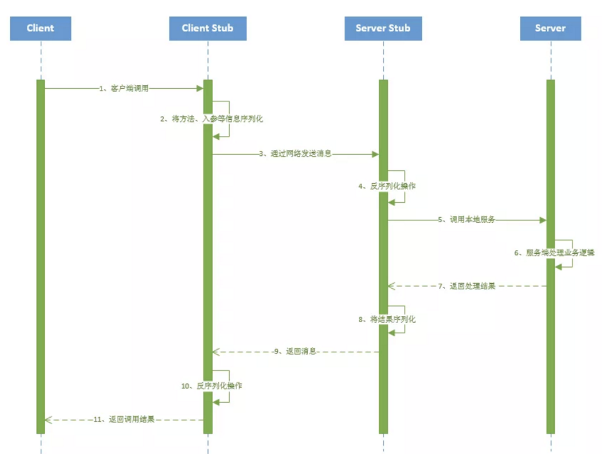
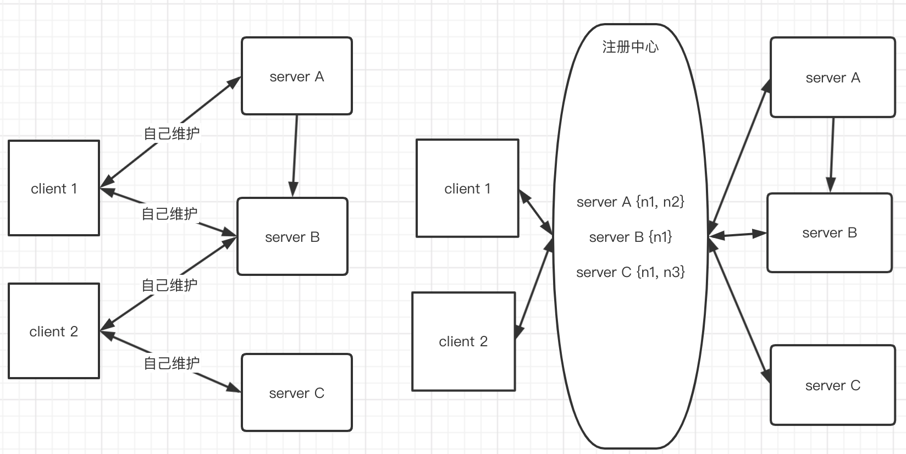

[TOC]

# rpc(Remote Procedure Call)

Remote Procedure Call (RPC) is a powerful technique for constructing distributed, client-server based applications. It is based on extending the conventional local procedure calling so that the called procedure need not exist in the same address space as the calling procedure. The two processes may be on the same system, or they may be on different systems with a network connecting them.

## rpc 问题引入

两台不同的主机进程要进行通信？

最易想到的最原始做法：tcp/ip通信，二进制数据传输

* 蛮烦点：写网络；服务动态扩展后，客户端又得对接处理了

如下一点一点的改进出来（参考：马士兵老师的RPC讲解课程），知识点

* JAVA socket编程基础
* JAVA反射
* 代理模式/动态代理
* 序列化

## 传统的socket编程

* User

```java
package rpc;

import java.io.Serializable;

/**
 * @Author mubi
 * @Date 2020/5/18 23:10
 */
public class User implements Serializable {
    private Integer id;
    private String name;

    public User(Integer id, String name) {
        this.id = id;
        this.name = name;
    }

    public Integer getId() {
        return id;
    }

    public void setId(Integer id) {
        this.id = id;
    }

    public String getName() {
        return name;
    }

    public void setName(String name) {
        this.name = name;
    }

    @Override
    public String toString() {
        return "User{" +
                "id=" + id +
                ", name='" + name + '\'' +
                '}';
    }
}
```

* IUserService

```java
package rpc;

/**
 * @Author mubi
 * @Date 2020/5/18 23:10
 */
public interface IUserService {
    User getUserById(Integer id);
}

```

* UserServiceImpl

```java
package rpc;

/**
 * @Author mubi
 * @Date 2020/5/18 23:10
 */
public class UserServiceImpl implements IUserService {

    @Override
    public User getUserById(Integer id) {
        return new User(id, "zhang");
    }
}
```

* Server

```java
package rpc;

import java.io.*;
import java.net.ServerSocket;
import java.net.Socket;

/**
 * @Author mubi
 * @Date 2020/5/18 23:18
 */
public class Server {
    public static void main(String[] args) throws Exception {
        // 监听指定的端口
        int port = 55533;
        ServerSocket server = new ServerSocket(port);

        // server将一直等待连接的到来
        System.out.println("server将一直等待连接的到来");
        Socket socket = server.accept();
        // 建立好连接后，从socket中获取输入流，并建立缓冲区进行读取
        InputStream in = socket.getInputStream();
        OutputStream out = socket.getOutputStream();
        DataInputStream dis = new DataInputStream(in);
        DataOutputStream dos = new DataOutputStream(out);

        int id = dis.readInt();
        System.out.println("client send id:" + id);

        IUserService userService = new UserServiceImpl();
        User user = userService.getUserById(id);

        dos.writeInt(user.getId());
        dos.writeUTF(user.getName());
        dos.flush();

        socket.close();
        server.close();
    }

}
```

* client

```java
package rpc;

import java.io.*;
import java.net.Socket;

/**
 * @Author mubi
 * @Date 2020/5/18 23:18
 */
public class Client {

    public static void main(String args[]) throws Exception {
        // 要连接的服务端IP地址和端口
        String host = "127.0.0.1";
        int port = 55533;
        // 与服务端建立连接
        Socket socket = new Socket(host, port);
        // 建立连接后获得输出流
        ByteArrayOutputStream byteArrayOutputStream = new ByteArrayOutputStream();
        DataOutputStream dos = new DataOutputStream(byteArrayOutputStream);
        dos.writeInt(12);
        socket.getOutputStream().write(byteArrayOutputStream.toByteArray());
        socket.getOutputStream().flush();

        InputStream in = socket.getInputStream();
        DataInputStream dis = new DataInputStream(in);
        int id = dis.readInt();
        String name = dis.readUTF();
        User user = new User(id, name);
        System.out.println(user);

        socket.close();
    }

}
```

## `Stub`代理类屏蔽网络细节

client 访问太复杂，且网络这部分非得了解不可

* 一个代理`Stub`类，把网络这部分给封装下，客户端轻松点

* client

```java
package rpc;

/**
 * @Author mubi
 * @Date 2020/5/18 23:18
 */
public class Client {

    public static void main(String args[]) throws Exception {
        // 代理
        Stub stub = new Stub();
        System.out.println(stub.getUserById(12));
    }

}
```

* Stub

```java
package rpc;

import java.io.ByteArrayOutputStream;
import java.io.DataInputStream;
import java.io.DataOutputStream;
import java.io.InputStream;
import java.net.Socket;

/**
 * @Author mubi
 * @Date 2020/5/18 23:18
 */
public class Stub {

    public User getUserById(Integer id) throws Exception{
        // 要连接的服务端IP地址和端口
        String host = "127.0.0.1";
        int port = 55533;
        // 与服务端建立连接
        Socket socket = new Socket(host, port);
        // 建立连接后获得输出流
        ByteArrayOutputStream byteArrayOutputStream = new ByteArrayOutputStream();
        DataOutputStream dos = new DataOutputStream(byteArrayOutputStream);
        dos.writeInt(id);
        socket.getOutputStream().write(byteArrayOutputStream.toByteArray());
        socket.getOutputStream().flush();

        InputStream in = socket.getInputStream();
        DataInputStream dis = new DataInputStream(in);
        int userId = dis.readInt();
        String userName = dis.readUTF();
        User user = new User(userId, userName);

        socket.close();

        return user;
    }

}
```

## 反射 + 动态代理

既然服务端 和 客户端都知道约定的方法，那么Stub直接把调用传递的方法，参数什么的直接给服务端；服务端通过反射执行，把结果返回给 Stub 就行了; Stub 把 服务端执行的 service类 代理给客户端；

这样：客户端的调用，就很简单：得到service对象，直接调用service的方法就好了；service增加方法，客户端也是直接调用

* Client

```java
package rpc;

/**
 * @Author mubi
 * @Date 2020/5/18 23:18
 */
public class Client {

    public static void main(String args[]) throws Exception {
        IUserService iUserService = Stub.getStub();
        System.out.println(iUserService.getUserById(12));
    }

}
```

* Server

```java
package rpc;

import java.io.*;
import java.lang.reflect.Method;
import java.net.ServerSocket;
import java.net.Socket;

/**
 * @Author mubi
 * @Date 2020/5/18 23:18
 */
public class Server {
    public static void main(String[] args) throws Exception {
        // 监听指定的端口
        int port = 55533;
        ServerSocket server = new ServerSocket(port);

        // server将一直等待连接的到来
        System.out.println("server将一直等待连接的到来");
        Socket socket = server.accept();
        // 建立好连接后，从socket中获取输入流，并建立缓冲区进行读取
        InputStream in = socket.getInputStream();
        OutputStream out = socket.getOutputStream();
        ObjectInputStream objectInputStream = new ObjectInputStream(in);
        DataOutputStream dos = new DataOutputStream(out);

//        int id = dis.readInt();
//        System.out.println("client send id:" + id);
//
//        IUserService userService = new UserServiceImpl();
//        User user = userService.getUserById(id);
        String methodName = objectInputStream.readUTF();
        Class[] parameterTypes = (Class[])objectInputStream.readObject();
        Object[] methodArgs = (Object[])objectInputStream.readObject();

        // 方法实现在 UserServiceImpl 对象上
        IUserService service = new UserServiceImpl();
        Method method = service.getClass().getMethod(methodName, parameterTypes);
        User user = (User)method.invoke(service, methodArgs);

        dos.writeInt(user.getId());
        dos.writeUTF(user.getName());
        dos.flush();

        socket.close();
        server.close();
    }

}
```

* Stub

```java
package rpc;

import java.io.*;
import java.lang.reflect.InvocationHandler;
import java.lang.reflect.Method;
import java.lang.reflect.Proxy;
import java.net.Socket;

/**
 * @Author mubi
 * @Date 2020/5/18 23:18
 */
public class Stub {
    public static IUserService getStub(){
        // 调用方法处理器
        InvocationHandler h = new InvocationHandler() {
            @Override
            public Object invoke(Object proxy, Method method, Object[] args) throws Throwable {
                // 要连接的服务端IP地址和端口
                String host = "127.0.0.1";
                int port = 55533;
                // 与服务端建立连接
                Socket socket = new Socket(host, port);
                // 建立连接后获得输出流
                ObjectOutputStream oos = new ObjectOutputStream(socket.getOutputStream());
                // 方法名，参数类型和列表（把方法传递给服务端）
                String methodName = method.getName();
                Class[] paramTypes = method.getParameterTypes();
                oos.writeUTF(methodName);
                oos.writeObject(paramTypes);
                oos.writeObject(args);
                oos.flush();

                InputStream in = socket.getInputStream();
                DataInputStream dis = new DataInputStream(in);
                int userId = dis.readInt();
                String userName = dis.readUTF();
                User user = new User(userId, userName);

                socket.close();

                return user;
            }
        };

        Object o = Proxy.newProxyInstance(IUserService.class.getClassLoader(),
               new Class[]{IUserService.class}, h);
        System.out.println(o.getClass().getInterfaces()[0]);
        return (IUserService)o;
    }

    @Deprecated
    public User getUserById(Integer id) throws Exception{
        // 要连接的服务端IP地址和端口
        String host = "127.0.0.1";
        int port = 55533;
        // 与服务端建立连接
        Socket socket = new Socket(host, port);
        // 建立连接后获得输出流
        ByteArrayOutputStream byteArrayOutputStream = new ByteArrayOutputStream();
        DataOutputStream dos = new DataOutputStream(byteArrayOutputStream);
        dos.writeInt(id);
        socket.getOutputStream().write(byteArrayOutputStream.toByteArray());
        socket.getOutputStream().flush();

        InputStream in = socket.getInputStream();
        DataInputStream dis = new DataInputStream(in);
        int userId = dis.readInt();
        String userName = dis.readUTF();
        User user = new User(userId, userName);

        socket.close();

        return user;
    }

}
```

### 改进

* Stub

```java
package rpc;

import java.io.*;
import java.lang.reflect.InvocationHandler;
import java.lang.reflect.Method;
import java.lang.reflect.Proxy;
import java.net.Socket;

/**
 * @Author mubi
 * @Date 2020/5/18 23:18
 */
public class Stub {
    public static IUserService getStub(){
        // 调用方法处理器
        InvocationHandler h = new InvocationHandler() {
            @Override
            public Object invoke(Object proxy, Method method, Object[] args) throws Throwable {
                // 要连接的服务端IP地址和端口
                String host = "127.0.0.1";
                int port = 55533;
                // 与服务端建立连接
                Socket socket = new Socket(host, port);
                // 建立连接后获得输出流
                ObjectOutputStream oos = new ObjectOutputStream(socket.getOutputStream());
                // 方法名，参数类型和列表（把方法传递给服务端）
                String methodName = method.getName();
                Class[] paramTypes = method.getParameterTypes();
                oos.writeUTF(methodName);
                oos.writeObject(paramTypes);
                oos.writeObject(args);
                oos.flush();

//                InputStream in = socket.getInputStream();
//                DataInputStream dis = new DataInputStream(in);
//                int userId = dis.readInt();
//                String userName = dis.readUTF();
//                User user = new User(userId, userName);
                // 直接读取服务端返回的对象
                ObjectInputStream objectInputStream = new ObjectInputStream(socket.getInputStream());
                User user = (User) objectInputStream.readObject();

                socket.close();

                return user;
            }
        };

        Object o = Proxy.newProxyInstance(IUserService.class.getClassLoader(),
               new Class[]{IUserService.class}, h);
        System.out.println(o.getClass().getInterfaces()[0]);
        return (IUserService)o;
    }

    @Deprecated
    public User getUserById(Integer id) throws Exception{
        // 要连接的服务端IP地址和端口
        String host = "127.0.0.1";
        int port = 55533;
        // 与服务端建立连接
        Socket socket = new Socket(host, port);
        // 建立连接后获得输出流
        ByteArrayOutputStream byteArrayOutputStream = new ByteArrayOutputStream();
        DataOutputStream dos = new DataOutputStream(byteArrayOutputStream);
        dos.writeInt(id);
        socket.getOutputStream().write(byteArrayOutputStream.toByteArray());
        socket.getOutputStream().flush();

        InputStream in = socket.getInputStream();
        DataInputStream dis = new DataInputStream(in);
        int userId = dis.readInt();
        String userName = dis.readUTF();
        User user = new User(userId, userName);

        socket.close();

        return user;
    }

}
```

* Server

```java
package rpc;

import java.io.*;
import java.lang.reflect.Method;
import java.net.ServerSocket;
import java.net.Socket;

/**
 * @Author mubi
 * @Date 2020/5/18 23:18
 */
public class Server {
    public static void main(String[] args) throws Exception {
        // 监听指定的端口
        int port = 55533;
        ServerSocket server = new ServerSocket(port);

        // server将一直等待连接的到来
        System.out.println("server将一直等待连接的到来");
        Socket socket = server.accept();
        // 建立好连接后，从socket中获取输入流，并建立缓冲区进行读取
        InputStream in = socket.getInputStream();
        OutputStream out = socket.getOutputStream();
        ObjectInputStream objectInputStream = new ObjectInputStream(in);
//        DataOutputStream dos = new DataOutputStream(out);

//        int id = dis.readInt();
//        System.out.println("client send id:" + id);
//
//        IUserService userService = new UserServiceImpl();
//        User user = userService.getUserById(id);
        String methodName = objectInputStream.readUTF();
        Class[] parameterTypes = (Class[])objectInputStream.readObject();
        Object[] methodArgs = (Object[])objectInputStream.readObject();

        // 方法实现在 UserServiceImpl 对象上
        IUserService service = new UserServiceImpl();
        Method method = service.getClass().getMethod(methodName, parameterTypes);
        User user = (User)method.invoke(service, methodArgs);

//        dos.writeInt(user.getId());
//        dos.writeUTF(user.getName());
//        dos.flush();
        // 直接把返回对象写回给客户端
        ObjectOutputStream objectOutputStream = new ObjectOutputStream(out);
        objectOutputStream.writeObject(user);
        objectOutputStream.flush();

        socket.close();
        server.close();
    }

}
```

## 任意服务的灵活支持

客户端直接传递Service到服务端，服务端获取注册服务的实现类，处理好了之后返回给客户端

不管多少种服务；只要约定好，客户端直接调用即可，基本不需要修改`Stub`相关代码; client 调用远程方法，就像调用本地方法一样（这样你不需要懂网络底层，直接服务端有什么，你就能用什么）

* client

```java
package rpc;

/**
 * @Author mubi
 * @Date 2020/5/18 23:18
 */
public class Client {

    public static void main(String[] args) throws Exception {
//        IUserService iUserService = (IUserService) Stub.getStub(IUserService.class);
//        System.out.println(iUserService.getUserById(12));

        IProService iProService = (IProService) Stub.getStub(IProService.class);
        System.out.println(iProService.getProById(12));
    }

}

```

* Stub

```java
package rpc;

import java.io.*;
import java.lang.reflect.InvocationHandler;
import java.lang.reflect.Method;
import java.lang.reflect.Proxy;
import java.net.Socket;

/**
 * @Author mubi
 * @Date 2020/5/18 23:18
 */
public class Stub {

    public static Object getStub(Class clazz){
        // 调用方法处理器
        InvocationHandler h = new InvocationHandler() {
            @Override
            public Object invoke(Object proxy, Method method, Object[] args) throws Throwable {
                // 要连接的服务端IP地址和端口
                String host = "127.0.0.1";
                int port = 55533;
                // 与服务端建立连接
                Socket socket = new Socket(host, port);

                // 类名,方法名，参数类型和列表（把类+方法传递给服务端）
                String className = clazz.getName();
                String methodName = method.getName();
                Class[] paramTypes = method.getParameterTypes();

                ObjectOutputStream oos = new ObjectOutputStream(socket.getOutputStream());
                oos.writeUTF(className);
                oos.writeUTF(methodName);
                oos.writeObject(paramTypes);
                oos.writeObject(args);
                oos.flush();
                // 直接读取服务端返回的对象
                ObjectInputStream objectInputStream = new ObjectInputStream(socket.getInputStream());
                Object o = objectInputStream.readObject();

                objectInputStream.close();
                socket.close();

                return o;
            }
        };

        Object o = Proxy.newProxyInstance(clazz.getClassLoader(), new Class[]{clazz}, h);
        System.out.println(o.getClass().getInterfaces()[0]);
        return o;
    }

    @Deprecated
    public static IUserService getStub(){
        // 调用方法处理器
        InvocationHandler h = new InvocationHandler() {
            @Override
            public Object invoke(Object proxy, Method method, Object[] args) throws Throwable {
                // 要连接的服务端IP地址和端口
                String host = "127.0.0.1";
                int port = 55533;
                // 与服务端建立连接
                Socket socket = new Socket(host, port);
                // 建立连接后获得输出流
                ObjectOutputStream oos = new ObjectOutputStream(socket.getOutputStream());
                // 方法名，参数类型和列表（把方法传递给服务端）
                String methodName = method.getName();
                Class[] paramTypes = method.getParameterTypes();
                oos.writeUTF(methodName);
                oos.writeObject(paramTypes);
                oos.writeObject(args);
                oos.flush();

//                InputStream in = socket.getInputStream();
//                DataInputStream dis = new DataInputStream(in);
//                int userId = dis.readInt();
//                String userName = dis.readUTF();
//                User user = new User(userId, userName);
                // 直接读取服务端返回的对象
                ObjectInputStream objectInputStream = new ObjectInputStream(socket.getInputStream());
                User user = (User) objectInputStream.readObject();

                socket.close();

                return user;
            }
        };

        Object o = Proxy.newProxyInstance(IUserService.class.getClassLoader(),
               new Class[]{IUserService.class}, h);
        System.out.println(o.getClass().getInterfaces()[0]);
        return (IUserService)o;
    }

    @Deprecated
    public User getUserById(Integer id) throws Exception{
        // 要连接的服务端IP地址和端口
        String host = "127.0.0.1";
        int port = 55533;
        // 与服务端建立连接
        Socket socket = new Socket(host, port);
        // 建立连接后获得输出流
        ByteArrayOutputStream byteArrayOutputStream = new ByteArrayOutputStream();
        DataOutputStream dos = new DataOutputStream(byteArrayOutputStream);
        dos.writeInt(id);
        socket.getOutputStream().write(byteArrayOutputStream.toByteArray());
        socket.getOutputStream().flush();

        InputStream in = socket.getInputStream();
        DataInputStream dis = new DataInputStream(in);
        int userId = dis.readInt();
        String userName = dis.readUTF();
        User user = new User(userId, userName);

        socket.close();

        return user;
    }

}
```

* Server

```java
package rpc;

import java.io.*;
import java.lang.reflect.Method;
import java.net.ServerSocket;
import java.net.Socket;

/**
 * @Author mubi
 * @Date 2020/5/18 23:18
 */
public class Server {
    public static void main(String[] args) throws Exception {
        // 监听指定的端口
        int port = 55533;
        ServerSocket server = new ServerSocket(port);

        // server将一直等待连接的到来
        System.out.println("server将一直等待连接的到来");
        Socket socket = server.accept();
        // 建立好连接后，从socket中获取输入流，并建立缓冲区进行读取
        InputStream in = socket.getInputStream();
        ObjectInputStream objectInputStream = new ObjectInputStream(in);

        String clazzName = objectInputStream.readUTF();
        String methodName = objectInputStream.readUTF();
        Class[] parameterTypes = (Class[])objectInputStream.readObject();
        Object[] methodArgs = (Object[])objectInputStream.readObject();

        Class clazz = null;
        // 从服务注册中找到具体的类, 这里写个假的
        if(clazzName.equals("rpc.IUserService")) {
            clazz = UserServiceImpl.class;
        }
        if(clazzName.equals("rpc.IProService")) {
            clazz = ProServiceImpl.class;
        }

        Method method = clazz.getMethod(methodName, parameterTypes);
        Object o = method.invoke(clazz.newInstance(), methodArgs);

        OutputStream out = socket.getOutputStream();
        // 直接把返回对象写回给客户端
        ObjectOutputStream objectOutputStream = new ObjectOutputStream(out);
        objectOutputStream.writeObject(o);
        objectOutputStream.flush();

        socket.close();
        server.close();
    }

}
```

## RPC 序列化协议

上述代码中涉及到了对象的序列化，反序列化：把对象转换字节数组在网络种传输，然后又读取字节数组，再次转换为原始对象

序列化框架：

* java.io.Serializable
* Hessian
* google protobuf
* facebook thrift
* kyro
* json序列化框架：Jackson，google Gson，alibaba FastJson
* xmlrpc(xstream)

### 用序列化协议改写代码

* Stub

```java
package rpc;

import java.io.*;
import java.lang.reflect.InvocationHandler;
import java.lang.reflect.Method;
import java.lang.reflect.Proxy;
import java.net.Socket;

/**
 * @Author mubi
 * @Date 2020/5/18 23:18
 */
public class Stub {

    public static Object getStub(Class clazz){
        // 调用方法处理器
        InvocationHandler h = new InvocationHandler() {
            @Override
            public Object invoke(Object proxy, Method method, Object[] args) throws Throwable {
                // 要连接的服务端IP地址和端口
                String host = "127.0.0.1";
                int port = 55533;
                // 与服务端建立连接
                Socket socket = new Socket(host, port);

                // 构造请求服务器的对象
                RpcRequest rpcRequest = new RpcRequest(clazz.getName(), method.getName(),
                        method.getParameterTypes(), args);
                // 传递二进制给服务端
                OutputStream outputStream = socket.getOutputStream();
                outputStream.write(HessianSerializerUtil.serialize(rpcRequest));
                socket.shutdownOutput();

                // 直接读取服务端返回的二进制, 反序列化为对象返回
                InputStream inputStream = socket.getInputStream();
                byte[] bytes = readInputStream(inputStream);
                Object o = HessianSerializerUtil.deserialize(bytes);

                inputStream.close();
                outputStream.close();
                socket.close();

                return o;
            }
        };

        Object o = Proxy.newProxyInstance(clazz.getClassLoader(), new Class[]{clazz}, h);
        System.out.println(o.getClass().getInterfaces()[0]);
        return o;
    }

    public static byte[] readInputStream(InputStream inputStream) throws IOException {
        byte[] buffer = new byte[2048];
        int len;
        ByteArrayOutputStream bos = new ByteArrayOutputStream();
        while((len = inputStream.read(buffer)) != -1) {
            bos.write(buffer, 0, len);
        }
        return bos.toByteArray();
    }

}
```

* Server

```java
package rpc;

import java.io.*;
import java.lang.reflect.Method;
import java.net.ServerSocket;
import java.net.Socket;

/**
 * @Author mubi
 * @Date 2020/5/18 23:18
 */
public class Server {
    public static void main(String[] args) throws Exception {
        // 监听指定的端口
        int port = 55533;
        ServerSocket server = new ServerSocket(port);

        // server将一直等待连接的到来
        System.out.println("server将一直等待连接的到来");
        Socket socket = server.accept();

        // 建立好连接后，从socket中获取客户端传递过来的对象
        InputStream in = socket.getInputStream();
        RpcRequest rpcRequest = HessianSerializerUtil.deserialize(readInputStream(in));
//        System.out.println("rpcRequest:" + rpcRequest);

        // 执行方法
        Class clazz = null; // 从服务注册中找到具体的类, 这里写个假的
        if(rpcRequest.getClassName().equals("rpc.IUserService")) {
            clazz = UserServiceImpl.class;
        }
        if(rpcRequest.getClassName().equals("rpc.IProService")) {
            clazz = ProServiceImpl.class;
        }
        Method method = clazz.getMethod(rpcRequest.getMethodName(), rpcRequest.getParamTypes());
        Object o = method.invoke(clazz.newInstance(), rpcRequest.getArgs());

        // 返回对象 二进制形式发送给客户端
        OutputStream out = socket.getOutputStream();
        out.write(HessianSerializerUtil.serialize(o));
        out.flush();

        socket.close();
        server.close();
    }

    public static byte[] readInputStream(InputStream inputStream) throws IOException {
        byte[] buffer = new byte[2048];
        int len;
        ByteArrayOutputStream bos = new ByteArrayOutputStream();
        while((len = inputStream.read(buffer)) != -1) {
            bos.write(buffer, 0, len);
        }
        return bos.toByteArray();
    }

}
```

## RPC 网络协议

通信协议

* TCP/UDP
* Web Service
* Restful(http + json)
* RMI(Remote Method Invocation)
* JMS(Java Message Service)
* RPC(Remote Procedure Call)

RPC采用的网络协议

RPC本身重点在于方法调用，可以用各种网络协议是实现，比如RMI,restful等，其中(RMI不能跨语言，Resful基于http：带宽占用高，效率低)

RPC多用于服务器集群间的通信

## 回顾RPC



## 为什么需要服务注册与发现

随着服务数量的增多，各个服务之间的调用变得错综复杂，一个服务可能依赖外部多个服务，当一个服务的域名或IP地址改变了之后如何通知依赖方，或者依赖方如何快速的发现服务提供方的地址变化。

* 客户端与服务端自己维护：有多少个服务，客户端就要维护多少个(服务增减，负载均衡，心跳)
* 找个代理，客户端有需求找代理，代理维持这些服务，也能给客户通知；（可以看成`代理模式`）



**服务注册**就是维护一个登记簿，它管理系统内所有的服务地址。当新的服务启动后，它会向登记簿交待自己的地址信息。服务的依赖方直接向登记簿要Service Provider地址就行了

### 服务发现

<a href="https://www.nginx.com/blog/service-discovery-in-a-microservices-architecture/">Nginx Service Discovery blog</a>

问题：Service instances have dynamically assigned network locations. Moreover, the set of service instances changes dynamically because of autoscaling, failures, and upgrades. Consequently, your client code needs to use a more elaborate service discovery mechanism.
（服务实例是动态变化(扩缩容，失败，升级)的，且服务实例的网络地址是动态调整的；显然，客户端需要能及时正确的感知这些变化，需要一个可靠的服务发现机制）。

#### 客户端实现

When using client‑side discovery, the client is responsible for determining the network locations of available service instances and load balancing requests across them. The client queries a service registry, which is a database of available service instances. The client then uses a load‑balancing algorithm to select one of the available service instances and makes a request.‘

缺点：

One significant drawback of this pattern is that it couples the client with the service registry. You must implement client‑side service discovery logic for each programming language and framework used by your service clients.（这种模式的一个重要缺点是它将客户端与服务注册中心耦合起来。客户端必须为服务端使用的每种编程语言和框架实现一套服务发现逻辑。）

#### 服务端实现


The client makes a request to a service via a load balancer. The load balancer queries the service registry and routes each request to an available service instance. As with client‑side discovery, service instances are registered and deregistered with the service registry.

优缺点：

The server‑side discovery pattern has several benefits and drawbacks. One great benefit of this pattern is that details of discovery are abstracted away from the client. Clients simply make requests to the load balancer. This eliminates the need to implement discovery logic for each programming language and framework used by your service clients. Also, as mentioned above, some deployment environments provide this functionality for free. This pattern also has some drawbacks, however. Unless the load balancer is provided by the deployment environment, it is yet another highly available system component that you need to set up and manage.

#### 服务注册中心（Service Registry）

It is a database containing the network locations of service instances. A service registry needs to be highly available and up to date. Clients can cache network locations obtained from the service registry. However, that information eventually becomes out of date and clients become unable to discover service instances. Consequently, a service registry consists of a cluster of servers that use a replication protocol to maintain consistency.
