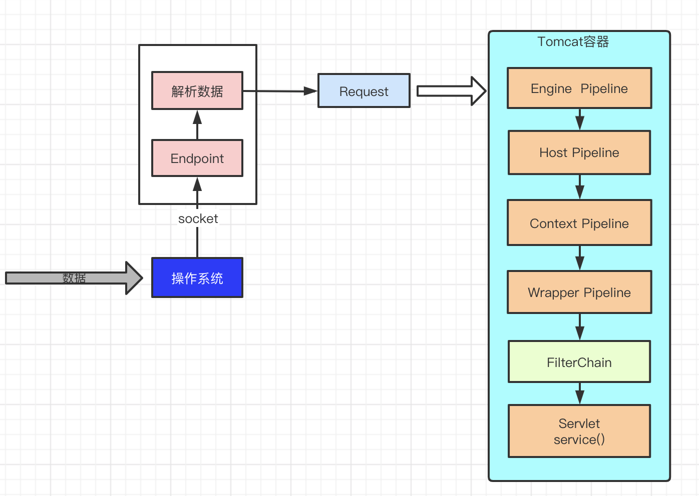

[TOC]

# Tomcat

直接认识：一个URL访问，经过`Tomcat`处理请求，将请求传递给SpringBoot/SpringMvc的Controller

## 几个问题

1. 为什么说Tomcat是一个Servlet容器？
2. Tomcat部署应用有几种方式？
3. War包和Jar包的区别？
4. Tomcat是怎么处理请求的，处理请求的流程是怎么样的？
5. Tcp,Http,Socket,Tomcat之间的关系是什么？

## Tomcat是一个Servlet容器？

```java
class Tomcat{
    List<Servlet> servlets;
}
```

### Servlet

#### Servlet在应用中的架构位置


#### Servlet架构图


1. 第一个到达服务器的 HTTP 请求被委派到 Servlet 容器。
2. Servlet 容器在调用 service() 方法之前加载 Servlet。
3. 然后 Servlet 容器处理由多个线程产生的多个请求，每个线程执行一个单一的 Servlet 实例的 service() 方法。

#### Servlet生命周期

Servlet 生命周期可被定义为从创建直到毁灭的整个过程。以下是 Servlet 遵循的过程：

1. Servlet 通过调用`init()`方法进行初始化。
2. Servlet 调用`service()`方法来处理客户端的请求。
3. Servlet 通过调用`destroy()`方法终止（结束）。
4. 最后，Servlet 是由 JVM 的垃圾回收器进行垃圾回收的。

`service()`方法是执行实际任务的主要方法。Servlet 容器（即 Web 服务器）调用 `service()` 方法来处理来自客户端（浏览器）的请求，并把格式化的响应写回给客户端。每次服务器接收到一个 Servlet 请求时，服务器会产生一个新的线程并调用服务。`service()` 方法检查 HTTP 请求类型（GET、POST、PUT、DELETE 等），并在适当的时候调用 `doGet`、`doPost`、`doPut`，`doDelete`等方法。

* doGet方法

```java
public void doGet(HttpServletRequest request,
                  HttpServletResponse response)
    throws ServletException, IOException {
    // Servlet 代码
}
```

* `doPost()`方法

```java
public void doPost(HttpServletRequest request,
                   HttpServletResponse response)
    throws ServletException, IOException {
    // Servlet 代码
}
```

#### 如何创建 Servlet ?

* 实现 `Servlet` 接口

* 继承 `GenericServlet` 类

`GenericServlet`实现了 Servlet 接口除了 service 的方法，不过这种方法我们极少用)

* 继承 `HttpServlet` 方法

HttpServlet 类，提供了 Http 相关的方法，HttpServlet 扩展了 GenericServlet 类，而 GenericServlet 类又实现了 Servlet 类和 ServletConfig 类

### 应用部署(how to deploy?)

// todo

#### War包和Jar包的区别？

* archive

n. 档案; 档案馆; 档案室;
v. 把…存档; 把…归档; 将(不常用信息)存档;

* A JAR file is a file that contains all components to make a self-contained executable `Java application`. Moreover, a JAR file includes compiled Java source code, manifest file, XML based configuration data, JSON based data files, images and audio. It is an aggregation of all these files into a single, compressed file. Compressing all the files helps to reduce the size of the application. Furthermore, it makes it easier to move the JAR file over the network between different platforms. Every Java Development Kit (JDK) includes a JAR utility to support JAR files. It allows creating new JAR files with a manifest file and extracting all the content of a JAR file onto the file system. Moreover, JAR utility helps to update existing JAR files.

Most JAR files are simply containers for data that another program needs to run with Java; therefore you cannot run these files and nothing will happen when you double-click them. Similarly, most executable JAR files are downloaded as installation files to install applications or programs.

* A WAR file contains files related to a `web project`. It contains servlet, JSP, XML, HTML, CSS, and JavaScript files that can be deployed on any servlet/JSP container. The jar tool of JDK helps to create a WAR file. These files are inside the WEB-INF folder of the project. A WAR file combines all the files into a single unit. Therefore, it takes a minimum amount of time to transfer a file from client to server.

WAR files need to be deployed on web container like Apache Tomcat, Jetty, Wildfly etc or it will also deployed on application server.

## Tomcat源码阅读笔记

<a href="https://github.com/doctording/apache-tomcat-8.5.57-src" target='_blank'>https://github.com/doctording/apache-tomcat-8.5.57-src</a>

## Tomcat架构



* 回答：为什么说Tomcat是一个Servlet容器？
    1. 4个容器：Engine, Host, Context，Wrapper
    2. 最后Servlet实例执行`service`方法

### Tomcat 如何处理请求

Tomcat要从Socket读取网络数据，这要涉及到I/O，tomcat I/O包括:

1. NIO
2. BIO
3. AIO
4. AJP

```java
socket --> socket.getInputStream() --> parse --> Request
```

### Connector(根据协议确定网络IO模型)

见：Tomcat7 的 Connector类，配置参考：<a href="https://tomcat.apache.org/tomcat-7.0-doc/config/http.html" target="_blank">HTTP Connector config</a>

```java
/**
    * Set the Coyote protocol which will be used by the connector.
    *
    * @param protocol The Coyote protocol name
    */
public void setProtocol(String protocol) {

    if (AprLifecycleListener.isAprAvailable()) {
        if ("HTTP/1.1".equals(protocol)) {
            setProtocolHandlerClassName
            ("org.apache.coyote.http11.Http11AprProtocol");
        } else if ("AJP/1.3".equals(protocol)) {
            setProtocolHandlerClassName
            ("org.apache.coyote.ajp.AjpAprProtocol");
        } else if (protocol != null) {
            setProtocolHandlerClassName(protocol);
        } else {
            setProtocolHandlerClassName
            ("org.apache.coyote.http11.Http11AprProtocol");
        }
    } else {
        if ("HTTP/1.1".equals(protocol)) {
            setProtocolHandlerClassName
            ("org.apache.coyote.http11.Http11Protocol");
        } else if ("AJP/1.3".equals(protocol)) {
            setProtocolHandlerClassName
            ("org.apache.coyote.ajp.AjpProtocol");
        } else if (protocol != null) {
            setProtocolHandlerClassName(protocol);
        }
    }

}
```

HTTP使用的是`org.apache.coyote.http11.Http11Protocol`处理的

#### org.apache.coyote.http11.Http11Protocol

tomcat7 源码中

* `public class Http11Protocol extends AbstractHttp11JsseProtocol<Socket> `
* `public class Http11NioProtocol extends AbstractHttp11JsseProtocol<NioChannel>`

##### JIoEndpoint

`JIoEndpoint`的作用是处理访问的TCP连接.具体的实现是主线程启动一个`Acceptor`线程,它将启用一个`阻塞型Socket`监听Tcp连接,获得连接后对每个连接启动一个worker线程进行处理.（常规的BIO模型）

##### JIoEndpoint Acceptor

```java
// --------------------------------------------------- Acceptor Inner Class
/**
    * The background thread that listens for incoming TCP/IP connections and
    * hands them off to an appropriate processor.
    */
protected class Acceptor extends AbstractEndpoint.Acceptor {

    @Override
    public void run() {

        int errorDelay = 0;

        // Loop until we receive a shutdown command
        while (running) {

            // Loop if endpoint is paused
            while (paused && running) {
                state = AcceptorState.PAUSED;
                try {
                    Thread.sleep(50);
                } catch (InterruptedException e) {
                    // Ignore
                }
            }

            if (!running) {
                break;
            }
            state = AcceptorState.RUNNING;

            try {
                //if we have reached max connections, wait
                countUpOrAwaitConnection();

                Socket socket = null;
                try {
                    // Accept the next incoming connection from the server
                    // socket
                    socket = serverSocketFactory.acceptSocket(serverSocket);
                } catch (IOException ioe) {
                    countDownConnection();
                    // Introduce delay if necessary
                    errorDelay = handleExceptionWithDelay(errorDelay);
                    // re-throw
                    throw ioe;
                }
                // Successful accept, reset the error delay
                errorDelay = 0;

                // Configure the socket
                if (running && !paused && setSocketOptions(socket)) {
                    // Hand this socket off to an appropriate processor
                    if (!processSocket(socket)) {
                        countDownConnection();
                        // Close socket right away
                        closeSocket(socket);
                    }
                } else {
                    countDownConnection();
                    // Close socket right away
                    closeSocket(socket);
                }
            } catch (IOException x) {
                if (running) {
                    log.error(sm.getString("endpoint.accept.fail"), x);
                }
            } catch (NullPointerException npe) {
                if (running) {
                    log.error(sm.getString("endpoint.accept.fail"), npe);
                }
            } catch (Throwable t) {
                ExceptionUtils.handleThrowable(t);
                log.error(sm.getString("endpoint.accept.fail"), t);
            }
        }
        state = AcceptorState.ENDED;
    }
}
```

* 阻塞接收Socket; 对Socket处理也是阻塞的

```java
socket = serverSocketFactory.acceptSocket(serverSocket);
```

* Process socket 开启新线程处理

```java
/**
    * Process a new connection from a new client. Wraps the socket so
    * keep-alive and other attributes can be tracked and then passes the socket
    * to the executor for processing.
    *
    * @param socket    The socket associated with the client.
    *
    * @return          <code>true</code> if the socket is passed to the
    *                  executor, <code>false</code> if something went wrong or
    *                  if the endpoint is shutting down. Returning
    *                  <code>false</code> is an indication to close the socket
    *                  immediately.
    */
protected boolean processSocket(Socket socket) {
    // Process the request from this socket
    try {
        SocketWrapper<Socket> wrapper = new SocketWrapper<Socket>(socket);
        wrapper.setKeepAliveLeft(getMaxKeepAliveRequests());
        wrapper.setSecure(isSSLEnabled());
        // During shutdown, executor may be null - avoid NPE
        if (!running) {
            return false;
        }
        getExecutor().execute(new SocketProcessor(wrapper));
    } catch (RejectedExecutionException x) {
        log.warn("Socket processing request was rejected for:"+socket,x);
        return false;
    } catch (Throwable t) {
        ExceptionUtils.handleThrowable(t);
        // This means we got an OOM or similar creating a thread, or that
        // the pool and its queue are full
        log.error(sm.getString("endpoint.process.fail"), t);
        return false;
    }
    return true;
}
```

##### BIO模型


`JIoEndpoint`维护了Acceptor和Worker：Acceptor接收socket，然后从Worker线程池中找出空闲的线程处理socket，如果worker线程池没有空闲线程，则Acceptor将阻塞。

1. 小于等于Coresize：创建线程执行
2. 大于CoreSize：加入队列
3. 队列满且小于maxSize：有空闲线程使用空闲线程执行，没有的话，创建线程执行；如果大于maxSize则执行拒绝策略

###### 附：限流组件LimitLatch

LimitLatch组件是一个流量控制组件，目的是为了不让Tomcat组件被大流量冲垮。LimitLatch通过AQS机制实现，这个组件启动时先初始化同步器的最大限制值，然后每接收一个套接字就将计数变量累加1，每关闭一个套接字将计数变量减1。当连接数达到最大值时，Acceptor线程就进入等待状态，不再accept新的socket连接。

需要额外说明的是，当到达最大连接数时（已经LimitLatch组件最大值，acceptor组件阻塞了），操作系统底层还是会继续接收客户端连接，并将请求放入一个队列中（backlog队列）。这个队列是有一个默认长度的，默认值是100。当然，这个值可以通过server.xml的Connector节点的acceptCount属性配置。假如在短时间内，有大量请求过来，连backlog队列都放满了，那么操作系统将拒绝接收后续的连接，返回“connection refused”。

在BIO模式中，LimitLatch组件支持的最大连接数是通过server.xml的Connector节点的maxConnections属性设置的，如果设置成-1，则表示不限制。

###### 附：StandardThreadExecutor(Tomcat 7.0.105,基于JDK`ThreadPoolExecutor`)

```java
package org.apache.catalina.core;

import java.util.concurrent.RejectedExecutionException;
import java.util.concurrent.TimeUnit;

import org.apache.catalina.Executor;
import org.apache.catalina.LifecycleException;
import org.apache.catalina.LifecycleState;
import org.apache.catalina.util.LifecycleMBeanBase;
import org.apache.tomcat.util.threads.ResizableExecutor;
import org.apache.tomcat.util.threads.TaskQueue;
import org.apache.tomcat.util.threads.TaskThreadFactory;
import org.apache.tomcat.util.threads.ThreadPoolExecutor;

public class StandardThreadExecutor extends LifecycleMBeanBase
        implements Executor, ResizableExecutor {

    // ---------------------------------------------- Properties
    /**
     * Default thread priority
     */
    protected int threadPriority = Thread.NORM_PRIORITY;

    /**
     * Run threads in daemon or non-daemon state
     */
    protected boolean daemon = true;

    /**
     * Default name prefix for the thread name
     */
    protected String namePrefix = "tomcat-exec-";

    /**
     * max number of threads
     */
    protected int maxThreads = 200;

    /**
     * min number of threads
     */
    protected int minSpareThreads = 25;

    /**
     * idle time in milliseconds
     */
    protected int maxIdleTime = 60000;

    /**
     * The executor we use for this component
     */
    protected ThreadPoolExecutor executor = null;

    /**
     * the name of this thread pool
     */
    protected String name;

    /**
     * prestart threads?
     */
    protected boolean prestartminSpareThreads = false;

    /**
     * The maximum number of elements that can queue up before we reject them
     */
    protected int maxQueueSize = Integer.MAX_VALUE;

    /**
     * After a context is stopped, threads in the pool are renewed. To avoid
     * renewing all threads at the same time, this delay is observed between 2
     * threads being renewed.
     */
    protected long threadRenewalDelay =
        org.apache.tomcat.util.threads.Constants.DEFAULT_THREAD_RENEWAL_DELAY;

    private TaskQueue taskqueue = null;
    // ---------------------------------------------- Constructors
    public StandardThreadExecutor() {
        //empty constructor for the digester
    }


    // ---------------------------------------------- Public Methods

    @Override
    protected void initInternal() throws LifecycleException {
        super.initInternal();
    }


    /**
     * Start the component and implement the requirements
     * of {@link org.apache.catalina.util.LifecycleBase#startInternal()}.
     *
     * @exception LifecycleException if this component detects a fatal error
     *  that prevents this component from being used
     */
    @Override
    protected void startInternal() throws LifecycleException {

        taskqueue = new TaskQueue(maxQueueSize);
        TaskThreadFactory tf = new TaskThreadFactory(namePrefix,daemon,getThreadPriority());
        executor = new ThreadPoolExecutor(getMinSpareThreads(), getMaxThreads(), maxIdleTime, TimeUnit.MILLISECONDS,taskqueue, tf);
        executor.setThreadRenewalDelay(threadRenewalDelay);
        if (prestartminSpareThreads) {
            executor.prestartAllCoreThreads();
        }
        taskqueue.setParent(executor);

        setState(LifecycleState.STARTING);
    }


    /**
     * Stop the component and implement the requirements
     * of {@link org.apache.catalina.util.LifecycleBase#stopInternal()}.
     *
     * @exception LifecycleException if this component detects a fatal error
     *  that needs to be reported
     */
    @Override
    protected void stopInternal() throws LifecycleException {

        setState(LifecycleState.STOPPING);
        if ( executor != null ) executor.shutdownNow();
        executor = null;
        taskqueue = null;
    }


    @Override
    protected void destroyInternal() throws LifecycleException {
        super.destroyInternal();
    }


    @Override
    public void execute(Runnable command, long timeout, TimeUnit unit) {
        if ( executor != null ) {
            executor.execute(command,timeout,unit);
        } else {
            throw new IllegalStateException("StandardThreadExecutor not started.");
        }
    }


    @Override
    public void execute(Runnable command) {
        if ( executor != null ) {
            try {
                executor.execute(command);
            } catch (RejectedExecutionException rx) {
                //there could have been contention around the queue
                if ( !( (TaskQueue) executor.getQueue()).force(command) ) throw new RejectedExecutionException("Work queue full.");
            }
        } else throw new IllegalStateException("StandardThreadPool not started.");
    }

    public void contextStopping() {
        if (executor != null) {
            executor.contextStopping();
        }
    }

    public int getThreadPriority() {
        return threadPriority;
    }

    public boolean isDaemon() {

        return daemon;
    }

    public String getNamePrefix() {
        return namePrefix;
    }

    public int getMaxIdleTime() {
        return maxIdleTime;
    }

    @Override
    public int getMaxThreads() {
        return maxThreads;
    }

    public int getMinSpareThreads() {
        return minSpareThreads;
    }

    @Override
    public String getName() {
        return name;
    }

    public boolean isPrestartminSpareThreads() {

        return prestartminSpareThreads;
    }
    public void setThreadPriority(int threadPriority) {
        this.threadPriority = threadPriority;
    }

    public void setDaemon(boolean daemon) {
        this.daemon = daemon;
    }

    public void setNamePrefix(String namePrefix) {
        this.namePrefix = namePrefix;
    }

    public void setMaxIdleTime(int maxIdleTime) {
        this.maxIdleTime = maxIdleTime;
        if (executor != null) {
            executor.setKeepAliveTime(maxIdleTime, TimeUnit.MILLISECONDS);
        }
    }

    public void setMaxThreads(int maxThreads) {
        this.maxThreads = maxThreads;
        if (executor != null) {
            executor.setMaximumPoolSize(maxThreads);
        }
    }

    public void setMinSpareThreads(int minSpareThreads) {
        this.minSpareThreads = minSpareThreads;
        if (executor != null) {
            executor.setCorePoolSize(minSpareThreads);
        }
    }

    public void setPrestartminSpareThreads(boolean prestartminSpareThreads) {
        this.prestartminSpareThreads = prestartminSpareThreads;
    }

    public void setName(String name) {
        this.name = name;
    }

    public void setMaxQueueSize(int size) {
        this.maxQueueSize = size;
    }

    public int getMaxQueueSize() {
        return maxQueueSize;
    }

    public long getThreadRenewalDelay() {
        return threadRenewalDelay;
    }

    public void setThreadRenewalDelay(long threadRenewalDelay) {
        this.threadRenewalDelay = threadRenewalDelay;
        if (executor != null) {
            executor.setThreadRenewalDelay(threadRenewalDelay);
        }
    }

    // Statistics from the thread pool
    @Override
    public int getActiveCount() {
        return (executor != null) ? executor.getActiveCount() : 0;
    }

    public long getCompletedTaskCount() {
        return (executor != null) ? executor.getCompletedTaskCount() : 0;
    }

    public int getCorePoolSize() {
        return (executor != null) ? executor.getCorePoolSize() : 0;
    }

    public int getLargestPoolSize() {
        return (executor != null) ? executor.getLargestPoolSize() : 0;
    }

    @Override
    public int getPoolSize() {
        return (executor != null) ? executor.getPoolSize() : 0;
    }

    public int getQueueSize() {
        return (executor != null) ? executor.getQueue().size() : -1;
    }


    @Override
    public boolean resizePool(int corePoolSize, int maximumPoolSize) {
        if (executor == null)
            return false;

        executor.setCorePoolSize(corePoolSize);
        executor.setMaximumPoolSize(maximumPoolSize);
        return true;
    }


    @Override
    public boolean resizeQueue(int capacity) {
        return false;
    }


    @Override
    protected String getDomainInternal() {
        // No way to navigate to Engine. Needs to have domain set.
        return null;
    }

    @Override
    protected String getObjectNameKeyProperties() {
        StringBuilder name = new StringBuilder("type=Executor,name=");
        name.append(getName());
        return name.toString();
    }
}
```

#### org.apache.coyote.http11.Http11NioProtocol

##### NioEndpoint

##### NioEndpoint的初始化

```java
/**
    * Initialize the endpoint.
    */
@Override
public void bind() throws Exception {
    // 开启一个新的ServerSocketChannel
    serverSock = ServerSocketChannel.open();
    socketProperties.setProperties(serverSock.socket());
    InetSocketAddress addr = (getAddress()!=null?new InetSocketAddress(getAddress(),getPort()):new InetSocketAddress(getPort()));
    // 绑定端口
    serverSock.socket().bind(addr,getBacklog());
    // 设置成阻塞方式
    serverSock.configureBlocking(true); //mimic APR behavior
    if (getSocketProperties().getSoTimeout() >= 0) {
        serverSock.socket().setSoTimeout(getSocketProperties().getSoTimeout());
    }

    // 初始化acceptor线程数
    // Initialize thread count defaults for acceptor, poller
    if (acceptorThreadCount == 0) {
        // FIXME: Doesn't seem to work that well with multiple accept threads
        acceptorThreadCount = 1;
    }
    // 初始化poller线程数
    if (pollerThreadCount <= 0) {
        //minimum one poller thread
        pollerThreadCount = 1;
    }
    stopLatch = new CountDownLatch(pollerThreadCount);

    // Initialize SSL if needed
    if (isSSLEnabled()) {
        SSLUtil sslUtil = handler.getSslImplementation().getSSLUtil(this);

        sslContext = sslUtil.createSSLContext();
        sslContext.init(wrap(sslUtil.getKeyManagers()),
                sslUtil.getTrustManagers(), null);

        SSLSessionContext sessionContext =
            sslContext.getServerSessionContext();
        if (sessionContext != null) {
            sslUtil.configureSessionContext(sessionContext);
        }
        // Determine which cipher suites and protocols to enable
        enabledCiphers = sslUtil.getEnableableCiphers(sslContext);
        enabledProtocols = sslUtil.getEnableableProtocols(sslContext);
    }

    if (oomParachute>0) reclaimParachute(true);
    // 开启NioSelectorPool
    selectorPool.open();
}
```

##### NioEndpoint Acceptor

```java
// --------------------------------------------------- Acceptor Inner Class
/**
    * The background thread that listens for incoming TCP/IP connections and
    * hands them off to an appropriate processor.
    */
protected class Acceptor extends AbstractEndpoint.Acceptor {

    @Override
    public void run() {

        int errorDelay = 0;

        // Loop until we receive a shutdown command
        while (running) {

            // Loop if endpoint is paused
            while (paused && running) {
                state = AcceptorState.PAUSED;
                try {
                    Thread.sleep(50);
                } catch (InterruptedException e) {
                    // Ignore
                }
            }

            if (!running) {
                break;
            }
            state = AcceptorState.RUNNING;

            try {
                //if we have reached max connections, wait
                countUpOrAwaitConnection();

                SocketChannel socket = null;
                try {
                    // 接收请求
                    // Accept the next incoming connection from the server
                    // socket
                    socket = serverSock.accept();
                } catch (IOException ioe) {
                    //we didn't get a socket
                    countDownConnection();
                    // Introduce delay if necessary
                    errorDelay = handleExceptionWithDelay(errorDelay);
                    // re-throw
                    throw ioe;
                }
                // Successful accept, reset the error delay
                errorDelay = 0;

                // setSocketOptions() will add channel to the poller
                // if successful
                if (running && !paused) {
                    // setSocketOptions() 把socket channel 加到 poller 中
                    if (!setSocketOptions(socket)) {
                        countDownConnection();
                        closeSocket(socket);
                    }
                } else {
                    countDownConnection();
                    closeSocket(socket);
                }
            } catch (SocketTimeoutException sx) {
                // Ignore: Normal condition
            } catch (IOException x) {
                if (running) {
                    log.error(sm.getString("endpoint.accept.fail"), x);
                }
            } catch (OutOfMemoryError oom) {
                try {
                    oomParachuteData = null;
                    releaseCaches();
                    log.error("", oom);
                }catch ( Throwable oomt ) {
                    try {
                        try {
                            System.err.println(oomParachuteMsg);
                            oomt.printStackTrace();
                        }catch (Throwable letsHopeWeDontGetHere){
                            ExceptionUtils.handleThrowable(letsHopeWeDontGetHere);
                        }
                    }catch (Throwable letsHopeWeDontGetHere){
                        ExceptionUtils.handleThrowable(letsHopeWeDontGetHere);
                    }
                }
            } catch (Throwable t) {
                ExceptionUtils.handleThrowable(t);
                log.error(sm.getString("endpoint.accept.fail"), t);
            }
        }
        state = AcceptorState.ENDED;
    }
}
```

* 设置非阻塞
* 新的SocketChannel后会构建一个`OP_REGISTER`类型的`PollerEvent`事件并放到`Poller.events`队列中

```java
/**
    * Process the specified connection.
    */
protected boolean setSocketOptions(SocketChannel socket) {
    // Process the connection
    try {
        //disable blocking, APR style, we are gonna be polling it
        socket.configureBlocking(false);
        Socket sock = socket.socket();
        socketProperties.setProperties(sock);

        NioChannel channel = nioChannels.poll();
        if ( channel == null ) {
            // SSL setup
            if (sslContext != null) {
                SSLEngine engine = createSSLEngine();
                int appbufsize = engine.getSession().getApplicationBufferSize();
                NioBufferHandler bufhandler = new NioBufferHandler(Math.max(appbufsize,socketProperties.getAppReadBufSize()),
                                                                    Math.max(appbufsize,socketProperties.getAppWriteBufSize()),
                                                                    socketProperties.getDirectBuffer());
                channel = new SecureNioChannel(socket, engine, bufhandler, selectorPool);
            } else {
                // normal tcp setup
                NioBufferHandler bufhandler = new NioBufferHandler(socketProperties.getAppReadBufSize(),
                                                                    socketProperties.getAppWriteBufSize(),
                                                                    socketProperties.getDirectBuffer());

                channel = new NioChannel(socket, bufhandler);
            }
        } else {
            channel.setIOChannel(socket);
            if ( channel instanceof SecureNioChannel ) {
                SSLEngine engine = createSSLEngine();
                ((SecureNioChannel)channel).reset(engine);
            } else {
                channel.reset();
            }
        }
        // 注册NioChannel对象
        getPoller0().register(channel);
    } catch (Throwable t) {
        ExceptionUtils.handleThrowable(t);
        try {
            log.error("",t);
        } catch (Throwable tt) {
            ExceptionUtils.handleThrowable(tt);
        }
        // Tell to close the socket
        return false;
    }
    return true;
}
```

```java
public void register(final NioChannel socket) {
    socket.setPoller(this);
    KeyAttachment key = keyCache.poll();
    final KeyAttachment ka = key!=null?key:new KeyAttachment(socket);
    ka.reset(this,socket,getSocketProperties().getSoTimeout());
    ka.setKeepAliveLeft(NioEndpoint.this.getMaxKeepAliveRequests());
    ka.setSecure(isSSLEnabled());
    PollerEvent r = eventCache.poll();
    ka.interestOps(SelectionKey.OP_READ);//this is what OP_REGISTER turns into.
    if ( r==null) r = new PollerEvent(socket,ka,OP_REGISTER);
    else r.reset(socket,ka,OP_REGISTER);
    // 添加`PollerEvent`
    addEvent(r);
}
```

* `Poller`线程会从`Poller.events`队列中取出`PollerEvent`对象，并运行`PollerEvent.run()`方法。在`PollerEvent.run()`方法中发现是`OP_REGISTER`事件，则会在`Poller.selector`上注册`SocketChannel`对象的`OP_READ`就绪事件

```java
@Override
public void run() {
    if ( interestOps == OP_REGISTER ) {
        try {
            socket.getIOChannel().register(socket.getPoller().getSelector(), SelectionKey.OP_READ, key);
        } catch (Exception x) {
            log.error("", x);
        }
    } else {
        final SelectionKey key = socket.getIOChannel().keyFor(socket.getPoller().getSelector());
        try {
            if (key == null) {
                // The key was cancelled (e.g. due to socket closure)
                // and removed from the selector while it was being
                // processed. Count down the connections at this point
                // since it won't have been counted down when the socket
                // closed.
                socket.getPoller().getEndpoint().countDownConnection();
            } else {
                final KeyAttachment att = (KeyAttachment) key.attachment();
                if ( att!=null ) {
                    //handle callback flag
                    if (att.isComet() && (interestOps & OP_CALLBACK) == OP_CALLBACK ) {
                        att.setCometNotify(true);
                    } else {
                        att.setCometNotify(false);
                    }
                    interestOps = (interestOps & (~OP_CALLBACK));//remove the callback flag
                    att.access();//to prevent timeout
                    //we are registering the key to start with, reset the fairness counter.
                    int ops = key.interestOps() | interestOps;
                    att.interestOps(ops);
                    key.interestOps(ops);
                } else {
                    socket.getPoller().cancelledKey(key, SocketStatus.ERROR, false);
                }
            }
        } catch (CancelledKeyException ckx) {
            try {
                socket.getPoller().cancelledKey(key, SocketStatus.DISCONNECT, true);
            } catch (Exception ignore) {}
        }
    }//end if
}//run
```

##### 同步非阻塞NIO（None Blocking IO）

* 应用程序的线程需要不断的进行 I/O 系统调用，轮询数据是否已经准备好，如果没有准备好，继续轮询，直到完成系统调用为止。

优点：每次发起的 IO 系统调用，在内核的等待数据过程中可以立即返回。用户线程不会阻塞，实时性较好
缺点：需要不断的重复发起IO系统调用，这种不断的轮询，将会不断地询问内核，这将占用大量的 CPU 时间，系统资源利用率较低。

##### 补充：如何避免同步非阻塞NIO模型中轮询等待的问题呢？

如何避免同步非阻塞NIO模型中轮询等待的问题呢？这就是IO多路复用模型。

IO多路复用模型，就是通过一种新的系统调用，一个进程可以监视多个文件描述符，一旦某个描述符就绪（一般是内核缓冲区可读/可写），内核kernel能够通知程序进行相应的IO系统调用。

目前支持IO多路复用的系统调用，有 select，epoll等等。select系统调用，是目前几乎在所有的操作系统上都有支持，具有良好跨平台特性。epoll是在linux 2.6内核中提出的，是select系统调用的linux增强版本。

###### 复习阻塞/非阻塞，同步/异步的概念

* 阻塞与非阻塞(等待IO时的状态)

函数或方法（用户线程调用内核IO操作）的实现方式：

1. 阻塞是指IO操作需要彻底完成后才返回到用户空间
2. 非阻塞是指IO操作被调用后立即返回给用户一个状态值，无需等到IO操作彻底完成。

* 同步与异步（用户线程与内核的消息交互方式）

1. 同步指用户线程发起IO请求后需要等待或者**轮询内核IO操作**完成后才能继续执行；同步有阻塞，非阻塞之分

2. 异步是指用户线程发起IO请求后仍然继续执行，当**内核IO操作完成后会通知用户线程**，或者调用用户线程注册的回调函数。异步一定是非阻塞的（内核会通过函数回调或者信号机制通知用户进程；类似观察者模式）
