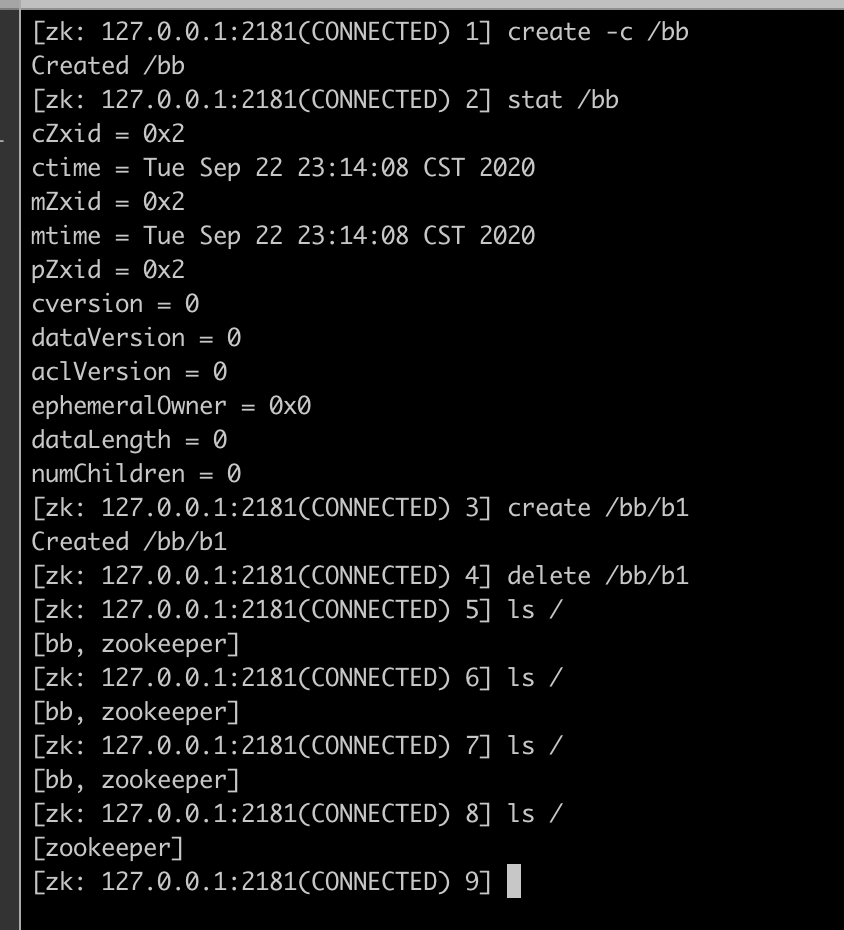
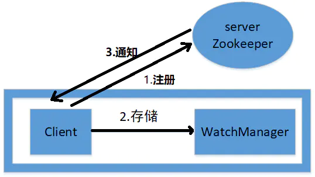

[TOC]

# Zookeeper


## 谈谈对zookeeper的认识？

文件系统 + 通知机制

* 可以看成是一个数据库（可以增删改查数据,能存储数据）
* 可以看成是一个文件系统（有类似文件系统的目录树结构）
* 是一个分布式的数据库，可以解决数据一致性问题(zk集群的主从同步，数据一致性的保证)
* 具有发布/订阅功能的分布式数据库(节点watch机制)

## Zookeeper 都有哪些功能？

* 集群管理：监控节点存活状态、运行请求等；

* 主节点选举：主节点挂掉了之后可以从备用的节点开始新一轮选主，主节点选举说的就是这个选举的过程，使用 Zookeeper 可以协助完成这个过程；

* 分布式锁：Zookeeper 提供两种锁：独占锁、共享锁。独占锁即一次只能有一个线程使用资源，共享锁是读锁共享，读写互斥，即可以有多线线程同时读同一个资源，如果要使用写锁也只能有一个线程使用。Zookeeper 可以对分布式锁进行控制

* 分布式存储配置中心，命名服务：在分布式系统中，通过使用命名服务，客户端应用能够根据指定名字来获取资源或服务的地址，提供者等信息

## 谈下你对 ZAB 协议的了解？

Zab协议(ZooKeeper Atomic Broadcast protocol)

ZAB 协议是为分布式协调服务 Zookeeper 专门设计的一种支持崩溃恢复的原子广播协议。ZAB 协议包括两种基本的模式：**崩溃恢复**和**消息广播**

当整个 Zookeeper 集群刚刚启动或者Leader服务器宕机、重启或者网络故障导致不存在过半的服务器与 Leader 服务器保持正常通信时，所有服务器进入**崩溃恢复模式**，首先选举产生新的 Leader 服务器，然后集群中 Follower 服务器开始与新的 Leader 服务器进行数据同步；当集群中超过半数机器与该 Leader 服务器完成数据同步之后，退出恢复模式进入**消息广播模式**，Leader 服务器开始接收客户端的事务请求生成事物提案来进行事务请求处理

## 强一致性、弱一致性、最终一致性？

一致性（Consistency）是指多副本（Replications）问题中的数据一致性。可以分为强一致性、弱一致性。

从复制主：主等待从同步完，然后返回，这是同步的，也是**强一致性**；如果主先直接返回，然后从慢慢同步，这是异步的，是**弱一致性**。

* 强一致性（Strict Consistency）

要求：
    * 任何一次读都能读到某个数据的最近一次写的数据
    * 系统中的所有进程，看到的操作顺序，都和全局时钟下的顺序一致

* 最终一致性

不保证在任意时刻任意节点上的同一份数据都是相同的，但是随着时间的迁移，不同节点上的同一份数据总是在向趋同的方向变化。简单说，就是在一段时间后，节点间的数据会最终达到一致状态。

* 弱一致性

数据更新后，如果能容忍后续的访问只能访问到部分或者全部访问不到，则是弱一致性；最终一致性就属于弱一致性

### 重试，补偿，幂等

## zk节点

### zk节点关联的stat结构

ZooKeeper命名空间中的每个znode都有一个与之关联的stat结构，类似于Unix/Linux文件系统中文件的stat结构。 znode的stat结构中的字段显示如下，各自的含义如下：
* cZxid：创建znode的事务ID
* mZxid：最后修改znode的事务ID
* pZxid：最后修改添加或删除子节点的事务ID
* ctime：表示从1970-01-01T00:00:00Z开始以毫秒为单位的znode创建时间
* mtime：表示从1970-01-01T00:00:00Z开始以毫秒为单位的znode最近修改时间
* dataVersion：表示对该znode的数据所做的更改次数
* cversion：这表示对此znode的子节点进行的更改次数
* aclVersion：表示对此znode的ACL进行更改的次数
* ephemeralOwner：如果znode是ephemeral类型节点，则这是znode所有者的 session ID；如果znode不是ephemeral节点,则该字段设置为零0
* dataLength：这是znode数据字段的长度
* numChildren：这表示znode的子节点的数量

eg1: 创建一个空的znode,并修改数据

```java
[zk: 127.0.0.1:2181(CONNECTED) 3] stat /mylock
cZxid = 0x6
ctime = Sat Sep 26 10:41:45 CST 2020
mZxid = 0x6
mtime = Sat Sep 26 10:41:45 CST 2020
pZxid = 0x6
cversion = 0
dataVersion = 0
aclVersion = 0
ephemeralOwner = 0x0
dataLength = 0
numChildren = 0
[zk: 127.0.0.1:2181(CONNECTED) 4] get /mylock
null
[zk: 127.0.0.1:2181(CONNECTED) 5] set /mylock lockdata
[zk: 127.0.0.1:2181(CONNECTED) 6] stat /mylock
cZxid = 0x6
ctime = Sat Sep 26 10:41:45 CST 2020
mZxid = 0xd // 数据节点最后一次更新时的事务ID 改变
mtime = Sun Sep 27 17:35:18 CST 2020
pZxid = 0x6
cversion = 0 // 子节点的版本号为0，初始状态
dataVersion = 1 // data version改变
aclVersion = 0
ephemeralOwner = 0x0
dataLength = 8 // 数据长度改变
numChildren = 0
[zk: 127.0.0.1:2181(CONNECTED) 7] get /mylock
lockdata
[zk: 127.0.0.1:2181(CONNECTED) 8]
```

eg2: 创建子节点

```java
[zk: 127.0.0.1:2181(CONNECTED) 8] create /mylock/son1 son1data
Created /mylock/son1
[zk: 127.0.0.1:2181(CONNECTED) 9] stat /mylock
cZxid = 0x6
ctime = Sat Sep 26 10:41:45 CST 2020
mZxid = 0xd
mtime = Sun Sep 27 17:35:18 CST 2020
pZxid = 0xe // 最后修改添加或删除子节点的事务ID
cversion = 1 // 子节点的版本号为1
dataVersion = 1
aclVersion = 0
ephemeralOwner = 0x0
dataLength = 8
numChildren = 1 // 孩子数量是1
[zk: 127.0.0.1:2181(CONNECTED) 10] create /mylock/son2 son2data
Created /mylock/son2
[zk: 127.0.0.1:2181(CONNECTED) 11] stat /mylock
cZxid = 0x6
ctime = Sat Sep 26 10:41:45 CST 2020
mZxid = 0xd
mtime = Sun Sep 27 17:35:18 CST 2020
pZxid = 0xf // 最后修改添加或删除子节点的事务ID
cversion = 2 // 子节点的版本号为2
dataVersion = 1
aclVersion = 0
ephemeralOwner = 0x0
dataLength = 8
numChildren = 2 // 孩子数量是2
[zk: 127.0.0.1:2181(CONNECTED) 12]
```

### zk节点的几种类型？

* 持久节点（PERSISTENT）

`create /path data`

除非手动删除，否则节点一直存在于 Zookeeper 上

* 临时节点（EPHEMERAL）

`create -e /path data`

临时节点的生命周期与客户端会话绑定，一旦客户端会话失效（客户端与zookeeper 连接断开不一定会话失效），那么这个客户端创建的所有临时节点都会被移除。

* 持久顺序节点（PERSISTENT_SEQUENTIAL）

`create -s /path data`

基本特性同持久节点，只是增加了顺序属性，节点名后边会追加一个由父节点维护的自增整型数字。

* 临时顺序节点（EPHEMERAL_SEQUENTIAL）

`create -e -s /path data`

基本特性同临时节点，增加了顺序属性，节点名后边会追加一个由父节点维护的自增整型数字。

---

zookeeper 3.6 版本后新增

* 容器节点（CONTAINER）

`create -c /path data`

只有添加过子节点，容器节点的特性才会生效，容器节点的特性是：节点的最后一个子节点被删除过，该节点会自动删除（可能延迟一段时间）



* ttl节点（PERSISTENT_WITH_TTL）

`create -t 3000 /path data`

TTL节点创建后，如果3秒内没有数据修改，并且没有子节点，则会自动删除

前提是，服务端支持了TTL节点，默认没有开启，通过`-Dzookeeper.extendedTypesEnabled=true`可以开启

* ttl顺序节点（PERSISTENT_SEQUENTIAL_WITH_TTL）

`create -s -t 3000 /path data`

### zk节点操作与产生的事件

ZooKeeper的Java API中，可以通过`getData()`方法、`Exists()`方法、`getChildren()`方法来绑定监听事件，凡是所有的事务型的操作(增、删、改)，都会触发到监听事件

zk事件 | 事件描述
|:---: | :---: |
None(-1) | 当zookeeper客户端的连接状态发生变更时，即KeeperState.Expired、KeeperState.Disconnected、KeeperState.SyncConnected、KeeperState.AuthFailed状态切换时，描述的事件类型为EventType.None
NodeCreated(1) | 创建节点的事件
NodeDeleted(2) |删除节点的事件
NodeDataChanged(3) | 节点数据发生变更
NodeChildrenChanged(4) | 子节点被创建、被删除，会发生事件触发

zk各种操作产生的事件

- | 监听父节点 | 监听子节点
-|-|-
create(父节点) | NodeCreated |无
delete(父节点) | NodeDeleted |无
setData(父节点)| NodeDataChanged |无
create(子节点) | NodeChildrenChanged | NodeCreated
delete(子节点) | NodeChildrenChanged | NodeDeleted
setData(子节点) | 无 | NodeDataChanged

## 通知(Watch)机制原理？



* zk客户端向zk服务器注册watcher的同时，会将watcher对象存储在客户端的WatchManager

* zk服务器触发watcher事件后，会向客户端发送通知，客户端线程从WatchManager中回调watcher执行相应的功能

* Watch是轻量级的，其实就是本地JVM的Callback，服务器端只是存了是否有设置了Watcher的布尔类型

### 回到zk的架构


当创建一个Zookeeper实例的时候，会有两个线程被创建：`SendThread`和`EventThread`。所以当我们使用ZK Client端的时候应该尽量只创建一个Zookeeper实例并反复使用。大量的创建销毁Zookeeper实例不仅会反复的创建和销毁线程，而且会在Server端创建大量的Session。


其中`SendThread`是真正处理网络IO的线程，所有通过网络发送和接受的数据包都在这个线程中处理，线程的主体是一个while循环；SendThread 负责将ZooKeeper的请求信息封装成一个Packet，发送给 Server，并维持同Server的心跳；`EventThread`负责解析通过SendThread得到的Response，之后发送给`Watcher::processEvent`进行详细的事件处理

* SendThread

```java
/**
    * This class services the outgoing request queue and generates the heart
    * beats. It also spawns the ReadThread.
    */
class SendThread extends ZooKeeperThread {

    @Override
    public void run() {
        clientCnxnSocket.introduce(this, sessionId, outgoingQueue);
        clientCnxnSocket.updateNow();
        clientCnxnSocket.updateLastSendAndHeard();
        int to;
        long lastPingRwServer = Time.currentElapsedTime();
        final int MAX_SEND_PING_INTERVAL = 10000; //10 seconds
        while (state.isAlive()) {
            try {
                if (!clientCnxnSocket.isConnected()) {
                    // don't re-establish connection if we are closing
                    if (closing) {
                        break;
                    }
                    startConnect();
                    clientCnxnSocket.updateLastSendAndHeard();
                }

                if (state.isConnected()) {
                    // determine whether we need to send an AuthFailed event.
                    if (zooKeeperSaslClient != null) {
                        boolean sendAuthEvent = false;
                        if (zooKeeperSaslClient.getSaslState() == ZooKeeperSaslClient.SaslState.INITIAL) {
                            try {
                                zooKeeperSaslClient.initialize(ClientCnxn.this);
                            } catch (SaslException e) {
                                LOG.error("SASL authentication with Zookeeper Quorum member failed: " + e);
                                state = States.AUTH_FAILED;
                                sendAuthEvent = true;
                            }
                        }
                        KeeperState authState = zooKeeperSaslClient.getKeeperState();
                        if (authState != null) {
                            if (authState == KeeperState.AuthFailed) {
                                // An authentication error occurred during authentication with the Zookeeper Server.
                                state = States.AUTH_FAILED;
                                sendAuthEvent = true;
                            } else {
                                if (authState == KeeperState.SaslAuthenticated) {
                                    sendAuthEvent = true;
                                }
                            }
                        }

                        if (sendAuthEvent == true) {
                            eventThread.queueEvent(new WatchedEvent(
                                    Watcher.Event.EventType.None,
                                    authState,null));
                        }
                    }
                    to = readTimeout - clientCnxnSocket.getIdleRecv();
                } else {
                    to = connectTimeout - clientCnxnSocket.getIdleRecv();
                }

                if (to <= 0) {
                    String warnInfo;
                    warnInfo = "Client session timed out, have not heard from server in "
                        + clientCnxnSocket.getIdleRecv()
                        + "ms"
                        + " for sessionid 0x"
                        + Long.toHexString(sessionId);
                    LOG.warn(warnInfo);
                    throw new SessionTimeoutException(warnInfo);
                }
                if (state.isConnected()) {
                    //1000(1 second) is to prevent race condition missing to send the second ping
                    //also make sure not to send too many pings when readTimeout is small 
                    int timeToNextPing = readTimeout / 2 - clientCnxnSocket.getIdleSend() - 
                            ((clientCnxnSocket.getIdleSend() > 1000) ? 1000 : 0);
                    //send a ping request either time is due or no packet sent out within MAX_SEND_PING_INTERVAL
                    if (timeToNextPing <= 0 || clientCnxnSocket.getIdleSend() > MAX_SEND_PING_INTERVAL) {
                        sendPing();
                        clientCnxnSocket.updateLastSend();
                    } else {
                        if (timeToNextPing < to) {
                            to = timeToNextPing;
                        }
                    }
                }

                // If we are in read-only mode, seek for read/write server
                if (state == States.CONNECTEDREADONLY) {
                    long now = Time.currentElapsedTime();
                    int idlePingRwServer = (int) (now - lastPingRwServer);
                    if (idlePingRwServer >= pingRwTimeout) {
                        lastPingRwServer = now;
                        idlePingRwServer = 0;
                        pingRwTimeout =
                            Math.min(2*pingRwTimeout, maxPingRwTimeout);
                        pingRwServer();
                    }
                    to = Math.min(to, pingRwTimeout - idlePingRwServer);
                }

                clientCnxnSocket.doTransport(to, pendingQueue, ClientCnxn.this);
            } catch (Throwable e) {
                if (closing) {
                    if (LOG.isDebugEnabled()) {
                        // closing so this is expected
                        LOG.debug("An exception was thrown while closing send thread for session 0x"
                                + Long.toHexString(getSessionId())
                                + " : " + e.getMessage());
                    }
                    break;
                } else {
                    // this is ugly, you have a better way speak up
                    if (e instanceof SessionExpiredException) {
                        LOG.info(e.getMessage() + ", closing socket connection");
                    } else if (e instanceof SessionTimeoutException) {
                        LOG.info(e.getMessage() + RETRY_CONN_MSG);
                    } else if (e instanceof EndOfStreamException) {
                        LOG.info(e.getMessage() + RETRY_CONN_MSG);
                    } else if (e instanceof RWServerFoundException) {
                        LOG.info(e.getMessage());
                    } else {
                        LOG.warn(
                                "Session 0x"
                                        + Long.toHexString(getSessionId())
                                        + " for server "
                                        + clientCnxnSocket.getRemoteSocketAddress()
                                        + ", unexpected error"
                                        + RETRY_CONN_MSG, e);
                    }
                    // At this point, there might still be new packets appended to outgoingQueue.
                    // they will be handled in next connection or cleared up if closed.
                    cleanup();
                    if (state.isAlive()) {
                        eventThread.queueEvent(new WatchedEvent(
                                Event.EventType.None,
                                Event.KeeperState.Disconnected,
                                null));
                    }
                    clientCnxnSocket.updateNow();
                    clientCnxnSocket.updateLastSendAndHeard();
                }
            }
        }
        synchronized (state) {
            // When it comes to this point, it guarantees that later queued
            // packet to outgoingQueue will be notified of death.
            cleanup();
        }
        clientCnxnSocket.close();
        if (state.isAlive()) {
            eventThread.queueEvent(new WatchedEvent(Event.EventType.None,
                    Event.KeeperState.Disconnected, null));
        }
        ZooTrace.logTraceMessage(LOG, ZooTrace.getTextTraceLevel(),
                "SendThread exited loop for session: 0x"
                        + Long.toHexString(getSessionId()));
    }
```


* EnvetThread

EventThread通过从waitingEvents阻塞队列中获取事件，然后processEvent方法对取出来的事件进行处理

```java
class EventThread extends ZooKeeperThread {
    private final LinkedBlockingQueue<Object> waitingEvents =
        new LinkedBlockingQueue<Object>();

    /** This is really the queued session state until the event
        * thread actually processes the event and hands it to the watcher.
        * But for all intents and purposes this is the state.
        */
    private volatile KeeperState sessionState = KeeperState.Disconnected;

    private volatile boolean wasKilled = false;
    private volatile boolean isRunning = false;

    EventThread() {
        super(makeThreadName("-EventThread"));
        setDaemon(true);
    }

    @Override
    public void run() {
        try {
            isRunning = true;
            while (true) {
                Object event = waitingEvents.take();
                if (event == eventOfDeath) {
                    wasKilled = true;
                } else {
                    processEvent(event);
                }
                if (wasKilled)
                    synchronized (waitingEvents) {
                        if (waitingEvents.isEmpty()) {
                            isRunning = false;
                            break;
                        }
                    }
            }
        } catch (InterruptedException e) {
            LOG.error("Event thread exiting due to interruption", e);
        }

        LOG.info("EventThread shut down for session: 0x{}",
                    Long.toHexString(getSessionId()));
    }
```

### Watcher 旧版本的一些特性

* 一次性

无论是服务端还是客户端，一旦一个 Watcher 被触发，ZooKeeper 都会将其从相应的存储中移除。因此，在 Watcher 的使用上，需要反复注册。这样的设计有效地减轻了服务端的压力。

* 客户端串行执行

客户端 Watcher 回调的过程是一个串行同步的过程，这为我们保证了顺序，同时，需要注意的一点是，一定不能因为一个 Watcher 的处理逻辑影响了整个客户端的 Watcher 回调，所以，我觉得客户端 Watcher 的实现类要另开一个线程进行处理业务逻辑，以便给其他的 Watcher 调用让出时间。

* 轻量

WatcherEvent 是 ZooKeeper 整个 Watcher 通知机制的最小通知单元，这个数据结构中只包含三部分内容：`通知状态`、`事件类型`和`节点路径`。也就是说，Watcher 通知非常简单，只会告诉客户端发生了事件，而不会说明事件的具体内容。例如针对 NodeDataChanged 事件，ZooKeeper 的Watcher 只会通知客户端指定数据节点的数据内容发生了变更，而对于原始数据以及变更后的新数据都无法从这个事件中直接获取到，而是需要客户端主动重新去获取数据——这也是 ZooKeeper 的 Watcher 机制的一个非常重要的特性。

## Curator 客户端

1. 封装ZooKeeper client与ZooKeeper server之间的连接处理
2. 提供了一套Fluent风格的操作API
3. 提供ZooKeeper各种应用场景(recipe, 比如共享锁服务, 集群领导选举机制)的抽象封装

### curator三种监听器（Cache）方式

cache是一种缓存机制，可以借助cache实现监听。cache在客户端缓存了znode的各种状态，当感知到zk集群的znode状态变化，会触发event事件，注册的监听器会处理这些事件。

* Path Cache

Path Cache用来观察ZNode的子节点并缓存状态，如果ZNode的子节点被创建，更新或者删除，那么Path Cache会更新缓存，并且触发事件给注册的监听器。

Path Cache是通过PathChildrenCache类来实现的，监听器注册是通过PathChildrenCacheListener。

* Node Cache

Node Cache用来观察ZNode自身，如果ZNode节点本身被创建，更新或者删除，那么Node Cache会更新缓存，并触发事件给注册的监听器。

Node Cache是通过NodeCache类来实现的，监听器对应的接口为NodeCacheListener。

* Tree Cache

可以看做是上两种的合体，Tree Cache观察的是所有节点的所有数据。

#### Java 例子代码

`compile 'org.apache.curator:curator-recipes:4.0.1'`

```java
package zklock;

import org.apache.curator.RetryPolicy;
import org.apache.curator.framework.CuratorFramework;
import org.apache.curator.framework.CuratorFrameworkFactory;
import org.apache.curator.framework.recipes.cache.ChildData;
import org.apache.curator.framework.recipes.cache.NodeCache;
import org.apache.curator.framework.recipes.cache.NodeCacheListener;
import org.apache.curator.framework.recipes.cache.PathChildrenCache;
import org.apache.curator.framework.recipes.cache.PathChildrenCacheEvent;
import org.apache.curator.framework.recipes.cache.PathChildrenCacheListener;
import org.apache.curator.framework.recipes.cache.TreeCache;
import org.apache.curator.framework.recipes.cache.TreeCacheEvent;
import org.apache.curator.framework.recipes.cache.TreeCacheListener;
import org.apache.curator.retry.ExponentialBackoffRetry;


/**
 * @Author mubi
 * @Date 2020/3/27 23:43
 */
public class CuratorTest {
    private static String clusterNode = "/mylock";

    private static CuratorFramework cf;
    private static PathChildrenCache pathChildrenCache;
    private static NodeCache nodeCache;
    private static TreeCache treeCache;

    public static void main(String[] args) throws Exception {
        CuratorTest curatorTest = new CuratorTest();

        RetryPolicy retryPolicy = new ExponentialBackoffRetry(1000,3);
        cf = CuratorFrameworkFactory.newClient("127.0.0.1:2181",
                5000,1000,retryPolicy);
        cf.start();
        curatorTest.setPathCacheListener(clusterNode, true);
        curatorTest.setNodeCacheListener(clusterNode, false);
        curatorTest.setTreeCacheListener(clusterNode);
        System.in.read();
    }

    /**
     *  设置Path Cache, 监控本节点的子节点被创建,更新或者删除，注意是子节点, 子节点下的子节点不能递归监控
     *  可重入监听
     */
    public void setPathCacheListener(String path, boolean cacheData) throws Exception{
        try {
            pathChildrenCache = new PathChildrenCache(cf, path, cacheData);
            PathChildrenCacheListener childrenCacheListener = new PathChildrenCacheListener() {
                @Override
                public void childEvent(CuratorFramework client, PathChildrenCacheEvent event) {
                    ChildData data = event.getData();
                    switch (event.getType()) {
                        case CHILD_ADDED:
                            System.out.println("子节点增加" + data.getPath() + " " +  data.getData());
                            try{
                                String rs = new String(data.getData(), "utf-8");
                                System.out.println("data string:" + rs);
                            }catch (Exception e){
                            }
                            break;
                        case CHILD_UPDATED:
                            System.out.println("子节点更新" + data.getPath() + " " +  data.getData());
                            break;
                        case CHILD_REMOVED:
                            System.out.println("子节点删除" + data.getPath() + " " +  data.getData());
                            break;
                        default:
                            break;
                    }
                }
            };
            pathChildrenCache.getListenable().addListener(childrenCacheListener);
            pathChildrenCache.start(PathChildrenCache.StartMode.POST_INITIALIZED_EVENT);
        } catch (Exception e) {
            System.out.println("PathCache监听失败, path=" + path);
        }
    }

    /**
     * 设置Node Cache, 监控本节点的新增,删除,更新
     */
    public void setNodeCacheListener(String path, boolean dataIsCompressed) {
        try {
            nodeCache = new NodeCache(cf, path, dataIsCompressed);
            NodeCacheListener nodeCacheListener = new NodeCacheListener() {
                @Override
                public void nodeChanged() throws Exception {
                    ChildData childData = nodeCache.getCurrentData();
                    System.out.println("ZNode节点状态改变, path=" + childData.getPath());
                    System.out.println("ZNode节点状态改变, data=" + childData.getData());
                    try{
                        String rs = new String(childData.getData(), "utf-8");
                        System.out.println("data string:" + rs);
                    }catch (Exception e){
                    }
                    System.out.println("ZNode节点状态改变, stat=" + childData.getStat());
                }
            };
            nodeCache.getListenable().addListener(nodeCacheListener);
            nodeCache.start();
        } catch (Exception e) {
            System.out.println("创建NodeCache监听失败, path=" + path);
        }
    }

    /**
     * 设置Tree Cache, 监控本节点的新增,删除,更新
     * 节点的update可以监控到, 如果删除不会自动再次创建
     * 可重入监听
     */
    public void setTreeCacheListener(final String path) {
        try {
            treeCache = new TreeCache(cf, path);
            TreeCacheListener treeCacheListener = new TreeCacheListener() {
                @Override
                public void childEvent(CuratorFramework client, TreeCacheEvent event) throws Exception {
                    ChildData data = event.getData();
                    if(data != null){
                        switch (event.getType()) {
                            case NODE_ADDED:
                                System.out.println("[TreeCache]子节点增加" + data.getPath() + " " +  data.getData());
                                break;
                            case NODE_UPDATED:
                                System.out.println("[TreeCache]子节点更新" + data.getPath() + " " +  data.getData());
                                try{
                                    String rs = new String(data.getData(), "utf-8");
                                    System.out.println("data string:" + rs);
                                }catch (Exception e){
                                }
                                System.out.println();
                                break;
                            case NODE_REMOVED:
                                System.out.println("[TreeCache]子节点删除" + data.getPath() + " " +  data.getData());
                                break;
                            default:
                                break;
                        }
                    }else{
                        System.out.println("[TreeCache]节点数据为空, path=" + data.getPath());
                    }
                }
            };
            treeCache.getListenable().addListener(treeCacheListener);
            treeCache.start();
        } catch (Exception e) {
            System.out.println("创建TreeCache监听失败, path=" + path);
        }

    }
}
```
