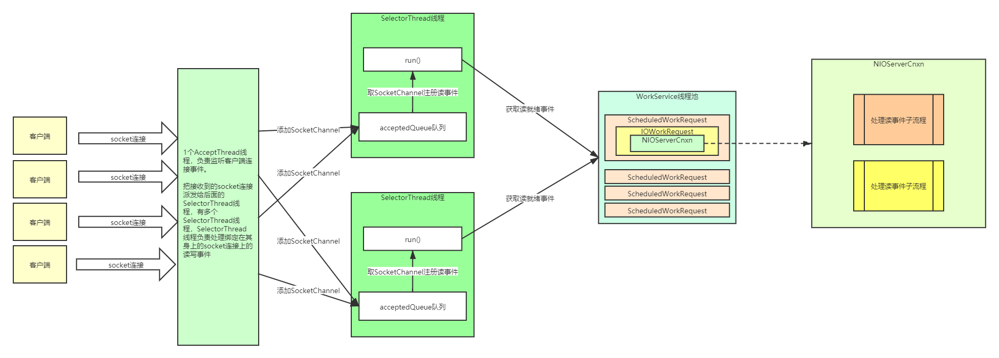
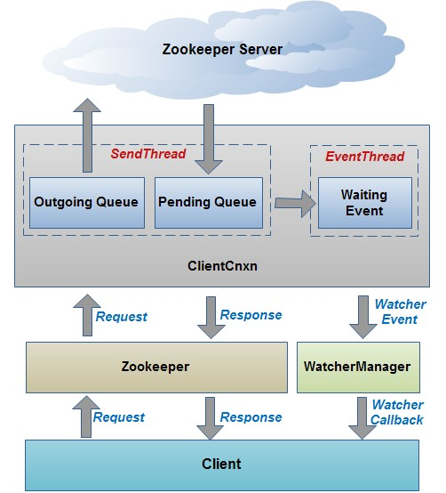
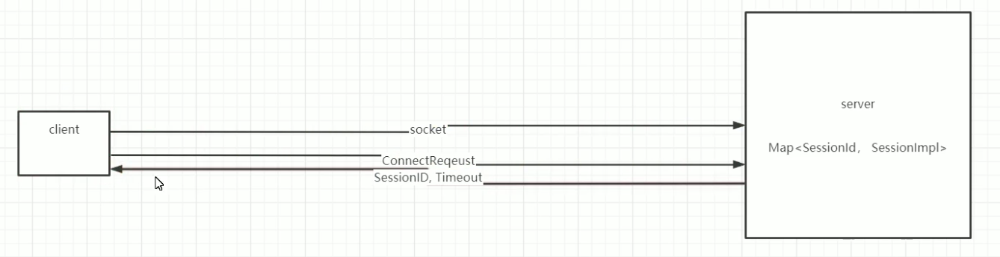

[TOC]

# Zookeeper单机模式请求处理流程源码解析

## 问题引入

1. 客户端架构
2. 服务端架构
3. 客户端发送与接收数据流程
4. 服务端处理命令流程
5. Session跟踪机制
6. Wathcer注册与触发机制

## 服务端源码运行流程

### ZKDatabase 对象 & DataTree 对象

服务端要接收客户端命令并更新维持 DataTree

1. 先持久化命令：request--->记录日志
2. 然后更新DataTree--->快照

工具类：`FileTxnSnapLog`

### 启动流程

启动类：org.apache.zookeeper.server.quorum.QuorumPeerMain


1. 创建服务器统计器ServerStats。ServerStats是Zookeeper服务器运行时的统计器。
2. 创建Zookeeper数据管理器FileTxnSnapLog。FileTxnSnapLog是Zookeeper上层服务器和底层数据存储之间的对接层，提供了一系列操作数据文件的接口，如事务日志文件和快照数据文件。Zookeeper根据zoo.cfg文件中解析出的快照数据目录dataDir和事务日志目录dataLogDir来创建FileTxnSnapLog。
3. 设置服务器tickTime和会话超时时间限制。
4. 创建ServerCnxnFactory。通过配置系统属性zookeper.serverCnxnFactory来指定使用Zookeeper自己实现的NIO还是使用Netty框架作为Zookeeper服务端网络连接工厂。
5. 初始化ServerCnxnFactory。Zookeeper会初始化Thread作为ServerCnxnFactory的主线程，然后再初始化NIO服务器。
6. 启动ServerCnxnFactory主线程。进入Thread的run方法，此时服务端还不能处理客户端请求。
7. 恢复本地数据。启动时，需要从本地快照数据文件和事务日志文件进行数据恢复。
8. 创建并启动会话管理器。Zookeeper会创建会话管理器SessionTracker进行会话管理。
9. 初始化Zookeeper的请求处理链。Zookeeper请求处理方式为责任链模式的实现。会有多个请求处理器依次处理一个客户端请求，在服务器启动时，会将这些请求处理器串联成一个请求处理链。
10. 注册JMX服务。Zookeeper会将服务器运行时的一些信息以JMX的方式暴露给外部。
11. 注册Zookeeper服务器实例。将Zookeeper服务器实例注册给ServerCnxnFactory，之后Zookeeper就可以对外提供服务。

至此，单机版的Zookeeper服务器启动完毕。



adminServer:

* http://localhost:8080/commands

* http://localhost:8080/commands/stats

```java
{
  "version" : "3.6.1---1, built on 09/26/2020 05:13 GMT",
  "read_only" : false,
  "server_stats" : {
    "packets_sent" : 0,
    "packets_received" : 0,
    "fsync_threshold_exceed_count" : 0,
    "client_response_stats" : {
      "last_buffer_size" : -1,
      "min_buffer_size" : -1,
      "max_buffer_size" : -1
    },
    "data_dir_size" : 457,
    "log_dir_size" : 457,
    "last_processed_zxid" : 0,
    "outstanding_requests" : 0,
    "server_state" : "standalone",
    "avg_latency" : 0.0,
    "max_latency" : 0,
    "min_latency" : 0,
    "num_alive_client_connections" : 0,
    "provider_null" : false,
    "uptime" : 77388
  },
  "client_response" : {
    "last_buffer_size" : -1,
    "min_buffer_size" : -1,
    "max_buffer_size" : -1
  },
  "node_count" : 5,
  "connections" : [ ],
  "secure_connections" : [ ],
  "command" : "stats",
  "error" : null
}
```

* http://localhost:8080/commands/connections

```java
{
  "connections" : [ ],
  "secure_connections" : [ ],
  "command" : "connections",
  "error" : null
}
```

#### `ServerCnxn`绑定端口并监听客户端请求

```java
boolean needStartZKServer = true;
if (config.getClientPortAddress() != null) {
    // 连接的上下文（ServerCnxn），默认获取到NIOServerCnxnFactory
    cnxnFactory = ServerCnxnFactory.createFactory();
    // ServerSocketChannel bind地址和端口，设置最大客户端连接限制数
    cnxnFactory.configure(config.getClientPortAddress(), config.getMaxClientCnxns(), config.getClientPortListenBacklog(), false);
    // 启动
    cnxnFactory.startup(zkServer);
    // zkServer has been started. So we don't need to start it again in secureCnxnFactory.
    needStartZKServer = false;
}
```

* NIOServerCnxnFactory.startup

```java
// 接收客户端请求
@Override
public void startup(ZooKeeperServer zks, boolean startServer) throws IOException, InterruptedException {
    // 1. 初始化workerService，线程池
    // 2. 启动SelectThread, 负责接收读写就绪事件
    // 3. 启动AcceptThread, 负责接收连接事件
    start();
    setZooKeeperServer(zks);
    if (startServer) {
        // 初始化ZKDatabase, 加载数据
        // 还会把之前的session给加载出来，放入到sessionWithTimeouts中
        zks.startdata();

        // 1. 创建sessionTracker
        // 2. 初始化RequestProcessor Chain,请求处理链:Prep -> Sync -> Final
        // 3. 创建requestThrottler
        // 4. 注册jmx
        // 5. 修改为RUNNING状态
        // 6. notifyAll()
        zks.startup();
    }
}
```


#### 服务端的 RequestProcessor 处理链

##### PrepRequestProcessor

通常是一个Requestprocessor Chain中的第一个Processor，用来预处理请求。主要包括：

1. 检查ACL，如果不匹配ACL，则直接结束对该请求的处理
2. 生成并记录ChangeRecord
3. 设置持久化txn
4. 调用下一个RequestProcessor

##### SyncRequestProcessor

SyncReqeustProcessor负责对某个请求进行持久化，但是它又不仅仅只对Request进行持久化，还会打快照（对DataTree进行持久化）

##### FinalRequestProcessor

FinalRequestProcessor所做的事情比较清晰：

1. 更新DataTree
2. 触发Watch
3. 返回Response

## 客户端(Zookeeper)启动

客户端核心如下

1. Zookeeper实例：客户端入口

通过调用Zookeeper构造方法生成客户端实例。

2. ClientWatchManager：客户端Watcher管理器

3. HostProvider：客户端地址列表管理器。

4. ClientCnxn：客户端核心线程。内部又包含2个线程，SendThread和EventThread。SendThread是一个IO线程，主要负责Zookeeper客户端与服务端的网络通信；EventThread是一个事件线程，主要负责对服务端事件进行处理。

### 执行流程

* ZooKeeper对象的构造方法

```java
public ZooKeeper(
    String connectString,
    int sessionTimeout,
    Watcher watcher,
    boolean canBeReadOnly,
    HostProvider aHostProvider,
    ZKClientConfig clientConfig) throws IOException {
    LOG.info(
        "Initiating client connection, connectString={} sessionTimeout={} watcher={}",
        connectString,
        sessionTimeout,
        watcher);

    if (clientConfig == null) {
        clientConfig = new ZKClientConfig();
    }
    this.clientConfig = clientConfig;
    watchManager = defaultWatchManager();
    watchManager.defaultWatcher = watcher;
    ConnectStringParser connectStringParser = new ConnectStringParser(connectString);
    hostProvider = aHostProvider;

    cnxn = createConnection(
        connectStringParser.getChrootPath(),
        hostProvider,
        sessionTimeout,
        this,
        watchManager,
        getClientCnxnSocket(),
        canBeReadOnly);
    cnxn.start();
}
```

* 架构图



* 执行流程图


#### ClientCnxn 的 SendThread

主要功能如下：

1. 负责建立socket连接
2. 负责从outgoingQueue中获取命令数据发送给服务端
    * a. ping命令
    * b. CRUD命令
    * c. auth命令
3. 负责读取服务端响应数据
    * a. ping的结果
    * b. auth结果
    * c. 通知
    * ⅰ. 监听器事件：添加到waitingEvents队列中。
    * d. 设置数据包Packet的响应信息
    * e. 注册监听器
    * f. 如果是异步调用，则把Packet添加到waitingEvents队列中。
    * g. 如果是同步调用，则notifyAll

#### ClientCnxn 的 EventThread

主要功能如下：

1. 从waitingEvents队列中获取数据
    * a. 执行监听器事件
    * b. 执行Packet的异步调用
    * c. 执行eventOfDeath事件：关闭EventThread线程（执行quit命令是会向waitingEvents队列中添加该事件）

#### zk客户端重连逻辑

Zookeeper对象，表示一个Zookeeper客户端; zookeeper是客户端给服务端发送心跳

当服务端挂掉后，Zookeeper对象并没有消失，会不断的进行重连，socket连接建立好了之后，会先发送一个ConnectRequest对象，该对象包括：

1. 当前Zookeeper对象，最近一次接受到的响应中的zxid（第一次连接时为0）
2. 当前Zookeeper对象中存的sessionId（第一次连接时为0）

服务端侧，服务端重启时，会从快照和日志记录中进行重放，其中就包括session的重新创建，所以一个session不是被正常关闭的，那么服务器重启时能恢复session，包括临时节点也是一样的，服务端重启后，如果接收到一个ConnectRequest对象，发现其sessionId不为空，那么还会去touchSession，更新session的过期时间，这样就保证了服务器重启后，临时节点所对应的session只要还没有超过过期时间，临时节点依然存在。

在Zookeeper对象内部有一个ZKWatchManager对象。

ZKWatchManager对象是用来管理客户端上的存在的Watches，在连接初始化时会判断当前客户端上是否存在Watches，如果存在会批量重新注册到服务端，这样也就保证了客户端所注册的watch在服务端重启后依然存在。

##### xid

```java
/* predefined xid's values recognized as special by the server */
// -1 means notification(WATCHER_EVENT)
public static final int NOTIFICATION_XID = -1;
// -2 is the xid for pings
public static final int PING_XID = -2;
// -4 is the xid for AuthPacket
public static final int AUTHPACKET_XID = -4;
// -8 is the xid for setWatch
public static final int SET_WATCHES_XID = -8;
```

## Watch机制，getData为例

1. 客户端注册Watcher到服务端;
2. 服务端发生数据变更;
3. 服务端通知客户端数据变更;
4. 客户端回调Watcher处理变更逻辑;

----

* 客户端Zookeeper对象有一个`ZKWatchManager`属性，用来管理所有的 watchers
* getData会构造一个`DataWatchRegistration`
* 在响应处理完成后，SendThread的finishPacket会注册watcher（客户端在此注册完成）

```java
/**
    * Return the data and the stat of the node of the given path.
    * <p>
    * If the watch is non-null and the call is successful (no exception is
    * thrown), a watch will be left on the node with the given path. The watch
    * will be triggered by a successful operation that sets data on the node, or
    * deletes the node.
    * <p>
    * A KeeperException with error code KeeperException.NoNode will be thrown
    * if no node with the given path exists.
    *
    * @param path the given path
    * @param watcher explicit watcher
    * @param stat the stat of the node
    * @return the data of the node
    * @throws KeeperException If the server signals an error with a non-zero error code
    * @throws InterruptedException If the server transaction is interrupted.
    * @throws IllegalArgumentException if an invalid path is specified
    */
public byte[] getData(final String path, Watcher watcher, Stat stat) throws KeeperException, InterruptedException {
    final String clientPath = path;
    PathUtils.validatePath(clientPath);

    // the watch contains the un-chroot path
    WatchRegistration wcb = null;
    if (watcher != null) {
        // dataWatches 的注册器
        wcb = new DataWatchRegistration(watcher, clientPath);
    }

    final String serverPath = prependChroot(clientPath);

    RequestHeader h = new RequestHeader();
    h.setType(ZooDefs.OpCode.getData);
    GetDataRequest request = new GetDataRequest();
    request.setPath(serverPath);
    request.setWatch(watcher != null);
    GetDataResponse response = new GetDataResponse();
    ReplyHeader r = cnxn.submitRequest(h, request, response, wcb);
    if (r.getErr() != 0) {
        throw KeeperException.create(KeeperException.Code.get(r.getErr()), clientPath);
    }
    if (stat != null) {
        DataTree.copyStat(response.getStat(), stat);
    }
    return response.getData();
}
```

### ZKWatchManager

```java
/**
    * Manage watchers and handle events generated by the ClientCnxn object.
    *
    * We are implementing this as a nested class of ZooKeeper so that
    * the public methods will not be exposed as part of the ZooKeeper client
    * API.
    */
static class ZKWatchManager implements ClientWatchManager {

    // 一次性的，用三个map分类，存储的东西是类似的
    // 只能通过: getData, getChildren, exsit 三个方法注册watcher
    private final Map<String, Set<Watcher>> dataWatches = new HashMap<String, Set<Watcher>>();
    private final Map<String, Set<Watcher>> existWatches = new HashMap<String, Set<Watcher>>();
    private final Map<String, Set<Watcher>> childWatches = new HashMap<String, Set<Watcher>>();
    // 一直有效的
    private final Map<String, Set<Watcher>> persistentWatches = new HashMap<String, Set<Watcher>>();
    private final Map<String, Set<Watcher>> persistentRecursiveWatches = new HashMap<String, Set<Watcher>>();
    private boolean disableAutoWatchReset;

    ZKWatchManager(boolean disableAutoWatchReset) {
        this.disableAutoWatchReset = disableAutoWatchReset;
    }

    protected volatile Watcher defaultWatcher;
```

* 在ClientCnnx进行submitRequest提交的时候，将`WatchRegistration`加入到`Packet`中

```java
public ReplyHeader submitRequest(
    RequestHeader h,
    Record request,
    Record response,
    WatchRegistration watchRegistration,
    WatchDeregistration watchDeregistration) throws InterruptedException {
    ReplyHeader r = new ReplyHeader();
    Packet packet = queuePacket(
        h,
        r,
        request,
        response,
        null,
        null,
        null,
        null,
        watchRegistration,
        watchDeregistration);
    synchronized (packet) {
        if (requestTimeout > 0) {
            // Wait for request completion with timeout
            waitForPacketFinish(r, packet);
        } else {
            // Wait for request completion infinitely
            while (!packet.finished) {
                packet.wait();
            }
        }
    }
    if (r.getErr() == Code.REQUESTTIMEOUT.intValue()) {
        sendThread.cleanAndNotifyState();
    }
    return r;
}
```

其中packet:`packet = new Packet(h, r, request, response, watchRegistration);`

在响应处理完成后，SendThread的`finishPacket`会注册watcher

```java
protected void finishPacket(Packet p) {
    int err = p.replyHeader.getErr();
    if (p.watchRegistration != null) {
        p.watchRegistration.register(err);
    }
    // Add all the removed watch events to the event queue, so that the
    // clients will be notified with 'Data/Child WatchRemoved' event type.
    if (p.watchDeregistration != null) {
        Map<EventType, Set<Watcher>> materializedWatchers = null;
        try {
            materializedWatchers = p.watchDeregistration.unregister(err);
            for (Entry<EventType, Set<Watcher>> entry : materializedWatchers.entrySet()) {
                Set<Watcher> watchers = entry.getValue();
                if (watchers.size() > 0) {
                    queueEvent(p.watchDeregistration.getClientPath(), err, watchers, entry.getKey());
                    // ignore connectionloss when removing from local
                    // session
                    p.replyHeader.setErr(Code.OK.intValue());
                }
            }
        } catch (KeeperException.NoWatcherException nwe) {
            p.replyHeader.setErr(nwe.code().intValue());
        } catch (KeeperException ke) {
            p.replyHeader.setErr(ke.code().intValue());
        }
    }

    if (p.cb == null) {
        synchronized (p) {
            p.finished = true;
            p.notifyAll();
        }
    } else {
        p.finished = true;
        eventThread.queuePacket(p);
    }
}
```

### 客户端，服务端watcher维护


#### 客户端注册watcher

对于getData就是将watcher加入到ZKWatchManager对象的`Map<String, Set<Watcher>> dataWatches`中

```java
/**
    * Register the watcher with the set of watches on path.
    * @param rc the result code of the operation that attempted to
    * add the watch on the path.
    */
public void register(int rc) {
    if (shouldAddWatch(rc)) {
        // 当前WathcerRegistration是什么类型就进入对应的getWatchers方法中
        // 把watcher注册到ZKWatcherManger中
        Map<String, Set<Watcher>> watches = getWatches(rc);
        synchronized (watches) {
            Set<Watcher> watchers = watches.get(clientPath);
            if (watchers == null) {
                watchers = new HashSet<Watcher>();
                watches.put(clientPath, watchers);
            }
            watchers.add(watcher);
        }
    }
}
```

#### 服务端注册watcher

GetDataRequest构造到时候会`request.setWatch(watcher != null);`

服务端处理请求的`org.apache.zookeeper.server.FinalRequestProcessor#handleGetDataRequest`中

```java
private Record handleGetDataRequest(Record request, ServerCnxn cnxn, List<Id> authInfo) throws KeeperException, IOException {
    GetDataRequest getDataRequest = (GetDataRequest) request;
    String path = getDataRequest.getPath();
    DataNode n = zks.getZKDatabase().getNode(path);
    if (n == null) {
        throw new KeeperException.NoNodeException();
    }
    zks.checkACL(cnxn, zks.getZKDatabase().aclForNode(n), ZooDefs.Perms.READ, authInfo, path, null);
    Stat stat = new Stat();
    // 如果watcher不是空，那么这里会给服务传递ServerCnxn
    byte[] b = zks.getZKDatabase().getData(path, stat, getDataRequest.getWatch() ? cnxn : null);
    return new GetDataResponse(b, stat);
}
```

服务端是不需要保存watcher的逻辑的，即不存储客户端new出来的watcher，存的是ServerCnxn(连接上下文)，即服务端会存储`Set<ServerCnxn>`,轮询然后给客户端发送事件，其中ServerCnxn 实现了 Watcher 接口

```java
public byte[] getData(String path, Stat stat, Watcher watcher) throws KeeperException.NoNodeException {
    DataNode n = nodes.get(path);
    byte[] data = null;
    if (n == null) {
        throw new KeeperException.NoNodeException();
    }
    synchronized (n) {
        n.copyStat(stat);
        if (watcher != null) {
            dataWatches.addWatch(path, watcher);
        }
        data = n.data;
    }
    updateReadStat(path, data == null ? 0 : data.length);
    return data;
}
```

服务端的DataTree结构中有WatchManager对象：`private IWatchManager dataWatches;`，getData方法中会把ServerCnnx加入到`dataWatches`中，所以服务端维持着`Map<Path, Set<ServerCnnx>>`的map结构，同时也有`MapMap<Watcher, Set<Path>>`的结构

### 触发watcher

* `org.apache.zookeeper.server.FinalRequestProcessor#processRequest`会处理请求`ProcessTxnResult rc = zks.processTxn(request);`

```java
 public ProcessTxnResult processTxn(Request request) {
        TxnHeader hdr = request.getHdr();
        processTxnForSessionEvents(request, hdr, request.getTxn());

        final boolean writeRequest = (hdr != null);
        final boolean quorumRequest = request.isQuorum();

        // return fast w/o synchronization when we get a read
        if (!writeRequest && !quorumRequest) {
            return new ProcessTxnResult();
        }
        synchronized (outstandingChanges) {
            // 根据txn去更新ZKDatabase，并触发watcher
            ProcessTxnResult rc = processTxnInDB(hdr, request.getTxn(), request.getTxnDigest());
```

* `org.apache.zookeeper.server.ZKDatabase#processTxn`

```java
/**
* the process txn on the data and perform digest comparision.
* @param hdr the txnheader for the txn
* @param txn the transaction that needs to be processed
* @param digest the expected digest. A null value would skip the check
* @return the result of processing the transaction on this
* datatree/zkdatabase
*/
public ProcessTxnResult processTxn(TxnHeader hdr, Record txn, TxnDigest digest) {
    return dataTree.processTxn(hdr, txn, digest);
}
```

* `org.apache.zookeeper.server.DataTree#processTxn`，修改数据触发`NodeDataChanged`事件

```java
public Stat setData(String path, byte[] data, int version, long zxid, long time) throws KeeperException.NoNodeException {
    Stat s = new Stat();
    DataNode n = nodes.get(path);
    if (n == null) {
        throw new KeeperException.NoNodeException();
    }
    byte[] lastdata = null;
    synchronized (n) {
        lastdata = n.data;
        nodes.preChange(path, n);
        n.data = data;
        n.stat.setMtime(time);
        n.stat.setMzxid(zxid);
        n.stat.setVersion(version);
        n.copyStat(s);
        nodes.postChange(path, n);
    }
    // now update if the path is in a quota subtree.
    String lastPrefix = getMaxPrefixWithQuota(path);
    long dataBytes = data == null ? 0 : data.length;
    if (lastPrefix != null) {
        this.updateCountBytes(lastPrefix, dataBytes - (lastdata == null ? 0 : lastdata.length), 0);
    }
    nodeDataSize.addAndGet(getNodeSize(path, data) - getNodeSize(path, lastdata));

    updateWriteStat(path, dataBytes);
    // 触发watcher
    dataWatches.triggerWatch(path, EventType.NodeDataChanged);
    return s;
}
```

#### triggerWatch

```java
@Override
public WatcherOrBitSet triggerWatch(String path, EventType type, WatcherOrBitSet supress) {
    // 事件构造，会发给客户端
    WatchedEvent e = new WatchedEvent(type, KeeperState.SyncConnected, path);
    Set<Watcher> watchers = new HashSet<>();
    PathParentIterator pathParentIterator = getPathParentIterator(path);
    synchronized (this) {
        for (String localPath : pathParentIterator.asIterable()) {
            // 根据路径从watchTable拿到set<Watcher>
            Set<Watcher> thisWatchers = watchTable.get(localPath);
            if (thisWatchers == null || thisWatchers.isEmpty()) {
                continue;
            }
            Iterator<Watcher> iterator = thisWatchers.iterator();
            while (iterator.hasNext()) {
                Watcher watcher = iterator.next();
                WatcherMode watcherMode = watcherModeManager.getWatcherMode(watcher, localPath);
                if (watcherMode.isRecursive()) {
                    if (type != EventType.NodeChildrenChanged) {
                        watchers.add(watcher);
                    }
                } else if (!pathParentIterator.atParentPath()) {
                    watchers.add(watcher);
                    if (!watcherMode.isPersistent()) {
                        iterator.remove();
                        Set<String> paths = watch2Paths.get(watcher);
                        if (paths != null) {
                            paths.remove(localPath);
                        }
                    }
                }
            }
            if (thisWatchers.isEmpty()) {
                watchTable.remove(localPath);
            }
        }
    }
    if (watchers.isEmpty()) {
        if (LOG.isTraceEnabled()) {
            ZooTrace.logTraceMessage(LOG, ZooTrace.EVENT_DELIVERY_TRACE_MASK, "No watchers for " + path);
        }
        return null;
    }

    for (Watcher w : watchers) {
        if (supress != null && supress.contains(w)) {
            continue;
        }
        // 执行事件，向客户端发送事件
        w.process(e);
    }

    switch (type) {
        case NodeCreated:
            ServerMetrics.getMetrics().NODE_CREATED_WATCHER.add(watchers.size());
            break;

        case NodeDeleted:
            ServerMetrics.getMetrics().NODE_DELETED_WATCHER.add(watchers.size());
            break;

        case NodeDataChanged:
            ServerMetrics.getMetrics().NODE_CHANGED_WATCHER.add(watchers.size());
            break;

        case NodeChildrenChanged:
            ServerMetrics.getMetrics().NODE_CHILDREN_WATCHER.add(watchers.size());
            break;
        default:
            // Other types not logged.
            break;
    }

    return new WatcherOrBitSet(watchers);
}
```

具体是`org.apache.zookeeper.server.NIOServerCnxn#process`，发送给客户端

```java
/*
    * (non-Javadoc)
    *
    * @see org.apache.zookeeper.server.ServerCnxnIface#process(org.apache.zookeeper.proto.WatcherEvent)
    */
@Override
public void process(WatchedEvent event) {
    ReplyHeader h = new ReplyHeader(ClientCnxn.NOTIFICATION_XID, -1L, 0);
    if (LOG.isTraceEnabled()) {
        ZooTrace.logTraceMessage(
            LOG,
            ZooTrace.EVENT_DELIVERY_TRACE_MASK,
            "Deliver event " + event + " to 0x" + Long.toHexString(this.sessionId) + " through " + this);
    }

    // Convert WatchedEvent to a type that can be sent over the wire
    WatcherEvent e = event.getWrapper();

    // The last parameter OpCode here is used to select the response cache.
    // Passing OpCode.error (with a value of -1) means we don't care, as we don't need
    // response cache on delivering watcher events.
    sendResponse(h, e, "notification", null, null, ZooDefs.OpCode.error);
}
```

发送给客户端的内容包括：`path`, `type`, `KeeperState.SyncConnected`

### 客户端处理`NOTIFICATION_XID`事件

* SendThread 加入事件到队列中

```java
class SendThread extends ZooKeeperThread {

    private long lastPingSentNs;
    private final ClientCnxnSocket clientCnxnSocket;
    private Random r = new Random();
    private boolean isFirstConnect = true;

    void readResponse(ByteBuffer incomingBuffer) throws IOException {
        ByteBufferInputStream bbis = new ByteBufferInputStream(incomingBuffer);
        BinaryInputArchive bbia = BinaryInputArchive.getArchive(bbis);
        ReplyHeader replyHdr = new ReplyHeader();

        replyHdr.deserialize(bbia, "header");
        switch (replyHdr.getXid()) {
        case PING_XID:
            LOG.debug("Got ping response for session id: 0x{} after {}ms.",
                Long.toHexString(sessionId),
                ((System.nanoTime() - lastPingSentNs) / 1000000));
            return;
            case AUTHPACKET_XID:
            LOG.debug("Got auth session id: 0x{}", Long.toHexString(sessionId));
            if (replyHdr.getErr() == KeeperException.Code.AUTHFAILED.intValue()) {
                state = States.AUTH_FAILED;
                eventThread.queueEvent(new WatchedEvent(Watcher.Event.EventType.None,
                    Watcher.Event.KeeperState.AuthFailed, null));
                eventThread.queueEventOfDeath();
            }
            return;
        case NOTIFICATION_XID:
            // 服务端发送过来的是watcher事件
            LOG.debug("Got notification session id: 0x{}",
                Long.toHexString(sessionId));
            WatcherEvent event = new WatcherEvent();
            event.deserialize(bbia, "response");

            // convert from a server path to a client path
            if (chrootPath != null) {
                String serverPath = event.getPath();
                if (serverPath.compareTo(chrootPath) == 0) {
                    event.setPath("/");
                } else if (serverPath.length() > chrootPath.length()) {
                    event.setPath(serverPath.substring(chrootPath.length()));
                    } else {
                        LOG.warn("Got server path {} which is too short for chroot path {}.",
                            event.getPath(), chrootPath);
                    }
            }

            WatchedEvent we = new WatchedEvent(event);
            LOG.debug("Got {} for session id 0x{}", we, Long.toHexString(sessionId));
            // 收到并构造WatchedEvent，把事件加到队列中，异步触发
            eventThread.queueEvent(we);
            return;
        default:
            break;
        }
```

```java
 private void queueEvent(WatchedEvent event, Set<Watcher> materializedWatchers) {
    if (event.getType() == EventType.None && sessionState == event.getState()) {
        return;
    }
    sessionState = event.getState();
    final Set<Watcher> watchers;
    if (materializedWatchers == null) {
        // 找到对应事件的watcher
        // materialize the watchers based on the event
        watchers = watcher.materialize(event.getState(), event.getType(), event.getPath());
    } else {
        watchers = new HashSet<Watcher>();
        watchers.addAll(materializedWatchers);
    }
    WatcherSetEventPair pair = new WatcherSetEventPair(watchers, event);
    // queue the pair (watch set & event) for later processing
    // 事件处理加入到waitingEvents
    waitingEvents.add(pair);
}
```

* EventThread 取出事件并处理

```java
 @Override
@SuppressFBWarnings("JLM_JSR166_UTILCONCURRENT_MONITORENTER")
public void run() {
    try {
        isRunning = true;
        while (true) {
            Object event = waitingEvents.take();
            if (event == eventOfDeath) {
                wasKilled = true;
            } else {
                processEvent(event);
            }
            if (wasKilled) {
                synchronized (waitingEvents) {
                    if (waitingEvents.isEmpty()) {
                        isRunning = false;
                        break;
                    }
                }
            }
        }
    } catch (InterruptedException e) {
        LOG.error("Event thread exiting due to interruption", e);
    }

    LOG.info("EventThread shut down for session: 0x{}", Long.toHexString(getSessionId()));
}
```

### 回顾 Watcher 机制的一些特性（老版本，新版有持久化）

* 一次性（老版本实现上：事件处理后，客户端，服务端将Map中注册的watcher都remove掉了）

无论是服务端还是客户端，一旦一个 Watcher 被触发，ZooKeeper 都会将其从相应的存储中移除。因此，在 Watcher 的使用上，需要反复注册。这样的设计有效地减轻了服务端的压力。

* 客户端串行执行（`LinkedBlockingQueue<Object> waitingEvents`事件队列）

客户端 Watcher 回调的过程是一个串行同步的过程，这为我们保证了顺序，同时，需要注意的一点是，一定不能因为一个 Watcher 的处理逻辑影响了整个客户端的 Watcher 回调，所以，我觉得客户端 Watcher 的实现类要另开一个线程进行处理业务逻辑，以便给其他的 Watcher 调用让出时间。

* 轻量（事件内容只有：`path`, `type`, `KeeperState.SyncConnected`）

WatcherEvent 是 ZooKeeper 整个 Watcher 通知机制的最小通知单元，这个数据结构中只包含三部分内容：`通知状态`、`事件类型`和`节点路径`。也就是说，Watcher 通知非常简单，只会告诉客户端发生了事件，而不会说明事件的具体内容。例如针对 NodeDataChanged 事件，ZooKeeper 的Watcher 只会通知客户端指定数据节点的数据内容发生了变更，而对于原始数据以及变更后的新数据都无法从这个事件中直接获取到，而是需要客户端主动重新去获取数据——这也是 ZooKeeper 的 Watcher 机制的一个非常重要的特性。

### 新版本：AddWatchMode.PERSISTENT(持久化，不区分类型的watcher)

```java
/**
    * Add a watch to the given znode using the given mode. Note: not all
    * watch types can be set with this method. Only the modes available
    * in {@link AddWatchMode} can be set with this method.
    *
    * @param basePath the path that the watcher applies to
    * @param watcher the watcher
    * @param mode type of watcher to add
    * @throws InterruptedException If the server transaction is interrupted.
    * @throws KeeperException If the server signals an error with a non-zero
    *  error code.
    * @since 3.6.0
    */
public void addWatch(String basePath, Watcher watcher, AddWatchMode mode)
        throws KeeperException, InterruptedException {
    PathUtils.validatePath(basePath);
    String serverPath = prependChroot(basePath);

    RequestHeader h = new RequestHeader();
    h.setType(ZooDefs.OpCode.addWatch);
    // 构造 AddWatchRequest
    AddWatchRequest request = new AddWatchRequest(serverPath, mode.getMode());
    // 发送请求，构造 AddWatchRegistration
    ReplyHeader r = cnxn.submitRequest(h, request, new ErrorResponse(),
            new AddWatchRegistration(watcher, basePath, mode));
    if (r.getErr() != 0) {
        throw KeeperException.create(KeeperException.Code.get(r.getErr()),
                basePath);
    }
}
```

* 服务端addWatch方法不区分类型，直接加入维持的Map中

```java
public void addWatch(String basePath, Watcher watcher, int mode) {
    WatcherMode watcherMode = WatcherMode.fromZooDef(mode);
    dataWatches.addWatch(basePath, watcher, watcherMode);
    childWatches.addWatch(basePath, watcher, watcherMode);
}
```

* SendThread 客户端找到事件要执行的watcher

`org.apache.zookeeper.ZooKeeper.ZKWatchManager#materialize`会发现客户端各种事件种都执行的是`addPersistentWatches(clientPath, result);`，不会从`ZkWatcherManager`对象的`persistentWatches`map中删除

```java
private void addPersistentWatches(String clientPath, Set<Watcher> result) {
    synchronized (persistentWatches) {
        addTo(persistentWatches.get(clientPath), result);
    }
    synchronized (persistentRecursiveWatches) {
        for (String path : PathParentIterator.forAll(clientPath).asIterable()) {
            addTo(persistentRecursiveWatches.get(path), result);
        }
    }
}
```

### Event.None（为什么要有None事件）

客户端与服务端建立socket连接后，发送ClientRequest给服务端，连接事件回调(`org.apache.zookeeper.ClientCnxn.SendThread#onConnected`)后，客户端连接后自己发送事件给自己

```java
/**
    * Callback invoked by the ClientCnxnSocket once a connection has been
    * established.
    *
    * @param _negotiatedSessionTimeout
    * @param _sessionId
    * @param _sessionPasswd
    * @param isRO
    * @throws IOException
    */
void onConnected(
    int _negotiatedSessionTimeout,
    long _sessionId,
    byte[] _sessionPasswd,
    boolean isRO) throws IOException {
    // 服务端返回端timeout
    negotiatedSessionTimeout = _negotiatedSessionTimeout;
    // 如果小于0，可能服务端不想接收这个连接，那么这个连接要关闭
    if (negotiatedSessionTimeout <= 0) {
        state = States.CLOSED;
        // 发送 EventType.None 事件，类型是 KeeperState.Expired
        eventThread.queueEvent(new WatchedEvent(Watcher.Event.EventType.None, Watcher.Event.KeeperState.Expired, null));
        eventThread.queueEventOfDeath();

        String warnInfo = String.format(
            "Unable to reconnect to ZooKeeper service, session 0x%s has expired",
            Long.toHexString(sessionId));
        LOG.warn(warnInfo);
        throw new SessionExpiredException(warnInfo);
    }

    if (!readOnly && isRO) {
        LOG.error("Read/write client got connected to read-only server");
    }

    readTimeout = negotiatedSessionTimeout * 2 / 3;
    connectTimeout = negotiatedSessionTimeout / hostProvider.size();
    hostProvider.onConnected();
    sessionId = _sessionId;
    sessionPasswd = _sessionPasswd;
    state = (isRO) ? States.CONNECTEDREADONLY : States.CONNECTED;
    seenRwServerBefore |= !isRO;
    LOG.info(
        "Session establishment complete on server {}, session id = 0x{}, negotiated timeout = {}{}",
        clientCnxnSocket.getRemoteSocketAddress(),
        Long.toHexString(sessionId),
        negotiatedSessionTimeout,
        (isRO ? " (READ-ONLY mode)" : ""));
    // 发送 EventType.None 事件，类型是 KeeperState.ConnectedReadOnly 或 KeeperState.SyncConnected
    KeeperState eventState = (isRO) ? KeeperState.ConnectedReadOnly : KeeperState.SyncConnected;
    eventThread.queueEvent(new WatchedEvent(Watcher.Event.EventType.None, eventState, null));
}
```

## Session 机制

### Session的创建（连接初始化）

客户端和服务端Socket连接建立成功后，客户端会向服务端发送一个`ConnectRequest`请求，服务端接收到ConnectRequest请求后，会创建`SessionImpl`对象，并且把SessionImpl对象放入sessionsById中（`sessionById`是一个Map），并且会把Session的过期时间更新到sessionExpiryQueue中，然后会在服务端内部构造一个OpCode.createSession的Request，该Request会依次经过`PrepRequestProcessor`、`SyncRequestProcessor`、`FinalRequestProcessor`。

1. 在PrepRequestProcessor中设置Reqeust的txn
2. 在SyncRequestProcessor对txn进行持久化（创建session的操作会持久化）
3. 在FinalRequestProcessor会对Session进行提交，其实就是把Session的ID和Timeout存到sessionsWithTimeout中去

```java
public static class SessionImpl implements Session {

    SessionImpl(long sessionId, int timeout) {
        this.sessionId = sessionId;
        this.timeout = timeout;
        isClosing = false;
    }

    final long sessionId;
    final int timeout;
    boolean isClosing;

    Object owner;

    public long getSessionId() {
        return sessionId;
    }
    public int getTimeout() {
        return timeout;
    }
    public boolean isClosing() {
        return isClosing;
    }

    public String toString() {
        return "0x" + Long.toHexString(sessionId);
    }

}
```



* `org.apache.zookeeper.server.ZooKeeperServer#processConnectRequest`服务端处理请求时，一个新连接sessionId是0，会创建一个session

```java
// 协商 sessionTimeout
int sessionTimeout = connReq.getTimeOut();
byte[] passwd = connReq.getPasswd();
int minSessionTimeout = getMinSessionTimeout();
if (sessionTimeout < minSessionTimeout) {
    sessionTimeout = minSessionTimeout;
}
int maxSessionTimeout = getMaxSessionTimeout();
if (sessionTimeout > maxSessionTimeout) {
    sessionTimeout = maxSessionTimeout;
}
cnxn.setSessionTimeout(sessionTimeout);
// 未连接前禁止数据包发送交流
// We don't want to receive any packets until we are sure that the
// session is setup
cnxn.disableRecv();
// session 处理
if (sessionId == 0) {
    long id = createSession(cnxn, passwd, sessionTimeout);
    LOG.debug(
        "Client attempting to establish new session: session = 0x{}, zxid = 0x{}, timeout = {}, address = {}",
        Long.toHexString(id),
        Long.toHexString(connReq.getLastZxidSeen()),
        connReq.getTimeOut(),
        cnxn.getRemoteSocketAddress());
} else {
    long clientSessionId = connReq.getSessionId();
        LOG.debug(
            "Client attempting to renew session: session = 0x{}, zxid = 0x{}, timeout = {}, address = {}",
            Long.toHexString(clientSessionId),
            Long.toHexString(connReq.getLastZxidSeen()),
            connReq.getTimeOut(),
            cnxn.getRemoteSocketAddress());
    if (serverCnxnFactory != null) {
        serverCnxnFactory.closeSession(sessionId, ServerCnxn.DisconnectReason.CLIENT_RECONNECT);
    }
    if (secureServerCnxnFactory != null) {
        secureServerCnxnFactory.closeSession(sessionId, ServerCnxn.DisconnectReason.CLIENT_RECONNECT);
    }
    cnxn.setSessionId(sessionId);
    reopenSession(cnxn, sessionId, passwd, sessionTimeout);
    ServerMetrics.getMetrics().CONNECTION_REVALIDATE_COUNT.add(1);

}
```

* 真正创建session

```java
long createSession(ServerCnxn cnxn, byte[] passwd, int timeout) {
    if (passwd == null) {
        // Possible since it's just deserialized from a packet on the wire.
        passwd = new byte[0];
    }
    long sessionId = sessionTracker.createSession(timeout);
    Random r = new Random(sessionId ^ superSecret);
    r.nextBytes(passwd);
    ByteBuffer to = ByteBuffer.allocate(4);
    to.putInt(timeout);
    cnxn.setSessionId(sessionId);
    // 该Request会依次经过PrepRequestProcessor、SyncRequestProcessor、FinalRequestProcessor
    Request si = new Request(cnxn, sessionId, 0, OpCode.createSession, to, null);
    submitRequest(si);
    return sessionId;
}
```

#### SessionTrackerImpl 的 AtomicLong 自增的sessionId

```java
private final AtomicLong nextSessionId = new AtomicLong();

public long createSession(int sessionTimeout) {
    long sessionId = nextSessionId.getAndIncrement();
    trackSession(sessionId, sessionTimeout);
    return sessionId;
}
```

初始sessionId，然后基于上面的方法进行自增

```java
/**
* serverId + 时间戳 + 毫秒自增
* Generates an initial sessionId. High order 1 byte is serverId, next
* 5 bytes are from timestamp, and low order 2 bytes are 0s.
* Use ">>> 8", not ">> 8" to make sure that the high order 1 byte is entirely up to the server Id(@see ZOOKEEPER-1622).
* @param id server Id
* @return the Session Id
*/
public static long initializeNextSessionId(long id) {
    long nextSid;
    nextSid = (Time.currentElapsedTime() << 24) >>> 8;
    nextSid = nextSid | (id << 56);
    if (nextSid == EphemeralType.CONTAINER_EPHEMERAL_OWNER) {
        ++nextSid;  // this is an unlikely edge case, but check it just in case
    }
    return nextSid;
}
```

#### SessionTracker 跟踪 session

* `org.apache.zookeeper.server.SessionTrackerImpl#run` 线程不断的轮询检查(sleep & tickTime)

```java
@Override
public void run() {
    try {
        while (running) {
            long waitTime = sessionExpiryQueue.getWaitTime();
            if (waitTime > 0) {
                Thread.sleep(waitTime);
                continue;
            }

            for (SessionImpl s : sessionExpiryQueue.poll()) {
                ServerMetrics.getMetrics().STALE_SESSIONS_EXPIRED.add(1);
                setSessionClosing(s.sessionId);
                expirer.expire(s);
            }
        }
    } catch (InterruptedException e) {
        handleException(this.getName(), e);
    }
    LOG.info("SessionTrackerImpl exited loop!");
}

/**
* @return milliseconds until next expiration time, or 0 if has already past
*/
public long getWaitTime() {
    long now = Time.currentElapsedTime();
    long expirationTime = nextExpirationTime.get();
    return now < expirationTime ? (expirationTime - now) : 0L;
}
```

### Session的过期处理流程

SessionTrackerImpl是Session跟踪器的实现类，由它负责处理Session的过期时间刷新和对过期的Session进行处理.

SessionTrackerImpl是一个线程，该线程会每隔一个tickTime就去检查一下有没有Session已经过期，如果过期了，则对
Session进行过期处理，构造一个closeSession的Request，交给服务端进行处理。

### Session的刷新流程（服务端只要接收到客户端发来的请求就刷新）

服务端每接收到一个请求（包括增删查改和Ping请求），都会对sessionExpiryQueue中的Session的过期时间进行刷新。

刷新过程中有一个时间轮的思想，比如sessionA的过期时间是30秒，当前时间是`2020.5.10 05.10.13`，那么正常情况下，到`2020.5.10 05.10.43`的时候，该sessionA就要过期，但是在ZooKeeper中不是这样的，当tickTime为2秒时，sessionA的过期时间点为`2020.5.10 05.10.44`。

### Session的关闭流程（Session过期，临时节点删除）

对应的操作是closeSession，也会进行持久化，同时FinalRequestProcessor在执行closeSession请求时，会删除临时节点，并且把session从sessionsById、sessionsWithTimeout、sessionExpiryQueue移除掉。

### Session的恢复流程

服务端在打快照时，在持久化DataTree的同时会把sessionsWithTimeout也进行持久化，如下

```java
txnLogFactory.save(zkDb.getDataTree(), zkDb.getSessionWithTimeOuts(), syncSnap);
```
