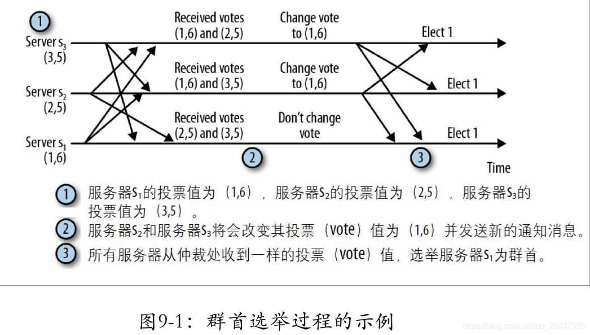
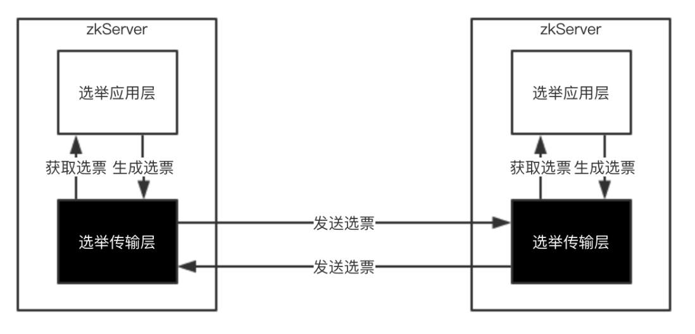
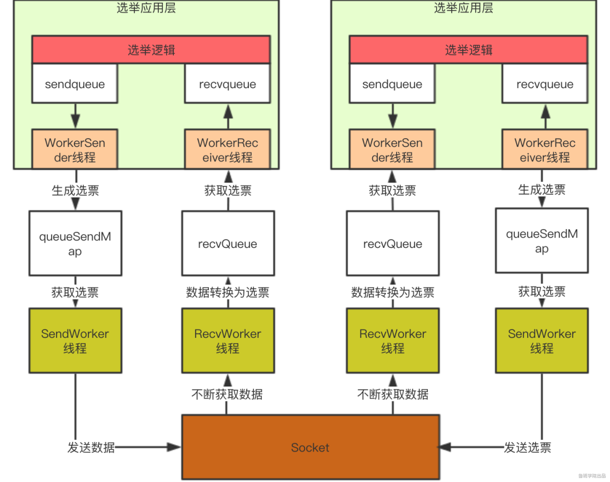
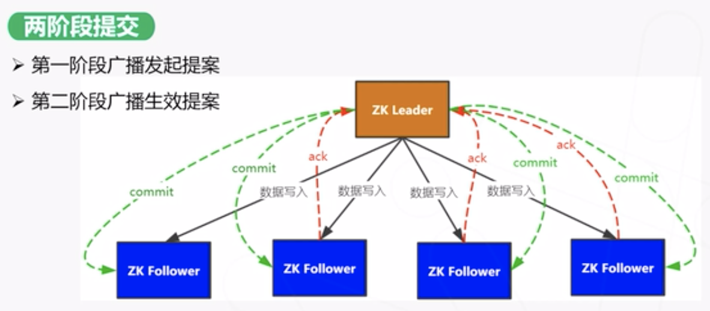
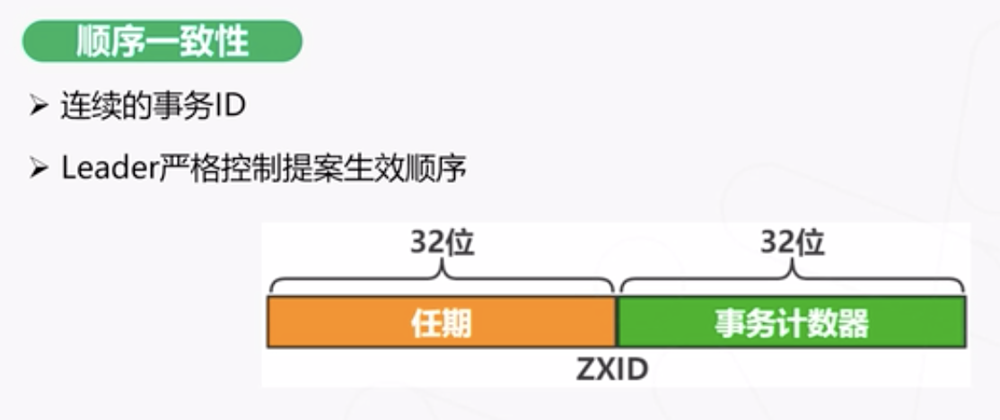
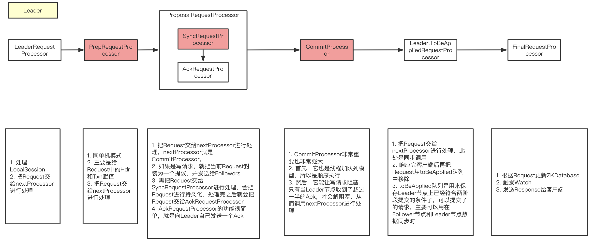
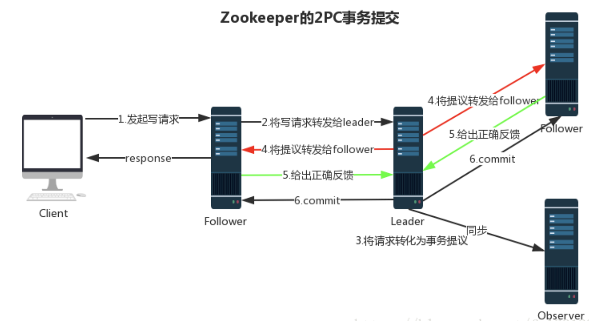

[TOC]

# Zookeeper集群机制

## zookeeper保证最终一致性，尽量保证弱一致性

## 群首选举

**群首**为集群中的服务器选择出来的一个服务器，并会一直被集群所认可。设置群首的目的是为了对客户端所发起的ZooKeeper状态变更请求进行排序，包括：create、setData和delete操作。群首将每一个请求转换为一个事务，将这些事务发送给追随者，确保集群按照群首确定的顺序接受并处理这些事务。

* 每个服务器启动后进入`LOOKING`状态，开始选举一个新的群首或查找已经存在的群首，如果群首已经存在，其它服务器就会通知这个新启动的服务器，告知哪个服务器是群首，与此同时，新的服务器会与群首建立连接，以确保自己的状态与群首一致。

* 如果集群中所有的服务器均处于`LOOKING`状态，这些服务器之间就会进行通信来选举一个群首，通过信息交换对群首选举达成共识的选择。在本次选举过程中胜出的服务器将进入`LEADING`状态，而集群中的其它服务器将会进入`FOLLOWING`状态。

当一个服务器进入LOOKING状态，就会发送向集群中每个服务器发送一个通知消息，如下

```java
投票<服务器标识，最近执行的事务的zxid信息>

（vote<sid, zxid>）
```




### zk节点类型

一个ZK节点可能处于以下4种状态之一，在源码中以QuorumPeer#ServerState枚举来定义

* LOOKING：不确定Leader的"寻找"状态，即当前节点认为集群中没有Leader，进而发起选举；
* LEADING："领导"状态，即当前节点就是Leader，并维护与Follower和Observer的通信；
* FOLLOWING："跟随"状态，即当前节点是Follower，且正在保持与Leader的通信；
* OBSERVING："观察"状态，即当前节点是Observer，且正在保持与Leader的通信，但是不参与Leader选举。

只要当前服务器处于LOOKING状态，就会循环执行收取其它选票、更新并广播自己的选票、计算投票结果的操作，直到可以确定Leader为止

#### zk 观察者

观察者要同步leader状态，但不参与投票，它只监听投票的结果；除了这个简单的区别，观察者精确的和flower一样运行：客户端可能连接它们并发送读取和写入请求。观察者像flower一样转发这些请求到leader，而它们只是简单的等待监听投票的结果。

1. 引入观察者的一个主要原因是提高读请求的可扩展性。通过加入多个观察者，我们可以在不牺牲写操作的吞吐率的前提下服务更多的读操作。写操作的吞吐率取决于仲裁数量的大小。如果我们加入更多的参与投票的服务器，我们将需要更大的仲裁数量，而这将减少写操作的吞吐率。增加观察者也不是完全没有开销的。每一个新加入的观察者将对应 于每一个已提交事务点引入的一条额外消息。然而，这个开销相对于增 加参与投票的服务器来说小很多。

2. 采用观察者的另外一个原因是进行跨多个数据中心的部署。由于数据中心之间的网络链接延时，将服务器分散于多个数据中心将明显地降 低系统的速度。引入观察者后，更新请求能够先以高吞吐率和低延迟的 方式在一个数据中心内执行，接下来再传播到异地的其他数据中心得到 执行。值得注意的是，观察者并不能消除数据中心之间的网络消息，因为观察者必须转发更新请求给群首并且处理INFORM消息。不同的是，当参与的服务器处于同一个数据中心时，观察者保证提交更新必需的消 息在数据中心内部得到交换。

但是注意，引入观察者，从性能角度来看是好的。但是如果从集群高可用的角度来看，要慎用。(5台机器,2个观察者,1个follow挂掉,此时不满足过半统一机制,选不出leader,集群无法启动)；此外再注意，比如3台机器，把两台配置成观察者，这么做是不行的，因为不满足过半机制， 所以选不出leader，导致集群启动不了。

### 快速领导者选举源码

* ZooKeeperServer 表示单机模式中的一个zkServer
* QuoruPeer 表示集群模式中的一个zkServer (`org.apache.zookeeper.server.quorum.QuorumPeerMain#main`)

```java
protected void initializeAndRun(String[] args) throws ConfigException, IOException, AdminServerException {
    QuorumPeerConfig config = new QuorumPeerConfig();
    if (args.length == 1) {
        config.parse(args[0]);
    }

    // Start and schedule the the purge task
    DatadirCleanupManager purgeMgr = new DatadirCleanupManager(
        config.getDataDir(),
        config.getDataLogDir(),
        config.getSnapRetainCount(),
        config.getPurgeInterval());
        purgeMgr.start();

    if (args.length == 1 && config.isDistributed()) {
        // 集群模式运行
        runFromConfig(config);
    } else {
        LOG.warn("Either no config or no quorum defined in config, running in standalone mode");
        // there is only server in the quorum -- run as standalone
        ZooKeeperServerMain.main(args);
    }
}
```

<font color='red'>主要这里是先`quorumPeer.start();`，然后`quorumPeer.join();`，因为quorumPeer是一个线程，所以是start方法执行完后，开始自己的run方法进行主线程逻辑</font>

* 每个客户端启动的时候会执行`org.apache.zookeeper.server.quorum.QuorumPeer#start`

```java
 @Override
public synchronized void start() {
    if (!getView().containsKey(myid)) {
        throw new RuntimeException("My id " + myid + " not in the peer list");
    }
    // zkServer中有一个内存数据库对象ZKDatabase， zkServer在启动时需要将已被持久化的数据加载进内存中，也就是加载至ZKDatabase。
    loadDataBase();
    // 这一步会开启一个线程来接收客户端请求，但是需要注意，这一步执行完后虽然成功开启了一个线程，并且也可以接收客户端线程，但是因为现在zkServer还没有经过初始化，实际上把请求拒绝掉，直到zkServer初始化完成才能正常的接收请求。
    startServerCnxnFactory();
    try {
        adminServer.start();
    } catch (AdminServerException e) {
        LOG.warn("Problem starting AdminServer", e);
        System.out.println(e);
    }
    // 初始化选举
    startLeaderElection();
    startJvmPauseMonitor();
    // 继续启动，包括进行领导者选举、zkServer初始化。
    super.start();
}
```

```java
public synchronized void startLeaderElection() {
    try {
        if (getPeerState() == ServerState.LOOKING) {
            currentVote = new Vote(myid, getLastLoggedZxid(), getCurrentEpoch());
        }
    } catch (IOException e) {
        RuntimeException re = new RuntimeException(e.getMessage());
        re.setStackTrace(e.getStackTrace());
        throw re;
    }

    this.electionAlg = createElectionAlgorithm(electionType);
}

protected Election createElectionAlgorithm(int electionAlgorithm) {
    Election le = null;

    //TODO: use a factory rather than a switch
    switch (electionAlgorithm) {
    case 1:
        throw new UnsupportedOperationException("Election Algorithm 1 is not supported.");
    case 2:
        throw new UnsupportedOperationException("Election Algorithm 2 is not supported.");
    case 3:
        QuorumCnxManager qcm = createCnxnManager();
        QuorumCnxManager oldQcm = qcmRef.getAndSet(qcm);
        if (oldQcm != null) {
            LOG.warn("Clobbering already-set QuorumCnxManager (restarting leader election?)");
            oldQcm.halt();
        }
        QuorumCnxManager.Listener listener = qcm.listener;
        if (listener != null) {
            listener.start();
            // 默认使用 FastLeaderElection
            FastLeaderElection fle = new FastLeaderElection(this, qcm);
            fle.start();
            le = fle;
        } else {
            LOG.error("Null listener when initializing cnx manager");
        }
        break;
    default:
        assert false;
    }
    return le;
}
```



几种投票：应用层自己产生的；要发送给其它zkServer的；接收到其它zkServer发送过来的；都有相应的内存存储

* 传输层的每个zkServer需要发送选票信息给其他服务器，这些选票信息来至应用层，在传输层中将会按服务器id分组保存在queueSendMap中。
* 传输层的每个zkServer需要发送选票信息给其他服务器，SendWorker就是封装了Socket的发送器，而senderWorkerMap就是用来记录其他服务器id以及对应的SendWorker的。
* 传输层的每个zkServer将接收其他服务器发送的选票信息，这些选票会保存在recvQueue中，以提供给应用层使用。



#### QuorumPeer类的start方法总结

1. 加载持久化数据到内存
2. 初始化领导者选举策略
3. 初始化快速领导者选举传输层
4. 初始化快速领导者选举应用层
5. 开启主线程

主线程伪代码如下

```java
while (服务是否正在运行) {
	switch (当前服务器状态) {
		case LOOKING:
			// 领导者选举
            setCurrentVote(makeLEStrategy().lookForLeader());
            break;
		case OBSERVING:
			try {
            	// 初始化为观察者
            } catch (Exception e) {
            	LOG.warn("Unexpected exception",e );                        
            } finally {
                observer.shutdown();
                setPeerState(ServerState.LOOKING);
            }
            break;
		case FOLLOWING:
			try {
				// 初始化为跟随者
			} catch (Exception e) {
				LOG.warn("Unexpected exception",e);
			} finally {
				follower.shutdown();
				setPeerState(ServerState.LOOKING);
			}
			break;
		case LEADING:
			try {
				// 初始化为领导者
			} catch (Exception e) {
				LOG.warn("Unexpected exception",e);
			} finally {
				leader.shutdown("Forcing shutdown");
				setPeerState(ServerState.LOOKING);
			}
		break;
	}
}
```

其中当服务器状态为`LOOKING`时会进行领导者选举，执行`org.apache.zookeeper.server.quorum.FastLeaderElection#lookForLeader`;每次投票后，服务器都会统计投票数量，判断是否有某个节点得到半数以上的投票，如果存在这样的节点，该节点将会成为准Leader，状态变为Leader,而其它服务器的状态会变为Following。

1. 初始化一个投票箱

```java
HashMap<Long, Vote> recvset = new HashMap<Long, Vote>();
```

2. 更新选票，将票投给自己

```java
updateProposal(getInitId(), getInitLastLoggedZxid(), getPeerEpoch());
```

3. 发送选票

```java
sendNotifications();
```

4. 不断获取其他服务器的投票信息，直到选出Leader

```java
while ((self.getPeerState() == ServerState.LOOKING) && (!stop)){
    // 从recvqueue中获取接收到的投票信息
    Notification n = recvqueue.poll(notTimeout, TimeUnit.MILLISECONDS);

    if (获得的投票为空) {
        // 连接其他服务器
    } else {
        // 处理投票
    }
}
```

* 处理投票：判断接收到的投票所对应的服务器的状态，也就是投此票的服务器的状态，执行相应操作

```java
switch (n.state) {
    case LOOKING:
        // PK选票、过半机制验证等
        // PK选票
        if (接收到的投票的选举周期 > 本服务器当前的选举周期) {
            // 修改本服务器的选举周期为接收到的投票的选举周期
            // 清空本服务器的投票箱（表示选举周期落后，重新开始投票）
            // 比较接收到的选票所选择的服务器与本服务器的数据谁更新，本服务器将选票投给数据较新者
            // 发送选票
        } else if(接收到的投票的选举周期 < 本服务器当前的选举周期){
            // 接收到的投票的选举周期落后了，本服务器直接忽略此投票
        } else if(选举周期一致) {
            // 比较接收到的选票所选择的服务器与本服务器当前所选择的服务器的数据谁更新，本服务器将选票投给数据较新者
            // 发送选票
        }
        // 过半机制验证
        //本服务器的选票经过不停的PK会将票投给数据更新的服务器，PK完后，将接收到的选票以及本服务器自己所投的选票放入投票箱中，然后从投票箱中统计出与本服务器当前所投服务器一致的选票数量，判断该选票数量是否超过集群中所有跟随者的一半（选票数量 > 跟随者数量/2），如果满足这个过半机制就选出了一个准Leader。
        // 最终确认
        // 选出准Leader之后，再去获取其他服务器的选票，如果获取到的选票所代表的服务器的数据比准Leader更新，则准Leader卸职，继续选举。如果没有准Leader更新，则继续获取投票，直到没有获取到选票，则选出了最终的Leader。
        Leader确定后，其他服务器的角色也确定好了。
        break;
    case OBSERVING:
        // 观察者节点不应该发起投票，直接忽略
        break;
    case FOLLOWING:
    case LEADING:
        // 如果接收到跟随者或领导者节点的选票，则可以认为当前集群已经存在Leader了，直接return，退出lookForLeader方法。
}
```

### leader 选举完成之后的同步/初始化

`org.apache.zookeeper.server.quorum.Leader#lead`

1. 会先完成数据同步
2. 然后初始化服务，准备接收客户端请求，会启动RequestProcessor线程

* `org.apache.zookeeper.server.ZooKeeperServer#startup`

```java
public synchronized void startup() {
    if (sessionTracker == null) {
        createSessionTracker();
    }
    startSessionTracker();
    setupRequestProcessors();

    startRequestThrottler();

    registerJMX();

    startJvmPauseMonitor();

    registerMetrics();

    setState(State.RUNNING);

    requestPathMetricsCollector.start();

    localSessionEnabled = sessionTracker.isLocalSessionsEnabled();
    notifyAll();
}
```

## 2pc,两阶段提交原理

Zookeeper集群为了保证数据一致性，利用两阶段提交机制

对于Leader节点和非Leader节点（Follower或Observer）在处理读写请求时是不一样的。

写请求：
* leader节点，直接进行两阶段提交
* 非Leader节点（Follower或Observer），把请求转发给Leader节点

读请求
* leader节点，从当前节点直接读数据
* 非Leader节点（Follower或Observer），从当前节点直接读数据



### zxid 与 顺序一致性

实现中Zxid是一个64为的数字，它高32位是epoch用来标识Leader关系是否改变，每次一个Leader被选出来，它都会有一个新的epoch。低32位是个递增计数。



* 一个被选举的群首确保在提交完所有之前的时间戳内需要提交的事务，之后才开始广播新的事务
* 在任何时间点，都不会出现两个被仲裁支持的群首

### 类似 2pc 处理写请求 + 过半机制



`ProposalRequestProcessor`相当于2pc中的：提议阶段



1. 客户端发起一个写请求到zookeeper（可能是个follower）。
2. 如果是 follower 节点接收到该请求，那么它会将该请求转发给 leader 节点处理。
3. leader 会把这个请求转化成一个事务 Proposal（提议），并把这个 Proposal 分发给集群中的所有 Follower 节点（Observer不会被转发）。
4. Leader 节点需要等待所有 Follower 节点的反馈，一旦超过半数的 Follower 节点进行了正确的反馈（确认执行事务成功），那么 Leader 就会再次向所有的 Follower 节点发送 commit 消息，要求各个 follower 节点对前面的一个 Proposal 进行提交。
5. leader 节点将最新数据同步给 observer 节点。
6. follower 节点将结果返回给客户端。

## zk写请求处理流程

单机zk:

1. 针对当前请求生成日志（Txn）
2. 持久化日志（持久化Txn）
3. 执行日志，更新内存（根据Txn更新DataBase）

zk集群：

1. Leader节点，针对当前请求生成日志（Txn）
2. Leader节点，持久化前请求生成日志（Txn），并向自己发送一个Ack
3. Leader节点，把当前请求生成的日志（Txn）发送给其它所有的参与者节点（非Observer）
4. Leader节点，阻塞等待Follower节点发送Ack过来（超过一半则解阻塞）
5. Follower节点，接收到Leader节点发送过来的Txn
6. Follower节点，持久化当前Txn，并向Leader节点发送一个Ack
7. Leader节点，接收到了超过一半的Ack（加上自己发给自己的Ack），则解阻塞
8. Leader节点，向Follower节点发送commit命令（异步发送的，不会阻塞Leader节点）
9. Leader节点，执行Txn，更新内存（根据Txn更新DataBase）
10. Follower节点，接收到Leader节点发送过来的commit命令
11. Follower节点，执行Txn，更新内存（根据Txn更新DataBase）

## 脑裂

### 什么是脑裂？

脑裂(split-brain)就是“大脑分裂”，也就是本来一个“大脑”被拆分了两个或多个“大脑”，我们都知道，如果一个人有多个大脑，并且相互独立的话，那么会导致人体“手舞足蹈”，“不听使唤”。

脑裂通常会出现在集群环境中，比如ElasticSearch、Zookeeper集群，而这些集群环境有一个统一的特点，就是它们有一个大脑，比如ElasticSearch集群中有Master节点，Zookeeper集群中有Leader节点。

---

对于一个集群，想要提高这个集群的可用性，通常会采用多机房部署，比如现在有一个由6台zkServer所组成的一个集群，部署在了两个机房：


正常情况下，此集群只会有一个Leader，那么如果机房之间的网络断了之后，两个机房内的zkServer还是可以相互通信的，如果不考虑过半机制，那么就会出现每个机房内部都将选出一个Leader


这就相当于原本一个集群，被分成了两个集群，出现了两个“大脑”，这就是脑裂。

### 过半机制

在领导者选举的过程中，如果某台zkServer获得了超过半数的选票，则此zkServer就可以成为Leader了。

有了过半机制(`奇数台服务器，大于一半`)，对于一个Zookeeper集群，**要么没有Leader**，**要没只有1个Leader**，这样就避免了脑裂问题。

## Zab（Zookeeper Atomic Broadcast）协议

### 什么是Zab协议？

Zookeeper 是通过 Zab 协议来保证分布式事务的最终一致性。

Zab协议是为分布式协调服务Zookeeper专门设计的一种 支持崩溃恢复 的 原子广播协议 ，是Zookeeper保证数据一致性的核心算法。Zab借鉴了Paxos算法，但又不像Paxos那样，是一种通用的分布式一致性算法。它是特别为Zookeeper设计的支持崩溃恢复的原子广播协议。

在Zookeeper中主要依赖Zab协议来实现数据一致性，基于该协议，zk实现了一种主备模型（即Leader和Follower模型）的系统架构来保证集群中各个副本之间数据的一致性。
这里的主备系统架构模型，就是指只有一台客户端（Leader）负责处理外部的写事务请求，然后Leader客户端将数据同步到其他Follower节点。

Zookeeper 客户端会随机的链接到 zookeeper 集群中的一个节点，如果是读请求，就直接从当前节点中读取数据；如果是写请求，那么节点就会向 Leader 提交事务，Leader 接收到事务提交，会广播该事务，只要超过半数节点写入成功，该事务就会被提交。

### Zab协议内容？

#### 消息广播

如果了解过2PC协议的话，理解起来就简单很多了，消息广播的过程实际上是一个简化版本的二阶段提交过程。我们来看一下这个过程：

1. Leader将客户端的request转化成一个Proposal（提议）
2. Leader为每一个Follower准备了一个FIFO队列，并把Proposal发送到队列上。‘
3. leader若收到follower的半数以上ACK反馈
4. Leader向所有的follower发送commit。


#### 崩溃恢复

当Leader出现崩溃退出或者机器重启，亦或是集群中不存在超过半数的服务器与Leader保存正常通信，Zab就会再一次进入崩溃恢复，发起新一轮Leader选举并实现数据同步。同步完成后又会进入消息广播模式，接收事务请求。

1. leader快速选举
2. 数据同步

原则1: ZAB 协议确保那些已经在 Leader 提交的事务最终会被所有服务器提交
原则2: ZAB 协议确保丢弃那些只在 Leader 提出/复制，但没有提交的事务。

如果让 Leader 选举算法能够保证新选举出来的 Leader 服务器拥有集群总所有机器编号（即 ZXID 最大）的事务，那么就能够保证这个新选举出来的 Leader 一定具有所有已经提交的提案；(ZXID：全局,唯一,顺序的事务Id)

每当选举出一个新的leader时，新的leader就从本地事物日志中取出ZXID，然后解析出高32位的epoch编号，进行加1，再将32位的全部设置为0。这样就保证了每次新选举的leader后，保证了ZXID的唯一性而且是保证递增的。

##### 保证消息有序

在整个消息广播中，Leader会将每一个事务请求转换成对应的 proposal 来进行广播，并且在广播 事务Proposal 之前，Leader服务器会首先为这个事务Proposal分配一个全局单递增的唯一ID，称之为事务ID（即 ZXID），由于Zab协议需要保证每一个消息的严格的顺序关系，因此必须将每一个proposal按照其zxid的先后顺序进行排序和处理。
