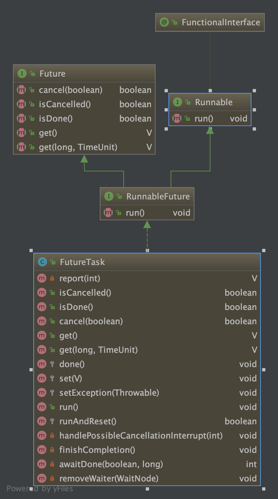

[TOC]

# `Future`在规定时间内获取结果

```java
import java.text.SimpleDateFormat;
import java.util.Date;
import java.util.Scanner;
import java.util.concurrent.*;


public class Main {

    public static Scanner sc = new Scanner(System.in);

    public static SimpleDateFormat simpleFormatter = new SimpleDateFormat("yyyy-MM-dd HH:mm:ss");
    /**
     * 模拟sec秒延迟
     */
    public static void delay(int sec) {
        try {
            TimeUnit.SECONDS.sleep(sec);
        } catch (InterruptedException e) {
            throw new RuntimeException(e);
        }
    }

    public static Future<Double> getPrice(double df){
        ExecutorService executor = Executors.newSingleThreadExecutor();
        Future<Double> future = executor.submit(new Callable<Double>() {
            @Override
            public Double call() throws Exception {
                delay(5);
                return df * 10;
            }
        });
        executor.shutdown();
        return future;
    }

    public static void priceTest(){
        Future<Double> futurePrice = getPrice(10.0f);
        Double price = null;
        try{
            price = futurePrice.get(1,TimeUnit.SECONDS);
        }catch (Exception e){
            System.out.println("cannot get within 1 sec");
            futurePrice.cancel(false);
            throw new RuntimeException(e);
        }
        System.out.println(price);
    }

    public static void main(String[] args) {
        System.out.println(simpleFormatter.format(new Date()));
        priceTest();
        System.out.println(simpleFormatter.format(new Date()));
    }

}
```

## 超时获取输出

```java
2019-11-02 15:14:47
cannot get within 1 sec
Exception in thread "main" java.lang.RuntimeException: java.util.concurrent.TimeoutException
	at Main.priceTest(Main.java:48)
	at Main.main(Main.java:55)
Caused by: java.util.concurrent.TimeoutException
	at java.util.concurrent.FutureTask.get(FutureTask.java:205)
	at Main.priceTest(Main.java:44)
	... 1 more

Process finished with exit code 1
```

## `Future`规定时间未获取到,中断处理

```java
import com.google.common.util.concurrent.MoreExecutors;

import java.text.SimpleDateFormat;
import java.util.Date;
import java.util.Scanner;
import java.util.concurrent.*;

public class Main {

    public static Scanner sc = new Scanner(System.in);

    public static SimpleDateFormat simpleFormatter = new SimpleDateFormat("yyyy-MM-dd HH:mm:ss");
    /**
     * 模拟sec秒延迟
     */
    public static void delay(int sec) {
        try {
            TimeUnit.SECONDS.sleep(sec);
        } catch (InterruptedException e) {
            throw new RuntimeException(e);
        }
    }

    public static Future<Double> getPrice(double df){
//        ExecutorService executor = MoreExecutors.newDirectExecutorService();
        ExecutorService executor = Executors.newSingleThreadExecutor();

        System.out.println(simpleFormatter.format(new Date()));
        Future<Double> future = executor.submit(new Callable<Double>() {
            @Override
            public Double call() throws Exception {
                delay(5);
                return df * 10;
            }
        });
        System.out.println(simpleFormatter.format(new Date()));
//        executor.shutdown();
        return future;
    }

    public static void priceTest(){
        Future<Double> futurePrice = getPrice(10.0f);
        Double price = null;
        try {
            price = futurePrice.get(1, TimeUnit.SECONDS);
        }catch (TimeoutException e){
            System.out.println("cannot get within 1 sec");
//            throw new RuntimeException(e);
            // 取消执行
//            futurePrice.cancel(true);
        }catch (Exception e){
            futurePrice.cancel(false);
//            throw new RuntimeException(e);
        }
        System.out.println(price);
        try {
            price = futurePrice.get();
        }catch (Exception e){

        }
        System.out.println(price);
    }

    public static void main(String[] args) {
        System.out.println(simpleFormatter.format(new Date()));
        priceTest();
        System.out.println(simpleFormatter.format(new Date()));
    }

}
```

## Callable、Future、FutureTask

* Runnable

```java
@FunctionalInterface
public interface Runnable {
    /**
     * When an object implementing interface <code>Runnable</code> is used
     * to create a thread, starting the thread causes the object's
     * <code>run</code> method to be called in that separately executing
     * thread.
     * <p>
     * The general contract of the method <code>run</code> is that it may
     * take any action whatsoever.
     *
     * @see     java.lang.Thread#run()
     */
    public abstract void run();
}
```

* Callable

```java
@FunctionalInterface
public interface Callable<V> {
    /**
     * Computes a result, or throws an exception if unable to do so.
     *
     * @return computed result
     * @throws Exception if unable to compute a result
     */
    V call() throws Exception;
}
```

* Future

```java
/**
 * A {@code Future} represents the result of an asynchronous
 * computation.  Methods are provided to check if the computation is
 * complete, to wait for its completion, and to retrieve the result of
 * the computation.  The result can only be retrieved using method
 * {@code get} when the computation has completed, blocking if
 * necessary until it is ready.  Cancellation is performed by the
 * {@code cancel} method.  Additional methods are provided to
 * determine if the task completed normally or was cancelled. Once a
 * computation has completed, the computation cannot be cancelled.
 * If you would like to use a {@code Future} for the sake
 * of cancellability but not provide a usable result, you can
 * declare types of the form {@code Future<?>} and
 * return {@code null} as a result of the underlying task.
 *
 * <p>
 * <b>Sample Usage</b> (Note that the following classes are all
 * made-up.)
 * <pre> {@code
 * interface ArchiveSearcher { String search(String target); }
 * class App {
 *   ExecutorService executor = ...
 *   ArchiveSearcher searcher = ...
 *   void showSearch(final String target)
 *       throws InterruptedException {
 *     Future<String> future
 *       = executor.submit(new Callable<String>() {
 *         public String call() {
 *             return searcher.search(target);
 *         }});
 *     displayOtherThings(); // do other things while searching
 *     try {
 *       displayText(future.get()); // use future
 *     } catch (ExecutionException ex) { cleanup(); return; }
 *   }
 * }}</pre>
 *
 * The {@link FutureTask} class is an implementation of {@code Future} that
 * implements {@code Runnable}, and so may be executed by an {@code Executor}.
 * For example, the above construction with {@code submit} could be replaced by:
 *  <pre> {@code
 * FutureTask<String> future =
 *   new FutureTask<String>(new Callable<String>() {
 *     public String call() {
 *       return searcher.search(target);
 *   }});
 * executor.execute(future);}</pre>
 *
 * <p>Memory consistency effects: Actions taken by the asynchronous computation
 * <a href="package-summary.html#MemoryVisibility"> <i>happen-before</i></a>
 * actions following the corresponding {@code Future.get()} in another thread.
 *
 * @see FutureTask
 * @see Executor
 * @since 1.5
 * @author Doug Lea
 * @param <V> The result type returned by this Future's {@code get} method
 */
public interface Future<V> {

    /**
     * Attempts to cancel execution of this task.  This attempt will
     * fail if the task has already completed, has already been cancelled,
     * or could not be cancelled for some other reason. If successful,
     * and this task has not started when {@code cancel} is called,
     * this task should never run.  If the task has already started,
     * then the {@code mayInterruptIfRunning} parameter determines
     * whether the thread executing this task should be interrupted in
     * an attempt to stop the task.
     *
     * <p>After this method returns, subsequent calls to {@link #isDone} will
     * always return {@code true}.  Subsequent calls to {@link #isCancelled}
     * will always return {@code true} if this method returned {@code true}.
     *
     * @param mayInterruptIfRunning {@code true} if the thread executing this
     * task should be interrupted; otherwise, in-progress tasks are allowed
     * to complete
     * @return {@code false} if the task could not be cancelled,
     * typically because it has already completed normally;
     * {@code true} otherwise
     */
    boolean cancel(boolean mayInterruptIfRunning);

    /**
     * Returns {@code true} if this task was cancelled before it completed
     * normally.
     *
     * @return {@code true} if this task was cancelled before it completed
     */
    boolean isCancelled();

    /**
     * Returns {@code true} if this task completed.
     *
     * Completion may be due to normal termination, an exception, or
     * cancellation -- in all of these cases, this method will return
     * {@code true}.
     *
     * @return {@code true} if this task completed
     */
    boolean isDone();

    /**
     * Waits if necessary for the computation to complete, and then
     * retrieves its result.
     *
     * @return the computed result
     * @throws CancellationException if the computation was cancelled
     * @throws ExecutionException if the computation threw an
     * exception
     * @throws InterruptedException if the current thread was interrupted
     * while waiting
     */
    V get() throws InterruptedException, ExecutionException;

    /**
     * Waits if necessary for at most the given time for the computation
     * to complete, and then retrieves its result, if available.
     *
     * @param timeout the maximum time to wait
     * @param unit the time unit of the timeout argument
     * @return the computed result
     * @throws CancellationException if the computation was cancelled
     * @throws ExecutionException if the computation threw an
     * exception
     * @throws InterruptedException if the current thread was interrupted
     * while waiting
     * @throws TimeoutException if the wait timed out
     */
    V get(long timeout, TimeUnit unit)
        throws InterruptedException, ExecutionException, TimeoutException;
}
```

* cancel方法: 用来取消任务，如果取消任务成功则返回true，如果取消任务失败则返回false。参数mayInterruptIfRunning表示是否允许取消正在执行却没有执行完毕的任务，如果设置true，则表示可以取消正在执行过程中的任务。如果任务已经完成，则无论mayInterruptIfRunning为true还是false，此方法肯定返回false，即如果取消已经完成的任务会返回false；如果任务正在执行，若mayInterruptIfRunning设置为true，则返回true，若mayInterruptIfRunning设置为false，则返回false；如果任务还没有执行，则无论mayInterruptIfRunning为true还是false，肯定返回true。
* isCancelled方法: 表示任务是否被取消成功，如果在任务正常完成前被取消成功，则返回true。
* isDone方法:表示任务是否已经完成，若任务完成，则返回true；
* get()方法: 用来获取执行结果，这个方法会产生阻塞，会一直等到任务执行完毕才返回；
* get(long timeout, TimeUnit unit):用来获取执行结果，如果在指定时间内，还没获取到结果，就直接返回null。

* FutureTask


