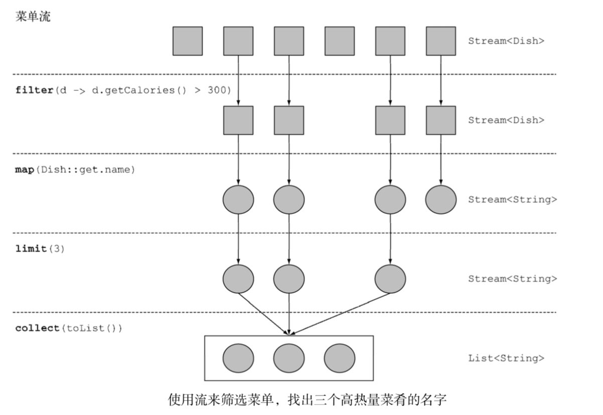
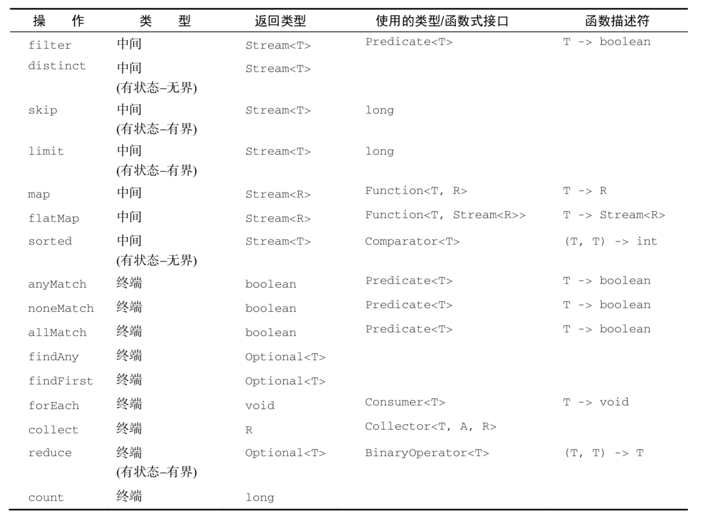

[TOC]

# Streams

## 流是什么,流的简单使用

```java
List<Dish> menu = Arrays.asList(
                new Dish("pork", false, 800, Dish.Type.MEAT),
                new Dish("beef", false, 700, Dish.Type.MEAT),
                new Dish("chicken", false, 400, Dish.Type.MEAT),
                new Dish("french fries", true, 530, Dish.Type.OTHER),
                new Dish("rice", true, 350, Dish.Type.OTHER),
                new Dish("season fruit", true, 120, Dish.Type.OTHER),
                new Dish("pizza", true, 550, Dish.Type.OTHER),
                new Dish("prawns", false, 300, Dish.Type.FISH),
                new Dish("salmon", false, 450, Dish.Type.FISH));
```

* Java7 写法

```java
List<Dish> lowCaloricDishes = new ArrayList<>();
// 用累加器筛选卡路里<400的元素
for(Dish d: menu){
    if(d.getCalories() < 400){
        lowCaloricDishes.add(d);
    }
}
// 用匿名类对菜肴排序
Collections.sort(lowCaloricDishes, new Comparator<Dish>() {
    @Override
    public int compare(Dish d1, Dish d2) {
        return Integer.compare(d1.getCalories(), d2.getCalories());
    }
});
// 获取最后的菜肴列表
List<String> lowCaloricDishesName = new ArrayList<>();
for(Dish d: lowCaloricDishes){
    lowCaloricDishesName.add(d.getName());
}
```

在这段代码中，你用了一个"垃圾变量"lowCaloricDishes。它唯一的作用就是作为一次性的中间容器。在Java8中，实现的细节被放在它本该归属的类里了

* java8

```java
List<String> lowCaloricDishesName =
                menu.stream()
                .filter(d -> d.getCalories() < 400)
                .sorted(comparing(Dish::getCalories))
                .map(Dish::getName)
                .collect(toList());
```

为了利用多核架构并行处理，需把`stream()`换成`parallelStream()`

```java
List<String> lowCaloricDishesName =
                menu.parallelStream()
                .filter(d -> d.getCalories() < 400)
                .sorted(comparing(Dish::getCalories))
                .map(Dish::getName)
                .collect(toList());
```

优势：

* 代码是以声明性方式写的:说明想要完成什么(筛选热量低的菜肴)而不是说明如何实现一个操作(利用循环和if条件等控制流语句)。

* 你可以把几个基础操作链接起来，来表达复杂等流水线(在filter后面接上 sorted、map和collect操作),同时保持代码清晰可读

所以通过Java8的Stream API可以写出如下的代码：

* 声明性 —— 更简洁，更易读
* 可复合 —— 更灵活
* 可并行 —— 性能更好

## 流 特点

### 流操作

"A sequence of elements supporting sequential and parallel aggregate operations."

从支持`数据处理`操作的`源`生成的`元素序列`

1. Stream是元素的集合，这点让Stream看起来用些类似Iterator

2. 可以支持顺序和并行的对原Stream进行汇聚的操作



### 流与集合

* 只能遍历一次

和迭代器类似，流只能遍历一次。遍历完之后，我们就说这个流已经被消费掉了。

* 外部迭代与内部迭代

使用Collection接口需要用户去做迭代(比如用for-each)，这称为外部迭代。相反，Streams库使用内部迭代——它帮你把迭代做了

### 流操作

* filter、map和limit可以连成一条流水线;
* collect触发流水线执行并关闭它。

可以连接起来的流操作称为`中间操作`，关闭流的操作称为`终端操作`

流的使用一般包括三件事:

1. 一个数据源(如集合)来执行一个查询
2. 一个中间操作链，形成一条流的流水线
3. 一个终端操作，执行流水线，并能生成结果


#### 规约(reduce)

```java
List<Integer> numberList = Arrays.asList(1,2,5,6,7);

int numberSum = 0;
for(int num: numberList){
    numberSum += num;
}
System.out.println("sum:"+ numberSum);

int numberSum2 = numberList.stream()
        .reduce(0, (a, b) -> a + b);
System.out.println("sum2:"+ numberSum2);
```

reduce接受两个参数

* 总和变量初始值，设为了0

* 将列表中所有原始结合在一起的操作，设为了`+` （`BinaryOperator<T>`操作用lambda表达式表示）

如下返回`Optional`对象，因为Stream中可能一个元素都没有

```java
Optional<Integer> numberSum3 = numberList.stream()
    .reduce( (a, b) -> a + b);
System.out.println("sum3:"+ numberSum3);
```

#### max, min

```java
List<Integer> numberList = Arrays.asList(1,2,10,6,7);

int numberMax = numberList.stream()
        .reduce(0, (a, b) -> a > b ? a : b);
System.out.println("max:"+ numberMax);

Optional<Integer> numberMax2 = numberList.stream()
        .reduce(Integer::max);
System.out.println("max2:"+ numberMax2);
```

#### 流操作: 无状态和有状态

诸如`map`或`filter`等操作会从输入流中获取每一个元素，并在输出流中输出0个或1个结果，这些操作是`无状态`的:它们没有内部状态（假设用户提高的lambda或方法引用没有内部可变状态）

诸如`reduce`,`sum`，`max`等操作需要`内部状态`来累计结果，要求流是`有界`的

诸如`sort`或`distince`等操作，开始与`map`,`filter`相同，但是需要有个缓冲区存放所有元素，这个存储要求是`无界`的



注：如果能避开 有状态，选用无状态操作，就能获得更好的`并行`性能。
