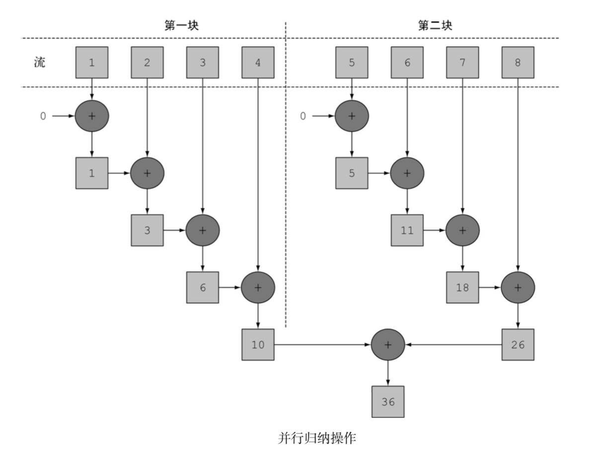

[TOC]

# 并行数据处理与性能

## 数值流，装箱和拆箱

1. 将原始类型转换为对应的引用类型的机制，这个机制叫做`装箱`。
2. 将引用类型转换为对应的原始类型，叫做`拆箱`。

java中装箱和拆箱是自动完成的, 但这在性能方面是要付出代价的，装箱的本质就是**将原始类型包裹起来，并保存在堆里**。因此装箱后的值**需要更多的内存**，并需要额外的内存搜索来获取被包裹的原始值。

```java
List<Integer> list = new ArrayList<>();
for(int i = 0 ; i < 100 ;i++){
    // int被装箱成Integer
    list.add(i);
}
```

Java8 引入了三个原始类型特化流来解决这个问题；`IntStream`、`DoubleStream`、`LongStream`分别将流中元素特化为int、double、long，从而避免了暗含装箱的成本。每个接口都带来了常用数值归约的新方法，例如对数值流求和的sum，找到最大元素的max。

## 并行流

并行流就是一个把内容分成多个数据块，并用不同的线程分别处理每个数据块的流。这样一来，你就可以自动把给定操作的工作负荷分配给多核处理器的所有内核，让它们都忙起来。

```java
public static long parallelSum(long n) {
    return Stream.iterate(1L, i -> i + 1)
            .limit(n)
            .parallel()
            .reduce(0L, Long::sum);
}
```



* 并行流用的线程是从哪来的?有多少个?怎么自定义这个过程呢?

并行流内部使用了默认的`ForkJoinPool`，它默认的线程数量就是你的`处理器数量`，这个值是由`Runtime.getRuntime().availableProcessors()`得到的。
但是你可以过系统性 `java.util.concurrent.ForkJoinPool.common. parallelism`来改变线程􏺕大小，如下所示:
`System.setProperty("java.util.concurrent.ForkJoinPool.common.parallelism","12");`
这是一个全局设置，因此它将影响代码中所有的并行流。反过来说，目前还无法专为某个并行流设定这个值。一般而言，让`ForkJoinPool`的大小等于处理器数量是个不错的默认值，除非你有很好的理由，否则我们强烈建议你不要修改它。

## 测量流性能

```java
class ParallelStreams{

    public static long parallelSum(long n) {
        return Stream.iterate(1L, i -> i + 1)
                .limit(n)
                .parallel()
                .reduce(0L, Long::sum);
    }

    public static long iterativeSum(long n) {
        long result = 0;
        for (long i = 1L; i <= n; i++) {
            result += i;
        }
        return result;
    }

}

public class MainTest {

    static long measureSumPerf(Function<Long, Long> adder, long n) {
        long fastest = Long.MAX_VALUE;
        int cnt = 10;
        for (int i = 0; i < cnt; i++) {
            long start = System.nanoTime();
            long sum = adder.apply(n);
            long duration = (System.nanoTime() - start) / 1_000_000;
            System.out.println("Result: " + sum);
            if (duration < fastest) {
                fastest = duration;
            }
        }
        return fastest;
    }

    public static void main(String[] args) {
        int processorCnt = Runtime.getRuntime().availableProcessors();
        // 4 核
        System.out.println(processorCnt);

        // 149 msecs
        System.out.println("Sequential sum done in:" +
                measureSumPerf(ParallelStreams::parallelSum, 10_000_000) + " msecs");

        // 2 msecs
        System.out.println("Sequential sum done in:" +
                measureSumPerf(ParallelStreams::iterativeSum, 10_000_000) + " msecs");
    }
}
```

求和方法的`并行`版本比`顺序`版本要慢很多, 如何解释？

* `iterate`生成的是`装箱`的对象，必须`拆箱`成数字才能求和;
* 我们很难把`iterate`分成多个独立块来并行执行。

```java
public static<T> Stream<T> iterate(final T seed, final UnaryOperator<T> f) {
    Objects.requireNonNull(f);
    final Iterator<T> iterator = new Iterator<T>() {
        @SuppressWarnings("unchecked")
        T t = (T) Streams.NONE;

        @Override
        public boolean hasNext() {
            return true;
        }

        @Override
        public T next() {
            return t = (t == Streams.NONE) ? seed : f.apply(t);
        }
    };
    return StreamSupport.stream(Spliterators.spliteratorUnknownSize(
            iterator,
            Spliterator.ORDERED | Spliterator.IMMUTABLE), false);
}
```

整张数字列表在归纳过程开始时没有准备好，因而无法有效地把流划分为小块来并行处理。把流标记为并行，其实时给顺序处理增加了开销，它还要把每次求和操作分到一个不同的线程上。

这就说明了并行编程可能很复杂，有时候甚至有点违反直觉。如果用得不对(比如采用了一个不易并行化的操作，如`iterate`)，它甚至可能让程序的整体性能更差，所以在调用那个看似神奇的`parallel`操作时，了解背后到底发生了什么是很有必要的。

### 正确使用并行流

* `LongStream.rangeClosed`直接产生原始类型的long数字，没有装箱拆箱的开􏺱。

* `LongStream.rangeClosed`会生成数字范围，很容易拆分为独立的小块。

```java
public static long rangedSum(long n) {
    return LongStream.rangeClosed(1, n)
            .reduce(0L, Long::sum);
}

public static long parallelRangedSum(long n) {
    return LongStream.rangeClosed(1, n)
            .parallel()
            .reduce(0L, Long::sum);
}
```

其中运行一次的结果

```java
 // 8 msecs
System.out.println("Sequential sum done in:" +
        measureSumPerf(ParallelStreams::rangedSum, 10_000_000) + " msecs");

// 1 msecs
System.out.println("Sequential sum done in:" +
        measureSumPerf(ParallelStreams::parallelRangedSum, 10_000_000) + " msecs");
```

这也表明，使用正确的数据结构，并使其`并行工作`能够保最佳的性能。

尽管如此，请记住，`并行化并不是没有代价的`。并行化过程本身需要对流做递归划分，把每个子流的归纳操作分配到不同的线程，然后把这些操作的结果合并成一个值。但在多个内核之间移动数据的代价也可能比你想的要大，所以很重要的一点是要保证`在内核中并行执行工作的时间`比`在内核之间传输数据的时间`长。总而言之，很多情况下不可能或不方便并行化。然而，在使用并行Stream加速代码之前，你必须确保用得对，如果结果错了，算得快就毫无意义了。

#### 错误并行的例子

```java
public class Accumulator {
    public long total = 0;
    public void add(long value) { total += value; }
}

public static long sideEffectSum(long n) {
    Accumulator accumulator = new Accumulator();
    LongStream.rangeClosed(1, n).forEach(accumulator::add);
    return accumulator.total;
}
```

本质上就是顺序的。每次访问total都会出现数据竞争。如果尝试用同步来修复，那就完全失去并行的意义了

```java
System.out.println("Sequential sum done in:" +
                measureSumPerf(ParallelStreams::sideEffectParallelSum, 10_000_000) + " msecs");
```

结果返回离正确结果差很远, 这是由于多个线程在同时访问累加器，执行`total += value`，而这一句虽然看似简单，却不是一个原子操作

```java
Result: 28164411286807
Result: 11651694778636
Result: 22043244877252
Result: 17682597464130
Result: 9609315403160
Result: 49558238667010
Result: 37620761173257
Result: 33329225372527
Result: 17778545913914
Result: 23757727257263
```

### 高效使用并行流

* 如果有疑问，测量。把顺序转成并行流轻而易举，但却比一定是好事。因为并行流并不总是比顺序快。
* 留意装箱。自动装箱和拆箱操作会大大降低性能。java8中有原始类型流(IntStream,LongStream,DoubleStream)来避免这种操作，但凡有可能都要用这些流。
* 有些操作本身在并行流上的性能就比顺序流查。特别是limit和findFirst等依赖于元素顺序的操作，他们在并行流上执行的代价非常大。findAny会比findFirst性能好，因为它不一定要按顺序执行。
* 对于较小的数据量，选择并行流几乎从来都不是一个好的决定。并行处理少数几个元素的好处还抵不上并行化造成额外的开销。

* 流数据源和可分解性

源 | 可分解性
-|-
ArrayList | 极佳
LinkedList | 差
IntStream.range | 极佳
Stream.iterate | 差
HashSet | 好
TreeSet | 好

流背后使用的基础架构是java7中引入的分支/合并框架。并行汇总的实例证明了要想正确使用并行流，了解它的内部原理至关重要。

## Fork/Join框架

分支/合并框架的目的是以递归方式将可以并行的任务拆分成更小的任务，然后将每个子任务的结果合并起来生成整体结果。它是`ExecutorService`接口的一个实现，它把子任务分配给线程池(称为`ForkJoinPool`)中的工作线程。


伪代码如下

```java
if (任务足够小或不可分) {
    顺序计算该任务
} else {
    将任务分成两个子任务
    递归调用本方法，拆分每个子任务，等待所有子任务完成
    合并每个子任务的结果
}
```

### RecursiveTask的使用

```java
public class ForkJoinSumRecursiveTask extends java.util.concurrent.RecursiveTask<Long> {

    /**
     * 要求和的数组，起始和结束位置
     */
    private final long[] numbers;
    private final int start;
    private final int end;

    /**
     *  不再将任务分解为子任务的数组大小
     */
    private static final long THRESHOLD = 10_000;

    public ForkJoinSumRecursiveTask(long[] numbers) {
        this(0, numbers.length,numbers);
    }

    public ForkJoinSumRecursiveTask(int start, int end, long[] data) {
        this.start = start;
        this.end = end;
        this.numbers = data;
    }

    /**
     * 覆盖RecursiveTask抽象方法
     * @return
     */
    @Override
    protected Long compute() {
        if ((end - start) <= THRESHOLD) {
            return computeSequentially();
        }

        int mid = (start + end) / 2;
        ForkJoinSumRecursiveTask leftTask = new ForkJoinSumRecursiveTask(start, mid, numbers);
        // 异步执行新的子任务
        leftTask.fork();
        ForkJoinSumRecursiveTask rightTask = new ForkJoinSumRecursiveTask(mid, end, numbers);
        // 同步执行第二个子任务, 依此类推
        Long rightResult = rightTask.compute();
        Long leftResult = leftTask.join();

        return rightResult + leftResult;
    }

    private long computeSequentially() {
        long sum = 0;
        for (int i = start; i < end; i++) {
            sum += numbers[i];
        }
        return sum;
    }
}
```

运行情况如下

```java
public static long forkJoinSum(long n) {
    long[] numbers = LongStream.rangeClosed(1, n).toArray();
    ForkJoinTask<Long> task = new ForkJoinSumRecursiveTask(numbers);
    return new ForkJoinPool().invoke(task);
}

// 61 msecs
System.out.println("Sequential sum done in:" +
        measureSumPerf(ParallelStreams::forkJoinSum, 10_000_000) + " msecs");
```

这个性能看起来比用并行流的版本要差，但这只是因为必须先要把整个数字流都放进一个`long[]`，之后才能在`ForkJoinSumRecursiveTask`任务中使用它


#### 工作窃取算法（work stealing）

工作窃取算法（work stealing）用于在池中的工作线程之间重新分配和平衡任务. 在实际应用中，这意味着这些任务差不多被平均分配到ForkJoinPool中的所有线程上。


#### Spliterator

`Spliterator`是Java8中加入的另一个新接口;这个名字代表“可分迭代器”(splitable iterator)。和Iterator一样，Spliterator也用于遍历数据源中的元素，但它是为了并行执行而设计的。

## ParallelStream 使用问题

// TODO
