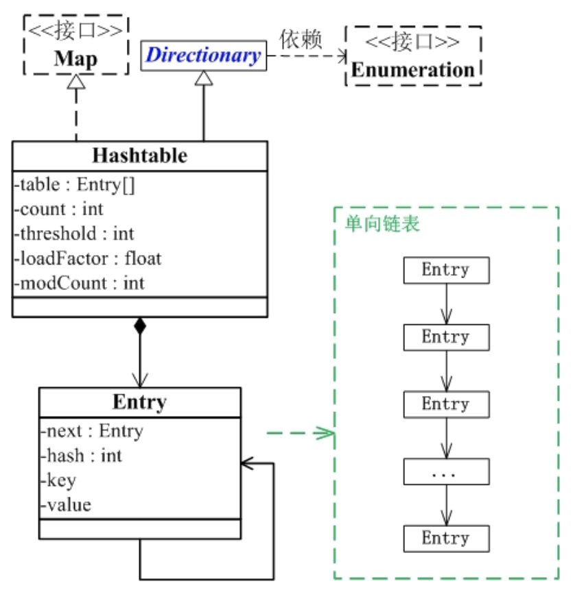

[TOC]

# HashMap

## 数组 + 链表 的实现方式

```java

import java.util.HashMap;
import java.util.Map;
import java.util.Objects;

public class Main {

    public static void main(String[] args) throws Exception {
        Map<Integer,String> mp = new HashMap<>(16);
        mp.put(1, "a");
        mp.put(2, "b");
        mp.put(null, null);
        mp.put(null, "c");
        mp.put(3, null);
        System.out.println( Objects.hashCode(null));
        mp.entrySet().stream().forEach(m -> {
            Map.Entry<Integer, String> keyVal = m;
            System.out.println(keyVal.getKey() + ":" + keyVal.getValue());
        });
    }
}
/*output
0
null:c
1:a
2:b
3:null
 */
```

`数组`是HashMap的主体，`链表`则是主要为了解决哈希冲突而存在的(**拉链法**解决冲突)

## 拉链法解决冲突

```java
/**
* The number of key-value mappings contained in this map.
*/
transient int size;

// `null`也是有`hashcode`的
static final int hash(Object key) {
    int h;
    return (key == null) ? 0 : (h = key.hashCode()) ^ (h >>> 16);
}

public V put(K key, V value) {
    return putVal(hash(key), key, value, false, true);
}
```

```java
final V putVal(int hash, K key, V value, boolean onlyIfAbsent,
                boolean evict) {
    Node<K,V>[] tab; Node<K,V> p; int n, i;
    // 是否扩容
    if ((tab = table) == null || (n = tab.length) == 0)
        n = (tab = resize()).length;
    // 数组中是否有链表
    if ((p = tab[i = (n - 1) & hash]) == null)
        tab[i] = newNode(hash, key, value, null);
    else {
        Node<K,V> e; K k;
        if (p.hash == hash &&
            ((k = p.key) == key || (key != null && key.equals(k))))
            e = p;
        else if (p instanceof TreeNode)
            e = ((TreeNode<K,V>)p).putTreeVal(this, tab, hash, key, value);
        else {
            // 数组中的链表遍历
            for (int binCount = 0; ; ++binCount) {
                if ((e = p.next) == null) {
                    p.next = newNode(hash, key, value, null);
                    if (binCount >= TREEIFY_THRESHOLD - 1) // -1 for 1st
                        treeifyBin(tab, hash);
                    break;
                }
                if (e.hash == hash &&
                    ((k = e.key) == key || (key != null && key.equals(k))))
                    break;
                p = e;
            }
        }
        // 链表中存在该key，新值替换旧值
        if (e != null) { // existing mapping for key
            V oldValue = e.value;
            if (!onlyIfAbsent || oldValue == null)
                e.value = value;
            afterNodeAccess(e);
            return oldValue;
        }
    }
    // 是否需要调整数组
    ++modCount;
    if (++size > threshold)
        resize();
    // 不存在key，旧插入到链表中
    afterNodeInsertion(evict);
    return null;
}

/**
* Initializes or doubles table size.  If null, allocates in
* accord with initial capacity target held in field threshold.
* Otherwise, because we are using power-of-two expansion, the
* elements from each bin must either stay at same index, or move
* with a power of two offset in the new table.
*
* @return the table
*/
final Node<K,V>[] resize() {
```

## 非线程安全

建议在单线程，不需要同步的时候，用`HashMap`

# HashTable

## key,value都不能为null

```java
import java.util.Hashtable;
import java.util.Map;
import java.util.Objects;

public class Main {

    public static void main(String[] args) throws Exception {
        Map<Integer,String> mp = new Hashtable<>(16);
        mp.put(1, "a");
        mp.put(2, "b");
        // Hashtable key,value不能为null, 否则报`java.lang.NullPointerException`
//        mp.put(null, "c");
//        mp.put(3, null);
        System.out.println( Objects.hashCode(null));
        mp.entrySet().stream().forEach(m -> {
            Map.Entry<Integer, String> keyVal = m;
            System.out.println(keyVal.getKey() + ":" + keyVal.getValue());
        });
    }
}
/*output
0
2:b
1:a
 */
```

## 线程安全

方法都加上了`synchronized`关键词, `synchronized`是针对整张Hash表的，即每次锁住整张表让线程独占

## 底层实现类似`Hashmap`，也是拉链法



```java
public synchronized V put(K key, V value) {
    // Make sure the value is not null
    if (value == null) {
        throw new NullPointerException();
    }

    // Makes sure the key is not already in the hashtable.
    Entry<?,?> tab[] = table;
    int hash = key.hashCode();
    int index = (hash & 0x7FFFFFFF) % tab.length;
    @SuppressWarnings("unchecked")
    Entry<K,V> entry = (Entry<K,V>)tab[index];
    for(; entry != null ; entry = entry.next) {
        if ((entry.hash == hash) && entry.key.equals(key)) {
            V old = entry.value;
            entry.value = value;
            return old;
        }
    }

    addEntry(hash, key, value, index);
    return null;
}

private void addEntry(int hash, K key, V value, int index) {
    modCount++;

    Entry<?,?> tab[] = table;
    if (count >= threshold) {
        // Rehash the table if the threshold is exceeded
        rehash();

        tab = table;
        hash = key.hashCode();
        index = (hash & 0x7FFFFFFF) % tab.length;
    }

    // Creates the new entry.
    @SuppressWarnings("unchecked")
    Entry<K,V> e = (Entry<K,V>) tab[index];
    tab[index] = new Entry<>(hash, key, value, e);
    count++;
}
```

# HashMap, Hashtable的区别

HashMap几乎可以等价于Hashtable，除了HashMap是非synchronized的，并可以接受null(HashMap可以接受为null的键值(key)和值(value)，而Hashtable则不行)。

* HashMap是非synchronized，而Hashtable是synchronized，这意味着Hashtable是线程安全的，多个线程可以共享一个Hashtable；而如果没有正确的同步的话，多个线程是不能共享HashMap的。Java 5提供了`ConcurrentHashMap`，它是HashTable的替代，比HashTable的扩展性更好。

* 另一个区别是HashMap的迭代器(Iterator)是`fail-fast`迭代器，而Hashtable的enumerator迭代器不是fail-fast的。所以当有其它线程改变了HashMap的结构（增加或者移除元素），将会抛出ConcurrentModificationException，但迭代器本身的remove()方法移除元素则不会抛出ConcurrentModificationException异常。但这并不是一个一定发生的行为，要看JVM。这条同样也是Enumeration和Iterator的区别。

* 由于Hashtable使用了synchronized，所以在单线程环境下它比HashMap要慢。如果你不需要同步，只需要单一线程，那么使用HashMap性能要好过Hashtable。

* HashMap不能保证随着时间的推移Map中的元素次序是不变的。

# ConcurrentHashMap(JDK 1.7)

## 分段的数组+链表实现，线程安全

```java
/**
* The segments, each of which is a specialized hash table.
*/
final Segment<K,V>[] segments;

static final class Segment<K,V> extends ReentrantLock implements Serializable {
 transient volatile HashEntry<K,V>[] table;

```


### put

```java
public V put(K key, V value) {
    Segment<K,V> s;
    if (value == null)
        throw new NullPointerException();
    // 第一次 先 hash 定位到 segment 的位置
    int hash = hash(key);
    int j = (hash >>> segmentShift) & segmentMask;
    if ((s = (Segment<K,V>)UNSAFE.getObject          // nonvolatile; recheck
            (segments, (j << SSHIFT) + SBASE)) == null) //  in ensureSegment
        s = ensureSegment(j);
    return s.put(key, hash, value, false);
}

// segment 内部的put方法
final V put(K key, int hash, V value, boolean onlyIfAbsent) {
    // tryLock 操作
    HashEntry<K,V> node = tryLock() ? null :
        scanAndLockForPut(key, hash, value);
    V oldValue;
    try {
        // 找 HashEntry
        HashEntry<K,V>[] tab = table;
        int index = (tab.length - 1) & hash;
        HashEntry<K,V> first = entryAt(tab, index);
        for (HashEntry<K,V> e = first;;) {
            if (e != null) {
                K k;
                if ((k = e.key) == key ||
                    (e.hash == hash && key.equals(k))) {
                    oldValue = e.value;
                    if (!onlyIfAbsent) {
                        e.value = value;
                        ++modCount;
                    }
                    break;
                }
                e = e.next;
            }
            else {
                if (node != null)
                    node.setNext(first);
                else
                    node = new HashEntry<K,V>(hash, key, value, first);
                int c = count + 1;
                if (c > threshold && tab.length < MAXIMUM_CAPACITY)
                    rehash(node);
                else
                    setEntryAt(tab, index, node);
                ++modCount;
                count = c;
                oldValue = null;
                break;
            }
        }
    } finally {
        unlock();
    }
    return oldValue;
}
```

### get

hash => Segment => HashEntry => 遍历链表

```java
/**
* Returns the value to which the specified key is mapped,
* or {@code null} if this map contains no mapping for the key.
*
* <p>More formally, if this map contains a mapping from a key
* {@code k} to a value {@code v} such that {@code key.equals(k)},
* then this method returns {@code v}; otherwise it returns
* {@code null}.  (There can be at most one such mapping.)
*
* @throws NullPointerException if the specified key is null
*/
public V get(Object key) {
    Segment<K,V> s; // manually integrate access methods to reduce overhead
    HashEntry<K,V>[] tab;
    int h = hash(key);
    long u = (((h >>> segmentShift) & segmentMask) << SSHIFT) + SBASE;
    if ((s = (Segment<K,V>)UNSAFE.getObjectVolatile(segments, u)) != null &&
        (tab = s.table) != null) {
        for (HashEntry<K,V> e = (HashEntry<K,V>) UNSAFE.getObjectVolatile
                    (tab, ((long)(((tab.length - 1) & h)) << TSHIFT) + TBASE);
                e != null; e = e.next) {
            K k;
            if ((k = e.key) == key || (e.hash == h && key.equals(k)))
                return e.value;
        }
    }
    return null;
}
```

### size

并发操作

* 第一种方案他会使用不加锁的模式去尝试多次计算ConcurrentHashMap的size，最多三次，比较前后两次计算的结果，结果一致就认为当前没有元素加入，计算的结果是准确的

第二种方案是如果第一种方案不符合，他就会给每个Segment加上锁，然后计算ConcurrentHashMap的size返回

```java
/**
* Returns the number of key-value mappings in this map.  If the
* map contains more than <tt>Integer.MAX_VALUE</tt> elements, returns
* <tt>Integer.MAX_VALUE</tt>.
*
* @return the number of key-value mappings in this map
*/
public int size() {
    // Try a few times to get accurate count. On failure due to
    // continuous async changes in table, resort to locking.
    final Segment<K,V>[] segments = this.segments;
    int size;
    boolean overflow; // true if size overflows 32 bits
    long sum;         // sum of modCounts
    long last = 0L;   // previous sum
    int retries = -1; // first iteration isn't retry
    try {
        for (;;) {
            if (retries++ == RETRIES_BEFORE_LOCK) {
                for (int j = 0; j < segments.length; ++j)
                    ensureSegment(j).lock(); // force creation
            }
            sum = 0L;
            size = 0;
            overflow = false;
            for (int j = 0; j < segments.length; ++j) {
                Segment<K,V> seg = segmentAt(segments, j);
                if (seg != null) {
                    sum += seg.modCount;
                    int c = seg.count;
                    if (c < 0 || (size += c) < 0)
                        overflow = true;
                }
            }
            if (sum == last)
                break;
            last = sum;
        }
    } finally {
        if (retries > RETRIES_BEFORE_LOCK) {
            for (int j = 0; j < segments.length; ++j)
                segmentAt(segments, j).unlock();
        }
    }
    return overflow ? Integer.MAX_VALUE : size;
}
```

# ConcurrentHashMap(JDK 1.8)

## Node数组,链表,红黑树

当`链表`的节点数大于8时会转换成`红黑树`的结构

### put

```java
public V put(K key, V value) {
    return putVal(key, value, false);
}

/** Implementation for put and putIfAbsent */
final V putVal(K key, V value, boolean onlyIfAbsent) {
    if (key == null || value == null) throw new NullPointerException();
    //两次hash，减少hash冲突，可以均匀分布
    int hash = spread(key.hashCode());
    int binCount = 0;
    for (Node<K,V>[] tab = table;;) {
        Node<K,V> f; int n, i, fh;
        if (tab == null || (n = tab.length) == 0)
            tab = initTable();
        // 如果i位置没有数据，就直接无锁插入
        else if ((f = tabAt(tab, i = (n - 1) & hash)) == null) {
            if (casTabAt(tab, i, null,
                            new Node<K,V>(hash, key, value, null)))
                break;                   // no lock when adding to empty bin
        }
        // 如果在进行扩容，则先进行扩容操作
        else if ((fh = f.hash) == MOVED)
            tab = helpTransfer(tab, f);
        else {
            V oldVal = null;
            // 加锁操作，存在hash冲突，锁住链表或者红黑树的头结点
            synchronized (f) {
                if (tabAt(tab, i) == f) {
                    // 表示该节点是链表结构
                    if (fh >= 0) {
                        binCount = 1;
                        for (Node<K,V> e = f;; ++binCount) {
                            K ek;
                            if (e.hash == hash &&
                                ((ek = e.key) == key ||
                                    (ek != null && key.equals(ek)))) {
                                oldVal = e.val;
                                if (!onlyIfAbsent)
                                    e.val = value;
                                break;
                            }
                            Node<K,V> pred = e;
                            if ((e = e.next) == null) {
                                pred.next = new Node<K,V>(hash, key,
                                                            value, null);
                                break;
                            }
                        }
                    }
                    // 红黑数
                    else if (f instanceof TreeBin) {
                        Node<K,V> p;
                        binCount = 2;
                        if ((p = ((TreeBin<K,V>)f).putTreeVal(hash, key,
                                                        value)) != null) {
                            oldVal = p.val;
                            if (!onlyIfAbsent)
                                p.val = value;
                        }
                    }
                }
            }
            // static final int TREEIFY_THRESHOLD = 8; 链表长度大于8转换为红黑树
            if (binCount != 0) {
                if (binCount >= TREEIFY_THRESHOLD)
                    treeifyBin(tab, i);
                if (oldVal != null)
                    return oldVal;
                break;
            }
        }
    }
    // 统计size，并且检查是否需要扩容
    addCount(1L, binCount);
    return null;
}
```

### 对比 Jdk1.7

* JDK1.8的实现降低锁的粒度，JDK1.7版本锁的粒度是基于Segment的，包含多个HashEntry，而JDK1.8锁的粒度就是HashEntry（首节点）

* JDK1.8使用红黑树来优化链表，基于长度很长的链表的遍历是一个很漫长的过程，而红黑树的遍历效率是很快的，代替一定阈值的链表

* 相对而言`低粒度`加锁方式，synchronized并不比ReentrantLock差
