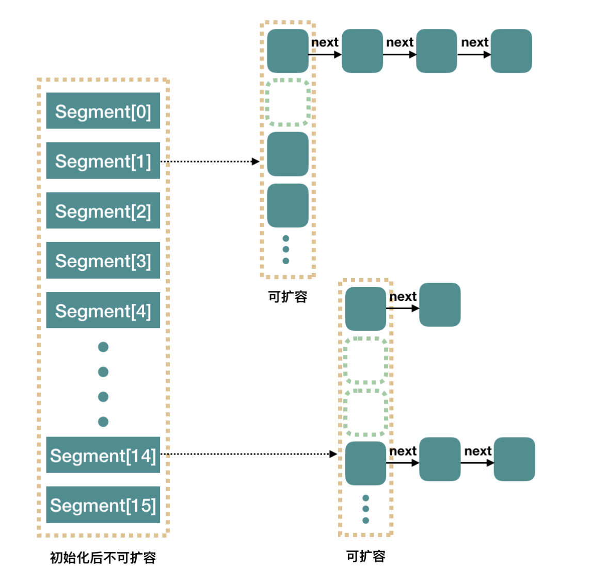

[TOC]

# concurrent数据结构

## ConcurrentMap(interface)

```java
public interface ConcurrentMap<K, V> extends Map<K, V> {
```

## ConcurrentHashMap(class)

```java
public class ConcurrentHashMap<K,V> extends AbstractMap<K,V>
    implements ConcurrentMap<K,V>, Serializable {
```


每个桶可能是`链表`结构或者`红黑树`结构，锁针对桶的头节点加，`锁粒度小`

### 底层:数组+链表/红黑树，CAS + synchronized控制并发

```java
 /* ---------------- Fields -------------- */

/**
    * The array of bins. Lazily initialized upon first insertion.
    * Size is always a power of two. Accessed directly by iterators.
    */
transient volatile Node<K,V>[] table;

/**
    * The next table to use; non-null only while resizing.
    */
private transient volatile Node<K,V>[] nextTable;

/**
    * Base counter value, used mainly when there is no contention,
    * but also as a fallback during table initialization
    * races. Updated via CAS.
    */
private transient volatile long baseCount;

/**
    * Table initialization and resizing control.  When negative, the
    * table is being initialized or resized: -1 for initialization,
    * else -(1 + the number of active resizing threads).  Otherwise,
    * when table is null, holds the initial table size to use upon
    * creation, or 0 for default. After initialization, holds the
    * next element count value upon which to resize the table.
    */
private transient volatile int sizeCtl;

/**
    * The next table index (plus one) to split while resizing.
    */
private transient volatile int transferIndex;

/**
    * Spinlock (locked via CAS) used when resizing and/or creating CounterCells.
    */
private transient volatile int cellsBusy;

/**
    * Table of counter cells. When non-null, size is a power of 2.
    */
private transient volatile CounterCell[] counterCells;

// views
private transient KeySetView<K,V> keySet;
private transient ValuesView<K,V> values;
private transient EntrySetView<K,V> entrySet;
```

### put方法

```java
/** Implementation for put and putIfAbsent */
final V putVal(K key, V value, boolean onlyIfAbsent) {
    // key, value 都不能为null
    if (key == null || value == null) throw new NullPointerException();
    int hash = spread(key.hashCode());
    int binCount = 0;
    for (Node<K,V>[] tab = table;;) {
        Node<K,V> f; int n, i, fh;
        if (tab == null || (n = tab.length) == 0)
            tab = initTable();
        else if ((f = tabAt(tab, i = (n - 1) & hash)) == null) {
            // CAS方式进行添加结点
            if (casTabAt(tab, i, null,
                            new Node<K,V>(hash, key, value, null)))
                break;                   // no lock when adding to empty bin
        }
        else if ((fh = f.hash) == MOVED)
            tab = helpTransfer(tab, f);
        else {
            V oldVal = null;
            // synchronized 同步操作
            synchronized (f) {
                if (tabAt(tab, i) == f) {
                    if (fh >= 0) {
                        binCount = 1;
                        for (Node<K,V> e = f;; ++binCount) {
                            K ek;
                            if (e.hash == hash &&
                                ((ek = e.key) == key ||
                                    (ek != null && key.equals(ek)))) {
                                oldVal = e.val;
                                if (!onlyIfAbsent)
                                    e.val = value;
                                break;
                            }
                            Node<K,V> pred = e;
                            if ((e = e.next) == null) {
                                pred.next = new Node<K,V>(hash, key,
                                                            value, null);
                                break;
                            }
                        }
                    }
                    else if (f instanceof TreeBin) {
                        Node<K,V> p;
                        binCount = 2;
                        if ((p = ((TreeBin<K,V>)f).putTreeVal(hash, key,
                                                        value)) != null) {
                            oldVal = p.val;
                            if (!onlyIfAbsent)
                                p.val = value;
                        }
                    }
                }
            }
            if (binCount != 0) {
                if (binCount >= TREEIFY_THRESHOLD)
                    treeifyBin(tab, i);
                if (oldVal != null)
                    return oldVal;
                break;
            }
        }
    }
    addCount(1L, binCount);
    return null;
}
```

1. 先判断key和value是否为null，为null则抛出异常

2. 判断table是否初始化，如果没有则进行初始化

3. 计算key的hash值，并得到插入的数组索引。

4. 找到table[i]的位置，如果为null直接插入，如果不为null判断此key是否存在，如果存在直接覆盖，如果不存在进行判断如果head节点是树节点，按照红黑树的方式插入新的节点，如果不是则按照链表的方式插入，同时会判断当前的链表长度是否大于`TREEIFY_THRESHOLD=8`，如果大于则转为红黑树再插入，否则直接插入，插入采用的CAS自旋的方式。

5. 最后判断table的size是否需要扩容，如果需要则扩容，否则就结束。在扩容的时候会在链表头部插入forward，如果其他线程检测到需要插入的位置被forward节点占有，就帮助进行扩容。

### 获取size

```java
 /**
    * Returns the number of mappings. This method should be used
    * instead of {@link #size} because a ConcurrentHashMap may
    * contain more mappings than can be represented as an int. The
    * value returned is an estimate; the actual count may differ if
    * there are concurrent insertions or removals.
    *
    * @return the number of mappings
    * @since 1.8
    */
public long mappingCount() {
    long n = sumCount();
    return (n < 0L) ? 0L : n; // ignore transient negative values
}
```

一个大概的数值，因为可能在统计的时候有其他线程正在执行插入或删除操作

### 对比Java7分段锁优劣

### Java7分段锁的实现



eg, `new ConcurrentHashMap()`:

* Segment 数组长度为 16，不可以扩容
* Segment[i] 的默认大小为 2，负载因子是 0.75，得出初始阈值为 1.5，也就是以后插入第一个元素不会触发扩容，插入第二个会进行第一次扩容
* 这里初始化了 segment[0]，其他位置还是 null
* put操作是，先根据 hash 值很快就能找到相应的 Segment，之后就是 Segment 内部的 put 操作了

#### Java8的锁粒度小

只需要锁住这个链表/红黑树的head节点，并不会影响其他的table元素的读写，影响更小

#### Java8的扩容机制？

##### 初始容量的设置（tableSizeFor方法返回一个大于输入参数且最小的为2的n次幂的数）

```java
public ConcurrentHashMap(int initialCapacity) {
    if (initialCapacity < 0)
        throw new IllegalArgumentException();
    int cap = ((initialCapacity >= (MAXIMUM_CAPACITY >>> 1)) ?
                MAXIMUM_CAPACITY :
                tableSizeFor(initialCapacity + (initialCapacity >>> 1) + 1));
    this.sizeCtl = cap;
}
```

##### 为什么tableSizeFor()的参数为initialCapacity + (initialCapacity >>> 1) + 1而不是直接传入initialCapacity呢?

在ConcurrentHashMap有一个参数LOAD_FACTOR，默认值为0.75f。假设当前map容量为16，当其中的元素个数达到16*0.75f，也就是12个的时候，map为了最大化利用hash的作用，会进行扩容，也就是map中的元素个数一般不会达到容量的大小。

使用参数initialCapacity + (initialCapacity >>> 1) + 1来设置容量，不至于在初始化时就超过上述"12"这个元素，并且能提供一些多余的空间，不至于在插入元素后马上就进行比较耗时的扩容操作。

##### 为什么扩容两倍？

table的size为n的时候，通过key.hash & (n-1)确定在table中的位置i，当table扩容后（2倍），新的索引要么在原来的位置`i`,要么是`i+n`

所以扩容处理，要么原来key保持不变，要么做迁移，而table中原来的各个节点是互相不影响的

<font color='red'>因为旧table的各个桶中的节点迁移不会互相影响，所以就可以用“分治”的方式，将整个table数组划分为很多部分，每一部分包含一定区间的桶，每个数据迁移线程处理各自区间中的节点，对多线程同时进行数据迁移非常有利</font>

参考：<a href='https://segmentfault.com/a/1190000016124883'>ConcurrentHashMap扩容分析博文</a>

##### 扩容的时机？

```java
/**
    * Replaces all linked nodes in bin at given index unless table is
    * too small, in which case resizes instead.
    */
private final void treeifyBin(Node<K,V>[] tab, int index) {
    Node<K,V> b; int n, sc;
    if (tab != null) {
        // 1: table的容量 < MIN_TREEIFY_CAPACITY(64)时，直接进行table扩容，不进行红黑树转换
        if ((n = tab.length) < MIN_TREEIFY_CAPACITY)
            tryPresize(n << 1);
        // 2: table的容量 ≥ MIN_TREEIFY_CAPACITY(64)时，进行链表 -> 红黑树的转换
        else if ((b = tabAt(tab, index)) != null && b.hash >= 0) {
            synchronized (b) {
                if (tabAt(tab, index) == b) {
                    TreeNode<K,V> hd = null, tl = null;
                    for (Node<K,V> e = b; e != null; e = e.next) {
                        TreeNode<K,V> p =
                            new TreeNode<K,V>(e.hash, e.key, e.val,
                                                null, null);
                        if ((p.prev = tl) == null)
                            hd = p;
                        else
                            tl.next = p;
                        tl = p;
                    }
                    setTabAt(tab, index, new TreeBin<K,V>(hd));
                }
            }
        }
    }
}
```

<font color='red'>链表 转化为 红黑树</font>这一步并不一定会进行的，当table长度较小时，ConcurrentHashMap先考虑扩容，而非立即转化为红黑树

```java
private final void tryPresize(int size) {
    int c = (size >= (MAXIMUM_CAPACITY >>> 1)) ? MAXIMUM_CAPACITY :
        tableSizeFor(size + (size >>> 1) + 1);
    int sc;
    while ((sc = sizeCtl) >= 0) {
        Node<K,V>[] tab = table; int n;
        if (tab == null || (n = tab.length) == 0) {
            n = (sc > c) ? sc : c;
            if (U.compareAndSwapInt(this, SIZECTL, sc, -1)) {
                try {
                    if (table == tab) {
                        @SuppressWarnings("unchecked")
                        Node<K,V>[] nt = (Node<K,V>[])new Node<?,?>[n];
                        table = nt;
                        sc = n - (n >>> 2);
                    }
                } finally {
                    sizeCtl = sc;
                }
            }
        }
        // c <= sc说明已经被扩容过了；n >= MAXIMUM_CAPACITY说明table数组已达到最大容量</span>
        else if (c <= sc || n >= MAXIMUM_CAPACITY)
            break;
        else if (tab == table) {
            // 根据n并生成一个随机标志表示扩容操作
            int rs = resizeStamp(n);
            if (sc < 0) {
                Node<K,V>[] nt;
                if ((sc >>> RESIZE_STAMP_SHIFT) != rs || sc == rs + 1 ||
                    sc == rs + MAX_RESIZERS || (nt = nextTable) == null ||
                    transferIndex <= 0)
                    break;
                // 协助数据迁移，把正在执行transfer任务的线程数加1
                if (U.compareAndSwapInt(this, SIZECTL, sc, sc + 1))
                    transfer(tab, nt);
            }
            // 当前线程自身成为第一个执行transfer的线程
            else if (U.compareAndSwapInt(this, SIZECTL, sc,
                                            (rs << RESIZE_STAMP_SHIFT) + 2))
                transfer(tab, null);
        }
    }
}
```

##### transfer 迁移数据原理

nextTable； 扩容期间，将table数组中的元素 迁移到 nextTable

多线程之间，以volatile的方式读取sizeCtl属性，来判断ConcurrentHashMap当前所处的状态。通过cas设置sizeCtl属性，告知其他线程ConcurrentHashMap的状态变更。

不同状态，sizeCtl所代表的含义也有所不同。

未初始化：
* sizeCtl=0：表示没有指定初始容量。
* sizeCtl>0：表示初始容量。

初始化中：
* sizeCtl=-1,标记作用，告知其他线程，正在初始化

正常状态：
* sizeCtl=0.75n ,扩容阈值

扩容中:
* sizeCtl < 0 : 表示有其他线程正在执行扩容
* sizeCtl = (resizeStamp(n) << RESIZE_STAMP_SHIFT) + 2 :表示此时只有一个线程在执行扩容

transferIndex：扩容索引，表示已经分配给扩容线程的table数组索引位置。主要用来协调多个线程，并发安全地获取迁移任务（hash桶）

如果遍历到的节点是forward节点，就向后继续遍历，再加上给节点上锁的机制，就完成了多线程的控制。多线程遍历节点，处理了一个节点，就把对应点的值set为forward，另一个线程看到forward，就向后遍历。这样交叉就完成了复制工作。而且还很好的解决了线程安全的问题。


```java
/**
    * Moves and/or copies the nodes in each bin to new table. See
    * above for explanation.
    */
private final void transfer(Node<K,V>[] tab, Node<K,V>[] nextTab) {
    int n = tab.length, stride;
    // stride可理解为”步长“,即数据迁移时，每个线程要负责旧table中多少个桶
    if ((stride = (NCPU > 1) ? (n >>> 3) / NCPU : n) < MIN_TRANSFER_STRIDE)
        stride = MIN_TRANSFER_STRIDE; // subdivide range
    if (nextTab == null) {            // initiating
        try {
            // 创建新的table数组
            @SuppressWarnings("unchecked")
            Node<K,V>[] nt = (Node<K,V>[])new Node<?,?>[n << 1];
            nextTab = nt;
        } catch (Throwable ex) {      // try to cope with OOME
            sizeCtl = Integer.MAX_VALUE;
            return;
        }
        nextTable = nextTab;
        transferIndex = n;
    }
    int nextn = nextTab.length;
    // ForwardingNode节点：当旧table的某个桶中的所有节点迁移完成后，用该节点占据这个桶
    ForwardingNode<K,V> fwd = new ForwardingNode<K,V>(nextTab);
    // 标示一个桶是否迁移完成，如果迁移完成，则可以进行下一个桶的迁移
    boolean advance = true;
    boolean finishing = false; // to ensure sweep before committing nextTab
    for (int i = 0, bound = 0;;) {
        Node<K,V> f; int fh;
        while (advance) {
            int nextIndex, nextBound;
            if (--i >= bound || finishing)
                advance = false;
            else if ((nextIndex = transferIndex) <= 0) {
                i = -1;
                advance = false;
            }
            else if (U.compareAndSwapInt
                        (this, TRANSFERINDEX, nextIndex,
                        nextBound = (nextIndex > stride ?
                                    nextIndex - stride : 0))) {
                bound = nextBound;
                i = nextIndex - 1;
                advance = false;
            }
        }
        if (i < 0 || i >= n || i + n >= nextn) {
            int sc;
            if (finishing) { // 所有桶迁移完成
                nextTable = null;
                table = nextTab;
                sizeCtl = (n << 1) - (n >>> 1);
                return;
            }
            // 扩容线程减少1，并判断是否是最后一个迁移线程，并做检查
            if (U.compareAndSwapInt(this, SIZECTL, sc = sizeCtl, sc - 1)) {
                if ((sc - 2) != resizeStamp(n) << RESIZE_STAMP_SHIFT)
                    return;
                finishing = advance = true;
                i = n; // recheck before commit
            }
        }
        else if ((f = tabAt(tab, i)) == null)
            advance = casTabAt(tab, i, null, fwd);
        else if ((fh = f.hash) == MOVED)
            advance = true; // already processed
        else {
            synchronized (f) {
                if (tabAt(tab, i) == f) {
                    Node<K,V> ln, hn;
                    if (fh >= 0) {
                        int runBit = fh & n;
                        Node<K,V> lastRun = f;
                        for (Node<K,V> p = f.next; p != null; p = p.next) {
                            int b = p.hash & n;
                            if (b != runBit) {
                                runBit = b;
                                lastRun = p;
                            }
                        }
                        if (runBit == 0) {
                            ln = lastRun;
                            hn = null;
                        }
                        else {
                            hn = lastRun;
                            ln = null;
                        }
                        for (Node<K,V> p = f; p != lastRun; p = p.next) {
                            int ph = p.hash; K pk = p.key; V pv = p.val;
                            if ((ph & n) == 0)
                                ln = new Node<K,V>(ph, pk, pv, ln);
                            else
                                hn = new Node<K,V>(ph, pk, pv, hn);
                        }
                        setTabAt(nextTab, i, ln);
                        setTabAt(nextTab, i + n, hn);
                        setTabAt(tab, i, fwd);
                        advance = true;
                    }
                    else if (f instanceof TreeBin) {
                        TreeBin<K,V> t = (TreeBin<K,V>)f;
                        TreeNode<K,V> lo = null, loTail = null;
                        TreeNode<K,V> hi = null, hiTail = null;
                        int lc = 0, hc = 0;
                        for (Node<K,V> e = t.first; e != null; e = e.next) {
                            int h = e.hash;
                            TreeNode<K,V> p = new TreeNode<K,V>
                                (h, e.key, e.val, null, null);
                            if ((h & n) == 0) {
                                if ((p.prev = loTail) == null)
                                    lo = p;
                                else
                                    loTail.next = p;
                                loTail = p;
                                ++lc;
                            }
                            else {
                                if ((p.prev = hiTail) == null)
                                    hi = p;
                                else
                                    hiTail.next = p;
                                hiTail = p;
                                ++hc;
                            }
                        }
                        ln = (lc <= UNTREEIFY_THRESHOLD) ? untreeify(lo) :
                            (hc != 0) ? new TreeBin<K,V>(lo) : t;
                        hn = (hc <= UNTREEIFY_THRESHOLD) ? untreeify(hi) :
                            (lc != 0) ? new TreeBin<K,V>(hi) : t;
                        setTabAt(nextTab, i, ln);
                        setTabAt(nextTab, i + n, hn);
                        setTabAt(tab, i, fwd);
                        advance = true;
                    }
                }
            }
        }
    }
}
```

## ConcurrentLinkedQueue(class) 无界线程安全

```java
public class ConcurrentLinkedQueue<E> extends AbstractQueue<E>
        implements Queue<E>, java.io.Serializable {
    private static final long serialVersionUID = 196745693267521676L;
```

## CopyOnWriteArrayList(class) 适合读多写少的并发场景

```java
public class CopyOnWriteArrayList<E>
    implements List<E>, RandomAccess, Cloneable, java.io.Serializable {
```

* `CopyOnWriteArrayList`是线程安全的`ArrayList`, 读方法不加锁;写方法加锁
* 读写分离：写时复制出一个新的数组，完成插入、修改或者移除操作后将新数组赋值给array
* 如果读的时候有多个线程正在向CopyOnWriteArrayList添加数据；能读到旧的数据，因为写的时候不会锁住旧的数组
* volatile 修饰的成员变量在每次被线程访问时，都强迫从共享内存中重读该成员变量的值。而且，当成员变量发生变化时，强迫线程将变化值回写到共享内存。这样在任何时刻，两个不同的线程总是看到某个成员变量的同一个值。

### add方法使用`ReentrantLock`，`new`新数组

```java
public boolean add(E e) {
    final ReentrantLock lock = this.lock;
    lock.lock();
    try {
        Object[] elements = getArray();
        int len = elements.length;
        Object[] newElements = Arrays.copyOf(elements, len + 1);
        newElements[len] = e;
        setArray(newElements);
        return true;
    } finally {
        lock.unlock();
    }
}
```

### 缺点

#### 内存占用问题

因为`CopyOnWrite`的写时复制机制，所以在进行写操作的时候，内存里会同时驻扎两个对象的内存，旧的对象和新写入的对象（注意:在复制的时候只是复制容器里的引用，只是在写的时候会创建新对象添加到新容器里，而旧容器的对象还在使用，所以有两份对象内存）。如果这些对象占用的内存比较大，比如说200M左右，那么再写入100M数据进去，内存就会占用300M，那么这个时候很有可能造成频繁的Yong GC和Full GC。之前我们系统中使用了一个服务由于每晚使用CopyOnWrite机制更新大对象，造成了每晚15秒的Full GC，应用响应时间也随之变长。针对内存占用问题，可以通过压缩容器中的元素的方法来减少大对象的内存消耗，比如，如果元素全是10进制的数字，可以考虑把它压缩成36进制或64进制。或者不使用CopyOnWrite容器，而使用其他的并发容器，如ConcurrentHashMap。

#### 数据一致性问题(只保证`最终一致性`)

CopyOnWrite容器只能保证数据的`最终一致性`，不能保证数据的实时一致性。所以如果你希望写入的的数据，马上能读到，请不要使用CopyOnWrite容器。

## CopyOnWriteArraySet(class 线程安全的无序的集合)

```java
public class CopyOnWriteArraySet<E> extends AbstractSet<E>
        implements java.io.Serializable {
    private static final long serialVersionUID = 5457747651344034263L;

    private final CopyOnWriteArrayList<E> al;

    /**
     * Creates an empty set.
     */
    public CopyOnWriteArraySet() {
        al = new CopyOnWriteArrayList<E>();
    }

    /**
     * Creates a set containing all of the elements of the specified
     * collection.
     *
     * @param c the collection of elements to initially contain
     * @throws NullPointerException if the specified collection is null
     */
    public CopyOnWriteArraySet(Collection<? extends E> c) {
        if (c.getClass() == CopyOnWriteArraySet.class) {
            @SuppressWarnings("unchecked") CopyOnWriteArraySet<E> cc =
                (CopyOnWriteArraySet<E>)c;
            al = new CopyOnWriteArrayList<E>(cc.al);
        }
        else {
            al = new CopyOnWriteArrayList<E>();
            al.addAllAbsent(c);
        }
    }
```

add操作采用`CopyOnWriteArrayList`的`addIfAbsent`方法，加了锁保护，并创建一个新的Object数组；每次add都要进行数组的遍历，性能低

1. 它最适合于具有以下特征的应用程序：Set 大小通常保持很小，只读操作远多于可变操作，需要在遍历期间防止线程间的冲突。
2. 它是线程安全的。
3. 因为通常需要复制整个基础数组，所以可变操作（add()、set() 和 remove() 等等）的开销很大。
4. 迭代器支持hasNext(), next()等不可变操作，但不支持可变 remove()等 操作。
5. 使用迭代器进行遍历的速度很快，并且不会与其他线程发生冲突。在构造迭代器时，迭代器依赖于不变的数组快照。

## ArrayBlockingQueue(class) 基于数组的阻塞队列

```java
public class ArrayBlockingQueue<E> extends AbstractQueue<E>
        implements BlockingQueue<E>, java.io.Serializable {
```

基于数组，先进先出，现场安全的集合类，特点是：可执行时间的阻塞读写，并且容量有限

## LinkedBlockingDeque(class) 基于链表的阻塞队列

```java
public class LinkedBlockingDeque<E>
    extends AbstractQueue<E>
    implements BlockingDeque<E>, java.io.Serializable {
```

### 链表Node结构

```java
/**
* Linked list node class
*/
static class Node<E> {
    E item;

    /**
        * One of:
        * - the real successor Node
        * - this Node, meaning the successor is head.next
        * - null, meaning there is no successor (this is the last node)
        */
    Node<E> next;

    Node(E x) { item = x; }
}

/** The capacity bound, or Integer.MAX_VALUE if none */
private final int capacity;

/** Current number of elements */
private final AtomicInteger count = new AtomicInteger();

/**
    * Head of linked list.
    * Invariant: head.item == null
    */
transient Node<E> head;

/**
* Tail of linked list.
* Invariant: last.next == null
*/
private transient Node<E> last;

/** Number of items in the deque */
private transient int count;

/** Maximum number of items in the deque */
private final int capacity;

/** Main lock guarding all access */
final ReentrantLock lock = new ReentrantLock();

/** Condition for waiting takes */
private final Condition notEmpty = lock.newCondition();

/** Condition for waiting puts */
private final Condition notFull = lock.newCondition();
```

### put方法，添加元素

```java
/**
    * Inserts the specified element at the tail of this queue, waiting if
    * necessary for space to become available.
    *
    * @throws InterruptedException {@inheritDoc}
    * @throws NullPointerException {@inheritDoc}
    */
public void put(E e) throws InterruptedException {
    if (e == null) throw new NullPointerException();
    // Note: convention in all put/take/etc is to preset local var
    // holding count negative to indicate failure unless set.
    int c = -1;
    Node<E> node = new Node<E>(e);
    final ReentrantLock putLock = this.putLock;
    final AtomicInteger count = this.count;
    putLock.lockInterruptibly();
    try {
        /*
            * Note that count is used in wait guard even though it is
            * not protected by lock. This works because count can
            * only decrease at this point (all other puts are shut
            * out by lock), and we (or some other waiting put) are
            * signalled if it ever changes from capacity. Similarly
            * for all other uses of count in other wait guards.
            */
        while (count.get() == capacity) {
            notFull.await();
        }
        enqueue(node);
        c = count.getAndIncrement();
        if (c + 1 < capacity)
            notFull.signal();
    } finally {
        putLock.unlock();
    }
    if (c == 0)
        signalNotEmpty();
}
```

使用了`ReentrantLock`,若向队尾添加元素的时候发现队列已经满了会发生阻塞一直等待空间，以加入元素。

### offer方法，添加元素

```java
public boolean offer(E e, long timeout, TimeUnit unit)
    throws InterruptedException {

    if (e == null) throw new NullPointerException();
    long nanos = unit.toNanos(timeout);
    int c = -1;
    final ReentrantLock putLock = this.putLock;
    final AtomicInteger count = this.count;
    putLock.lockInterruptibly();
    try {
        while (count.get() == capacity) {
            if (nanos <= 0)
                return false;
            nanos = notFull.awaitNanos(nanos);
        }
        enqueue(new Node<E>(e));
        c = count.getAndIncrement();
        if (c + 1 < capacity)
            notFull.signal();
    } finally {
        putLock.unlock();
    }
    if (c == 0)
        signalNotEmpty();
    return true;
}
```

如果发现队列已满无法添加的话，等待指定时间后会直接返回false

## take 方法，取元素

```java
public E take() throws InterruptedException {
    E x;
    int c = -1;
    final AtomicInteger count = this.count;
    final ReentrantLock takeLock = this.takeLock;
    takeLock.lockInterruptibly();
    try {
        while (count.get() == 0) {
            notEmpty.await();
        }
        x = dequeue();
        c = count.getAndDecrement();
        if (c > 1)
            notEmpty.signal();
    } finally {
        takeLock.unlock();
    }
    if (c == capacity)
        signalNotFull();
    return x;
}
```

若队列为空，则发生阻塞，一直等待有元素

### 基于`LinkedBlockingQueue`的生产者和消费者

```java

import java.util.Random;
import java.util.concurrent.LinkedBlockingQueue;
import java.util.concurrent.TimeUnit;

class Basket{
    LinkedBlockingQueue<String> linkedBlockingQueue;
    public Basket(int size){
        linkedBlockingQueue = new LinkedBlockingQueue<>(size);
    }

    public void addToBasket(String s) throws InterruptedException{
        linkedBlockingQueue.put(s);
    }

    public String getFromBasket() throws InterruptedException{
        return linkedBlockingQueue.take();
    }
}

class Producer{
    private Basket basket;

    public Producer(Basket basket){
        this.basket = basket;
    }

    public void produce(String s){
        try {
            this.basket.addToBasket(s);
        }catch (Exception e){
            e.printStackTrace();
        }
    }

    public void print(){
       System.out.println(this.basket.linkedBlockingQueue);
    }
}

class Consumer{
    private Basket basket;

    public Consumer(Basket basket){
        this.basket = basket;
    }

    public String consume(){
        try {
            return this.basket.getFromBasket();
        }catch (Exception e){
            e.printStackTrace();
        }
        return null;
    }
    public void print(){
        System.out.println(this.basket.linkedBlockingQueue);
    }
}

class Main {

    public static void main(String[] args) throws Exception {
        Basket basket = new Basket(3);
        Producer producer = new Producer(basket);
        Consumer consumer = new Consumer(basket);
        new Thread(()->{
            while (true) {
                try{
                    TimeUnit.SECONDS.sleep(2);
                }catch (Exception e){

                }
                int r = new Random().nextInt(10);
                String s = "" + r;
                producer.produce(s);
                System.out.print("produce:" + s + " queue: ");
                producer.print();
            }
        }).start();

        new Thread(()->{
            while (true) {
                try {
                    TimeUnit.SECONDS.sleep(3);
                } catch (Exception e) {

                }
                String s = consumer.consume();
                System.out.print("consumer:" + s + " queue: ");
                consumer.print();
            }
        }).start();
    }

}
```

## TODO
