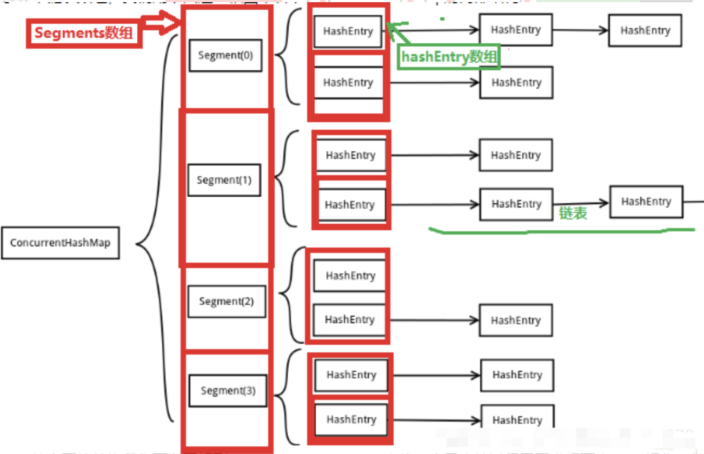

[TOC]

# ConcurrentHashMap

## 底层结构：数组（Segment） + 数组（HashEntry） + 链表（HashEntry节点）



### 构造函数

```java
public ConcurrentHashMap(int initialCapacity) {
    // (initialCapacity, 0.75, 16)
    this(initialCapacity, DEFAULT_LOAD_FACTOR, DEFAULT_CONCURRENCY_LEVEL);
}

public ConcurrentHashMap() {
    // (16, 0.75, 16)
    this(DEFAULT_INITIAL_CAPACITY, DEFAULT_LOAD_FACTOR, DEFAULT_CONCURRENCY_LEVEL);
}

public ConcurrentHashMap(int initialCapacity,
                            float loadFactor, int concurrencyLevel) {
    if (!(loadFactor > 0) || initialCapacity < 0 || concurrencyLevel <= 0)
        throw new IllegalArgumentException();
    if (concurrencyLevel > MAX_SEGMENTS)
        concurrencyLevel = MAX_SEGMENTS;
    // Find power-of-two sizes best matching arguments
    int sshift = 0;
    int ssize = 1;
    while (ssize < concurrencyLevel) {
        ++sshift;
        ssize <<= 1;
    }
    this.segmentShift = 32 - sshift;
    this.segmentMask = ssize - 1;
    if (initialCapacity > MAXIMUM_CAPACITY)
        initialCapacity = MAXIMUM_CAPACITY;
    int c = initialCapacity / ssize;
    if (c * ssize < initialCapacity)
        ++c;
    int cap = MIN_SEGMENT_TABLE_CAPACITY;
    while (cap < c)
        cap <<= 1;
    // create segments and segments[0]
    Segment<K,V> s0 =
        new Segment<K,V>(loadFactor, (int)(cap * loadFactor),
                            (HashEntry<K,V>[])new HashEntry[cap]);
    Segment<K,V>[] ss = (Segment<K,V>[])new Segment[ssize];
    UNSAFE.putOrderedObject(ss, SBASE, s0); // ordered write of segments[0]
    this.segments = ss;
}
```

### 会生成`segment[0]`,用作原型,后面15个位置都要new的


## put方法

### 确定segment数组位置，并得到Segment对象，再继续处理

* segment数组下标位置

```java
int j = (hash >>> segmentShift) & segmentMask;

segmentMask： 15（sszie - 1）

segmentShift: 28（this.segmentShift = 32 - sshift;）

sshift: 4 (2^4 = 16, 16是segment数组大小)
```

* 有了下标j，去得到segment[j]的Segment对象（有并发问题？）

```java
/**
    * Returns the segment for the given index, creating it and
    * recording in segment table (via CAS) if not already present.
    *
    * @param k the index
    * @return the segment
    */
@SuppressWarnings("unchecked")
private Segment<K,V> ensureSegment(int k) {
    final Segment<K,V>[] ss = this.segments;
    long u = (k << SSHIFT) + SBASE; // raw offset
    Segment<K,V> seg;
    if ((seg = (Segment<K,V>)UNSAFE.getObjectVolatile(ss, u)) == null) {
        Segment<K,V> proto = ss[0]; // use segment 0 as prototype
        int cap = proto.table.length;
        float lf = proto.loadFactor;
        int threshold = (int)(cap * lf);
        HashEntry<K,V>[] tab = (HashEntry<K,V>[])new HashEntry[cap];
        if ((seg = (Segment<K,V>)UNSAFE.getObjectVolatile(ss, u))
            == null) { // recheck
            Segment<K,V> s = new Segment<K,V>(lf, threshold, tab);
            while ((seg = (Segment<K,V>)UNSAFE.getObjectVolatile(ss, u))
                    == null) {
                if (UNSAFE.compareAndSwapObject(ss, u, null, seg = s))
                    break;
            }
        }
    }
    return seg;
}
```

* unsage操作获取或者生成Segment对象

`UNSAFE.getObjectVolatile(ss, u)`

仍然是通过CAS操作去把新生产的Segment对象放到j位置

```java
if (UNSAFE.compareAndSwapObject(ss, u, null, seg = s))
    break;
```

### Segment对象进行put元素

```java
final V put(K key, int hash, V value, boolean onlyIfAbsent) {
    HashEntry<K,V> node = tryLock() ? null :
        scanAndLockForPut(key, hash, value);
    V oldValue;
    try {
        HashEntry<K,V>[] tab = table;
        int index = (tab.length - 1) & hash;
        HashEntry<K,V> first = entryAt(tab, index);
        for (HashEntry<K,V> e = first;;) {
            if (e != null) {
                K k;
                if ((k = e.key) == key ||
                    (e.hash == hash && key.equals(k))) {
                    oldValue = e.value;
                    if (!onlyIfAbsent) {
                        e.value = value;
                        ++modCount;
                    }
                    break;
                }
                e = e.next;
            }
            else {
                if (node != null)
                    node.setNext(first);
                else
                    node = new HashEntry<K,V>(hash, key, value, first);
                int c = count + 1;
                if (c > threshold && tab.length < MAXIMUM_CAPACITY)
                    rehash(node);
                else
                    setEntryAt(tab, index, node);
                ++modCount;
                count = c;
                oldValue = null;
                break;
            }
        }
    } finally {
        unlock();
    }
    return oldValue;
}
```

### 确定再Segment对象中的HashEntry数组table的位置

```java
HashEntry<K,V>[] tab = table;
int index = (tab.length - 1) & hash;
```

<font color='red'>插入链表中的线程安全使用`加锁`而不是CAS</font>

### CAS获取Segment对象内部tables的index位置头部HashEntry

`HashEntry<K,V> first = entryAt(tab, index);`

构造新对象HashEntry，或者取旧对象HashEntry；新HashEntry对象使用头插法设置到`tables[index]`位置

### put方法刚开始尝试加锁？

`tryLock()`成功，则直接进行后续操作；失败则进行`scanAndLockForPut(key, hash, value);`方法，仍然是尝试获取锁

```java
/**
    * Scans for a node containing given key while trying to
    * acquire lock, creating and returning one if not found. Upon
    * return, guarantees that lock is held. UNlike in most
    * methods, calls to method equals are not screened: Since
    * traversal speed doesn't matter, we might as well help warm
    * up the associated code and accesses as well.
    *
    * @return a new node if key not found, else null
    */
private HashEntry<K,V> scanAndLockForPut(K key, int hash, V value) {
    HashEntry<K,V> first = entryForHash(this, hash);
    HashEntry<K,V> e = first;
    HashEntry<K,V> node = null;
    int retries = -1; // negative while locating node
    while (!tryLock()) {
        HashEntry<K,V> f; // to recheck first below
        if (retries < 0) {
            if (e == null) {
                if (node == null) // speculatively create node
                    node = new HashEntry<K,V>(hash, key, value, null);
                retries = 0;
            }
            else if (key.equals(e.key))
                retries = 0;
            else
                e = e.next;
        }
        else if (++retries > MAX_SCAN_RETRIES) {
            lock();
            break;
        }
        else if ((retries & 1) == 0 &&
                    (f = entryForHash(this, hash)) != first) {
            e = first = f; // re-traverse if entry changed
            retries = -1;
        }
    }
    return node;
}
```

`reentrantLock.lock()`(阻塞方法) vs `while(!reentranLock.tryLock())`(耗CPU，不断判断)

但是while里面可以做其它事情，降低CPU消耗；while执行次数可以限制，超过多少次再进行`reentrantLock.lock()`

```java
while(!reentranLock.tryLock()){
    // do something else
}
```

多线程并发put可以提前`new`新的`HashEntry`对象，后面只需要头插法设置next:`node.setNext(first);`

### Segment对象内部tables会判断扩容

```java
/**
    * Doubles size of table and repacks entries, also adding the
    * given node to new table
    */
@SuppressWarnings("unchecked")
private void rehash(HashEntry<K,V> node) {
    /*
        * Reclassify nodes in each list to new table.  Because we
        * are using power-of-two expansion, the elements from
        * each bin must either stay at same index, or move with a
        * power of two offset. We eliminate unnecessary node
        * creation by catching cases where old nodes can be
        * reused because their next fields won't change.
        * Statistically, at the default threshold, only about
        * one-sixth of them need cloning when a table
        * doubles. The nodes they replace will be garbage
        * collectable as soon as they are no longer referenced by
        * any reader thread that may be in the midst of
        * concurrently traversing table. Entry accesses use plain
        * array indexing because they are followed by volatile
        * table write.
        */
    HashEntry<K,V>[] oldTable = table;
    int oldCapacity = oldTable.length;
    // 扩大为原来的2倍
    int newCapacity = oldCapacity << 1;
    threshold = (int)(newCapacity * loadFactor);
    HashEntry<K,V>[] newTable =
        (HashEntry<K,V>[]) new HashEntry[newCapacity];
    int sizeMask = newCapacity - 1;
    // 遍历老的table的每一个 HashEntry 链表
    for (int i = 0; i < oldCapacity ; i++) {
        HashEntry<K,V> e = oldTable[i];
        if (e != null) {
            // 当前位置的下一个元素
            HashEntry<K,V> next = e.next;
            // 当前位置
            int idx = e.hash & sizeMask;
            if (next == null)   //  Single node on list
                newTable[idx] = e;
            else { // Reuse consecutive sequence at same slot
                // 有连续序列在新数组中一个下标位置的话，一起转移到新tables
                // 类比：蜘蛛纸牌的连续序列
                HashEntry<K,V> lastRun = e;
                int lastIdx = idx;
                for (HashEntry<K,V> last = next;
                        last != null;
                        last = last.next) {
                    int k = last.hash & sizeMask;
                    if (k != lastIdx) {
                        lastIdx = k;
                        lastRun = last;
                    }
                }
                newTable[lastIdx] = lastRun;
                // Clone remaining nodes
                for (HashEntry<K,V> p = e; p != lastRun; p = p.next) {
                    V v = p.value;
                    int h = p.hash;
                    int k = h & sizeMask;
                    HashEntry<K,V> n = newTable[k];
                    newTable[k] = new HashEntry<K,V>(h, p.key, v, n);
                }
            }
        }
    }
    // 扩容完成后，在添加新元素
    int nodeIndex = node.hash & sizeMask; // add the new node
    node.setNext(newTable[nodeIndex]);
    newTable[nodeIndex] = node;
    // 最后老的table赋值给新的数组
    table = newTable;
}
```

## `get(Object key)`

```java
/**
    * Returns the value to which the specified key is mapped,
    * or {@code null} if this map contains no mapping for the key.
    *
    * <p>More formally, if this map contains a mapping from a key
    * {@code k} to a value {@code v} such that {@code key.equals(k)},
    * then this method returns {@code v}; otherwise it returns
    * {@code null}.  (There can be at most one such mapping.)
    *
    * @throws NullPointerException if the specified key is null
    */
public V get(Object key) {
    Segment<K,V> s; // manually integrate access methods to reduce overhead
    HashEntry<K,V>[] tab;
    int h = hash(key);
    long u = (((h >>> segmentShift) & segmentMask) << SSHIFT) + SBASE;
    // unsafe 获取 segment数组位置对象
    if ((s = (Segment<K,V>)UNSAFE.getObjectVolatile(segments, u)) != null &&
        (tab = s.table) != null) {
        // unsafe 获取 Segment对象里面的HashEntry数组位置的头节点
        // 遍历链表获取到直接返回
        for (HashEntry<K,V> e = (HashEntry<K,V>) UNSAFE.getObjectVolatile
                    (tab, ((long)(((tab.length - 1) & h)) << TSHIFT) + TBASE);
                e != null; e = e.next) {
            K k;
            if ((k = e.key) == key || (e.hash == h && key.equals(k)))
                return e.value;
        }
    }
    return null;
}
```
