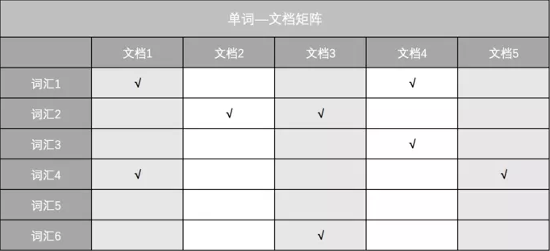

[TOC]

# 倒排索引

## 倒排索引与正序(排)索引

一般的正排索引

* doc1 (w1, s4)
* doc2 (w3)
* doc3 (w2, w6)
* doc4 (w1, w3)
* doc5 (w4)

查询要求"某个单词在那些文档中出现过"(即常见的根据关键词检索需求，如网页检索)，按照正排，那么必须遍历所有的文档，文档下所有的记录去匹配要求的单词；相当于全表扫描了。

* 单词-文档矩阵

* 纵向看：表示某文档包含哪些单词（如文档1包含单词1和单词4）
* 横向看：表示某单词出现在哪些文档中（如单词1出现在文档1和文档4中）
