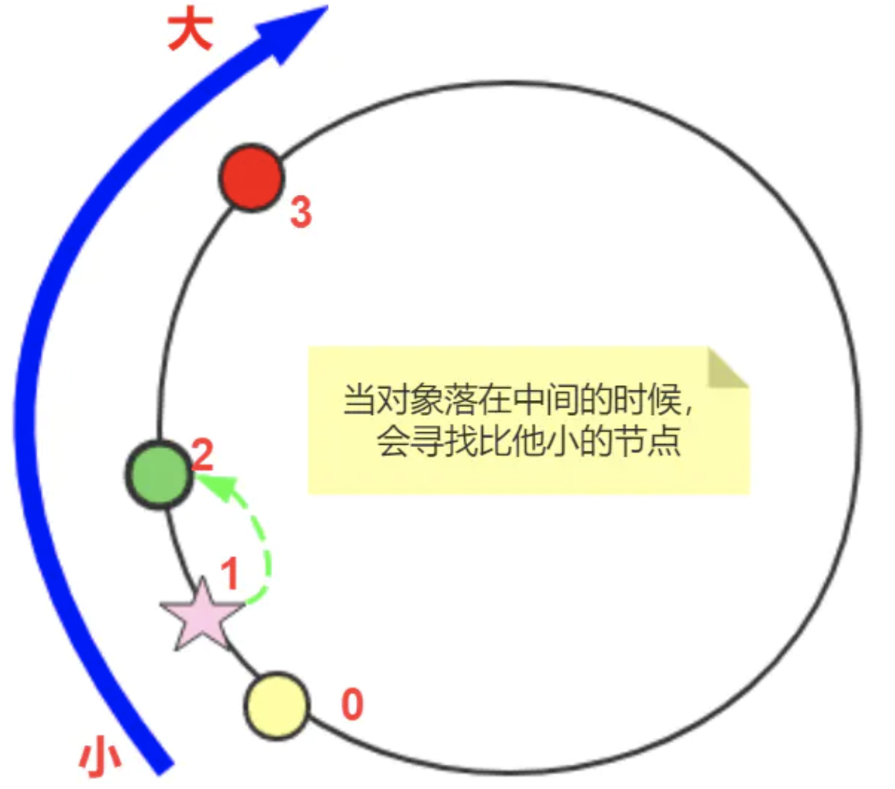

[TOC]

# TreeMap

* TreeMap的顺序是Key的自然顺序（如整数从小到大），也可以指定比较函数，但不是插入的顺序
* 底层基于红黑树

## 基于TreeMap实现一致性Hash（无虚拟节点）

```java
/**
 * 先构造一个长度为2^32的整数环（这个环被称为一致性Hash环），根据节点名称的Hash值（其分布为[0, 2^32-1]）
 * 将服务器节点放置在这个Hash环上，然后根据数据的Key值计算得到其Hash值（其分布也为[0, 2^32-1]），
 * 接着在Hash环上顺时针查找距离这个Key值的Hash值最近的服务器节点，完成Key到服务器的映射查找。
 */
class ConsistantHash {
    // 圆环  用TreeMap的Key有序
    private TreeMap<Long, Node> circle = new TreeMap();

    // 机器结点
    private List<Node> realNodes = new ArrayList();

    /**
     * 添加一个机器
     * @param node
     */
    public void addNode(Node node){
        realNodes.add(node);
        // 根据机器名称获取md5值：[0, 2^32-1]
        Long nodeKey = md5(node.toString());
        System.out.println(node.toString() + " md5:" + nodeKey);
        circle.put(nodeKey, node);
    }

    /**
     * 删除一个机器
     * @param node
     */
    public void removeNode(Node node){
        realNodes.remove(node);

        Long nodeKey = md5(node.toString());
        circle.remove(nodeKey);
    }

    /**
     * 根据key获取机器：即获取距离这个Key值的Hash值最近的服务器节点
     * @param key
     * @return
     */
    public Node getNode(String key) {
        // treemap 转成 排序好的map
        Long keyMd5 = md5(key);
        // 获取大于等于fromKey的所有元素
        SortedMap<Long, Node> sortedMap = circle.tailMap(keyMd5);

        Long k;
        if (sortedMap.isEmpty()) {
            // 返回整个集合中最小Key的key
            k = circle.firstKey();
        } else {
            // 距离 keyMd5 最近的节点
            k = sortedMap.firstKey();
        }
        Node node = circle.get(k);

        // 正常情况下 md5(key) < md5(node)
        System.out.println(key + "(" + keyMd5 + ") --->" + node.toString() + "(" + md5(node.toString()) + ")");
        return node;
    }


    private long md5(String key){
        byte[] bKey = DigestUtils.md5(key.getBytes());
        long res = ((long) (bKey[3] & 0xFF) << 24) | ((long) (bKey[2] & 0xFF) << 16) | ((long) (bKey[1] & 0xFF) << 8)| bKey[0] & 0xFF;
        return res;
    }

    static class Node{
        private int nodeNum;

        public Node(int num){
            this.nodeNum = num;
        }

        @Override
        public String toString(){
            return "host-" + nodeNum ;
        }
    }
}

public class Main {

    public static void main(String[] args) throws Exception {
        ConsistantHash consistantHash = new ConsistantHash();
        for(int i=0;i<4;i++){
            consistantHash.addNode(new ConsistantHash.Node(i));
        }

        for(int i=0;i<4;i++){
            System.out.println(consistantHash.getNode("127.0.0.1:"+i));
        }
    }

}
```



## 基于TreeMap实现一致性Hash（有虚拟节点）

```java
class ConsistentHashing {
    // 物理节点
    private Set<String> physicalNodes = new TreeSet<String>() {
        {
            add("192.168.1.101");
            add("192.168.1.102");
            add("192.168.1.103");
            add("192.168.1.104");
        }
    };

    //虚拟节点
    private final int VIRTUAL_COPIES = 1048576; // 物理节点至虚拟节点的复制倍数
    private TreeMap<Long, String> virtualNodes = new TreeMap<>(); // 哈希值 => 物理节点

    // 32位的 Fowler-Noll-Vo 哈希算法
    // https://en.wikipedia.org/wiki/Fowler–Noll–Vo_hash_function
    private static Long FNVHash(String key) {
        final int p = 16777619;
        Long hash = 2166136261L;
        for (int idx = 0, num = key.length(); idx < num; ++idx) {
            hash = (hash ^ key.charAt(idx)) * p;
        }
        hash += hash << 13;
        hash ^= hash >> 7;
        hash += hash << 3;
        hash ^= hash >> 17;
        hash += hash << 5;

        if (hash < 0) {
            hash = Math.abs(hash);
        }
        return hash;
    }

    // 根据物理节点，构建虚拟节点映射表
    // 每个物理主机都扩充成 VIRTUAL_COPIES 个虚拟节点
    public ConsistentHashing() {
        for (String nodeIp : physicalNodes) {
            addPhysicalNode(nodeIp);
        }
    }

    // 添加物理节点
    public void addPhysicalNode(String nodeIp) {
        for (int idx = 0; idx < VIRTUAL_COPIES; ++idx) {
            long hash = FNVHash(nodeIp + "#" + idx);
            virtualNodes.put(hash, nodeIp);
        }
    }

    // 删除物理节点
    public void removePhysicalNode(String nodeIp) {
        for (int idx = 0; idx < VIRTUAL_COPIES; ++idx) {
            long hash = FNVHash(nodeIp + "#" + idx);
            virtualNodes.remove(hash);
        }
    }

    // 查找对象映射的节点
    // 根据key从虚拟节点获取对应距离最近的节点所对应的主机
    public String getObjectNode(String object) {
        long hash = FNVHash(object);
        SortedMap<Long, String> tailMap = virtualNodes.tailMap(hash); // 所有大于 hash 的节点
        Long key = tailMap.isEmpty() ? virtualNodes.firstKey() : tailMap.firstKey();
        return virtualNodes.get(key);
    }

    // 统计对象与节点的映射关系
    public void dumpObjectNodeMap(String label, int objectMin, int objectMax) {
        // 统计[objectMin,objectMax]范围内，每一个值会落到哪个节点机器上
        Map<String, Integer> objectNodeMap = new TreeMap<>(); // IP => COUNT
        for (int object = objectMin; object <= objectMax; ++object) {
            String nodeIp = getObjectNode(Integer.toString(object));
            Integer count = objectNodeMap.get(nodeIp);
            objectNodeMap.put(nodeIp, (count == null ? 0 : count + 1));
        }

        // 打印每个机器负责的百分比
        double totalCount = objectMax - objectMin + 1;
        System.out.println("======== " + label + " ========");
        for (Map.Entry<String, Integer> entry : objectNodeMap.entrySet()) {
            long percent = (int) (100 * entry.getValue() / totalCount);
            System.out.println("IP=" + entry.getKey() + ": RATE=" + percent + "%");
        }
    }
}

public class Main {

    public static void main(String[] args) {
        ConsistentHashing ch = new ConsistentHashing();

        // 初始情况
        ch.dumpObjectNodeMap("初始情况", 0, 65536);

        // 删除物理节点
        ch.removePhysicalNode("192.168.1.103");
        ch.dumpObjectNodeMap("删除物理节点", 0, 65536);

        // 添加物理节点
        ch.addPhysicalNode("192.168.1.108");
        ch.dumpObjectNodeMap("添加物理节点", 0, 65536);
    }

}
```

* 输出

```java
======== 初始情况 ========
IP=192.168.1.101: RATE=24%
IP=192.168.1.102: RATE=24%
IP=192.168.1.103: RATE=25%
IP=192.168.1.104: RATE=25%
======== 删除物理节点 ========
IP=192.168.1.101: RATE=33%
IP=192.168.1.102: RATE=33%
IP=192.168.1.104: RATE=33%
======== 添加物理节点 ========
IP=192.168.1.101: RATE=25%
IP=192.168.1.102: RATE=24%
IP=192.168.1.104: RATE=24%
IP=192.168.1.108: RATE=24%
```
