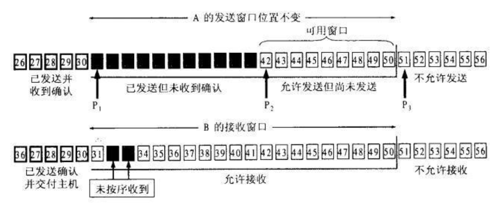
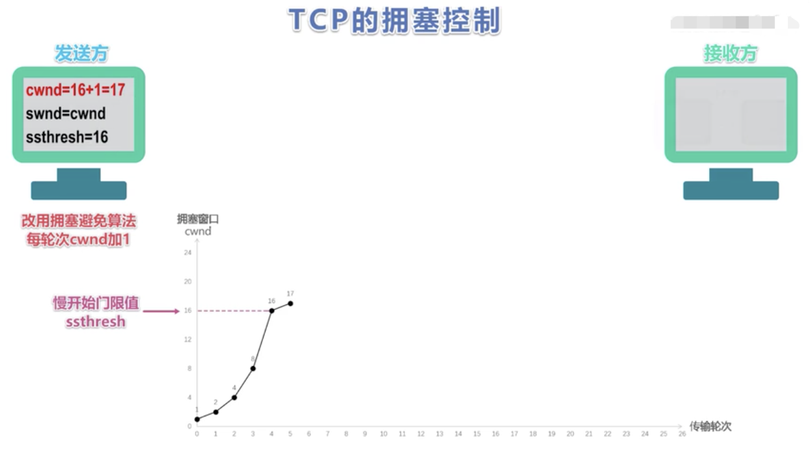
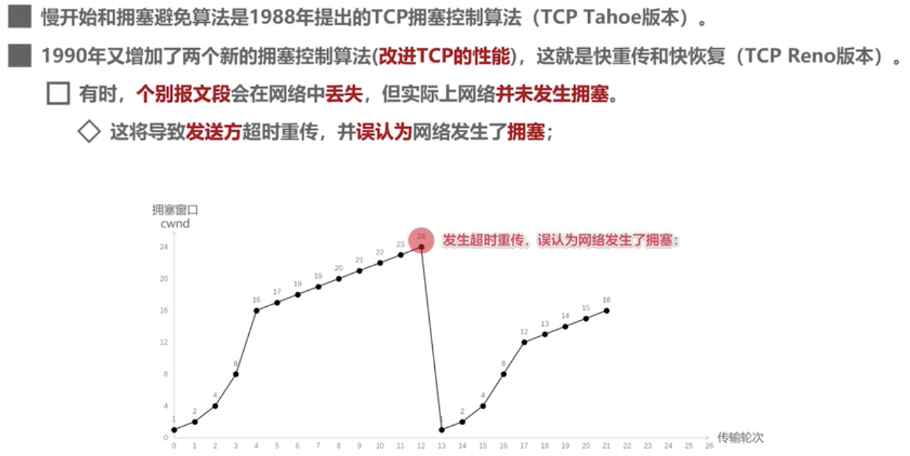
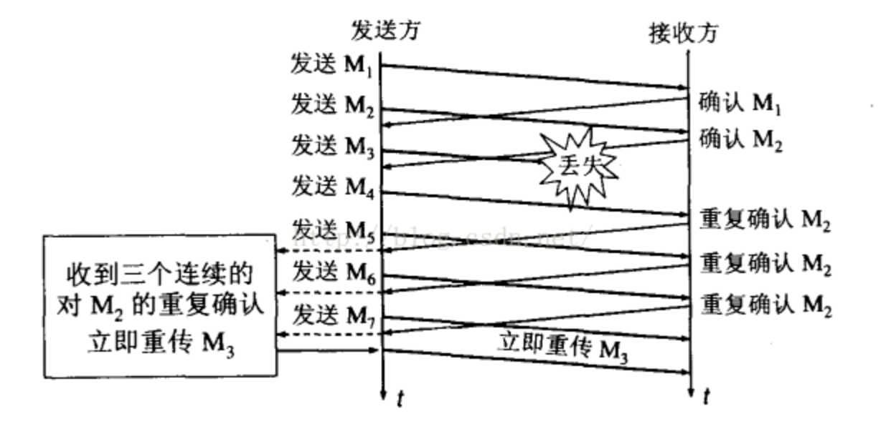
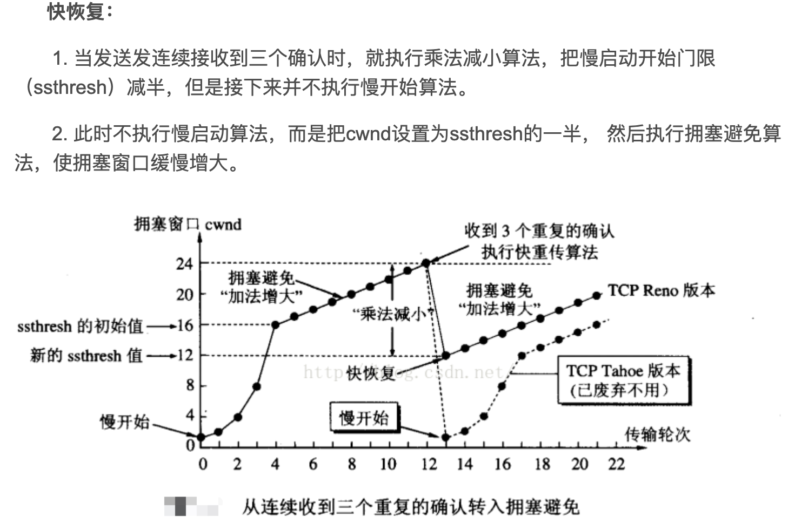

[TOC]

# 网络相关

## TCP

什么是TCP协议：面向连接的，可靠的，传输层协议

发送和接收的速率不一样 =》 发送缓存 & 接收缓存

TCP利用`发送缓存 & 接收缓存`来进行**流量控制**和**差错控制**

IP层必须以分组为单位发送数据，而不是字节流，所以TCP把若干字节流组成一个分组，称为**报文段**，TCP给报文段加上TCP头部，然后交给IP层。报文段在接收时有可能会失序，丢失，或者受到损伤和重传

### TCP报文头部

* 端口号16位：`pow(2, 64) - 1 = 65535`(网络端口最大65535)

* URG标志，表示紧急指针（urgent pointer）是否有效。
* ACK标志，表示确认号是否有效。我们称携带ACK标识的TCP报文段为确认报文段。
* PSH标志，提示接收端应用程序应该立即从TCP接收缓冲区中读走数据，为接收后续数据腾出空间（如果应用程序不将接收到的数据读走，它们就会一直停留在TCP接收缓冲区中）。
* RST标志，表示要求对方重新建立连接。我们称携带RST标志的TCP报文段为复位报文段。
* SYN标志，表示请求建立一个连接。我们称携带SYN标志的TCP报文段为同步报文段。
* FIN标志，表示通知对方本端要关闭连接了。我们称携带FIN标志的TCP报文段为结束报文段。

* 16位窗口大小（window size）：是TCP流量控制的一个手段。这里说的窗口，指的是接收通告窗口（Receiver Window，RWND）。它告诉对方本端的TCP接收缓冲区还能容纳多少字节的数据，这样对方就可以控制发送数据的速度。
* 16位校验和（TCP check sum）：由发送端填充，接收端对TCP报文段执行CRC算法以检验TCP报文段在传输过程中是否损坏。注意，这个校验不仅包括TCP头部，也包括数据部分。这也是TCP可靠传输的一个重要保障。
* 16位紧急指针（urgent pointer）：是一个正的偏移量。它和序号字段的值相加表示最后一个紧急数据的下一字节的序号。因此，确切地说，这个字段是紧急指针相对当前序号的偏移，不妨称之为紧急偏移。TCP的紧急指针是发送端向接收端发送紧急数据的方法。

## TCP如何保证可靠性？

1. 校验和

TCP检验和的计算与UDP一样，在计算时要加上12byte的伪首部，检验范围包括TCP首部及数据部分，但是UDP的检验和字段为可选的，而TCP中是必须有的。计算方法为：在发送方将整个报文段分为多个16位的段，然后将所有段进行反码相加，将结果存放在检验和字段中，接收方用相同的方法进行计算，如最终结果为检验字段所有位是全1则正确（UDP中为0是正确），否则存在错误。

2. 序列号

TCP将每个字节的数据都进行了编号，这就是序列号。序列号的作用：
    * 保证可靠性（当接收到的数据总少了某个序号的数据时，能马上知道）
    * 保证数据的按序到达
    * 提高效率，可实现多次发送，一次确认
    * 去除重复数据

数据传输过程中的**确认应答处理**、**重发控制**以及重复控制等功能都可以通过序列号来实现

3. 确认应答机制（ACK）

TCP通过确认应答机制实现可靠的数据传输。在TCP的首部中有一个标志位——**ACK**，此标志位表示确认号是否有效。接收方对于按序到达的数据会进行确认，当标志位ACK=1时确认首部的确认字段有效。进行确认时，确认字段值表示这个值之前的数据都已经按序到达了。而发送方如果收到了已发送的数据的确认报文，则继续传输下一部分数据；而如果等待了一定时间还没有收到确认报文就会启动重传机制。

4. 超时重传机制

TCP协议要求在发送端每发送一个报文段，就启动一个定时器并等待确认信息；接收端成功接收新数据后返回确认信息。若在定时器超时前数据未能被确认，TCP就认为报文段中的数据已丢失或损坏，需要对报文段中的数据重新组织和重传。

5. 连接管理机制（三次握手和四次挥手）

参考：<a href="https://blog.csdn.net/qq_26437925/article/details/52100293" target="_blank">tcp三次握手，Wireshark实践</a>

参考：<a href="https://blog.csdn.net/qq_26437925/article/details/52684968" target="_blank">tcp四次挥手</a>

* 为什么握手？为什么三次？

TCP 的可靠性含义： 接收方收到的数据是完整， 有序， 无差错的。需要进行握手来同步序列号

序号并不是从 0 开始的， 而是由发送方随机选择的初始序列号 ( Initial Sequence Number, ISN )开始 。 由于 TCP 是一个双向通信协议， 通信双方都有能力发送信息， 并接收响应。 因此， 通信双方都需要随机产生一个初始的序列号， 并且把这个起始值告诉对方。

传输开始前，A知道自己的序列号，B知道自己的序列号。第一次握手，B知道了A的序列号；第二次握手，A知道B知道A的序列号；第三次握手，B知道A知道B的序列号。这样，对于A和B而言，都知道“对方已经知道自己的序列号”这一现实，所以TCP连接可以建立。

6. 流量控制

7. 拥塞控制

### 流量控制

Sender won’t overflow receiver’s buffer by transmitting too much, too fast.

流量控制就是：让发送方的发送速率不要太快，让接收方来得及接受。利用**滑动窗口**机制可以很方便的在TCP连接上实现对发送方的流量控制

#### 滑动窗口

* tcp双方都各自维护一个发送窗口和一个接收窗口

（1）接收端将自己可以接收的缓冲区大小放入TCP首部中的"窗口大小"字段，通过ACK来通知发送端
（2）窗口大小字段越大，说明网络的吞吐率越高
（3）窗口大小指的是无需等待确认应答而可以继续发送数据的最大值，即就是说不需要接收端的应答，可以一次连续的发送数据
（4）操作系统内核为了维护滑动窗口，需要开辟发送缓冲区，来记录当前还有哪些数据没有应答，只有确认应答过的数据，才能从缓冲区删掉

* ps:发送缓冲区如果太大，就会有空间开销

（5）接收端一旦发现自己的缓冲区快满了，就会将窗口大小设置成一个更小的值通知给发送端，发送端收到这个值后，就会减慢自己的发送速度

（6）如果接收端发现自己的缓冲区满了，就会将窗口的大小设置为0，此时发送端将不再发送数据，但是需要定期发送一个窗口探测数据段，使接收端把窗口大小告诉发送端

ps：在TCP的首部中，有一个16为窗口字段，此字段就是用来存放窗口大小信息的

##### 滑动机制

在TCP中，窗口的大小是在TCP三次握手后协定的，并且窗口的大小并不是固定的，而是会随着网络的情况进行调整。

主要的方式就是返回的ACK中会包含自己的接收窗口的大小，并且利用大小来控制发送方的数据发送：

1. 发送窗口只有收到发送窗口内字节的ACK确认，才会移动发送窗口的左边界。
2. 接收窗口只有在前面所有的段都确认的情况下才会移动左边界。当在前面还有字节未接收但收到后面字节的情况下，窗口不会移动，并不对后续字节确认。以此确保对端会对这些数据重传。
3. 遵循快速重传、累计确认、选择确认等规则。
4. 发送方发的window size = 8192;就是接收端最多发送8192字节，这个8192一般就是发送方接收缓存的大小。

TCP的滑动窗口协议有什么意义呢？
* 可靠性，滑动窗口只有在队列前部的被确认之后，才会往后移动，保证数据包被接收方确认并接收。
* 传输效率，假如没有窗口，服务端是杂乱无章地进行发包，因为TCP的队首效应，如果有前面的包没有发送成功，就会不停的重试，反而造成更差的传输效率。
* 稳定性，TCP的滑动窗口大小，是整个复杂网络商榷的结果，会进行动态调整，可以尽量地避免网络拥塞。

### 拥塞控制

拥塞控制就是防止过多的数据注入到网络中，这样可以使网络中的路由器或链路不致过载。拥塞控制所要做的都有一个前提，就是网络能承受现有的网络负荷。拥塞问题是一个全局性的问题,涉及到所有的主机、所有的路由器、以及与降低网络传输性能有关的所有因素

换句话说：若对网络中某一资源（网络带宽，交换节点中的缓存，CPU等都是资源）的需求超过了该资源所能提供的可用部分，网络性能就要变坏，这种情况就叫做拥塞；如果出现拥塞而不进行控制，整个网络的吞吐量将随着负荷的增大而下降

因特网建议标准RFC2581定义了进行拥塞控制的四种算法

* 慢开始（Slow-start)
* 拥塞避免（Congestion Avoidance)
* 快重传（Fast Restrangsmit)
* 快恢复（Fast Recovery）

#### 慢开始 & 拥塞避免

#### 快重传 & 快恢复

快重传：使发送方尽早知道发生了个别报文段的丢失；
    * 要求接收方不要等待自己发送数据时才进行捎带确认，而是要立即发送确认
    * 即使收到了失序的报文段也要立即发出对已收到报文段对重复确认
    * 发送方一但**收到3个连续的重复确认**，就将相应的报文段**立即重传**，而不是等该报文段的超时重传计时器超时再重传

## UDP

UDP首部有8个字节，由4个字段构成，每个字段都是两个字节

1. 源端口： 源端口号，需要对方回信时选用，不需要时全部置0.
2. 目的端口：目的端口号，在终点交付报文的时候需要用到。
3. 长度：UDP的数据报的长度（包括首部和数据）其最小值为8（只有首部）
4. 校验和：检测UDP数据报在传输中是否有错，有错则丢弃。该字段是可选的，当源主机不想计算校验和，则直接令该字段全为0.

当传输层从IP层收到UDP数据报时，就根据首部中的目的端口，把UDP数据报通过相应的端口，上交给应用进程。如果接收方UDP发现收到的报文中的目的端口号不正确（不存在对应端口号的应用进程0），就丢弃该报文，并由ICMP发送“端口不可达”差错报文给对方。

### UDP特点

UDP无连接，时间上不存在建立连接需要的时延。空间上，TCP需要在端系统中维护连接状态，需要一定的开销。此连接装入包括接收和发送缓存，拥塞控制参数和序号与确认号的参数。UCP不维护连接状态，也不跟踪这些参数，开销小。空间和时间上都具有优势。

UDP没有拥塞控制，应用层能够更好的控制要发送的数据和发送时间，网络中的拥塞控制也不会影响主机的发送速率。某些实时应用要求以稳定的速度发送，能容 忍一些数据的丢失，但是不能允许有较大的时延（比如实时视频，直播等）

UDP提供尽最大努力的交付，不保证可靠交付。所有维护传输可靠性的工作需要用户在应用层来完成。没有TCP的确认机制、重传机制。如果因为网络原因没有传送到对端，UDP也不会给应用层返回错误信息

UDP是面向报文的，对应用层交下来的报文，添加首部后直接乡下交付为IP层，既不合并，也不拆分，保留这些报文的边界。对IP层交上来UDP用户数据报，在去除首部后就原封不动地交付给上层应用进程，报文不可分割，是UDP数据报处理的最小单位。

UDP常用一次性传输比较少量数据的网络应用，如DNS,SNMP等，因为对于这些应用，若是采用TCP，为连接的创建，维护和拆除带来不小的开销。UDP也常用于多媒体应用（如IP电话，实时视频会议，流媒体等）数据的可靠传输对他们而言并不重要，TCP的拥塞控制会使他们有较大的延迟，也是不可容忍的；广播通信（广播、多播）。

## DNS（Domain Name System）

* DNS协议则是用来将域名转换为IP地址，也可以将IP地址转换为相应的域名地址（应用层协议）
* 补充：ARP和RARP是一对协议，分别是MAC和IP地址互查的（数据链路层协议）

DNS占用53号端口，既使用tcp，又使用udp

浏览器输入url的简单概述
1. 根据域名，进行DNS域名解析；
2. 拿到解析的IP地址，http访问先建立TCP连接；
3. 向IP地址，发送HTTP请求；
4. 服务器处理请求；
5. 返回响应结果；
6. 关闭TCP连接；
7. 浏览器解析HTML；
8. 浏览器布局渲染；

### 主机解析域名流程

1. 浏览器缓存：浏览器会按照一定的频率缓存DNS记录。
2. 操作系统缓存：如果浏览器缓存中找不到需要的DNS记录，那就去操作系统中找。
3. 路由缓存：路由器也有DNS缓存。
4. ISP的DNS服务器：ISP是互联网服务提供商(Internet Service Provider)的简称，ISP有专门的DNS服务器应对DNS查询请求。
5. 根服务器：ISP的DNS服务器还找不到的话，它就会向根服务器发出请求，进行递归查询（DNS服务器先问根域名服务器.com域名服务器的IP地址，然后再问.com域名服务器，依次类推）。

### DNS区域传送

DNS主从复制，就是将主DNS服务器的解析库复制传送至从DNS服务器，进而从服务器就可以进行正向、反向解析了。从服务器向主服务器查询更新数据，保证数据一致性，此为区域传送。也可以说，DNS区域传送，就是DNS主从复制的实现方法，DNS主从复制是DNS区域传送的表现形式。

DNS区域传送有两种方式
* axfr：完全区域传送
* ixfr：增量区域传送

当一个新的DNS服务器添加到区域中并配置为从DNS服务器时，它则会执行完全区域传送，在主DNS服务器上获取完整的资源记录副本；同时，为了保证数据同步，主域名服务器有更新时也会及时通知辅助域名服务器从而进行更新（增量区域传送）。

当一个辅助DNS服务器启动时，它需要与主DNS服务器通信，并加载数据信息；这种情况下，使用TCP协议。

### DNS负载均衡

当一个网站有足够多的用户的时候，假如每次请求的资源都位于同一台机器上面，那么这台机器随时可能会蹦掉。处理办法就是用DNS负载均衡技术，它的原理是在DNS服务器中为同一个主机名配置多个IP地址,在应答DNS查询时,DNS服务器对每个查询将以DNS文件中主机记录的IP地址按顺序返回不同的解析结果,将客户端的访问引导到不同的机器上去,使得不同的客户端访问不同的服务器,从而达到负载均衡的目的。例如可以根据每台机器的负载量，该机器离用户地理位置的距离等等。

### 为什么域名解析用UDP协议?

因为UDP快！UDP的DNS协议只要一个请求、一个应答就好了。而使用基于TCP的DNS协议要三次握手、发送数据以及应答、四次挥手。但是UDP协议传输内容不能超过512字节。不过客户端向DNS服务器查询域名，一般返回的内容都不超过512字节，用UDP传输即可。

### 为什么区域传送用TCP协议？

因为TCP协议的可靠性！因为TCP协议传输的内容大！你用最大只能传512字节的UDP协议，万一同步的数据大于512字节，你怎么办？
