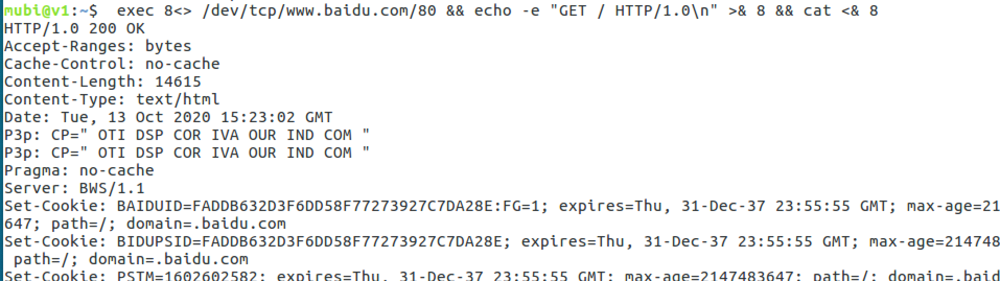
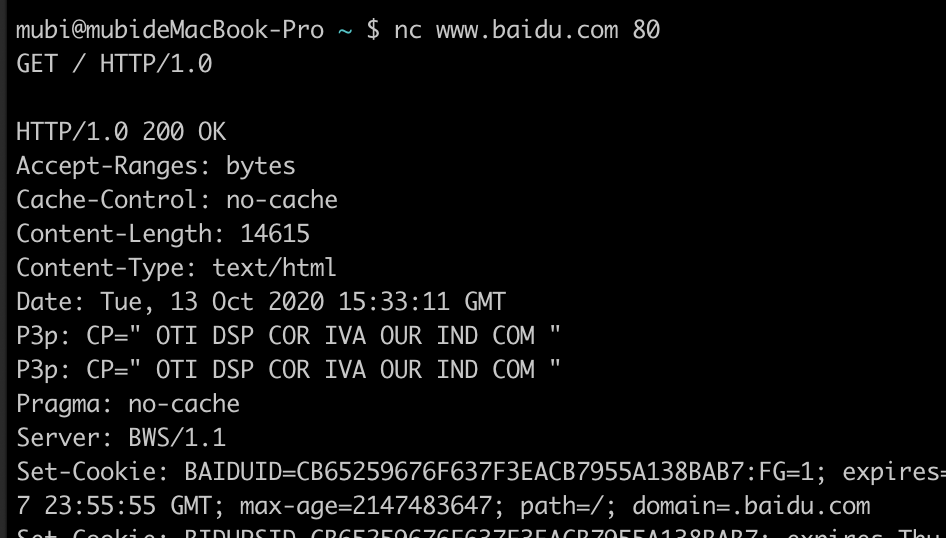
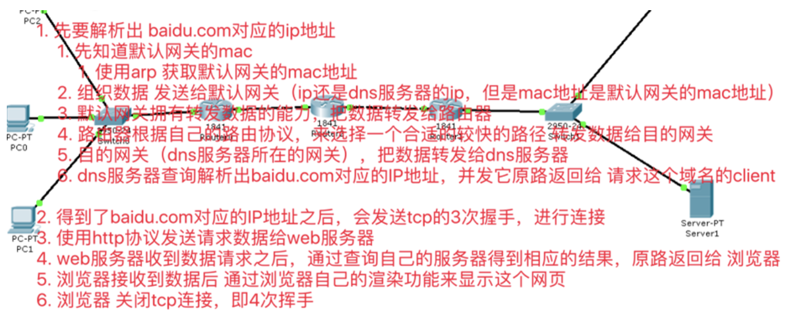

[TOC]

# tcp tcpdump

## http访问百度

`exec 8<> /dev/tcp/www.baidu.com/80`，和百度建立连接

给百度发送http协议的一个数据报文

```java
mubi@v1:~$ echo "GET / HTTP/1.0\n"
GET / HTTP/1.0\n
mubi@v1:~$ echo -e "GET / HTTP/1.0\n"
GET / HTTP/1.0

mubi@v1:~$ echo -e "GET / HTTP/1.0\n"
```

* 太久没操作，连接被干掉

```java
mubi@v1:~$ exec 8<> /dev/tcp/www.baidu.com/80
mubi@v1:~$ echo "GET / HTTP/1.0\n"
GET / HTTP/1.0\n
mubi@v1:~$ echo -e "GET / HTTP/1.0\n"
GET / HTTP/1.0

mubi@v1:~$ echo -e "GET / HTTP/1.0\n" >& 8
mubi@v1:~$ cat <& 8
cat: -: Connection reset by peer
mubi@v1:~$ exec 8<& -
mubi@v1:~$
```

* 快速操作(连接，发送请求，打印返回)，可以看到http请求和返回

`exec 8<> /dev/tcp/www.baidu.com/80 && echo -e "GET / HTTP/1.0\n" >& 8 && cat <& 8`



eg2: nc命令一样也可以完成如上效果



### 怎么建立连接：`exec 8<> /dev/www.baidu.com/80`

文件描述符8 输入输出 重定向到百度的80端口，内核完成连接

<font color='red'>连接是什么？</font>，三次握手建立连接？

1. 客户端  ----syn--------> 服务端
2. 客户端  <----ack syn---- 服务端
3. 客户端  ----ack--------> 服务端

在内核中双方已经开辟了资源（文件描述符，缓冲区，读写双方都确认好了）-------> 代表了建立了连接 -----> 连接可以认为是socket(一个文件描述符，四元组：ip:port, ip:port)

客户端(一个网卡)默认可以开启65535个端口去连接服务端进程：客户端消耗65535个端口，服务端消耗端口1个，即65535个`Socket`，1个`ServerSocket`

连接的4次挥手，完成后资源释放

1. 客户端  -----FIN------->  服务端
2. 客户端  <----ACK--------  服务端
3. 客户端  <----FIN--------  服务端
4. 客户端  -----ACK------->  服务端

### 抓包 `tcpdump -nn -i ens33 port 80`

```java
root@v1:/home/mubi# tcpdump -nn -i ens33 port 80
tcpdump: verbose output suppressed, use -v or -vv for full protocol decode
listening on ens33, link-type EN10MB (Ethernet), capture size 262144 bytes
```

```java
root@v1:/home/mubi# tcpdump -nn -i ens33 port 80
tcpdump: verbose output suppressed, use -v or -vv for full protocol decode
listening on ens33, link-type EN10MB (Ethernet), capture size 262144 bytes


17:25:18.926722 IP 172.16.227.250.35176 > 180.101.49.11.80: Flags [S], seq 3389913449, win 29200, options [mss 1460,sackOK,TS val 8250498 ecr 0,nop,wscale 7], length 0
17:25:18.943660 IP 180.101.49.11.80 > 172.16.227.250.35176: Flags [S.], seq 1673174687, ack 3389913450, win 64240, options [mss 1460], length 0
17:25:18.943689 IP 172.16.227.250.35176 > 180.101.49.11.80: Flags [.], ack 1, win 29200, length 0

17:25:18.943868 IP 172.16.227.250.35176 > 180.101.49.11.80: Flags [P.], seq 1:78, ack 1, win 29200, length 77: HTTP: GET / HTTP/1.1
17:25:18.944078 IP 180.101.49.11.80 > 172.16.227.250.35176: Flags [.], ack 78, win 64240, length 0
17:25:18.973557 IP 180.101.49.11.80 > 172.16.227.250.35176: Flags [P.], seq 1:2782, ack 78, win 64240, length 2781: HTTP: HTTP/1.1 200 OK
17:25:18.973584 IP 172.16.227.250.35176 > 180.101.49.11.80: Flags [.], ack 2782, win 33580, length 0

17:25:18.973920 IP 172.16.227.250.35176 > 180.101.49.11.80: Flags [F.], seq 78, ack 2782, win 33580, length 0
17:25:18.974319 IP 180.101.49.11.80 > 172.16.227.250.35176: Flags [.], ack 79, win 64239, length 0
17:25:41.822488 IP 180.101.49.11.80 > 172.16.227.250.35176: Flags [R.], seq 2782, ack 79, win 64239, length 0
```

## 路由网络

```java
mubi@v1:~$ ping www.baidu.com
PING www.a.shifen.com (180.101.49.11) 56(84) bytes of data.
64 bytes from 180.101.49.11: icmp_seq=1 ttl=128 time=15.8 ms
64 bytes from 180.101.49.11: icmp_seq=2 ttl=128 time=13.5 ms
64 bytes from 180.101.49.11: icmp_seq=3 ttl=128 time=13.7 ms
64 bytes from 180.101.49.11: icmp_seq=4 ttl=128 time=21.1 ms
64 bytes from 180.101.49.11: icmp_seq=5 ttl=128 time=15.8 ms
64 bytes from 180.101.49.11: icmp_seq=6 ttl=128 time=11.9 ms
64 bytes from 180.101.49.11: icmp_seq=7 ttl=128 time=12.9 ms
64 bytes from 180.101.49.11: icmp_seq=8 ttl=128 time=13.6 ms
64 bytes from 180.101.49.11: icmp_seq=9 ttl=128 time=10.7 ms
64 bytes from 180.101.49.11: icmp_seq=10 ttl=128 time=12.3 ms
64 bytes from 180.101.49.11: icmp_seq=11 ttl=128 time=11.8 ms
64 bytes from 180.101.49.11: icmp_seq=12 ttl=128 time=12.1 ms
64 bytes from 180.101.49.11: icmp_seq=13 ttl=128 time=10.1 ms
^C
--- www.a.shifen.com ping statistics ---
13 packets transmitted, 13 received, 0% packet loss, time 12026ms
rtt min/avg/max/mdev = 10.152/13.538/21.114/2.728 ms
mubi@v1:~$
```

* 路由表：下一跳（网络层）
* ARP表：mac地址（数据链路层）



### arp实战

地址解析协议，即ARP（Address Resolution Protocol），是根据IP地址获取物理地址的一个TCP/IP协议。主机发送信息时将包含目标IP地址的ARP请求广播到局域网络上的所有主机，并接收返回消息，以此确定目标的物理地址；收到返回消息后将该IP地址和物理地址存入本机ARP缓存中并保留一定时间，下次请求时直接查询ARP缓存以节约资源。地址解析协议是建立在网络中各个主机互相信任的基础上的，局域网络上的主机可以自主发送ARP应答消息，其他主机收到应答报文时不会检测该报文的真实性就会将其记入本机ARP缓存；由此攻击者就可以向某一主机发送伪ARP应答报文，使其发送的信息无法到达预期的主机或到达错误的主机，这就构成了一个ARP欺骗。ARP命令可用于查询本机ARP缓存中IP地址和MAC地址的对应关系、添加或删除静态对应关系等。相关协议有RARP、代理ARP。NDP用于在IPv6中代替地址解析协议。

* 地址解析协议ARP的作用

从网络层使用IP地址,解析出数据链路层使用的硬件地址(由IP地址解析出硬件地址); 当主机 A 欲向本局域网上的某个主机 B 发送 IP 数据报时，就先在其 ARP 高速缓存中查看有无主机 B 的 IP 地址。
    * 如有，就可查出其对应的硬件地址，再将此硬件地址写入 MAC 帧，然后通过局域网将该 MAC 帧发往此硬件地址。
    * 如没有，ARP 进程在本局域网上广播发送一个** ARP 请求分组**。收到 ARP 响应分组后，将得到的 IP 地址到硬件地址的映射写入 ARP 高速缓存。

### 删除arp缓存并抓包arp

```java
root@v1:/home/mubi# arp -a
? (172.16.227.254) at <incomplete> on ens33
gateway (172.16.227.2) at 00:50:56:f1:72:aa [ether] on ens33
root@v1:/home/mubi# arp -d gateway && curl www.baidu.com:80
```

```java
root@v1:/home/mubi# tcpdump -nn -i ens33 port 80 or arp
tcpdump: verbose output suppressed, use -v or -vv for full protocol decode
listening on ens33, link-type EN10MB (Ethernet), capture size 262144 bytes

18:05:26.033633 ARP, Request who-has 172.16.227.2 tell 172.16.227.250, length 28
18:05:26.033901 ARP, Reply 172.16.227.2 is-at 00:50:56:f1:72:aa, length 46
18:05:26.066734 IP 172.16.227.250.60380 > 180.101.49.12.80: Flags [S], seq 2090165025, win 29200, options [mss 1460,sackOK,TS val 8852283 ecr 0,nop,wscale 7], length 0
18:05:26.099315 IP 180.101.49.12.80 > 172.16.227.250.60380: Flags [S.], seq 969920260, ack 2090165026, win 64240, options [mss 1460], length 0
18:05:26.099358 IP 172.16.227.250.60380 > 180.101.49.12.80: Flags [.], ack 1, win 29200, length 0
18:05:26.099777 IP 172.16.227.250.60380 > 180.101.49.12.80: Flags [P.], seq 1:78, ack 1, win 29200, length 77: HTTP: GET / HTTP/1.1
18:05:26.100262 IP 180.101.49.12.80 > 172.16.227.250.60380: Flags [.], ack 78, win 64240, length 0
18:05:26.129948 IP 180.101.49.12.80 > 172.16.227.250.60380: Flags [P.], seq 1:2782, ack 78, win 64240, length 2781: HTTP: HTTP/1.1 200 OK
18:05:26.129981 IP 172.16.227.250.60380 > 180.101.49.12.80: Flags [.], ack 2782, win 33580, length 0
18:05:26.130368 IP 172.16.227.250.60380 > 180.101.49.12.80: Flags [F.], seq 78, ack 2782, win 33580, length 0
18:05:26.132047 IP 180.101.49.12.80 > 172.16.227.250.60380: Flags [.], ack 79, win 64239, length 0
18:05:43.399784 IP 180.101.49.12.80 > 172.16.227.250.60378: Flags [R.], seq 4123067679, ack 789318535, win 64239, length 0
```
