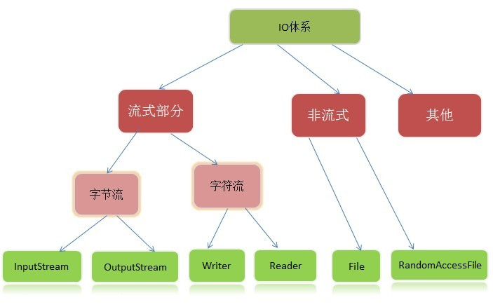

[TOC]

# Java IO 基础



流是一组有顺序的，有起点和终点的字节集合，是对数据传输的总称或抽象。即数据在两设备间的传输称为流，**流的本质是数据传输**，根据数据传输特性将流抽象为各种类，方便更直观的进行数据操作。

* 字节流 InputStream/OutStream

字节流能处理所有类型的数据（如图片、avi等），而字符流只能处理字符类型的数据。

* 字符流 Reader/Writer


# How Java I/O Works Internally at Lower Level?

## 缓冲区

计算机访问外部设备或文件，要比直接访问内存慢的多。如果我们每次调用`read()`方法或者`write()`方法访问外部的设备或文件，CPU就要花上最多的时间是在等外部设备响应，而不是数据处理。为此，我们开辟一个内存缓冲区的内存区域，程序每次调用`read()`方法或`write()`方法都是读写在这个缓冲区中。当这个缓冲区被装满后，系统才将这个缓冲区的内容一次集中写到外部设备或读取进来给CPU。使用缓冲区可以有效的提高CPU的使用率，能提高整个计算机系统的效率。在字符流操作中，所有的字符都是在内存中形成的，在字符流输出前都将保存在内存中的缓冲区内。

## 缓冲流

在读写数据时，让数据在缓冲区能减少系统实际对原始数据来源的存取次数，因为一次能做多个数据单位的操作，相较而言，对于从文件读取数据或将数据写入文件，比起缓冲区的读写要慢多了。所以使用有缓冲区的流，一般都会比没有缓冲区的流效率更高，拥有缓冲区的流别称为缓冲流，包括BufferedInputStream、BufferedOutputStream类和BufferedReader、BufferedWriter类。缓冲流把数据从原始流成块读入或把数据积累到一个大数据块后再成批写出，通过减少通过资源的读写次数来加快程序的执行

## 用户空间,内核空间,磁盘


在磁盘空间和用户空间中加一个内核空间的缓存区的原因有两个：

1. 一个是用户空间的程序不能直接去磁盘空间中读取数据，必须由经由内核空间通过DMA来获取;
2. 另一个原因是一般用户空间的内存分页与磁盘空间不会对齐，因此需要由内核空间在中间做一层处理。

目前的操作系统，用户空间和内核空间的区分一般采用虚拟内存来实现，因此用户空间和内存空间都是在虚拟内存中。使用虚拟内存无非是因为其两大优势：一是它可以使多个虚拟内存地址指向同一个物理内存;二是虚拟内存的空间可以大于物理内存的空间。


* 当用户空间所需要的数据在内核空间中已经存在，那么内核无需再次向磁盘控制硬件发起`系统调用`，直接**对内核缓冲区进行复制**，这些数据成为高速缓存，当然内核也可以预读取用户空间需要的数据。

* 用户空间通常是常规进程所在区域，即非特权区域，不能直接访问磁盘硬件设备；

* 使用虚拟内存**省去了用户空间和内核空间的数据往来拷贝**，但缓冲区的大小必须是磁盘数据块的倍数，用户空间和内核空间也必须使用相同的页对齐方式。

## Socket

Socket是什么？

Socket是对TCP/IP协议的封装，它的出现只是使得程序员更方便地使用TCP/IP协议栈而已。socket本身并不是协议，它是应用层与TCP/IP协议族通信的中间软件抽象层，是一组调用接口。

使用5元组(客户端ip:port,服务端ip:port,协议) 或者 文件描述符 fd，唯一的表示

<font color='red'>传输层和网络层的明显区别是：网络层为主机之间提供逻辑通信，而传输层提供端到端的逻辑通信</font>


### socket bind,listen,accept,connect等


liste系统调用

1. 将未链接的套接口转换为被动套接口，指示内核接受向此套接口的连接请求，调用此系统调用后tcp状态机由close转换到listen。
2. 第二个参数制定了内核为此套接口排队的最大连接个数。关于第二个参数，对于给定的监听套接口，内核要维护两个队列，未连接队列和已连接队列，根据tcp 三路握手过程中三个分节来分隔这两个队列。已完成连接的队列和未完成连接的队列之和不超过backlog。

```cpp
static int sock_listen(int fd, int backlog)
{
    struct socket *sock;
 
    if (fd < 0 || fd >= NR_OPEN || current->files->fd[fd] == NULL)
        return(-EBADF);
    if (!(sock = sockfd_lookup(fd, NULL)))
        return(-ENOTSOCK);
 
    if (sock->state != SS_UNCONNECTED)
    {
        return(-EINVAL);
    }
 
    if (sock->ops && sock->ops->listen)
        sock->ops->listen(sock, backlog);
    // 设置socket的监听属性，accept函数时用到
    sock->flags |= SO_ACCEPTCON;
    return(0);
}
```

## 文件IO

文件系统是安排、解释磁盘数据的一种独特方式，文件系统定义了文件名、路径、文件、文件属性等一系列抽象概念。

当用户进程请求文件数据时，文件系统需要确定数据在磁盘什么位置，然后将相关磁盘分区读取到内存中。

### 系统调用和文件读写

应用程序代码运行在用户模式下，当应用程序需要实现内核模式下的指令时，先向操作系统发送调用请求。操作系统收到请求后，执行系统调用接口，使处理器进入内核模式。当处理器处理完系统调用操作后，操作系统会让处理器返回用户模式，继续执行用户代码。

```java
用户态 -> (系统调用) -> 内核态
                            \
                             磁盘
                            /
    用户态IO缓冲区   <-  内核缓冲区域
```


### 用户I/O缓冲区的类型

* 全缓冲

此种类型的缓冲只有在缓冲区满的时候才会调用实际的文件 IO 进入内核态操作。除了涉及到终端设备文件的流，其它文件流默认基本都是全缓冲。

* 行缓冲

此种类型的缓冲在缓冲区满或者遇到 `\n` 的时候才会调用实际的文件 IO 进入内核态操作。当流涉及到终端设备的时候就是行缓冲，比如标准输入流和标准输出流。如果对标准输入流或者输出流进行重定向到某个文件的时候，该流就是全缓冲的。

* 无缓冲

没有缓冲区。直接调用文件 IO 进入内核态操作。标准错误流默认就是无缓冲的。

### 用户空间 & 内核空间

用户空间是常规进程所在区域。`JVM`就是常规进程，驻守于用户空间。用户空间是非特权区域:比如，在该区域执行的代码就不能直接访问硬件设备。内核空间是操作系统所在区域。内核代码有特别的权力:它能与设备控制器通讯，控制着用户区域 进程的运行状态，等等。最重要的是，所有`I/O`都直接或间接通过内核空间。

当进程请求`I/O`操作的时候，它执行一个系统调用(有时称为陷阱)将控制权移交给内核。C/C++程序员所熟知的底层函数`open()`、`read()`、`write()`和`close()`要做的无非就是建立和执行相应的`系统调用`。当内核以这种方式被调用，它随即采取任何必要步骤，找到进程所需数据，并把数据传送到用户空间内的指定缓冲区。内核试图对数据进行高速缓存或预读取，因此进程所需数据可能已经在内核空间里了。如果是这样，该数据只需简单地拷贝出来即可。如果数据不在内核空间，则进程被挂起，内核要把数据从硬件读取到内存中。

**内核缓冲区**的主要思想就是：一次读入大量的数据放在缓冲区，需要的时候从缓冲区取得数据。

#### 用户态和内核态切换的代价在哪？

1. 系统调用一般都需要保存用户程序得上下文(context), 在进入内核得时候需要保存用户态得寄存器，在内核态返回用户态得时候会恢复这些寄存器得内容。这是一个开销的地方。

2. 如果需要在不同用户程序间切换的话，那么还要更新cr3寄存器，这样会更换每个程序的虚拟内存到物理内存映射表的地址，也是一个比较高负担的操作。

3. 而且内核代码对用户不信任，需要进行额外的检查。系统调用的返回过程有很多额外工作，比如检查是否需要调度等。

* 附：CR3含有存放页目录表页面的物理地址，因此CR3也被称为PDBR

#### 为什么不直接让磁盘控制器把数据送到用户空间的缓冲区呢?

* 硬件通常不能直接与用户空间打交道，需通过内核；硬件设备通常不能直接使用虚拟内存地址
* 像磁盘这样基于块存储的硬件设备操作的是固定大小的数据块，而用户进程请求的可能是任意大小的或非对齐的数据块。在数据往来于用户空间与存储设备的过程中，内核负责数据的分解、再组合工作，充当着中间人的角色

# I/O模型：同步/阻塞概念

## 阻塞与非阻塞(等待I/O时的状态)

函数或方法（用户线程调用内核I/O操作）的实现方式：

* 阻塞是指I/O操作需要彻底完成后才返回到用户空间
* 非阻塞是指I/O操作被调用后立即返回给用户一个状态值，无需等到I/O操作彻底完成。

## 同步与异步（用户线程与内核的消息交互方式）

* 同步指用户线程发起I/O请求后需要**等待**或者**轮询内核I/O操作**完成后才能继续执行；同步有阻塞，非阻塞之分
* 异步是指用户线程发起I/O请求后仍然可以继续执行，当**内核I/O操作完成后会通知用户线程**，或者调用用户线程注册的回调函数。异步一定是非阻塞的（内核会通过函数回调或者信号机制通知用户进程；类似观察者模式）

## 用水壶烧水的例子说明[同步/阻塞]

* 同步阻塞

1. 点火(发消息)
2. 搬个小板凳盯着水壶(傻等，眼睛不动)，不等到水壶烧开水，坚决不去做别的事情（阻塞）

用户线程的IO处理过程需要等待，中间不能做任何事情，对CPU利用率很低

* 同步非阻塞

1. 点火(发消息)
2. 去看会儿电视，时不时过来(轮询)看水壶烧开水没有（非阻塞)；水开后接着处理

用户线程每次IO请求都能立刻返回，但需要通过轮询去判断数据是否返回，会无谓地消耗大量的CPU

* 异步阻塞（很少发生）

1. 点火(发消息)
2. 水壶有个响铃，自动绑定了开水之后的处理程序，这样响铃之后自动处理(异步)
3. 但是还是可以轮询去看水壶开了没有

* 异步非阻塞

1. 点火(发消息), 写好水壶烧开水之后的处理程序
2. 水壶有个响铃，自动绑定了开水之后的处理程序，这样响铃之后自动处理
3. 人该干嘛干嘛去，不用管了（不用傻等，不用轮询）

## 网络IO模型演进

### 传统的`BIO`(Blocking I/O 阻塞IO)

* BIO server

```java
public class Server {
    public static void main(String[] args) throws IOException {
        ServerSocket ss = new ServerSocket();
        ss.bind(new InetSocketAddress("127.0.0.1", 8888));
        while(true) {
            Socket s = ss.accept(); //阻塞方法

            new Thread(() -> {
                handle(s);
            }).start();
        }

    }

    static void handle(Socket s) {
        try {
            byte[] bytes = new byte[1024];
            int len = s.getInputStream().read(bytes);
            System.out.println(new String(bytes, 0, len));

            s.getOutputStream().write(bytes, 0, len);
            s.getOutputStream().flush();
        } catch (IOException e) {
            e.printStackTrace();
        }

    }
}
```

* client

```java
public class Client {
    public static void main(String[] args) throws IOException {
        Socket s = new Socket("127.0.0.1", 8888);
        s.getOutputStream().write("HelloServer".getBytes());
        s.getOutputStream().flush();
        //s.getOutputStream().close();
        System.out.println("write over, waiting for msg back...");
        byte[] bytes = new byte[1024];
        int len = s.getInputStream().read(bytes);
        System.out.println(new String(bytes, 0, len));
        s.close();
    }
}
```

* Server端的`accept`方法是阻塞的，等待客户端来连接
* 用一个线程建立连接后，输入/输出流的读写过程是阻塞的（内核操作阻塞）

<font color='red'>效率低，并发不高，线程开销大</font>

#### selector(NIO Single Thread 模型)

<font color='red'>不同的事情(有客户端来连接，有输入/输出的读写事件)进行轮训监听，该线程负责所有的这些工作</font>

* NIO Server

```java
import java.io.IOException;
import java.net.InetSocketAddress;
import java.nio.ByteBuffer;
import java.nio.channels.SelectionKey;
import java.nio.channels.Selector;
import java.nio.channels.ServerSocketChannel;
import java.nio.channels.SocketChannel;
import java.util.Iterator;
import java.util.Set;


public class Server {
    public static void main(String[] args) throws IOException {
        ServerSocketChannel ssc = ServerSocketChannel.open();
        ssc.socket().bind(new InetSocketAddress("127.0.0.1", 8888));
        ssc.configureBlocking(false);

        System.out.println("server started, listening on :" + ssc.getLocalAddress());
        Selector selector = Selector.open();
        // selector 注册感兴趣的事情：连接时间
        ssc.register(selector, SelectionKey.OP_ACCEPT);

        while(true) {
            // 阻塞
            selector.select();
            Set<SelectionKey> keys = selector.selectedKeys();
            Iterator<SelectionKey> it = keys.iterator();
            while(it.hasNext()) {
                SelectionKey key = it.next();
                it.remove();
                // 处理这个事件
                handle(key);
            }
        }

    }

    private static void handle(SelectionKey key) {
        if(key.isAcceptable()) {
            try {
                ServerSocketChannel ssc = (ServerSocketChannel) key.channel();
                SocketChannel sc = ssc.accept();
                sc.configureBlocking(false);
                //new Client
                //
                //String hostIP = ((InetSocketAddress)sc.getRemoteAddress()).getHostString();

			/*
			log.info("client " + hostIP + " trying  to connect");
			for(int i=0; i<clients.size(); i++) {
				String clientHostIP = clients.get(i).clientAddress.getHostString();
				if(hostIP.equals(clientHostIP)) {
					log.info("this client has already connected! is he alvie " + clients.get(i).live);
					sc.close();
					return;
				}
			}*/

                sc.register(key.selector(), SelectionKey.OP_READ );
            } catch (IOException e) {
                e.printStackTrace();
            } finally {
            }
        } else if (key.isReadable()) { //flip
            SocketChannel sc = null;
            try {
                sc = (SocketChannel)key.channel();
                ByteBuffer buffer = ByteBuffer.allocate(512);
                buffer.clear();
                int len = sc.read(buffer);

                if(len != -1) {
                    System.out.println(new String(buffer.array(), 0, len));
                }

                ByteBuffer bufferToWrite = ByteBuffer.wrap("HelloClient".getBytes());
                sc.write(bufferToWrite);
            } catch (IOException e) {
                e.printStackTrace();
            } finally {
                if(sc != null) {
                    try {
                        sc.close();
                    } catch (IOException e) {
                        e.printStackTrace();
                    }
                }
            }
        }
    }
}
```

### NIO reactor模式（非阻塞，单线程处理连接）

The reactor design pattern is an event handling pattern for handling service requests delivered concurrently to a service handler by one or more inputs. The service handler then demultiplexes the incoming requests and dispatches them synchronously to the associated request handlers.

(基于事件驱动，有一个Service Handler，处理一个或多个并发输入源，同步的分发给不同的Request Handlers)

1. 基于事件驱动-> selector（支持对多个socketChannel的监听）
2. 统一的事件分派中心-> dispatch
3. 事件处理服务-> read & write

### AIO（异步IO）

* NIO是同步非阻塞,AIO是异步非阻塞的；

* 事件通知，而不是轮询

但是AIO，NIO在linux下都是基于`epoll`（轮询）的, 所以netty对nio封装，但是API更像是AIO

## IO复用

1. 等待数据准备好（waiting for data to be ready）。对于一个套接口上的操作，这一步骤关系到数据从网络到达，并将其复制到内核的某个缓冲区。

2. 将数据从内核缓冲区复制到进程缓冲区（copying the data from the kernel to the process）

**IO多路复用**是一种同步IO模型，实现一个线程可以监视多个文件句柄；一旦某个文件句柄就绪，就能够通知应用程序进行相应的读写操作；没有文件句柄就绪时会阻塞应用程序，交出Cpu。<font color='red'>多路是指网络连接，复用指的是同一个线程</font>

### select函数

select是通过将需要监听的文件描述符加入相应的文件描述符集合(readset、writeset，exceptset)，由内核负责监视相应的文件描述符是否就绪。

目前几乎在所有的平台上支持，其良好跨平台支持也是它的一个优点，但select有如下的一些局限

* select监控的文件描述符fd有上限
* 每次调用都需要手动的设置文件描述符集合，使用非常不便
* 每次调用都要把文件描述符从用户态拷贝到内核态，开销比较大
* 当就绪的文件描述符好后，需要**循环遍历**来进行判断，效率不高

`linux select`服务端例子代码

```cpp
int main()
{
    int server_sockfd, client_sockfd;
    int server_len, client_len;
    struct sockaddr_in server_address;
    struct sockaddr_in client_address;
    int result;
    fd_set readfds, testfds;
    server_sockfd = socket(AF_INET, SOCK_STREAM, 0);//建立服务器端socket
    server_address.sin_family = AF_INET;
    server_address.sin_addr.s_addr = htonl(INADDR_ANY);
    server_address.sin_port = htons(8888);
    server_len = sizeof(server_address);
    bind(server_sockfd, (struct sockaddr *)&server_address, server_len);
    listen(server_sockfd, 5); //监听队列最多容纳5个
    FD_ZERO(&readfds);
    FD_SET(server_sockfd, &readfds);//将服务器端socket加入到集合中
    while(1)
    {
        char ch;
        int fd;
        int nread;
        testfds = readfds;//将需要监视的描述符集copy到select查询队列中，select会对其修改，所以一定要分开使用变量
        printf("server waiting\n");

        /*无限期阻塞，并测试文件描述符变动 */
        result = select(FD_SETSIZE, &testfds, (fd_set *)0,(fd_set *)0, (struct timeval *) 0); //FD_SETSIZE：系统默认的最大文件描述符
        if(result < 1)
        {
            perror("server5");
            exit(1);
        }

        /*扫描所有的文件描述符*/
        for(fd = 0; fd < FD_SETSIZE; fd++)
        {
            /*找到相关文件描述符*/
            if(FD_ISSET(fd,&testfds))
            {
              /*判断是否为服务器套接字，是则表示为客户请求连接。*/
                if(fd == server_sockfd)
                {
                    client_len = sizeof(client_address);
                    client_sockfd = accept(server_sockfd,
                    (struct sockaddr *)&client_address, &client_len);
                    FD_SET(client_sockfd, &readfds);//将客户端socket加入到集合中
                    printf("adding client on fd %d\n", client_sockfd);
                }
                /*客户端socket中有数据请求时*/
                else
                {
                    ioctl(fd, FIONREAD, &nread);//取得数据量交给nread

                    /*客户数据请求完毕，关闭套接字，从集合中清除相应描述符 */
                    if(nread == 0)
                    {
                        close(fd);
                        FD_CLR(fd, &readfds); //去掉关闭的fd
                        printf("removing client on fd %d\n", fd);
                    }
                    /*处理客户数据请求*/
                    else
                    {
                        read(fd, &ch, 1);
                        sleep(5);
                        printf("serving client on fd %d\n", fd);
                        ch++;
                        write(fd, &ch, 1);
                    }
                }
            }
        }
    }

    return 0;
}
```

### poll

poll() 的机制与 select() 类似，与 select() 在本质上没有多大差别，管理多个描述符也是进行轮询，根据描述符的状态进行处理。

* 优点
    * poll() 不要求开发者计算最大文件描述符加一的大小
    * poll() 在应付大数目的文件描述符的时候速度更快，相比于select
    * 它没有最大连接数的限制，原因是它是基于链表来存储的
    * 在调用函数时，只需要对参数进行一次设置就好了

* 缺点
    * 大量的fd的数组被整体复制于用户态和内核地址空间之间，而不管这样的复制是不是有意义
    * 与select一样，poll返回后，需要轮询pollfd来获取就绪的描述符，这样会使性能下降
    * 同时连接的大量客户端在一时刻可能只有很少的就绪状态，因此随着监视的描述符数量的增长，其效率也会线性下降

### epoll

<a href="https://github.com/doctording/linux_epoll" target='_blank'>epoll linux例子程序</a>

1. epoll是一个I/O管理组件
2. select 和 poll 的升级版本
3. 怎么用，用在什么地方


* `linux epoll 服务端`例子

```cpp
int main(int argc, char *argv[])
{
    //服务器IP + port
    struct sockaddr_in serverAddr;
    serverAddr.sin_family = PF_INET;
    serverAddr.sin_port = htons(SERVER_PORT);
    serverAddr.sin_addr.s_addr = inet_addr(SERVER_IP);
    //创建监听socket
    int listener = socket(PF_INET, SOCK_STREAM, 0);
    if(listener < 0) { perror("listener"); exit(-1);}
    printf("listen socket created \n");
    //绑定地址
    if( bind(listener, (struct sockaddr *)&serverAddr, sizeof(serverAddr)) < 0) {
        perror("bind error");
        exit(-1);
    }
    //监听
    int ret = listen(listener, 5);
    if(ret < 0) { perror("listen error"); exit(-1);}
    printf("Start to listen: %s\n", SERVER_IP);
    //在内核中创建事件表
    int epfd = epoll_create(EPOLL_SIZE);
    if(epfd < 0) { perror("epfd error"); exit(-1);}
    printf("epoll created, epollfd = %d\n", epfd);
    static struct epoll_event events[EPOLL_SIZE];
    //往内核事件表里添加事件
    addfd(epfd, listener, true);
    //主循环
    while(1)
    {
        //epoll_events_count表示就绪事件的数目
        int epoll_events_count = epoll_wait(epfd, events, EPOLL_SIZE, -1);
        if(epoll_events_count < 0) {
            perror("epoll failure");
            break;
        }

        printf("epoll_events_count = %d\n", epoll_events_count);
        //处理这epoll_events_count个就绪事件
        for(int i = 0; i < epoll_events_count; ++i)
        {
            int sockfd = events[i].data.fd;
            //新用户连接
            if(sockfd == listener)
            {
                struct sockaddr_in client_address;
                socklen_t client_addrLength = sizeof(struct sockaddr_in);
                int clientfd = accept( listener, ( struct sockaddr* )&client_address, &client_addrLength );

                printf("client connection from: %s : % d(IP : port), clientfd = %d \n",
                inet_ntoa(client_address.sin_addr),
                ntohs(client_address.sin_port),
                clientfd);

                addfd(epfd, clientfd, true);

                // 服务端用list保存用户连接
                clients_list.push_back(clientfd);
                printf("Add new clientfd = %d to epoll\n", clientfd);
                printf("Now there are %d clients int the chat room\n", (int)clients_list.size());

                // 服务端发送欢迎信息  
                printf("welcome message\n");                
                char message[BUF_SIZE];
                bzero(message, BUF_SIZE);
                sprintf(message, SERVER_WELCOME, clientfd);
                int ret = send(clientfd, message, BUF_SIZE, 0);
                if(ret < 0) { perror("send error"); exit(-1); }
            }
            //处理用户发来的消息，并广播，使其他用户收到信息
            else
            {
                int ret = sendBroadcastmessage(sockfd);
                if(ret < 0) { perror("error");exit(-1); }
            }
        }
    }
    close(listener); //关闭socket
    close(epfd);    //关闭内核
    return 0;
}
```
