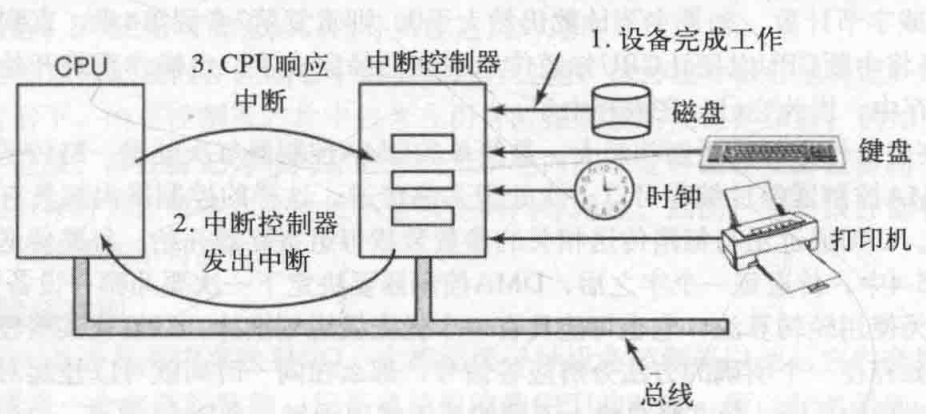
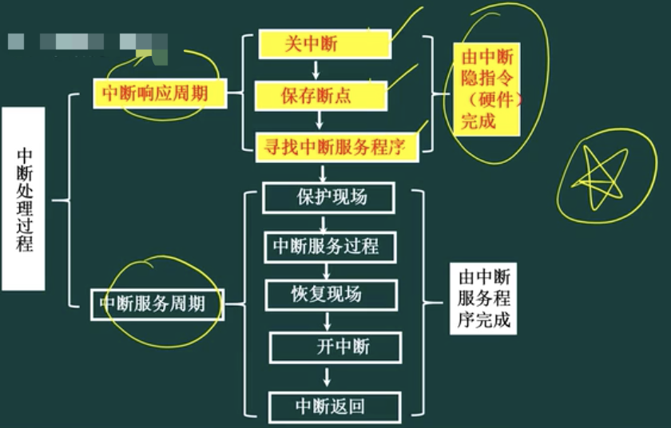
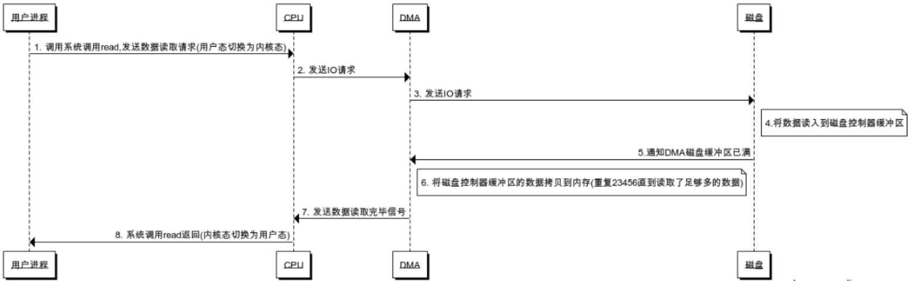
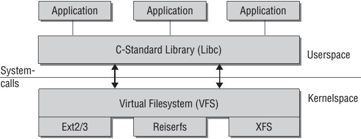

[TOC]

## IO与中断

一台典型的个人PC中，中断结构如下图：



设备完成工作，产生一个中断，他是通过在分配给它的一条总线信号线上置起信号而产生中断的。该信号主板上的中断控制器芯片检测到，由中断控制器芯片决定做什么。

在总线上置起中断信号，中断信号导致CPU停止当前正在做的工作并且开始做其它的事情。地址线上的数字被用做指向一个成为**中断向量(interrupt vector)**的表格的所用，以便读取一个新的程序计数器。这个程序计数器指向相应的中断服务过程的开始。

### 中断分类

* 中断源

中断是指由于某种事件的发生（硬件或者软件的），计算机暂停执行当前的程序，转而执行另一程序，以处理发生的事件，处理完毕后又返回原程序继续作业的过程。中断是处理器一种工作状态的描述。我们把引起中断的原因，或者能够发出中断请求信号的来源统称为中断源。

* 中断分类:外部中断/内部中断

    1. 外部设备请求中断。一般的外部设备（如键盘、打印机和A / D转换器等）在完成自身的操作后，向CPU发出中断请求，要求CPU为他服务。
    2. 故障强迫中断。计算机在一些关键部位都设有故障自动检测装置。如运算溢出、存储器读出出错、外部设备故障、电源掉电以及其他报警信号等，这些装置的报警信号都能使CPU中断，进行相应的中断处理。由计算机硬件异常或故障引起的中断，也称为内部异常中断。
    3. 实时时钟请求中断。在控制中遇到定时检测和控制，为此常采用一个外部时钟电路（可编程）控制其时间间隔。需要定时时，CPU发出命令使时钟电路开始工作，一旦到达规定时间，时钟电路发出中断请求，由CPU转去完成检测和控制工作。
    4. 数据通道中断。数据通道中断也称直接存储器存取（DMA）操作中断，如磁盘、磁带机或CRT等直接与存储器交换数据所要求的中断。
    5. 程序自愿中断。CPU执行了特殊指令（自陷指令）或由硬件电路引起的中断是程序自愿中断，是指当用户调试程序时，程序自愿中断检查中间结果或寻找错误所在而采用的检查手段，如断点中断和单步中断等。

* 中断分类:可屏蔽中断和非屏蔽中断

    1. 不可屏蔽中断源一旦提出请求，cpu必须无条件响应，而对于可屏蔽中断源的请求，cpu可以响应，也可以不响应。
    2. cup一般设置两根中断请求输入线：可屏蔽中断请求INTR(Interrupt Require)和不可屏蔽中断请求NMI(Nonmaskable Interrupt)。对于可屏蔽中断，除了受本身的屏蔽位的控制外，还都要受一个总的控制，即CPU标志寄存器中的中断允许标志位IF(Interrupt Flag)的控制，IF位为1，可以得到CPU的响应，否则，得不到响应。IF位可以有用户控制，指令STI或Turbo c的Enable()函数，将IF位置1(开中断)，指令CLI或Turbo_c 的Disable()函数，将IF位清0(关中断)。
    3. 可屏蔽中断：CPU关中断，则CU不响应中断；中断屏蔽字，CPU响应优先级高的中断

### 中断号(中断种类是有限的)

* 寻找中断服务程序的入口地址？

    1. 中断向量表（硬件向量法）(存储在内存中的某个位置)
    2. 中断识别程序 (软件查询法)

* 中断处理过程



问题1: 中断向量表用于保存：**服务程序的入口地址**

问题2: 中断响应是在：**一条执行执行之末**；（缺页中断：是在一条指令执行中间，执行执行不下去了；在执行中，不得不去响应中断）

问题3: 主存故障引起的中断是：**机器校验中断**（bootstrap会对主存，磁盘进行自检）

### 中断隐指令

中断隐指令引导CPU在响应中断信号时随机做出的一系列动作，这些动作是在检测到中断信号后便随即发生的，因而不能由软件来完成，而是由硬件来处理。中断隐指令并不是指令系统中的一条真正的指令，它没有操作码，所以中断隐指令是一种不允许、也不可能为用户使用的特殊指令。其所完成的操作主要有：

1. 保存现场

为了保证在中断服务程序执行完毕能正确返回原来的程序，必须将原来程序的断点（即程序计数器(PC)的内容）保存起来。断点可以压入堆栈，也可以存入主存的特定单元中。

2. 暂不允许中断(关中断)

暂不允许中断即关中断。在中断服务程序中，为了保护中断现场（即CPU主要寄存器的内容）期间不被新的中断所打断，必须要关中断，从而保证被中断的程序在中断服务程序执行完毕之后能接着正确地执行下去。并不是所有的计算机都在中断隐指令中由硬件自动地关中断，也有些计算机的这一操作是由软件（中断服务程序）来实现的。但是大部分计算机还是靠硬件来进行相关动作，因为硬件具有更好的可靠性和实时性。

3. 引出中断服务程序

引出中断服务程序的实质就是取出中断服务程序的入口地址送程序计数器（PC）。对于向量中断和非向量中断，引出中断服务程序的方法是不相同的。

4. 中断分发

硬件中断处理。在Windows所支持的硬件平台上，外部I/O中断进入到中断控制器的一根线上。该控制器接着在某一根线上中断处理器。处理器一旦被中断，就会询问控制器以获得此中断请求（IRQ）。中断控制器将该IRQ转译成一个中断号，利用该编号作为索引，在一个称为中断分发表（IDT）的结构中找到一个IDT项，并且将控制权传递给恰当的中断分发例程。每个处理器都有单独的IDT，所以，如果合适，不同的处理器可以运行不同的ISR。

## I/O控制方式

* cpu与外设


### 程序控制IO（轮询）

CPU要不断地`查询`外围设备的工作状态，一旦外围设备“准备好”或“不忙”，即可进行数据的传送；主机与外设只能串行工作，主机一个时间段只能与一个外设进行通讯，CPU效率低。

CPU：`轮询`，`忙等待`

### 中断驱动IO

* 首先每次的IO中断，都带来CPU的上下文切换


* 优点：CPU没有轮询检测I/O，只是根据I/O操作去向相应的设备控制器发出一条I/O命令，理论上可以去做其它的事情；

* 但是有大量数据传输时，CPU基本全程都在等待中断结束：在等待I/O数据的传输处理（CPU要等待中断返回，并没有去做别的事情）

### DMA（Direct Memory Access）

用来提供在外设和存储器之间或者存储器和存储器之间的高速数据传输。不需要依赖于CPU的大量中断负载。DMA控制器接管了数据读写请求，减少CPU的负担。




* DMA向CPU申请权限，让DMA进行I/O操作；CPU不需要在负责大量的I/O操作而无法处理其它事情了，此处有DMA总线

* 传统I/O流即类似DMA方式

如果大量I/O请求，DMA申请多，DMA总线冲突，一样有问题？

## I/O zero copy

### 传统I/O,用户进程读写的几次拷贝

* 写：用户态->内核态->DMA

CPU copy, DMA copy

* 读：DMA->内核态->用户态

DMA copy, CPU copy

## mmap

mmap将一个文件或者其它对象映射进内存。文件被映射到多个页上，如果文件的大小不是所有页的大小之和，最后一个页不被使用的空间将会清零

### 内存映射文件(memory-mapped file，用户内存到文件系统页的映射)

由一个文件到一块内存的映射；文件的数据就是这块区域内存中对应的数据，读写文件中的数据，即直接对这块内存区域的地址操作，减少了内存复制的环节。

使用内存映射文件处理存储于磁盘上的文件时，将不必再对文件执行I/O操作，这意味着在对文件进行处理时将不必再为文件申请并分配缓存，所有的文件缓存操作均由系统直接管理，由于取消了将文件数据加载到内存、数据从内存到文件的回写以及释放内存块等步骤，使得内存映射文件在处理大数据量的文件时能起到相当重要的作用。


好处：

* 用户进程把文件数据当作内存，所以无需发起`read()`或 `write()`系统调用。

* 当用户进程碰触到映射内存空间，页错误会自动产生，从而将文件数据从磁盘读进内存。如果用户修改了映射内存空间，相关页会自动标记为脏，随后刷新到磁盘，文件得到更新。

* 操作系统的虚拟内存子系统会对页进行智能高速缓存，自动根据系统负载进行内存管理。

* 数据总是按页对齐的，无需执行缓冲区拷贝。

* 大型文件使用映射，无需耗费大量内存，即可进行数据拷贝。

* 映射文件区域的能力取决于于内存寻址的大小。在32位机器中，你不能访问超过`4GB`或`2 ^ 32`（以上的文件）。

### mmap的流程

#### 1 进程启动映射过程，并在虚拟地址空间中为映射创建虚拟映射区域

进程在用户空间调用mmap库函数

* 在当前进程的虚拟地址空间中，寻找一段空闲的满足要求的连续的虚拟地址
* 为此虚拟区分配一个vm_area_struct结构，接着对这个结构的各个域进行了初始化
* 将新建的虚拟区结构（vm_area_struct）插入进程的虚拟地址区域链表或树中

#### 2 调用内核空间的系统调用函数mmap（不同于用户空间的mmap函数），实现文件物理地址和进程虚拟地址的一一映射关系

8 为映射分配了新的虚拟地址区域后，通过待映射的文件指针，在文件描述符表中找到对应的文件描述符，通过文件描述符，链接到内核`已打开文件集`中该文件的文件结构体（struct file），每个文件结构体维护着和这个已打开文件相关各项信息。

* 通过该文件的文件结构体，链接到file_operations模块，调用内核函数mmap，其原型为：int mmap(struct file *filp, struct vm_area_struct *vma)，不同于用户空间库函数。

* 内核mmap函数通过虚拟文件系统inode模块定位到文件磁盘物理地址。

* 通过remap_pfn_range函数建立页表，即实现了文件地址和虚拟地址区域的映射关系。

注：仅创建虚拟区间并完成地址映射，但是并没有将任何文件数据的拷贝至主存。真正的文件读取是当进程发起读或写操作时。

#### 3 进程发起对这片映射空间的访问，引发page fault，实现文件内容到物理内存（主存）的拷贝

* 进程的读或写操作访问虚拟地址空间这一段映射地址，通过查询页表，发现这一段地址并不在物理页面上。因为目前只建立了地址映射，真正的硬盘数据还没有拷贝到内存中，因此引发缺页异常。
* 缺页异常进行一系列判断，确定无非法操作后，内核发起请求调页过程。
* 调页过程先在交换缓存空间（swap cache）中寻找需要访问的内存页，如果没有则调用nopage函数把所缺的页从磁盘装入到主存中。
* 之后进程即可对这片内存进行读或者写的操作，如果写操作改变了其内容，一定时间后系统会自动回写脏页面到对应磁盘地址，也即完成了写入到文件的过程

注意:脏页不能被置换出内存，如果脏页正在被写回，那么会被设置写回标记，这时候该页就被上锁，其他写请求被阻塞直到锁释放。

### 附：Linux man mmap

<a href='https://linux.die.net/man/3/mmap'>man mmap</a>

* 使用语法

```java
NAME
       mmap, munmap - map or unmap files or devices into memory

SYNOPSIS
       #include <sys/mman.h>

       void *mmap(void *addr, size_t length, int prot, int flags,
                  int fd, off_t offset);
       int munmap(void *addr, size_t length);
```

* 描述

```java
DESCRIPTION
       mmap()  creates a new mapping in the virtual address space of the call‐
       ing process.  The starting address for the new mapping is specified  in
       addr.  The length argument specifies the length of the mapping.

       If addr is NULL, then the kernel chooses the address at which to create
       the mapping; this is the most portable method of creating  a  new  map‐
       ping.   If  addr  is not NULL, then the kernel takes it as a hint about
       where to place the mapping; on Linux, the mapping will be created at  a
       nearby  page  boundary.   The address of the new mapping is returned as
       the result of the call.

       The contents of a file mapping (as opposed to an anonymous mapping; see
       MAP_ANONYMOUS  below),  are  initialized using length bytes starting at
       offset offset in the file (or other object) referred  to  by  the  file
       descriptor  fd.  offset must be a multiple of the page size as returned
       by sysconf(_SC_PAGE_SIZE).

       The prot argument describes the desired memory protection of  the  map‐
       ping  (and  must  not  conflict with the open mode of the file).  It is
       either PROT_NONE or the bitwise OR of one  or  more  of  the  following
       flags:

       PROT_EXEC  Pages may be executed.

       PROT_READ  Pages may be read.

       PROT_WRITE Pages may be written.

       PROT_NONE  Pages may not be accessed.

       The  flags argument determines whether updates to the mapping are visi‐
       ble to other processes mapping the same region, and whether updates are
       carried through to the underlying file.  This behavior is determined by
       including exactly one of the following values in flags:

       MAP_SHARED
              Share this mapping.  Updates to the mapping are visible to other
              processes  that  map  this  file, and are carried through to the
              underlying file.  (To precisely control when updates are carried
              through to the underlying file requires the use of msync(2).)

       MAP_PRIVATE
              Create  a private copy-on-write mapping.  Updates to the mapping
              are not visible to other processes mapping the  same  file,  and
              are  not carried through to the underlying file.  It is unspeci‐
              fied whether changes made to the file after the mmap() call  are
              visible in the mapped region.

       Both of these flags are described in POSIX.1-2001 and POSIX.1-2008.

       In addition, zero or more of the following values can be ORed in flags:

       MAP_32BIT (since Linux 2.4.20, 2.6)
              Put  the  mapping  into  the  first  2  Gigabytes of the process
              address space.  This flag  is  supported  only  on  x86-64,  for
              64-bit  programs.   It  was  added  to allow thread stacks to be
              allocated somewhere in the first 2GB of memory, so as to improve
              context-switch  performance  on  some  early  64-bit processors.
              Modern x86-64 processors no longer have this  performance  prob‐
              lem,  so use of this flag is not required on those systems.  The
              MAP_32BIT flag is ignored when MAP_FIXED is set.

       MAP_ANON
              Synonym for MAP_ANONYMOUS.  Deprecated.

       MAP_ANONYMOUS
              The mapping is not backed by any file; its contents are initial‐
              ized to zero.  The fd and offset arguments are ignored; however,
              some implementations require fd to be -1  if  MAP_ANONYMOUS  (or
              MAP_ANON)  is specified, and portable applications should ensure
              this.  The use of MAP_ANONYMOUS in conjunction  with  MAP_SHARED
              is supported on Linux only since kernel 2.4.

       MAP_DENYWRITE
              This  flag  is ignored.  (Long ago, it signaled that attempts to
              write to the underlying file should  fail  with  ETXTBUSY.   But
              this was a source of denial-of-service attacks.)

       MAP_EXECUTABLE
              This flag is ignored.

       MAP_FILE
              Compatibility flag.  Ignored.

       MAP_FIXED
              Don't  interpret  addr  as  a hint: place the mapping at exactly
              that address.  addr must be a multiple of the page size.  If the
              memory  region  specified  by addr and len overlaps pages of any
              existing mapping(s), then the overlapped part  of  the  existing
              mapping(s)  will  be discarded.  If the specified address cannot
              be used, mmap() will fail.  Because requiring  a  fixed  address
              for  a  mapping is less portable, the use of this option is dis‐
              couraged.

       MAP_GROWSDOWN
              Used for stacks.  Indicates to the kernel virtual memory  system
              that the mapping should extend downward in memory.

       MAP_HUGETLB (since Linux 2.6.32)
              Allocate  the  mapping using "huge pages."  See the Linux kernel
              source file Documentation/vm/hugetlbpage.txt for further  infor‐
              mation, as well as NOTES, below.

       MAP_HUGE_2MB, MAP_HUGE_1GB (since Linux 3.8)
              Used  in  conjunction  with  MAP_HUGETLB  to  select alternative
              hugetlb page sizes (respectively, 2 MB and 1 GB) on systems that
              support multiple hugetlb page sizes.

              More  generally, the desired huge page size can be configured by
              encoding the base-2 logarithm of the desired page  size  in  the
              six bits at the offset MAP_HUGE_SHIFT.  (A value of zero in this
              bit field provides the default huge page size; the default  huge
              page  size  can be discovered vie the Hugepagesize field exposed
              by /proc/meminfo.)  Thus, the above two  constants  are  defined
              as:

                  #define MAP_HUGE_2MB    (21 << MAP_HUGE_SHIFT)
                  #define MAP_HUGE_1GB    (30 << MAP_HUGE_SHIFT)

              The  range  of  huge page sizes that are supported by the system
              can be discovered by listing  the  subdirectories  in  /sys/ker‐
              nel/mm/hugepages.

       MAP_LOCKED (since Linux 2.5.37)
              Mark the mmaped region to be locked in the same way as mlock(2).
              This implementation will try to populate  (prefault)  the  whole
              range  but the mmap call doesn't fail with ENOMEM if this fails.
              Therefore major faults might happen later on.  So  the  semantic
              is  not  as  strong  as  mlock(2).   One should use mmap(2) plus
              mlock(2) when major faults are not acceptable after the initial‐
              ization of the mapping.  The MAP_LOCKED flag is ignored in older
              kernels.

       MAP_NONBLOCK (since Linux 2.5.46)
              Only meaningful in conjunction with MAP_POPULATE.  Don't perform
              read-ahead:  create  page tables entries only for pages that are
              already present in RAM.  Since Linux 2.6.23,  this  flag  causes
              MAP_POPULATE  to  do  nothing.   One  day,  the  combination  of
              MAP_POPULATE and MAP_NONBLOCK may be reimplemented.

       MAP_NONBLOCK (since Linux 2.5.46)
              Only meaningful in conjunction with MAP_POPULATE.  Don't perform
              read-ahead:  create  page tables entries only for pages that are
              already present in RAM.  Since Linux 2.6.23,  this  flag  causes
              MAP_POPULATE  to  do  nothing.   One  day,  the  combination  of
              MAP_POPULATE and MAP_NONBLOCK may be reimplemented.

       MAP_NORESERVE
              Do not reserve swap space for this mapping.  When swap space  is
              reserved,  one  has  the guarantee that it is possible to modify
              the mapping.  When swap space is  not  reserved  one  might  get
              SIGSEGV  upon  a  write if no physical memory is available.  See
              also the discussion of the  file  /proc/sys/vm/overcommit_memory
              in  proc(5).   In  kernels before 2.6, this flag had effect only
              for private writable mappings.

       MAP_NORESERVE
              Do not reserve swap space for this mapping.  When swap space  is
              reserved,  one  has  the guarantee that it is possible to modify
              the mapping.  When swap space is  not  reserved  one  might  get
              SIGSEGV  upon  a  write if no physical memory is available.  See
              also the discussion of the  file  /proc/sys/vm/overcommit_memory
              in  proc(5).   In  kernels before 2.6, this flag had effect only
              for private writable mappings.

       MAP_POPULATE (since Linux 2.5.46)
              Populate (prefault) page tables for a mapping.  For a file  map‐
              ping,  this  causes  read-ahead  on the file.  This will help to
              reduce blocking on page faults later.  MAP_POPULATE is supported
              for private mappings only since Linux 2.6.23.

       MAP_STACK (since Linux 2.6.27)
              Allocate  the  mapping  at  an address suitable for a process or
              thread stack.  This flag is currently a no-op, but  is  used  in
              the glibc threading implementation so that if some architectures
              require special treatment for  stack  allocations,  support  can
              later be transparently implemented for glibc.

       MAP_UNINITIALIZED (since Linux 2.6.33)
              Don't  clear  anonymous pages.  This flag is intended to improve
              performance on embedded devices.  This flag is honored  only  if
              the  kernel was configured with the CONFIG_MMAP_ALLOW_UNINITIAL‐
              IZED option.  Because of the security implications, that  option
              is  normally  enabled  only  on  embedded devices (i.e., devices
              where one has complete control of the contents of user memory).

       Of the above flags, only MAP_FIXED is  specified  in  POSIX.1-2001  and
       POSIX.1-2008.  However, most systems also support MAP_ANONYMOUS (or its
       synonym MAP_ANON).

       Some systems document the additional flags MAP_AUTOGROW, MAP_AUTORESRV,
       MAP_COPY, and MAP_LOCAL.

       Memory  mapped  by  mmap()  is  preserved across fork(2), with the same
       attributes.

       A file is mapped in multiples of the page size.  For a file that is not
       a  multiple  of  the  page  size,  the  remaining memory is zeroed when
       mapped, and writes to that region are not written out to the file.  The
       effect  of changing the size of the underlying file of a mapping on the
       pages that correspond to added  or  removed  regions  of  the  file  is
       unspecified.
```

* 返回

```java
RETURN VALUE
       On success, mmap() returns a pointer to the mapped area.  On error, the
       value MAP_FAILED (that is, (void *) -1) is returned, and errno  is  set
       to indicate the cause of the error.
```

## 文件读写

### vfs(虚拟文件系统)

虚拟文件系统(VFS)是由Sun microsystems公司在定义网络文件系统(NFS)时创造的。它是一种用于网络环境的分布式文件系统，是允许和操作系统使用不同的文件系统实现的接口。虚拟文件系统（VFS）是物理文件系统与服务之间的一个接口层，它对Linux的每个文件系统的所有细节进行抽象，使得不同的文件系统在Linux核心以及系统中运行的其他进程看来，都是相同的。严格说来，VFS并不是一种实际的文件系统。它只存在于内存中，不存在于任何外存空间。VFS在系统启动时建立，在系统关闭时消亡。


* 应用程序通过库函数在用户空间进行读写文件
* 在内核是系统调用，内核通过vfs与硬件打交道
* 数据要在内核与用户空间进行转移



vfs包括的内容：

1. 超级块（super_block），用于保存一个文件系统的所有元数据，相当于这个文件系统的信息库，为其他的模块提供信息。因此一个超级块可代表一个文件系统。文件系统的任意元数据修改都要修改超级块。超级块对象是常驻内存并被缓存的。

2. 目录项模块，管理路径的目录项。比如一个路径 /home/foo/hello.txt，那么目录项有home, foo, hello.txt。目录项的块，存储的是这个目录下的所有的文件的inode号和文件名等信息。其内部是树形结构，操作系统检索一个文件，都是从根目录开始，按层次解析路径中的所有目录，直到定位到文件。

3. inode模块，管理一个具体的文件，**inode是文件的唯一标识，一个文件对应一个inode**。通过inode可以方便的找到文件在磁盘扇区的位置。同时inode模块可链接到address_space模块，方便查找自身文件数据是否已经缓存。

4. 打开文件列表模块，包含所有内核已经打开的文件。已经打开的文件对象由open系统调用在内核中创建，也叫文件句柄。打开文件列表模块中包含一个列表，每个列表表项是一个结构体`struct file`，结构体中的信息用来表示打开的一个文件的各种状态参数。

5. file_operations模块。这个模块中维护一个数据结构，是一系列函数指针的集合，其中包含所有可以使用的系统调用函数，例如open、read、write、mmap等。每个打开文件（打开文件列表模块的一个表项）都可以连接到file_operations模块，从而对任何已打开的文件，通过系统调用函数，实现各种操作。

6. address_space模块，它**表示一个文件在页缓存中已经缓存了的物理页**。它是页缓存和外部设备中文件系统的桥梁。

### 进程与VFS关联

每个进程的描述符`task_struct`结构中维中维护了一个files的指针（和“已打开文件列表”上的表项是不同的指针）来指向结构体`files_struct`（files_struct中包含了文件描述符表和打开的文件对象信息）


`files_struct`位于内核，用户程序不能直接访。但是可以使用files_struct的索引（即0、1、2、3这些数字），这些索引就称为**文件描述符（File Descriptor)**，用int型变量保存。当调用open打开一个文件或创建一个新文件时，内核分配一个File Descriptor（files_struct的一个索引）并返回给用户程序，files_struct中某一表项的指针指向新打开的文件，即file结构

file结构一方面可从f_dentry链接到目录项模块以及inode模块，获取所有和文件相关的信息，另一方面链接file_operations子模块，其中包含所有可以使用的系统调用函数，从而最终完成对文件的操作。这样，从进程到进程的文件描述符表，再关联到已打开文件列表上对应的文件结构，从而调用其可执行的系统调用函数，实现对文件的各种操作。

### 进程读写文件流程

读文件

1. 进程调用库函数向内核发起读文件请求；
2. 内核通过检查进程的文件描述符定位到虚拟文件系统的已打开文件列表表项；
3. 调用该文件可用的系统调用函数read(), read()函数通过文件表项链接到目录项模块，根据传入的文件路径，在目录项模块中检索，找到该文件的inode；
4. 在inode中，通过文件内容偏移量计算出要读取的页；
5. 通过inode找到文件对应的address_space；
6. 在address_space中访问该文件的页缓存树，查找对应的页缓存结点：
    * 如果页缓存命中，那么直接返回文件内容；
    * 如果页缓存缺失，那么产生一个页缺失异常，创建一个页缓存页，同时通过inode找到文件该页的磁盘地址，读取相应的页填充该缓存页；重新进行第6步查找页缓存；
7. 文件内容读取成功

写文件

1. 进程调用库函数向内核发起读文件请求；
2. 内核通过检查进程的文件描述符定位到虚拟文件系统的已打开文件列表表项；
3. 调用该文件可用的系统调用函数read(),read()函数通过文件表项链接到目录项模块，根据传入的文件路径，在目录项模块中检索，找到该文件的inode；
4. 在inode中，通过文件内容偏移量计算出要读取的页；
5. 通过inode找到文件对应的address_space；
6. 在address_space中访问该文件的页缓存树，查找对应的页缓存结点：
    * 如果页缓存命中，直接把文件内容修改更新在页缓存的页中。写文件就结束了。这时候文件修改位于页缓存，并没有写回到磁盘文件中去。
    * 如果页缓存缺失，那么产生一个页缺失异常，创建一个页缓存页，同时通过inode找到文件该页的磁盘地址，读取相应的页填充该缓存页。此时缓存页命中，进行第6步。
7. 一个页缓存中的页如果被修改，那么会被标记成脏页。脏页需要写回到磁盘中的文件块。有两种方式可以把脏页写回磁盘：
    * 手动调用sync()或者fsync()系统调用把脏页写回
    * pdflush进程会定时把脏页写回到磁盘（同时注意，脏页不能被置换出内存，如果脏页正在被写回，那么会被设置写回标记，这时候该页就被上锁，其他写请求被阻塞直到锁释放）
