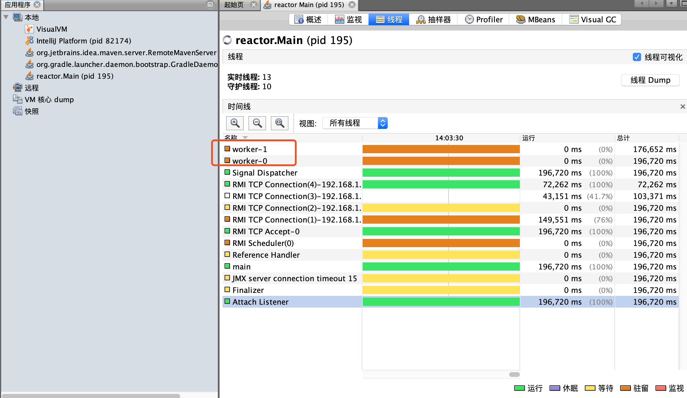
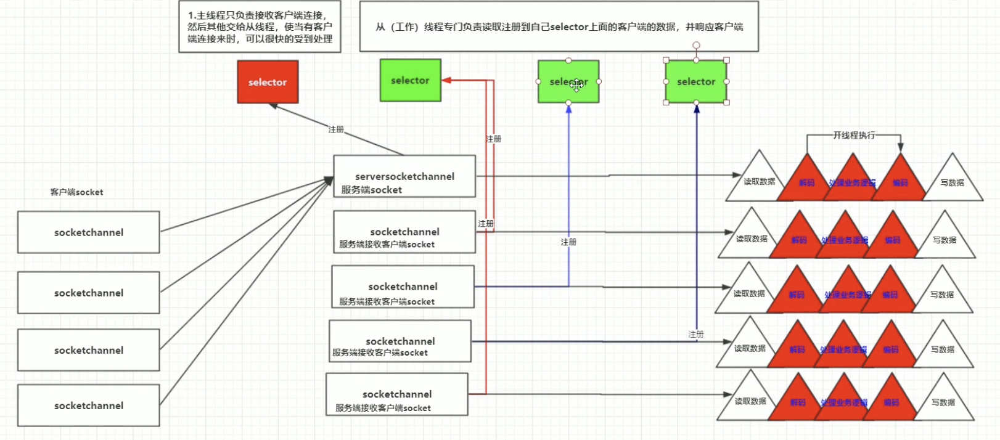

[TOC]

# netty

https://netty.io/

Netty is a NIO client server framework which enables quick and easy development of network applications such as protocol servers and clients. It greatly simplifies and streamlines network programming such as TCP and UDP socket server.

'Quick and easy' doesn't mean that a resulting application will suffer from a maintainability or a performance issue. Netty has been designed carefully with the experiences earned from the implementation of a lot of protocols such as FTP, SMTP, HTTP, and various binary and text-based legacy protocols. As a result, Netty has succeeded to find a way to achieve ease of development, performance, stability, and flexibility without a compromise.

---

## Features

Design
* Unified API for various transport types - blocking and non-blocking socket
* Based on a flexible and extensible event model which allows clear separation of concerns
* Highly customizable thread model - single thread, one or more thread pools such as SEDA
* True connectionless datagram socket support (since 3.1)

Ease of use
* Well-documented Javadoc, user guide and examples
* No additional dependencies, JDK 5 (Netty 3.x) or 6 (Netty 4.x) is enough
    * Note: Some components such as HTTP/2 might have more requirements. Please refer to the Requirements page for more information.

Performance
* Better throughput, lower latency
* Less resource consumption
* Minimized unnecessary memory copy

Security
* Complete SSL/TLS and StartTLS support

Community
* Release early, release often
* The author has been writing similar frameworks since 2003 and he still finds your feed back precious!

## Scalable IO in Java

《Scalable IO in Java》 是java.util.concurrent包的作者，大师Doug Lea关于分析与构建可伸缩的高性能IO服务的一篇经典文章，在文章中Doug Lea通过各个角度，循序渐进的梳理了服务开发中的相关问题，以及在解决问题的过程中服务模型的演变与进化，文章中基于Reactor反应器模式的几种服务模型架构，也被Netty、Mina等大多数高性能IO服务框架所采用，因此阅读这篇文章有助于你更深入了解Netty、Mina等服务框架的编程思想与设计模式。

## NIO & reactor模型

### 单线程模型(处理慢)


### 多线程（业务逻辑处理用多线程处理）


#### 代码实现



* Main

```java
package reactor;

import java.io.IOException;

public class Main {
    public static void main(String[] args) {
        try {
            TCPReactor reactor = new TCPReactor(9099);
            reactor.run();
        } catch (IOException e) {
            e.printStackTrace();
        }
    }
}
```

* TCPReactor

```java
package reactor;

import java.io.IOException;
import java.net.InetSocketAddress;
import java.nio.channels.SelectionKey;
import java.nio.channels.Selector;
import java.nio.channels.ServerSocketChannel;
import java.util.Iterator;
import java.util.Set;

public class TCPReactor implements Runnable {

    private final ServerSocketChannel ssc;
    private final Selector selector;

    public TCPReactor(int port) throws IOException {
        ssc = ServerSocketChannel.open();  //打开服务端socket
        InetSocketAddress addr = new InetSocketAddress(port);
        ssc.socket().bind(addr); // 在ServerSocketChannel绑定端口
        ssc.configureBlocking(false); // 设置ServerSocketChannel为非阻塞
        // 注册 selector，并为SelectionKey附加一个Acceptor对象处理
        selector = Selector.open();  //创建选择器对象
        SelectionKey sk = ssc.register(selector, SelectionKey.OP_ACCEPT); // ServerSocketChannel向selector注册一个OP_ACCEPT事件，然后返回該通道的key
        sk.attach(new Acceptor(selector, ssc)); // 给定key一个附加的Acceptor对象  如果事件没有被改变  可以认为这个附加对象和OP_ACCEPT是绑定的
    }

    @Override
    public void run() {
        while (!Thread.interrupted()) { // 在线程中断前持续执行
            System.out.println("Waiting for new event on port: " + ssc.socket().getLocalPort() + "...");
            try {
                //查看是否有事件发生  有事件发生则把这个事件加入到selectedKeys
                selector.select();
            } catch (IOException e) {
                e.printStackTrace();
            }
            System.out.println("selector.select(); returned");
            //能执行到这里  说明发生了事件
            // 取得所有已就绪事件的key集合
            Set<SelectionKey> selectedKeys = selector.selectedKeys();
            Iterator<SelectionKey> it = selectedKeys.iterator();
            //遍历已经发生的事件
            while (it.hasNext()) {
                SelectionKey selectionKey = it.next();
                // 根据事件的key进行调度
                dispatch(selectionKey);
                it.remove();
            }
        }
    }

    private void dispatch(SelectionKey key) {
        //取出附加对象  根据附加对象判断是什么事件 调用不同附加对象的run方法   这里请注意这个附加对象是会变化的
        //如果是接受客户端连接事件的话  这里取出的附加对象就是Acceptor,调用的肯定也是Acceptor的run方法
        //如果是已经连接上来的客户端发来数据  则是读事件  那么这里取出的附加对象就是TCPHandler，调用的肯定也是TCPHandler的run方法
        //TCPHandler那里来的请往下看
//        new Acceptor(selector, ssc).run();
        Runnable r = (Runnable) (key.attachment());  //取出附加对象
        if (r != null) {
            r.run();
        }
    }
}
```

* Acceptor

```java
package reactor;

import java.io.IOException;
import java.nio.channels.SelectionKey;
import java.nio.channels.Selector;
import java.nio.channels.ServerSocketChannel;
import java.nio.channels.SocketChannel;

public class Acceptor implements Runnable {

    private final ServerSocketChannel ssc;
    private final Selector selector;

    public Acceptor(Selector selector, ServerSocketChannel ssc) {
        //服务端的server
        this.ssc=ssc;
        //理解集合对象  专门存socket
        this.selector=selector;
    }

    @Override
    public void run() {
        try {
            SocketChannel sc = ssc.accept(); // 接受client连接请求
            System.out.println(sc.socket().getRemoteSocketAddress().toString() + " is connected.");
            if (sc != null) {
                // 连接成功则设置读事件，交给TCPHandler处理
                sc.configureBlocking(false); // 设置非阻塞
                SelectionKey sk = sc.register(selector, SelectionKey.OP_READ); // SocketChannel向selector注册一个OP_READ事件，然后返回该通道的key
                selector.wakeup(); // 使一个阻塞住的selector操作立即返回
                sk.attach(new TCPHandler(sk, sc)); // 给定key一个附加的TCPHandler对象
            }
        } catch (IOException e) {
            e.printStackTrace();
        }
    }
}
```

* TCPHandler

```java
package reactor;

import java.io.IOException;
import java.nio.channels.SelectionKey;
import java.nio.channels.SocketChannel;
import java.util.concurrent.LinkedBlockingQueue;
import java.util.concurrent.ThreadFactory;
import java.util.concurrent.ThreadPoolExecutor;
import java.util.concurrent.TimeUnit;
import java.util.concurrent.atomic.AtomicInteger;

public class TCPHandler implements Runnable {

    private final SelectionKey sk;
    private final SocketChannel sc;
    private static final int THREAD_COUNTING = 10;


    HandlerState state; // 以狀態模式實現Handler

    static AtomicInteger atomicInteger = new AtomicInteger(0);

    static ThreadFactory threadFactory = new ThreadFactory() {
        @Override
        public Thread newThread(Runnable r) {
            Thread thread = new Thread(r);
            thread.setName("worker-" + atomicInteger.get());
            atomicInteger.incrementAndGet();
            return thread;
        }
    };
    private static ThreadPoolExecutor pool = new ThreadPoolExecutor(
            THREAD_COUNTING, THREAD_COUNTING, 10, TimeUnit.SECONDS,
            new LinkedBlockingQueue<Runnable>(),
            threadFactory
    );

    public TCPHandler(SelectionKey sk, SocketChannel sc) {
        this.sk = sk;
        this.sc = sc;
        state = new ReadState(); // 初始状态设定为READING
        pool.setMaximumPoolSize(32); // 设置线程池最大线程数
    }

    @Override
    public void run() {
        try {
            state.handle(this, sk, sc, pool);
        } catch (IOException e) {
            System.out.println("[Warning!] A client has been closed.");
            closeChannel();
        }
    }

    public void closeChannel() {
        try {
            sk.cancel();
            sc.close();
        } catch (IOException e1) {
            e1.printStackTrace();
        }
    }

    public void setState(HandlerState state) {
        this.state = state;
    }
}
```

* HandlerState(interface)

```java
package reactor;

import java.io.IOException;
import java.nio.channels.SelectionKey;
import java.nio.channels.SocketChannel;
import java.util.concurrent.ThreadPoolExecutor;

public interface HandlerState {

    void changeState(TCPHandler h);

    void handle(TCPHandler h, SelectionKey sk, SocketChannel sc,
                       ThreadPoolExecutor pool) throws IOException ;
}
```

* WorkState

```java
package reactor;

import java.io.IOException;
import java.nio.channels.SelectionKey;
import java.nio.channels.SocketChannel;
import java.util.concurrent.ThreadPoolExecutor;

public class WorkState implements HandlerState {

    public WorkState() {
    }

    @Override
    public void changeState(TCPHandler h) {
        // TODO Auto-generated method stub
        h.setState(new WriteState());
    }

    @Override
    public void handle(TCPHandler h, SelectionKey sk, SocketChannel sc,
                       ThreadPoolExecutor pool) throws IOException {
        // TODO Auto-generated method stub

    }

}
```

* ReadState

```java
package reactor;

import java.io.IOException;
import java.nio.ByteBuffer;
import java.nio.channels.SelectionKey;
import java.nio.channels.SocketChannel;
import java.util.concurrent.ThreadPoolExecutor;

public class ReadState implements HandlerState{

    private SelectionKey sk;

    public ReadState() {
    }

    @Override
    public void changeState(TCPHandler h) {
        // TODO Auto-generated method stub
        h.setState(new WorkState());
    }

    @Override
    public void handle(TCPHandler h, SelectionKey sk, SocketChannel sc,
                       ThreadPoolExecutor pool) throws IOException { // read()
        this.sk = sk;
        // non-blocking下不可用Readers，因為Readers不支持non-blocking
        byte[] arr = new byte[1024];
        ByteBuffer buf = ByteBuffer.wrap(arr);

        int numBytes = sc.read(buf); // 读取客户端字符串
        if(numBytes == -1)
        {
            System.out.println("[Warning!] A client has been closed.");
            h.closeChannel();
            return;
        }
        String str = new String(arr); // 將讀取到的byte內容轉為字符串型態
        if ((str != null) && !str.equals(" ")) {
            h.setState(new WorkState()); // 改變狀態(READING->WORKING)
            // 读取出来后，交给工作线程处理
            pool.execute(new WorkerThread(h, str)); // do process in worker thread
            System.out.println(sc.socket().getRemoteSocketAddress().toString()
                    + " > " + str);
        }

    }

    /*
     * 执行完成，设置为写操作
     */
    synchronized void process(TCPHandler h, String str) {
        // do process(decode, logically process, encode)..
        // ..
        h.setState(new WriteState()); // 改變狀態(WORKING->SENDING)
        this.sk.interestOps(SelectionKey.OP_WRITE); // 通過key改變通道註冊的事件
        this.sk.selector().wakeup(); // 使一個阻塞住的selector操作立即返回
    }

    /*
     * 工作者線程
     */
    class WorkerThread implements Runnable {

        TCPHandler h;
        String str;

        public WorkerThread(TCPHandler h, String str) {
            this.h = h;
            this.str=str;
        }

        @Override
        public void run() {
            process(h, str);
        }

    }
}
```

* WriteState

```java
package reactor;


import java.io.IOException;
import java.nio.ByteBuffer;
import java.nio.channels.SelectionKey;
import java.nio.channels.SocketChannel;
import java.util.concurrent.ThreadPoolExecutor;

public class WriteState implements HandlerState{

    public WriteState() {
    }

    @Override
    public void changeState(TCPHandler h) {
        // TODO Auto-generated method stub
        h.setState(new ReadState());
    }

    @Override
    public void handle(TCPHandler h, SelectionKey sk, SocketChannel sc,
                       ThreadPoolExecutor pool) throws IOException { // send()
        // get message from message queue

        String str = "Your message has sent to "
                + sc.socket().getLocalSocketAddress().toString() + "\r\n";
        ByteBuffer buf = ByteBuffer.wrap(str.getBytes()); // wrap自動把buf的position設為0，所以不需要再flip()

        while (buf.hasRemaining()) {
            sc.write(buf); // 回傳給client回應字符串，發送buf的position位置 到limit位置為止之間的內容
        }

        h.setState(new ReadState()); // 改變狀態(SENDING->READING)
        sk.interestOps(SelectionKey.OP_READ); // 通過key改變通道註冊的事件
        sk.selector().wakeup(); // 使一個阻塞住的selector操作立即返回
    }
}
```

### 主从多线程（master,worker线程，连接线程和业务处理线程分开，selector是多个）



<font color='red'>可以把连接过来的客户端，一组一组的注册到多个selector上，这样读取是多线程的，而非单线程</font>

## neety常见面试题目

0. 说说你对Netty的了解？
1. Netty跟Java NIO有什么不同，为什么不直接使用JDK NIO类库？
2. Netty组件有哪些，分别有什么关联？
3. 说说Netty的执行流程？
4. Netty高性能体现在哪些方面？
5. Netty的线程模型是怎么样的？
6. Netty的零拷贝提体现在哪里，与操作系统上的有什么区别？
7. Netty的内存池是怎么实现的？
8. Netty的对象池是怎么实现的？
