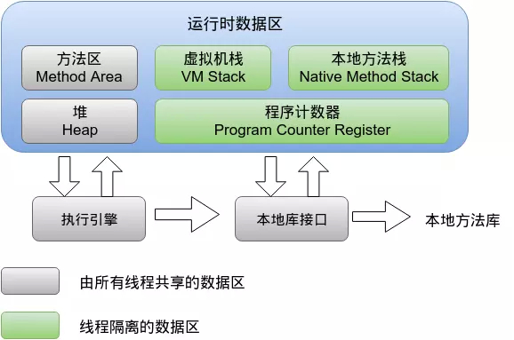

[TOC]

# Class 文件

Class文件是一组以8位字节为基础单位的`二进制流`，任何一个Class文件都对应唯一一个类或接口的定义信息

## Class 对象

每一个类都有一个Class对象，每当加载一个新类就产生一个Class对象，基本类型 (boolean, byte, char, short, int, long, float, and double)有Class对象，数组有Class对象，就连关键字void也有Class对象（void.class）。Class对象对应着java.lang.Class类，如果说类是对象抽象和集合的话，那么Class类就是对类的抽象和集合。Class类没有公共的构造方法，Class对象是在类加载的时候由**Java虚拟机**以及通过调用类加载器中的 defineClass 方法自动构造的，因此不能显式地声明一个Class对象

## 魔数与Class文件的版本

## 常量池

主要存放两大类常量：字面量（Literal）和 符号引用（Symbolic Reference）

1. 字面量：如文本字符串，声明为final的常量值

2. 符号引用：类和接口的全限定名，字段的名称和描述符，方法的名称和描述符

Class文件中不会保存各个方法、字段的最终内存布局信息；因此这些字段，方法的符号引用不经过运行期转换的话，无法得到真正的内存入口地址，也就无法直接被虚拟机使用。当虚拟机运行时，需要从常量池获得对应的符号引用，再在类创建时或运行时解析，翻译到具体的内存地址之中。

## 访问标志

用于识别一些类或者接口层次的访问信息，包括：这个Class是类还是接口；是否定义为public类型；是否定义为abstract类型；如果是类的话，是否被声明为final等。

## 类索引，父类索引，接口索引

## 字段表(field_info)

用来描述接口或者类中声明的变量， 可以包括的信息有：

字段的作用域(public,private,protected修饰符)，是实例变量还是类变量（static修饰符），可变性（final）,并发可见性（volatile修饰符,是否强制从主内存读写），可否被序列化（transient修饰符），字段数据类型（基本类型，对象，数组），字段名称。

## 方法表

方法签名：方法名称，参数顺序，参数类型

## 属性表

上述Class文件，字段表，方法表都可以携带自己的属性表集合

# JVM运行时各内存区域

## Java7



## Java8


## 程序计数器(PC)

* 指向下一条需要执行的字节码；记录当前线程的位置便于线程切换与恢复；
* 唯一 一个不会出现 `OOM` 的区域

## 虚拟机栈（线程stack）

描述了Java方法执行的内存模型，创建栈帧，保存该本地方法的局部变量表、操作数栈、动态链接、出口信息。

### 什么情况下会发生栈内存溢出（面试题）

* 如果线程请求的栈深度大于虚拟机所允许的最大深度，将抛出`StackOverflowError`异常，方法**递归**调用产生这种结果。

* 如果Java虚拟机栈可以动态扩展，并且扩展的动作已经尝试过，但是无法申请到足够的内存去完成扩展，或者在新建立线程的时候没有足够的内存去创建对应的虚拟机栈，那么Java虚拟机将抛出一个OutOfMemory 异常。(**线程启动过多**)

* 参数 -Xss 去调整JVM栈的大小

## 本地方法栈(native stack)

描述 native 的方法执行，会创建栈帧。也保存了该本地方法的局部变量表、操作数栈、动态链接、出口信息。

## 堆(heap)

主要用于存放`对象`；Java8之前有【方法区】的大部分被移到堆中了，所以，堆中还放有：`运行时常量池`,`字符串常量池`
## 元空间(metaspace)（不属于JVM，使用堆外内存）

类的元数据，如方法、字段、类、包的描述信息，这些信息可以用于创建文档、跟踪代码中的依赖性、执行编译时检查

**Metaspace**由两大部分组成：Klass Metaspace和NoKlass Metaspace。

1. klass Metaspace就是用来存klass的，就是class文件在jvm里的运行时数据结构，是一块连续的内存区域，紧接着Heap
2. NoKlass Metaspace专门来存klass相关的其他的内容，比如method，constantPool等，可以由多块不连续的内存组成

## 方法区(method area) & 永久代(Perm Space)

在JDK1.6及之前，运行时常量池是方法区的一个部分，同时方法区里面存储了类的元数据信息、静态变量、即时编译器编译后的代码（比如spring 使用IOC或者AOP创建bean时，或者使用cglib，反射的形式动态生成class信息等）等。

在JDK1.7及以后，JVM已经将运行时常量池从方法区中移了出来，在JVM堆开辟了一块区域存放常量池。

## 常量池

大体可以分为：静态常量池，运行时常量池。

* 静态常量池

静态常量池，即`*.class`文件中的常量池，class文件中的常量池不仅仅包含字符串(数字)字面量，还包含类、方法的信息，占用class文件绝大部分空间。这种常量池主要用于存放两大类常量：字面量(Literal)和符号引用量(Symbolic References)

* 运行时常量池

运行时常量池，则是jvm虚拟机在完成类装载操作后，将class文件中的常量池载入到内存中，并保存在方法区中，我们常说的常量池，就是指方法区中的运行时常量池。

String的`intern()`方法会查找在常量池中是否存在一份equal相等的字符串,如果有则返回该字符串的引用,如果没有则添加自己的字符串进入常量池。

# hotSpot对象存储

* 对象在内存中存储的布局可以分为3块区域：对象头（Header）、实例数据（Instance Data）和对齐填充（Padding）


<a href="http://openjdk.java.net/groups/hotspot/docs/HotSpotGlossary.html" target="_blank">hotspot 相关术语表</a>

术语 | 英文说明 | 中文解释
-|-|-
mark word | The first word of every object header. Usually a set of bitfields including synchronization state and identity hash code. May also be a pointer (with characteristic low bit encoding) to synchronization related information. During GC, may contain GC state bits. | 用于存储对象自身的运行时数据， 如哈希码（HashCode）、GC分代年龄、锁状态标志、线程持有的锁、偏向线程ID、偏向时间戳等等
klass pointer | The second word of every object header. Points to another object (a metaobject) which describes the layout and behavior of the original object. For Java objects, the "klass" contains a C++ style "vtable". | 是对象指向它的类的元数据的指针，虚拟机通过这个指针来确定这个对象是哪个类的实例。并不是所有的虚拟机实现都必须在对象数据上保留类型指针，换句话说查找对象的元数据信息并不一定要经过对象本身。

## 对象布局

```java
// https://mvnrepository.com/artifact/org.openjdk.jol/jol-core
compile group: 'org.openjdk.jol', name: 'jol-core', version: '0.10'
```

### `new Object()` 占用多少字节？

```java
java -XX:+PrintCommandLineFlags -version

-XX:InitialHeapSize=268435456 -XX:MaxHeapSize=4294967296 -XX:+PrintCommandLineFlags -XX:+UseCompressedClassPointers -XX:+UseCompressedOops -XX:+UseParallelGC
java version "1.8.0_171"
Java(TM) SE Runtime Environment (build 1.8.0_171-b11)
Java HotSpot(TM) 64-Bit Server VM (build 25.171-b11, mixed mode)
```

* +UseCompressedClassPointers：64bit机器，一个指针8个字节，如果使用压缩会只有4个字节
* -XX:+UseCompressedOops：普通对象指针，如果压缩也是4个字节

```java

public class Main {

    public static void main(String[] args) throws Exception {
        Object o = new Object();
        System.out.println(ClassLayout.parseInstance(o).toPrintable());
    }
}
/*
java.lang.Object object internals:
 OFFSET  SIZE   TYPE DESCRIPTION                               VALUE
      0     4        (object header)                           01 00 00 00 (00000001 00000000 00000000 00000000) (1)
      4     4        (object header)                           00 00 00 00 (00000000 00000000 00000000 00000000) (0)
      8     4        (object header)                           e5 01 00 f8 (11100101 00000001 00000000 11111000) (-134217243)
     12     4        (loss due to the next object alignment)
Instance size: 16 bytes
Space losses: 0 bytes internal + 4 bytes external = 4 bytes total

markword:8个字节
_kclass:4个字节
没有成员变量：instance data:0字节
紧接着4个字节，是对齐要使用4个字节，即凑成8个字节

即共16个字节
*/
```

### 对象头 & markword

markword 8个字节，64bit


* 无锁例子

```java
public class Main {

    public static void main(String[] args) throws Exception {
        Object o = new Object();
        int hashCode = o.hashCode();
        int b = hashCode % 2;
        System.out.println(hashCode + " " + Integer.toBinaryString(hashCode) + " " + b);
        System.out.println(ClassLayout.parseInstance(o).toPrintable());
    }
}
/*

2007328737 1110111101001010110011111100001 1
# WARNING: Unable to attach Serviceability Agent. You can try again with escalated privileges. Two options: a) use -Djol.tryWithSudo=true to try with sudo; b) echo 0 | sudo tee /proc/sys/kernel/yama/ptrace_scope
java.lang.Object object internals:
 OFFSET  SIZE   TYPE DESCRIPTION                               VALUE
      0     4        (object header)                           01 e1 67 a5 (00000001 11100001 01100111 10100101) (-1519918847)
      4     4        (object header)                           77 00 00 00 (01110111 00000000 00000000 00000000) (119)
      8     4        (object header)                           e5 01 00 f8 (11100101 00000001 00000000 11111000) (-134217243)
     12     4        (loss due to the next object alignment)
Instance size: 16 bytes
Space losses: 0 bytes internal + 4 bytes external = 4 bytes total

markword 64bit，如下

00000000 000000 00000000 01110111 10100101 01100111 11100001 00000001

根据无锁(new)，64bit 具体如下

      unused:25bit         ｜     identity hashcode:31bit        ｜unused | age  | biased_lock  | lock
00000000 000000 00000000 0 ｜ 1110111 10100101 01100111 11100001 ｜ 0     | 0000 |     0        |   01
                           ｜                                    ｜       |      |              |
*/
```

#### 锁升级过程

无锁态(new) ； 偏向锁 ； 轻量级锁，自旋锁，无锁 ；重量级锁

# 程序编译和代码优化

* 词法，语法分析

词法分析将源代码的字符流转变为标记(Token)集合

语法分析根据Token序列构造抽象语法树（Abstract Syntax Tree）

* Annotation，编译期间读取，修改，添加抽象语法树中的任意符号

* 语义分析与字节码生成

## 类加载过程(*)

```js
加载（即加载class文件）
  =>连接( 验证 =》 准备 =》 解析)
     => 初始化
         => 使用
            => 卸载
```

### 1 加载

这是由类加载器（ClassLoader）执行的。通过一个类的`全限定名`来获取其定义的`二进制字节流`（Class字节码），将这个字节流所代表的静态存储结构转化为运行时(Runtime data area)区域的入口，根据字节码在Java`堆`中生成一个代表这个类的`java.lang.Class`对象。

### 2-1 连接：验证（class字节流的校验）

验证是链接阶段的第一步，这一步主要的目的是确保`class`文件的字节流中包含的信息符合当前虚拟机的要求，并且不会危害虚拟机自身安全。验证阶段主要包括四个检验过程：文件格式验证、元数据验证、字节码验证和符号引用验证。

### 2-2 连接：准备（分配内存，初始化默认值）

准备阶段是正式为类变量分配内存并设置类变量的初始值阶段，即在方法区中分配这些变量所使用的内存空间。

```java
public static int value = 12;
```

变量value在准备阶段过后的初始值为0而不是12，因为这时候尚未开始执行任何java方法，而把value赋值为123的putstatic指令是程序被编译后，存放于类构造器`<clinit>()`方法之中，所以把value赋值为12的动作将在初始化阶段才会被执行。

相对于一些特殊的情况，如果类字段的字段属性表中存在ConstantValue属性，那在准备阶段变量value就会被初始化为ConstantValue属性所指定的值，例如上面类变量value定义为：

```java
public static final int value = 123;
```

编译时javac将会为value生成ConstantValue属性，在准备阶段虚拟机就会根据ConstantValue的设置将value设置为123。

### 2-3 连接：解析

解析阶段是虚拟机常量池内的符号引用替换为直接引用的过程。

直接引用可以是指向目标的指针，相对偏移量或是一个能间接定位到目标的句柄。如果有了直接引用，那引用的目标必定已经在内存中存在。

### 3 初始化

初始化阶段是类加载最后一个阶段，前面的类加载阶段之后，除了在加载阶段可以自定义类加载器以外，其它操作都**由JVM主导**。到了初始阶段，才开始真正执行类中定义的Java程序代码。

初始化阶段是执行类构造器`<client>`方法的过程。

<font color='red'>`client`方法是由编译器自动收集类中的**类静态变量的赋值操作和静态语句块**中的语句合并而成的。JVM会保证`client`方法执行之前，父类的`client`方法已经执行完毕。</font>

#### 什么时候需要对类进行初始化?

1. 使用`new`该类实例化对象的时候
2. 读取或设置`类静态字段`的时候（但被final修饰的字段，在编译时就被放入常量池；连接-准备阶段会赋予变量常量值；所以(`static final`)的静态字段除外）
3. 调用`类的静态方法`的时候
4. 使用反射`Class.forName("xxx")`对类进行反射调用的时候，该类需要初始化；
5. 初始化一个类的时候，有父类，`先初始化父类`（注：1. 接口除外，父接口在调用的时候才会被初始化；2.子类引用父类静态字段，只会引发父类初始化）；
6. 被标明为启动类的类（即包含`main()方法`的类）要初始化；
7. 当使用JDK1.7的动态语言支持时，如果一个`java.invoke.MethodHandle`实例最后的解析结果REF_getStatic、REF_putStatic、REF_invokeStatic的方法句柄，并且这个方法句柄所对应的类没有进行过初始化，则需要先触发其初始化。

以上情况称为对一个类进行主动引用，且有且只要以上几种情况是需要对类进行初始化：

* 所有类变量静态初始化语句和静态代码块都会在编译时被前端编译器放在收集器里头，存放到一个特殊的方法中，这个方法就是`<clinit>`方法，即类/接口初始化方法，该方法只能在类加载的过程中由JVM调用；

* 编译器收集的顺序是由语句在源文件中出现的顺序所决定的，静态语句块中只能访问到定义在静态语句块之前的变量；

* 如果超类还没有被初始化，那么优先对超类初始化，但在`<clinit>`方法内部不会显示调用超类的`<clinit>`方法，由JVM负责保证一个类的`<clinit>`方法执行之前，它的超类`<clinit>`方法已经被执行。

* JVM必须确保一个类在初始化的过程中，如果是多线程需要同时初始化它，**仅仅只能允许其中一个线程对其执行初始化操作**，其余线程必须等待，只有在活动线程执行完对类的初始化操作之后，才会通知正在等待的其它线程。(<font color='red'>所以可以利用静态内部类实现线程安全的单例模式</font>)

* 如果一个类没有声明任何的类变量，也没有静态代码块，那么可以没有类`<client>`方法；

#### 附：类实例初始化过程？

* 实例初始化就是执行<init>()方法
* <init>()方法可能重载有多个，有几个构造器就有几个<init>()方法
* <init>()方法由非静态实例变量显示赋值代码、非静态代码块、对应构造器代码组成
* 非静态实例变量显示赋值代码和非静态代码块代码从上到下顺序执行，而对应构造器代码最后执行
* 每次创建实例对象，调用对应构造器，执行的就是对应的<init>方法
* <init>方法的首行是super()或super(实参)，对应父类的<init>方法，即先执行父类实例初始化
* 实例创建了几次，初始化就执行了几次

### 类加载器分类

加载动作放到JVM外部实现，以便让应用程序决定如何获取所需的类, 类加载器大致可以分为以下3部分：

#### 1. 根加载器`Bootstrap ClassLoader`

最顶层的加载器，其没有任何父加载器，由C++编写，主要负责虚拟机核心类库的加载，例如`java.lang`包 

将存放于`<JAVA_HOME>\lib`目录中的，或者被`-Xbootclasspath`参数所指定的路径中的，并且是虚拟机识别的（仅按照文件名识别，如 rt.jar 名字不符合的类库即使放在lib目录中也不会被加载）类库加载到虚拟机内存中。启动类加载器无法被Java程序直接引用。

#### 2. 扩展类加载器`Extension ClassLoader`

 扩展类加载器的父加载器是根加载器，纯Java语言实现，将`<JAVA_HOME>\lib\ext`目录下的，或者被java.ext.dirs系统变量所指定的路径中的所有类库加载。开发者可以直接使用扩展类加载器。

#### 3. 系统类加载器`Application ClassLoader`

负责加载用户类路径(ClassPath)上所指定的类库,开发者可直接使用。

#### 4. 自定义类加载器`Custom CLassLoader`

所有自定义类加载器都是`CLassLoader`的直接子类或者间接子类（java.lang.ClassLoader是一个抽象类）

#### 双亲委派模型（*）

工作过程为：如果一个类加载器收到了类加载的请求，它首先不会自己去尝试加载这个类，而是把这个请求委派给父类加载器去完成，每一个层次的加载器都是如此，因此所有的类加载请求都会传给顶层的启动类加载器，只有当父加载器反馈自己无法完成该加载请求（该加载器的搜索范围中没有找到对应的类）时，子加载器才会尝试自己去加载

```java
protected synchronized Class loadClass(String name, boolean resolve)
        throws ClassNotFoundException {
    // 首先检查该name指定的class是否有被加载
    Class c = findLoadedClass(name);
    if (c == null) {
        try {
            if (parent != null) {
                // 如果parent不为null，则调用parent的loadClass进行加载
                c = parent.loadClass(name, false);
            } else {
                // parent为null，则调用BootstrapClassLoader进行加载
                c = findBootstrapClass0(name);
            }
        } catch (ClassNotFoundException e) {
            // 如果仍然无法加载成功，则调用自身的findClass进行加载
            c = findClass(name);
        }
    }
    if (resolve) {
        resolveClass(c);
    }
    return c;
}
```

##### 双亲委派优势

1. 采用双亲委派模式的是好处是Java类随着它的类加载器一起具备了一种带有优先级的层次关系，通过这种层级关可以避免类的重复加载，当父亲已经加载了该类时，就没有必要子ClassLoader再加载一次

2. Java核心api中定义类型不会被随意替换，假设通过网络传递一个名为java.lang.Integer的类，通过双亲委托模式传递到启动类加载器，而启动类加载器在核心Java API发现这个名字的类，发现该类已被加载，并不会重新加载网络传递的过来的java.lang.Integer，而直接返回已加载过的Integer.class，这样便可以防止核心API库被随意篡改

#### 类加载题目例子（Java7环境）

```java

class Singleton{
    private static Singleton singleton = new Singleton();
    static {
        System.out.println("static block");
    }
    public static int value1;
    public static int value2 = 0;
    public static int value3 = 10;

    private Singleton(){
        System.out.println(String.format("before Singleton constructor: value1:%d, value2:%d, value3:%d",
                value1,value2,value3));
        value1++;
        value2++;
        value3++;
        System.out.println(String.format("after Singleton constructor: value1:%d, value2:%d, value3:%d",
                value1,value2,value3));
    }

    public static Singleton getInstance(){
        return singleton;
    }

}

class Singleton2{
    static{
        System.out.println(String.format("after Singleton2 constructor: v1:%d, v2:%d, v3:%d",
                v1,v2,v3));
    }
    public static int v1;
    public static int v2 = 0;
    public static int v3 = 10;
    static {
        System.out.println("static block");
    }
    private static Singleton2 singleton2 = new Singleton2();

    private Singleton2(){
        System.out.println(String.format("before Singleton2 constructor: v1:%d, v2:%d, v3:%d",
                v1,v2,v3));
        v1++;
        v2++;
        v3++;
        System.out.println(String.format("after Singleton2 constructor: v1:%d, v2:%d, v3:%d",
                v1,v2,v3));
    }

    public static Singleton2 getInstance2(){
        return singleton2;
    }

}

public class MainTest {
    public static final int _1MB = 1024 * 1024;

    public static void main(String[] args) throws Exception{
        // idea 提示 不应该通过类的实例访问静态成员，不过程序本身无任何问题，结果如下：
        Singleton singleton = Singleton.getInstance();
        // 1
        System.out.println("Singleton1 value1:" + singleton.value1);
        // 0
        System.out.println("Singleton1 value2:" + singleton.value2);
        // 10
        System.out.println("Singleton1 value3:" + singleton.value3);

        Singleton2 singleton2 = Singleton2.getInstance2();
        // 1
        System.out.println("Singleton2 v1:" + singleton2.v1);
        // 1
        System.out.println("Singleton2 v2:" + singleton2.v2);
        // 11
        System.out.println("Singleton2 v3:" + singleton2.v3);
    }

}
```

##### 结果分析

```js
before Singleton constructor: value1:0, value2:0, value3:0
after Singleton constructor: value1:1, value2:1, value3:1
static block
Singleton1 value1:1
Singleton1 value2:0
Singleton1 value3:10
static block
before Singleton2 constructor: v1:0, v2:0, v3:10
after Singleton2 constructor: v1:1, v2:1, v3:11
Singleton2 v1:1
Singleton2 v2:1
Singleton2 v3:11
```

* 《Java编程思想》第5章：调用构造函数是编译器的责任，必须要让编译器知道调用的是哪个方法；分配内存空间后，就会调用构造函数，确保使用对象前，对象已经被初始化了。

对象创建的过程：（**类初始化 和 类实例化**）

1. 首次创建对象时，类中的静态方法/静态字段首次被访问时，java解释器必须先查找类路径，以定位.class文件
2. 然后载入`.class`(这将创建一个class对象)，有关静态初始化的所有动作都会执行，按顺序执行。因此，**静态初始化只在Class对象首次加载的时候进行一次**
3. 当用`new XXX()`创建对象时，首先在**堆上为对象分配足够的存储空间**
4. 这块存储空间会被清零，这就自动地将对象中的所有基本类型数据都设置成了缺省值（对数字来说就是0，对布尔型和字符型也相同），而引用则被设置成了null。
5. 执行所有出现于字段定义处的初始化动作（**非静态对象的初始化**）
6. 执行构造器。

###### Singleton 结果分析

1. 首先执行main中的`Singleton singleton = Singleton.getInstance()`,

2. 访问了静态方法`访问静态方法`, 开始加载类`Singleton`

3. 随后：类的连接( 验证 =》 准备 =》 解析)

这里会将为singleton(引用类型)设置为null,value1,value2,value3（基本数据类型）设置默认值0 ）

4. 类的初始化（按照赋值语句进行修改）

```java
private static Singleton singleton = new Singleton();
public static int value1;
public static int value2 = 0;
public static int value3 = 10;
```

`new Singleton()` 不在进行类加载过程(上面已经类加载过了)，直接对象初始化, 如下

```js
before Singleton constructor: value1:0, value2:0, value3:0
after Singleton constructor: value1:1, value2:1, value3:1
```

然后是如下的初始化语句，（注意如下的静态操作只会进行一次）

```java
static {
    System.out.println("static block");
}
public static int value1; // 没有赋值，取在对象实例的构造函数执行后的值
public static int value2 = 0; // 类初次赋值
public static int value3 = 10;  // 类初次赋值
```

所以最后main函数中打印

```js
Singleton1 value1:1
Singleton1 value2:0
Singleton1 value3:10
```

###### Singleton2 分析

与`Singleton`的初始化语句顺序不一样,`new`对象，是在类初始变量之后

```java
public static int v1;
public static int v2 = 0;
public static int v3 = 10;
static {
    System.out.println("static block");
}
private static Singleton2 singleton2 = new Singleton2();
```

* output，注意到构造函数执行之前是：v1:0, v2:0, v3:10

```java
static block
before Singleton2 constructor: v1:0, v2:0, v3:10
after Singleton2 constructor: v1:1, v2:1, v3:11
Singleton2 v1:1
Singleton2 v2:1
Singleton2 v3:11
```

###### 静态初始化再次验证

类中静态初始化语句，只会在类加载的时候执行一次

* code1

```java
Singleton2 singleton2 = Singleton2.getInstance2();
System.out.println("Singleton2 v1:" + singleton2.v1);
System.out.println("Singleton2 v2:" + singleton2.v2);
System.out.println("Singleton2 v3:" + singleton2.v3);

Singleton2 singleton22 = Singleton2.getInstance2();
System.out.println("Singleton2 v1:" + singleton22.v1);
System.out.println("Singleton2 v2:" + singleton22.v2);
System.out.println("Singleton2 v3:" + singleton22.v3);
```

* output1

```java
static block
before Singleton2 constructor: v1:0, v2:0, v3:10
before Singleton2 constructor: v1:1, v2:1, v3:11
Singleton2 v1:1
Singleton2 v2:1
Singleton2 v3:11
Singleton2 v1:1
Singleton2 v2:1
Singleton2 v3:11
```

* code2

```java
Singleton singleton = Singleton.getInstance();
System.out.println("Singleton1 value1:" + singleton.value1);
System.out.println("Singleton1 value2:" + singleton.value2);
System.out.println("Singleton1 value3:" + singleton.value3);

Singleton singleton2 = new Singleton();
System.out.println("Singleton1 value1:" + singleton2.value1);
System.out.println("Singleton1 value2:" + singleton2.value2);
System.out.println("Singleton1 value3:" + singleton2.value3);
```

* output2

```java
before Singleton constructor: value1:0, value2:0, value3:0
after Singleton constructor: value1:1, value2:1, value3:1
static block
Singleton1 value1:1
Singleton1 value2:0
Singleton1 value3:10
before Singleton constructor: value1:1, value2:0, value3:10
after Singleton constructor: value1:2, value2:1, value3:11
Singleton1 value1:2
Singleton1 value2:1
Singleton1 value3:11
```

# 自定义类加载器

## 自定义类加载器的一般步骤

1. 继承`ClassLoader`

2. 重写`loadClass()`方法

3. 重写`findClass()`方法
    * class文件路径判断和获取
    * 将class文件载入内存
    * 对载入内存的字节码数据，调用`defineClass()`方法将字节码转化为类

## MyClassLoader 实践

* `Hello.java`编译成`Hello.class`

```java
package com.other;

public class Hello {

    public void test() {
        System.out.println("Loader Class is:" + getClass().getClassLoader().getClass());
    }
}
```

* MyComOtherClassLoader

```java
package com.mb;


import java.io.ByteArrayOutputStream;
import java.io.File;
import java.io.FileInputStream;
import java.io.IOException;
import java.lang.reflect.Method;

/**
 * @Author mubi
 * @Date 2019/3/20 10:54 PM
 */
public class MyComOtherClassLoader extends ClassLoader{
    public String path;
    public String packageName;
    public String className;

    public MyComOtherClassLoader() {
        super(ClassLoader.getSystemClassLoader());
    }

    private String classNameToPath() {
        // 得到类文件的URL
        return path + "/" + packageName.replace('.', '/')
                + "/"
                + className + ".class";
    }

    @Override
    public Class loadClass(String name) throws ClassNotFoundException {
        // 非 com.test package下面的类，都用默认的加载， 否则用自定义的加载方法
        if (!name.contains("com.other")) {
            // 是否已经被加载
            Class loadedClass = findLoadedClass(name);
            if (loadedClass == null) {
                // 用父类去加载该类
                loadedClass = getParent().loadClass(name);
                return loadedClass;
            } else {
                return loadedClass;
            }
        }


        int i = name.lastIndexOf('.');
        packageName = "";
        if (i != -1) {
            packageName = name.substring(0, i);
//            System.out.println("package: " + packageName);
            className = name.substring(i + 1);
//            System.out.println("class name: " + name);
            SecurityManager sm = System.getSecurityManager();
            if (sm != null) {
                sm.checkPackageAccess(packageName);
            }
        }
        //依然调用父类的方法
//        return super.loadClass(name);
        return this.findClass(name);
    }

    @Override
    public Class<?> findClass(String name) throws ClassNotFoundException {
        int i = name.lastIndexOf('.');
        packageName = "";
        if (i != -1) {
            packageName = name.substring(0, i);
//            System.out.println("package: " + packageName);
            className = name.substring(i + 1);
//            System.out.println("class name: " + name);
            SecurityManager sm = System.getSecurityManager();
            if (sm != null) {
                sm.checkPackageAccess(packageName);
            }
        }
        Class<?> clazz = this.findLoadedClass(name); // 父类已加载
        if(null != clazz){
            return clazz;
        }

//        System.out.println("findClass param name: " + name);
        byte [] b = this.getClassBytes();
//        System.out.println("b len:" + b.length);
        clazz=defineClass(null, b, 0, b.length);
        return clazz;
    }
    public byte[] getClassBytes() {
        String classPath = classNameToPath();
//        System.out.println("classPath:" + classPath);
        File file=new File(classPath);
        try(FileInputStream fis = new FileInputStream(file);ByteArrayOutputStream bos=new ByteArrayOutputStream();) {
            byte[] b=new byte[1024*2];
            int n;
            while((n=fis.read(b))!=-1){
                bos.write(b, 0, n);
            }
            return bos.toByteArray();
        } catch (IOException e) {
            e.printStackTrace();
        }
        return null;
    }


    static void testMyClassLoaderHello() throws Exception{
        String path = "/Users/mubi/IdeaProjects/untitled/out/production/untitled";
        MyComOtherClassLoader myClassLoader = new MyComOtherClassLoader();
        myClassLoader.path = path;
        Class clazz = myClassLoader.loadClass("com.other.Hello");
        Object obj = clazz.newInstance();
        System.out.println("===" + obj.getClass());
        Method method = clazz.getDeclaredMethod("test", null);
        Object c = method.invoke(obj, null);
        if(c != null){
            System.out.println("method return: " + c.getClass());
        }else {
            System.out.println("method return:" + c);
        }
    }

    static void testMyClassLoaderString() throws Exception{
        MyComOtherClassLoader myClassLoader = new MyComOtherClassLoader();
        Class clazz = myClassLoader.loadClass("java.lang.String");
        Object obj = clazz.newInstance();
        System.out.println("===" + obj.getClass());
        Method method = clazz.getDeclaredMethod("length", null);
        Object c = method.invoke(obj, null);
        if(c != null){
            System.out.println("method return: " + c.getClass());
        }else {
            System.out.println("method return:" + c);
        }
    }

    public static void main(String[] args) throws Exception {
        testMyClassLoaderHello();
        testMyClassLoaderString();
    }

}
/*
===class com.other.Hello
Loader Class is:class com.thread.MyClassLoader2
method return:null
===class java.lang.String
method return: class java.lang.Integer
*/
```

### MyClassLoader实现热加载

```java
public static void testHotDeploy() throws Exception{
    while (true){
        String rootPath = "/Users/mubi/git_workspace/java8/java8-api/src/main/java";
        MyComOtherClassLoader myClassLoader = new MyComOtherClassLoader();
        myClassLoader.path = rootPath;
        Class clazz = myClassLoader.loadClass("com.hotload.Test");
        Object obj = clazz.newInstance();
        String helloRs = (String)clazz.getMethod("hello").invoke(obj);
        System.out.println("Test:hello() return:" + helloRs);

        TimeUnit.SECONDS.sleep(2);
    }
}
```

只需要修改Test.class文件，即可自动加载，而不需要重新部署项目

```java
mubi@mubideMacBook-Pro hotload $ ll
total 32
-rw-r--r--  1 mubi  staff   1.6K  7 27 09:13 LoadTestMain.java
-rw-r--r--  1 mubi  staff   3.2K  7 27 08:58 MyComOtherClassLoader.java
-rw-r--r--  1 mubi  staff   300B  7 27 09:01 Test.class
-rw-r--r--  1 mubi  staff   198B  7 27 08:58 Test.java
mubi@mubideMacBook-Pro hotload $ vim Test.java
mubi@mubideMacBook-Pro hotload $ javac Test.java
mubi@mubideMacBook-Pro hotload $
```


### 如何改变 new 的类加载器？

1. 双亲委派

保证被加载类只会加载一次；自定义类加载器可打破双亲委派

2. 全盘委托

当一个classloader加载一个Class的时候，这个Class所依赖的和引用的其它Class通常也由这个classloader负责载入。

3. 类加载还采用了cache机制

如果cache中保存了这个Class就直接返回它，如果没有才从文件中读取和转换成Class，并存入cache，这就是为什么修改了Class但是必须重新启动JVM才能生效，并且类只加载一次的原因

## 自定义类加载器的优缺点 // TODO

* 加密

* 从非标准的来源加载代码

* 部署在同一个服务器上的两个Web应用程序所使用的Java类库可以实现相互隔离。

* 部署在同一个服务器上的两个Web应用程序所使用的Java类库可以相互共享

* 支持热替换(特殊的动态加载机制)

## com.mysql.jdbc.Driver（打破`parents delegate`）

## 例子代码

```java
public static void main(String[] args) {
    Connection conn = null;
    Statement stmt = null;
    try{
        //STEP 1: Register JDBC driver
        Class.forName("com.mysql.jdbc.Driver");
        //STEP 2: Open a connection
        conn = DriverManager.getConnection("jdbc:mysql://localhost:3306/test",
                "root", "");
        //STEP 3: Execute a query
        stmt = conn.createStatement();
        ResultSet rs = stmt.executeQuery("select * from tb_user limit 5");
        //STEP 4: Get results
        while(rs.next()){
            System.out.println(rs.getString("id") + " " + rs.getString("name"));
        }
        rs.close();
    }catch(Exception e){

    }//end try
}
```

## 源码逻辑说明

```java
public class Driver extends NonRegisteringDriver implements java.sql.Driver {
    public Driver() throws SQLException {
    }

    static {
        try {
            // 静态方法将Driver实例注册到DriverManager中
            DriverManager.registerDriver(new Driver());
        } catch (SQLException var1) {
            throw new RuntimeException("Can't register driver!");
        }
    }
}
```

```java
/**
    * Registers the given driver with the {@code DriverManager}.
    * A newly-loaded driver class should call
    * the method {@code registerDriver} to make itself
    * known to the {@code DriverManager}. If the driver is currently
    * registered, no action is taken.
    *
    * @param driver the new JDBC Driver that is to be registered with the
    *               {@code DriverManager}
    * @exception SQLException if a database access error occurs
    * @exception NullPointerException if {@code driver} is null
    */
public static synchronized void registerDriver(java.sql.Driver driver)
    throws SQLException {

    registerDriver(driver, null);
}
```

### Connection的`getConnection`方法

```java
//  Worker method called by the public getConnection() methods.
private static Connection getConnection(
    String url, java.util.Properties info, Class<?> caller) throws SQLException {
    /*
        * When callerCl is null, we should check the application's
        * (which is invoking this class indirectly)
        * classloader, so that the JDBC driver class outside rt.jar
        * can be loaded from here.
        */
    // 得到线程上下文类加载器
    ClassLoader callerCL = caller != null ? caller.getClassLoader() : null;
    synchronized(DriverManager.class) {
        // synchronize loading of the correct classloader.
        if (callerCL == null) {
            callerCL = Thread.currentThread().getContextClassLoader();
        }
    }

    if(url == null) {
        throw new SQLException("The url cannot be null", "08001");
    }

    println("DriverManager.getConnection(\"" + url + "\")");

    // Walk through the loaded registeredDrivers attempting to make a connection.
    // Remember the first exception that gets raised so we can reraise it.
    SQLException reason = null;

    // 递归DruidManager中已经注册的驱动类，然后验证数据库驱动是否可以被制定的类加载器加载
    // 如果验证通过则返回Connection,此刻返回的Connection则属数据库厂商提供的实例
    for(DriverInfo aDriver : registeredDrivers) {
        // If the caller does not have permission to load the driver then
        // skip it.
        if(isDriverAllowed(aDriver.driver, callerCL)) {
            try {
                println("    trying " + aDriver.driver.getClass().getName());
                Connection con = aDriver.driver.connect(url, info);
                if (con != null) {
                    // Success!
                    println("getConnection returning " + aDriver.driver.getClass().getName());
                    return (con);
                }
            } catch (SQLException ex) {
                if (reason == null) {
                    reason = ex;
                }
            }

        } else {
            println("    skipping: " + aDriver.getClass().getName());
        }

    }

    // if we got here nobody could connect.
    if (reason != null)    {
        println("getConnection failed: " + reason);
        throw reason;
    }

    println("getConnection: no suitable driver found for "+ url);
    throw new SQLException("No suitable driver found for "+ url, "08001");
}
```

```java
private static boolean isDriverAllowed(Driver driver, ClassLoader classLoader) {
    boolean result = false;
    if(driver != null) {
        Class<?> aClass = null;
        try {
            // 使用线程上下文类加载器进行数据库驱动的加载和初始化
            aClass = Class.forName(driver.getClass().getName(), true, classLoader);
        } catch (Exception ex) {
            result = false;
        }

        result = ( aClass == driver.getClass() ) ? true : false;
    }

    return result;
}
```

数据库驱动加载接口被作为JDK核心标准类库的一部分，由于JVM类加载的双亲委托(`parents delegate`)机制的限制，启动类加载器不可能加载得到第三方厂商提供的具体实现。如何解决？

线程上下文类加载器：有了线程上下文类加载器，启动类加载器(根加载器)反倒需要委托子类加载器去加载厂商提供的对JDK定义的SPI(Service Provider Interface)的实现
