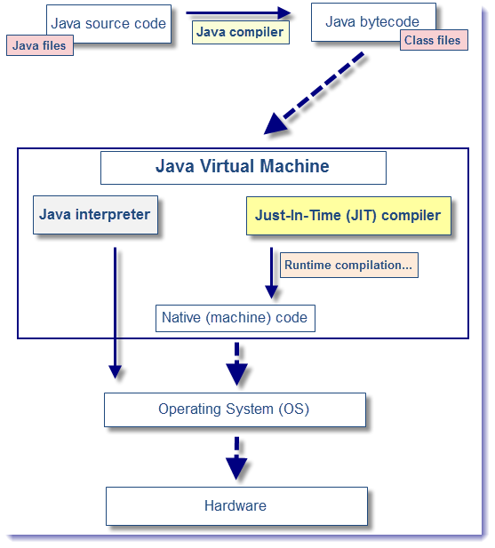

[TOC]

# JVM预热

阿里双11大促前有一项工作是预热，那么是预热，有什么作用？

## 回顾JIT编译相关知识

在部分商用虚拟机中（如HotSpot），Java程序最初是通过解释器（Interpreter）进行解释执行的，当虚拟机发现某个方法或代码块的运行特别频繁时，就会把这些代码认定为“热点代码”。为了提高热点代码的执行效率，在运行时，虚拟机将会把这些代码编译成与本地平台相关的机器码，并进行各种层次的优化，完成这个任务的编译器称为即时编译器（Just In Time Compiler，下文统称JIT编译器）。

参考学习：https://blog.csdn.net/luzhensmart/article/details/108278108

### 前端编译器：源代码到字节码

即.java源代码文件到.class字节码文件，主要阶段如下

1. 词法、语法分析，生成一个抽象的语法树

2. 填充符号表。类之间是会互相引用的，但在编译阶段，我们无法确定其具体的地址，所以我们会使用一个符号来替代。在这个阶段做的就是类似的事情，即对抽象的类或接口进行符号填充。等到类加载阶段，JVM 会将符号替换成具体的内存地址

3. 注解处理。Java 是支持注解的，因此在这个阶段会对注解进行分析，根据注解的作用将其还原成具体的指令集

4. 分析与字节码生成。到了这个阶段，JVM 便会根据上面几个阶段分析出来的结果，进行字节码的生成，最终输出为 class 文件

### JIT 编译器：从字节码到机器码

当源代码转化为字节码之后，其实要运行程序，有两种选择。一种是使用 Java 解释器解释执行字节码，另一种则是使用 JIT 编译器将字节码转化为本地机器代码。

* Java解释器解释执行字节码：启动速度快但运行速度慢，解释器不需要像 JIT 编译器一样，将所有字节码都转化为机器码，自然就少去了优化的时间

* 当 JIT 编译器完成第一次编译后，其会将字节码对应的机器码保存下来，下次可以直接使用，机器码的运行效率肯定是高于 Java 解释器的，故启动速度慢但运行速度快

#### HotSpot 虚拟机

HotSpot 虚拟机内置了两个即时编译器，分别称为 Client Compiler 和Server Compiler。这两种不同的编译器衍生出两种不同的编译模式，我们分别称之为：C1 编译模式，C2 编译模式。

C1 编译模式会将字节码编译为本地代码，进行简单、可靠的优化，如有必要将加入性能监控的逻辑。而 C2 编译模式，也是将字节码编译为本地代码，但是会启用一些编译耗时较长的优化，甚至会根据性能监控信息进行一些不可靠的激进优化。

HotSpot 虚拟机来一共有三种运行模式可选(java -version 可查看)，分别是：

1. 混合模式（Mixed Mode） 。即 C1 和 C2 两种模式混合起来使用，这是默认的运行模式。如果你想单独使用 C1 模式或 C2 模式，使用 -client 或 -server 打开即可。
2. 解释模式（Interpreted Mode）。即所有代码都解释执行，使用 -Xint 参数可以打开这个模式。
3. 编译模式（Compiled Mode）。 此模式优先采用编译，但是无法编译时也会解释执行，使用 -Xcomp 打开这种模式。

### AOT 编译器：源代码到机器码

AOT 编译器的基本思想是：在程序执行前生成 Java 方法的本地代码，以便在程序运行时直接使用本地代码。

AOT 编译器其存在的目的在于避免 JIT 编译器的运行时性能消耗或内存消耗，或者避免解释程序的早期性能开销。

AOT 编译器编译出来的代码比 JIT 编译出来的慢，但是比解释执行的快。

## 没有预热的一些异常现象

* 服务重启后，访问异常，访问超时

引起的原因大概可以归结于：

1. 服务启动后，jvm并未完全准备完毕，JIT未编译等。
2. 应用程序使用的各种资源未准备就绪。
3. 负载均衡发生了rebalance。
