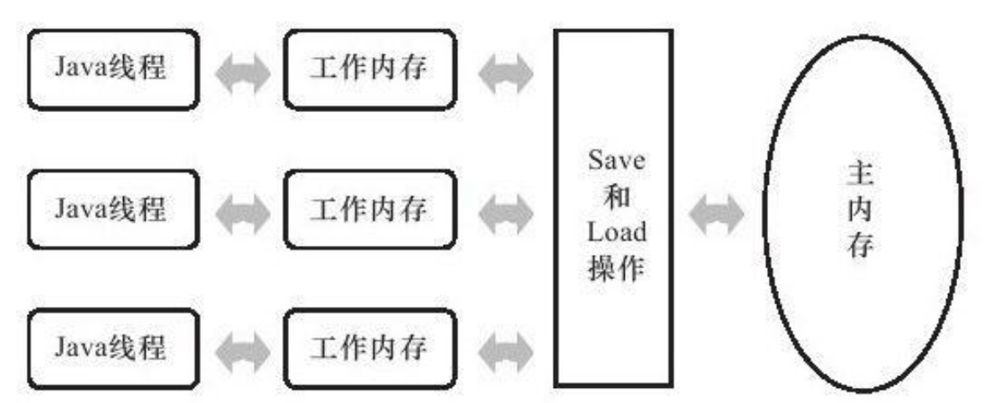

[TOC]

# Java 内存模型与线程

## 学习文档

参考学习1: <a target='_blank' href='http://tutorials.jenkov.com/java-concurrency/java-memory-model.html'>Java Memory Model外文文档</a>

## 硬件的效率 与 一致性

多处理器的情况下，每个处理器都有自己的高速缓存，而它们又共享同一内存（Main Memory）；当多个处理器的运算任务都涉及同一块主内存区域时，将可能导致各自的缓存数据不一致


* 主内存：java虚拟机规定所有的变量(不是程序中的变量)都必须在主内存中产生；为了方便理解，可以认为是堆区。可以与前面说的物理机的主内存相比，只不过物理机的主内存是整个机器的内存，而虚拟机的主内存是虚拟机内存中的一部分。

* 工作内存：java虚拟机中每个线程都有自己的工作内存，该内存是线程私有的；为了方便理解，可以认为是虚拟机栈。线程的工作内存保存了线程需要的变量在主内存中的副本。虚拟机规定，线程对主内存变量的修改必须在线程的工作内存中进行，不能直接读写主内存中的变量。不同的线程之间也不能相互访问对方的工作内存。如果线程之间需要传递变量的值，则必须通过主内存来作为中介进行传递。

## Java 主内存与工作内存

Java内存模型(JMM), 主要目标是：定义各个变量（注意是共享变量，如实例字段，静态字段，构成数组对象的元素等，不包括局部变量）的访问规则，即在虚拟机中将变量存储到内存和从内存中取出变量这样的底层细节

Java的每个线程有自己的工作线程（Working Memory, 可类比处理器的高速缓存），线程的工作内存中保存了该线程使用到的变量的**主内存副本拷贝**，**线程对变量的所有操作（读取，赋值等）都必须在工作内存中进行，而不能直接读写主内存中的变量**。不同的线程之间也无法直接访问对方工作内存中的变量，线程间变量值的传递需要通过主内存



主内存与工作内存之间的具体交互协议，虚拟机保证如下的每一种操作都是原子的，不可再分的（对于double,long类型的变量有例外，商用JVM基本优化了这个问题）

* lock: 作用于主内存的变量，它把一个变量标识为一个线程独占的状态

* unlock：作用于主内存的变量， 解锁

* load：作用于工作内存的变量，它把read操作从主内存中得到的变量值放入工作内存的变量副本中

* use：作用于工作内存的变量，它把工作内存中一个变量的值传递给执行引擎，每当虚拟机遇到一个需要使用到变量的值的字节码指令时将会执行这个操作

* assign: 作用于工作内存的变量，它把一个从执行引擎接收到的赋值给工作内存的变量，每当虚拟机遇到一个给变量赋值的字节码指令时执行这个操作

* store: 作用于工作内存的变量，它把工作内存中的一个变量的值传送到主内存中，以便随后的write操作使用

* write：作用于主内存的变量，它把store操作从工作内存中得到的变量的值放入主内存的变量中

### volatile（可见性&顺序性）

当一个变量定义为`volatile`之后

线程写volatile变量的过程：
    1. 改变线程工作内存的中volatile变量副本的值。
    2. 将改变后的副本的值从工作内存刷新到主内存。

线程读volatile变量的过程：
    1. 从主内存中读取volatile变量的最新值到线程的工作内存中。
    2. 从工作内存中读取volatile变量的副本。

即volatile变量在每次被线程访问时，都强迫从主内存中重读该变量的值，而当该变量发生变化时，又会强迫线程将最新的值刷新到主内存。这样任何时候，不同的线程总能看到该变量的最新值。

所以volatile具备如下特性：

* 保证此变量对所有线程的**可见性**（指当一条线程修改了这个变量的值，新值对于其它线程来说是可以立即知晓的。普通变量需要通过工作线程，主线程传递来做到）

* 在各个线程的工作线程中, `volatile`变量也可以存在不一致的情况，但由于每次使用之前都要先刷新，执行引擎看不到不一致的情况，因此可以认为不存在一致性问题，但是Java里面的运算并非都是原子操作，这导致volatile变量的运算在并发下一样是线程不安全的

```java
static int count = 20_000;
volatile int num = 0;
int coreSize = Runtime.getRuntime().availableProcessors();
ThreadPoolExecutor exec = new ThreadPoolExecutor(coreSize * 2,
        coreSize * 3, 0, TimeUnit.SECONDS,
        new LinkedBlockingQueue<Runnable>(500), new ThreadPoolExecutor.CallerRunsPolicy());

public void test() {
    for (int i = 0; i < count; i++) {
        exec.execute(new Runnable() {
            @Override
            public void run() {
                num++;
            }
        });
    }
    System.out.println("count:" + count);
    System.out.println("num:" + num);
    System.out.println("abs(num-count):" + Math.abs(count - num));
}

public static void main(String[] args) throws Exception{
    MainTest mainTest = new MainTest();
    mainTest.test();
}
```

* output

```java
count:20000
num:19763
abs(num-count):237
```

2. 禁止指令重排序优化，即线程内表现为串行的语义，保证**顺序性**

`volatile`使用原则：`volatile`变量读操作的性能消耗与普通变量几乎没有什么差别，但是写操作可能慢一些，因为它需要在本地代码中插入许多**内存屏障**来保证处理器不发生乱序执行。不过即便如此，大多数场景下`volatile`的总开销仍然比锁低，我们在`volatile`与锁之中选择的唯一依据仅仅是：`volatile`的语义能否满足使用场景的要求

### 原子性，可见性，有序性

* 原子性

lock, unlock 对应Java指令的`monitorenter`和`monitorexit`；`synchronized`关键字隐含了这两个指令，所以`synchronized`块之间的操作也具备了原子性

* 可见性

指当多个线程访问同一个变量时，一个线程修改了这个变量的值，其它线程能够立即看得到修改的值。

当一个变量被volatile修饰是，它会保证修改的值会立即被更新到主存，当有其它线程需要读取时，他回去内存中读取新值。

`synchronized` 和 `final` 也能保证可见性

* 有序性

线程内串行有序 / 指令重排 / 工作内存与主内存同步延迟

`synchronized` 和 `volotile`

## 并行（parallellism） 和 并发（concurrency）

并行：当系统有一个以上CPU时，则线程的操作有可能非并发，而可以同时进行(一个CPU执行一个线程时，另一个CPU可以执行另一个线程)，两个线程互不抢占CPU资源，可以同时进行，这种方式我们称之为并行(Parallel)。

并发：当有多个线程在操作时,如果系统只有一个CPU,则它根本不可能真正同时进行一个以上的线程；它只能把CPU运行时间划分成若干个时间段,再将时间片分配给各个线程执行，在一个时间段的线程代码运行时，其它线程处于挂起状态。这种方式我们称之为并发(Concurrent)。
