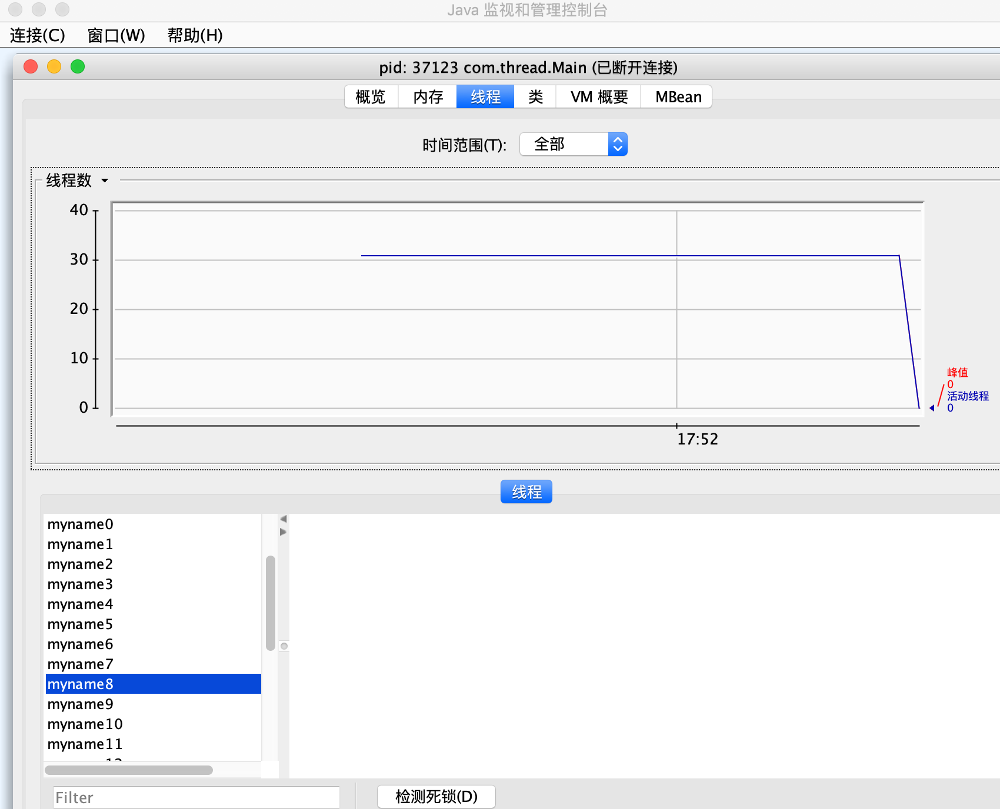
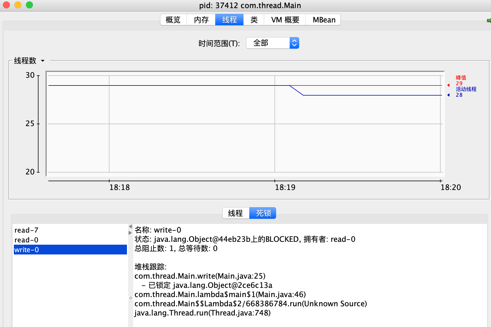

[TOC]

# Synchronized & monitor指令

## 回顾并发的三大性质

### 原子性

一个操作或者多个操作，要么全部执行并且执行的过程不会被任何因素打断，要么就都不执行。即使是在多个线程一起执行的时候，一个操作一旦开始，就不会被其它线程干扰.

`volatile` 不能保证原子性，
`synchronized` 在作用对象的作用范围内，依赖JVM实现操作的原子性。
`Lock` 依赖特殊的CPU指令，代码实现，如`ReentrantLock`

### 可见性

当多个线程访问同一个变量的时候，一旦线程修改了这个变量的值，其他线程能够立即看到修改的值。

导致共享变量在线程间不可见的原因：

1. 线程交叉执行
2. 代码重排序结合线程交叉执行
3. 共享变量更新后的值没有在工作内存与主内存之间及时更新

`volatile` 通过加入内存屏障和禁止重排序优化来实现可见性
`synchronized` monitor enter exit 确保可见性

### 有序性

程序执行的顺序按照代码的先后顺序执行

* Java内存模型中，允许编译器和处理器对指令进行重排序，但重排序过程不会影响到单线程程序的执行，却会影响到多线程并发执行的正确性

`volatile`、`syncronized`、`Lock`都可保证有序性。

## synchronized的几个性质

* `synchronized` 提供了一种锁对机制，能确保共享变量的互斥访问，从而防止数据不一致问题的出现

* `synchronized` 包括了`monitorenter`和`monitorexit`两个JVM指令，他能确保在任何时候，任何线程执行到`monitor enter`成功之前都必须从`主内存`中获取数据，而不是从`缓存`中，在`monitor exit`运行成功之后，共享变量被更新后的值必须刷入`主内存`内

* `synchronized` 严格准守`Java happends-before`规则，一个`monitor exit`指令之前必定要有一个`monitor enter`

### 反编译查看(字节码层级的实现)

```java
public class SynchronizedDemo {
    public void method (){
        synchronized (this) {
            System.out.println("method 1 start!!!!");
        }
    }
}
```

```java
javac -encoding utf-8 SynchronizedDemo.java
javap -c SynchronizedDemo
```

```java
Compiled from "SynchronizedDemo.java"
public class SynchronizedDemo {
  public SynchronizedDemo();
    Code:
       0: aload_0
       1: invokespecial #1                  // Method java/lang/Object."<init>":()V
       4: return

  public void method();
    Code:
       0: aload_0
       1: dup
       2: astore_1
       3: monitorenter
       4: getstatic     #2                  // Field java/lang/System.out:Ljava/io/PrintStream;
       7: ldc           #3                  // String method 1 start!!!!
       9: invokevirtual #4                  // Method java/io/PrintStream.println:(Ljava/lang/String;)V
      12: aload_1
      13: monitorexit
      14: goto          22
      17: astore_2
      18: aload_1
      19: monitorexit
      20: aload_2
      21: athrow
      22: return
    Exception table:
       from    to  target type
           4    14    17   any
          17    20    17   any
}
```

参考：<a href="https://docs.oracle.com/javase/specs/jvms/se8/html/jvms-3.html#jvms-3.14" target="_blank">https://docs.oracle.com/javase/specs/jvms/se8/html/jvms-3.html#jvms-3.14</a>

### JVM层级(Hotspot实现)的实现

// TODO

## 基本用法

`synchronized` 可用于代码块或方法进行修饰，而不能对class以及变量进行修饰, eg:

```java
public synchronized void sync(){}

public synchronized static void sync(){}
```

```java
private final Object Mutex = new Object()

public void sync(){
    // Mutex 一定不能为null(If objectref is null, monitorenter throws a NullPointerException.)
    synchronized(Mutex){

    }
}
```

### synchronized(this/Object)

```java
package com.thread;

import java.text.SimpleDateFormat;
import java.util.ArrayList;
import java.util.Date;
import java.util.List;
import java.util.concurrent.TimeUnit;

public class Main {
    private final static Object Mutex = new Object();
    public int num;
    static int n = 5;

    void add() {
        synchronized (this) {
            try {
                TimeUnit.SECONDS.sleep(1);
            } catch (Exception e) {
                e.printStackTrace();
            }
            this.num++;
            System.out.println(Thread.currentThread().getName()+ ":" + num +
                    new SimpleDateFormat("yyyy-MM-dd HH:mm:ss").format(new Date())
            );
        }
    }

    void sub(){
        synchronized (Mutex) {
            try {
                TimeUnit.SECONDS.sleep(2);
            } catch (Exception e) {
                e.printStackTrace();
            }
            this.num--;
            System.out.println(Thread.currentThread().getName()+ ":" + num +
                    new SimpleDateFormat("yyyy-MM-dd HH:mm:ss").format(new Date())
            );
        }
    }

    void add2(){
        synchronized (Main.class) {
            try {
                TimeUnit.SECONDS.sleep(2);
            } catch (Exception e) {
                e.printStackTrace();
            }
            this.num += 2;
            System.out.println(Thread.currentThread().getName()+ ":" + num +
                    new SimpleDateFormat("yyyy-MM-dd HH:mm:ss").format(new Date())
            );
        }
    }

    void printNum(){
        System.out.println("num:" + this.num);
    }

    public static void main(String[] args) throws Exception{
        Main main = new Main();
        main.num = 1;
        List<Thread> threadList = new ArrayList<>(n);
        for(int i=0;i<n;i++){
            Thread t = new Thread( ()-> main.add(), "add" + i);
            Thread t2 = new Thread(()-> main.sub(), "sub" + i);
            threadList.add(t);
            threadList.add(t2);
        }
        threadList.forEach(t->t.start());
        threadList.forEach(t->{
            try{
                t.join();
            }catch (Exception e){
                e.printStackTrace();
            }
        });
        System.out.println("main===");
        main.printNum();
    }
}

```

* this指代当前类的实例
* synchronized 锁住的不同，决定两个方法(代码块)是否能同时运行，即是同步而不是相互阻塞的

## 实际例子

```java
package com.thread;

import java.util.ArrayList;
import java.util.List;
import java.util.concurrent.TimeUnit;


public class Main {

    private final static Object Mutex = new Object();
    public int num;
    static int n = 16;

    void add(){
        try {
            TimeUnit.SECONDS.sleep(1);
        }catch (Exception e){
            e.printStackTrace();
        }
        this.num++;
    }

    void addSync(){
        synchronized (Mutex){
            this.num++;
        }
    }

    void printNum(){
        System.out.println("num:" + this.num);
    }

    public static void main(String[] args) throws Exception{
        Main main = new Main();
        main.num = 1;
        List<Thread> threadList = new ArrayList<>(n);
        for(int i=0;i<n;i++){
           Thread t = new Thread( ()-> main.add(), "myname" + i);
//            Thread t = new Thread(()-> main.addSync());
            threadList.add(t);
        }
        threadList.forEach(t->t.start());
        threadList.forEach(t->{
            try{
                t.join();
            }catch (Exception e){
                e.printStackTrace();
            }
        });
        main.printNum();
    }
}

```



`synchronized`存在排它性，所有的线程必须串行的经过`synchronized`保护的共享区域；`synchronized`作用域越大，则代表着其效率越低，甚至还会丧失并发的优势

注意到 Mutex 是如下定义的，`static`的, 如果非static则根本不是一个共享区域

```java
private final static Object Mutex = new Object();
```

## 多个锁的交叉导致的死锁

```java
package com.thread;

import java.util.ArrayList;
import java.util.List;
import java.util.concurrent.TimeUnit;


public class Main {

    private final static Object ReadMutex = new Object();
    private final static Object WriteMutex = new Object();
    public int num;

    int read(){
        synchronized (ReadMutex){
            synchronized (WriteMutex){
                return this.num;
            }
        }
    }

    void write(){
        synchronized (WriteMutex){
            synchronized (ReadMutex){
                this.num ++;
            }
        }
    }

    void printNum(){
        System.out.println("num:" + this.num);
    }

    public static void main(String[] args) throws Exception{
        Main main = new Main();
        main.num = 0;
        int n = 15;
        List<Thread> threadList = new ArrayList<>(n);
        int j = 0;
        int k = 0;
        for(int i=0;i<n;i++){
            if(i % 2 == 0){
                Thread t = new Thread( ()-> main.read(), "read-" + j++);
                threadList.add(t);
            }else {
                Thread t = new Thread( ()-> main.write(), "write-" + k++);
                threadList.add(t);
            }
        }
        threadList.forEach(t->t.start());
        threadList.forEach(t->{
            try{
                System.out.println(t.getName());
                t.join();
            }catch (Exception e){
                e.printStackTrace();
            }
        });
        main.printNum();
    }
}
```





## this monitor

```java
package com.thread;

import java.util.concurrent.TimeUnit;

public class Main {

    public synchronized void method1(){
        System.out.println(Thread.currentThread().getName() + " enter to method 1  ");
        while (true) {
            try {
                TimeUnit.SECONDS.sleep(2);
            } catch (InterruptedException e) {
                e.printStackTrace();
            }
        }
    }

    public synchronized void method2(){
        System.out.println(Thread.currentThread().getName() + " enter to method 2  ");
        while (true) {
            try {
                TimeUnit.SECONDS.sleep(2);
            } catch (InterruptedException e) {
                e.printStackTrace();
            }
        }
    }

    public static void main(String[] args) throws Exception{
        Main main = new Main();
        new Thread(main::method1, "T1").start();
        new Thread(main::method2, "T2").start();
    }
}
```

* output如下，然后程序暂停，jstack查看如下

```js
T1 enter to method 1  
```


两个`synchronized`方法挣抢的是同一个`monitor`的`lock`,而与之关联的引用则是`This Monitor`的实例引用

方法2等同如下：

```java
public void method2(){
    synchronized (this){
        System.out.println(Thread.currentThread().getName() + " enter to method 2  ");
        while (true) {
            try {
                TimeUnit.SECONDS.sleep(2);
            } catch (InterruptedException e) {
                e.printStackTrace();
            }
        }
    }
}
```

## class monitor

```java
package com.thread;

import java.util.concurrent.TimeUnit;

public class Main {

    public synchronized static void method1(){
        System.out.println(Thread.currentThread().getName() + " enter to method 1  ");
        while (true) {

            try {
                TimeUnit.SECONDS.sleep(2);
            } catch (InterruptedException e) {
                e.printStackTrace();
            }
        }
    }

    public synchronized static void method2(){
        System.out.println(Thread.currentThread().getName() + " enter to method 2  ");
        while (true) {
            try {
                TimeUnit.SECONDS.sleep(2);
            } catch (InterruptedException e) {
                e.printStackTrace();
            }
        }
    }

    public static void main(String[] args) throws Exception{
        new Thread(Main::method1, "T1").start();
        new Thread(Main::method2, "T2").start();
    }
}
```

* output如下，然后程序暂停

```js
T1 enter to method 1  

```

## synchronized 的缺陷? 为什么有其它的各种锁?

* 无法控制阻塞时长
* 阻塞不可被中断

```java
public class Main {

    public synchronized void syncMethod() {
        try {
            TimeUnit.HOURS.sleep(1);
        } catch (InterruptedException e) {
            e. printStackTrace();
        }
    }

    public static void main(String[] args) throws Exception{
        Main defect=new Main();

        Thread thread1 = new Thread(defect:: syncMethod,"T1");
        // thread1 将先于 thread2 执行
        thread1. start();
        TimeUnit.MILLISECONDS.sleep(2);

        Thread thread2 = new Thread(defect::syncMethod,"T2");
        thread2.start();
    }
}
```

1. thread1 先执行进入同步方法，然后sleep
2. 接着 thread2 进入同步方法，会阻塞，其获得执行权取决于 thread1 何时释放 monitor (如果thread2计划最多1分钟获得执行权，否则就放弃，使用 synchronized 无法做到)
3. thread2 竞争 monitor 而陷入阻塞状态，那么 thread2 会无法中断（因为**synchronized 无法被打断**）

```java
public class Main {

    public synchronized void syncMethod() {
        try {
            TimeUnit.HOURS.sleep(1);
        } catch (InterruptedException e) {
            e. printStackTrace();
        }
    }

    public static void main(String[] args) throws Exception{
        Main defect=new Main();

        Thread thread1 = new Thread(defect:: syncMethod,"T1");
        // thread1 将先于 thread2 执行
        thread1. start();
        TimeUnit.MILLISECONDS.sleep(2);

        Thread thread2 = new Thread(defect::syncMethod,"T2");
        thread2.start();

        TimeUnit.MILLISECONDS.sleep(2);
        thread2.interrupt();
        // true
        System.out.println(thread2.isInterrupted());
        // BLOCKED
        System.out.println(thread2.getState());
        // TIMED_WAITING
        System.out.println(thread1.getState());

    }
}
```

`synchronized`是基于JVM层面实现的，如果一个代码块被`synchronized`修饰了，当一个线程获取了对应的锁，并执行该代码块时，其它线程便只能一直等待，等待获取锁的线程释放锁，而这里获取锁的线程释放锁会有三种情况：

1. 获取锁的线程执行完了该代码块，然后线程释放对锁的占有；
2. 线程执行发生异常，此时JVM会让线程自动释放锁。
3. wait()方法释放锁，方便其它的线程使用锁。而且被唤醒时，就在此处唤醒

### synchronized 缺陷例子

当有多个线程读写文件时，`读操作和写操作`，`写操作和写操作`会发生冲突现象，但是`读操作和读操作`不会发生冲突现象。如果采用`synchronized`关键字来实现同步的话，就会导致一个问题：

* 当一个线程在进行读操作时，其它线程只能等待无法进行读操作。(因为使用`synchronized`，一个线程占用了monitor,其它线程就只能等)

参考：<a href="https://www.cnblogs.com/dolphin0520/p/3923167.html" target="_blank">lock</a>

## `synchronized`使用原则

1. sychronized的对象最好选择引用不会变化的对象（例如被标记为final,或初始化后永远不会变），原因显而易见的，虽然synchronized是在对象上加锁，但是它首先要通过引用来定位对象，如果引用会变化，可能带来意想不到的后果，对于需要synchronized不同对象的情况，建议的做法是为每个对象构建一个Object锁来synchronized（不建议对同一个引用反复赋值）。当然将synchronized作为修饰符修饰方法就不会有引用变化的问题，但是这种做法在方法体较大时容易违反第二个原则。

2. 尽可能把synchronized范围缩小，线程互斥是以牺牲并发度为代价的

3. 尽量不要在可变引用上`wait()`和`notify()`，例如:

```java
synchronized (a) {
    a.wait() // (1)
}
```

若其他线程在线程1进入(1)时更改了a值，那么线程1会直接抛出一个`IllegalMonitorStateException`，表示在`a.wait()`前没有获得a的对象锁。推荐的做法还是声明一个专门用于线程同步的Object，这个Object永远不变。

```java
import java.util.ArrayList;
import java.util.List;
import java.util.Random;
import java.util.concurrent.TimeUnit;


public class Main {

    private Object Mutex = new Object();
    public int num;
    static int n = 16;

    void add(){
        try {
            TimeUnit.SECONDS.sleep(1);
        }catch (Exception e){
            e.printStackTrace();
        }
        this.num++;
    }

    void addSync(){
        synchronized (Mutex){
            try {
                System.out.println("addSync" + this.num);
                Mutex.wait();
                TimeUnit.SECONDS.sleep(new Random().nextInt(5));
            }catch (Exception e){
                e.printStackTrace();
            }
            this.num++;
        }
    }

    void change(){
        try {
            TimeUnit.SECONDS.sleep(1);
        }catch (Exception e){
            e.printStackTrace();
        }
        System.out.println("change");
        Mutex.notify();
        Mutex = new Object();
    }

    void printNum(){
        System.out.println("num:" + this.num);
    }

    public static void main(String[] args) throws Exception{
        Main main = new Main();
        main.num = 1;

        Thread tChange = new Thread(()-> main.change());
        tChange.start();

        List<Thread> threadList = new ArrayList<>(n);
        for(int i=0;i<n;i++){
//            Thread t = new Thread( ()-> main.add(), "myname" + i);
            Thread t = new Thread(()-> main.addSync());
            threadList.add(t);
        }
        threadList.forEach(t->t.start());
        threadList.forEach(t->{
            try{
                t.join();
            }catch (Exception e){
                e.printStackTrace();
            }
        });
        main.printNum();
    }
}
```

* output

```java
Exception in thread "Thread-0" java.lang.IllegalMonitorStateException
	at java.lang.Object.notify(Native Method)
	at Main.change(Main.java:45)
	at Main.lambda$main$0(Main.java:57)
	at java.lang.Thread.run(Thread.java:748)
```

参考：<a href="https://blog.csdn.net/xad707348125/article/details/46956911" target="_blank">synchronized锁分析</a>

## synchronized修饰静态方法和非静态方法的区别？

synchronized在静态方法上表示调用前要获得类的锁，而在非静态方法上表示调用此方法前要获得对象的锁。锁是加在单个对象上，不同的对象没有竞争关系；锁是加载类上，这个类所有的对象竞争一把锁。

## synchronized 可重入吗？

`synchronized`具有重入性。每个对象拥有一个计数器，当线程获取该对象monitor锁后，计数器就会加一，释放锁后就会将计数器减一。

## synchronized 锁升级

JDK早期`synchronized`直接重量级锁(操作系统层面)

JDK1.6对`synchronized`做了优化，`synchronized`锁有一个升级的过程，升级到最后才会变成重量级锁！

```java
                【偏向锁】
                /      \
对象new出来(无锁)         \
                \        \
                  \       \
                    \      \
                      \     \
                      【轻量级锁】
                         \
                          \
                           \
                           【重量级锁】
```

偏向锁默认启动，会延迟启动(普通对象，有了偏向锁就是个匿名偏向)

### 为什么会有偏向锁？

实践中发现：多数`sychronized方法`，在很多情况下，只有一个线程在运行，例如

* StringBUffer中的一些sync方法
* Vector中的一些sync方法

重量级锁没必要，不需要操作系统，直接用户态搞定

### 多线程竞争，抢锁（CAS完成）

轻量级锁/自旋锁，Java对象头markword记录：指向线程栈中的`Lock Record`的指针（不需要操作系统）

(**乐观锁**，**忙等待**)

### 偏向锁 什么时候升级为 轻量级锁？

只要有线程竞争

### 轻量级锁 什么时候升级为 重量级锁？

JDK1.6之前：自旋次数10次；或者多个线程等待(超过CPU核心树1/2) 就会发生升级;目前是JVM自适应自旋的升级

* <font color="red">轻量级锁:消耗CPU（用户态，不经过操作系统）</font>

* <font color="red">重量级锁:不消耗CPU，有一个等待队列（阻塞）; 涉及到用户态/内核态切换</font>
