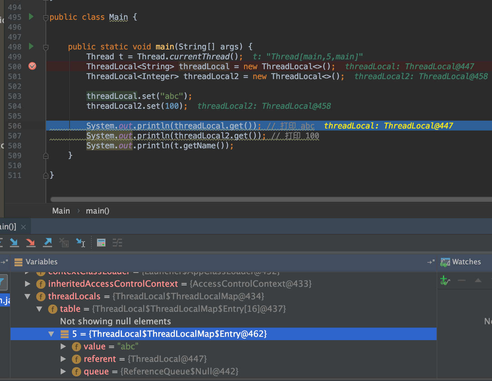
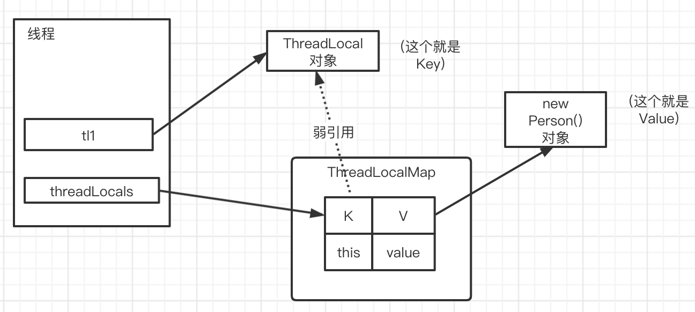

[TOC]

# ThreadLocal

`ThreadLocal`并不是一个线程，而是线程的一个局部变量(属于线程)

`ThreadLocal`用于保存某个线程共享变量：对于同一个static ThreadLocal，不同线程只能从中get，set，remove自己的变量，而不会影响其他线程的变量

## 实现思路

* Thread类有一个类型为`ThreadLocal.ThreadLocalMap`的实例变量`threadLocals`，也就是说每个线程有一个自己的`ThreadLocalMap`(是线程自己拥有的一个map，ThreadLocalMap有个静态类Entry使用了弱引用`Entry extends WeakReference<ThreadLocal<?>>`)。

* 使用例子



`new ThreadLocal<>();`就仅仅实例化一个`ThreadLocal`对象，该对象会作为线程`ThreadLocal.ThreadLocalMap`的`Entry`对象中的key

### set源码

```java
public void set(T value) {
    Thread t = Thread.currentThread();
    ThreadLocalMap map = getMap(t);
    if (map != null)
        map.set(this, value);
    else
        createMap(t, value);
}
```

* this 是`ThreadLocal`对象自身，即set到Map的`<key, value>`也即set`<ThreadLocal.this, value>`，new几个ThreadLocal就能有多少个键值对

```java
private void set(ThreadLocal<?> key, Object value) {

    // We don't use a fast path as with get() because it is at
    // least as common to use set() to create new entries as
    // it is to replace existing ones, in which case, a fast
    // path would fail more often than not.

    Entry[] tab = table;
    int len = tab.length;
    int i = key.threadLocalHashCode & (len-1);

    for (Entry e = tab[i];
            e != null;
            e = tab[i = nextIndex(i, len)]) {
        ThreadLocal<?> k = e.get();

        if (k == key) {
            e.value = value;
            return;
        }

        if (k == null) {
            replaceStaleEntry(key, value, i);
            return;
        }
    }
    // 新增一个Entry,key就是`ThreadLocal.this`
    tab[i] = new Entry(key, value);
    int sz = ++size;
    if (!cleanSomeSlots(i, sz) && sz >= threshold)
        rehash();
}

static class Entry extends WeakReference<ThreadLocal<?>> {
    /** The value associated with this ThreadLocal. */
    Object value;

    Entry(ThreadLocal<?> k, Object v) {
        super(k);
        value = v;
    }
}
```

* 注意到`Entry`是个弱引用`WeakReference<ThreadLocal<?>`，如下图所示



1. 如果当定义出来的`ThreadLocal`对象tl1不用了，即指向`ThreadLocal`的引用没了，那么`ThreadLocal`对象要被回收
2. 假如说this是个强引用，那么显然只要线程不结束，`ThreadLocalMap`就存在，引用关系就存在；那么`ThreadLocal`就永远不会被回收，即有内存泄漏了
3. 所以this被设计成为一个弱引用，只要gc发现不用了，就会将`ThreadLocal`对象tl1进行回收；这样当`ThreadLocal`对象被回收后，`ThreadLocalMap`里面的key是个null被回收，这使得value就访问不到，但是value的引用是存在的，这就会导致内存泄漏
5. 所以需要显示的remove掉value，即执行`tl1.remove();`

## 使用场景

1. 在进行对象跨层传递的时候，可以考虑`ThreadLocal`，避免方法多次传递，打破层次间的约束

2. 线程间数据隔离

3. 进行事务操作，用于存储线程事务信息

### 自己项目中使用到的实际例子?

比如一个查询，要经过一层一层处理，最后还有记录此次的查询记录；

其中有个queryId，可以放到`ThreadLocal`中，这样打点&记录随时可以取出queryId

## ThreadLocal会产生内存泄漏吗?

<font color='red'>会</font>

1. 弱引用做了一道工作
2. 但是仍需要显示的remove掉ThreadLocal的value
