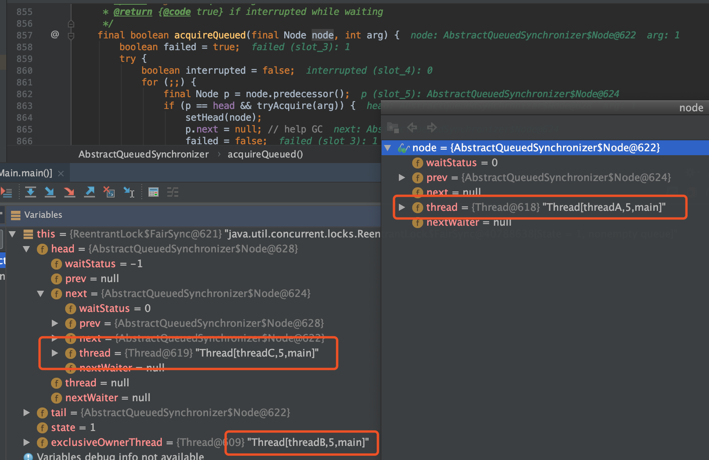
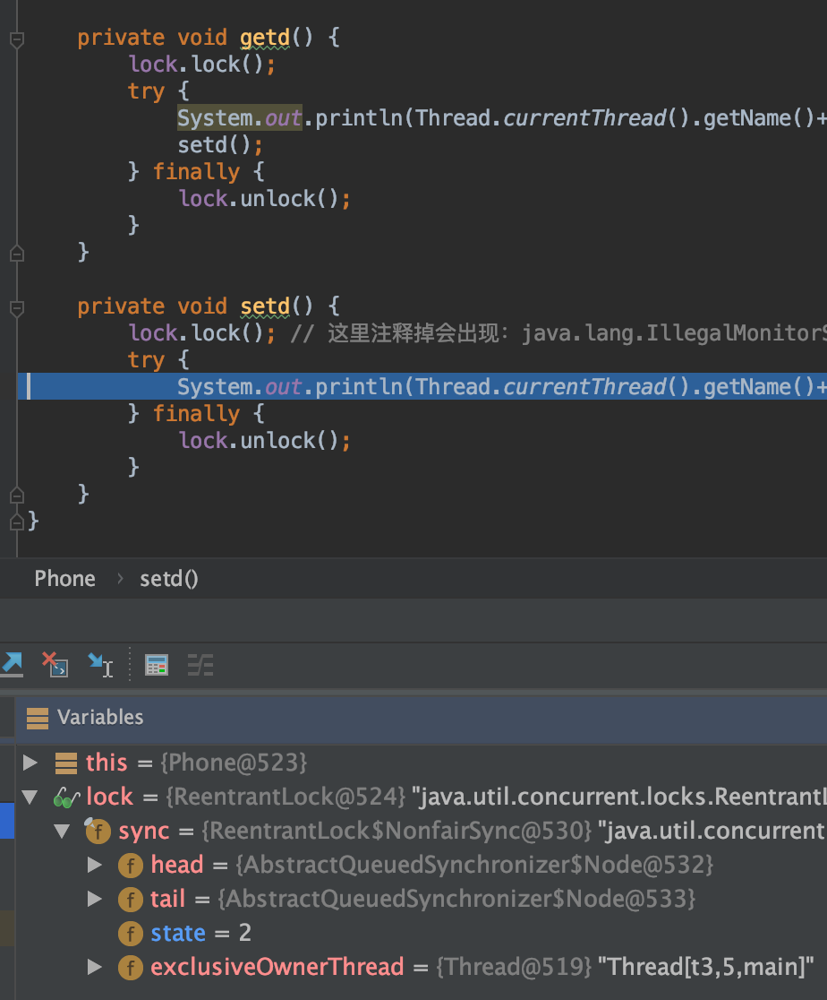
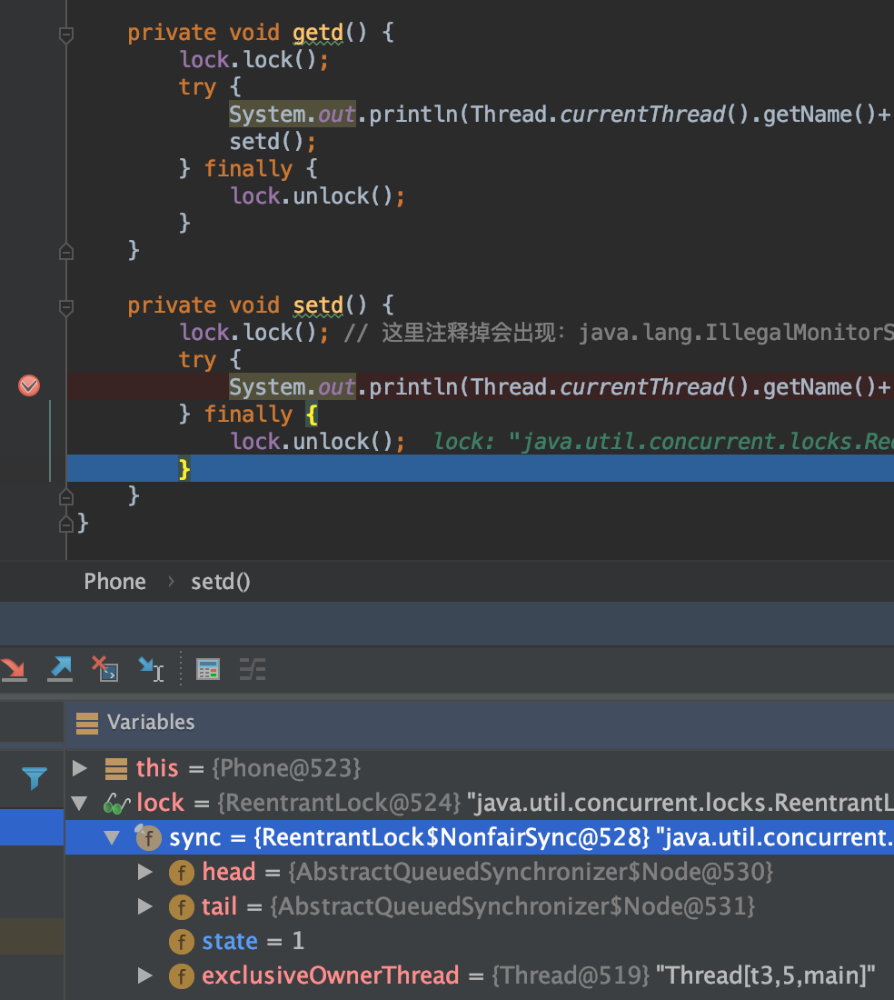

[TOC]

# Lock

## Lock基本用法例子

`Lock是`Java中的一个`interface`

* lock, unlock

```java
import java.util.ArrayList;
import java.util.List;
import java.util.concurrent.TimeUnit;
import java.util.concurrent.locks.ReentrantLock;

public class Main {
    private final static Object Mutex = new Object();
    public int num;
    static int n = 16;

    public static ReentrantLock lock = new ReentrantLock();

    void add(){
        try {
            TimeUnit.SECONDS.sleep(1);
        }catch (Exception e){
            e.printStackTrace();
        }
        this.num++;
    }

    void addSync(){
        synchronized (Mutex){
            this.num++;
        }
    }

    void addLock(){
        //获取锁
        lock.lock();
        try{
            this.num++;
        }catch (Exception e){
            e.printStackTrace();
        }finally {
            lock.unlock();
        }
    }

    void printNum(){
        System.out.println("num:" + this.num);
    }

    public static void main(String[] args) throws Exception{
        Main main = new Main();
        main.num = 0;
        List<Thread> threadList = new ArrayList<>(n);
        for(int i=0;i<n;i++){
//            Thread t = new Thread( ()-> main.add(), "myname" + i);
            Thread t = new Thread( ()-> main.addLock(), "myname" + i);
//            Thread t = new Thread(()-> main.addSync());
            threadList.add(t);
        }
        threadList.forEach(t->t.start());
        threadList.forEach(t->{
            try{
                t.join();
            }catch (Exception e){
                e.printStackTrace();
            }
        });
        main.printNum();
    }
}
```

* tryLock(long time, TimeUnit unit)

```java
package com.thread;

import java.util.ArrayList;
import java.util.List;
import java.util.concurrent.TimeUnit;
import java.util.concurrent.locks.ReentrantLock;

public class Main {
    private final static Object Mutex = new Object();
    public int num;
    static int n = 16;

    public static ReentrantLock lock = new ReentrantLock();

    void addLock(){
        try{
            lock.lock();
            System.out.println(Thread.currentThread().getName()+"获得锁");
            TimeUnit.SECONDS.sleep(2);
            this.num ++;
        }catch (Exception e){
            e.printStackTrace();
        }finally {
            lock.unlock();
            System.out.println(Thread.currentThread().getName() + "释放锁");
        }
    }

    void subLock(){
        try{
            if(lock.tryLock(1, TimeUnit.SECONDS)){
                System.out.println(Thread.currentThread().getName()+"获得锁");
                this.num --;
            }else{
                System.out.println(Thread.currentThread().getName()+"未获得锁");
            }
        }catch (Exception e){
            e.printStackTrace();
        }finally {
            if(lock.isHeldByCurrentThread()){
                lock.unlock();
            }
        }
    }

    void printNum(){
        System.out.println("num:" + this.num);
    }

    public static void main(String[] args) throws Exception{
        Main main = new Main();
        main.num = 0;
        List<Thread> threadList = new ArrayList<>(n);
        for(int i=0;i<n;i++){
            if(i % 2 == 0) {
                Thread t = new Thread(() -> main.addLock(), "myname" + i);
                threadList.add(t);
            }else {
                Thread t = new Thread(() -> main.subLock(), "myname" + i);
                threadList.add(t);
            }
        }
        threadList.forEach(t->t.start());
        threadList.forEach(t->{
            try{
                t.join();
            }catch (Exception e){
                e.printStackTrace();
            }
        });
        main.printNum();
    }
}
```

## 等待/通知机制(Lock & Condition)

在Java中，对于任意一个Java对象，它都拥有一组定义在`java.lang.Object`上监视器方法，包括`wait()`，`wait(long timeout)`，`notify()`，`notifyAll()`，这些方法配合`synchronized`关键字一起使用可以实现等待/通知模式。

同样，`Condition`接口也提供了类似`Object`监视器的方法，通过与`Lock`配合来实现等待/通知模式。

* lock
* condition.signal()
* condition.await()

```java
package com.thread;

import java.util.concurrent.TimeUnit;
import java.util.concurrent.locks.Condition;
import java.util.concurrent.locks.ReentrantLock;

/**
 * @Author mubi
 * @Date 2019/3/12 10:34 AM
 * lock & condition 对比 synchronized wait notify
 */
public class Main {

    public static void main(String[] args) throws Exception{
        ReentrantLock lock = new ReentrantLock();
        Condition condition = lock.newCondition();

        Thread threadA = new Thread(new Runnable() {
            @Override
            public void run() {
                try {
                    lock.lock();
                    System.out.println("A start");
                    TimeUnit.SECONDS.sleep(3);
                    System.out.println("A notify");
                    condition.signal();
                } catch (Exception e) {
                    e.printStackTrace();
                }finally {
                    lock.unlock();
                }
                System.out.println("A end");
            }
        });

        Thread threadB = new Thread(()-> {
            try {
                lock.lock();
                System.out.println("B start");
                // 使得当前执行的线程B等待
                // 即：当前线程B 进入到 threadA对象的等待集合中 并等待唤醒。
                // B 释放其cpu给其它线程，自己让出资源进入等待池(A的等待集合中)等待
                condition.await();
                System.out.println("B wait end, restart running");
            } catch (Exception e) {
                System.out.println("B Exception");
                e.printStackTrace();
            }finally {
                lock.unlock();
            }
            System.out.println("B end");
        });

        threadB.start();
        // 确保B 先于A 运行
        TimeUnit.SECONDS.sleep(1);
        threadA.start();

        threadA.join();
        threadB.join();
        System.out.println("main end");
    }
}
```

* output

```java
B start
A start
A notify
A end
B wait end, restart running
B end
main end
```

## lock和synchronized的对比

* Lock是一个接口，而synchronized是Java中的关键字，synchronized是内置的语言实现。
* synchronized在发生异常时，会自动释放线程占有的锁，因此不会导致死锁现象发生。Lock在发生异常时，如果没有主动通过unLock()方法去释放锁，则很可能造成死锁的现象，因此使用Lock时需要在finally块中释放锁。
* Lock可以让等待锁的线程响应中断，而synchronized却不行，使用synchronized时，等待的线程会一直等待下去，不能够响应中断。
* 通过Lock可以知道有没有成功获取锁，而synchronized却无法办到。
* Lock可以提高多个线程进行读操作的效率。
* synchronized是可重入,不可中断,非公平；lock则可以做到

### 锁可以中断

```java
import java.util.concurrent.TimeUnit;
import java.util.concurrent.locks.Lock;
import java.util.concurrent.locks.ReentrantLock;


public class Hello extends Thread{

    final static Lock lock = new ReentrantLock();

    @Override
    public void run() {
        try {
            lock.lockInterruptibly();
            System.out.println("thread start sleep");
            // sleep（可中断方法）使得线程进入阻塞状态
            TimeUnit.MINUTES.sleep(2);
            System.out.println("thread sleep over");
        }catch (InterruptedException e){
            // lock.lockInterruptibly(); 会判断是否又终端
            // lock.lock(); 不会判断中断，抢不到就park一直等待
            System.out.println("Interrupted");
        }
    }

    public static void main(String[] args) throws Exception{
        Hello hello = new Hello();
        lock.lock();
        TimeUnit.SECONDS.sleep(2);
        System.out.println("====start");
        hello.start();
        TimeUnit.SECONDS.sleep(2);
        new Thread(()->{
            hello.interrupt();
        }).start();
    }

}
```

## 线程同步概念

多线程对共享资源的操作按照一定次序，避免出现不可预知的结局

<a href="https://en.wikipedia.org/wiki/Synchronization_(computer_science)">Synchronization_(computer_science)</a>

## 乐观锁&悲观锁

### 乐观锁

乐观锁在操作数据时候非常乐观，认为别的线程不会同时修改数据，所以不会上锁。

乐观锁是一种乐观思想，即认为`读多写少`，遇到并发竞争写的可能性很低，每次去`读`数据的时候都认为别人不会修改，所以**不会上锁**，实现上：在`写`操作的时候会判断一下在此期间别人有没有去更新(写操作)这个数据。

* 在此期间：是指 拿到数据到更新数据的这段时间。因为没有加锁，所以别的线程可能会更改。还有就是乐观锁其实是不加锁的。

* 如何判断：采取在写时先读出当前版本号，比较跟上一次的版本号，如果一样则进行写操作，如果失败则要重复`读-比较-写`的操作(不断CAS操作，CAS就是典型的乐观锁)。

### 悲观锁

悲观锁是就是悲观思想，即认为写多，遇到并发写的可能性很高，每次去拿数据的时候都认为别人会修改，所以每次在`读/写`数据的时候**都会上锁**，这样别人想读/写这个数据就会被`Block`住，直到锁释放且自己抢到锁。Java中的悲观锁如`synchronized`，AQS框架下的锁则一般是先尝试CAS乐观锁去获取锁，获取不到，才会转换为悲观锁

悲观并发控制实际上是"先取锁再访问"的保守策略，为数据处理的安全提供了保证。数据库里面也用到了这种悲观锁的机制,比如行锁，表锁等，读锁，写锁等，都是在做操作之前先上锁。这样其它的线程就不能同步操作，必须要等到锁释放才可以。

## 自旋锁

<a href="https://en.wikipedia.org/wiki/Spinlock" target="_blank">Spinlock WikiPedia</a>

自旋锁是采用让当前线程不停地的在循环体内执行实现的，只有当循环的条件被其它线程改变时，才能进入临界区；否则一直判断条件(自旋），消耗CPU，但自身线程状态不改变

### 自旋锁存在的意义与使用场景

阻塞与唤醒线程需要操作系统切换CPU状态，需要消耗一定时间；自旋只是当前线程自己循环，没有线程状态的改变，稍快

### AtomicReference实现一个公平的自旋锁

```java
/**
 * 使用了CAS原子操作，lock函数将owner设置为当前线程，并且预测原来的值为空。unlock函数将owner设置为null，并且预测值为当前线程
 *
 * 该例子为非公平锁，获得锁的先后顺序，不会按照进入lock的先后顺序进行
 *
 */
class SpinLock {
    private AtomicReference<Thread> sign = new AtomicReference<>();
    public void lock(){
        Thread current = Thread.currentThread();
        // 如果是null，设置为current；设置失败，就一直自旋，直到能设置成功
        while(!sign.compareAndSet(null, current)){
        }
    }

    public void unlock (){
        Thread current = Thread.currentThread();
        // 如果是current,设置为null
        sign.compareAndSet(current, null);
    }

}

public class Solution {
    static int cnt = 0;
    static SpinLock spinLock = new SpinLock();

    static void add(){
        for(int i=0;i<1000;i++) {
            cnt++;
        }
    }

    static void addSync(){
        spinLock.lock();
        for(int i=0;i<1000;i++) {
            cnt++;
        }
        spinLock.unlock();
    }

    public static void main(String[] args){
        int n = 20;
        List<Thread> threadList = new ArrayList<>(n);
        for(int i=0;i<n;i++){
            Thread t = new Thread( ()-> Solution.add(), "add" + i);
            threadList.add(t);
        }
        threadList.forEach(t->t.start());
        threadList.forEach(t->{
            try{
                t.join();
            }catch (Exception e){
                e.printStackTrace();
            }
        });
        System.out.println(Solution.cnt);
    }

}
```

由于自旋锁**不进行线程状态的改变**，所以响应速度更快。但当线程数不停增加时，性能下降明显，因为每个线程都需要执行类似一个空for循环，**占用CPU时间**。如果线程竞争不激烈，并且保持锁的时间短，则适合使用自旋锁。

In software engineering, a spinlock is a lock which causes a thread trying to acquire it to simply wait in a loop ("spin") while repeatedly checking if the lock is available. Since the thread remains active but is not performing a useful task, the use of such a lock is a kind of busy waiting. Once acquired, spinlocks will usually be held until they are explicitly released, although in some implementations they may be automatically released if the thread being waited on (the one which holds the lock) blocks, or "goes to sleep".

Because they avoid overhead from operating system process rescheduling or context switching, spinlocks are efficient if threads are likely to be blocked for only short periods. For this reason, operating-system kernels often use spinlocks. However, spinlocks become wasteful if held for longer durations, as they may prevent other threads from running and require rescheduling. The longer a thread holds a lock, the greater the risk that the thread will be interrupted by the OS scheduler while holding the lock. If this happens, other threads will be left "spinning" (repeatedly trying to acquire the lock), while the thread holding the lock is not making progress towards releasing it. The result is an indefinite postponement until the thread holding the lock can finish and release it. This is especially true on a single-processor system, where each waiting thread of the same priority is likely to waste its quantum (allocated time where a thread can run) spinning until the thread that holds the lock is finally finished.

* 线程状态不变，不导致上线文切换，适合短时间自旋
* 长时间会耗CPU，影响其它线程的调度

### 得不到锁的线程让出CPU

竞争锁失败的线程让出CPU(可以使用yield()让出CPU,这是CPU控制的)，可能出现每次都是某一个线程让出CPU，得不到执行

```java
class SpinLock{
    private AtomicReference<Integer> sign = new AtomicReference<>(0);

    void lock(){
        while (!sign.compareAndSet(0, 1)){
            Thread.yield();
        }
    }

    void unlock(){
        // 解锁就是设置为
        sign.set(0);
    }
}
```

### 得不到锁，线程sleep，睡眠时间不确定？

```java
class SpinLock{
    private AtomicReference<Integer> sign = new AtomicReference<>(0);

    void lock(){
        while (!sign.compareAndSet(0, 1)){
            try{
                TimeUnit.MILLISECONDS.sleep(10);
            }catch (Exception e){

            }
        }
    }

    void unlock(){
        // 解锁就是设置为
        sign.set(0);
    }
}
```

### LockSupport.park() & unpark()

```java
class SpinLock{

    Queue<Thread> parkQueue = new LinkedList<>();

    private AtomicReference<Thread> sign = new AtomicReference<>(null);

    void lock(){
        while (!sign.compareAndSet(null, Thread.currentThread())){
            park();
        }
    }

    void unlock(){
        sign.set(null);
        // 同时唤醒其它线程
        lockNotify();
    }

    void park(){
//        System.out.println("park thread:" + Thread.currentThread().getName());
        parkQueue.add(Thread.currentThread());
        LockSupport.park();
    }

    void lockNotify(){
        if(parkQueue.isEmpty()){
            return;
        }
        // 先进先出
        Thread t = parkQueue.poll();
//        System.out.println("unpark thread:" + t.getName());
        unpark(t);
    }

    void unpark(Thread t){
        LockSupport.unpark(t);
    }

}
```

### 适应性自旋锁

自旋锁的目的是为了占着CPU的资源不释放，等到获取到锁立即进行处理。但是如何去选择自旋的执行时间呢？如果自旋执行时间太长，会有大量的线程处于自旋状态占用CPU资源，进而会影响整体系统的性能。

自旋的时间不在是固定的了，而是由前一次在同一个锁上的自旋时间以及锁的拥有者的状态来决定，基本认为一个线程上下文切换的时间是最佳的一个时间，同时JVM还针对当前CPU的负荷情况做了较多的优化:

* 如果平均负载小于CPUs则一直自旋

* 如果有超过(CPUs/2)个线程正在自旋，则后来线程直接阻塞

* 如果正在自旋的线程发现Owner发生了变化则延迟自旋时间（自旋计数）或进入阻塞

* 如果CPU处于节电模式则停止自旋

* 自旋时间的最坏情况是CPU的存储延迟（CPU A存储了一个数据，到CPU B得知这个数据直接的时间差）

* 自旋时会适当放弃线程优先级之间的差异

## ReentrantLock (可重入锁,AQS独占锁,默认非公平）

附：**独占锁**被某个线程持有时，其它线程只能等待当前线程释放后才能去竞争锁，而且只有一个线程能竞争锁成功。

### 锁演变过程

参考：<a href='https://blog.csdn.net/qq_23864697/article/details/104052712' target='_blank'>ReentrantLock源码解析</a>

1. 自旋（空转，耗费CPU）
2. 自旋 + yield（放弃CPU，随机）
3. 自旋 + sleep（阻塞，让出CPU），sleep时间不确定？
4. 自旋 + park/unpark，获取不到锁则park进入队列中，释放CPU；获取到锁再释放的时候进行unpark操作唤醒队列中的线程（park是等待一个许可，unpark是为某线程提供一个许可）

### 公平&非公平锁

* 公平锁每次获取到锁为同步队列中的第一个节点，保证请求资源时间上的绝对顺序，而非公平锁有可能刚释放锁的线程下次继续获取该锁，则有可能导致其他线程永远无法获取到锁，造成`饥饿`现象。

* 公平锁为了保证时间上的绝对顺序，需要频繁的上下文切换，而非公平锁会降低了一定的上下文切换，降低性能开销。

#### 公平锁

表示线程获取锁的顺序是按照线程申请锁的顺序来分配的，即`FIFO`, 队列结构；会先判断是否有前驱Node，没有才进行CAS操作，不是一上来就CAS开始抢占锁

##### 加锁过程

```java
 /**
    * Sync object for fair locks
    */
static final class FairSync extends Sync {
    private static final long serialVersionUID = -3000897897090466540L;

    // 公平锁 lock 方法：acquire(1)
    final void lock() {
        acquire(1);
    }

    /**
        * Fair version of tryAcquire.  Don't grant access unless
        * recursive call or no waiters or is first.
        */
    protected final boolean tryAcquire(int acquires) {
        // 获取当前线程
        final Thread current = Thread.currentThread();
        // 获取state的值,state是volatie修饰的,线程之间可见
        int c = getState();

        // 如果state==0，则说明还没有线程获取到资源
        if (c == 0) {
            // 继续判断是否有线程排队,并尝试着通过CAS修改state的值为acquires,然后将当前线程设置到成员变量保存
            if (!hasQueuedPredecessors() &&
                compareAndSetState(0, acquires)) {
                setExclusiveOwnerThread(current);
                return true;
            }
        }
        // 如果state!=0,说明有线程占用。则判断该线程是否为自身,这里主要做线程的重入。如果是自身,则将state加1
        else if (current == getExclusiveOwnerThread()) {
            int nextc = c + acquires;
            if (nextc < 0)
                throw new Error("Maximum lock count exceeded");
            setState(nextc);
            return true;
        }
        // 最后失败返回 false
        // 失败后，会通过addwaitor将当前线程以排它性节点的方式加到CLH队列的末尾（通过CAS），然后通过acquireQueued开始排队
        return false;
    }
}
```

* Aqs的acquire方法：

1. 尝试获取锁`tryAcquire(arg)`返回true，代表获取成功，则直接返回
2. 否则执行`acquireQueued(addWaiter(Node.EXCLUSIVE), arg)`, `addWaiter`方法独占(exclusive)模式添加到CLH队列到末尾
3. addWaiter底层是CAS操作，如果操作成功返回CLH中的该`Node`节点,并执行 acquireQueued(node, arg) 方法
4. acquireQueued方法判断 node 的前置节点是不是CLH的head，如果是则尝试获取锁`tryAcquire(arg)`(这是个while(true)操作)

```java
public final void acquire(int arg) {
    if (!tryAcquire(arg) &&
        acquireQueued(addWaiter(Node.EXCLUSIVE), arg))
        selfInterrupt();
}
```

第一个线程执行`lock()`方法，tryAcquire执行的时候，hasQueuedPredecessors()返回false,那么直接执行如下语句并返回，lock()返回,则表示获取锁成功，这样线程能继续执行获取锁之后的代码了

```java
// unsafe.compareAndSwapInt操作设置state变量为1
compareAndSetState(0, acquires))
// 设置aqs中的 exclusiveOwnerThread 为 当前线程
setExclusiveOwnerThread(current);
// 返回，代表获取锁成功
return true;
```

* 获取锁前


* 获取锁之后(未释放之前)


##### 锁排队debug图

如下图，threadB持有锁，然后threadC是在排队中，然后又来了个threadA，那么threadA就继续排队着



附：debug代码

```java
public static void main(String[] args) throws Exception{
    ReentrantLock lock = new ReentrantLock(true);

    Thread threadA = new Thread(new Runnable() {
        @Override
        public void run() {
            try {
                lock.lock();
                System.out.println("A start");
                TimeUnit.SECONDS.sleep(3);
            } catch (Exception e) {
                e.printStackTrace();
            }finally {
                lock.unlock();
                System.out.println("A end");
            }
        }
    }, "threadA");

    Thread threadB = new Thread(()-> {
        try {
            lock.lock();
            System.out.println("B start");
            TimeUnit.SECONDS.sleep(60);
        } catch (Exception e) {
            System.out.println("B Exception");
            e.printStackTrace();
        }finally {
            System.out.println("B end");
            lock.unlock();
        }
    }, "threadB");

    Thread threadC = new Thread(()-> {
        try {
            lock.lock();
            System.out.println("C start");
            TimeUnit.SECONDS.sleep(2);
        } catch (Exception e) {
            System.out.println("C Exception");
            e.printStackTrace();
        }finally {
            System.out.println("C end");
            lock.unlock();
        }
    }, "threadC");

    threadB.start();
    TimeUnit.SECONDS.sleep(1);
    threadA.start();
    threadC.start();

    threadA.join();
    threadB.join();
    threadC.join();
    System.out.println("main end");
}
```

##### 释放锁过程

ReentranctLock内部类Sync的`tryRelease`方法

```java
public void unlock() {
    sync.release(1);
}

protected final boolean tryRelease(int releases) {
    // statue变量减少release数量，同时设置 exclusiveOwnerThread 为null
    // 这里判断了 exclusiveOwnerThread 必须是当前线程才能执行成功
    int c = getState() - releases;
    if (Thread.currentThread() != getExclusiveOwnerThread())
        throw new IllegalMonitorStateException();
    boolean free = false;
    if (c == 0) {
        free = true;
        setExclusiveOwnerThread(null);
    }
    setState(c);
    return free;
}
```

* aqs release方法

```java
/**
* Releases in exclusive mode.  Implemented by unblocking one or
* more threads if {@link #tryRelease} returns true.
* This method can be used to implement method {@link Lock#unlock}.
*
* @param arg the release argument.  This value is conveyed to
*        {@link #tryRelease} but is otherwise uninterpreted and
*        can represent anything you like.
* @return the value returned from {@link #tryRelease}
*/
public final boolean release(int arg) {
    if (tryRelease(arg)) {
        // 释放成功，如果CLH队列中有等待的线程，进行unpark唤醒CLH队列头部Node
        Node h = head;
        if (h != null && h.waitStatus != 0)
            unparkSuccessor(h);
        return true;
    }
    return false;
}
```

##### 公平锁优缺点

* 公平锁每次获取到锁为同步队列中的第一个节点，保证请求资源时间上的绝对顺序，而非公平锁有可能刚释放锁的线程下次继续获取该锁，则有可能导致其它线程永远无法获取到锁，造成`饥饿`现象。

* 公平锁为了保证时间上的绝对顺序，需要**频繁的上下文切换**；而非公平锁会降低了一定的上下文切换，降低性能开销。

#### 非公平锁（ReentrantLock默认非公平）

就是一种获取锁的`抢占`机制，是随机获得锁的，和公平锁不一样的就是先来的不一定先得到锁，这个方式可能造成某些线程一直拿不到锁，结果也就是不公平。尝试抢占失败，就再采用公平锁的那种方式，`吞吐量`大于公平锁

##### 获取锁（区别公平锁）

1. 非公平直接先进行的是CAS操作:`compareAndSetState(0, 1)`(即是可抢占锁的)，获取到就设置`exclusiveOwnerThread`
2. 如果CAS操作失败，再进行`acquire(1)`操作

只要state=0(即锁是空闲的了)，就直接CAS尝试获取，而不需要判断是否CLH队列中前驱节点

```java
/**
* Sync object for non-fair locks
*/
static final class NonfairSync extends Sync {
    private static final long serialVersionUID = 7316153563782823691L;

    /**
        * Performs lock.  Try immediate barge, backing up to normal
        * acquire on failure.
        */
    final void lock() {
        if (compareAndSetState(0, 1))
            setExclusiveOwnerThread(Thread.currentThread());
        else
            acquire(1);
    }

    protected final boolean tryAcquire(int acquires) {
        return nonfairTryAcquire(acquires);
    }
}

* AQS的`acquire`方法

```java
/**
* Acquires in exclusive mode, ignoring interrupts.  Implemented
* by invoking at least once {@link #tryAcquire},
* returning on success.  Otherwise the thread is queued, possibly
* repeatedly blocking and unblocking, invoking {@link
* #tryAcquire} until success.  This method can be used
* to implement method {@link Lock#lock}.
*
* @param arg the acquire argument.  This value is conveyed to
*        {@link #tryAcquire} but is otherwise uninterpreted and
*        can represent anything you like.
*/
public final void acquire(int arg) {
    if (!tryAcquire(arg) &&
        acquireQueued(addWaiter(Node.EXCLUSIVE), arg))
        selfInterrupt();
}
```

* NonfairSync的`tryAcquire`方法

```java
/**
* Performs non-fair tryLock.  tryAcquire is implemented in
* subclasses, but both need nonfair try for trylock method.
*/
final boolean nonfairTryAcquire(int acquires) {
    final Thread current = Thread.currentThread();
    int c = getState();
    // 如果该锁未被任何线程占有
    if (c == 0) {
        // 不管对列是否有排队线程，直接cas尝试获取，不考虑当前同步队列中线程等待的情况（区别于公平方式）
        if (compareAndSetState(0, acquires)) {
            setExclusiveOwnerThread(current);
            return true;
        }
    }
    // 如果state!=0,说明有线程占用。则判断该线程是否为自身,这里主要做线程的重入。如果是自身,则将state加1
    else if (current == getExclusiveOwnerThread()) {
        int nextc = c + acquires;
        if (nextc < 0) // overflow
            throw new Error("Maximum lock count exceeded");
        setState(nextc);
        return true;
    }
    return false;
}
```

### 什么是可重入？

同一个线程可以反复获取锁多次，然后需要释放多次

同一个线程在外层函数获得锁之后，内层递归函数仍能获取该锁的代码，在同一个线程在外层方法获取锁的时候，在进入内层方法会自动获取锁，即：**线程可以进入任何一个它已经拥有的锁所同步的代码块**，防止死锁

重入锁实现可重入性原理或机制是：每一个锁关联一个线程持有者和计数器，当计数器为 0 时表示该锁没有被任何线程持有，那么任何线程都可能获得该锁而调用相应的方法；当某一线程请求成功后，JVM会记下锁的持有线程，并且将计数器置为 1；此时其它线程请求该锁，则必须等待；而该持有锁的线程如果再次请求这个锁，就可以再次拿到这个锁，同时计数器会递增；当线程退出同步代码块时，计数器会递减，如果计数器为 0，则释放该锁。

* synchronized是可重入锁

```java
import java.util.concurrent.TimeUnit;
import java.util.concurrent.locks.Lock;
import java.util.concurrent.locks.ReentrantLock;

class Phone implements Runnable {

    public synchronized void sendSMS() {
        System.out.println(Thread.currentThread().getName()+ "\t invoked sendSMS()");
        sendEmail();
    }

    public synchronized void sendEmail(){
        System.out.println(Thread.currentThread().getName()+ "\t #####invoked sendEmail()");
    }

    // ==============================================================
    /**
     *  可重入锁底层原理：公平锁和非公平锁(默认)
     *  公平锁：是指多个线程按照申请锁的顺序来获取锁，类似排队打饭，先来后到。
     *  非公平锁：是指多个线程获取锁的顺序并不是按照申请锁的顺序，有可能后申请的线程比先申请的线程优先获取锁
     *            在高并发的情况下，有可能会造成优先级反转或者饥饿现象。优点：吞吐量比公平锁大。
     */
    private Lock lock = new ReentrantLock(false);

    @Override
    public void run() {
        getd();
    }

    private void getd() {
        lock.lock();
        try {
            System.out.println(Thread.currentThread().getName()+ "\t invoked getd()");
            setd();
        } finally {
            lock.unlock();
        }
    }

    private void setd() {
        lock.lock(); // 这里注释掉会出现：java.lang.IllegalMonitorStateException，所以锁一定要配对
        try {
            System.out.println(Thread.currentThread().getName()+ "\t ### invoked setd()");
        } finally {
            lock.unlock();
        }
    }
}

/**
 * @author doinb
 * 可重入锁（也叫做递归锁） 作用：避免死锁
 *
 * 指的是同一线程外层函数获得锁之后，内层函数仍然能获取该锁代码，
 * 在同一个线程在外层方法获取锁的时候，在进入内层方法会自动获取锁
 *
 * 也就是说，线程可以进入任何一个它已经拥有的锁所同步的代码块。
 *
 *  case 1 Synchronized就是一个典型的可重入锁
 * t1	 invoked sendSMS()          t1线程在外层方法获取锁的时候
 * t1	 #####invoked sendEmail()   t1在进入内层方法会自动获取锁
 * t2	 invoked sendSMS()
 * t2	 #####invoked sendEmail()
 *
 *  case 2 ReentrantLock也是一个典型的可重入锁
 * t3	 invoked getd()
 * t3	 ### invoked setd()
 * t4	 invoked getd()
 * t4	 ### invoked setd()
 *
 */
public class Main {

    public static void main(String[] args) throws Exception {
        Phone phone = new Phone();

        new Thread(() -> {
            try {
                phone.sendSMS();
            } catch (Exception e) {
                e.printStackTrace();
            }
        }, "t1").start();

        new Thread(() -> {
            try {
                phone.sendSMS();
            } catch (Exception e) {
                e.printStackTrace();
            }
        }, "t2").start();

        // 暂停一会
        TimeUnit.SECONDS.sleep(1);
        System.out.println();
        System.out.println();
        System.out.println("### lock的启动方式，因为实现了Runnable接口 ###");

        // lock的启动方式，因为实现了Runnable接口
        Thread t3 = new Thread(phone, "t3");
        Thread t4 = new Thread(phone, "t4");
        t3.start();
        t4.start();
    }

}
```

ReentrantLock继承父类AQS（AQS内部维护了一个同步状态status来计数重入次数，初始为0）

* 当线程尝试获取锁时，可重入锁先尝试获取并更新`state`值，如果`state == 0`表示没有其它线程在执行同步代码，则将`state`设置为1,当前线程开始执行；非可重入锁同
* 如果`state > 0`，则判断当前线程是否是获取到这个锁的线程，如果是则`state = state + 1`；如果是非重入锁，则直接去获取并更新当前status，此时如果`state > 0`则会导致其获取锁失败，当前线程会阻塞

* 可重前`state == 1`


* 可重入操作，`state = state + 1`



* 可重入之后再 `state = state - 1`



### 对比synchronized, ReentrantLock的一些高级功能

* 等待可中断，可以设置等待超时

持有锁的线程长期不释放的时候，正在等待的线程可以选择放弃等待，这相当于Synchronized来说可以避免出现死锁的情况。

* 可以实现公平锁

`ReentrantLock`默认的构造函数是创建的`非公平锁`，可以通过参数`true`设为`公平锁`，但公平锁表现的性能不是很好。

`synchronized`是非公平锁（因为`synchronized`是不公平竞争，后来的线程可能先得到锁，进而可能导致先到的线程持续饥饿，非公平竞争在很大程度上提升了`synchronized`吞吐率）；`synchronized`是可以重入的。

* 锁绑定多个条件，`Condition`更加的灵活

一个`ReentrantLock`对象可以同时绑定对个对象。

### 锁申请等待限时实际例子

申请锁，一定时间内获取不到，选择放弃

```java
package com.thread;

import java.util.concurrent.TimeUnit;
import java.util.concurrent.locks.Condition;
import java.util.concurrent.locks.Lock;
import java.util.concurrent.locks.ReentrantLock;

/**
 * @Author mubi
 * @Date 2019/3/15 7:24 AM
 */
public class Main {

    public static void main(String[] args) throws Exception{
        Lock lock = new ReentrantLock();
        Condition condition = lock.newCondition();

        Thread threadA = new Thread(new Runnable() {
            @Override
            public void run() {
                try {
                    lock.lock();
                    System.out.println("A start");
                    TimeUnit.SECONDS.sleep(3);
                } catch (Exception e) {
                    e.printStackTrace();
                }finally {
                    lock.unlock();
                }
            }
        });

        Thread threadB = new Thread(()-> {
            try {
                if(lock.tryLock(1, TimeUnit.SECONDS)) {
                    System.out.println("B get lock start");
                }else{
                    System.err.println(Thread.currentThread().getName() + " tryLock error");
                }
            } catch (Exception e) {
                System.out.println("B Exception");
                e.printStackTrace();
            } finally {
                if ( ((ReentrantLock) lock).isHeldByCurrentThread()) {
                    lock.unlock();
                }
            }
        });

        threadA.start();
        // 让A 先于B 运行
        TimeUnit.SECONDS.sleep(1);
        threadB.start();

        threadA.join();
        threadB.join();
        System.out.println("main end");
    }
}
```

## 读写锁(例:ReentrantReadWriteLock，Aqs共享)

读写锁实际是一种特殊的`自旋锁`，它把对共享资源的访问者划分成读者和写者，读者只对共享资源进行读访问，写者则需要对共享资源进行写操作。

一次只有一个线程可以占有`写模式`的读写锁, 但是可以有多个线程同时占有`读模式`的读写锁.

### ReentrantReadWriteLock（默认，非公平）

* ReentrantReadWriteLock 的构造，内部有：readerLock 和 writerLock，都是使用的`NonfairSync`或者`FairSync`

```java
/**
* Creates a new {@code ReentrantReadWriteLock} with
* the given fairness policy.
*
* @param fair {@code true} if this lock should use a fair ordering policy
*/
public ReentrantReadWriteLock(boolean fair) {
    sync = fair ? new FairSync() : new NonfairSync();
    readerLock = new ReadLock(this);
    writerLock = new WriteLock(this);
}

/**
* Fair version of Sync
*/
static final class FairSync extends Sync {
    private static final long serialVersionUID = -2274990926593161451L;
    final boolean writerShouldBlock() {
        return hasQueuedPredecessors();
    }
    final boolean readerShouldBlock() {
        return hasQueuedPredecessors();
    }
}
```

### 读写锁伪代码

```cpp
count_mutex = mutex_init();
write_mutex = mutex_init();
read_count = 0;

void read_lock{
    lock(count_mutex);
    read_count++;
    if (read_count == 1) { // 第一个读者开始读时获得写锁
        lock(write_mutex);
    }
    unlock(count_mutex);
}

void read_unlock{
    lock(count_mutex);
    read_count--;
    if (read_count == 0) { //  最后一个读者离开时释放写锁
        unlock(write_mutex);
    }
    unlock(count_mutex);
}

void write_lock{
    lock(write_mutex);
}

void write_unlock{
    unlock(write_mutex);
}
```

### 实际例子

```java
package com.thread;

import java.text.SimpleDateFormat;
import java.util.Date;
import java.util.Random;
import java.util.concurrent.ArrayBlockingQueue;
import java.util.concurrent.ThreadPoolExecutor;
import java.util.concurrent.TimeUnit;
import java.util.concurrent.locks.Lock;
import java.util.concurrent.locks.ReentrantReadWriteLock;

/**
 * @Author mubi
 * @Date 2019/3/17 7:56 PM
 */
public class Main {

    private static ReentrantReadWriteLock rwLock = new ReentrantReadWriteLock();
    Lock readLock = rwLock.readLock();
    Lock writeLock = rwLock.writeLock();

    private double data = 0;

    public void read(){
        readLock.lock();
        try {
            TimeUnit.SECONDS.sleep(1);
            System.out.println(Thread.currentThread().getName() + "读数据：" + data
                    + " " +  new SimpleDateFormat("yyyy-MM-dd HH:mm:ss").format(new Date()));
        }catch (Exception e){
            e.printStackTrace();
        }finally {
            readLock.unlock();
        }
    }

    public void write(){
        writeLock.lock();
        try {
            TimeUnit.SECONDS.sleep((long) (Math.random() * 10));
            this.data = new Random().nextDouble();
            System.out.println(Thread.currentThread().getName() + " ........写入数据: " + data
                    + " " +  new SimpleDateFormat("yyyy-MM-dd HH:mm:ss").format(new Date()));
        } catch (Exception e) {
            e.printStackTrace();
        } finally {
            writeLock.unlock();
        }
    }

    public static void main(String[] args) throws InterruptedException {
        Main main = new Main();
        ThreadPoolExecutor pool = new ThreadPoolExecutor(5,
                10,
                200, TimeUnit.MILLISECONDS,
                new ArrayBlockingQueue<Runnable>(5),
                new ThreadPoolExecutor.DiscardOldestPolicy());
        for(int i=0;i<10;i++){
            pool.submit(()-> main.read());
            pool.submit(()-> main.write());
        }

        pool.shutdown();
    }

}
```

* output

**某个时刻可以有多个读，但只能有一个写，写的时候不能读，读的时候不能写**

```java
pool-1-thread-1读数据：0.0 2019-03-17 19:53:43
pool-1-thread-3读数据：0.0 2019-03-17 19:53:43
pool-1-thread-1 ........写入数据: 0.14383955312719565 2019-03-17 19:53:48
pool-1-thread-2 ........写入数据: 0.36604507657651075 2019-03-17 19:53:57
pool-1-thread-4 ........写入数据: 0.24110141917904238 2019-03-17 19:54:03
pool-1-thread-4 ........写入数据: 0.6412197875946629 2019-03-17 19:54:08
pool-1-thread-6读数据：0.6412197875946629 2019-03-17 19:54:09
pool-1-thread-5读数据：0.6412197875946629 2019-03-17 19:54:09
pool-1-thread-7 ........写入数据: 0.3115143131633106 2019-03-17 19:54:12
pool-1-thread-8读数据：0.3115143131633106 2019-03-17 19:54:13
pool-1-thread-9 ........写入数据: 0.08244939010952534 2019-03-17 19:54:21
pool-1-thread-3读数据：0.08244939010952534 2019-03-17 19:54:22
pool-1-thread-10读数据：0.08244939010952534 2019-03-17 19:54:22
pool-1-thread-1 ........写入数据: 0.7060105583988802 2019-03-17 19:54:31
pool-1-thread-2读数据：0.7060105583988802 2019-03-17 19:54:32
```

## 分布式锁

很多时候我们需要保证一个方法在同一时间内只能被同一个线程执行。在单机环境中，通过 Java 提供的并发 API 我们可以解决，分布式环境下

1. 分布式与单机情况下最大的不同在于其不是多线程而是多进程
2. `多线程`由于可以`共享堆内存`，因此可以简单的采取内存作为标记存储位置。而进程之间甚至可能都不在同一台物理机上，因此需要将`标记`存储在一个`所有进程`都能看到的地方

<a target='_blank' href='https://www.cnblogs.com/seesun2012/p/9214653.html'>参考</a>

### 什么是分布式锁？

在分布式的部署环境下，通过锁机制来让多客户端互斥的对共享资源进行访问

* 排它性：在同一时间只会有一个客户端能获取到锁，其它客户端无法同时获取

* 避免死锁：这把锁在一段有限的时间之后，一定会被释放（正常释放或异常释放）

* 高可用：获取或释放锁的机制必须高可用且性能佳

### 分布式锁的实现方式

1. 基于数据库实现

2. 基于缓存

3. 基于ZooKeeper实现

## 共享锁(读锁) 和 排它锁(写锁)

### Exclusive locks

Exclusive locks protect updates to file resources, both recoverable and non-recoverable. They can be owned by only one transaction at a time. Any transaction that requires an exclusive lock must wait if another task currently owns an exclusive lock or a shared lock against the requested resource.

独占锁保护文件资源(包括可恢复和不可恢复的文件资源)的更新。它们一次只能由一个事务拥有。如果另一个任务当前拥有对所请求资源的独占锁或共享锁，则任何需要对该资源申请独占锁的事务都必须等待。

### Shared locks

Shared locks support read integrity. They ensure that a record is not in the process of being updated during a read-only request. Shared locks can also be used to prevent updates of a record between the time that a record is read and the next syncpoint.

共享锁支持读完整性。它们确保在只读请求期间不会更新记录。共享锁还可用于防止在读取记录和下一个同步点之间进行更新操作。

A shared lock on a resource can be owned by several tasks at the same time. However, although several tasks can own shared locks, there are some circumstances in which tasks can be forced to wait for a lock:

资源上的共享锁可以同时由多个任务拥有。 但是，尽管有几个任务可以拥有共享锁，但在某些情况下可以强制任务等待锁：

* A request for a shared lock must wait if another task currently owns an exclusive lock on the resource.
* A request for an exclusive lock must wait if other tasks currently own shared locks on this resource.
* A new request for a shared lock must wait if another task is waiting for an exclusive lock on a resource that already has a shared lock.

即：

* 如果另一个任务当前拥有资源上的独占锁，则对共享锁的请求必须等待。
* 如果其他任务当前拥有此资源上的共享锁，则必须等待对独占锁的请求。
* 如果另一个任务正在等待已经具有共享锁的资源的独占锁，则对共享锁的新请求必须等待。

## 偏向锁（Biased Locking）

锁的实现机制与Java对象头息息相关，**锁的所有信息，都记录在Java的对象头中**。

大多数情况下，锁不仅**不存在多线程竞争**，而且**总是由同一线程多次获得**，这个线程就是锁的偏向线程。

为了让线程获得锁的代价更低而引入偏向锁。那么只需要**在锁第一次被拥有的时候，记录下偏向线程ID。这样偏向线程就一直持有着锁，直到竞争发生才释放锁**。以后每次同步，检查锁的偏向线程ID与当前线程ID是否一致，如果一致则直接进入同步/退出同步;**无需每次加锁/解锁**都去CAS更新对象头；如果不一致意味着发生了竞争，锁已经不是总是偏向于同一个线程了，这时候需要锁膨胀为轻量级锁，才能保证线程间公平竞争锁。

## 轻量级锁

轻量级锁是由偏向锁升级来的，偏向锁运行在一个线程进入同步块的情况下，当第二个线程加入锁竞争的时候，偏向锁就会升级为轻量级锁。（轻量级锁是用户态的，通常会自旋占用CPU）

轻量锁与偏向锁不同的是：
    1. 轻量级锁每次退出同步块都需要释放锁，而偏向锁是在竞争发生时才释放锁
    2. 每次进入/退出同步块都需要CAS更新对象头
    3. 争夺轻量级锁失败时，自旋尝试抢占锁

可以看到轻量锁适合在竞争情况下使用，其自旋锁可以保证响应速度快，但自旋操作会占用CPU，所以一些计算时间长的操作不适合使用轻量级锁。当竞争线程尝试占用轻量级锁失败多次之后，轻量级锁就会膨胀为重量级锁，重量级线程指针指向竞争线程，竞争线程也会阻塞，等待轻量级线程释放锁后唤醒他。

## 重量级锁（内核控制）

当竞争线程尝试占用轻量级锁失败多次之后，轻量级锁就会膨胀为重量级锁，重量级线程指针指向竞争线程，竞争线程也会阻塞，等待轻量级线程释放锁后唤醒他。

重量级锁是依赖对象内部的monitor锁来实现的，而monitor又依赖**操作系统的MutexLock(互斥锁)**来实现的，所以重量级锁也被成为互斥锁。（带wait队列，把没有获取锁的线程放队列，冷冻着，不占用CPU；内核让执行了，用户态/内核态切换，然后执行）

### 为什么说重量级锁开销大呢？

主要是：当系统检查到锁是重量级锁之后，会把等待想要获得锁的线程进行阻塞，被**阻塞的线程不会消耗cpu**。但是阻塞或者唤醒一个线程时，都需要操作系统来帮忙，这需要把线程从**用户态**转换到**内核态**，而转换状态是需要消耗很多时间的，有可能比用户执行代码的时间还要长。这就是说为什么重量级线程开销很大的。

## AQS

`AbstractQuenedSynchronizer`抽象的队列式同步器,是除了Java自带的`synchronized`关键字之外的锁机制

AQS技术栈：自旋，park/unpark，CAS

同步工具|同步工具与AQS的关联
-|-
ReentrantLock | 使用AQS保存锁重复持有的次数。当一个线程获取锁时，ReentrantLock记录当前获得锁的线程标识，用于检测是否重复获取，以及错误线程试图解锁操作时异常情况的处理。
Semaphore | 使用AQS同步状态来保存信号量的当前计数。tryRelease会增加计数，acquireShared会减少计数。
CountDownLatch | 使用AQS同步状态来表示计数。计数为0时，所有的Acquire操作（CountDownLatch的await方法）才可以通过。
ReentrantReadWriteLock | 使用AQS同步状态中的16位保存写锁持有的次数，剩下的16位用于保存读锁的持有次数。
ThreadPoolExecutor | Worker利用AQS同步状态实现对独占线程变量的设置（tryAcquire和tryRelease）。
