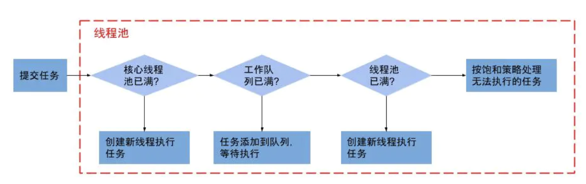

[TOC]

# 线程池

* 为什么需要线程池 ？ 线程池的应用范围 ？
    1. 线程的创建销毁是个消耗系统的操作
    2. 线程资源的复用

* 线程池应该具备哪些功能 ？

* 线程池的实现需要注意哪些细节 ？

## 常见类

### interface Executor

```java
public interface Executor {

    /**
     * Executes the given command at some time in the future.  The command
     * may execute in a new thread, in a pooled thread, or in the calling
     * thread, at the discretion of the {@code Executor} implementation.
     *
     * @param command the runnable task
     * @throws RejectedExecutionException if this task cannot be
     * accepted for execution
     * @throws NullPointerException if command is null
     */
    void execute(Runnable command);
}
```

### interface ExecutorService extends Executor

* execute() 执行任务
* shutdown() 调用后不再接收新任务，如果里面有任务，就执行完
* shutdownNow() 调用后不再接受新任务，如果有等待任务，移出队列；有正在执行的，尝试停止之
* isShutdown() 判断线程池是否关闭
* isTerminated() 判断线程池中任务是否执行完成
* submit() 提交任务
* invokeAll() 执行一组任务

## abstract class AbstractExecutorService implements ExecutorService

## class ThreadPoolExecutor extends AbstractExecutorService

### ThreadFactory

* 工厂模式
* ThreadFactory

```java
/**
     * The default thread factory
     */
    static class DefaultThreadFactory implements ThreadFactory {
        private static final AtomicInteger poolNumber = new AtomicInteger(1);
        private final ThreadGroup group;
        private final AtomicInteger threadNumber = new AtomicInteger(1);
        private final String namePrefix;

        DefaultThreadFactory() {
            SecurityManager s = System.getSecurityManager();
            group = (s != null) ? s.getThreadGroup() :
                                  Thread.currentThread().getThreadGroup();
            namePrefix = "pool-" +
                          poolNumber.getAndIncrement() +
                         "-thread-";
        }

        public Thread newThread(Runnable r) {
            Thread t = new Thread(group, r,
                                  namePrefix + threadNumber.getAndIncrement(),
                                  0);
            if (t.isDaemon())
                t.setDaemon(false);
            if (t.getPriority() != Thread.NORM_PRIORITY)
                t.setPriority(Thread.NORM_PRIORITY);
            return t;
        }
    }
```

### ThreadPoolExecutor 构造函数和成员含义

```java
public ThreadPoolExecutor(int corePoolSize,
                            int maximumPoolSize,
                            long keepAliveTime,
                            TimeUnit unit,
                            BlockingQueue<Runnable> workQueue) {
    this(corePoolSize, maximumPoolSize, keepAliveTime, unit, workQueue,
            Executors.defaultThreadFactory(), defaultHandler);
}

public ThreadPoolExecutor(int corePoolSize,
                            int maximumPoolSize,
                            long keepAliveTime,
                            TimeUnit unit,
                            BlockingQueue<Runnable> workQueue,
                            ThreadFactory threadFactory) {
    this(corePoolSize, maximumPoolSize, keepAliveTime, unit, workQueue,
            threadFactory, defaultHandler);
}

public ThreadPoolExecutor(int corePoolSize,
                            int maximumPoolSize,
                            long keepAliveTime,
                            TimeUnit unit,
                            BlockingQueue<Runnable> workQueue,
                            RejectedExecutionHandler handler) {
    this(corePoolSize, maximumPoolSize, keepAliveTime, unit, workQueue,
            Executors.defaultThreadFactory(), handler);
}

public ThreadPoolExecutor(int corePoolSize,
                            int maximumPoolSize,
                            long keepAliveTime,
                            TimeUnit unit,
                            BlockingQueue<Runnable> workQueue,
                            ThreadFactory threadFactory,
                            RejectedExecutionHandler handler) {
    if (corePoolSize < 0 ||
        maximumPoolSize <= 0 ||
        maximumPoolSize < corePoolSize ||
        keepAliveTime < 0)
        throw new IllegalArgumentException();
    if (workQueue == null || threadFactory == null || handler == null)
        throw new NullPointerException();
    this.acc = System.getSecurityManager() == null ?
            null :
            AccessController.getContext();
    this.corePoolSize = corePoolSize;
    this.maximumPoolSize = maximumPoolSize;
    this.workQueue = workQueue;
    this.keepAliveTime = unit.toNanos(keepAliveTime);
    this.threadFactory = threadFactory;
    this.handler = handler;
}
```

* `corePoolSize`: 指定了线程池中的基本线程数量，即在没有任务需要执行的时候线程池的大小，并且只有在工作队列满了的情况下才会创建超出这个数量的线程；在刚刚创建ThreadPoolExecutor的时候，线程并不会立即启动，而是要等到有任务提交时才会启动，除非调用了`prestartCoreThread/prestartAllCoreThreads`事先启动核心线程。再考虑到`keepAliveTime`和`allowCoreThreadTimeOut`超时参数的影响，所以没有任务需要执行的时候，线程池的大小不一定是corePoolSize

* `maximumPoolSize`: 指定了线程池中的最大线程数量，这个参数会根据你使用的workQueue任务队列的类型，决定线程池会开辟的最大线程数量

* `keepAliveTime`: 线程存活时间(在`corePoolSize<*<maximumPoolSize`情况下有用)；超过`corePoolSize`的多余的线程会在多长时间内被销毁；

* `unit`: keepAliveTime的单位

* `workQueue`: 阻塞任务队列，被添加到线程池中，但尚未被执行的任务；它一般分为:1.直接提交队列、2.有界任务队列、3.无界任务队列、4.优先任务队列(特殊的无界队列)几种；

* `threadFactory`: 线程工厂，用于创建线程，一般用默认即可；

* `handler`: 拒绝策略；当任务太多来不及处理时，如何拒绝任务；

* `workerCount`: 当前活跃的线程数(也即线程池中的线程数量)

### 线程池的处理流程图



```java
1、如果当前线程池的线程数还没有达到核心大小(poolSize < corePoolSize)，无论是否有空闲的线程都创建一个新的线程来处理新提交的任务；

2、如果当前线程池的线程数等于核心大小了(poolSize === corePoolSize),即核心工作线程已经满了，但任务队列未满时，就将新提交的任务提交到阻塞队列排队，等候处理workQueue.offer(command)；

3、如果任务队列满(先是队列满，然后是判断最大线程数有没有达到)

    3.1、当前poolSize<maximumPoolSize，那么就新增线程来处理任务；(这些新的线程在没有工作的时候，最长存活的最长时间为设置的keepAliveTime)

    3.2、当前poolSize=maximumPoolSize，那么意味着线程池的处理能力已经达到了极限，此时需要拒绝新增加的任务。至于如何拒绝处理新增的任务，取决于线程池的拒绝策略RejectedExecutionHandler。
```

## prestartAllCoreThreads 提前启动核心线程

```java
/**
 * Starts all core threads, causing them to idly wait for work. This
 * overrides the default policy of starting core threads only when
 * new tasks are executed.
 *
 * @return the number of threads started
 */
public int prestartAllCoreThreads() {
    int n = 0;
    while (addWorker(null, true))
        ++n;
    return n;
}
```

```java
/**
 * Starts a core thread, causing it to idly wait for work. This
 * overrides the default policy of starting core threads only when
 * new tasks are executed. This method will return {@code false}
 * if all core threads have already been started.
 *
 * @return {@code true} if a thread was started
 */
public boolean prestartCoreThread() {
    return workerCountOf(ctl.get()) < corePoolSize &&
        addWorker(null, true);
}
```

## 关闭线程池

### 手动调用shutdown方法

1. shutdown() 执行后停止接受新任务，会把队列的任务执行完毕。
2. shutdownNow() 也是停止接受新任务，但会中断所有的任务，将线程池状态变为stop。

### 线程池的自动关闭

1. 自动关闭线程池：核心线程数为 0 并指定线程存活时间

2. 通过 allowCoreThreadTimeOut 控制核心线程存活时间

```java
/**
    * Sets the policy governing whether core threads may time out and
    * terminate if no tasks arrive within the keep-alive time, being
    * replaced if needed when new tasks arrive. When false, core
    * threads are never terminated due to lack of incoming
    * tasks. When true, the same keep-alive policy applying to
    * non-core threads applies also to core threads. To avoid
    * continual thread replacement, the keep-alive time must be
    * greater than zero when setting {@code true}. This method
    * should in general be called before the pool is actively used.
    *
    * @param value {@code true} if should time out, else {@code false}
    * @throws IllegalArgumentException if value is {@code true}
    *         and the current keep-alive time is not greater than zero
    *
    * @since 1.6
    */
public void allowCoreThreadTimeOut(boolean value) {
    if (value && keepAliveTime <= 0)
        throw new IllegalArgumentException("Core threads must have nonzero keep alive times");
    if (value != allowCoreThreadTimeOut) {
        allowCoreThreadTimeOut = value;
        if (value)
            interruptIdleWorkers();
    }
}
```

3. 线程池中的线程设置为守护线程

## 拒绝策略

**线程池的拒绝策略**是指<font color='red'>当任务添加到线程池中被拒绝而采取的处理措施</font>

### 线程添加到线程池中被拒绝的原因

当任务添加到线程池中之所以被拒绝，可能是由于：第一线程池异常关闭；第二，任务数量超过线程池的最大限制,并设置有界的`workeQueue`

### 常见的几种拒绝策略

1. `ThreadPoolExecutor.AbortPolicy`:丢弃任务并抛出RejectedExecutionException异常。（**默认**）
2. `ThreadPoolExecutor.DiscardPolicy`：丢弃任务，但是不抛出异常。
3. `ThreadPoolExecutor.DiscardOldestPolicy`：丢弃队列最前面的任务，然后重新提交被拒绝的任务
4. `ThreadPoolExecutor.CallerRunsPolicy`：由调用线程（提交任务的线程）自己处理该任务

## 线程异常处理

<a href='https://blog.csdn.net/qq_26437925/article/details/127463372'>线程池中某个线程执行有异常，该如何处理？
</a>

## ThreadPoolExecutor 的使用例子

### ThreadPoolExecutor 实例1

```java
package com.threadpool;

import java.util.concurrent.*;
import java.util.concurrent.atomic.AtomicInteger;

/**
 * @Author mubi
 * @Date 2019/4/8 10:52 PM
 */
public class ThreadPoolUse {

    static class MyThreadFactory implements ThreadFactory {

        private AtomicInteger count = new AtomicInteger(0);

        @Override
        public Thread newThread(Runnable r) {
            Thread t = new Thread(r);
            String threadName = "MyThread" + count.addAndGet(1);
            System.out.println(threadName);
            t.setName(threadName);
            return t;
        }
    }

    static class MyTask implements Runnable{
        int id;
        MyTask(int id){
            this.id = id;
        }

        @Override
        public void run() {
           try{
               System.out.println("myTask id:" + id);
               TimeUnit.SECONDS.sleep(10);
           }catch (Exception e){
               e.printStackTrace();
           }
        }
    }

    public static void main(String[] args){

        int corePoolSize = 2;
        int maximumPoolSize = 4;
        int keepAliveTime = 2;
        TimeUnit timeUnit = TimeUnit.SECONDS;
        BlockingQueue<Runnable> workQueue = new ArrayBlockingQueue<>(1);
        RejectedExecutionHandler handler = new ThreadPoolExecutor.AbortPolicy();
        ThreadFactory threadFactory = new MyThreadFactory();

        ThreadPoolExecutor executor = new ThreadPoolExecutor(
                corePoolSize,
                maximumPoolSize,
                keepAliveTime,
                timeUnit,
                workQueue,
                threadFactory,
                handler);

        for(int i=0;i<6;i++) {
            MyTask task = new MyTask(i);
            executor.execute(task);
        }
        executor.shutdown();

    }

}
```

### 线程池使用后关闭问题？

是否需要关闭？如何关闭？

A pool that is no longer referenced in a program and has no remaining threads will be shutdown automatically.

如果程序中不再持有线程池的引用，并且线程池中没有线程时，线程池将会自动关闭。

注：<small>线程池中没有线程是指线程池中的所有线程都已运行完自动消亡，然而我们常用的`FixedThreadPool`的核心线程没有超时策略，所以并不会自动关闭。</small>

#### newFixedThreadPool

创建一个可重用固定线程数的线程池，以共享的无界队列方式来运行这些线程

```java
// 核心和最大线程数都是固定数，使用`LinkedBlockingQueue`队列
public static ExecutorService newFixedThreadPool(int nThreads) {
        return new ThreadPoolExecutor(nThreads, nThreads,
                                      0L, TimeUnit.MILLISECONDS,
                                      new LinkedBlockingQueue<Runnable>());
    }
```

```java
static void testFixPool(){
    while(true) {
        ExecutorService executorService = Executors.newFixedThreadPool(8);
        executorService.execute(() -> System.out.println("running"));
        executorService = null;
    }
}

public static void main(String[] args){
    testFixPool();
    System.out.println("main end");
}
```

* 因为固定线程池不会自己销毁，最终会耗尽内存（需要在合适的时候`shutdown`）

```java
running
running
running
running
running
Exception in thread "main" java.lang.OutOfMemoryError: unable to create new native thread
	at java.lang.Thread.start0(Native Method)
	at java.lang.Thread.start(Thread.java:717)
	at java.util.concurrent.ThreadPoolExecutor.addWorker(ThreadPoolExecutor.java:957)
	at java.util.concurrent.ThreadPoolExecutor.execute(ThreadPoolExecutor.java:1367)
	at com.threadpool.ThreadPoolUse.testFixPool(ThreadPoolUse.java:71)
	at com.threadpool.ThreadPoolUse.main(ThreadPoolUse.java:77)
```

#### CachedThreadPool

```java
static void testCachedThreadPool(){
    while(true) {
        // 默认keepAliveTime为 60s
        ExecutorService executorService = Executors.newCachedThreadPool();
        ThreadPoolExecutor threadPoolExecutor = (ThreadPoolExecutor) executorService;
        // 为了更好的模拟，动态修改为1纳秒
        threadPoolExecutor.setKeepAliveTime(1, TimeUnit.NANOSECONDS);
        threadPoolExecutor.execute(() -> System.out.println("running"));
        executorService = null;
    }
}

public static void main(String[] args){
    testCachedThreadPool();
    System.out.println("main end");
}
```

* 创建一个可根据需要创建新线程的线程池，但是在以前构造的线程可用时将重用它们，并在需要时使用提供的 ThreadFactory 创建新线程
* 线程池中数量没有固定，可达到最大值（Interger. MAX_VALUE）
* CachedThreadPool 的线程 keepAliveTime 默认为 60s，核心线程数量为 0 ，所以不会有核心线程存活阻止线程池自动关闭。详见 线程池之ThreadPoolExecutor构造；为了更快的模拟，构造后将 keepAliveTime 修改为1纳秒，相当于线程执行完马上会消亡，所以线程池可以被回收。实际开发中，如果CachedThreadPool确实忘记关闭，在一定时间后是可以被回收的，但仍然建议显示关闭。

```java
// 核心线程数为0，每次都必须新建线程，无法线程复用（空闲后会在60s后销毁)
// SynchronousQueue没有容量，是无缓冲等待队列，是一个不存储元素的阻塞队列，会直接将任务交给消费者，必须等队列中的添加元素被消费后才能继续添加新的元素。
public static ExecutorService newCachedThreadPool() {
        return new ThreadPoolExecutor(0, Integer.MAX_VALUE,
                                      60L, TimeUnit.SECONDS,
                                      new SynchronousQueue<Runnable>());
    }
```

#### newSingleThreadExecutor 单一无界顺序线程

作用：创建一个使用单个 worker 线程的 Executor，以无界队列方式来运行该线程。（注意，如果因为在关闭前的执行期间出现失败而终止了此单个线程，那么如果需要，一个新线程将代替它执行后续的任务）。可保证顺序地执行各个任务，并且在任意给定的时间不会有多个线程是活动的。

```java
// 核心，最大线程数都是1，使用`LinkedBlockingQueue`阻塞无界(这里指队列大小是Integer.MAX_VALUE)队列
public static ExecutorService newSingleThreadExecutor(ThreadFactory threadFactory) {
        return new FinalizableDelegatedExecutorService
            (new ThreadPoolExecutor(1, 1,
                                    0L, TimeUnit.MILLISECONDS,
                                    new LinkedBlockingQueue<Runnable>(),
                                    threadFactory));
    }
```

#### newScheduleThreadPool 延时/定期调度线程池

作用：创建一个线程池，它可安排在给定延迟后运行命令或者定期地执行。

特征：
    * 线程池中具有指定数量的线程，即便是空线程也将保留
    * 可定时或者延迟执行线程活动

创建方式：
    * Executors.newScheduledThreadPool(int corePoolSize)；// corePoolSize线程的个数
    * newScheduledThreadPool(int corePoolSize, ThreadFactory threadFactory)；// corePoolSize线程的个数，threadFactory创建线程的工厂

#### newSingleThreadScheduledExecutor

作用：创建一个单线程执行程序，它可安排在给定延迟后运行命令或者定期地执行。

特征：
    * 线程池中最多执行1个线程，之后提交的线程活动将会排在队列中以此执行
    * 可定时或者延迟执行线程活动

创建方式：
    * Executors.newSingleThreadScheduledExecutor() ；
    * Executors.newSingleThreadScheduledExecutor(ThreadFactory threadFactory) ；//threadFactory创建线程的工厂

代码例子eg:

```java
public class HookTest {

    static volatile boolean flag = true;

    static AtomicInteger i = new AtomicInteger(0);

    static ScheduledExecutorService service;

    public static void main(String[] args) throws Exception{

        Runnable runnable = new Runnable() {

            @Override
            public void run() {
                try {
                    int curVal = i.get();
                    System.out.println(curVal + "：" + flag);
                    if(curVal >= 10){
                        flag = false;
                    }else {
                        i.addAndGet(1);
                    }
                } catch (Exception e) {
                    System.out.println("发生异常");
                }

            }
        };

        service = Executors.newSingleThreadScheduledExecutor();
        service.scheduleAtFixedRate(runnable, 0, 1, TimeUnit.SECONDS);

        new Thread(new Runnable() {
            @Override
            public void run() {
                while (flag) {

                }
                service.shutdown();
                System.out.println("end:" + flag);
            }
        }).start();
    }

}
/*
0：true
1：true
2：true
3：true
4：true
5：true
6：true
7：true
8：true
9：true
10：true
end:false
*/
```

#### 线程池`shutdown`，`shutdownNow`

```java
package com.threadpool;

import java.util.concurrent.*;
import java.util.concurrent.atomic.AtomicInteger;

/**
 * @Author mubi
 * @Date 2019/4/8 10:52 PM
 */
public class ThreadPoolUse {

    static class MyThreadFactory implements ThreadFactory {

        private AtomicInteger count = new AtomicInteger(0);

        @Override
        public Thread newThread(Runnable r) {
            Thread t = new Thread(r);
            String threadName = "MyThread" + count.addAndGet(1);
            System.out.println(threadName);
            t.setName(threadName);
            return t;
        }
    }

    static class MyTask implements Runnable{
        int id;
        MyTask(int id){
            this.id = id;
        }

        @Override
        public void run() {
           try{
               System.out.println("myTask id:" + id);
               TimeUnit.SECONDS.sleep(10);
           }catch (Exception e){
               e.printStackTrace();
           }
        }
    }

    static void testFixPool(){
        while(true) {
            ExecutorService executorService = Executors.newFixedThreadPool(8);
            executorService.execute(() -> System.out.println("running"));
            executorService = null;
        }
    }

    static void testCachedThreadPool(){
        while(true) {
            // 默认keepAliveTime为 60s
            ExecutorService executorService = Executors.newCachedThreadPool();
            ThreadPoolExecutor threadPoolExecutor = (ThreadPoolExecutor) executorService;
            // 为了更好的模拟，动态修改为1纳秒
            threadPoolExecutor.setKeepAliveTime(1, TimeUnit.NANOSECONDS);
            threadPoolExecutor.execute(() -> System.out.println("running"));
            executorService = null;
        }
    }

    static class MyRejectPolicy implements RejectedExecutionHandler{
        @Override
        public void rejectedExecution(Runnable r, ThreadPoolExecutor executor) {
            if (r instanceof MyTask) {
                MyTask r1 = (MyTask) r;
                //直接打印
                System.out.println("Reject Thread:" + r1.id);
            }
        }
    }

    static void test(){
        int corePoolSize = 2;
        int maximumPoolSize = 5;
        int keepAliveTime = 60 * 1;
        TimeUnit timeUnit = TimeUnit.SECONDS;
        BlockingQueue<Runnable> workQueue = new ArrayBlockingQueue<>(2);
//        RejectedExecutionHandler handler = new ThreadPoolExecutor.AbortPolicy();
        RejectedExecutionHandler handler = new MyRejectPolicy();
        ThreadFactory threadFactory = new MyThreadFactory();

        ThreadPoolExecutor executor = new ThreadPoolExecutor(
                corePoolSize,
                maximumPoolSize,
                keepAliveTime,
                timeUnit,
                workQueue,
                threadFactory,
                handler);

        MyTask task = new MyTask(1);
        executor.execute(task);
        executor.shutdown();
        // 已经关闭的线程池，引用还在，再有新任务，会执行拒绝策略
        MyTask task2 = new MyTask(2);
        executor.execute(task2);
    }

    public static void main(String[] args){
        test();
        System.out.println("main end");
    }

}
```

## FutureTask & 线程池

```java
import java.util.ArrayList;
import java.util.List;
import java.util.Random;
import java.util.concurrent.Callable;
import java.util.concurrent.ExecutorService;
import java.util.concurrent.Executors;
import java.util.concurrent.FutureTask;

class Task implements Callable<Integer>{
    String name;

    public Task(String name) {
        this.name = name;
    }

    @Override
    public Integer call() throws Exception {
        Integer res = new Random().nextInt(100);
        Thread.sleep(1000);
        System.out.println("任务执行:获取到结果 :"+res);
        return  res;
    }

    public String getName() {
        return name;
    }
}

public class Solution {

    public void testFutureAndThreadPool(){
        // 线程池
        ExecutorService executorService = Executors.newFixedThreadPool(10);
        //进行异步任务列表
        List<FutureTask<Integer>> futureTasks = new ArrayList<>();
        long start = System.currentTimeMillis();
        int n = 10;
        for(int i=0;i<n;i++){
            Task task = new Task("name_" + i);
            //创建一个异步任务
            FutureTask<Integer> futureTask = new FutureTask<>(task);
            futureTasks.add(futureTask);
            //提交异步任务到线程池，让线程池管理任务。
            //由于是异步并行任务，所以这里并不会阻塞
            executorService.submit(futureTask);
        }
        int count = 0;
        for (FutureTask<Integer> futureTask : futureTasks) {
            // get()
            // get(long timeout, TimeUnit unit) 第一个参数为最大等待时间，第二个为时间的单位
            try{
                count += futureTask.get();
            }catch (Exception e){
                e.printStackTrace();
            }
        }
        //清理线程池
        executorService.shutdown();

        long end = System.currentTimeMillis();
        System.out.println("线程池的任务全部完成:结果为:"+count+"，main线程关闭，进行线程的清理");
        System.out.println("使用时间："+(end-start)+"ms");
    }

    public void testLine(){
        long start = System.currentTimeMillis();
        int n = 10;
        int count = 0;
        for(int i=0;i<n;i++){
            Task task = new Task("name_" + i);
            try{
                count += task.call();
            }catch (Exception e){
                e.printStackTrace();
            }
        }
        long end = System.currentTimeMillis();
        System.out.println("线程池的任务全部完成:结果为:"+count+"，main线程关闭，进行线程的清理");
        System.out.println("使用时间："+(end-start)+"ms");
        //清理线程池
    }

    public static void main(String[] args) {
        Solution solution = new Solution();
        solution.testFutureAndThreadPool();
        solution.testLine();
        System.out.println("the end");
    }

}
```

### 线程池新进来的任务被拒绝

1. 线程池shutdown了，新进来的任务会被拒绝
2. 线程池用满了，且新进来的任务超过了任务队列大小，任务被拒绝

```java
import java.text.SimpleDateFormat;
import java.util.concurrent.*;
import java.util.concurrent.atomic.AtomicInteger;

/**
 * @Author mubi
 * @Date 2019/9/2 21:38
 */
public class ThreadPoolTest {
    static SimpleDateFormat df = new SimpleDateFormat("yyyy-MM-dd HH:mm:ss,SSS");

    static RejectedExecutionHandler defaultHandler = new RejectedExecutionHandler() {
        @Override
        public void rejectedExecution(Runnable r, ThreadPoolExecutor e) {
            throw new RejectedExecutionException("MyTest Task " + r.toString() +
                    " rejected from " +
                    e.toString());
        }
    };

    static AtomicInteger atomicInteger = new AtomicInteger(0);

    ThreadFactory threadFactory = new ThreadFactory() {
        @Override
        public Thread newThread(Runnable r) {
            Thread thread = new Thread(r);
            thread.setName("mythread-" + atomicInteger.get());
            atomicInteger.incrementAndGet();
            return thread;
        }
    };

    void test1(){
        ThreadPoolExecutor EXECUTOR =
                new ThreadPoolExecutor(5,
                        10,
                        3000L,
                        TimeUnit.MILLISECONDS,
                        new LinkedBlockingQueue<>(2),
                        threadFactory,
                        defaultHandler);
        int n = 2;
        for (int i = 0; i < n; i++) {
            // 使用前可以判断
//            if(!EXECUTOR.isShutdown()) {
            Thread t = threadFactory.newThread(new Runnable() {
                @Override
                public void run() {
                    System.out.println("Hello World");
                    try{
                        TimeUnit.SECONDS.sleep(5);
                    }catch (Exception e){

                    }
                    System.out.println("Hello World2");
                }
            });
            EXECUTOR.execute(t);
//            }else {
//                System.out.println("executor already shutdown");
//            }
            EXECUTOR.shutdown();
        }
    }

    void test2(){
        ThreadPoolExecutor EXECUTOR =
                new ThreadPoolExecutor(5,
                        10,
                        3000L,
                        TimeUnit.MILLISECONDS,
                        new LinkedBlockingQueue<>(2),
                        threadFactory,
                        defaultHandler
                );
        int n = 15;
        for (int i = 0; i < n; i++) {
            final int tmpint = i;
            EXECUTOR.execute(new Runnable() {
                @Override
                public void run() {
                    try {
                        System.out.println(tmpint+"Hello World");
                        TimeUnit.MILLISECONDS.sleep(1000L);
                    } catch (InterruptedException e) {
                    }
                }
            });
        }
        EXECUTOR.shutdown();
    }

    public static void main(final String[] args) throws Exception {
        ThreadPoolTest threadPoolTest = new ThreadPoolTest();
        threadPoolTest.test2();
        System.out.println("end main()");
    }

}
```

## ForkJoinPool(java.util.concurrent;)

```java
@sun.misc.Contended
public class ForkJoinPool extends AbstractExecutorService
```

ForkJoin思想：把一个任务拆分成多个“小任务”，把多个“小任务”放到多个处理器核心上并行执行；当多个“小任务”执行完成之后，再将这些执行结果合并起来即可

* fork

n. 餐叉; 叉(挖掘用的园艺工具); (道路、河流等的) 分岔处，分流处，岔口，岔路;
v. 分岔; 岔开两条分支; 走岔路中的一条; 叉运; 叉掘;

* join

v. 连接; 接合; 联结; 结合; 联合; 汇合; 成为…的一员; 参加; 加入;
n. 结合; 连接; 接合点;

### new ForkJoinPool()

```java
public ForkJoinPool() {
        this(Math.min(MAX_CAP, Runtime.getRuntime().availableProcessors()),
             defaultForkJoinWorkerThreadFactory, null, false);
    }
```

```java
/**
    * Creates a {@code ForkJoinPool} with the given parameters, without
    * any security checks or parameter validation.  Invoked directly by
    * makeCommonPool.
    */
private ForkJoinPool(int parallelism,
                        ForkJoinWorkerThreadFactory factory,
                        UncaughtExceptionHandler handler,
                        int mode,
                        String workerNamePrefix) {
    this.workerNamePrefix = workerNamePrefix;
    this.factory = factory;
    this.ueh = handler;
    this.config = (parallelism & SMASK) | mode;
    long np = (long)(-parallelism); // offset ctl counts
    this.ctl = ((np << AC_SHIFT) & AC_MASK) | ((np << TC_SHIFT) & TC_MASK);
}
```

默认线程数量是：`Runtime.getRuntime().availableProcessors()`(1个cpu，2核，超线程数2，返回4)

### ForkJoinTask

```java
public abstract class ForkJoinTask<V> implements Future<V>, Serializable {
```

Abstract base class for tasks that run within a `ForkJoinPool`. A `ForkJoinTask` is a thread-like entity that is much lighter weight than a normal thread. Huge numbers of tasks and subtasks may be hosted by a small number of actual threads in a ForkJoinPool, at the price of some usage limitations.

### 例子代码

```java
public class ForkJoinTaskExample extends RecursiveTask<Integer> {

    public static final int threshold = 2;
    private int start;
    private int end;

    public ForkJoinTaskExample(int start, int end) {
        this.start = start;
        this.end = end;
    }

    @Override
    protected Integer compute() {
        int sum = 0;

        boolean canCompute = (end - start) <= threshold;
        if (canCompute) {
            for (int i = start; i <= end; i++) {
                sum += i;
            }
        } else {
            // 如果任务大于阈值，就分裂成两个子任务计算
            int middle = (start + end) / 2;
            ForkJoinTaskExample leftTask = new ForkJoinTaskExample(start, middle);
            ForkJoinTaskExample rightTask = new ForkJoinTaskExample(middle + 1, end);

            // 执行子任务
            leftTask.fork();
            rightTask.fork();
            // invokeAll(leftTask, rightTask);

            // 等待任务执行结束合并其结果
            int leftResult = leftTask.join();
            int rightResult = rightTask.join();

            // 合并子任务
            sum = leftResult + rightResult;
        }
        return sum;
    }

    static void testForkJoinPool() throws Exception{
        ForkJoinPool forkjoinPool = new ForkJoinPool();
        int sta = 1;
        int end = 100;
        //生成一个计算任务，计算连续区间范围的和
        ForkJoinTaskExample task = new ForkJoinTaskExample(sta, end);
        //执行一个任务
        Future<Integer> result = forkjoinPool.submit(task);
        System.out.println("result:" + result.get());
    }

    public static void main(String[] args) throws Exception{
        testForkJoinPool();

        TimeUnit.SECONDS.sleep(1);
    }
}
```
