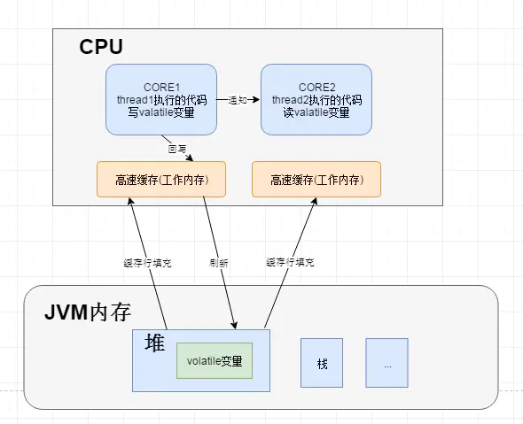

[TOC]

# volatile & synchronized

## 回顾并发的三大性质

### 原子性

一个操作或者多个操作，要么全部执行并且执行的过程不会被任何因素打断，要么就都不执行。即使是在多个线程一起执行的时候，一个操作一旦开始，就不会被其它线程干扰.

* `volatile`：不能保证原子性，
* `synchronized`：在作用对象的作用范围内，依赖JVM实现操作的原子性。
* `Lock`：依赖特殊的CPU指令，代码实现，如`ReentrantLock`

### 可见性

当多个线程访问同一个变量的时候，一旦线程修改了这个变量的值，其它线程能够立即看到修改的值。

#### volatile 可见性例子程序

```java
public class Main {

    private static volatile Boolean flag = true;

    public static void main(String[] args) throws Exception{

       new Thread(new Runnable() {
            @Override
            public void run() {
                while (flag) {

                }
                System.out.println("A end");
            }
        }).start();

        try{
            TimeUnit.SECONDS.sleep(2);
        }catch (Exception e){

        }
        flag = false;

        System.out.println("main end");
    }
}
```

#### 导致共享变量在线程间不可见的原因

1. 线程交叉执行
2. 代码重排序结合线程交叉执行
3. 共享变量更新后的值没有在工作内存与主内存之间及时更新

`volatile` 通过**加入内存屏障**,**禁止指令重排优化**来实现可见性和有序性

### 有序性 & 内存屏障

硬件层两个内存屏障：load barrier、store barrier；其有两个功能：
* 禁止屏障前后的指令重排序
* 强制把写缓冲区的的数据写入主内存

程序执行的顺序按照代码的先后顺序执行，**内存屏障**（JVM规范要求）

1. 每个volatile写操作的前面插入一个`StoreStore`屏障；
2. 在每个volatile写操作的后面插入一个`StoreLoad`屏障（**全能屏障**）；
3. 在每个volatile读操作的前面插入一个`LoadLoad`屏障；
4. 在每个volatile读操作的后面插入一个`LoadStore`屏障。

即如下

```java
StoreStore Barrier =》 写操作 =》 StoreLoad Barrier
LoadLoad Barrier =》 读操作 =》 LoadStore Barrier
```

屏障类型|指令示例|说明
-|-|-
LoadLoad Barriers | Load1;LoadLoad;Load2 | 该屏障确保Load1数据的装载先于Load2及其后所有装载指令的的操作
StoreStore Barriers | Store1;StoreStore;Store2 | 该屏障确保Store1立刻刷新数据到内存(使其对其他处理器可见)的操作先于Store2及其后所有存储指令的操作
LoadStore Barriers | Load1;LoadStore;Store2 | 确保Load1的数据装载先于Store2及其后所有的存储指令刷新数据到内存的操作
StoreLoad Barriers | Store1;StoreLoad;Load2 | 该屏障确保Store1立刻刷新数据到内存的操作先于Load2及其后所有装载装载指令的操作。它会使该屏障之前的所有内存访问指令(存储指令和访问指令)完成之后,才执行该屏障之后的内存访问指令

其中<font color='red'>StoreLoad Barriers</font>同时具备其他三个屏障的效果，因此也称之为全能屏障（mfence），是目前大多数处理器所支持的；但是相对其它屏障，该屏障的开销相对昂贵。

---

* Java内存模型中，允许**编译器**和**处理器**对指令进行重排序，但重排序过程不会影响到单线程程序的执行，却会影响到多线程并发执行的正确性(`CPU指令流水线`)

`volatile`、`syncronized`、`Lock`都可保证有序性。

<a target='_blank' href='https://blog.csdn.net/qq_30948019/article/details/80193392'>参考</a>

#### 指令乱序例子

```java
public class Main {

    static int x, y, a, b;

    public static void main(String[] args) throws Exception{
        int i = 0;
        while (true) {
            x = 0;
            y = 0;
            b = 0;
            a = 0;

            Thread A = new Thread(new Runnable() {
                @Override
                public void run() {
                    a = 1;
                    x = b;
                }
            });

            Thread B = new Thread(new Runnable() {
                @Override
                public void run() {
                    b = 1;
                    y = a;
                }
            });

            A.start();
            B.start();

            A.join();
            B.join();

            i++;
            if(x == 0 && y == 0){
                System.err.println(i + " " + x + " " + y);
                break;
            }
        }
        System.out.println("main end");
    }
}
```

#### double check 单例模式需要 volatile 吗？

正确答案：需要

`Object o = new Object();`的汇编指令

```java
0 new #2 <java/lang/Object>
3 dup
4 invokespecial #1 <java/lang/Object.<init>>
7 astore_1
8 return
```

隐含一个对象创建的过程：(记住3步)

1. 堆内存中申请了一块内存 （new指令）【半初始化状态，成员变量初始化为默认值】
2. 这块内存的构造方法执行（invokespecial指令）
3. 栈中变量建立连接到这块内存（astore_1指令）

<font color='red'>问题</font>：由于指令重排和半初始化状态，会导致多线程会使用半初始化的对象，即无法确保原子性

附：<a href="https://doctording.github.io/sword_at_offer/design_pattern/singleton.html" target="_blank">单例模式</a>

## 回顾 Java 内存模型

CPU -> 缓存 -> 主存 -> 线程工作内存

<a target='_blank' href='https://doctording.github.io/sword_at_offer/java_jvm/jvm_mem_model.html'>参考</a>


主内存与工作线程交互的操作有以下几种：

* lock（锁定）：作用于主内存的变量，它把一个变量标识为一条线程独占的状态
* unlock（解锁）：作用于主内存的变量，释放锁定状态的变量
* read（读取）：作用于主内存的变量，把一个变量从主内存传输到线程的工作内存中，以便随后的load动作使用
* load（载入）：作用于工作内存的变量，把read操作从主内存中得到的变量值放入工作内存的变量副本中。
* use（使用）：作用于工作内存的变量，把工作内存中一个变量的值传递给执行引擎，每当虚拟机遇到一个需要使用到变量的值的字节码指令时将会执行这个操作
* assign（赋值）：作用于工作内存的变量，把一个从执行引擎收到的值赋给工作内存的变量，每当虚拟机遇到一个给变量赋值的字节码指令时将会执行这个操作
* store（存储）：作用于工作内存的变量，把工作内存的一个变量值传送到主内存，以便随后的write操作使用
* write（写入）：作用于主内存的变量，把store操作从工作内存得到的变量的值放入主内存变量中。

虚拟机实现必须保证上面的每一种操作都是原子的

## volatile 使用场景

volatile 无`原子性`，需要充分利用其的`可见性`和`顺序性`

### 利用可见性 进行开关控制

一个线程改变共享遍历，其它线程立刻能感知到，并根据其值执行各自的逻辑

#### 可见性的底层原理

* 回顾CPU是如何执行java代码

`.java`编译成`.class`通过JVM加载，JVM是把`.class`翻译成为机器码指令，让CPU去执行



当内核运行的线程执行一段代码时，首先要将这段代码的指令集填充到高速缓存，若是变量被CPU修改后，会将修改的值刷新到高速缓存，然后在刷新到内存中。此时若另一个内核使用这个变量，这个变量依然是旧的。

而volatile关键字解决的问题就是：当一个线程写入该值后，另一个线程读取的必定是新值。volatile保证了修饰的共享变量在转换为汇编语言时，会加上一个以lock为前缀的指令，当CPU发现这个指令时，立即会做两件事情：

1. 将当前内核中线程工作内存中该共享变量刷新到主存；（强制会写主内存）
2. 通知其它CPU内核里缓存的该共享变量内存地址无效；（一般是缓存行失效）

基于MESI协议：MESI协议在早期的CPU中，是通过在总线加LOCK#锁的方式实现的，但这种方式开销太大，所以Intel开发了`缓存一致性协议`，也就是MESI协议；该解决缓存一致性的大致思路是：当CPU写数据时，如果发现操作的变量是共享变量，即在其它CPU中也存在该变量的副本，那么它会发出信号通知其它CPU将该变量的`缓存行`设置为无效状态。当其它CPU使用这个变量时，首先会去嗅探是否有对该变量更改的信号，当发现这个变量的缓存行已经无效时，会重新从内存中读取这个变量。

### 利用顺序性

```java
线程A：
content = initContent();    //(1)
isInit = true;              //(2)
```

```java
线程B
while (isInit) {            //(3)
    content.operation();    //(4)
}
```

### Singleton 设计模式的 double-check 也是利用了顺序性的特点

<a target='_blank' href='https://doctording.github.io/sword_at_offer/java_utils/Singleton.html'>参考:单例模式</a>

```java
instance= new Singleton()

memory = allocate();    //1：分配对象的内存空间
ctorInstance(memory);  //2：初始化对象
instance = memory;     //3：设置instance指向刚分配的内存地址

可能指令重排

memory = allocate();    //1：分配对象的内存空间
instance = memory;     //3：instance指向刚分配的内存地址，此时对象还未初始化
ctorInstance(memory);  //2：初始化对象
```
