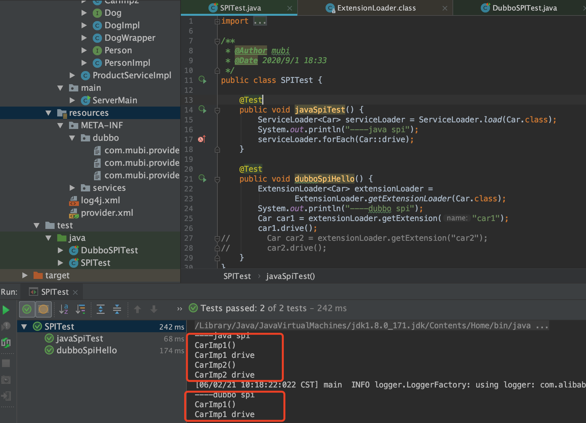

[TOC]

# SPI



实现原理步骤

1. 读取META-INF/services/下的配置文件，获得所有能被实例化的类的名称(ServiceLoader可以跨越jar包获取META-INF下的配置文件，具体加载配置的实现代码如下)

```java
try {
    String fullName = PREFIX + service.getName();
    if (loader == null)
        configs = ClassLoader.getSystemResources(fullName);
    else
        configs = loader.getResources(fullName);
} catch (IOException x) {
    fail(service, "Error locating configuration files", x);
}
```

2. 通过反射方法Class.forName()加载类对象，并将类实例化

```java
class SystemClassLoaderAction
    implements PrivilegedExceptionAction<ClassLoader> {
    private ClassLoader parent;

    SystemClassLoaderAction(ClassLoader parent) {
        this.parent = parent;
    }

    public ClassLoader run() throws Exception {
        String cls = System.getProperty("java.system.class.loader");
        if (cls == null) {
            return parent;
        }

        Constructor<?> ctor = Class.forName(cls, true, parent)
            .getDeclaredConstructor(new Class<?>[] { ClassLoader.class });
        ClassLoader sys = (ClassLoader) ctor.newInstance(
            new Object[] { parent });
        Thread.currentThread().setContextClassLoader(sys);
        return sys;
    }
}
```

3. 把实例化后的类缓存到providers对象中，(LinkedHashMap<String,S>类型）然后返回实例对象。

## Java SPI缺点

1. 不能按需加载。虽然 ServiceLoader 做了延迟载入，但是基本只能通过遍历全部获取，也就是接口的实现类得全部载入并实例化一遍。如果你并不想用某些实现类，或者某些类实例化很耗时，它也被载入并实例化了，这就造成了浪费。
2. 获取某个实现类的方式不够灵活，只能通过 Iterator 形式获取，不能根据某个参数来获取对应的实现类。
3. 多个并发多线程使用 ServiceLoader 类的实例是不安全的。
4. 加载不到实现类时抛出并不是真正原因的异常，错误很难定位。
